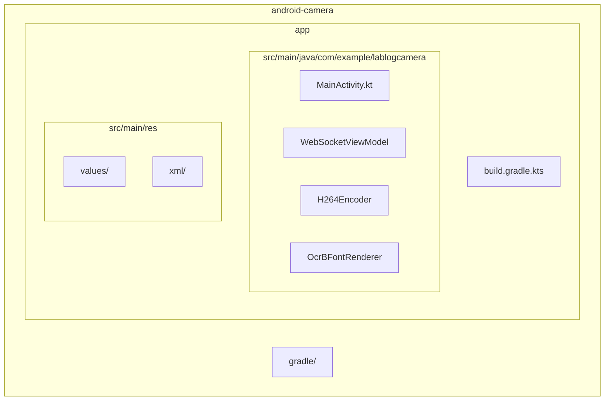
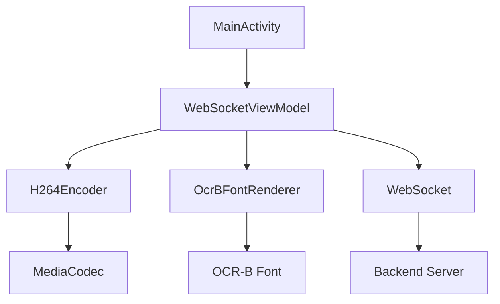
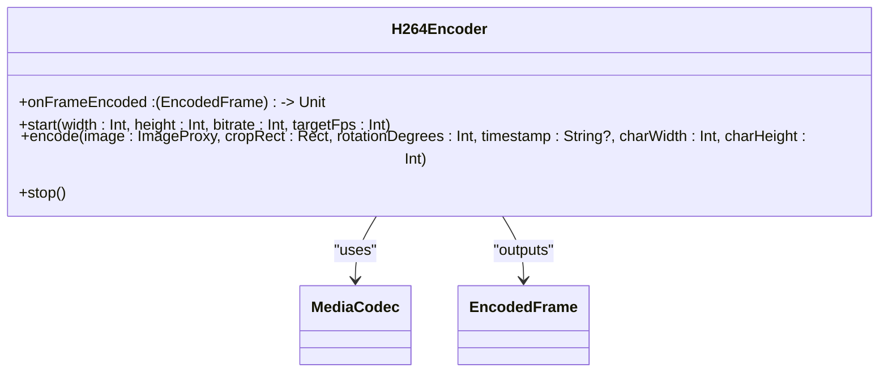
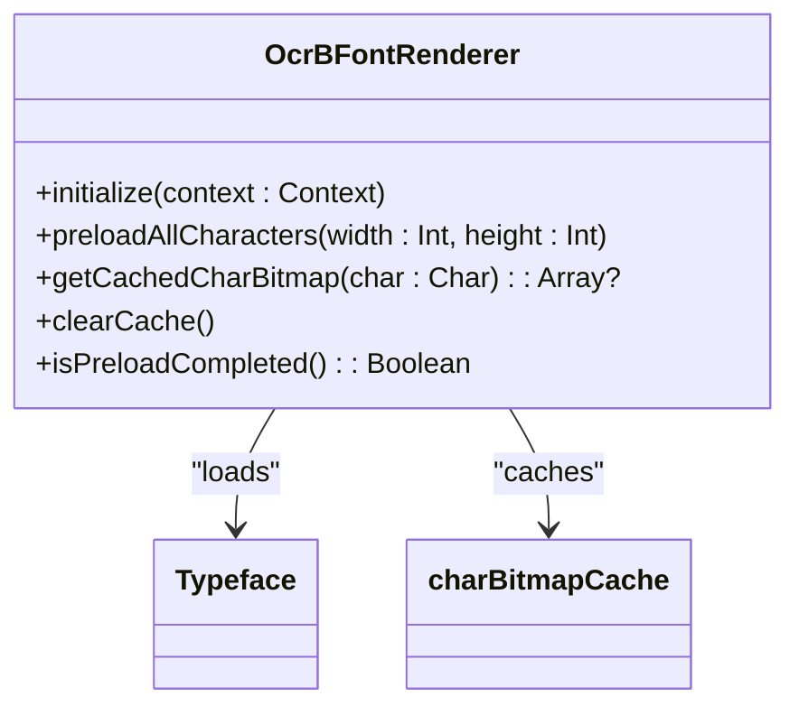
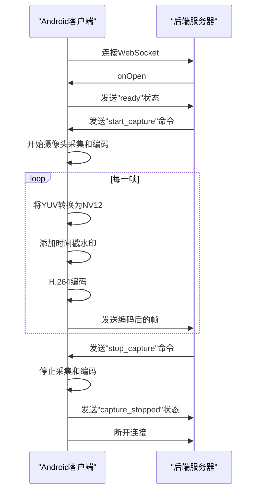
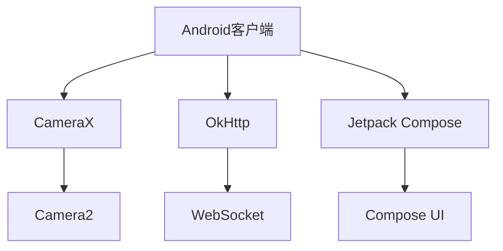

# Android客户端

<cite>
**本文档引用的文件**   
- [MainActivity.kt](file://android-camera/app/src/main/java/com/example/lablogcamera/MainActivity.kt)
- [AndroidManifest.xml](file://android-camera/app/src/main/AndroidManifest.xml)
- [build.gradle.kts](file://android-camera/app/build.gradle.kts)
- [network_security_config.xml](file://android-camera/app/src/main/res/xml/network_security_config.xml)
- [strings.xml](file://android-camera/app/src/main/res/values/strings.xml)
</cite>

## 目录
1. [简介](#简介)
2. [项目结构](#项目结构)
3. [核心组件](#核心组件)
4. [架构概述](#架构概述)
5. [详细组件分析](#详细组件分析)
6. [依赖分析](#依赖分析)
7. [性能考虑](#性能考虑)
8. [故障排除指南](#故障排除指南)
9. [结论](#结论)

## 简介
本文档详细介绍了Android客户端的实现，重点涵盖使用CameraX API进行摄像头预览和采集、使用MediaCodec进行H.264硬件编码、通过WebSocket与后端通信的机制。文档还深入探讨了OcrBFontRenderer如何为视频帧添加时间戳水印，以及其与H264Encoder和WebSocketViewModel的调用关系。此外，文档记录了公共接口、参数和返回值，解决了权限处理和编码器配置等常见实现问题，并为初学者提供了使用示例，为经验丰富的开发者提供了性能优化技巧。

## 项目结构
Android客户端项目采用标准的Android项目结构，主要功能集中在`android-camera`模块中。项目使用Kotlin语言和Jetpack Compose进行UI开发，依赖CameraX库进行摄像头操作，OkHttp库进行网络通信。项目的入口点是`MainActivity.kt`，它负责初始化UI和ViewModel。`AndroidManifest.xml`文件声明了应用所需的权限和组件。`build.gradle.kts`文件定义了项目的依赖关系和构建配置。

**Diagram sources**
- [MainActivity.kt](file://android-camera/app/src/main/java/com/example/lablogcamera/MainActivity.kt)
- [build.gradle.kts](file://android-camera/app/build.gradle.kts)

**Section sources**
- [MainActivity.kt](file://android-camera/app/src/main/java/com/example/lablogcamera/MainActivity.kt)
- [build.gradle.kts](file://android-camera/app/build.gradle.kts)

## 核心组件
Android客户端的核心组件包括`MainActivity`、`WebSocketViewModel`、`H264Encoder`和`OcrBFontRenderer`。`MainActivity`是应用的入口点，负责设置UI并连接`WebSocketViewModel`。`WebSocketViewModel`管理WebSocket连接和摄像头分析的生命周期。`H264Encoder`封装了MediaCodec，负责将YUV图像数据编码为H.264格式。`OcrBFontRenderer`负责加载OCR-B字体并渲染字符位图，用于在视频帧上添加时间戳水印。

**Section sources**
- [MainActivity.kt](file://android-camera/app/src/main/java/com/example/lablogcamera/MainActivity.kt)

## 架构概述
Android客户端采用MVVM（Model-View-ViewModel）架构模式。`MainActivity`作为View层，负责展示UI和用户交互。`WebSocketViewModel`作为ViewModel层，负责管理应用的业务逻辑和状态。`H264Encoder`和`OcrBFontRenderer`作为Model层，提供具体的业务功能。客户端通过CameraX API获取摄像头预览数据，使用`H264Encoder`进行硬件编码，然后通过WebSocket将编码后的视频流发送到后端服务器。

**Diagram sources**
- [MainActivity.kt](file://android-camera/app/src/main/java/com/example/lablogcamera/MainActivity.kt)

## 详细组件分析

### H264Encoder分析
`H264Encoder`类封装了Android平台的MediaCodec，用于将YUV图像数据编码为H.264格式。它通过`start()`方法进行一次性配置，包括分辨率、码率和目标帧率。`encode()`方法接收CameraX的ImageProxy，完成YUV到NV12的转换并送入编码器。编码输出通过回调`onFrameEncoded`向外传递。

**Diagram sources**
- [MainActivity.kt](file://android-camera/app/src/main/java/com/example/lablogcamera/MainActivity.kt#L187-L276)

### OcrBFontRenderer分析
`OcrBFontRenderer`对象负责加载OCR-B字体并渲染字符位图。它在应用启动时预加载所有时间戳所需的字符，以提高渲染效率。`initialize()`方法加载字体，`preloadAllCharacters()`方法预加载字符位图，`getCachedCharBitmap()`方法获取缓存的字符位图。

**Diagram sources**
- [MainActivity.kt](file://android-camera/app/src/main/java/com/example/lablogcamera/MainActivity.kt#L305-L458)

### WebSocket通信流程
客户端与后端的通信流程如下：客户端连接WebSocket服务器后，发送`ready`状态。服务器发送`start_capture`命令，客户端开始采集视频并编码。编码后的H.264数据通过WebSocket发送到服务器。服务器发送`stop_capture`命令，客户端停止采集并发送`capture_stopped`状态。

**Diagram sources**
- [MainActivity.kt](file://android-camera/app/src/main/java/com/example/lablogcamera/MainActivity.kt#L867-L998)

## 依赖分析
Android客户端的主要依赖包括CameraX、OkHttp和Jetpack Compose。CameraX用于简化摄像头操作，OkHttp用于WebSocket通信，Jetpack Compose用于构建现代化的UI。这些依赖通过`build.gradle.kts`文件中的依赖声明进行管理。

**Diagram sources**
- [build.gradle.kts](file://android-camera/app/build.gradle.kts#L44-L68)

**Section sources**
- [build.gradle.kts](file://android-camera/app/build.gradle.kts#L44-L68)

## 性能考虑
在性能方面，客户端通过预加载OCR-B字体字符位图来减少实时渲染的开销。使用MediaCodec进行硬件编码可以显著降低CPU占用率。通过WebSocket发送二进制数据而不是文本数据，可以减少网络传输的开销。此外，客户端在采集视频时保持屏幕常亮，避免因屏幕关闭导致的采集中断。

## 故障排除指南
常见问题包括权限处理和编码器配置。确保在`AndroidManifest.xml`中声明了`CAMERA`和`INTERNET`权限。在`network_security_config.xml`中配置了明文流量允许，以支持WebSocket连接。编码器配置时，确保分辨率和码率在设备支持的范围内。如果遇到编码失败，检查输入缓冲区大小是否足够。

**Section sources**
- [AndroidManifest.xml](file://android-camera/app/src/main/AndroidManifest.xml#L5-L7)
- [network_security_config.xml](file://android-camera/app/src/main/res/xml/network_security_config.xml#L3-L5)

## 结论
Android客户端通过CameraX、MediaCodec和WebSocket实现了高效的视频采集、编码和传输。OcrBFontRenderer为视频帧添加了时间戳水印，增强了视频的可追溯性。通过合理的架构设计和性能优化，客户端能够稳定地与后端服务器通信，满足实时视频传输的需求。