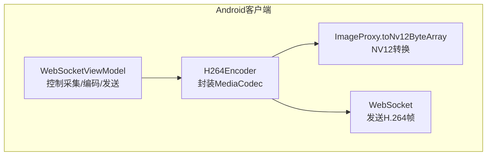
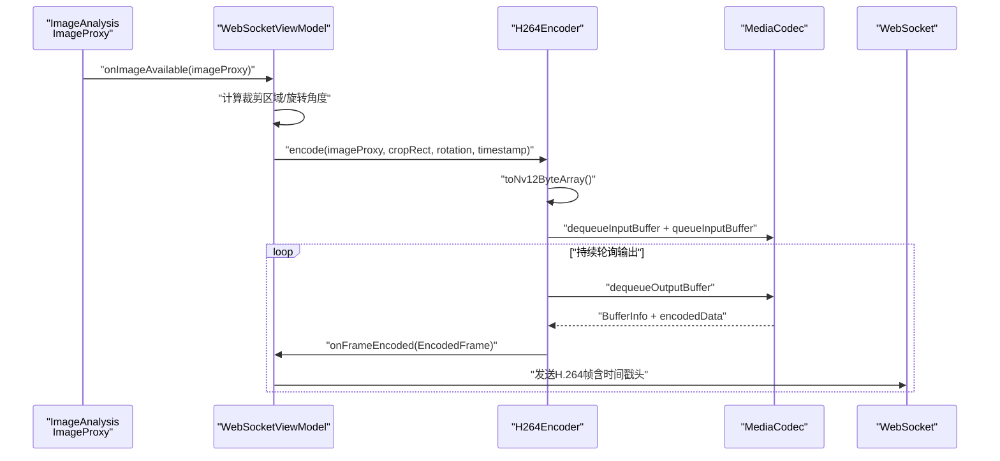
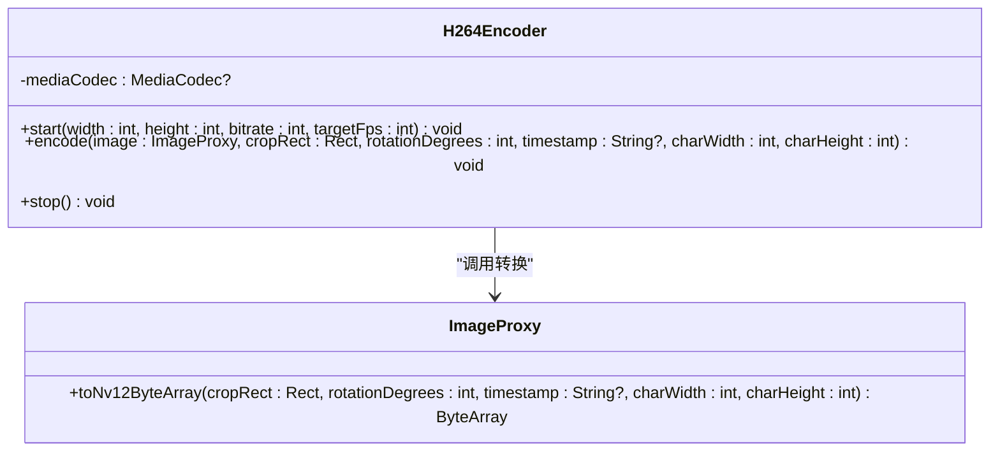
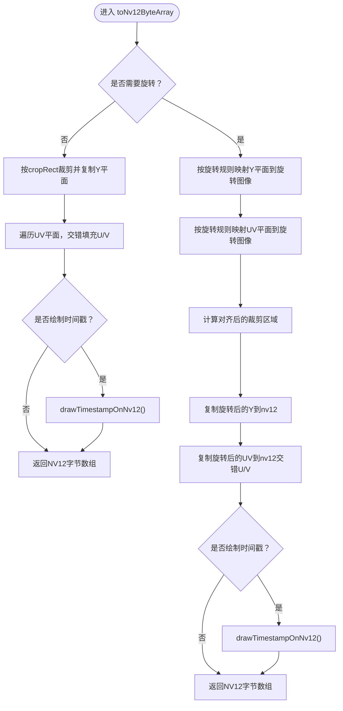

# H.264硬件编码

<cite>
**本文引用的文件**
- [MainActivity.kt](file://android-camera/app/src/main/java/com/example/lablogcamera/MainActivity.kt)
</cite>

## 目录
1. [简介](#简介)
2. [项目结构](#项目结构)
3. [核心组件](#核心组件)
4. [架构总览](#架构总览)
5. [详细组件分析](#详细组件分析)
6. [依赖关系分析](#依赖关系分析)
7. [性能考量](#性能考量)
8. [故障排查指南](#故障排查指南)
9. [结论](#结论)
10. [附录](#附录)

## 简介
本文件围绕Android客户端H.264硬件编码展开，重点解析H264Encoder类的实现原理与使用方式，涵盖以下关键主题：
- 如何使用MediaCodec创建AVC编码器
- 配置KEY_COLOR_FORMAT为COLOR_FormatYUV420SemiPlanar以支持NV12格式输入
- 设置码率、帧率和I帧间隔
- encode()方法中从ImageProxy到NV12字节数组的转换流程
- 输入缓冲区排队与输出缓冲区处理机制
- presentationTimeUs时间戳来源及其在视频同步中的作用
- start()与stop()生命周期管理最佳实践
- 常见异常（如BufferOverflow）的处理策略
- 为初学者提供的编码流程图解，为经验开发者提供的性能优化技巧

## 项目结构
本仓库包含Android客户端工程，H.264编码相关的核心逻辑集中在MainActivity.kt中，涉及：
- H264Encoder：封装MediaCodec进行H.264编码
- ImageProxy扩展函数toNv12ByteArray：将CameraX YUV_420_888三平面数据转换为NV12半平面布局
- WebSocketViewModel：负责与服务器交互、控制ImageAnalysis与编码器的生命周期



图表来源
- [MainActivity.kt](file://android-camera/app/src/main/java/com/example/lablogcamera/MainActivity.kt#L180-L276)
- [MainActivity.kt](file://android-camera/app/src/main/java/com/example/lablogcamera/MainActivity.kt#L1465-L1659)

章节来源
- [MainActivity.kt](file://android-camera/app/src/main/java/com/example/lablogcamera/MainActivity.kt#L180-L276)
- [MainActivity.kt](file://android-camera/app/src/main/java/com/example/lablogcamera/MainActivity.kt#L1465-L1659)

## 核心组件
- H264Encoder
  - 负责创建、配置与启动MediaCodec H.264编码器
  - 提供start(width,height,bitrate,targetFps)、encode(image,cropRect,rotationDegrees,...)、stop()接口
  - 关键配置项：COLOR_FormatYUV420SemiPlanar、KEY_BIT_RATE、KEY_FRAME_RATE、KEY_I_FRAME_INTERVAL
- ImageProxy.toNv12ByteArray
  - 将CameraX YUV_420_888三平面数据转换为NV12半平面布局
  - 支持旋转（0/90/180/270）与裁剪，确保UV对齐（偶数边界、32对齐）
  - 可选绘制时间戳水印（OCR-B字体）

章节来源
- [MainActivity.kt](file://android-camera/app/src/main/java/com/example/lablogcamera/MainActivity.kt#L180-L276)
- [MainActivity.kt](file://android-camera/app/src/main/java/com/example/lablogcamera/MainActivity.kt#L1465-L1659)

## 架构总览
下图展示了从ImageAnalysis到H.264编码再到WebSocket发送的整体流程。



图表来源
- [MainActivity.kt](file://android-camera/app/src/main/java/com/example/lablogcamera/MainActivity.kt#L944-L1191)
- [MainActivity.kt](file://android-camera/app/src/main/java/com/example/lablogcamera/MainActivity.kt#L180-L276)
- [MainActivity.kt](file://android-camera/app/src/main/java/com/example/lablogcamera/MainActivity.kt#L1465-L1659)

## 详细组件分析

### H264Encoder类分析
- 创建与配置
  - 使用MediaFormat.MIMETYPE_VIDEO_AVC创建编码器
  - 设置KEY_COLOR_FORMAT为COLOR_FormatYUV420SemiPlanar，确保与toNv12ByteArray输出一致
  - 设置KEY_BIT_RATE、KEY_FRAME_RATE、KEY_I_FRAME_INTERVAL
  - 调用configure(..., null, null, MediaCodec.CONFIGURE_FLAG_ENCODE)与start()
- 生命周期
  - start()：一次性配置并启动编码器
  - stop()：停止并释放MediaCodec资源
- 编码流程
  - encode()内部：
    - 调用toNv12ByteArray将ImageProxy转换为NV12字节数组
    - dequeueInputBuffer获取输入缓冲区索引，校验容量后put数据
    - 使用image.imageInfo.timestamp转换为presentationTimeUs（微秒）
    - queueInputBuffer入队
    - 循环dequeueOutputBuffer处理输出，提取encodedData并通过回调onFrameEncoded返回
- 异常处理
  - 对BufferOverflow进行容量检查，避免输入缓冲区不足导致崩溃
  - 捕获异常并记录日志，防止中断Analyzer



图表来源
- [MainActivity.kt](file://android-camera/app/src/main/java/com/example/lablogcamera/MainActivity.kt#L180-L276)
- [MainActivity.kt](file://android-camera/app/src/main/java/com/example/lablogcamera/MainActivity.kt#L1465-L1659)

章节来源
- [MainActivity.kt](file://android-camera/app/src/main/java/com/example/lablogcamera/MainActivity.kt#L180-L276)

### ImageProxy.toNv12ByteArray转换流程
- 基本流程
  - 从planes[0]/planes[1]/planes[2]读取Y/U/V平面数据
  - Y平面逐行复制到nv12的前半部分
  - UV平面按像素步幅与行步幅提取，交错填充U、V到nv12后半部分
  - 可选绘制时间戳水印（OCR-B字体）
- 支持旋转与裁剪
  - 若rotationDegrees为0：直接按cropRect裁剪并复制
  - 若非0：先将Y与UV平面按旋转规则映射到旋转后的图像，再从旋转图像中裁剪对齐后的区域
  - 所有坐标/尺寸强制偶数并对齐到32的倍数，避免硬件编码器伪影
- 性能与稳定性
  - 使用System.arraycopy与直接索引访问，减少拷贝次数
  - 对UV平面按2x2块旋转，保证UV交错顺序正确



图表来源
- [MainActivity.kt](file://android-camera/app/src/main/java/com/example/lablogcamera/MainActivity.kt#L1465-L1659)

章节来源
- [MainActivity.kt](file://android-camera/app/src/main/java/com/example/lablogcamera/MainActivity.kt#L1465-L1659)

### 编码参数与配置要点
- 颜色格式
  - KEY_COLOR_FORMAT设置为COLOR_FormatYUV420SemiPlanar，与NV12布局一致
- 码率与帧率
  - KEY_BIT_RATE：以bps为单位
  - KEY_FRAME_RATE：用于编码器内部参考，实际发送帧率由上层Analyzer控制
- I帧间隔
  - KEY_I_FRAME_INTERVAL：设置为1表示每秒一个I帧
- 时间戳
  - 输入时间戳presentationTimeUs来源于ImageProxy.imageInfo.timestamp（纳秒→微秒）
  - 输出时间戳bufferInfo.presentationTimeUs同样以微秒为单位

章节来源
- [MainActivity.kt](file://android-camera/app/src/main/java/com/example/lablogcamera/MainActivity.kt#L191-L203)
- [MainActivity.kt](file://android-camera/app/src/main/java/com/example/lablogcamera/MainActivity.kt#L232-L245)

### 生命周期管理最佳实践
- start()
  - 在首次收到有效裁剪区域与旋转角度后调用，确保编码器尺寸与旋转状态稳定
  - 参数包括最终编码分辨率（旋转+裁剪后的尺寸）、码率、目标帧率
- encode()
  - 在ImageAnalysis的Analyzer回调中调用，避免阻塞
  - 对BufferOverflow进行容量检查，必要时丢弃帧
- stop()
  - 停止ImageAnalysis，停止并释放编码器
  - 清理裁剪区域与统计计数，避免状态泄漏

章节来源
- [MainActivity.kt](file://android-camera/app/src/main/java/com/example/lablogcamera/MainActivity.kt#L1144-L1149)
- [MainActivity.kt](file://android-camera/app/src/main/java/com/example/lablogcamera/MainActivity.kt#L1203-L1226)
- [MainActivity.kt](file://android-camera/app/src/main/java/com/example/lablogcamera/MainActivity.kt#L266-L275)

### 常见异常与处理策略
- BufferOverflow
  - 现象：输入缓冲区容量小于NV12字节数组大小
  - 处理：在queueInputBuffer前检查capacity与yuvBytes.size，若不足则记录日志并跳过该帧
- 编码器异常
  - try/catch捕获异常，记录错误日志，避免中断Analyzer
- 资源释放
  - stop()中确保stop()与release()调用，防止MediaCodec资源泄漏

章节来源
- [MainActivity.kt](file://android-camera/app/src/main/java/com/example/lablogcamera/MainActivity.kt#L236-L241)
- [MainActivity.kt](file://android-camera/app/src/main/java/com/example/lablogcamera/MainActivity.kt#L261-L264)
- [MainActivity.kt](file://android-camera/app/src/main/java/com/example/lablogcamera/MainActivity.kt#L266-L275)

## 依赖关系分析
- H264Encoder依赖
  - MediaCodec：创建、配置、输入/输出缓冲区管理
  - ImageProxy扩展函数：toNv12ByteArray
  - WebSocketViewModel回调：onFrameEncoded
- ImageProxy扩展函数依赖
  - CameraX ImageProxy的planes与stride/pixelStride
  - OCR-B字体渲染器：绘制时间戳水印

```mermaid
graph LR
MC["MediaCodec"] <- --> ENC["H264Encoder"]
IMG["ImageProxy.toNv12ByteArray"] <- --> ENC
VM["WebSocketViewModel"] <- --> ENC
OCR["OcrBFontRenderer"] <- --> IMG
```

图表来源
- [MainActivity.kt](file://android-camera/app/src/main/java/com/example/lablogcamera/MainActivity.kt#L180-L276)
- [MainActivity.kt](file://android-camera/app/src/main/java/com/example/lablogcamera/MainActivity.kt#L1465-L1659)

章节来源
- [MainActivity.kt](file://android-camera/app/src/main/java/com/example/lablogcamera/MainActivity.kt#L180-L276)
- [MainActivity.kt](file://android-camera/app/src/main/java/com/example/lablogcamera/MainActivity.kt#L1465-L1659)

## 性能考量
- NV12转换优化
  - 使用System.arraycopy与直接索引访问，减少不必要的拷贝
  - 对UV平面按2x2块旋转，避免逐像素映射带来的开销
- 对齐与裁剪
  - 宽高对齐到32的倍数，确保硬件编码器高效处理
  - 偶数边界裁剪，避免UV平面错位导致的伪影
- 帧率控制
  - 上层Analyzer按目标帧率主动丢帧，降低CPU/GPU压力
  - 编码器KEY_FRAME_RATE仅作参考，实际发送速率由上层控制
- 时间戳一致性
  - 输入与输出时间戳均以微秒为单位，保证前后端时间轴一致

[本节为通用性能建议，不直接分析具体文件]

## 故障排查指南
- 无法创建编码器
  - 检查设备是否支持H.264硬件编码，确认MIME类型与颜色格式
  - 查看日志中的异常堆栈
- 帧丢失严重
  - 检查目标帧率设置与Analyzer丢帧逻辑
  - 确认裁剪区域与旋转角度是否频繁变化导致频繁重启编码器
- 色彩异常（绿/紫/条纹）
  - 确认toNv12ByteArray的UV交错顺序与对齐是否正确
  - 检查裁剪区域是否为偶数且对齐到32
- 时间戳不连续
  - 检查ImageProxy.imageInfo.timestamp来源与presentationTimeUs转换逻辑
  - 确认WebSocket发送的自定义帧头包含timestampMs字段

章节来源
- [MainActivity.kt](file://android-camera/app/src/main/java/com/example/lablogcamera/MainActivity.kt#L232-L245)
- [MainActivity.kt](file://android-camera/app/src/main/java/com/example/lablogcamera/MainActivity.kt#L1465-L1659)

## 结论
本实现以H264Encoder为核心，结合ImageProxy.toNv12ByteArray与MediaCodec，完成了从CameraX图像到H.264硬件编码的完整链路。通过严格的NV12转换、对齐与裁剪策略，以及对BufferOverflow与异常的防护，系统在保证质量的同时兼顾了稳定性与性能。配合上层Analyzer的帧率控制与WebSocket的可靠传输，能够满足移动端实时视频流的需求。

[本节为总结性内容，不直接分析具体文件]

## 附录
- 关键实现路径参考
  - H264Encoder.start/encode/stop：[MainActivity.kt](file://android-camera/app/src/main/java/com/example/lablogcamera/MainActivity.kt#L191-L275)
  - NV12转换（含旋转与裁剪）：[MainActivity.kt](file://android-camera/app/src/main/java/com/example/lablogcamera/MainActivity.kt#L1465-L1659)
  - 帧头与时间戳封装（WebSocket发送）：[MainActivity.kt](file://android-camera/app/src/main/java/com/example/lablogcamera/MainActivity.kt#L968-L984)