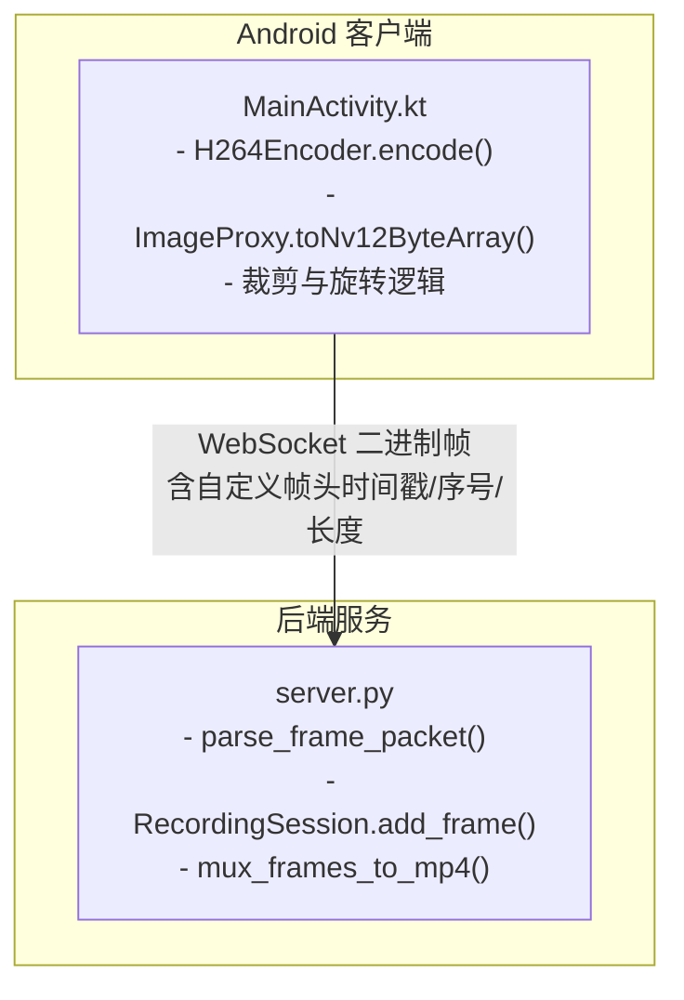
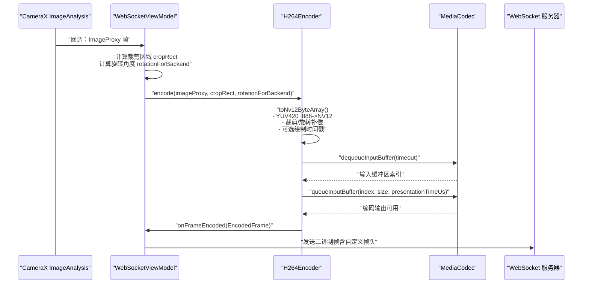
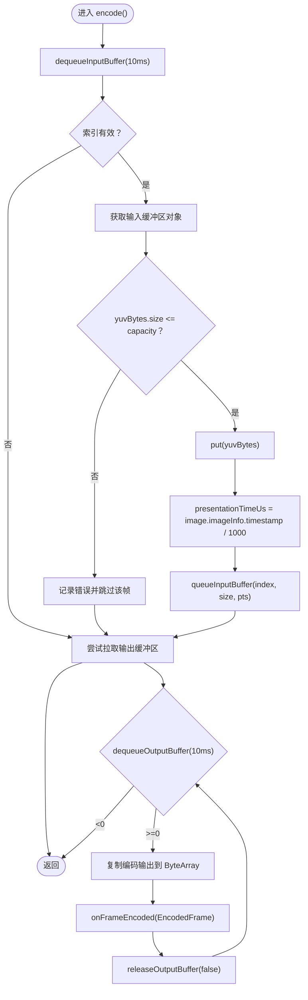
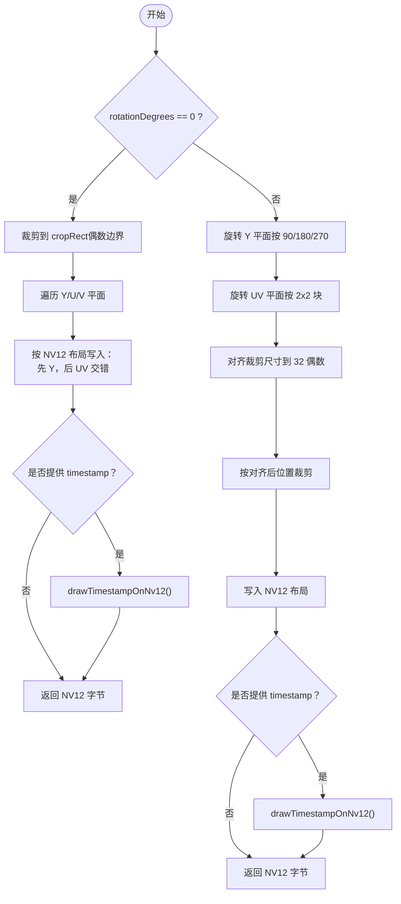
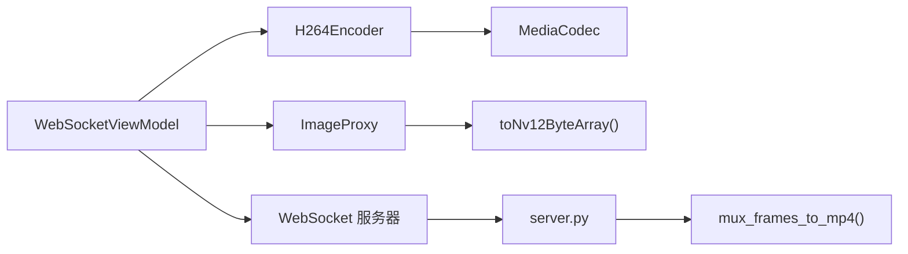

# 帧数据处理

<cite>
**本文引用的文件**
- [MainActivity.kt](file://android-camera/app/src/main/java/com/example/lablogcamera/MainActivity.kt)
- [server.py](file://backend/server.py)
- [README.md](file://backend/README.md)
</cite>

## 目录
1. [简介](#简介)
2. [项目结构](#项目结构)
3. [核心组件](#核心组件)
4. [架构总览](#架构总览)
5. [详细组件分析](#详细组件分析)
6. [依赖关系分析](#依赖关系分析)
7. [性能考量](#性能考量)
8. [故障排查指南](#故障排查指南)
9. [结论](#结论)
10. [附录](#附录)

## 简介
本文件围绕 Android 端 H.264 编码过程中的帧数据处理展开，重点解析以下内容：
- encode() 方法中从 CameraX 的 ImageProxy 到 NV12 字节数组的转换逻辑，涵盖 YUV420_888 到 NV12 的内存布局转换、裁剪区域（cropRect）的应用以及旋转补偿机制。
- dequeueInputBuffer 与 queueInputBuffer 的工作流程，解释 presentationTimeUs 时间戳来源（image.imageInfo.timestamp）及其在视频同步中的关键作用。
- 输入缓冲区容量检查机制以防止 BufferOverflow 异常的设计原理。
- 完整的帧处理流程图，展示从摄像头采集到编码器输入的完整路径。
- 常见问题（如帧丢失或时间戳错乱）的调试方法。

## 项目结构
本仓库包含 Android 客户端与后端服务两部分，其中与 H.264 编码直接相关的是 Android 客户端中的 H264Encoder 类与 ImageProxy 扩展函数，以及后端服务对裸 H.264 流的接收与封装。

图表来源
- [MainActivity.kt](file://android-camera/app/src/main/java/com/example/lablogcamera/MainActivity.kt#L180-L276)
- [MainActivity.kt](file://android-camera/app/src/main/java/com/example/lablogcamera/MainActivity.kt#L1450-L1660)
- [server.py](file://backend/server.py#L49-L78)
- [server.py](file://backend/server.py#L135-L147)
- [server.py](file://backend/server.py#L150-L179)

章节来源
- [MainActivity.kt](file://android-camera/app/src/main/java/com/example/lablogcamera/MainActivity.kt#L180-L276)
- [server.py](file://backend/server.py#L49-L78)

## 核心组件
- H264Encoder：封装 MediaCodec，负责配置编码器、将 NV12 字节流送入编码器输入缓冲区、拉取编码输出并回调上层。
- ImageProxy.toNv12ByteArray 扩展函数：将 YUV420_888 三平面数据转换为 NV12（Y + 交错 UV），支持裁剪与旋转补偿。
- WebSocketViewModel：负责与服务器交互、启动/停止采集、计算裁剪区域、控制帧率与旋转补偿、调用 H264Encoder.encode()。

章节来源
- [MainActivity.kt](file://android-camera/app/src/main/java/com/example/lablogcamera/MainActivity.kt#L180-L276)
- [MainActivity.kt](file://android-camera/app/src/main/java/com/example/lablogcamera/MainActivity.kt#L1450-L1660)
- [MainActivity.kt](file://android-camera/app/src/main/java/com/example/lablogcamera/MainActivity.kt#L1020-L1190)

## 架构总览
下图展示了从摄像头采集到编码器输入的关键路径，以及时间戳与帧率控制的要点。

图表来源
- [MainActivity.kt](file://android-camera/app/src/main/java/com/example/lablogcamera/MainActivity.kt#L1020-L1190)
- [MainActivity.kt](file://android-camera/app/src/main/java/com/example/lablogcamera/MainActivity.kt#L180-L276)
- [MainActivity.kt](file://android-camera/app/src/main/java/com/example/lablogcamera/MainActivity.kt#L1450-L1660)
- [server.py](file://backend/server.py#L135-L147)

## 详细组件分析

### H264Encoder.encode() 与 MediaCodec 输入/输出循环
- 输入缓冲区获取与容量检查
  - 通过 dequeueInputBuffer 获取输入缓冲区索引，超时时间用于避免阻塞。
  - 若返回索引有效，获取对应缓冲区并进行容量检查：若 yuvBytes.size > capacity，则拒绝该帧，避免 BufferOverflow。
- 时间戳 presentationTimeUs
  - 使用 image.imageInfo.timestamp（微秒）转换为毫秒级 presentationTimeUs，作为编码器输入时间戳。
  - 编码器输出 BufferInfo.presentationTimeUs 也用于上层回调的帧时间戳。
- 输出缓冲区处理
  - 循环 dequeueOutputBuffer，取出编码后的数据并通过回调传递。

图表来源
- [MainActivity.kt](file://android-camera/app/src/main/java/com/example/lablogcamera/MainActivity.kt#L217-L264)

章节来源
- [MainActivity.kt](file://android-camera/app/src/main/java/com/example/lablogcamera/MainActivity.kt#L217-L264)

### ImageProxy.toNv12ByteArray：YUV420_888 到 NV12 的转换与旋转补偿
- 基本流程
  - 从三平面（Y/U/V）读取数据，按 NV12 布局组织：先 Y 平面，后交错 UV 平面（U/V 交错）。
  - 支持裁剪：基于 cropRect（旋转后尺寸）进行子区域拷贝。
  - 支持旋转：当 rotationDegrees != 0 时，先对 Y 平面逐像素旋转，再对 UV 平面按 2x2 块旋转，最后按对齐后的尺寸裁剪。
- 关键点
  - 对齐：裁剪宽高对齐到 32 的偶数倍，确保硬件编码器兼容性。
  - 坐标对齐：cropRect 的 left/top/right/bottom 强制为偶数，UV 坐标按 2 对齐。
  - 时间戳水印：可选在 NV12 的 Y 平面绘制时间戳（OCR-B 字体缓存）。

图表来源
- [MainActivity.kt](file://android-camera/app/src/main/java/com/example/lablogcamera/MainActivity.kt#L1450-L1660)

章节来源
- [MainActivity.kt](file://android-camera/app/src/main/java/com/example/lablogcamera/MainActivity.kt#L1450-L1660)

### 裁剪区域（cropRect）与旋转补偿
- 裁剪策略
  - 以服务器指定的宽高比为目标，计算目标尺寸（1920x1440 或 1920x1088 等），并确保宽>高，同时对齐到 32 偶数。
  - 1:1 比例时采用全帧对齐（32 对齐）。
  - 锁定裁剪区域：录制期间固定裁剪框，避免因设备方向切换导致的尺寸不一致。
- 旋转补偿
  - 旋转角度来源于设备物理方向与摄像头朝向，计算 rotationForBackend，用于在 Android 端旋转补偿。
  - ImageProxy.toNv12ByteArray 在旋转时对 Y/UV 平面分别处理，确保 UV 交错正确。
- 辅助函数
  - Rect.ensureEvenBounds：确保裁剪矩形的坐标为偶数，避免 UV 对齐问题。
  - computeSafeAlignedRect：按目标宽高比计算安全对齐裁剪区域。
  - getRotatedDimensions：根据旋转角度返回旋转后的宽高。

章节来源
- [MainActivity.kt](file://android-camera/app/src/main/java/com/example/lablogcamera/MainActivity.kt#L1020-L1190)
- [MainActivity.kt](file://android-camera/app/src/main/java/com/example/lablogcamera/MainActivity.kt#L1347-L1448)

### 时间戳与帧率控制
- 时间戳来源
  - encode() 使用 image.imageInfo.timestamp（微秒）作为 presentationTimeUs，编码器输出 BufferInfo.presentationTimeUs 作为上层回调时间戳。
  - WebSocketViewModel 将时间戳（毫秒）写入自定义帧头，后端据此估算 FPS。
- 帧率控制
  - 通过 shouldSendFrame(targetFps) 基于纳秒计时主动丢帧，限制发送速率，避免网络拥塞或编码器压力过大。
  - targetFps <= 0 表示不限帧率，全部发送。

章节来源
- [MainActivity.kt](file://android-camera/app/src/main/java/com/example/lablogcamera/MainActivity.kt#L217-L264)
- [MainActivity.kt](file://android-camera/app/src/main/java/com/example/lablogcamera/MainActivity.kt#L944-L1190)
- [MainActivity.kt](file://android-camera/app/src/main/java/com/example/lablogcamera/MainActivity.kt#L1329-L1341)

### 后端接收与封装
- 帧头解析
  - 二进制帧头包含：timestamp_ms（设备时间）、frame_seq（帧序号）、payload_length（H.264 负载长度）。
- 会话统计与 FPS 估算
  - RecordingSession.add_frame() 记录首尾设备时间戳与服务器到达时间，最终通过 _determine_fps() 估算实际帧率。
- 封装为 MP4
  - 使用 ffmpeg 将裸 H.264 流封装为 MP4，显式指定帧率，避免依赖码流推断。

章节来源
- [server.py](file://backend/server.py#L49-L78)
- [server.py](file://backend/server.py#L80-L133)
- [server.py](file://backend/server.py#L135-L147)
- [server.py](file://backend/server.py#L150-L179)
- [README.md](file://backend/README.md#L49-L62)
- [README.md](file://backend/README.md#L64-L96)

## 依赖关系分析
- H264Encoder 依赖 MediaCodec，负责编码器生命周期与输入/输出缓冲区管理。
- ImageProxy.toNv12ByteArray 依赖 CameraX 的 ImageProxy 三平面数据与行步幅、像素步幅信息。
- WebSocketViewModel 依赖 CameraX 的 ImageAnalysis 与 MediaCodec，协调裁剪、旋转、帧率控制与网络发送。
- 后端 server.py 依赖 WebSocket 接收二进制帧，解析帧头并进行封装。

图表来源
- [MainActivity.kt](file://android-camera/app/src/main/java/com/example/lablogcamera/MainActivity.kt#L180-L276)
- [MainActivity.kt](file://android-camera/app/src/main/java/com/example/lablogcamera/MainActivity.kt#L1450-L1660)
- [server.py](file://backend/server.py#L150-L179)

章节来源
- [MainActivity.kt](file://android-camera/app/src/main/java/com/example/lablogcamera/MainActivity.kt#L180-L276)
- [server.py](file://backend/server.py#L150-L179)

## 性能考量
- 裁剪与对齐
  - 通过 32 对齐与偶数边界裁剪，降低硬件编码器兼容性问题，减少伪影与绿带。
- 旋转与裁剪顺序
  - 先旋转再裁剪，确保 UV 对齐正确；对齐后裁剪可避免非对齐导致的额外拷贝。
- 帧率控制
  - 通过主动丢帧限制发送速率，避免网络拥塞与编码器过载。
- 时间戳一致性
  - 使用设备侧时间戳作为 presentationTimeUs，有助于后端准确估算帧率与同步播放。

[本节为通用性能建议，不直接分析具体文件]

## 故障排查指南
- 帧丢失
  - 检查 shouldSendFrame() 是否因 targetFps 限制导致丢帧过多。
  - 确认 ImageAnalysis 的 backpressure 策略与摄像头分辨率设置是否合理。
- 时间戳错乱
  - 确认 encode() 使用 image.imageInfo.timestamp（微秒）转换为毫秒。
  - 检查 WebSocketViewModel 是否正确将时间戳写入帧头。
- BufferOverflow
  - 确认容量检查逻辑已启用（yuvBytes.size <= capacity）。
  - 若分辨率或裁剪尺寸过大，考虑降低目标分辨率或放宽裁剪。
- 旋转后出现绿带/伪影
  - 确保 UV 平面按 2x2 块旋转，且裁剪后坐标为偶数。
  - 检查 toNv12ByteArray 的旋转分支与对齐逻辑。

章节来源
- [MainActivity.kt](file://android-camera/app/src/main/java/com/example/lablogcamera/MainActivity.kt#L217-L264)
- [MainActivity.kt](file://android-camera/app/src/main/java/com/example/lablogcamera/MainActivity.kt#L1450-L1660)
- [server.py](file://backend/server.py#L135-L147)

## 结论
本实现通过严格的裁剪与对齐策略、旋转补偿与时间戳一致性设计，确保从摄像头采集到编码器输入的稳定与高效。前端负责高质量的 NV12 转换与帧率控制，后端负责可靠的时间戳解析与封装。整体流程清晰、可维护性强，适合在移动设备上进行实时 H.264 编码传输。

[本节为总结性内容，不直接分析具体文件]

## 附录
- 帧头字段说明（WebSocket 二进制帧）
  - timestamp_ms：设备侧时间戳（毫秒）
  - frame_seq：帧序号（低 32 位）
  - payload_length：H.264 负载长度（字节）

章节来源
- [MainActivity.kt](file://android-camera/app/src/main/java/com/example/lablogcamera/MainActivity.kt#L968-L984)
- [README.md](file://backend/README.md#L49-L62)