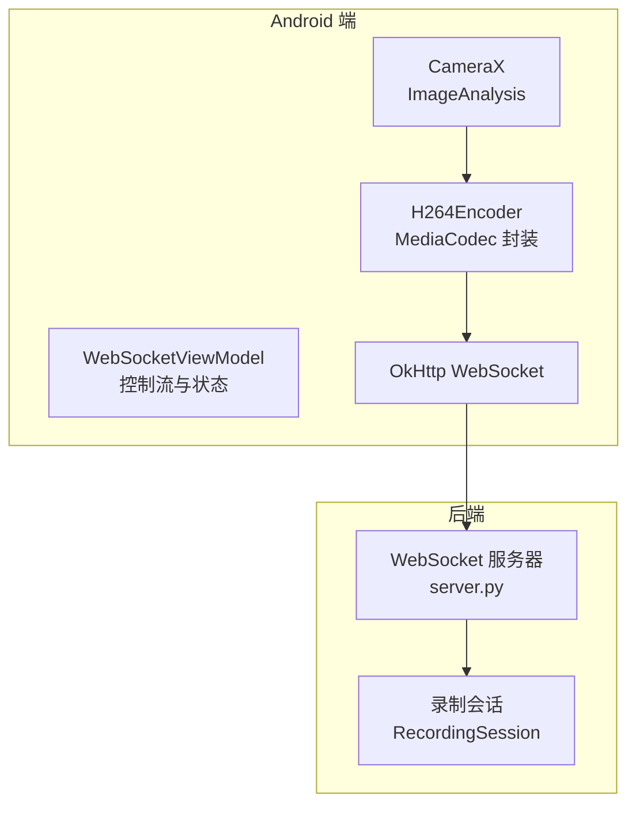
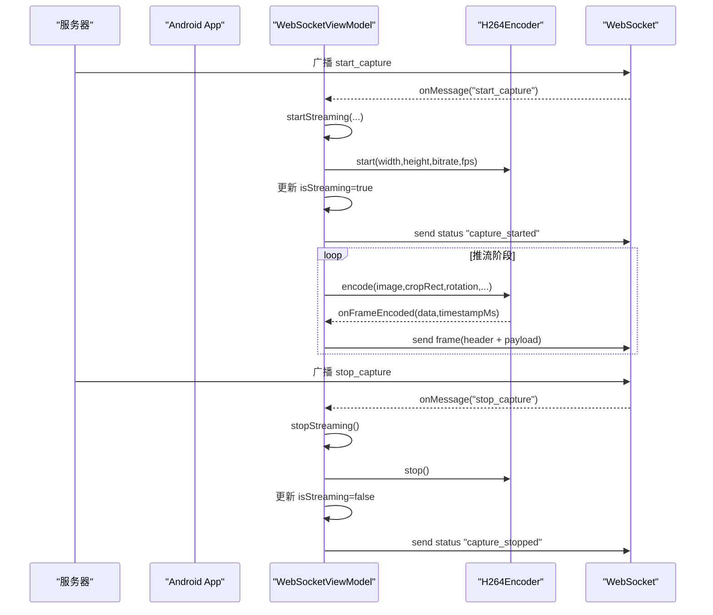
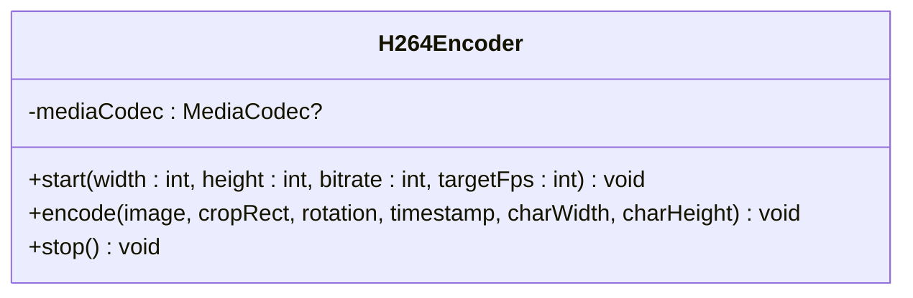
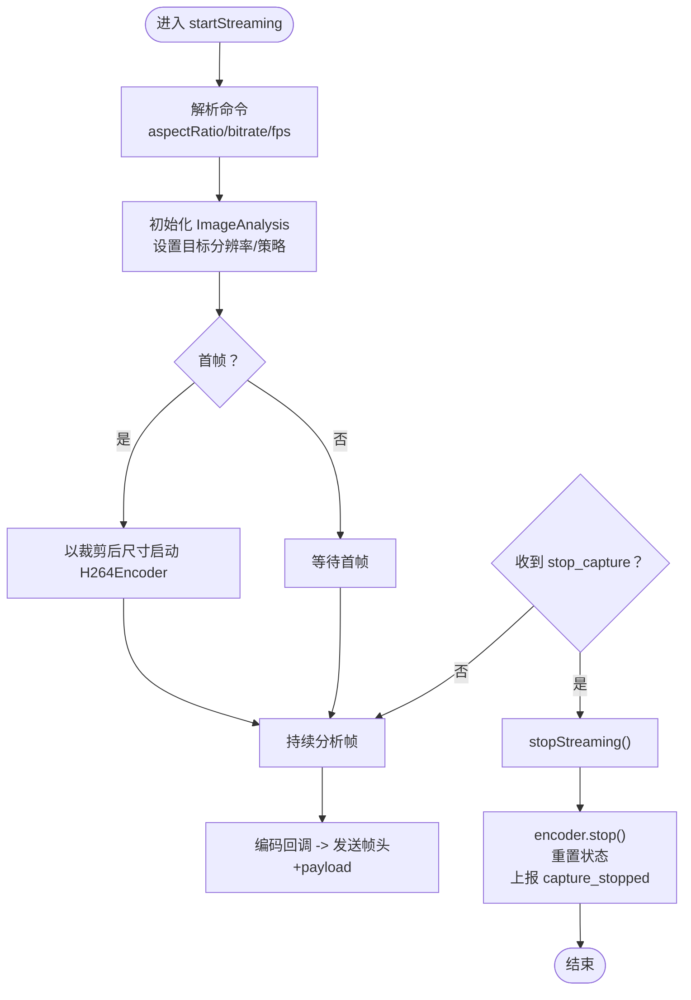
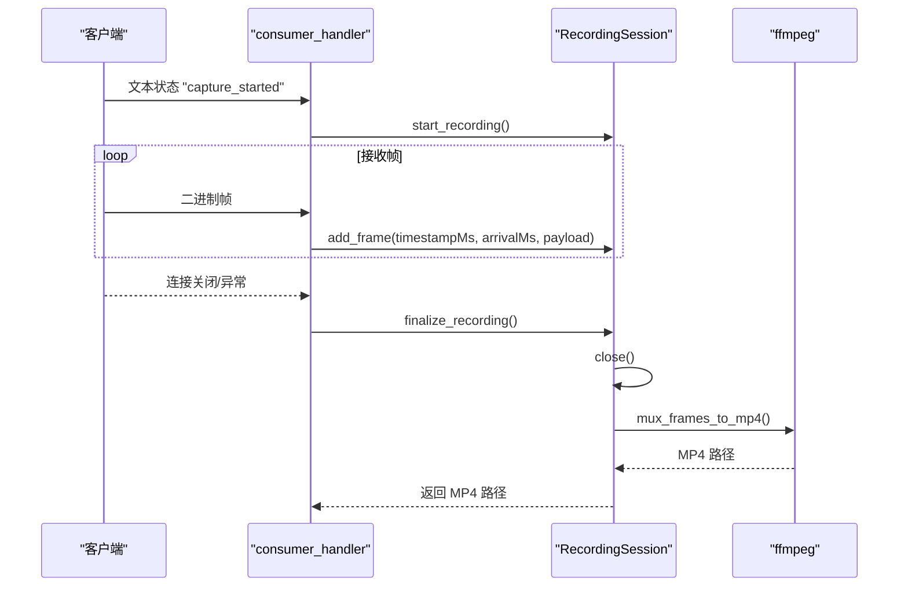
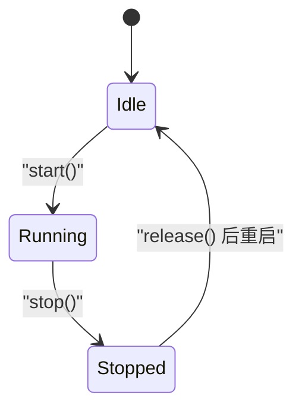
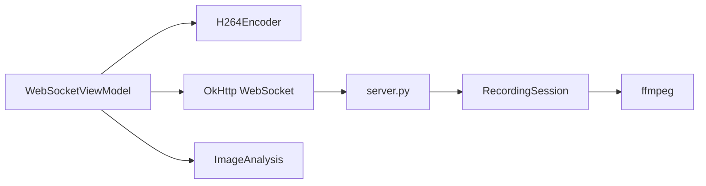

# 生命周期管理

<cite>
**本文引用的文件**
- [MainActivity.kt](file://android-camera/app/src/main/java/com/example/lablogcamera/MainActivity.kt)
- [server.py](file://backend/server.py)
- [README.md](file://android-camera/README.md)
</cite>

## 目录
1. [简介](#简介)
2. [项目结构](#项目结构)
3. [核心组件](#核心组件)
4. [架构总览](#架构总览)
5. [详细组件分析](#详细组件分析)
6. [依赖分析](#依赖分析)
7. [性能考量](#性能考量)
8. [故障排查指南](#故障排查指南)
9. [结论](#结论)
10. [附录](#附录)

## 简介
本文件围绕 H.264 编码器在 Android 端的生命周期管理展开，重点阐述 start() 与 stop() 方法在编码会话中的职责，以及 MediaCodec 的正确启动、停止与资源释放流程。文档结合 WebSocket 流状态（isStreaming）实现按需启停，分析异常中断或网络断开时的优雅关闭策略，并通过状态机图展示 idle、running、stopped 等状态之间的转换关系。最后列举因未正确调用 stop() 导致的典型内存泄漏案例及解决方案。

## 项目结构
- Android 端（Kotlin + Jetpack Compose）：负责相机采集、H.264 编码、WebSocket 推流与控制。
- 后端（Python + websockets）：接收 H.264 帧，按会话写入裸流并封装为 MP4。

图表来源
- [MainActivity.kt](file://android-camera/app/src/main/java/com/example/lablogcamera/MainActivity.kt#L944-L1226)
- [server.py](file://backend/server.py#L233-L303)

章节来源
- [README.md](file://android-camera/README.md#L9-L38)

## 核心组件
- H264Encoder：封装 MediaCodec，提供 start(width,height,bitrate,targetFps)、encode(...)、stop()。
- WebSocketViewModel：维护 isStreaming 状态，协调 startStreaming()/stopStreaming()，并通过 WebSocket 与服务器交互。
- server.py：消费 WebSocket 帧，按会话写入裸 H.264 并在会话结束时封装 MP4。

章节来源
- [MainActivity.kt](file://android-camera/app/src/main/java/com/example/lablogcamera/MainActivity.kt#L180-L276)
- [MainActivity.kt](file://android-camera/app/src/main/java/com/example/lablogcamera/MainActivity.kt#L944-L1226)
- [server.py](file://backend/server.py#L233-L303)

## 架构总览
Android 端通过 WebSocket 接收服务器下发的 start_capture/stop_capture 命令，驱动编码器的启动与停止；服务器根据 capture_started/capture_stopped 状态创建/结束录制会话，并在连接异常或关闭时确保会话结束与资源回收。

图表来源
- [MainActivity.kt](file://android-camera/app/src/main/java/com/example/lablogcamera/MainActivity.kt#L902-L942)
- [MainActivity.kt](file://android-camera/app/src/main/java/com/example/lablogcamera/MainActivity.kt#L944-L1226)
- [server.py](file://backend/server.py#L233-L303)

## 详细组件分析

### H264Encoder 生命周期与 MediaCodec 资源管理
- start(width,height,bitrate,targetFps)：创建并配置 MediaCodec，设置颜色格式、比特率、帧率、I 帧间隔等，随后调用 start()。
- encode(image,cropRect,...)：将 YUV_420_888 转换为 NV12，送入编码器输入缓冲区；轮询输出缓冲区，回调编码完成的帧数据。
- stop()：调用 stop() 与 release()，捕获异常并置 mediaCodec=null，确保 MediaCodec 资源释放，避免泄漏。

图表来源
- [MainActivity.kt](file://android-camera/app/src/main/java/com/example/lablogcamera/MainActivity.kt#L180-L276)

章节来源
- [MainActivity.kt](file://android-camera/app/src/main/java/com/example/lablogcamera/MainActivity.kt#L180-L276)

### WebSocket 流状态与按需启停
- isStreaming：UI 状态标志，反映当前是否正在推流。
- startStreaming(...)：解析服务器命令，准备编码器参数与 ImageAnalysis，首帧时以裁剪后尺寸启动 H264Encoder，更新 isStreaming=true，并上报 capture_started。
- stopStreaming()：清空 Analyzer、停止相机分析、调用 h264Encoder.stop()、重置状态、更新 isStreaming=false，并上报 capture_stopped。

图表来源
- [MainActivity.kt](file://android-camera/app/src/main/java/com/example/lablogcamera/MainActivity.kt#L902-L942)
- [MainActivity.kt](file://android-camera/app/src/main/java/com/example/lablogcamera/MainActivity.kt#L944-L1226)

章节来源
- [MainActivity.kt](file://android-camera/app/src/main/java/com/example/lablogcamera/MainActivity.kt#L944-L1226)

### stop() 中 stop() 与 release() 的必要性
- stop()：通知 MediaCodec 停止处理输入，释放内部缓冲与状态，使编码器回到可配置状态。
- release()：释放底层硬件资源与句柄，避免持有引用导致内存泄漏。
- 若仅调用 stop() 而不 release()，MediaCodec 句柄仍被持有，可能导致：
  - 编码器资源未释放，进程内残留句柄。
  - 后续再次创建编码器失败（设备资源耗尽）。
  - 应用内存增长，长时间运行后出现 OOM 风险。

章节来源
- [MainActivity.kt](file://android-camera/app/src/main/java/com/example/lablogcamera/MainActivity.kt#L266-L275)

### 服务器端录制会话与优雅关闭
- consumer_handler：处理文本状态（capture_started/capture_stopped）与二进制帧；连接关闭时捕获 ConnectionClosed，调用 finalize_recording() 结束会话并生成 MP4。
- RecordingSession：负责将帧写入 stream.h264，会话结束时关闭文件并封装为 MP4。

图表来源
- [server.py](file://backend/server.py#L233-L303)
- [server.py](file://backend/server.py#L49-L79)
- [server.py](file://backend/server.py#L150-L179)

章节来源
- [server.py](file://backend/server.py#L233-L303)
- [server.py](file://backend/server.py#L49-L79)
- [server.py](file://backend/server.py#L150-L179)

### 状态机图：编码器在 idle、running、stopped 间转换

图表来源
- [MainActivity.kt](file://android-camera/app/src/main/java/com/example/lablogcamera/MainActivity.kt#L180-L276)
- [MainActivity.kt](file://android-camera/app/src/main/java/com/example/lablogcamera/MainActivity.kt#L266-L275)

## 依赖分析
- Android 端
  - H264Encoder 依赖 MediaCodec（创建、配置、start、stop、release）。
  - WebSocketViewModel 依赖 OkHttp WebSocket（连接、发送/接收）、CameraX（ImageAnalysis）。
- 后端
  - server.py 依赖 websockets（连接管理）、subprocess（调用 ffmpeg）。

图表来源
- [MainActivity.kt](file://android-camera/app/src/main/java/com/example/lablogcamera/MainActivity.kt#L944-L1226)
- [server.py](file://backend/server.py#L233-L303)

章节来源
- [MainActivity.kt](file://android-camera/app/src/main/java/com/example/lablogcamera/MainActivity.kt#L944-L1226)
- [server.py](file://backend/server.py#L233-L303)

## 性能考量
- 帧率控制：通过 shouldSendFrame(targetFps) 在 Analyzer 层主动丢帧，避免网络与编码压力过大。
- 编码器对齐：裁剪尺寸严格满足 32 对齐与偶数要求，避免硬件编码器内部对齐导致的条纹/绿带。
- 旋转策略：固定 ImageAnalysis targetRotation=0，视频旋转在 Android 端完成，减少 HAL 旋转与手动裁剪叠加带来的冲突。

章节来源
- [MainActivity.kt](file://android-camera/app/src/main/java/com/example/lablogcamera/MainActivity.kt#L1329-L1341)
- [README.md](file://android-camera/README.md#L419-L504)

## 故障排查指南
- 现象：停止推流后仍占用资源或无法再次创建编码器
  - 排查：确认 stopStreaming() 中是否调用了 h264Encoder.stop()，并确保 mediaCodec=null。
  - 参考：[stopStreaming()](file://android-camera/app/src/main/java/com/example/lablogcamera/MainActivity.kt#L1203-L1226)、[H264Encoder.stop()](file://android-camera/app/src/main/java/com/example/lablogcamera/MainActivity.kt#L266-L275)
- 现象：连接断开后录制未结束
  - 排查：确认 consumer_handler 是否捕获 ConnectionClosed 并调用 finalize_recording()。
  - 参考：[consumer_handler](file://backend/server.py#L233-L303)
- 现象：MP4 生成失败或无帧
  - 排查：确认 RecordingSession 是否正确关闭文件、是否调用 mux_frames_to_mp4。
  - 参考：[RecordingSession.finalize()](file://backend/server.py#L64-L79)、[mux_frames_to_mp4()](file://backend/server.py#L150-L179)

章节来源
- [MainActivity.kt](file://android-camera/app/src/main/java/com/example/lablogcamera/MainActivity.kt#L1203-L1226)
- [server.py](file://backend/server.py#L233-L303)
- [server.py](file://backend/server.py#L64-L79)
- [server.py](file://backend/server.py#L150-L179)

## 结论
- start() 与 stop() 是编码器生命周期的关键节点：前者完成 MediaCodec 的创建与启动，后者必须同时调用 stop() 与 release() 以彻底释放资源。
- 通过 isStreaming 状态实现按需启停，结合服务器端的 capture_started/capture_stopped 与连接异常处理，形成完整的优雅关闭闭环。
- 避免资源泄漏的核心在于：stop() 后及时 release()，并在异常路径中确保 finalize_recording() 被调用。

## 附录
- 典型内存泄漏案例与修复
  - 案例：未调用 release()，导致 MediaCodec 句柄长期持有
    - 修复：在 stop() 中调用 release()，并在 finally 中置 mediaCodec=null
    - 参考：[H264Encoder.stop()](file://android-camera/app/src/main/java/com/example/lablogcamera/MainActivity.kt#L266-L275)
  - 案例：连接断开未结束录制会话
    - 修复：在 consumer_handler 捕获 ConnectionClosed 后调用 finalize_recording()
    - 参考：[consumer_handler](file://backend/server.py#L233-L303)