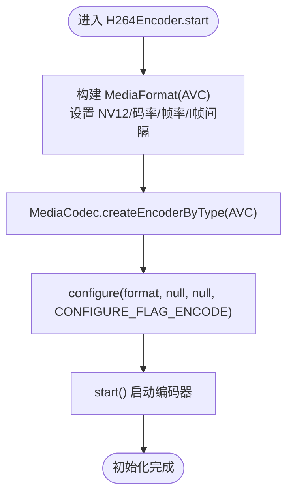

# 编码器初始化

<cite>
**本文引用的文件**
- [MainActivity.kt](file://android-camera/app/src/main/java/com/example/lablogcamera/MainActivity.kt)
- [README.md](file://android-camera/README.md)
- [AndroidManifest.xml](file://android-camera/app/src/main/AndroidManifest.xml)
</cite>

## 目录
1. [简介](#简介)
2. [项目结构](#项目结构)
3. [核心组件](#核心组件)
4. [架构总览](#架构总览)
5. [详细组件分析](#详细组件分析)
6. [依赖分析](#依赖分析)
7. [性能考量](#性能考量)
8. [故障排查指南](#故障排查指南)
9. [结论](#结论)
10. [附录](#附录)

## 简介
本文围绕 H.264 硬件编码器初始化展开，重点解析 H264Encoder 类中 start() 方法的实现机制，涵盖：
- 通过 MediaFormat.createVideoFormat 创建 AVC 编码格式
- 配置颜色格式 KEY_COLOR_FORMAT 为 COLOR_FormatYUV420SemiPlanar 以支持 NV12 输入
- 设置码率（bitrate）、帧率（frameRate）和 I 帧间隔（I_FRAME_INTERVAL）
- MediaCodec.createEncoderByType 的调用流程与 configure() 参数含义
- I 帧间隔设为 1 秒的工程考量
- 不同分辨率与码率下的配置差异
- Android 设备硬件编码器兼容性问题与规避策略
- 初学者编码器初始化时序图与高级开发者异常处理与性能调优建议

## 项目结构
- Android 端（Kotlin + Jetpack Compose）：CameraX 采集 + MediaCodec 硬件编码 + OkHttp WebSocket 推流
- 后端（Python）：接收 H.264 帧，落盘并封装为 MP4

图表来源
- [MainActivity.kt](file://android-camera/app/src/main/java/com/example/lablogcamera/MainActivity.kt#L180-L276)
- [README.md](file://android-camera/README.md#L1-L40)

章节来源
- [MainActivity.kt](file://android-camera/app/src/main/java/com/example/lablogcamera/MainActivity.kt#L1-L120)
- [README.md](file://android-camera/README.md#L1-L40)

## 核心组件
- H264Encoder：封装 MediaCodec，负责一次性配置（分辨率/码率/目标帧率），接收 ImageProxy，转换为 NV12，送入编码器并回调编码结果。
- WebSocketViewModel：负责与服务器通信、解析命令、驱动采集与编码、帧率控制与丢帧策略。

章节来源
- [MainActivity.kt](file://android-camera/app/src/main/java/com/example/lablogcamera/MainActivity.kt#L180-L276)
- [MainActivity.kt](file://android-camera/app/src/main/java/com/example/lablogcamera/MainActivity.kt#L554-L999)

## 架构总览
H264Encoder 的初始化与使用流程如下：

图表来源
- [MainActivity.kt](file://android-camera/app/src/main/java/com/example/lablogcamera/MainActivity.kt#L180-L276)
- [MainActivity.kt](file://android-camera/app/src/main/java/com/example/lablogcamera/MainActivity.kt#L1450-L1660)

## 详细组件分析

### H264Encoder.start() 初始化机制
- 创建 MediaFormat（MIME 类型为 AVC），设置：
  - KEY_COLOR_FORMAT 为 COLOR_FormatYUV420SemiPlanar（NV12）
  - KEY_BIT_RATE：目标码率（bps）
  - KEY_FRAME_RATE：编码参考帧率（targetFps<=0 时使用默认 10fps）
  - KEY_I_FRAME_INTERVAL：I 帧间隔（秒）
- 调用 MediaCodec.createEncoderByType(AVC) 获取编码器实例
- configure(format, null, null, CONFIGURE_FLAG_ENCODE) 完成参数绑定
- start() 启动编码器
- 异常处理：捕获 IOException 并记录错误日志

章节来源
- [MainActivity.kt](file://android-camera/app/src/main/java/com/example/lablogcamera/MainActivity.kt#L180-L276)

### MediaFormat.createVideoFormat 与 configure() 参数含义
- createVideoFormat(MIMETYPE_VIDEO_AVC, width, height)：指定 AVC 编码与目标分辨率
- configure 参数：
  - format：包含 MIME、颜色格式、码率、帧率、I 帧间隔等
  - surface：null（编码模式）
  - crypto：null（无加密）
  - flags：CONFIGURE_FLAG_ENCODE（编码器模式）

章节来源
- [MainActivity.kt](file://android-camera/app/src/main/java/com/example/lablogcamera/MainActivity.kt#L190-L215)

### I 帧间隔设为 1 秒的工程考量
- 降低码率波动与缓冲压力：固定 I 帧周期，便于后端估计帧率与稳定传输
- 便于后端统计与可视化：I 帧作为关键参考点，利于时间戳对齐与帧率估算
- 与服务器端“按秒估算 FPS”的策略相契合（后端 README 中对 FPS 估算有明确说明）

章节来源
- [MainActivity.kt](file://android-camera/app/src/main/java/com/example/lablogcamera/MainActivity.kt#L190-L215)
- [README.md](file://android-camera/README.md#L80-L120)

### 不同分辨率与码率下的配置差异
- 分辨率：首帧时以裁剪后的尺寸启动编码器，确保编码分辨率与预览一致
- 码率：服务器下发 bitrate（MB），应用转换为 bps 后传入 KEY_BIT_RATE
- 帧率：targetFps<=0 时使用默认 10fps；Analyzer 层通过时间间隔控制发送速率（非编码器内部帧率）

章节来源
- [MainActivity.kt](file://android-camera/app/src/main/java/com/example/lablogcamera/MainActivity.kt#L944-L1199)
- [README.md](file://android-camera/README.md#L190-L215)

### Android 设备硬件编码器兼容性问题
- 色度格式与顺序：必须使用 NV12（U 后 V），颜色格式配置为 COLOR_FormatYUV420SemiPlanar
- 尺寸对齐：编码器要求宽度/高度为 32 的倍数且为偶数；常见安全尺寸：
  - 4:3：1920×1440（1440=32×45）
  - 16:9：1920×1088（1088=32×34）
  - 1:1：全帧向下对齐到 32 的倍数（如 1920×1920）
- 旋转与裁剪叠加：固定 ImageAnalysis targetRotation=0，避免 HAL 旋转与手动裁剪叠加导致的条纹/绿带
- 坐标与尺寸：裁剪坐标与尺寸均为偶数，居中裁剪，避免越界

章节来源
- [README.md](file://android-camera/README.md#L419-L504)
- [MainActivity.kt](file://android-camera/app/src/main/java/com/example/lablogcamera/MainActivity.kt#L1450-L1660)

### 编码器初始化时序图（面向初学者）

图表来源
- [MainActivity.kt](file://android-camera/app/src/main/java/com/example/lablogcamera/MainActivity.kt#L180-L215)

### 异常处理策略（面向高级开发者）
- 编码器创建失败：捕获 IOException 并记录错误日志，避免崩溃
- 编码过程中异常：捕获通用异常并记录，防止 Analyzer 中断
- 停止编码器：stop() 与 release() 安全释放资源，捕获异常并记录

章节来源
- [MainActivity.kt](file://android-camera/app/src/main/java/com/example/lablogcamera/MainActivity.kt#L206-L215)
- [MainActivity.kt](file://android-camera/app/src/main/java/com/example/lablogcamera/MainActivity.kt#L217-L276)

### 性能调优建议
- 目标帧率自适应：Analyzer 层通过时间间隔控制发送速率（targetFps<=0 时不限），避免上行拥塞
- 旋转优化：当前实现“先旋转整个图像再裁剪”，在 rotation≠0 时 CPU 开销大；建议“先裁剪再旋转”以减少像素处理量
- 内存与循环优化：减少边界检查、使用批量复制、并行处理 Y/UV 平面
- GPU 加速：可考虑 OpenGL ES 或 NDK 原生旋转（实现复杂度较高）

章节来源
- [README.md](file://android-camera/README.md#L505-L561)
- [MainActivity.kt](file://android-camera/app/src/main/java/com/example/lablogcamera/MainActivity.kt#L1329-L1341)

## 依赖分析
- H264Encoder 依赖 MediaCodec/MediaFormat
- WebSocketViewModel 依赖 OkHttp WebSocket、CameraX ImageAnalysis
- AndroidManifest 声明相机与网络权限

图表来源
- [MainActivity.kt](file://android-camera/app/src/main/java/com/example/lablogcamera/MainActivity.kt#L16-L20)
- [AndroidManifest.xml](file://android-camera/app/src/main/AndroidManifest.xml#L1-L32)

章节来源
- [MainActivity.kt](file://android-camera/app/src/main/java/com/example/lablogcamera/MainActivity.kt#L16-L20)
- [AndroidManifest.xml](file://android-camera/app/src/main/AndroidManifest.xml#L1-L32)

## 性能考量
- 编码器内部帧率（KEY_FRAME_RATE）主要用于编码器内部参考，实际发送帧率由 Analyzer 控制
- I 帧间隔 1 秒有助于稳定码率与后端估算
- 旋转与裁剪的 CPU 开销在 rotation≠0 时显著增加，建议优化策略见“性能调优建议”

章节来源
- [MainActivity.kt](file://android-camera/app/src/main/java/com/example/lablogcamera/MainActivity.kt#L180-L215)
- [README.md](file://android-camera/README.md#L505-L561)

## 故障排查指南
- 条纹/绿带：检查裁剪尺寸是否满足 32 对齐且为偶数；确认 NV12 平面顺序（U 后 V）；固定 ImageAnalysis targetRotation=0，避免 HAL 旋转叠加
- 编码器启动失败：检查颜色格式是否为 NV12；确认设备支持 AVC 硬件编码；查看日志中的 IOException
- 帧率异常：检查 Analyzer 的帧率控制逻辑；确认 rotation=0 时性能正常，rotation≠0 时存在性能下降

章节来源
- [README.md](file://android-camera/README.md#L419-L504)
- [MainActivity.kt](file://android-camera/app/src/main/java/com/example/lablogcamera/MainActivity.kt#L180-L215)

## 结论
H264Encoder 的初始化通过 MediaFormat 与 MediaCodec 的标准流程完成，关键在于：
- 正确配置 NV12 颜色格式与对齐要求
- 合理设置码率、帧率与 I 帧间隔
- 在不同分辨率与码率下遵循“安全尺寸”策略
- 避免 HAL 旋转与手动裁剪叠加，确保稳定性
- 针对旋转性能问题提出优化方向，平衡质量与性能

## 附录
- 服务器端 README 中对 FPS 估算与封装流程的说明，有助于理解 I 帧间隔 1 秒的工程意义

章节来源
- [README.md](file://android-camera/README.md#L64-L96)