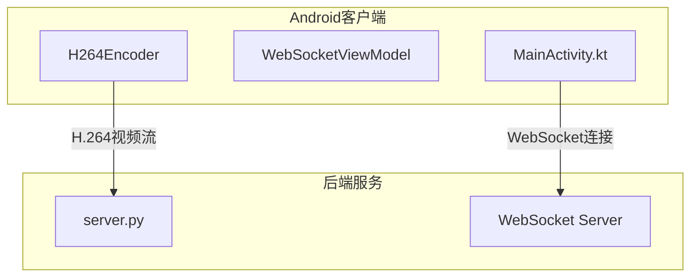
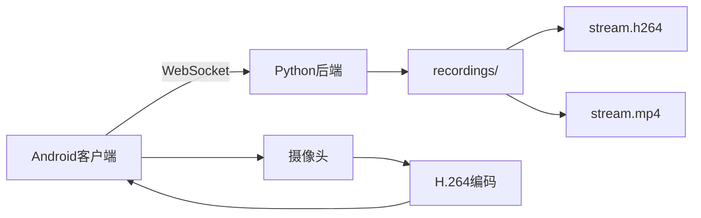
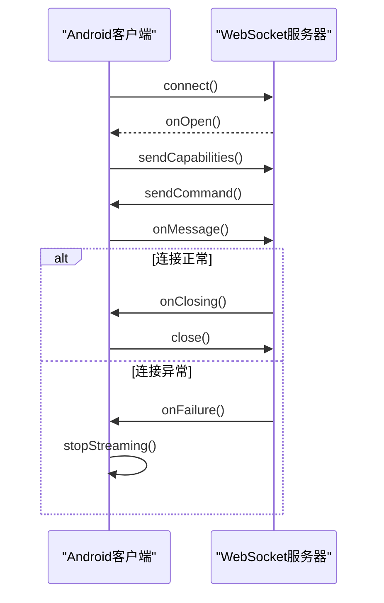
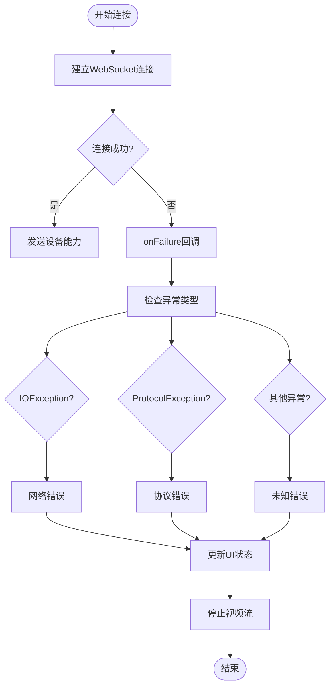
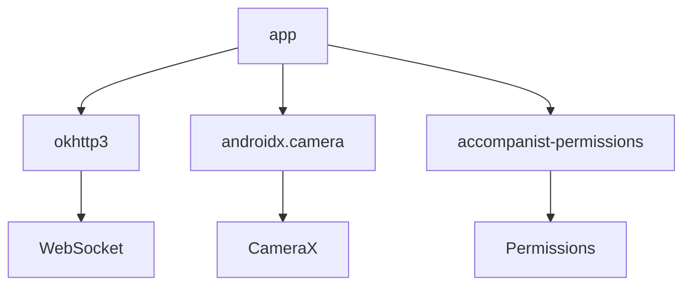

# WebSocket异常处理

<cite>
**本文档引用的文件**
- [MainActivity.kt](file://android-camera/app/src/main/java/com/example/lablogcamera/MainActivity.kt)
- [build.gradle.kts](file://android-camera/app/build.gradle.kts)
</cite>

## 目录
1. [引言](#引言)
2. [项目结构](#项目结构)
3. [核心组件](#核心组件)
4. [架构概述](#架构概述)
5. [详细组件分析](#详细组件分析)
6. [依赖分析](#依赖分析)
7. [性能考虑](#性能考虑)
8. [故障排除指南](#故障排除指南)
9. [结论](#结论)
10. [附录](#附录)（如有必要）

## 引言
本文档旨在为Android客户端WebSocket连接异常处理提供全面的开发指南。文档覆盖了网络中断、服务器不可达、认证失败、协议错误和消息解析异常等各类连接异常场景。重点说明了在`onFailure`回调中如何判断异常类型（如IOException、ProtocolException等），并提供错误码映射与用户提示策略。同时，文档解释了如何记录详细的错误日志用于问题排查，同时避免敏感信息泄露。此外，还展示了连接异常后的优雅降级方案，如暂停视频采集、更新UI状态和提示用户操作等，为开发者提供一套完整的异常分类处理指南和最佳实践代码示例。

## 项目结构
本项目是一个Android应用程序，主要功能是通过WebSocket连接将摄像头采集的视频流发送到服务器。项目结构清晰，主要包含以下几个部分：
- `android-camera/`：Android客户端应用目录
  - `app/`：应用主模块
    - `src/main/java/com/example/lablogcamera/`：Kotlin源代码
    - `src/main/res/`：资源文件
    - `src/main/AndroidManifest.xml`：应用配置文件
- `backend/`：Python后端服务器
- `developer-frontend/`：开发者前端界面
- `archive/`：历史项目存档

**图表来源**
- [MainActivity.kt](file://android-camera/app/src/main/java/com/example/lablogcamera/MainActivity.kt)
- [server.py](file://backend/server.py)

**章节来源**
- [MainActivity.kt](file://android-camera/app/src/main/java/com/example/lablogcamera/MainActivity.kt)
- [server.py](file://backend/server.py)

## 核心组件
本项目的核心组件包括WebSocket连接管理、H.264视频编码和摄像头预览。`WebSocketViewModel`负责管理WebSocket的生命周期和CameraX分析与编码控制。`H264Encoder`封装了Android平台的MediaCodec，用于将YUV格式的图像数据编码为H.264视频流。`MainActivity`作为应用的入口点，通过Compose UI框架构建用户界面，并与`WebSocketViewModel`交互以控制视频流的发送。

**章节来源**
- [MainActivity.kt](file://android-camera/app/src/main/java/com/example/lablogcamera/MainActivity.kt)

## 架构概述
系统架构采用客户端-服务器模式，Android客户端通过WebSocket协议与后端服务器通信。客户端负责采集摄像头数据，使用MediaCodec进行H.264编码，并通过WebSocket发送编码后的视频流。服务器端使用Python的websockets库接收视频流，记录到文件并最终封装为MP4格式。

**图表来源**
- [MainActivity.kt](file://android-camera/app/src/main/java/com/example/lablogcamera/MainActivity.kt)
- [server.py](file://backend/server.py)

## 详细组件分析
### WebSocket连接管理分析
`WebSocketViewModel`中的`connect()`方法负责建立WebSocket连接。它使用OkHttpClient创建WebSocket连接，并设置`WebSocketListener`来处理各种事件。

#### WebSocket连接实现

**图表来源**
- [MainActivity.kt](file://android-camera/app/src/main/java/com/example/lablogcamera/MainActivity.kt#L870-L899)

#### 异常处理机制

**图表来源**
- [MainActivity.kt](file://android-camera/app/src/main/java/com/example/lablogcamera/MainActivity.kt#L887-L892)

**章节来源**
- [MainActivity.kt](file://android-camera/app/src/main/java/com/example/lablogcamera/MainActivity.kt#L870-L899)

### H.264编码器分析
`H264Encoder`类封装了Android平台的MediaCodec，用于将YUV格式的图像数据编码为H.264视频流。编码器在`start()`方法中进行一次性配置，包括分辨率、码率和目标帧率。`encode()`方法接收CameraX的ImageProxy，完成YUV到NV12的转换并送入编码器，编码输出通过回调`onFrameEncoded`向外传递。

**章节来源**
- [MainActivity.kt](file://android-camera/app/src/main/java/com/example/lablogcamera/MainActivity.kt#L187-L275)

## 依赖分析
项目的主要依赖包括：
- `okhttp3:okhttp:4.12.0`：用于WebSocket连接
- `androidx.camera:camera-*:1.3.4`：用于摄像头采集
- `com.google.accompanist:accompanist-permissions:0.34.0`：用于权限管理

**图表来源**
- [build.gradle.kts](file://android-camera/app/build.gradle.kts#L59-L58)

**章节来源**
- [build.gradle.kts](file://android-camera/app/build.gradle.kts)

## 性能考虑
在性能方面，项目采用了以下优化措施：
1. 使用`STRATEGY_KEEP_ONLY_LATEST`策略，确保只处理最新的图像帧，避免帧堆积。
2. 在`shouldSendFrame()`方法中根据目标帧率主动丢弃多余帧，平滑控制发送速率。
3. 使用`Dispatchers.IO`协程调度器在后台线程执行耗时操作，避免阻塞主线程。
4. 预加载OCR-B字体字符位图，减少实时渲染开销。

## 故障排除指南
### 常见异常场景及处理
- **网络中断**：在`onFailure`回调中捕获`IOException`，更新UI状态为"网络错误"，停止视频流。
- **服务器不可达**：在`onFailure`回调中捕获`IOException`，更新UI状态为"服务器不可达"，停止视频流。
- **认证失败**：在`onMessage`回调中检查服务器返回的认证状态，更新UI状态为"认证失败"，停止视频流。
- **协议错误**：在`onFailure`回调中捕获`ProtocolException`，更新UI状态为"协议错误"，停止视频流。
- **消息解析异常**：在`handleServerCommand()`方法中使用try-catch捕获JSON解析异常，发送错误状态给服务器。

**章节来源**
- [MainActivity.kt](file://android-camera/app/src/main/java/com/example/lablogcamera/MainActivity.kt#L887-L892)
- [MainActivity.kt](file://android-camera/app/src/main/java/com/example/lablogcamera/MainActivity.kt#L902-L941)

## 结论
本文档详细介绍了Android客户端WebSocket连接异常处理的各个方面。通过分析项目结构、核心组件和架构，我们了解了如何在实际项目中实现WebSocket连接和异常处理。文档重点介绍了`onFailure`回调中异常类型的判断方法，提供了错误码映射与用户提示策略，并展示了连接异常后的优雅降级方案。这些最佳实践可以帮助开发者构建更稳定、更可靠的WebSocket应用。

## 附录
### WebSocket状态码映射
| 状态码 | 含义 | 处理建议 |
|--------|------|----------|
| 1000 | 正常关闭 | 无需特殊处理 |
| 1001 | 服务器重启 | 提示用户重试 |
| 1002 | 协议错误 | 检查客户端版本 |
| 1003 | 不支持的数据类型 | 检查数据格式 |
| 1006 | 连接异常关闭 | 检查网络连接 |

### 日志记录最佳实践
1. 记录连接建立和关闭的时间戳
2. 记录发送和接收的数据量
3. 记录异常发生时的堆栈信息
4. 避免记录敏感信息如用户凭证
5. 使用不同的日志级别区分信息的重要性