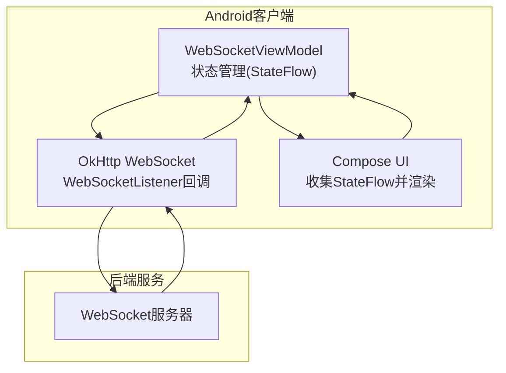
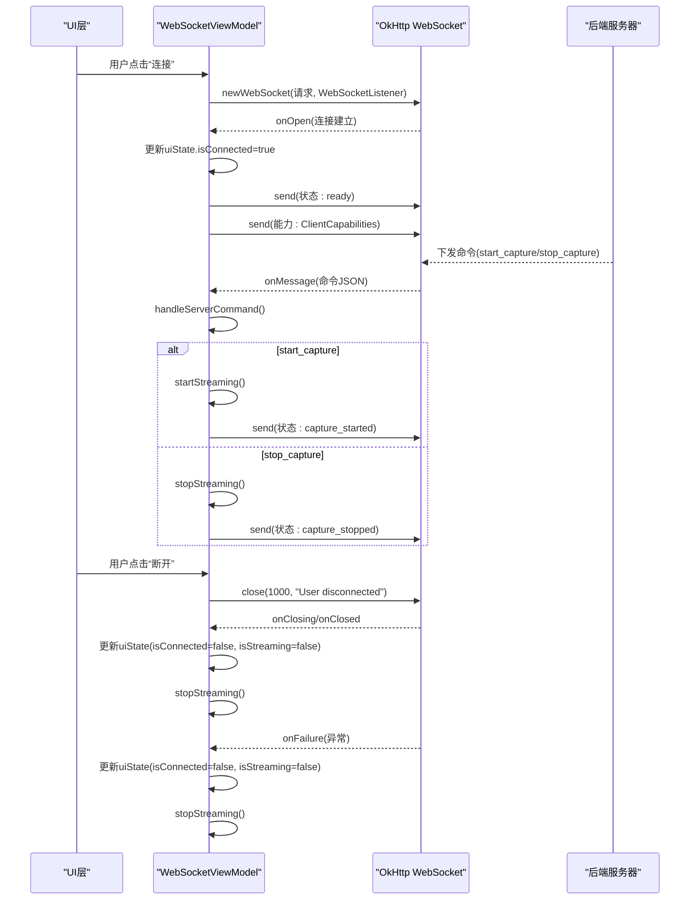
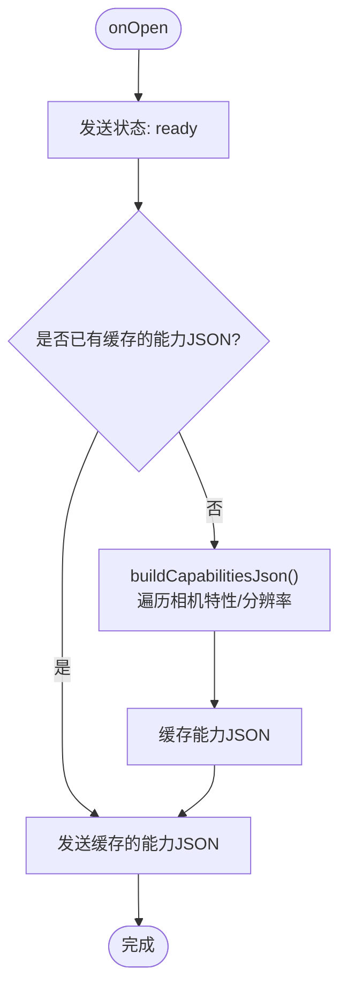
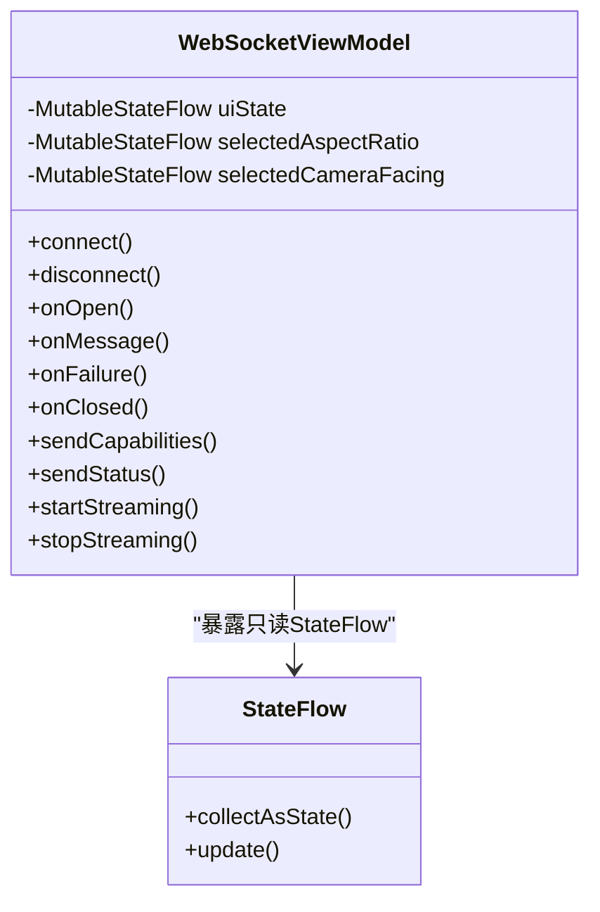
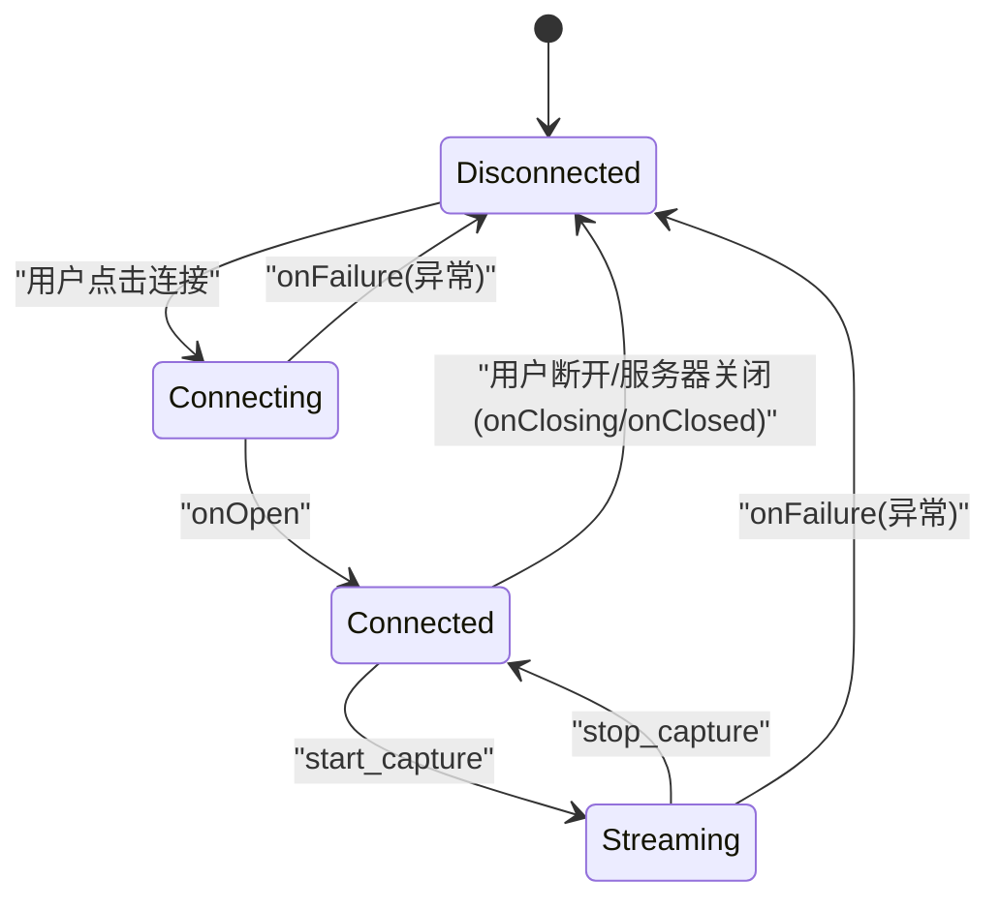
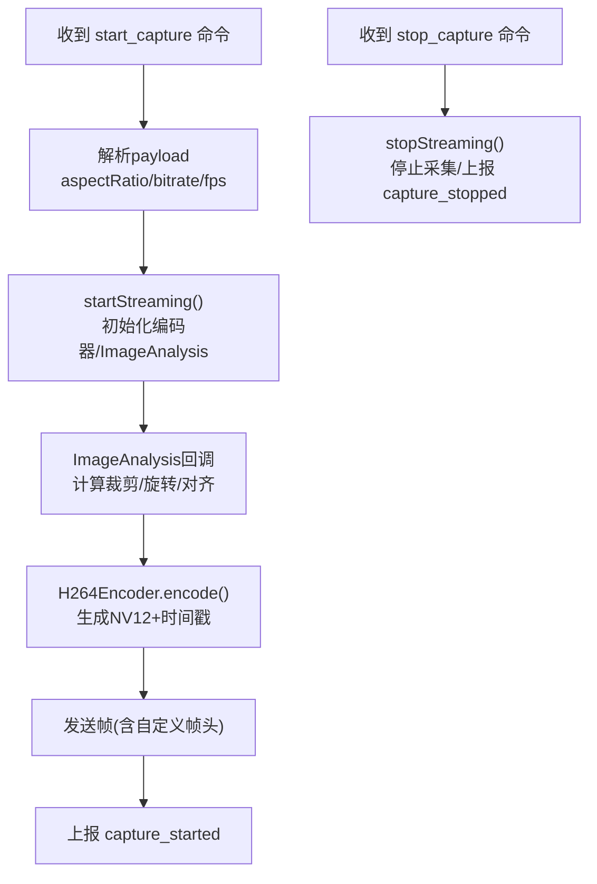
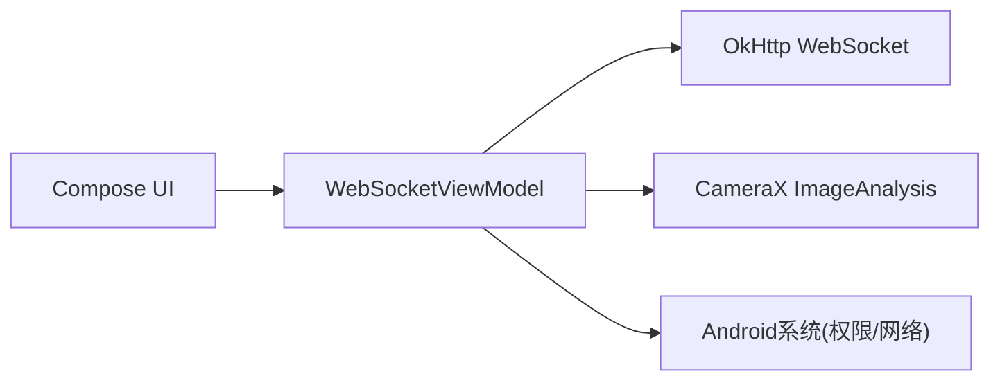

# WebSocket生命周期管理

<cite>
**本文引用的文件**
- [MainActivity.kt](file://android-camera/app/src/main/java/com/example/lablogcamera/MainActivity.kt)
- [AndroidManifest.xml](file://android-camera/app/src/main/AndroidManifest.xml)
</cite>

## 目录
1. [引言](#引言)
2. [项目结构](#项目结构)
3. [核心组件](#核心组件)
4. [架构总览](#架构总览)
5. [详细组件分析](#详细组件分析)
6. [依赖关系分析](#依赖关系分析)
7. [性能考虑](#性能考虑)
8. [故障排查指南](#故障排查指南)
9. [结论](#结论)

## 引言
本文件围绕Android客户端的WebSocket连接生命周期管理展开，系统阐述从连接建立、消息接收、异常处理到连接关闭的完整流程；重点说明WebSocketListener回调的执行时序与线程上下文，并深入解析在onOpen回调中发送设备能力信息（ClientCapabilities）的实现逻辑；同时解释连接状态在WebSocketViewModel中的响应式管理机制（StateFlow），以及UI层如何实时同步状态。最后提供从连接建立到断开的全过程状态转换图，并结合实际场景说明正常关闭与异常中断的区别处理。

## 项目结构
- Android客户端位于 android-camera/app，采用Kotlin语言与Jetpack Compose构建UI。
- 关键实现集中在MainActivity.kt中，包含：
  - WebSocketViewModel：负责WebSocket生命周期、状态管理、命令处理、编码与发送。
  - WebSocketListener：在ViewModel内部实现，覆盖onOpen、onMessage、onClosing、onFailure、onClosed。
  - UI层：通过StateFlow驱动的uiState与selectedAspectRatio等状态，实时展示连接与采集状态。
- 权限与网络配置在AndroidManifest.xml中声明。

图表来源
- [MainActivity.kt](file://android-camera/app/src/main/java/com/example/lablogcamera/MainActivity.kt#L553-L900)
- [MainActivity.kt](file://android-camera/app/src/main/java/com/example/lablogcamera/MainActivity.kt#L1670-L1708)
- [AndroidManifest.xml](file://android-camera/app/src/main/AndroidManifest.xml#L1-L32)

章节来源
- [MainActivity.kt](file://android-camera/app/src/main/java/com/example/lablogcamera/MainActivity.kt#L553-L900)
- [AndroidManifest.xml](file://android-camera/app/src/main/AndroidManifest.xml#L1-L32)

## 核心组件
- WebSocketViewModel
  - 使用MutableStateFlow维护uiState（url、isConnected、isStreaming、statusMessage）与selectedAspectRatio、selectedCameraFacing等选择状态。
  - 负责建立/关闭WebSocket连接、解析服务器命令、启动/停止视频流、上报设备能力与状态。
- WebSocketListener
  - onOpen：连接建立后立即上报“就绪”状态与设备能力信息。
  - onMessage：解析服务器命令（start_capture/stop_capture），触发采集或停止。
  - onClosing/onClosed：优雅关闭，清理资源并更新状态。
  - onFailure：异常发生时清空连接引用、停止采集、更新状态。
- UI层
  - 通过collectAsState订阅uiState，实时展示连接状态、采集状态与提示信息。

章节来源
- [MainActivity.kt](file://android-camera/app/src/main/java/com/example/lablogcamera/MainActivity.kt#L553-L900)
- [MainActivity.kt](file://android-camera/app/src/main/java/com/example/lablogcamera/MainActivity.kt#L1670-L1708)

## 架构总览
WebSocket生命周期管理采用“ViewModel + OkHttp WebSocket + Compose UI”的分层架构：
- ViewModel集中处理业务逻辑与状态变更，通过StateFlow对外暴露只读状态。
- WebSocketListener在ViewModel内部实现，负责与OkHttp交互，回调中只做状态更新与命令分发。
- UI层仅负责订阅状态并呈现，不直接操作网络。

图表来源
- [MainActivity.kt](file://android-camera/app/src/main/java/com/example/lablogcamera/MainActivity.kt#L867-L900)
- [MainActivity.kt](file://android-camera/app/src/main/java/com/example/lablogcamera/MainActivity.kt#L902-L942)
- [MainActivity.kt](file://android-camera/app/src/main/java/com/example/lablogcamera/MainActivity.kt#L1203-L1226)
- [MainActivity.kt](file://android-camera/app/src/main/java/com/example/lablogcamera/MainActivity.kt#L1228-L1258)

## 详细组件分析

### WebSocketListener回调时序与线程上下文
- onOpen
  - 在连接成功后被调用，立即更新uiState为已连接，并发送“ready”状态。
  - 随后调用sendCapabilities()上报设备能力信息（分辨率列表、SDK版本、设备型号等）。
- onMessage
  - 解析服务器下发的命令JSON，分支处理：
    - start_capture：解析payload（包含aspectRatio、bitrate、fps），调用startStreaming()启动采集。
    - stop_capture：调用stopStreaming()停止采集。
- onClosing
  - 收到服务器发起的关闭握手时，主动调用close(1000, null)完成优雅关闭。
- onFailure
  - 发生网络异常时，将isConnected与isStreaming置为false，停止采集，清空webSocket引用。
- onClosed
  - 连接最终关闭后，再次更新uiState并停止采集，清空webSocket引用。

线程上下文说明
- OkHttp的WebSocketListener回调运行在底层网络IO线程池中，非主线程。
- ViewModel内部通过StateFlow更新状态，UI层通过collectAsState在主线程观察到最新状态。
- 发送状态与能力信息均在viewModelScope(Dispatchers.IO)中执行，避免阻塞网络回调线程。

章节来源
- [MainActivity.kt](file://android-camera/app/src/main/java/com/example/lablogcamera/MainActivity.kt#L867-L900)
- [MainActivity.kt](file://android-camera/app/src/main/java/com/example/lablogcamera/MainActivity.kt#L902-L942)
- [MainActivity.kt](file://android-camera/app/src/main/java/com/example/lablogcamera/MainActivity.kt#L1203-L1226)
- [MainActivity.kt](file://android-camera/app/src/main/java/com/example/lablogcamera/MainActivity.kt#L1228-L1258)

### onOpen中发送设备能力信息（ClientCapabilities）实现逻辑
- 触发时机
  - 在onOpen回调中，先发送ClientStatus("ready")，随后立即调用sendCapabilities()。
- 能力构建
  - buildCapabilitiesJson()遍历相机特性，收集支持的分辨率（YUV_420_888），去重并按面积降序排列。
  - 同时上报当前选择摄像头的ImageAnalysis分辨率与设备信息（model、sdkInt）。
- 缓存策略
  - 将构建结果缓存在cachedCapabilitiesJson中，避免重复构建。
- 发送流程
  - sendCapabilities()在Dispatchers.IO中发送，若发送失败记录日志。

图表来源
- [MainActivity.kt](file://android-camera/app/src/main/java/com/example/lablogcamera/MainActivity.kt#L867-L900)
- [MainActivity.kt](file://android-camera/app/src/main/java/com/example/lablogcamera/MainActivity.kt#L1228-L1258)
- [MainActivity.kt](file://android-camera/app/src/main/java/com/example/lablogcamera/MainActivity.kt#L1260-L1316)

章节来源
- [MainActivity.kt](file://android-camera/app/src/main/java/com/example/lablogcamera/MainActivity.kt#L867-L900)
- [MainActivity.kt](file://android-camera/app/src/main/java/com/example/lablogcamera/MainActivity.kt#L1228-L1316)

### 响应式状态管理（StateFlow）
- uiState
  - 包含url、isConnected、isStreaming、statusMessage等字段，供UI层订阅。
- selectedAspectRatio/selectedCameraFacing
  - 用于记录用户选择的宽高比与摄像头方向，影响采集参数与UI预览。
- UI订阅
  - 在MainScreen/MainContent中通过collectAsState订阅uiState与相关选择状态，实时渲染连接按钮、状态文本、预览区域等。

图表来源
- [MainActivity.kt](file://android-camera/app/src/main/java/com/example/lablogcamera/MainActivity.kt#L553-L759)
- [MainActivity.kt](file://android-camera/app/src/main/java/com/example/lablogcamera/MainActivity.kt#L1670-L1708)

章节来源
- [MainActivity.kt](file://android-camera/app/src/main/java/com/example/lablogcamera/MainActivity.kt#L553-L759)
- [MainActivity.kt](file://android-camera/app/src/main/java/com/example/lablogcamera/MainActivity.kt#L1670-L1708)

### 从连接建立到断开的状态转换图
- 正常关闭
  - 用户点击断开：ViewModel调用close(1000, "User disconnected")，触发onClosing/onClosed，最终更新uiState为断开。
- 异常中断
  - 网络异常：onFailure被触发，更新uiState为断开且停止采集，清空webSocket引用。
- 服务器主动关闭
  - 服务器发送关闭握手：onClosing中主动close(1000,null)，随后onClosed更新状态并停止采集。

图表来源
- [MainActivity.kt](file://android-camera/app/src/main/java/com/example/lablogcamera/MainActivity.kt#L867-L900)
- [MainActivity.kt](file://android-camera/app/src/main/java/com/example/lablogcamera/MainActivity.kt#L1203-L1226)

章节来源
- [MainActivity.kt](file://android-camera/app/src/main/java/com/example/lablogcamera/MainActivity.kt#L867-L900)
- [MainActivity.kt](file://android-camera/app/src/main/java/com/example/lablogcamera/MainActivity.kt#L1203-L1226)

### 采集与命令处理流程
- start_capture
  - 解析payload：aspectRatio/bitrate/fps。
  - startStreaming：初始化编码器、ImageAnalysis、裁剪区域，按目标FPS主动丢帧，发送H.264帧与时间戳水印。
  - 上报capture_started状态。
- stop_capture
  - 停止ImageAnalysis、释放编码器、清除裁剪区域与统计计数，上报capture_stopped状态。

图表来源
- [MainActivity.kt](file://android-camera/app/src/main/java/com/example/lablogcamera/MainActivity.kt#L902-L942)
- [MainActivity.kt](file://android-camera/app/src/main/java/com/example/lablogcamera/MainActivity.kt#L944-L1199)
- [MainActivity.kt](file://android-camera/app/src/main/java/com/example/lablogcamera/MainActivity.kt#L1203-L1226)

章节来源
- [MainActivity.kt](file://android-camera/app/src/main/java/com/example/lablogcamera/MainActivity.kt#L902-L942)
- [MainActivity.kt](file://android-camera/app/src/main/java/com/example/lablogcamera/MainActivity.kt#L944-L1199)
- [MainActivity.kt](file://android-camera/app/src/main/java/com/example/lablogcamera/MainActivity.kt#L1203-L1226)

## 依赖关系分析
- 组件耦合
  - WebSocketViewModel与OkHttp WebSocket强耦合，但通过WebSocketListener隔离了网络细节。
  - UI层仅依赖ViewModel暴露的StateFlow，解耦良好。
- 外部依赖
  - OkHttp提供WebSocket客户端能力。
  - CameraX提供图像分析与预览绑定。
  - Android系统权限与网络配置由AndroidManifest.xml声明。

图表来源
- [MainActivity.kt](file://android-camera/app/src/main/java/com/example/lablogcamera/MainActivity.kt#L553-L900)
- [AndroidManifest.xml](file://android-camera/app/src/main/AndroidManifest.xml#L1-L32)

章节来源
- [MainActivity.kt](file://android-camera/app/src/main/java/com/example/lablogcamera/MainActivity.kt#L553-L900)
- [AndroidManifest.xml](file://android-camera/app/src/main/AndroidManifest.xml#L1-L32)

## 性能考虑
- 主动丢帧控制
  - 通过shouldSendFrame按目标FPS计算最小间隔，避免超频发送，降低带宽与CPU压力。
- 编码器与裁剪
  - 以设备支持的最大分辨率作为ImageAnalysis目标分辨率，提高FOV；按服务器指定宽高比进行裁剪并对齐，减少编码器不兼容导致的伪影。
- 状态上报
  - 能力信息与状态消息在IO线程发送，避免阻塞网络回调线程。
- UI刷新
  - 仅订阅必要的StateFlow，避免频繁重组。

[本节为通用性能建议，不直接分析具体文件]

## 故障排查指南
- 连接失败
  - 检查URL与网络权限（AndroidManifest.xml声明INTERNET/CAMERA）。
  - 观察onFailure回调中的异常信息，确认是否为网络不可达或证书问题。
- 无法上报能力
  - 确认相机权限已授予，buildCapabilitiesJson可能因SecurityException返回空。
- 采集异常
  - 查看startStreaming异常分支，关注编码器初始化与裁剪区域对齐问题。
- 断开后状态未更新
  - 确认onClosing/onClosed回调是否被触发，以及UI层是否正确订阅uiState。

章节来源
- [AndroidManifest.xml](file://android-camera/app/src/main/AndroidManifest.xml#L1-L32)
- [MainActivity.kt](file://android-camera/app/src/main/java/com/example/lablogcamera/MainActivity.kt#L867-L900)
- [MainActivity.kt](file://android-camera/app/src/main/java/com/example/lablogcamera/MainActivity.kt#L1203-L1226)

## 结论
本项目通过清晰的分层设计与响应式状态管理，实现了稳定的WebSocket连接生命周期管理。onOpen回调中及时上报设备能力信息，配合服务器命令实现灵活的采集控制；StateFlow确保UI层实时同步状态；异常与正常关闭路径均有明确处理，具备良好的可维护性与扩展性。