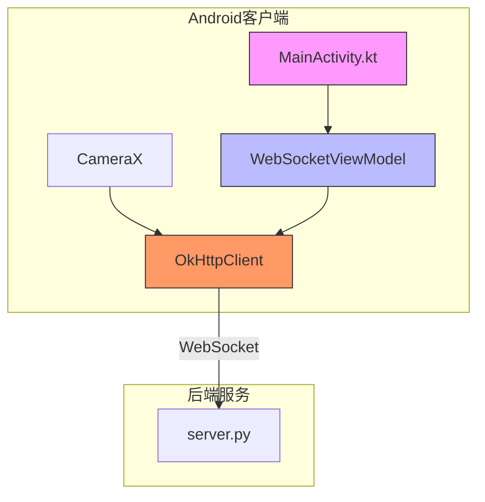
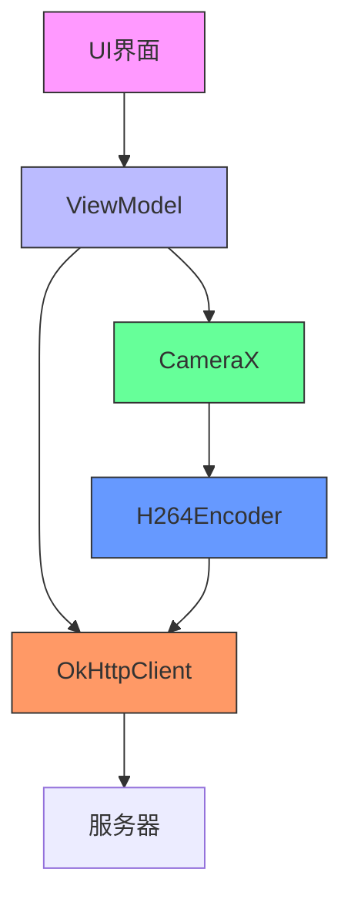
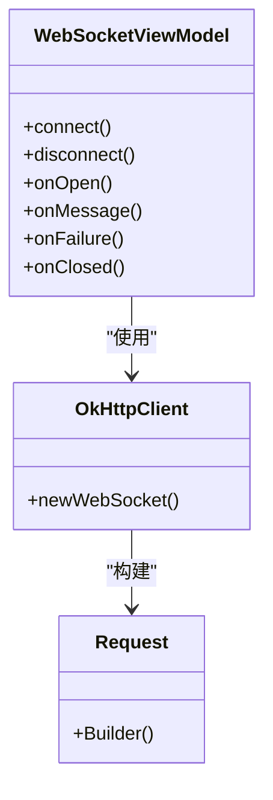
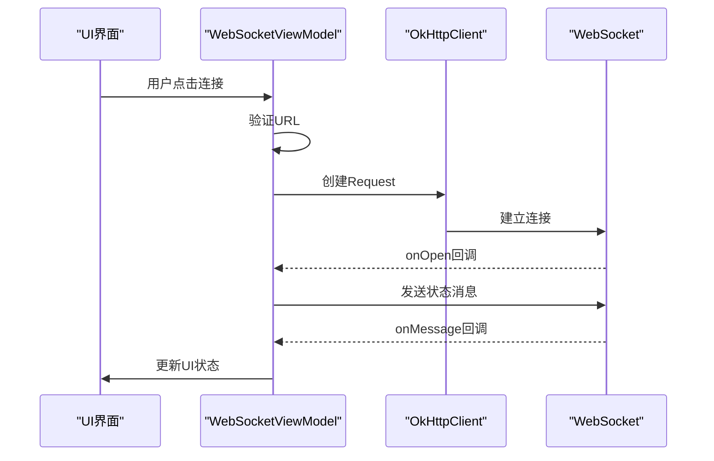
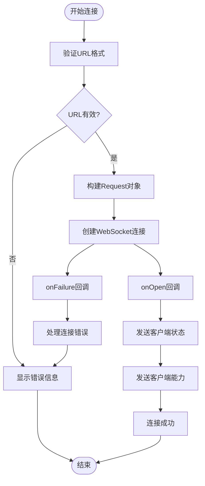
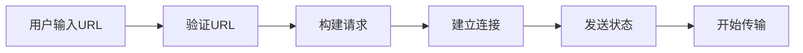
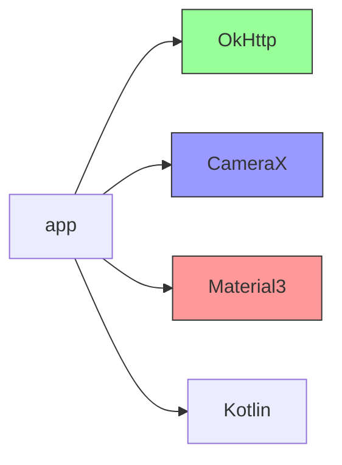

# WebSocket连接初始化

<cite>
**本文档引用的文件**   
- [MainActivity.kt](file://android-camera/app/src/main/java/com/example/lablogcamera/MainActivity.kt)
- [network_security_config.xml](file://android-camera/app/src/main/res/xml/network_security_config.xml)
- [build.gradle.kts](file://android-camera/app/build.gradle.kts)
</cite>

## 目录
1. [简介](#简介)
2. [项目结构](#项目结构)
3. [核心组件](#核心组件)
4. [架构概述](#架构概述)
5. [详细组件分析](#详细组件分析)
6. [依赖分析](#依赖分析)
7. [性能考虑](#性能考虑)
8. [故障排除指南](#故障排除指南)
9. [结论](#结论)
10. [附录](#附录)（如有必要）

## 简介
本文档详细介绍了Android客户端中WebSocket连接的初始化过程。重点讲解了如何使用OkHttpClient构建WebSocket请求，包括目标URL的合法性校验、自定义请求头（如User-Agent、Authorization）的设置方法。文档还详细描述了WebSocket连接超时配置（connectTimeout、readTimeout、writeTimeout）的最佳实践，并结合代码示例说明如何通过Request.Builder构造请求对象。此外，文档解释了连接初始化时机与Android生命周期的关联，确保在ViewModel中安全启动连接。为初学者提供了基础连接代码模板，为高级开发者展示了连接配置的可扩展设计模式。

## 项目结构
本项目是一个Android应用程序，主要功能是通过WebSocket将摄像头采集的视频流发送到服务器。项目结构清晰，主要包含以下几个部分：

- `android-camera/`：Android客户端应用目录
  - `app/`：应用主模块
    - `src/main/java/com/example/lablogcamera/`：Kotlin源代码
    - `src/main/res/`：资源文件
    - `src/main/AndroidManifest.xml`：应用配置文件
- `backend/`：后端服务器代码
- `developer-frontend/`：前端开发界面
- `archive/`：历史项目存档

**Diagram sources**
- [MainActivity.kt](file://android-camera/app/src/main/java/com/example/lablogcamera/MainActivity.kt)

**Section sources**
- [MainActivity.kt](file://android-camera/app/src/main/java/com/example/lablogcamera/MainActivity.kt)
- [build.gradle.kts](file://android-camera/app/build.gradle.kts)

## 核心组件
本项目的核心组件包括WebSocket连接管理、摄像头数据采集和视频编码。WebSocket连接通过OkHttpClient实现，摄像头数据采集使用CameraX API，视频编码使用MediaCodec。这些组件协同工作，实现了从摄像头采集视频数据并通过WebSocket发送到服务器的完整流程。

**Section sources**
- [MainActivity.kt](file://android-camera/app/src/main/java/com/example/lablogcamera/MainActivity.kt)

## 架构概述
系统架构采用MVVM模式，将UI逻辑与业务逻辑分离。ViewModel负责管理WebSocket连接和摄像头采集的生命周期，View负责UI展示和用户交互。OkHttpClient作为网络层，负责WebSocket连接的建立和数据传输。CameraX作为摄像头管理层，负责摄像头的预览和数据采集。H264Encoder作为编码层，负责将YUV数据编码为H.264格式。

**Diagram sources**
- [MainActivity.kt](file://android-camera/app/src/main/java/com/example/lablogcamera/MainActivity.kt)

## 详细组件分析

### WebSocket连接初始化分析
WebSocket连接的初始化在WebSocketViewModel中完成。通过OkHttpClient创建WebSocket连接，使用Request.Builder构建请求对象。连接建立后，通过onOpen回调发送客户端状态和能力信息。

#### 对象导向组件：

**Diagram sources**
- [MainActivity.kt](file://android-camera/app/src/main/java/com/example/lablogcamera/MainActivity.kt)

#### API/服务组件：

**Diagram sources**
- [MainActivity.kt](file://android-camera/app/src/main/java/com/example/lablogcamera/MainActivity.kt)

#### 复杂逻辑组件：

**Diagram sources**
- [MainActivity.kt](file://android-camera/app/src/main/java/com/example/lablogcamera/MainActivity.kt)

**Section sources**
- [MainActivity.kt](file://android-camera/app/src/main/java/com/example/lablogcamera/MainActivity.kt)

### 概念概述
WebSocket连接初始化是Android客户端与服务器通信的关键环节。通过合理的连接管理，可以确保视频流的稳定传输。连接初始化需要考虑URL验证、超时设置、错误处理等多个方面，确保连接的可靠性和稳定性。

## 依赖分析
项目依赖主要包括OkHttp、CameraX和Material3等库。OkHttp用于WebSocket连接，CameraX用于摄像头数据采集，Material3用于UI组件。这些依赖通过Gradle进行管理，确保版本兼容性和稳定性。

**Diagram sources**
- [build.gradle.kts](file://android-camera/app/build.gradle.kts)

**Section sources**
- [build.gradle.kts](file://android-camera/app/build.gradle.kts)

## 性能考虑
WebSocket连接的性能主要受网络状况、编码效率和设备性能影响。建议在连接时设置合理的超时时间，避免长时间等待。同时，根据设备性能调整视频编码参数，确保流畅的视频传输。

## 故障排除指南
常见问题包括连接失败、视频流中断等。连接失败可能是由于URL错误、网络问题或服务器故障。视频流中断可能是由于设备性能不足或网络不稳定。建议在开发过程中使用详细的日志记录，便于问题排查。

**Section sources**
- [MainActivity.kt](file://android-camera/app/src/main/java/com/example/lablogcamera/MainActivity.kt)

## 结论
本文档详细介绍了Android客户端WebSocket连接的初始化过程。通过合理的架构设计和代码实现，确保了视频流的稳定传输。建议在实际应用中根据具体需求调整连接参数和编码设置，以获得最佳的用户体验。