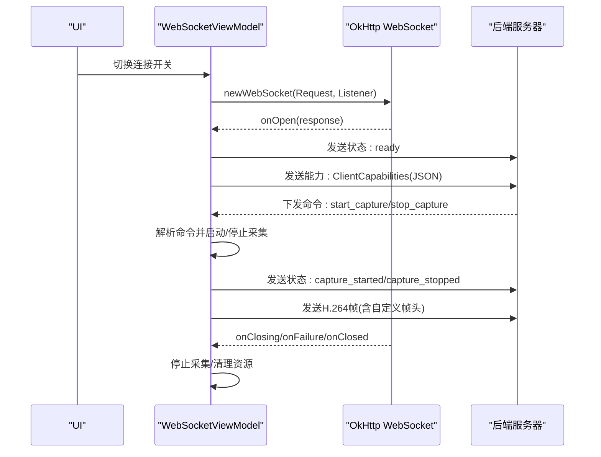
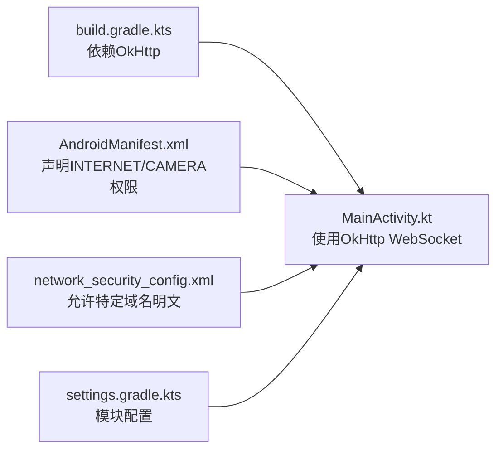

# WebSocket连接管理

<cite>
**本文引用的文件**
- [MainActivity.kt](file://android-camera/app/src/main/java/com/example/lablogcamera/MainActivity.kt)
- [AndroidManifest.xml](file://android-camera/app/src/main/AndroidManifest.xml)
- [network_security_config.xml](file://android-camera/app/src/main/res/xml/network_security_config.xml)
- [build.gradle.kts](file://android-camera/app/build.gradle.kts)
- [settings.gradle.kts](file://android-camera/settings.gradle.kts)
</cite>

## 目录
1. [简介](#简介)
2. [项目结构](#项目结构)
3. [核心组件](#核心组件)
4. [架构总览](#架构总览)
5. [详细组件分析](#详细组件分析)
6. [依赖关系分析](#依赖关系分析)
7. [性能考量](#性能考量)
8. [故障排查指南](#故障排查指南)
9. [结论](#结论)
10. [附录](#附录)

## 简介
本文件围绕Android客户端的WebSocket连接管理展开，结合仓库中的实际实现，系统性讲解OkHttpClient初始化WebSocket连接、请求构建、连接超时配置与自定义头部设置；详述WebSocketListener在onOpen回调中建立连接后的初始化逻辑（如发送设备能力信息ClientCapabilities）；解释WebSocketViewModel中的连接、断开、重连生命周期控制；阐述自动重连策略（指数退避与网络状态监听）；并总结连接异常处理最佳实践（网络中断、服务器不可达、认证失败等）。文末提供面向初学者的基础连接示例路径与面向高级用户的多服务器地址容灾切换设计思路。

## 项目结构
该项目为Android Camera应用，采用Jetpack Compose构建UI，使用CameraX进行视频采集，使用OkHttp的WebSocket功能与后端进行双向通信。关键文件与职责如下：
- MainActivity.kt：包含WebSocketViewModel、WebSocket连接与命令处理、H.264编码与帧发送、UI状态管理等核心逻辑
- AndroidManifest.xml：声明相机、网络权限与网络安全配置
- network_security_config.xml：允许特定域名明文HTTP流量
- build.gradle.kts：声明OkHttp依赖
- settings.gradle.kts：Gradle模块配置

```mermaid
graph TB
subgraph "Android应用"
UI["Compose UI<br/>MainScreen/MainContent"]
VM["WebSocketViewModel<br/>连接/流控/状态"]
Net["OkHttp WebSocket<br/>Request/WebSocketListener"]
Cam["CameraX<br/>ImageAnalysis/H.264Encoder"]
end
subgraph "后端"
WS["WebSocket服务端"]
end
UI --> VM
VM --> Net
VM --> Cam
Net <- --> WS
```

图表来源
- [MainActivity.kt](file://android-camera/app/src/main/java/com/example/lablogcamera/MainActivity.kt#L867-L900)
- [MainActivity.kt](file://android-camera/app/src/main/java/com/example/lablogcamera/MainActivity.kt#L1244-L1258)
- [MainActivity.kt](file://android-camera/app/src/main/java/com/example/lablogcamera/MainActivity.kt#L1260-L1316)
- [build.gradle.kts](file://android-camera/app/build.gradle.kts#L44-L68)

章节来源
- [MainActivity.kt](file://android-camera/app/src/main/java/com/example/lablogcamera/MainActivity.kt#L867-L900)
- [build.gradle.kts](file://android-camera/app/build.gradle.kts#L44-L68)
- [AndroidManifest.xml](file://android-camera/app/src/main/AndroidManifest.xml#L1-L32)
- [network_security_config.xml](file://android-camera/app/src/main/res/xml/network_security_config.xml#L1-L7)

## 核心组件
- WebSocketViewModel：负责WebSocket生命周期、命令解析、状态上报、H.264编码与帧发送、UI状态流
- OkHttp WebSocket：通过OkHttpClient创建WebSocket，使用WebSocketListener处理连接、消息、关闭与失败事件
- CameraX + H.264Encoder：采集图像、裁剪与旋转、编码为H.264并按协议发送二进制帧
- UI层：MainScreen/MainContent负责权限申请、预览、宽高比与摄像头选择、连接开关与状态展示

章节来源
- [MainActivity.kt](file://android-camera/app/src/main/java/com/example/lablogcamera/MainActivity.kt#L553-L759)
- [MainActivity.kt](file://android-camera/app/src/main/java/com/example/lablogcamera/MainActivity.kt#L867-L900)
- [MainActivity.kt](file://android-camera/app/src/main/java/com/example/lablogcamera/MainActivity.kt#L1244-L1316)
- [MainActivity.kt](file://android-camera/app/src/main/java/com/example/lablogcamera/MainActivity.kt#L1670-L1675)

## 架构总览
WebSocket连接管理的整体流程如下：
- UI触发连接开关，WebSocketViewModel创建OkHttp WebSocket
- onOpen回调中发送“就绪”状态与设备能力信息（ClientCapabilities）
- 服务器下发命令（如start_capture/stop_capture），WebSocketViewModel解析并启动/停止采集与编码
- 采集过程中持续发送H.264帧，包含自定义二进制帧头
- onClosing/onFailure/onClosed处理断开与异常，停止采集并清理资源



图表来源
- [MainActivity.kt](file://android-camera/app/src/main/java/com/example/lablogcamera/MainActivity.kt#L867-L900)
- [MainActivity.kt](file://android-camera/app/src/main/java/com/example/lablogcamera/MainActivity.kt#L902-L942)
- [MainActivity.kt](file://android-camera/app/src/main/java/com/example/lablogcamera/MainActivity.kt#L1228-L1258)
- [MainActivity.kt](file://android-camera/app/src/main/java/com/example/lablogcamera/MainActivity.kt#L1244-L1316)

## 详细组件分析

### WebSocket连接初始化与请求构建
- 使用OkHttpClient创建WebSocket，请求URL来自ViewModel的uiState.url
- 请求构建简洁，未在此处添加自定义头部字段
- 未显式设置连接超时参数（如connectTimeout），默认遵循OkHttp默认行为

章节来源
- [MainActivity.kt](file://android-camera/app/src/main/java/com/example/lablogcamera/MainActivity.kt#L867-L900)

### WebSocketListener回调与连接建立后的初始化
- onOpen：更新UI状态为已连接，发送“ready”状态，随后上报设备能力信息（ClientCapabilities）
- onMessage：解析服务器命令（start_capture/stop_capture），驱动采集与编码流程
- onClosing/onFailure/onClosed：统一停止采集、清理资源、更新UI状态并置空WebSocket引用

章节来源
- [MainActivity.kt](file://android-camera/app/src/main/java/com/example/lablogcamera/MainActivity.kt#L867-L900)
- [MainActivity.kt](file://android-camera/app/src/main/java/com/example/lablogcamera/MainActivity.kt#L902-L942)
- [MainActivity.kt](file://android-camera/app/src/main/java/com/example/lablogcamera/MainActivity.kt#L1200-L1226)

### 设备能力上报（ClientCapabilities）
- 在onOpen回调中调用sendCapabilities，构建包含设备型号、SDK版本、支持分辨率列表与当前ImageAnalysis分辨率的JSON
- 能力信息用于服务器决策（如选择更高分辨率、适配宽高比）

章节来源
- [MainActivity.kt](file://android-camera/app/src/main/java/com/example/lablogcamera/MainActivity.kt#L1244-L1316)
- [MainActivity.kt](file://android-camera/app/src/main/java/com/example/lablogcamera/MainActivity.kt#L1260-L1316)

### 连接状态管理（WebSocketViewModel）
- uiState为StateFlow，包含url、isConnected、isStreaming、statusMessage
- onConnectToggle根据布尔值调用connect/disconnect
- disconnect会停止采集并优雅关闭WebSocket
- onCleared中清理资源，确保退出时释放编码器与线程池

章节来源
- [MainActivity.kt](file://android-camera/app/src/main/java/com/example/lablogcamera/MainActivity.kt#L553-L759)
- [MainActivity.kt](file://android-camera/app/src/main/java/com/example/lablogcamera/MainActivity.kt#L1318-L1327)

### 自动重连机制与指数退避
- 当前实现未实现自动重连逻辑。onFailure/onClosed中仅停止采集并置空引用，未进行指数退避或定时重连
- 若需实现，建议在onFailure/onClosed中：
  - 记录失败次数与上次重连时间
  - 使用指数退避（如2^N秒，上限设定）与抖动
  - 结合网络状态监听（ConnectivityManager）在网络恢复后再重连
  - 支持多服务器地址轮询与容灾切换（见附录）

章节来源
- [MainActivity.kt](file://android-camera/app/src/main/java/com/example/lablogcamera/MainActivity.kt#L888-L898)
- [MainActivity.kt](file://android-camera/app/src/main/java/com/example/lablogcamera/MainActivity.kt#L1200-L1226)

### 异常处理最佳实践
- 网络中断：onFailure触发，停止采集并清空引用；建议在网络可用时自动重连
- 服务器不可达：onFailure/onClosed统一处理；可在UI提示“服务器不可达”
- 认证失败：若服务器返回特定错误码或消息，可在onMessage中识别并提示；当前实现未显式处理认证失败场景
- 编码异常：H.264Encoder内部try-catch保护，避免异常传播导致Analyzer中断

章节来源
- [MainActivity.kt](file://android-camera/app/src/main/java/com/example/lablogcamera/MainActivity.kt#L888-L898)
- [MainActivity.kt](file://android-camera/app/src/main/java/com/example/lablogcamera/MainActivity.kt#L217-L264)

### 帧发送与协议
- 服务器命令start_capture携带目标宽高比、码率（MB）、帧率（可缺省）
- WebSocket发送H.264帧，帧头为16字节：时间戳（毫秒）、帧序号（低32位）、payload长度（字节）
- 服务器未指定宽高比时，使用UI选择的宽高比；指定时覆盖并同步到UI

章节来源
- [MainActivity.kt](file://android-camera/app/src/main/java/com/example/lablogcamera/MainActivity.kt#L902-L942)
- [MainActivity.kt](file://android-camera/app/src/main/java/com/example/lablogcamera/MainActivity.kt#L968-L984)

### 初学者基础连接示例路径
- 连接初始化与监听器注册：参见[连接初始化](file://android-camera/app/src/main/java/com/example/lablogcamera/MainActivity.kt#L867-L900)
- onOpen回调中的状态与能力上报：参见[能力上报](file://android-camera/app/src/main/java/com/example/lablogcamera/MainActivity.kt#L1244-L1316)
- 命令解析与采集控制：参见[命令处理](file://android-camera/app/src/main/java/com/example/lablogcamera/MainActivity.kt#L902-L942)

### 高级用户：多服务器地址容灾切换设计
- 在ViewModel中维护服务器地址列表（主备/多活）
- onClosed/onFailure中按顺序尝试下一个地址，或启用轮询
- 指数退避重连，成功后恢复原地址为主
- 结合网络状态监听，仅在网络可用时切换与重连

（本小节为概念性设计，非现有实现）

## 依赖关系分析
- OkHttp依赖：在build.gradle.kts中声明
- 网络安全配置：AndroidManifest中引用network_security_config.xml，允许特定域名明文HTTP流量
- Gradle模块：settings.gradle.kts声明根项目与模块



图表来源
- [build.gradle.kts](file://android-camera/app/build.gradle.kts#L44-L68)
- [AndroidManifest.xml](file://android-camera/app/src/main/AndroidManifest.xml#L1-L32)
- [network_security_config.xml](file://android-camera/app/src/main/res/xml/network_security_config.xml#L1-L7)
- [settings.gradle.kts](file://android-camera/settings.gradle.kts#L1-L24)

章节来源
- [build.gradle.kts](file://android-camera/app/build.gradle.kts#L44-L68)
- [AndroidManifest.xml](file://android-camera/app/src/main/AndroidManifest.xml#L1-L32)
- [network_security_config.xml](file://android-camera/app/src/main/res/xml/network_security_config.xml#L1-L7)
- [settings.gradle.kts](file://android-camera/settings.gradle.kts#L1-L24)

## 性能考量
- 帧率控制：当服务器指定目标帧率时，通过shouldSendFrame按时间间隔丢帧，避免过度发送
- 编码器启动时机：在首次收到有效帧后才启动编码器，减少无效开销
- 裁剪与对齐：对目标分辨率进行32对齐与偶数约束，降低硬件编码器兼容性问题
- 旋转与裁剪：先旋转再裁剪，确保UV平面正确对齐，避免色差与条纹

章节来源
- [MainActivity.kt](file://android-camera/app/src/main/java/com/example/lablogcamera/MainActivity.kt#L1299-L1316)
- [MainActivity.kt](file://android-camera/app/src/main/java/com/example/lablogcamera/MainActivity.kt#L1329-L1341)
- [MainActivity.kt](file://android-camera/app/src/main/java/com/example/lablogcamera/MainActivity.kt#L1413-L1447)

## 故障排查指南
- 无法连接：检查网络权限与网络安全配置；确认URL正确；查看onFailure错误信息
- 连接后无响应：确认onOpen是否触发、能力上报是否发送；检查服务器命令是否正确下发
- 采集异常：关注H.264Encoder异常捕获；检查裁剪区域与对齐是否合理
- 断开频繁：当前未实现自动重连，可在onFailure/onClosed中增加重连逻辑

章节来源
- [MainActivity.kt](file://android-camera/app/src/main/java/com/example/lablogcamera/MainActivity.kt#L888-L898)
- [MainActivity.kt](file://android-camera/app/src/main/java/com/example/lablogcamera/MainActivity.kt#L217-L264)

## 结论
本项目以OkHttp WebSocket为核心，实现了从连接建立、能力上报、命令解析到H.264采集与发送的完整链路。当前实现未包含自动重连与多服务器容灾切换，建议在onFailure/onClosed中引入指数退避与网络状态监听，并在ViewModel中维护服务器地址列表以实现主备切换。通过合理的帧率控制与裁剪对齐策略，可提升稳定性与兼容性。

## 附录
- 基础连接示例路径
  - 连接初始化与监听器注册：[连接初始化](file://android-camera/app/src/main/java/com/example/lablogcamera/MainActivity.kt#L867-L900)
  - onOpen回调中的状态与能力上报：[能力上报](file://android-camera/app/src/main/java/com/example/lablogcamera/MainActivity.kt#L1244-L1316)
  - 命令解析与采集控制：[命令处理](file://android-camera/app/src/main/java/com/example/lablogcamera/MainActivity.kt#L902-L942)
- 依赖与配置
  - OkHttp依赖：[依赖声明](file://android-camera/app/build.gradle.kts#L44-L68)
  - 网络权限与安全配置：[权限与配置](file://android-camera/app/src/main/AndroidManifest.xml#L1-L32)、[网络安全配置](file://android-camera/app/src/main/res/xml/network_security_config.xml#L1-L7)
  - Gradle模块配置：[模块配置](file://android-camera/settings.gradle.kts#L1-L24)