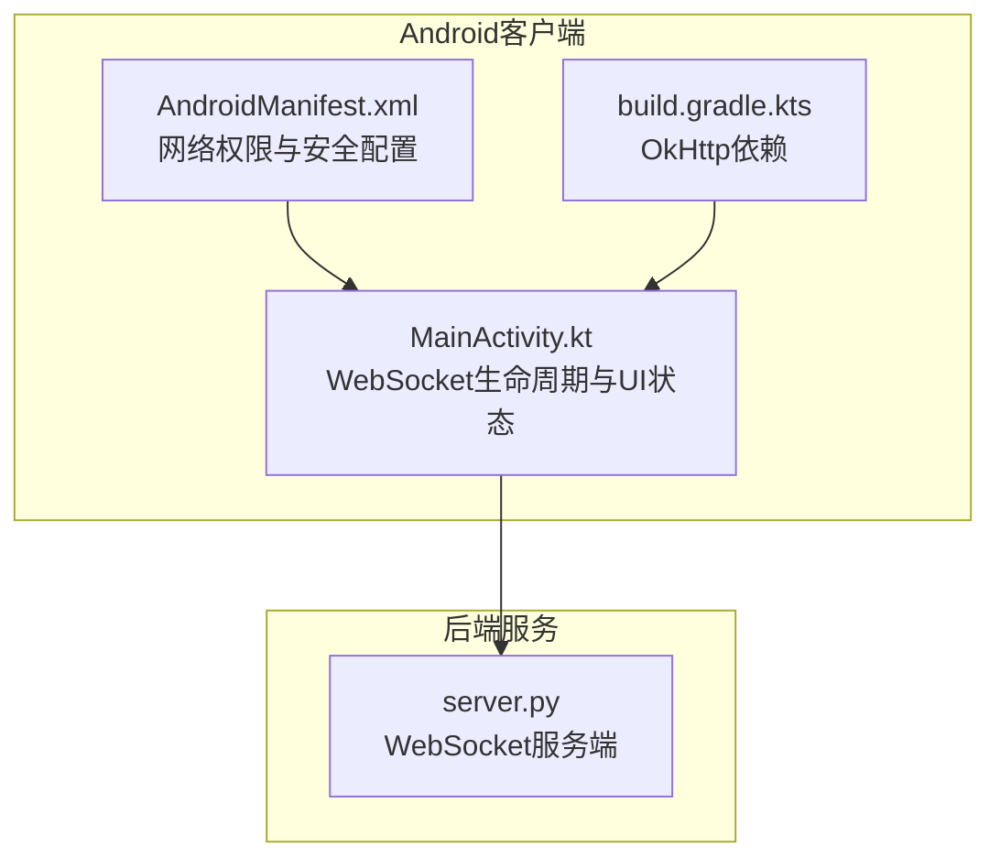
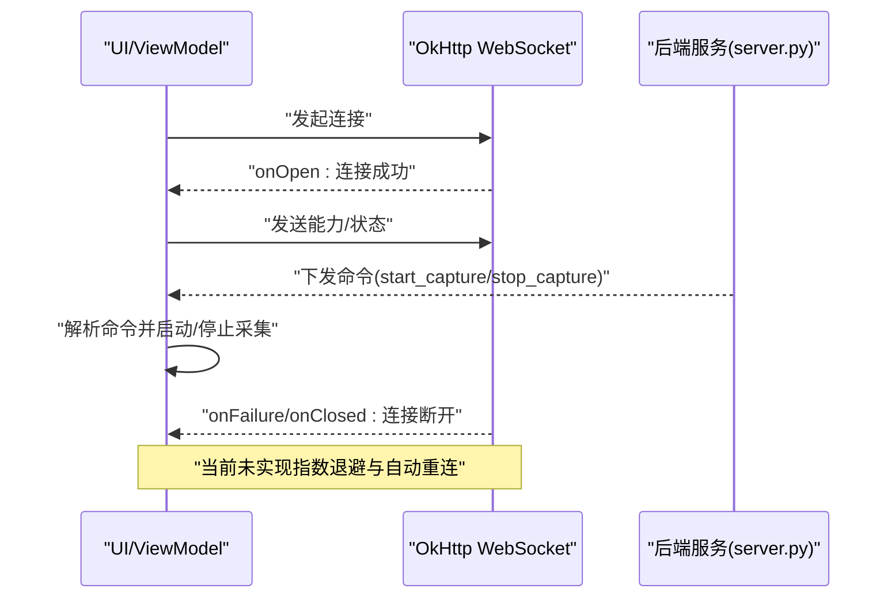
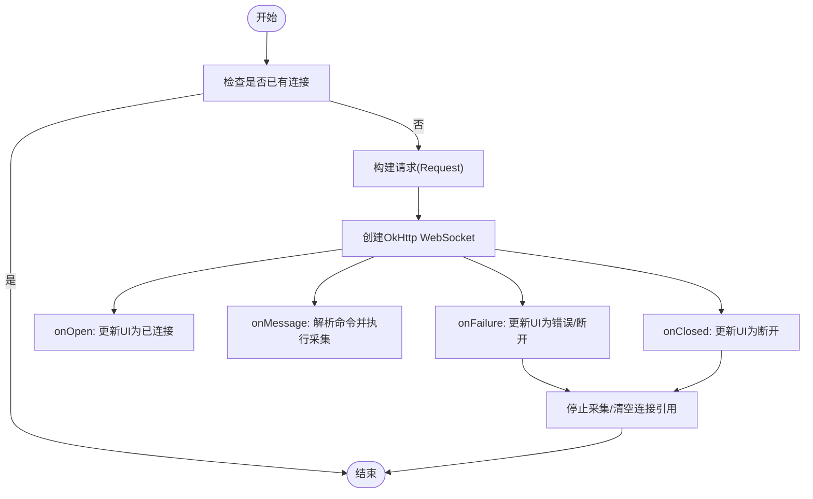
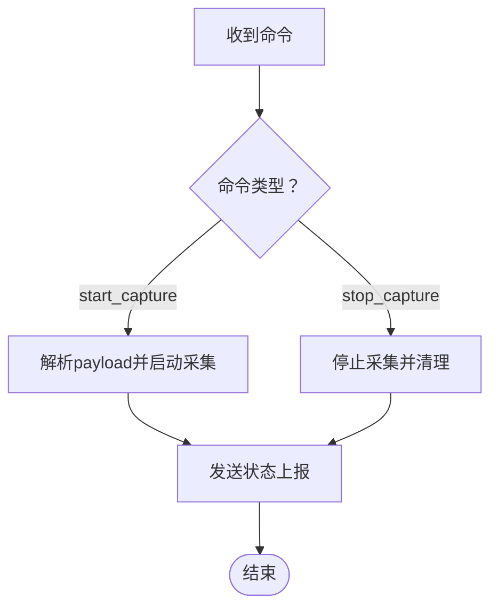
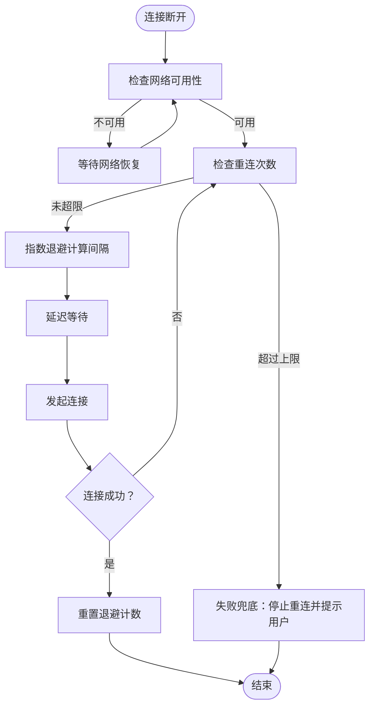
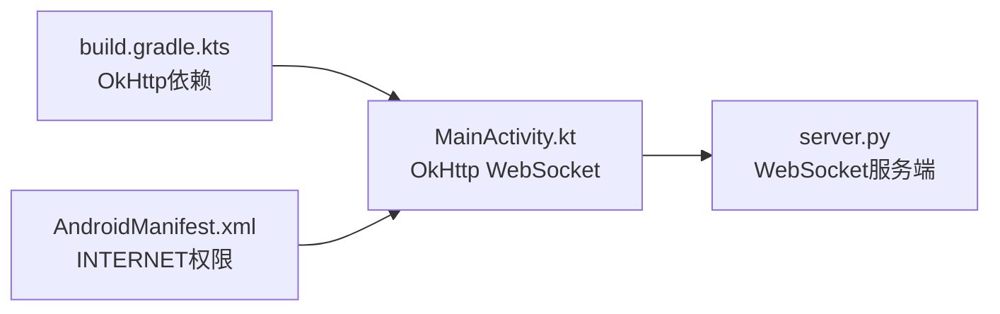

# WebSocket重连机制

<cite>
**本文引用的文件**
- [MainActivity.kt](file://android-camera/app/src/main/java/com/example/lablogcamera/MainActivity.kt)
- [AndroidManifest.xml](file://android-camera/app/src/main/AndroidManifest.xml)
- [build.gradle.kts](file://android-camera/app/build.gradle.kts)
- [server.py](file://backend/server.py)
</cite>

## 目录
1. [引言](#引言)
2. [项目结构](#项目结构)
3. [核心组件](#核心组件)
4. [架构总览](#架构总览)
5. [详细组件分析](#详细组件分析)
6. [依赖关系分析](#依赖关系分析)
7. [性能考量](#性能考量)
8. [故障排查指南](#故障排查指南)
9. [结论](#结论)
10. [附录](#附录)

## 引言
本文件围绕Android客户端的WebSocket自动重连机制展开，结合现有代码实现，系统性阐述指数退避算法在重连策略中的应用、网络状态变化监听与智能重连、Handler/Coroutine延迟重试、连接状态管理与一致性保障、重连次数限制与手动触发、以及失败兜底处理。文档旨在帮助开发者在保持良好用户体验的前提下，构建稳定可靠的长连接通信。

## 项目结构
- Android客户端位于 android-camera/app，采用Jetpack Compose + CameraX + OkHttp WebSocket实现。
- 后端服务位于 backend，提供WebSocket服务端，用于接收Android端H.264流与命令。
- 仓库包含多个历史示例工程，其中与本主题最相关的是android-camera与backend目录。

图表来源
- [MainActivity.kt](file://android-camera/app/src/main/java/com/example/lablogcamera/MainActivity.kt#L867-L900)
- [AndroidManifest.xml](file://android-camera/app/src/main/AndroidManifest.xml#L1-L32)
- [build.gradle.kts](file://android-camera/app/build.gradle.kts#L44-L68)
- [server.py](file://backend/server.py#L418-L439)

章节来源
- [MainActivity.kt](file://android-camera/app/src/main/java/com/example/lablogcamera/MainActivity.kt#L867-L900)
- [AndroidManifest.xml](file://android-camera/app/src/main/AndroidManifest.xml#L1-L32)
- [build.gradle.kts](file://android-camera/app/build.gradle.kts#L44-L68)
- [server.py](file://backend/server.py#L418-L439)

## 核心组件
- WebSocket生命周期管理：在ViewModel中封装OkHttp WebSocket的创建、消息处理、关闭与清理。
- UI状态与命令交互：通过状态流驱动UI，接收服务器命令并执行采集/停止等操作。
- 网络与权限：声明INTERNET权限，后端网络配置在清单中启用。
- 依赖：OkHttp 4.x提供WebSocket客户端能力。

章节来源
- [MainActivity.kt](file://android-camera/app/src/main/java/com/example/lablogcamera/MainActivity.kt#L867-L900)
- [AndroidManifest.xml](file://android-camera/app/src/main/AndroidManifest.xml#L1-L32)
- [build.gradle.kts](file://android-camera/app/build.gradle.kts#L44-L68)

## 架构总览
Android客户端通过OkHttp WebSocket与后端建立长连接，服务器下发命令控制采集，客户端编码并发送H.264帧。当前代码未实现指数退避与网络监听自动重连，但具备完善的连接状态管理与命令处理框架，可在此基础上扩展重连策略。

图表来源
- [MainActivity.kt](file://android-camera/app/src/main/java/com/example/lablogcamera/MainActivity.kt#L867-L900)
- [server.py](file://backend/server.py#L418-L439)

## 详细组件分析

### WebSocket连接与状态管理
- 连接入口：在ViewModel中创建OkHttp WebSocket实例，注册WebSocketListener，处理onOpen/onMessage/onFailure/onClosed等回调。
- 状态更新：onOpen时更新UI状态为已连接并上报能力；onFailure/onClosed时重置流状态、清空连接引用，避免重复连接。
- 断开策略：disconnect时主动关闭WebSocket并清理资源。

图表来源
- [MainActivity.kt](file://android-camera/app/src/main/java/com/example/lablogcamera/MainActivity.kt#L867-L900)

章节来源
- [MainActivity.kt](file://android-camera/app/src/main/java/com/example/lablogcamera/MainActivity.kt#L867-L900)

### 命令处理与采集控制
- start_capture：解析payload中的宽高比、码率、帧率，启动ImageAnalysis与H.264编码器，按策略发送帧。
- stop_capture：停止采集、释放资源、更新UI状态。
- 服务器命令解析与状态上报：handleServerCommand与sendStatus。

图表来源
- [MainActivity.kt](file://android-camera/app/src/main/java/com/example/lablogcamera/MainActivity.kt#L902-L942)
- [MainActivity.kt](file://android-camera/app/src/main/java/com/example/lablogcamera/MainActivity.kt#L944-L1200)

章节来源
- [MainActivity.kt](file://android-camera/app/src/main/java/com/example/lablogcamera/MainActivity.kt#L902-L942)
- [MainActivity.kt](file://android-camera/app/src/main/java/com/example/lablogcamera/MainActivity.kt#L944-L1200)

### 现状与扩展建议（指数退避与自动重连）
当前代码未实现指数退避与网络监听自动重连，但具备以下基础条件：
- OkHttp WebSocket已就绪，可直接复用。
- UI状态与命令处理完备，便于在onFailure/onClosed中插入重连逻辑。
- 服务器端可作为长连接通信的可靠终点。

为实现指数退避自动重连，建议如下（概念性设计，非现有实现）：
- 指数退避参数
  - 初始重试间隔：例如1秒
  - 最大重试间隔：例如60秒
  - 退避倍数：例如2.0
  - 重连上限：例如10次
- 网络监听
  - 使用ConnectivityManager.NetworkCallback监听网络可用/丢失
  - 在onAvailable时触发重连；在onLost时暂停重连计时
- 延迟重试
  - Handler.postDelayed或Kotlin协程delay实现延迟
  - 使用viewModelScope或专用调度器隔离重连任务
- 状态管理
  - 使用状态机或布尔标志避免重复连接
  - 在重连中止或达到上限时，进入失败兜底状态
- 手动重连
  - UI提供“手动重连”按钮，调用connect()并重置退避计数
- 失败兜底
  - 达到上限后，提示用户检查网络/服务器状态，停止自动重连

[本图为概念性流程，不对应具体源码，故无图表来源]

章节来源
- [MainActivity.kt](file://android-camera/app/src/main/java/com/example/lablogcamera/MainActivity.kt#L867-L900)

## 依赖关系分析
- OkHttp依赖：app/build.gradle.kts中引入OkHttp，为WebSocket客户端提供能力。
- 权限与网络：AndroidManifest.xml声明INTERNET权限，并启用网络配置文件，确保网络访问与安全策略生效。
- 服务器端：server.py提供WebSocket服务端，与Android客户端建立长连接。

图表来源
- [build.gradle.kts](file://android-camera/app/build.gradle.kts#L44-L68)
- [AndroidManifest.xml](file://android-camera/app/src/main/AndroidManifest.xml#L1-L32)
- [MainActivity.kt](file://android-camera/app/src/main/java/com/example/lablogcamera/MainActivity.kt#L867-L900)
- [server.py](file://backend/server.py#L418-L439)

章节来源
- [build.gradle.kts](file://android-camera/app/build.gradle.kts#L44-L68)
- [AndroidManifest.xml](file://android-camera/app/src/main/AndroidManifest.xml#L1-L32)
- [MainActivity.kt](file://android-camera/app/src/main/java/com/example/lablogcamera/MainActivity.kt#L867-L900)
- [server.py](file://backend/server.py#L418-L439)

## 性能考量
- 帧率控制：通过shouldSendFrame按目标FPS主动丢帧，避免网络拥塞与编码压力。
- 编码器与裁剪：对齐32对齐与偶数约束，减少硬件编码器兼容性问题。
- UI与生命周期：在停止采集时释放资源，避免内存泄漏与CPU占用。

章节来源
- [MainActivity.kt](file://android-camera/app/src/main/java/com/example/lablogcamera/MainActivity.kt#L1299-L1341)
- [MainActivity.kt](file://android-camera/app/src/main/java/com/example/lablogcamera/MainActivity.kt#L1347-L1448)

## 故障排查指南
- 连接失败
  - 检查URL与网络权限
  - 查看onFailure回调中的错误信息，确认是否因网络不可达或证书问题
- 采集异常
  - 确认相机权限与分辨率查询是否成功
  - 检查帧率与码率设置是否合理
- 服务器端
  - server.py中存在连接断开与日志输出，可用于定位后端问题

章节来源
- [MainActivity.kt](file://android-camera/app/src/main/java/com/example/lablogcamera/MainActivity.kt#L867-L900)
- [server.py](file://backend/server.py#L418-L439)

## 结论
当前Android客户端已具备完整的WebSocket连接与命令处理框架，但未实现指数退避与网络监听自动重连。基于现有代码，可在onFailure/onClosed处无缝接入指数退避重连策略，结合网络状态监听与延迟重试，形成稳定可靠的长连接通信方案。同时，通过手动重连与失败兜底，进一步提升用户体验与系统鲁棒性。

## 附录
- 关键实现路径
  - 连接与回调：[MainActivity.kt](file://android-camera/app/src/main/java/com/example/lablogcamera/MainActivity.kt#L867-L900)
  - 命令解析与采集控制：[MainActivity.kt](file://android-camera/app/src/main/java/com/example/lablogcamera/MainActivity.kt#L902-L1200)
  - 依赖与权限：[build.gradle.kts](file://android-camera/app/build.gradle.kts#L44-L68)、[AndroidManifest.xml](file://android-camera/app/src/main/AndroidManifest.xml#L1-L32)
  - 服务器端：[server.py](file://backend/server.py#L418-L439)