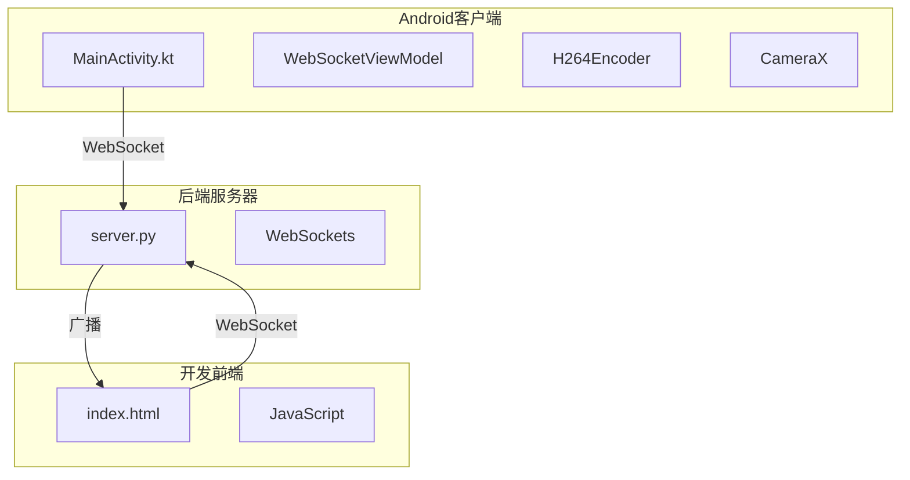
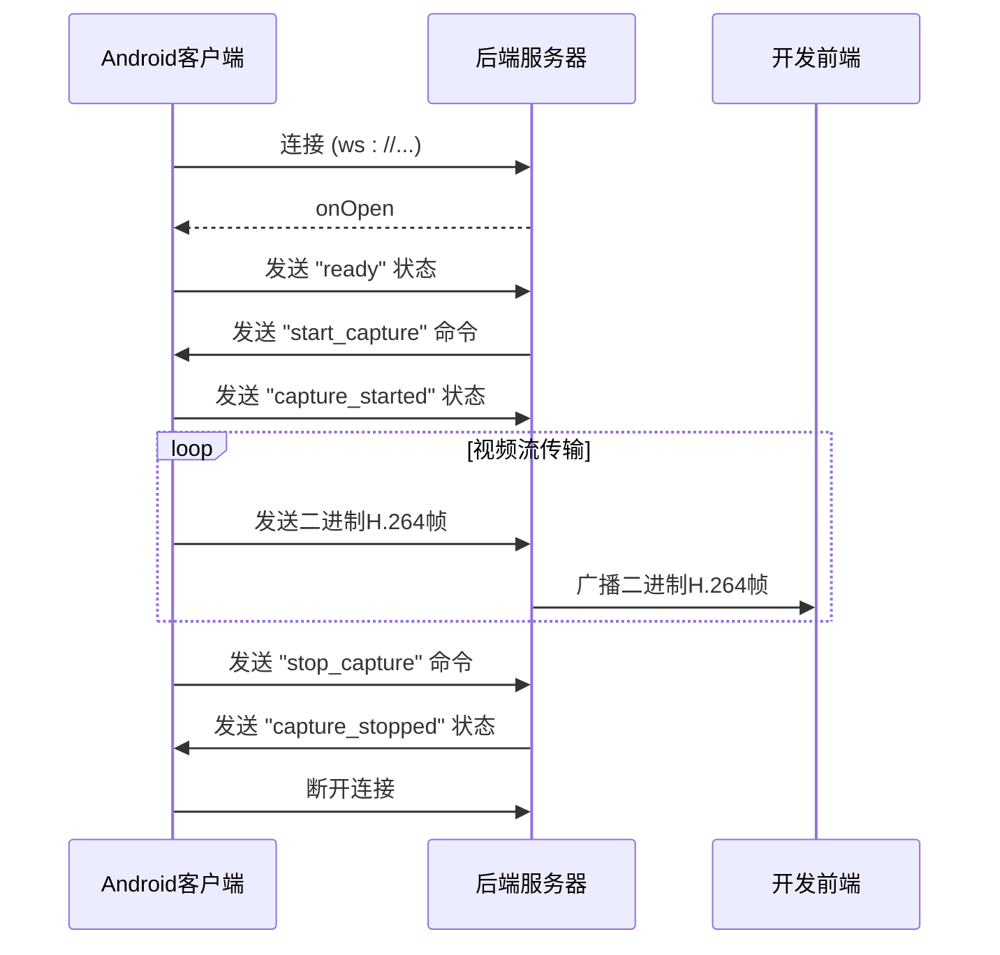
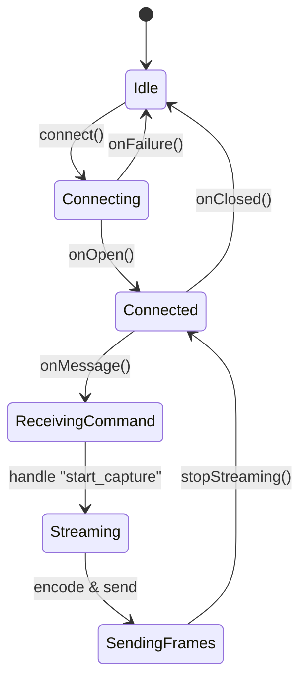
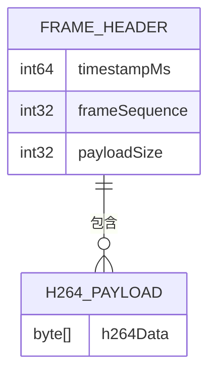
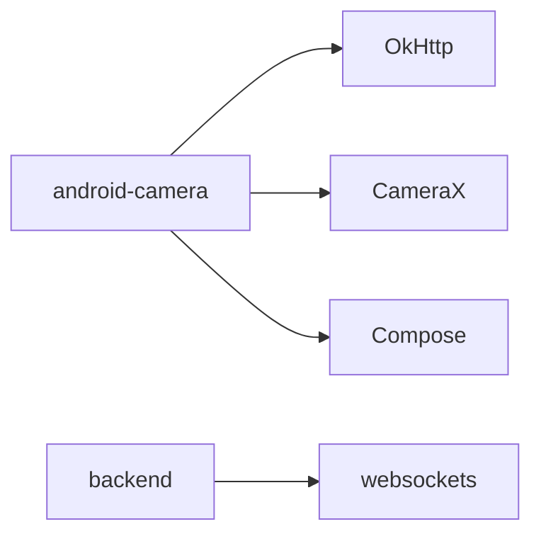

# WebSocket通信机制

<cite>
**本文档引用的文件**   
- [MainActivity.kt](file://android-camera/app/src/main/java/com/example/lablogcamera/MainActivity.kt)
- [build.gradle.kts](file://android-camera/app/build.gradle.kts)
- [server.py](file://backend/server.py)
- [index.html](file://developer-frontend/index.html)
</cite>

## 目录
1. [引言](#引言)
2. [项目结构](#项目结构)
3. [核心组件](#核心组件)
4. [架构概述](#架构概述)
5. [详细组件分析](#详细组件分析)
6. [依赖分析](#依赖分析)
7. [性能考虑](#性能考虑)
8. [故障排除指南](#故障排除指南)
9. [结论](#结论)

## 引言
本文档详细阐述了Android客户端与后端服务器之间通过WebSocket进行实时通信的完整机制。该系统旨在实现低延迟的视频流传输，支持控制命令下发、状态上报以及H.264视频帧的高效传输。客户端使用OkHttpClient建立长连接，通过WebSocketListener处理连接生命周期事件，并利用CameraX和MediaCodec实现视频采集与编码。后端服务器使用Python的websockets库，能够接收并处理来自客户端的文本和二进制消息。整个系统设计考虑了健壮性，包含了连接重试、心跳检测和异常恢复等机制。

## 项目结构
项目包含一个Android客户端应用、一个Python后端服务器和一个用于开发测试的前端界面。Android客户端是核心，负责视频采集、编码和通过WebSocket发送数据。后端服务器作为消息的中转和处理中心，接收视频流并将其广播给所有连接的前端。开发前端提供了一个简单的用户界面，用于监控连接状态和查看实时视频流。



**图表来源**
- [MainActivity.kt](file://android-camera/app/src/main/java/com/example/lablogcamera/MainActivity.kt)
- [server.py](file://backend/server.py)
- [index.html](file://developer-frontend/index.html)

## 核心组件
核心组件包括WebSocket的连接管理、视频的采集与编码、以及消息的解析与处理。`WebSocketViewModel`是整个通信逻辑的中枢，它协调着连接状态、视频流的启停以及与UI的交互。`H264Encoder`封装了Android的MediaCodec，负责将CameraX采集的YUV图像编码为H.264格式。`ServerCommand`和`ClientStatus`数据类定义了客户端与服务器之间通信的协议，确保了消息的结构化和可解析性。

**章节来源**
- [MainActivity.kt](file://android-camera/app/src/main/java/com/example/lablogcamera/MainActivity.kt)

## 架构概述
系统采用客户端-服务器（C/S）架构。Android客户端作为WebSocket客户端，主动连接到后端服务器。服务器作为WebSocket服务端，监听指定端口，接受来自客户端的连接。一旦连接建立，双方即可进行全双工通信。客户端通过发送JSON格式的文本消息来上报状态（如“ready”、“capture_started”）或接收来自服务器的控制命令（如“start_capture”）。同时，客户端通过二进制通道将编码后的H.264视频帧发送给服务器。服务器接收到视频帧后，会将其广播给所有已连接的开发前端，实现多点监控。



**图表来源**
- [MainActivity.kt](file://android-camera/app/src/main/java/com/example/lablogcamera/MainActivity.kt#L867-L900)
- [server.py](file://backend/server.py#L260-L416)

## 详细组件分析

### WebSocket连接管理分析
`WebSocketViewModel`中的`connect()`方法负责建立WebSocket连接。它使用OkHttpClient创建一个`Request`，并调用`newWebSocket()`方法，传入一个自定义的`WebSocketListener`实例。该监听器重写了`onOpen`、`onMessage`、`onClosing`、`onClosed`和`onFailure`方法，以处理连接的各个生命周期事件。

#### WebSocketListener实现


**图表来源**
- [MainActivity.kt](file://android-camera/app/src/main/java/com/example/lablogcamera/MainActivity.kt#L867-L900)

**章节来源**
- [MainActivity.kt](file://android-camera/app/src/main/java/com/example/lablogcamera/MainActivity.kt#L867-L900)

### 数据类与消息协议分析
系统定义了清晰的数据类来规范通信协议。`ServerCommand`代表服务器下发的命令，其`command`字段为字符串类型（如"start_capture"），`payload`字段则包含具体的参数。`CommandPayload`作为`start_capture`命令的负载，包含了视频编码所需的格式、宽高比、码率和帧率等信息。`ClientStatus`用于客户端向服务器上报自身状态，如"ready"、"capture_started"等，便于服务器进行状态管理。

#### 消息协议流程
```mermaid
flowchart TD
A[服务器] --> |发送| B["{ \"command\": \"start_capture\", \"payload\": { \"format\": \"h264\", \"aspectRatio\": { \"width\": 4, \"height\": 3 }, \"bitrate\": 4, \"fps\": 10 } }"]
B --> C[客户端]
C --> D[解析ServerCommand]
D --> E{command == "start_capture"?}
E --> |是| F[启动H.264编码器]
F --> G[发送ClientStatus: "capture_started"]
G --> A
E --> |否| H[忽略或报错]
```

**图表来源**
- [MainActivity.kt](file://android-camera/app/src/main/java/com/example/lablogcamera/MainActivity.kt#L125-L157)

**章节来源**
- [MainActivity.kt](file://android-camera/app/src/main/java/com/example/lablogcamera/MainActivity.kt#L125-L157)

### 双通道传输机制分析
系统实现了文本和二进制的双通道传输。文本通道用于传输结构化的JSON消息，如控制命令和状态报告。二进制通道则用于传输高吞吐量的H.264视频帧数据。在发送二进制帧时，客户端在H.264数据前添加了一个16字节的自定义帧头，包含设备时间戳、帧序号和负载大小，这为后端进行帧同步、丢包检测和性能分析提供了关键信息。

#### 二进制帧结构


**图表来源**
- [MainActivity.kt](file://android-camera/app/src/main/java/com/example/lablogcamera/MainActivity.kt#L967-L982)

**章节来源**
- [MainActivity.kt](file://android-camera/app/src/main/java/com/example/lablogcamera/MainActivity.kt#L967-L982)

### WebSocketViewModel协调分析
`WebSocketViewModel`是连接状态与视频采集逻辑的协调者。它暴露了`uiState`、`selectedAspectRatio`等`StateFlow`，供UI层观察和响应。当用户在UI上切换摄像头或宽高比时，会调用`onCameraFacingSelected`或`onAspectRatioSelected`方法，更新ViewModel中的状态。当收到服务器的`start_capture`命令时，`handleServerCommand`方法会触发`startStreaming`流程，该流程会配置`ImageAnalysis`的分辨率和裁剪区域，并初始化`H264Encoder`，从而启动视频采集和编码。

**章节来源**
- [MainActivity.kt](file://android-camera/app/src/main/java/com/example/lablogcamera/MainActivity.kt#L554-L1327)

### 健壮性设计分析
系统实现了多种健壮性设计。在连接层面，虽然`OkHttpClient`本身不直接提供自动重连，但应用逻辑在`onFailure`和`onClosed`事件中会清理资源并更新UI状态，为上层实现重连逻辑提供了基础。在数据传输层面，通过在二进制帧头中加入时间戳和序号，后端可以检测到丢包和乱序。在视频采集层面，通过`shouldSendFrame`方法实现了基于目标帧率的主动丢帧控制，防止编码器过载。

**章节来源**
- [MainActivity.kt](file://android-camera/app/src/main/java/com/example/lablogcamera/MainActivity.kt#L888-L898)

### 完整调用链分析
从`MainActivity`发起连接到消息广播的完整调用链如下：用户在`MainScreen`中输入URL并打开连接开关，触发`onConnectToggle`；该方法调用`WebSocketViewModel`的`connect()`；`connect()`创建`WebSocket`并设置`WebSocketListener`；连接成功后，`onOpen`被调用，客户端发送`ready`状态；服务器收到后，通过终端输入`start`命令，`server.py`解析命令并广播`start_capture`消息；客户端的`onMessage`收到该消息，`handleServerCommand`解析后调用`startStreaming`；`startStreaming`配置`ImageAnalysis`并启动`H264Encoder`；编码器每编码一帧，就通过`webSocket.send()`将二进制帧发送给服务器；服务器接收到二进制帧后，将其广播给所有连接的`developer-frontend`。

**章节来源**
- [MainActivity.kt](file://android-camera/app/src/main/java/com/example/lablogcamera/MainActivity.kt#L1678-L2108)
- [server.py](file://backend/server.py#L260-L416)

### 初学者代码示例
对于初学者，建立WebSocket连接的基本代码示例如下：
```kotlin
val client = OkHttpClient()
val request = Request.Builder().url("ws://your-server-address:port").build()
val webSocket = client.newWebSocket(request, object : WebSocketListener() {
    override fun onOpen(webSocket: WebSocket, response: Response) {
        Log.d("WebSocket", "连接已打开")
    }

    override fun onMessage(webSocket: WebSocket, text: String) {
        Log.d("WebSocket", "收到文本消息: $text")
    }

    override fun onMessage(webSocket: WebSocket, bytes: ByteString) {
        Log.d("WebSocket", "收到二进制消息，长度: ${bytes.size}")
    }

    override fun onClosing(webSocket: WebSocket, code: Int, reason: String) {
        webSocket.close(1000, null)
    }

    override fun onFailure(webSocket: WebSocket, t: Throwable, response: Response?) {
        Log.e("WebSocket", "连接失败", t)
    }
})
```

### 高级设计思路
对于高级用户，多客户端并发管理的设计思路主要在后端实现。`server.py`维护了一个`CONNECTED_CLIENTS`的集合，每当有新客户端连接，就将其`WebSocket`对象加入集合。当需要向所有客户端广播消息（如控制命令）时，遍历该集合并逐个发送。这种设计模式可以轻松扩展到支持成百上千的并发客户端，只需确保服务器有足够的网络带宽和计算资源。

**章节来源**
- [server.py](file://backend/server.py#L260-L416)

## 依赖分析
Android客户端依赖于`com.squareup.okhttp3:okhttp:4.12.0`库来实现WebSocket通信，依赖`androidx.camera`系列库进行相机操作，依赖`androidx.lifecycle`和`androidx.compose`进行UI和状态管理。后端服务器依赖于`websockets>=12.0`库来构建WebSocket服务。这些依赖关系清晰地划分了客户端和服务器的职责，使得系统易于维护和升级。



**图表来源**
- [build.gradle.kts](file://android-camera/app/build.gradle.kts#L59)
- [requirements.txt](file://backend/requirements.txt)

**章节来源**
- [build.gradle.kts](file://android-camera/app/build.gradle.kts)
- [requirements.txt](file://backend/requirements.txt)

## 性能考虑
系统的性能瓶颈主要在于视频编码和网络传输。H.264编码由硬件加速，但高分辨率和高码率会显著增加CPU和GPU的负载。网络传输的带宽需求与码率直接相关，例如4MB码率需要约32Mbps的稳定上行带宽。为了优化性能，客户端实现了基于目标帧率的主动丢帧策略，避免了因编码速度跟不上采集速度而导致的内存溢出和卡顿。此外，通过在连接建立时上报设备能力，服务器可以下发适合客户端性能的采集参数，实现自适应流媒体。

## 故障排除指南
常见的故障包括连接失败、视频流中断和画面异常。连接失败通常由网络问题、服务器地址错误或防火墙阻止引起，应检查URL和网络连接。视频流中断可能是由于客户端应用被后台杀死、设备锁屏或服务器主动断开，应确保应用在前台运行。画面出现绿带或条纹，通常是由于YUV数据转换或裁剪时对齐不当导致，代码中通过`ensureEvenBounds`和32像素对齐来规避此问题。通过查看`Logcat`中的日志，可以快速定位`onFailure`的具体原因。

**章节来源**
- [MainActivity.kt](file://android-camera/app/src/main/java/com/example/lablogcamera/MainActivity.kt#L888-L892)

## 结论
本文档深入分析了Android客户端WebSocket通信的实现细节。系统通过精心设计的协议和高效的编码传输，实现了稳定的视频流推送。`WebSocketViewModel`作为核心协调者，成功地将网络通信、视频采集和UI状态管理解耦。尽管当前实现已具备良好的功能性和健壮性，但仍有改进空间，例如在客户端实现更智能的自动重连策略，或在后端增加对视频流的转码和分发能力，以支持更多样化的应用场景。