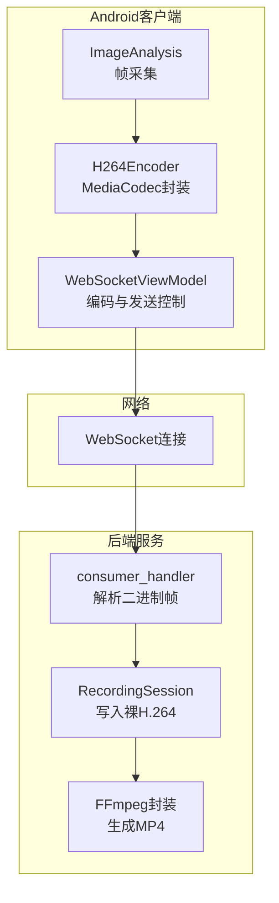
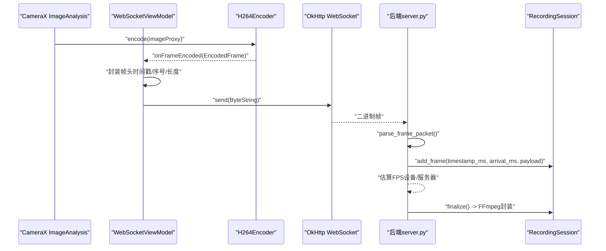
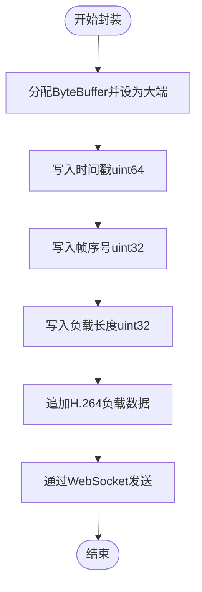
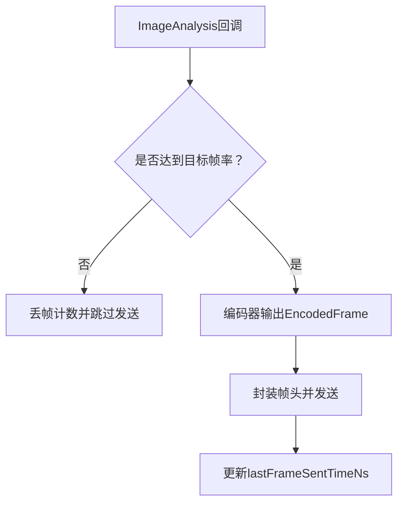
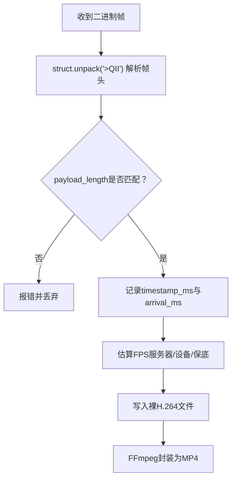
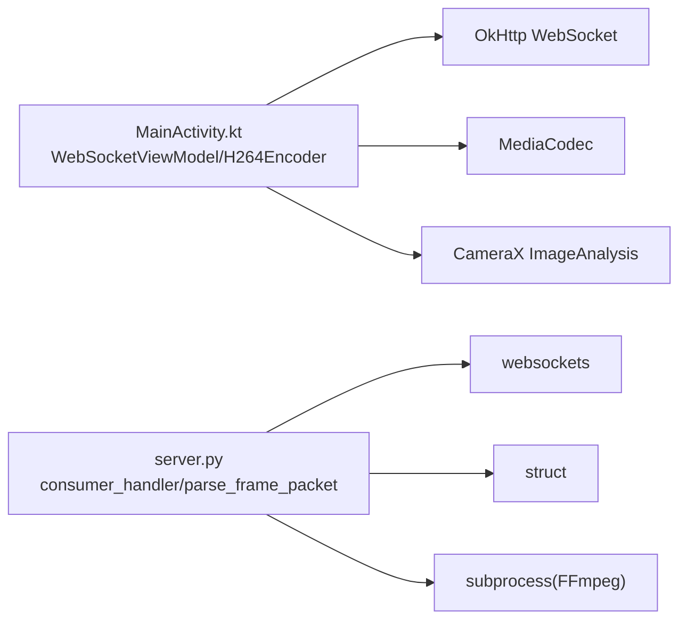

# 二进制消息处理

<cite>
**本文引用的文件**
- [MainActivity.kt](file://android-camera/app/src/main/java/com/example/lablogcamera/MainActivity.kt)
- [server.py](file://backend/server.py)
- [index.html](file://developer-frontend/index.html)
</cite>

## 目录
1. [简介](#简介)
2. [项目结构](#项目结构)
3. [核心组件](#核心组件)
4. [架构总览](#架构总览)
5. [详细组件分析](#详细组件分析)
6. [依赖关系分析](#依赖关系分析)
7. [性能考量](#性能考量)
8. [故障排查指南](#故障排查指南)
9. [结论](#结论)
10. [附录](#附录)

## 简介
本文件围绕Android客户端通过WebSocket发送H.264二进制帧的完整链路展开，重点说明以下内容：
- H.264编码器输出的EncodedFrame如何被封装为带帧头的二进制数据；
- 帧头结构设计（时间戳、帧序号、负载长度）与字节序；
- ByteBuffer的使用方式与数据拼接策略；
- 发送时机控制（与编码器输出同步、非阻塞主线程）；
- 大帧边界处理（避免超过WebSocket帧大小限制）；
- 帧头解析与后端重建时间轴、估算FPS的方法；
- 面向初学者的基础打包发送示例与面向高级用户的零拷贝/批量优化思路。

## 项目结构
该项目由三部分组成：
- Android客户端：负责摄像头采集、H.264编码、帧头封装与WebSocket发送；
- 后端服务：接收二进制帧，解析帧头，写入裸H.264并封装为MP4；
- 开发者前端：用于连接后端、发送控制命令、查看日志与图片（与H.264二进制消息处理无直接关系，但有助于理解整体流程）。

图表来源
- [MainActivity.kt](file://android-camera/app/src/main/java/com/example/lablogcamera/MainActivity.kt#L944-L1191)
- [server.py](file://backend/server.py#L233-L279)

章节来源
- [MainActivity.kt](file://android-camera/app/src/main/java/com/example/lablogcamera/MainActivity.kt#L944-L1191)
- [server.py](file://backend/server.py#L233-L279)

## 核心组件
- EncodedFrame：承载编码后的H.264数据与设备侧时间戳（毫秒）。
- H264Encoder：对MediaCodec进行封装，负责配置、编码与输出回调。
- WebSocketViewModel：负责WebSocket生命周期、命令解析、帧头封装与发送、帧率控制与丢帧策略。
- 后端server：解析二进制帧头，写入裸H.264并估算FPS，最终封装为MP4。

章节来源
- [MainActivity.kt](file://android-camera/app/src/main/java/com/example/lablogcamera/MainActivity.kt#L163-L163)
- [MainActivity.kt](file://android-camera/app/src/main/java/com/example/lablogcamera/MainActivity.kt#L187-L276)
- [MainActivity.kt](file://android-camera/app/src/main/java/com/example/lablogcamera/MainActivity.kt#L944-L1191)
- [server.py](file://backend/server.py#L26-L80)

## 架构总览
Android端在ImageAnalysis回调中触发编码，编码完成后通过WebSocket发送带帧头的二进制数据；后端解析帧头，记录设备时间戳与服务器到达时间，用于估算FPS并写入裸H.264文件，最后通过FFmpeg封装为MP4。

图表来源
- [MainActivity.kt](file://android-camera/app/src/main/java/com/example/lablogcamera/MainActivity.kt#L968-L984)
- [server.py](file://backend/server.py#L135-L147)
- [server.py](file://backend/server.py#L210-L279)

## 详细组件分析

### 帧头结构与字节序
- 帧头字段与布局（与后端严格一致）：
  - 时间戳：uint64（毫秒），占8字节；
  - 帧序号：uint32（低32位递增），占4字节；
  - 负载长度：uint32（后续H.264数据长度），占4字节；
- 字节序：大端（Big Endian）。
- 总帧头长度：16字节。

图表来源
- [MainActivity.kt](file://android-camera/app/src/main/java/com/example/lablogcamera/MainActivity.kt#L968-L984)
- [server.py](file://backend/server.py#L12-L17)

章节来源
- [MainActivity.kt](file://android-camera/app/src/main/java/com/example/lablogcamera/MainActivity.kt#L968-L984)
- [server.py](file://backend/server.py#L12-L17)

### ByteBuffer使用与数据拼接
- 使用ByteBuffer.allocate()分配足够容量（16字节帧头 + H.264负载）；
- 通过order(ByteOrder.BIG_ENDIAN)确保大端字节序；
- 依次写入时间戳、帧序号、负载长度，再追加H.264数据；
- 最终通过toByteString()发送。

章节来源
- [MainActivity.kt](file://android-camera/app/src/main/java/com/example/lablogcamera/MainActivity.kt#L968-L984)

### 发送时机控制与非阻塞
- 发送发生在编码回调onFrameEncoded中，避免阻塞主线程；
- 通过shouldSendFrame(targetFps)主动丢帧，控制发送速率；
- 使用Dispatchers.IO与协程，确保UI线程不被阻塞；
- WebSocket发送采用二进制帧（ByteString），避免JSON序列化开销。

图表来源
- [MainActivity.kt](file://android-camera/app/src/main/java/com/example/lablogcamera/MainActivity.kt#L1329-L1341)
- [MainActivity.kt](file://android-camera/app/src/main/java/com/example/lablogcamera/MainActivity.kt#L968-L984)

章节来源
- [MainActivity.kt](file://android-camera/app/src/main/java/com/example/lablogcamera/MainActivity.kt#L1329-L1341)
- [MainActivity.kt](file://android-camera/app/src/main/java/com/example/lablogcamera/MainActivity.kt#L968-L984)

### 大帧边界处理
- Android端：H.264编码器输出通常为NAL单元片段，单帧可能较大；
- WebSocket帧大小限制：后端server.py未显式设置上限，建议客户端在发送前校验payload长度与帧头总长度之和不超过WebSocket实现的帧上限（常见为64KB~2MB）；
- 若存在超大帧，可在客户端拆分NAL或降低码率/分辨率以满足限制；
- 本仓库未实现客户端拆分逻辑，建议在业务层增加校验与降级策略。

章节来源
- [MainActivity.kt](file://android-camera/app/src/main/java/com/example/lablogcamera/MainActivity.kt#L968-L984)
- [server.py](file://backend/server.py#L233-L279)

### 帧头解析与后端时间轴重建
- 后端使用struct.unpack按">QII"解析帧头（大端，uint64+uint32+uint32）；
- 从二进制消息中分离帧头与H.264负载；
- 记录首尾帧设备时间戳与服务器到达时间，用于估算FPS；
- 估算优先使用服务器到达时间，其次使用设备时间戳，最后使用保底值。

图表来源
- [server.py](file://backend/server.py#L135-L147)
- [server.py](file://backend/server.py#L80-L133)
- [server.py](file://backend/server.py#L150-L179)

章节来源
- [server.py](file://backend/server.py#L135-L147)
- [server.py](file://backend/server.py#L80-L133)
- [server.py](file://backend/server.py#L150-L179)

### 初学者打包发送示例
- 关键步骤：
  - 在编码回调中创建ByteBuffer并设置大端；
  - 写入时间戳（毫秒）、帧序号、负载长度；
  - 追加H.264数据；
  - 通过WebSocket发送二进制帧；
  - 使用shouldSendFrame控制发送频率，避免阻塞。

章节来源
- [MainActivity.kt](file://android-camera/app/src/main/java/com/example/lablogcamera/MainActivity.kt#L968-L984)
- [MainActivity.kt](file://android-camera/app/src/main/java/com/example/lablogcamera/MainActivity.kt#L1329-L1341)

### 高级优化：零拷贝与批量发送
- 零拷贝思路：
  - 使用ByteBuffer直接指向编码器输出缓冲区（若底层支持），避免复制；
  - 使用OkHttp ByteString的底层字节数组引用（谨慎使用，确保生命周期安全）；
- 批量发送思路：
  - 在短时间内聚合多帧，形成批次，减少握手与调度开销；
  - 批次内仍保持每帧独立的帧头，便于后端解析与统计；
- 注意事项：
  - 需要严格的内存管理与生命周期控制，避免悬挂引用；
  - 批量发送可能增加端到端延迟，需权衡吞吐与实时性。

[本节为通用优化建议，不直接分析具体文件]

## 依赖关系分析
- Android端依赖：
  - OkHttp WebSocket：负责二进制帧发送；
  - MediaCodec：负责H.264编码；
  - CameraX ImageAnalysis：负责帧采集与回调；
- 后端依赖：
  - websockets：负责WebSocket连接与消息收发；
  - struct：负责帧头解析；
  - subprocess：调用FFmpeg进行封装。

图表来源
- [MainActivity.kt](file://android-camera/app/src/main/java/com/example/lablogcamera/MainActivity.kt#L944-L1191)
- [server.py](file://backend/server.py#L233-L279)

章节来源
- [MainActivity.kt](file://android-camera/app/src/main/java/com/example/lablogcamera/MainActivity.kt#L944-L1191)
- [server.py](file://backend/server.py#L233-L279)

## 性能考量
- 发送频率控制：通过shouldSendFrame(targetFps)主动丢帧，避免网络拥塞与编码器积压；
- 非阻塞发送：编码回调与WebSocket发送均在IO线程执行，避免阻塞UI；
- 帧头紧凑：仅包含必要字段（时间戳、序号、长度），减少头部开销；
- 后端估算FPS：使用服务器到达时间与设备时间戳双重估算，提高鲁棒性；
- 封装效率：FFmpeg直接拷贝视频轨，避免重编码，提升封装速度。

章节来源
- [MainActivity.kt](file://android-camera/app/src/main/java/com/example/lablogcamera/MainActivity.kt#L1329-L1341)
- [server.py](file://backend/server.py#L80-L133)
- [server.py](file://backend/server.py#L150-L179)

## 故障排查指南
- 帧头长度不匹配：
  - 现象：后端报“payload_length mismatch”；
  - 排查：确认Android端帧头长度与H.264负载长度一致，且均为大端；
- 二进制帧解析失败：
  - 现象：后端报“Frame packet too small to contain header”；
  - 排查：检查帧头字段数量与字节序，确保帧头≥16字节；
- 发送阻塞或卡顿：
  - 现象：UI卡顿或帧率异常；
  - 排查：确认发送在IO线程执行，避免在主线程阻塞；适当降低目标帧率；
- 大帧导致丢包：
  - 现象：部分帧未到达后端；
  - 排查：降低码率/分辨率或拆分NAL，确保单帧不超过WebSocket实现的帧上限；
- FPS估算异常：
  - 现象：FPS过低或不可用；
  - 排查：检查设备时间戳与服务器到达时间记录，确认网络抖动与丢帧情况。

章节来源
- [server.py](file://backend/server.py#L135-L147)
- [server.py](file://backend/server.py#L80-L133)
- [MainActivity.kt](file://android-camera/app/src/main/java/com/example/lablogcamera/MainActivity.kt#L1329-L1341)

## 结论
本项目通过严格的帧头设计与发送控制，实现了稳定的H.264二进制消息处理链路。Android端负责高质量编码与精准时间戳，后端负责可靠解析与封装。通过合理的帧率控制与后端FPS估算，可有效支撑实时监控与录制场景。对于更高性能需求，可在保证安全性的前提下探索零拷贝与批量发送策略。

## 附录
- 帧头字段定义（与后端一致）：
  - 时间戳（uint64，毫秒）；
  - 帧序号（uint32，低32位递增）；
  - 负载长度（uint32，H.264数据长度）；
- 字节序：大端（Big Endian）；
- 帧头总长：16字节；
- 发送方式：二进制帧（ByteString）。

章节来源
- [MainActivity.kt](file://android-camera/app/src/main/java/com/example/lablogcamera/MainActivity.kt#L968-L984)
- [server.py](file://backend/server.py#L12-L17)