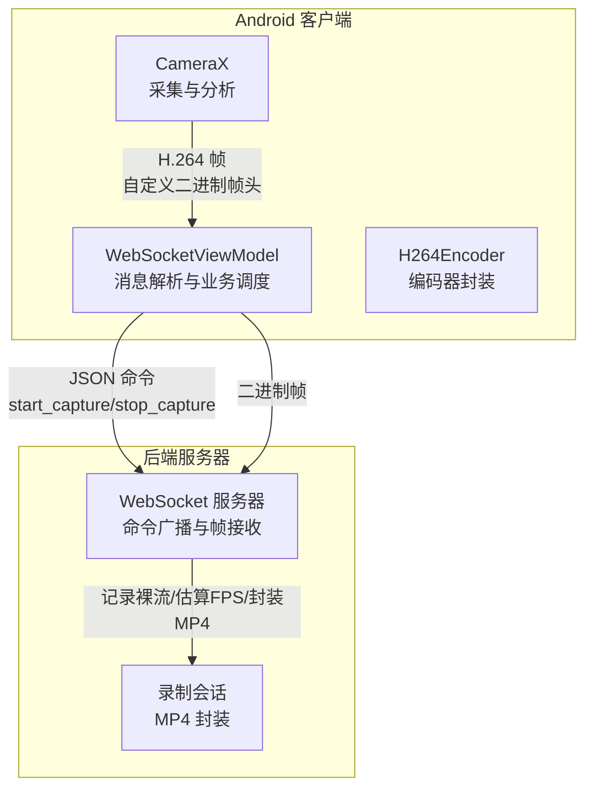
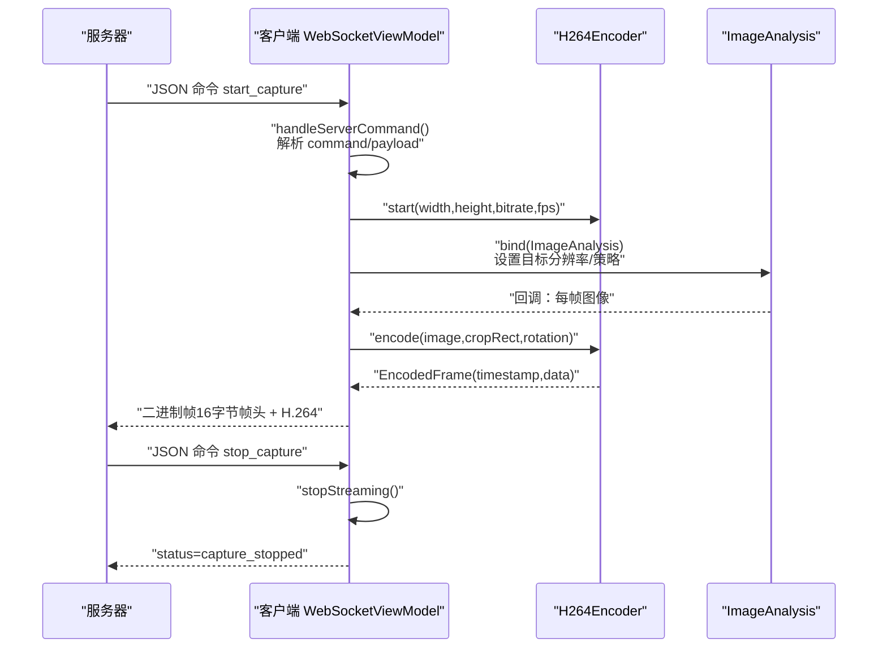
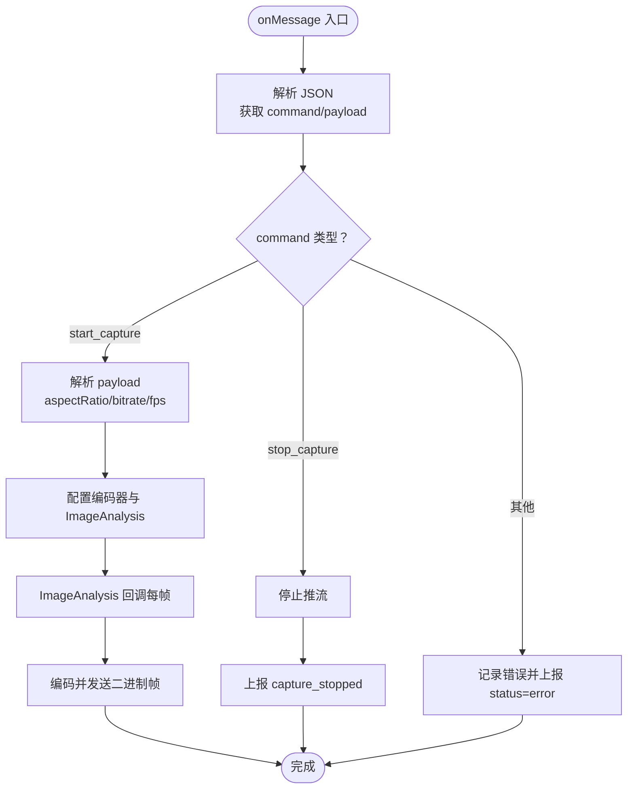
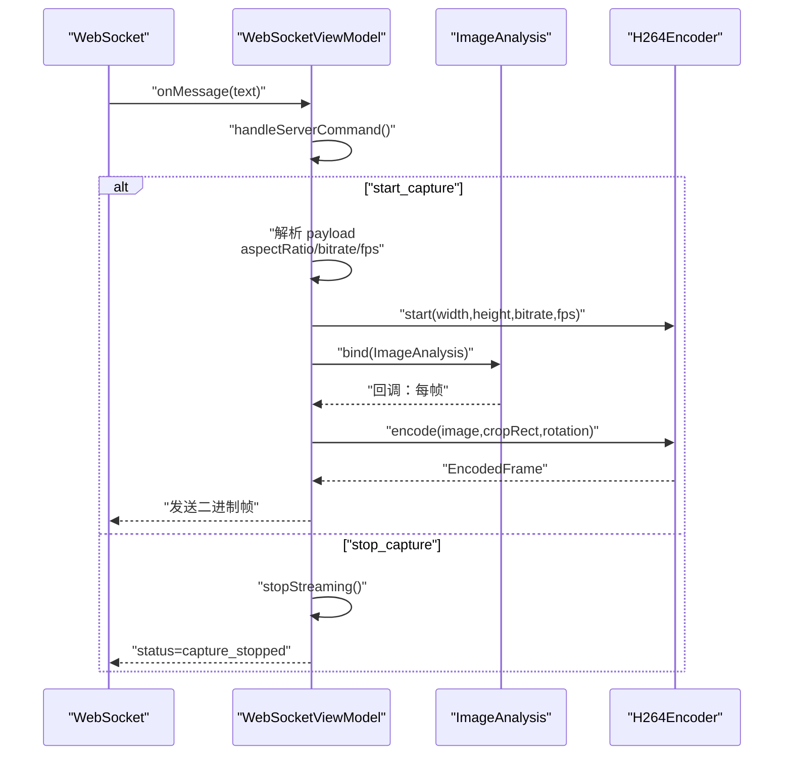
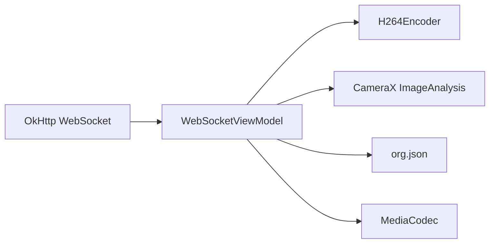

# 文本消息处理

<cite>
**本文引用的文件**
- [MainActivity.kt](file://android-camera/app/src/main/java/com/example/lablogcamera/MainActivity.kt)
- [README.md](file://android-camera/README.md)
- [server.py](file://backend/server.py)
</cite>

## 目录
1. [简介](#简介)
2. [项目结构](#项目结构)
3. [核心组件](#核心组件)
4. [架构总览](#架构总览)
5. [详细组件分析](#详细组件分析)
6. [依赖分析](#依赖分析)
7. [性能考量](#性能考量)
8. [故障排查指南](#故障排查指南)
9. [结论](#结论)
10. [附录](#附录)

## 简介
本文件围绕 Android 客户端 WebSocket 文本消息处理展开，重点讲解：
- WebSocketListener 的 onMessage 回调如何接收并解析服务端下发的 JSON 命令；
- ServerCommand 数据类的反序列化与 payload 参数提取；
- 命令类型分支（start_capture、stop_capture）的业务处理；
- 参数解析与编码器配置（aspectRatio、bitrate、fps）；
- 错误处理与日志记录；
- 从消息接收、解析到业务逻辑分发的完整流程；
- 面向初学者的简单命令响应模式与面向高级开发者的命令队列与并发控制优化建议。

## 项目结构
Android 客户端位于 android-camera/app/src/main/java/com/example/lablogcamera/MainActivity.kt，核心职责包括：
- 建立 WebSocket 连接并处理生命周期事件；
- 解析服务端下发的 JSON 命令；
- 根据命令类型启动/停止推流；
- 通过 CameraX 采集与 MediaCodec 编码，按帧头格式发送二进制帧。

后端服务器位于 backend/server.py，负责：
- 解析命令行输入并广播 JSON 命令；
- 接收客户端二进制帧，记录时间戳并封装为 MP4。

图表来源
- [MainActivity.kt](file://android-camera/app/src/main/java/com/example/lablogcamera/MainActivity.kt#L867-L942)
- [server.py](file://backend/server.py#L1-L120)

章节来源
- [MainActivity.kt](file://android-camera/app/src/main/java/com/example/lablogcamera/MainActivity.kt#L867-L942)
- [README.md](file://android-camera/README.md#L135-L252)

## 核心组件
- ServerCommand：服务端下发命令的统一抽象，包含 command 字段与可选 payload。
- CommandPayload：start_capture 命令的负载参数，包含 format、aspectRatio、bitrate（MB）、fps。
- ClientStatus：客户端上报的状态消息，包含 status 与 message。
- WebSocketViewModel：核心控制中枢，负责 WebSocket 生命周期、命令解析、推流控制、能力上报与状态上报。
- H264Encoder：对 MediaCodec 的封装，负责配置与编码流程。

章节来源
- [MainActivity.kt](file://android-camera/app/src/main/java/com/example/lablogcamera/MainActivity.kt#L125-L178)
- [README.md](file://android-camera/README.md#L41-L69)

## 架构总览
Android 客户端在连接建立后，先上报能力（capabilities），随后监听服务端广播的 JSON 命令。命令解析后进入业务分支：
- start_capture：解析 payload，配置编码器与 ImageAnalysis，按帧发送二进制帧；
- stop_capture：停止编码器与分析，上报 capture_stopped。

图表来源
- [MainActivity.kt](file://android-camera/app/src/main/java/com/example/lablogcamera/MainActivity.kt#L867-L942)
- [MainActivity.kt](file://android-camera/app/src/main/java/com/example/lablogcamera/MainActivity.kt#L944-L1226)
- [server.py](file://backend/server.py#L355-L416)

## 详细组件分析

### WebSocketListener.onMessage 与命令解析
- onMessage 回调接收文本消息，调用 handleServerCommand 进行解析；
- handleServerCommand 使用 JSON 解析，根据 command 分支处理；
- 对于 start_capture，解析 payload 的 aspectRatio、bitrate（MB→bps）、fps；
- 对于 stop_capture，直接停止推流；
- 异常捕获与错误状态上报。

图表来源
- [MainActivity.kt](file://android-camera/app/src/main/java/com/example/lablogcamera/MainActivity.kt#L878-L942)

章节来源
- [MainActivity.kt](file://android-camera/app/src/main/java/com/example/lablogcamera/MainActivity.kt#L878-L942)

### ServerCommand 与 CommandPayload 反序列化
- ServerCommand：包含 command 与可选 payload；
- CommandPayload：format、aspectRatio、bitrate（MB）、fps；
- 反序列化流程：
  - 读取 JSON 对象；
  - 读取 command 字段；
  - 若为 start_capture，读取 payload；
  - 读取 payload 中的 aspectRatio（可选）、bitrate（MB，默认4）、fps（默认0）；
  - 将 bitrate（MB）转换为 bps 传入编码器；
  - fps<=0 视为不限帧率，>0 则按时间间隔丢帧。

章节来源
- [MainActivity.kt](file://android-camera/app/src/main/java/com/example/lablogcamera/MainActivity.kt#L125-L178)
- [MainActivity.kt](file://android-camera/app/src/main/java/com/example/lablogcamera/MainActivity.kt#L902-L942)
- [README.md](file://android-camera/README.md#L173-L221)

### 命令分支与业务逻辑
- start_capture：
  - 若 payload 含 aspectRatio：覆盖本地选择并同步 UI；
  - 若缺失：使用当前 UI 选择的宽高比；
  - 计算目标分辨率（基于 1920 宽度与宽高比，高度偶数对齐）；
  - 启动 H264Encoder，配置码率与目标帧率；
  - 绑定 ImageAnalysis，设置 BackpressureStrategy 为 KEEP_ONLY_LATEST；
  - 每帧根据 shouldSendFrame 控制发送频率，必要时丢帧；
  - 编码完成后构造 16 字节帧头（timestampMs、frameSequence、payloadSize），拼接 H.264 发送；
  - 上报 capture_started。
- stop_capture：
  - 清理 ImageAnalysis、停止编码器、重置状态；
  - 上报 capture_stopped。

章节来源
- [MainActivity.kt](file://android-camera/app/src/main/java/com/example/lablogcamera/MainActivity.kt#L944-L1226)
- [README.md](file://android-camera/README.md#L61-L93)

### 参数提取与编码器配置
- aspectRatio：
  - 服务器下发时优先使用；
  - 未下发时使用 UI 选择的宽高比；
  - 计算裁剪区域时，按 32 对齐与偶数约束；
- bitrate：
  - 以 MB 为单位，转换为 bps；
  - 传入 MediaFormat.KEY_BIT_RATE；
- fps：
  - 0 或缺省：不限帧率；
  - >0：通过 shouldSendFrame 控制最小时间间隔，丢弃多余帧；
- 编码器：
  - 颜色格式为 YUV420 半平面（NV12）；
  - I 帧间隔设为 1 秒；
  - 首帧确定编码分辨率与旋转角度，后续复用。

章节来源
- [MainActivity.kt](file://android-camera/app/src/main/java/com/example/lablogcamera/MainActivity.kt#L944-L1226)
- [README.md](file://android-camera/README.md#L41-L69)

### 错误处理与日志记录
- JSON 解析异常：捕获异常并记录日志，同时上报 status=error；
- WebSocket 失败/关闭：更新 UI 状态，停止推流，清理资源；
- 编码器异常：捕获异常并记录日志，避免 Analyzer 中断；
- 能力上报与状态上报：在连接建立后发送 capabilities，关键状态变更时发送 status。

章节来源
- [MainActivity.kt](file://android-camera/app/src/main/java/com/example/lablogcamera/MainActivity.kt#L878-L942)
- [MainActivity.kt](file://android-camera/app/src/main/java/com/example/lablogcamera/MainActivity.kt#L1203-L1242)
- [MainActivity.kt](file://android-camera/app/src/main/java/com/example/lablogcamera/MainActivity.kt#L1244-L1316)

### 从消息接收、解析到业务分发的完整流程

图表来源
- [MainActivity.kt](file://android-camera/app/src/main/java/com/example/lablogcamera/MainActivity.kt#L878-L942)
- [MainActivity.kt](file://android-camera/app/src/main/java/com/example/lablogcamera/MainActivity.kt#L944-L1226)

## 依赖分析
- WebSocket 通信：OkHttp WebSocket；
- 编码：MediaCodec（H.264，NV12）；
- 采集：CameraX（ImageAnalysis）；
- JSON 解析：org.json（JSONObject/JSONArray）；
- 线程模型：ViewModel 使用 Dispatchers.IO 与 Dispatchers.Main 切换；编码器与图像分析通过单线程执行器隔离。

图表来源
- [MainActivity.kt](file://android-camera/app/src/main/java/com/example/lablogcamera/MainActivity.kt#L106-L116)
- [MainActivity.kt](file://android-camera/app/src/main/java/com/example/lablogcamera/MainActivity.kt#L187-L276)
- [MainActivity.kt](file://android-camera/app/src/main/java/com/example/lablogcamera/MainActivity.kt#L1012-L1022)

章节来源
- [MainActivity.kt](file://android-camera/app/src/main/java/com/example/lablogcamera/MainActivity.kt#L106-L116)
- [MainActivity.kt](file://android-camera/app/src/main/java/com/example/lablogcamera/MainActivity.kt#L187-L276)

## 性能考量
- 帧率控制：shouldSendFrame 基于目标帧率计算最小发送间隔，超过阈值才发送，其余丢弃；
- 编码器配置：I 帧间隔 1 秒，帧率参考 10（targetFps<=0 时），避免过高导致 CPU/GPU 压力；
- 裁剪与对齐：严格 32 对齐与偶数约束，避免硬件编码器对齐问题；
- 旋转与裁剪：当前实现先旋转再裁剪，存在 CPU 密集开销，可考虑先裁剪再旋转以降低计算量；
- 并发与线程：编码器与图像分析在单线程执行器中运行，避免竞争；UI 更新在主线程。

章节来源
- [MainActivity.kt](file://android-camera/app/src/main/java/com/example/lablogcamera/MainActivity.kt#L1329-L1341)
- [README.md](file://android-camera/README.md#L505-L561)

## 故障排查指南
- 无效 JSON 格式：
  - 现象：handleServerCommand 捕获异常并记录日志；
  - 处理：检查服务端命令格式，确保包含 command 字段与合法 payload；
  - 参考：onMessage 回调与 handleServerCommand 的异常分支。
- 未知命令类型：
  - 现象：记录错误并上报 status=error；
  - 处理：确认服务端广播的 command 是否为 start_capture 或 stop_capture。
- WebSocket 连接失败/断开：
  - 现象：onFailure/onClosed 更新 UI 状态并停止推流；
  - 处理：检查 URL、网络连通性与服务器状态。
- 编码器异常：
  - 现象：编码过程中捕获异常并记录日志；
  - 处理：检查分辨率/对齐、颜色格式与输入缓冲区容量。

章节来源
- [MainActivity.kt](file://android-camera/app/src/main/java/com/example/lablogcamera/MainActivity.kt#L878-L942)
- [MainActivity.kt](file://android-camera/app/src/main/java/com/example/lablogcamera/MainActivity.kt#L1177-L1181)

## 结论
本项目通过 WebSocket 文本消息实现服务端对客户端的命令控制，客户端在 onMessage 中解析 JSON 命令，按 payload 参数配置编码器与采集策略，并以二进制帧形式回传。整体流程清晰、错误处理完善，具备良好的可维护性与扩展性。对于高帧率与高性能需求，可进一步优化旋转与裁剪策略、引入命令队列与并发控制以提升稳定性与吞吐量。

## 附录

### 命令与状态规范（来自 README）
- 控制命令（Server → App）：
  - start_capture：包含 format、aspectRatio（可选）、bitrate（MB）、fps；
  - stop_capture：无 payload。
- 状态上报（App → Server）：
  - ready/capture_started/capture_stopped/error，附带 message 描述。

章节来源
- [README.md](file://android-camera/README.md#L173-L252)

### 服务器命令生成（参考）
- 服务器根据命令行输入解析参数，组装 JSON 并广播：
  - start 4:3 4 10 → payload 包含 aspectRatio、bitrate、fps；
  - stop → 广播 stop_capture。

章节来源
- [server.py](file://backend/server.py#L355-L416)