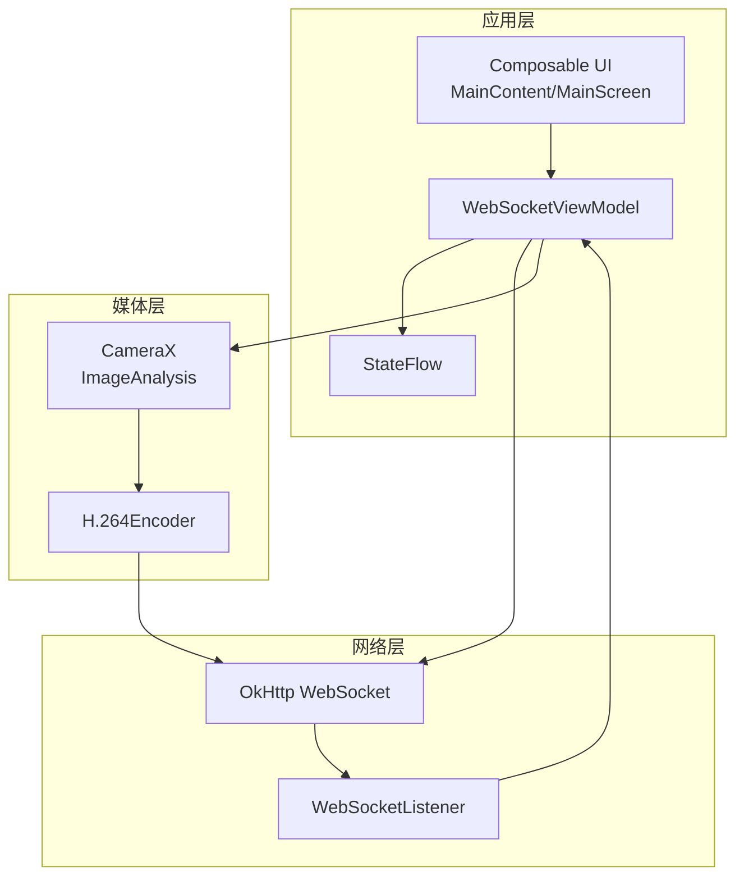
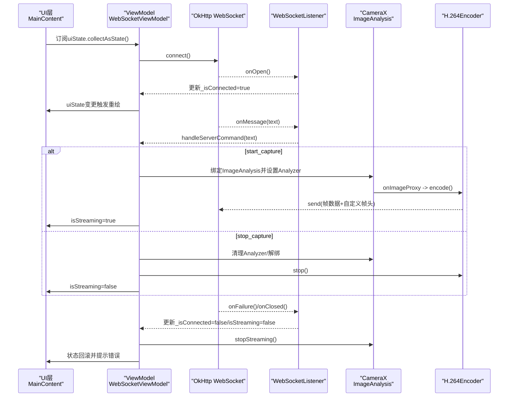
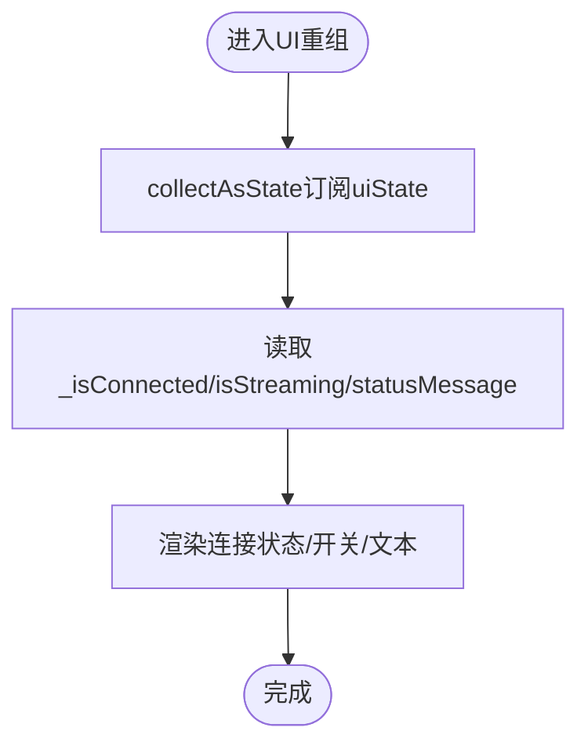
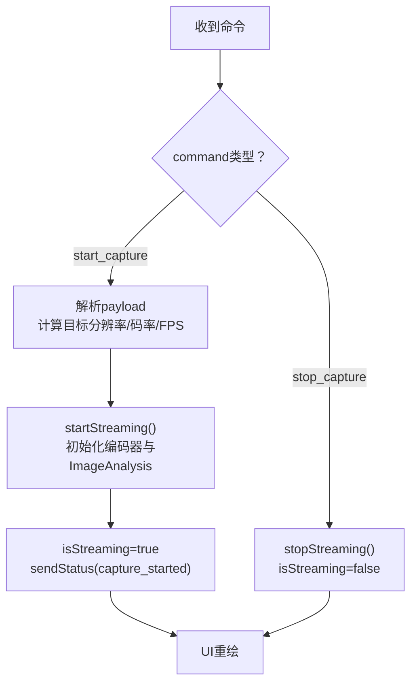
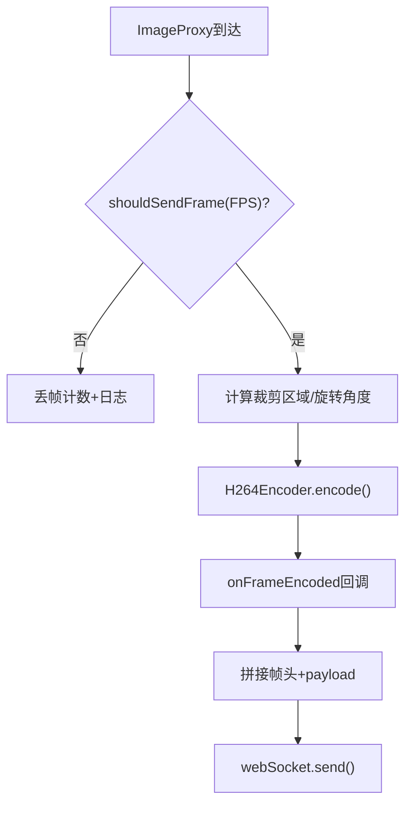
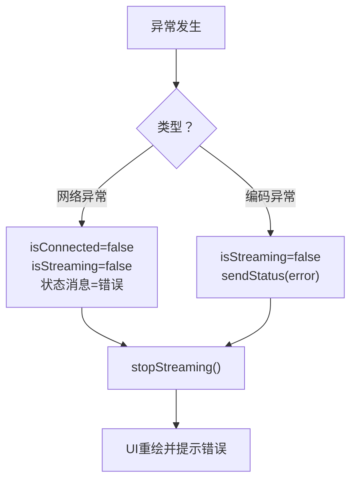
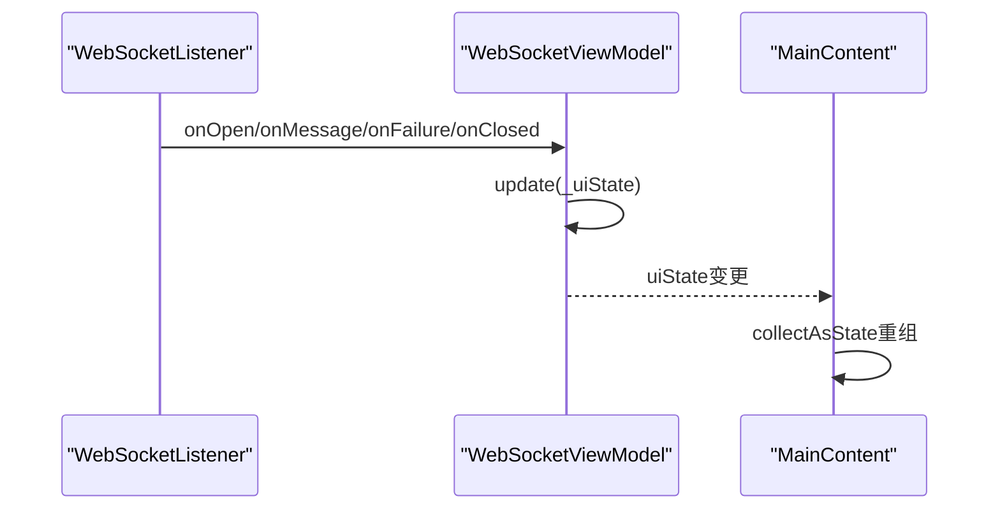
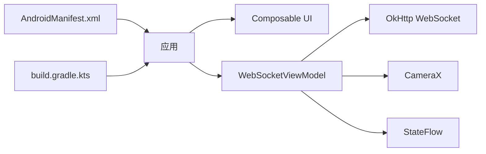

# 消息分发机制

<cite>
**本文引用的文件**
- [MainActivity.kt](file://android-camera/app/src/main/java/com/example/lablogcamera/MainActivity.kt)
- [AndroidManifest.xml](file://android-camera/app/src/main/AndroidManifest.xml)
- [build.gradle.kts](file://android-camera/app/build.gradle.kts)
- [Theme.kt](file://android-camera/app/src/main/java/com/example/lablogcamera/ui/theme/Theme.kt)
</cite>

## 目录
1. [引言](#引言)
2. [项目结构](#项目结构)
3. [核心组件](#核心组件)
4. [架构总览](#架构总览)
5. [详细组件分析](#详细组件分析)
6. [依赖分析](#依赖分析)
7. [性能考量](#性能考量)
8. [故障排查指南](#故障排查指南)
9. [结论](#结论)
10. [附录](#附录)

## 引言
本文件围绕Android客户端内部的消息分发机制展开，重点说明WebSocketViewModel如何以StateFlow为状态容器统一管理连接状态（isConnected）、采集状态（isStreaming）与错误信息，并通过UI层收集StateFlow实现响应式更新。文档还解释了当服务器下发命令或编码器事件发生时，ViewModel如何通过update操作安全地修改_uiState并触发UI重绘；在异常情况下（如网络中断、编码失败）的状态回滚与错误传播设计模式；以及从底层WebSocketListener到上层Composable UI的完整事件链路。最后，为初学者提供简单状态监听示例，为高级开发者提供背压处理、状态持久化与调试追踪的最佳实践建议。

## 项目结构
该项目是一个基于Jetpack Compose与CameraX的Android应用，核心逻辑集中在MainActivity.kt中，包含：
- WebSocketViewModel：负责WebSocket生命周期、命令解析、采集控制、编码器与CameraX集成、状态流管理
- WebSocketUiState：StateFlow承载的UI状态模型
- Composable UI：通过collectAsState订阅ViewModel状态，驱动界面响应式更新
- OkHttp WebSocket：与后端建立长连接并接收/发送消息

图表来源
- [MainActivity.kt](file://android-camera/app/src/main/java/com/example/lablogcamera/MainActivity.kt#L553-L1200)
- [MainActivity.kt](file://android-camera/app/src/main/java/com/example/lablogcamera/MainActivity.kt#L1670-L1708)
- [MainActivity.kt](file://android-camera/app/src/main/java/com/example/lablogcamera/MainActivity.kt#L1727-L2108)

章节来源
- [MainActivity.kt](file://android-camera/app/src/main/java/com/example/lablogcamera/MainActivity.kt#L553-L1200)
- [MainActivity.kt](file://android-camera/app/src/main/java/com/example/lablogcamera/MainActivity.kt#L1670-L1708)
- [MainActivity.kt](file://android-camera/app/src/main/java/com/example/lablogcamera/MainActivity.kt#L1727-L2108)

## 核心组件
- WebSocketViewModel
  - 以MutableStateFlow构建_uiState，对外暴露只读StateFlow，确保状态不可变性与线程安全
  - 通过WebSocketListener回调在onOpen/onFailure/onClosed中更新_isConnected/isStreaming/statusMessage
  - 通过handleServerCommand解析服务器命令，触发startStreaming/stopStreaming
  - 通过sendStatus/sendCapabilities向上游汇报状态与设备能力
- WebSocketUiState
  - 包含url、isConnected、isStreaming、statusMessage四个关键字段，作为UI层唯一真相来源
- Composable UI
  - 使用collectAsState订阅uiState，实现响应式渲染
  - 通过LaunchedEffect与DisposableEffect管理生命周期与资源释放

章节来源
- [MainActivity.kt](file://android-camera/app/src/main/java/com/example/lablogcamera/MainActivity.kt#L553-L759)
- [MainActivity.kt](file://android-camera/app/src/main/java/com/example/lablogcamera/MainActivity.kt#L1670-L1676)
- [MainActivity.kt](file://android-camera/app/src/main/java/com/example/lablogcamera/MainActivity.kt#L1727-L1740)

## 架构总览
下图展示了从WebSocketListener到UI的完整事件链路，包括命令下发、采集控制、编码与发送、状态回滚与错误传播。

图表来源
- [MainActivity.kt](file://android-camera/app/src/main/java/com/example/lablogcamera/MainActivity.kt#L867-L900)
- [MainActivity.kt](file://android-camera/app/src/main/java/com/example/lablogcamera/MainActivity.kt#L902-L942)
- [MainActivity.kt](file://android-camera/app/src/main/java/com/example/lablogcamera/MainActivity.kt#L944-L1200)
- [MainActivity.kt](file://android-camera/app/src/main/java/com/example/lablogcamera/MainActivity.kt#L1200-L1226)
- [MainActivity.kt](file://android-camera/app/src/main/java/com/example/lablogcamera/MainActivity.kt#L1727-L1740)

## 详细组件分析

### StateFlow状态容器与UI订阅
- 状态容器
  - _uiState为MutableStateFlow，对外暴露asStateFlow，确保外部只能读取，不能直接写入
  - uiState作为只读StateFlow，供UI层collectAsState订阅
- UI订阅
  - MainContent通过collectAsState读取uiState，自动在状态变更时触发重组
  - UI根据isConnected/isStreaming/statusMessage渲染连接指示、开关按钮与状态文本
- 更新策略
  - 所有状态更新通过update操作进行，保证原子性与线程安全
  - update采用函数式更新，避免竞态条件与中间态泄漏

图表来源
- [MainActivity.kt](file://android-camera/app/src/main/java/com/example/lablogcamera/MainActivity.kt#L1727-L1740)
- [MainActivity.kt](file://android-camera/app/src/main/java/com/example/lablogcamera/MainActivity.kt#L1670-L1676)

章节来源
- [MainActivity.kt](file://android-camera/app/src/main/java/com/example/lablogcamera/MainActivity.kt#L553-L759)
- [MainActivity.kt](file://android-camera/app/src/main/java/com/example/lablogcamera/MainActivity.kt#L1670-L1676)
- [MainActivity.kt](file://android-camera/app/src/main/java/com/example/lablogcamera/MainActivity.kt#L1727-L1740)

### WebSocket命令解析与采集控制
- 命令解析
  - onMessage接收到文本后，交由handleServerCommand解析JSON
  - 支持start_capture与stop_capture两类命令
  - start_capture支持payload中的format/aspectRatio/bitrate/fps字段
- 采集控制
  - startStreaming：初始化编码器、ImageAnalysis、设置BackpressureStrategy为KEEP_ONLY_LATEST
  - stopStreaming：清理Analyzer、停止编码器、清空裁剪区域与统计计数
- 状态回滚
  - 失败路径中将isStreaming置false，状态消息包含错误信息，确保UI回到稳定态

图表来源
- [MainActivity.kt](file://android-camera/app/src/main/java/com/example/lablogcamera/MainActivity.kt#L902-L942)
- [MainActivity.kt](file://android-camera/app/src/main/java/com/example/lablogcamera/MainActivity.kt#L944-L1200)
- [MainActivity.kt](file://android-camera/app/src/main/java/com/example/lablogcamera/MainActivity.kt#L1200-L1226)

章节来源
- [MainActivity.kt](file://android-camera/app/src/main/java/com/example/lablogcamera/MainActivity.kt#L902-L942)
- [MainActivity.kt](file://android-camera/app/src/main/java/com/example/lablogcamera/MainActivity.kt#L944-L1200)
- [MainActivity.kt](file://android-camera/app/src/main/java/com/example/lablogcamera/MainActivity.kt#L1200-L1226)

### 编码器事件与帧发送
- 编码器事件
  - H264Encoder.onFrameEncoded回调中，将编码后的帧数据与自定义帧头组合后通过WebSocket发送
  - 帧头包含设备时间戳、帧序号与payload长度，便于后端重建时间轴与校验
- 背压策略
  - ImageAnalysis采用KEEP_ONLY_LATEST策略，避免积压
  - 通过shouldSendFrame按目标FPS主动丢帧，实现背压控制
- 异常处理
  - 编码过程中捕获异常并记录日志，避免Analyzer中断
  - stopStreaming中确保资源回收与状态复位

图表来源
- [MainActivity.kt](file://android-camera/app/src/main/java/com/example/lablogcamera/MainActivity.kt#L1144-L1194)
- [MainActivity.kt](file://android-camera/app/src/main/java/com/example/lablogcamera/MainActivity.kt#L1329-L1341)
- [MainActivity.kt](file://android-camera/app/src/main/java/com/example/lablogcamera/MainActivity.kt#L1144-L1194)

章节来源
- [MainActivity.kt](file://android-camera/app/src/main/java/com/example/lablogcamera/MainActivity.kt#L1144-L1194)
- [MainActivity.kt](file://android-camera/app/src/main/java/com/example/lablogcamera/MainActivity.kt#L1329-L1341)

### 异常情况下的状态回滚与错误传播
- 网络中断
  - WebSocketListener.onFailure/onClosed中将isConnected与isStreaming置false，状态消息包含错误详情
  - stopStreaming确保资源回收，ViewModel置空引用，UI回到断开状态
- 编码失败
  - startStreaming中捕获异常，回滚isStreaming为false并发送error状态
  - 编码器内部异常被捕获并记录，避免Analyzer中断
- 错误传播
  - sendStatus将错误信息上送至服务器，便于后端诊断
  - UI通过collectAsState即时感知错误并提示用户

图表来源
- [MainActivity.kt](file://android-camera/app/src/main/java/com/example/lablogcamera/MainActivity.kt#L888-L898)
- [MainActivity.kt](file://android-camera/app/src/main/java/com/example/lablogcamera/MainActivity.kt#L1195-L1200)
- [MainActivity.kt](file://android-camera/app/src/main/java/com/example/lablogcamera/MainActivity.kt#L1200-L1226)

章节来源
- [MainActivity.kt](file://android-camera/app/src/main/java/com/example/lablogcamera/MainActivity.kt#L888-L898)
- [MainActivity.kt](file://android-camera/app/src/main/java/com/example/lablogcamera/MainActivity.kt#L1195-L1200)
- [MainActivity.kt](file://android-camera/app/src/main/java/com/example/lablogcamera/MainActivity.kt#L1200-L1226)

### 从WebSocketListener到Composable UI的完整事件链路
- 链路要点
  - WebSocketListener回调在主线程触发，ViewModel通过update安全更新_state
  - UI层通过collectAsState订阅StateFlow，自动触发重组
  - 命令解析、采集控制、编码发送均在viewModelScope中执行，避免阻塞UI线程
- 关键路径
  - onOpen -> 更新_isConnected -> UI重绘
  - onMessage -> handleServerCommand -> startStreaming/stopStreaming -> UI重绘
  - onFailure/onClosed -> 状态回滚 -> UI重绘

图表来源
- [MainActivity.kt](file://android-camera/app/src/main/java/com/example/lablogcamera/MainActivity.kt#L867-L900)
- [MainActivity.kt](file://android-camera/app/src/main/java/com/example/lablogcamera/MainActivity.kt#L902-L942)
- [MainActivity.kt](file://android-camera/app/src/main/java/com/example/lablogcamera/MainActivity.kt#L1727-L1740)

章节来源
- [MainActivity.kt](file://android-camera/app/src/main/java/com/example/lablogcamera/MainActivity.kt#L867-L900)
- [MainActivity.kt](file://android-camera/app/src/main/java/com/example/lablogcamera/MainActivity.kt#L902-L942)
- [MainActivity.kt](file://android-camera/app/src/main/java/com/example/lablogcamera/MainActivity.kt#L1727-L1740)

## 依赖分析
- AndroidManifest
  - 声明相机权限与网络权限，确保CameraX与OkHttp可用
- Gradle依赖
  - Jetpack Compose、CameraX、OkHttp、Accompanist权限等
- 模块耦合
  - UI层仅依赖ViewModel的只读StateFlow，降低耦合
  - ViewModel内部封装网络、媒体与状态逻辑，职责清晰

图表来源
- [AndroidManifest.xml](file://android-camera/app/src/main/AndroidManifest.xml#L1-L32)
- [build.gradle.kts](file://android-camera/app/build.gradle.kts#L44-L68)
- [MainActivity.kt](file://android-camera/app/src/main/java/com/example/lablogcamera/MainActivity.kt#L553-L759)

章节来源
- [AndroidManifest.xml](file://android-camera/app/src/main/AndroidManifest.xml#L1-L32)
- [build.gradle.kts](file://android-camera/app/build.gradle.kts#L44-L68)
- [MainActivity.kt](file://android-camera/app/src/main/java/com/example/lablogcamera/MainActivity.kt#L553-L759)

## 性能考量
- 背压处理
  - ImageAnalysis采用KEEP_ONLY_LATEST，避免积压
  - shouldSendFrame按目标FPS主动丢帧，平滑控制发送速率
- 编码与传输
  - 帧头包含时间戳与序号，便于后端重建时间轴
  - 编码器异常捕获与资源回收，避免ANR
- UI响应
  - StateFlow+collectAsState实现细粒度响应式更新，避免全量重绘

[本节为通用性能讨论，不直接分析具体文件]

## 故障排查指南
- 网络连接失败
  - 检查onFailure回调中的错误消息，确认_isConnected=false/isStreaming=false
  - 确认URL正确且网络可达
- 采集无法开始
  - 检查startStreaming异常分支，确认分辨率/FPS/码率参数合理
  - 确认相机权限已授予
- 帧丢失严重
  - 检查shouldSendFrame策略与目标FPS设置
  - 确认ImageAnalysis的BackpressureStrategy为KEEP_ONLY_LATEST
- UI不更新
  - 确认UI层使用collectAsState订阅uiState
  - 检查update调用是否在viewModelScope中执行

章节来源
- [MainActivity.kt](file://android-camera/app/src/main/java/com/example/lablogcamera/MainActivity.kt#L888-L898)
- [MainActivity.kt](file://android-camera/app/src/main/java/com/example/lablogcamera/MainActivity.kt#L1195-L1200)
- [MainActivity.kt](file://android-camera/app/src/main/java/com/example/lablogcamera/MainActivity.kt#L1329-L1341)
- [MainActivity.kt](file://android-camera/app/src/main/java/com/example/lablogcamera/MainActivity.kt#L1727-L1740)

## 结论
本项目通过StateFlow将连接状态、采集状态与错误信息统一纳入ViewModel，配合UI层的collectAsState实现响应式更新。WebSocketListener回调与命令解析在ViewModel中被安全地转化为状态变更，编码器事件通过update触发帧发送与UI重绘。异常情况下，状态回滚与错误传播确保系统回到稳定态。背压策略与资源回收进一步提升了稳定性与性能。对于初学者，关注uiState订阅与update使用；对于高级开发者，建议结合状态持久化与调试追踪完善可观测性。

[本节为总结性内容，不直接分析具体文件]

## 附录

### 初学者状态监听示例
- 在Composable中订阅uiState
  - 使用collectAsState读取isConnected/isStreaming/statusMessage
  - 根据状态渲染连接指示与开关按钮
- 在ViewModel中更新状态
  - 使用update安全地修改_uiState
  - 在WebSocket回调中更新_isConnected/isStreaming

章节来源
- [MainActivity.kt](file://android-camera/app/src/main/java/com/example/lablogcamera/MainActivity.kt#L1727-L1740)
- [MainActivity.kt](file://android-camera/app/src/main/java/com/example/lablogcamera/MainActivity.kt#L867-L900)
- [MainActivity.kt](file://android-camera/app/src/main/java/com/example/lablogcamera/MainActivity.kt#L553-L759)

### 高级实践：背压处理、状态持久化与调试追踪
- 背压处理
  - ImageAnalysis采用KEEP_ONLY_LATEST
  - shouldSendFrame按目标FPS丢帧
- 状态持久化
  - 将uiState的关键字段持久化到SharedPreferences或Room，应用重启后恢复
- 调试追踪
  - 在关键路径添加日志（连接、命令、编码、发送、错误）
  - 使用ViewModel的viewModelScope统一调度，便于追踪协程生命周期

[本节为通用最佳实践建议，不直接分析具体文件]