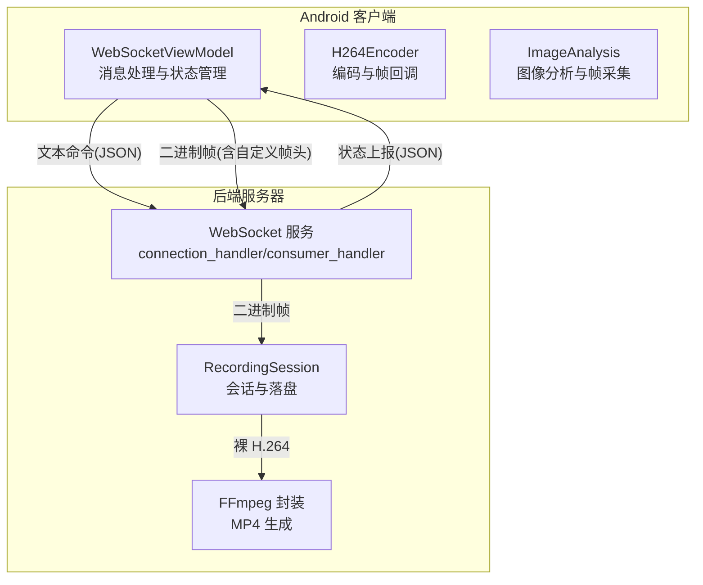
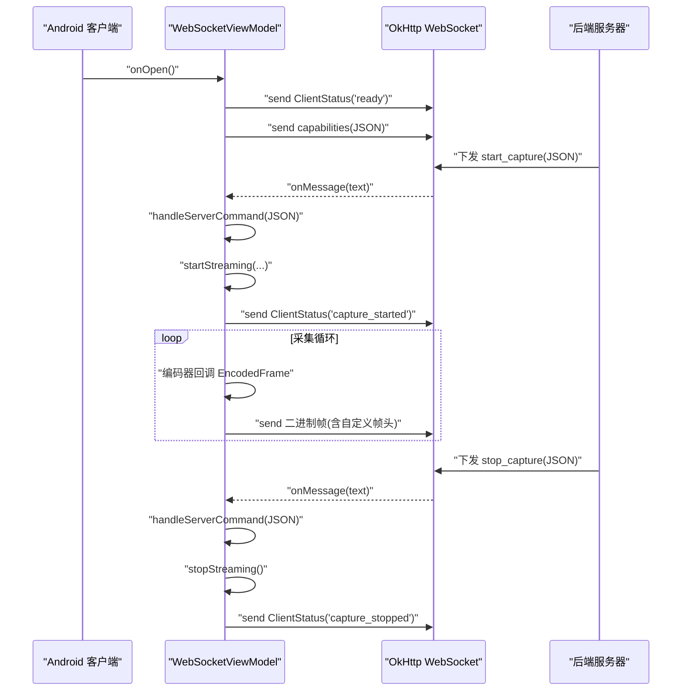
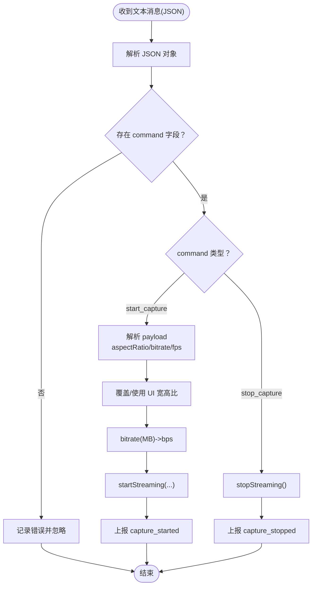
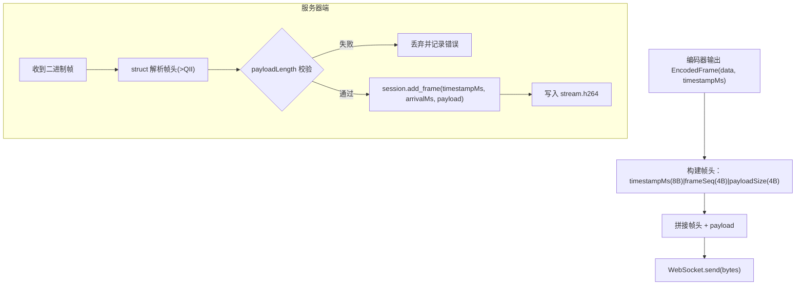
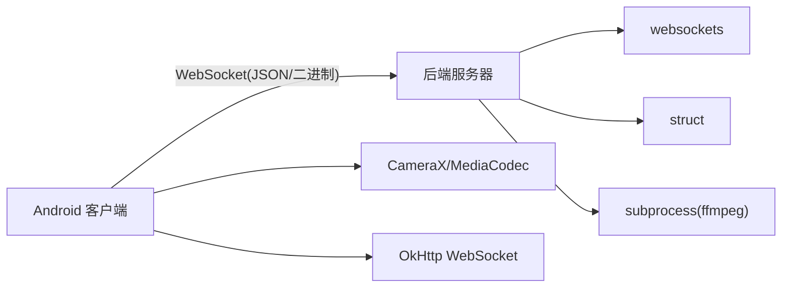

# 消息处理机制

<cite>
**本文引用的文件**
- [MainActivity.kt](file://android-camera/app/src/main/java/com/example/lablogcamera/MainActivity.kt)
- [server.py](file://backend/server.py)
- [README.md（后端）](file://backend/README.md)
</cite>

## 目录
1. [简介](#简介)
2. [项目结构](#项目结构)
3. [核心组件](#核心组件)
4. [架构总览](#架构总览)
5. [详细组件分析](#详细组件分析)
6. [依赖关系分析](#依赖关系分析)
7. [性能考量](#性能考量)
8. [故障排查指南](#故障排查指南)
9. [结论](#结论)
10. [附录](#附录)

## 简介
本文件围绕 Android 客户端通过 WebSocket 与后端服务器进行消息交互的完整链路展开，重点覆盖以下主题：
- WebSocketListener 的 onMessage 回调中对文本消息与二进制消息的区分处理逻辑
- ServerCommand 数据类的 JSON 反序列化过程，包括命令类型解析与负载参数提取
- ClientStatus 状态消息的生成与发送时机（连接就绪、采集开始/结束等关键节点）
- 二进制 H.264 视频帧数据的封装格式（帧头结构与有效载荷打包规则）
- 消息分发机制如何通过 StateFlow 通知 UI 层更新状态
- 消息解析的错误处理方案（无效 JSON、未知命令类型、二进制数据损坏）
- 面向初学者的消息收发示例与面向高级用户的队列与流量控制优化建议

## 项目结构
本仓库包含 Android 客户端与后端服务器两部分，二者通过 WebSocket 协议进行消息交互：
- Android 客户端：负责摄像头采集、H.264 编码、帧头封装、命令下发与状态上报
- 后端服务器：负责接收二进制帧、解析帧头、维护录制会话、封装 MP4 并统计 FPS

图表来源
- [MainActivity.kt](file://android-camera/app/src/main/java/com/example/lablogcamera/MainActivity.kt#L867-L900)
- [server.py](file://backend/server.py#L282-L323)
- [server.py](file://backend/server.py#L233-L280)
- [server.py](file://backend/server.py#L1-L79)

章节来源
- [MainActivity.kt](file://android-camera/app/src/main/java/com/example/lablogcamera/MainActivity.kt#L867-L900)
- [server.py](file://backend/server.py#L282-L323)

## 核心组件
- ServerCommand 与 CommandPayload：用于承载服务器下发的控制命令及负载参数
- ClientStatus：用于向服务器上报客户端状态（连接就绪、采集开始/结束等）
- EncodedFrame：封装编码后的 H.264 帧与设备侧时间戳
- WebSocketViewModel：负责 WebSocket 生命周期、命令解析、状态上报、编码器与采集控制
- 后端 RecordingSession：维护录制会话、落盘裸 H.264、统计时间戳与 FPS、最终封装 MP4

章节来源
- [MainActivity.kt](file://android-camera/app/src/main/java/com/example/lablogcamera/MainActivity.kt#L125-L178)
- [MainActivity.kt](file://android-camera/app/src/main/java/com/example/lablogcamera/MainActivity.kt#L554-L758)
- [server.py](file://backend/server.py#L26-L79)

## 架构总览
Android 客户端与后端服务器之间的消息流向如下：
- 连接建立后，客户端立即上报 ClientStatus("ready")，随后上报设备能力（capabilities）
- 服务器通过终端输入下发 start/stop 命令（JSON），客户端解析 ServerCommand 并开始/停止采集
- 采集过程中，客户端以二进制帧形式发送 H.264 数据，帧头包含设备时间戳、帧序号与负载长度
- 服务器解析帧头并写入裸 H.264 文件，结束时通过 FFmpeg 封装为 MP4

图表来源
- [MainActivity.kt](file://android-camera/app/src/main/java/com/example/lablogcamera/MainActivity.kt#L867-L900)
- [MainActivity.kt](file://android-camera/app/src/main/java/com/example/lablogcamera/MainActivity.kt#L902-L942)
- [MainActivity.kt](file://android-camera/app/src/main/java/com/example/lablogcamera/MainActivity.kt#L944-L1199)
- [server.py](file://backend/server.py#L233-L280)
- [server.py](file://backend/server.py#L305-L323)

## 详细组件分析

### WebSocketListener onMessage 回调与消息区分
- onOpen：连接建立后立即上报 ClientStatus("ready")，并上报设备能力（capabilities）
- onMessage：
  - 文本消息：作为服务器下发的命令（JSON），交由 handleServerCommand 解析
  - 二进制消息：作为 H.264 帧，客户端在 startStreaming 中封装并发送
- onClosing/onClosed：清理资源，停止采集，置空 WebSocket 引用
- onFailure：更新 UI 状态为错误，停止采集并置空 WebSocket 引用

章节来源
- [MainActivity.kt](file://android-camera/app/src/main/java/com/example/lablogcamera/MainActivity.kt#L867-L900)

### ServerCommand JSON 反序列化与命令分发
- JSON 字段：
  - command：命令类型，如 "start_capture"、"stop_capture"
  - payload：可选负载，包含 format、aspectRatio、bitrate、fps 等
- 解析逻辑：
  - 识别 command 类型
  - 对 "start_capture"：解析 payload，覆盖/使用 UI 选择的宽高比，转换码率为 bps，解析 fps（<=0 视为不限帧率）
  - 对 "stop_capture"：停止采集
  - 异常处理：解析失败时上报 ClientStatus("error")，避免 UI 卡死

图表来源
- [MainActivity.kt](file://android-camera/app/src/main/java/com/example/lablogcamera/MainActivity.kt#L902-L942)
- [MainActivity.kt](file://android-camera/app/src/main/java/com/example/lablogcamera/MainActivity.kt#L944-L1199)

章节来源
- [MainActivity.kt](file://android-camera/app/src/main/java/com/example/lablogcamera/MainActivity.kt#L902-L942)

### ClientStatus 状态消息生成与发送时机
- 连接就绪：onOpen 后立即发送 ClientStatus("ready")
- 能力上报：onOpen 后发送 capabilities（JSON）
- 采集开始：startStreaming 成功后发送 ClientStatus("capture_started")
- 采集结束：stopStreaming 前后发送 ClientStatus("capture_stopped")

章节来源
- [MainActivity.kt](file://android-camera/app/src/main/java/com/example/lablogcamera/MainActivity.kt#L867-L900)
- [MainActivity.kt](file://android-camera/app/src/main/java/com/example/lablogcamera/MainActivity.kt#L1228-L1242)
- [MainActivity.kt](file://android-camera/app/src/main/java/com/example/lablogcamera/MainActivity.kt#L1244-L1316)
- [server.py](file://backend/server.py#L233-L280)

### 二进制 H.264 帧封装格式与打包规则
- 帧头（16 字节，大端）：
  - 8 字节：设备时间戳（毫秒）
  - 4 字节：帧序号（低 32 位递增）
  - 4 字节：后续 H.264 负载长度（字节数）
- 负载：H.264 裸码流
- 客户端打包：
  - 编码器回调 EncodedFrame 后，分配 16 字节头部 + payload，拼接为二进制帧
  - 通过 WebSocket 发送
- 服务器解析：
  - 使用 struct 以大端解析帧头，校验负载长度
  - 记录首尾设备时间戳与服务器到达时间，用于估算 FPS
  - 将 payload 追加写入裸 H.264 文件

图表来源
- [MainActivity.kt](file://android-camera/app/src/main/java/com/example/lablogcamera/MainActivity.kt#L968-L984)
- [server.py](file://backend/server.py#L1-L24)
- [server.py](file://backend/server.py#L135-L147)
- [server.py](file://backend/server.py#L233-L280)

章节来源
- [MainActivity.kt](file://android-camera/app/src/main/java/com/example/lablogcamera/MainActivity.kt#L968-L984)
- [server.py](file://backend/server.py#L135-L147)

### StateFlow 通知 UI 更新状态
- WebSocketViewModel 内部持有 MutableStateFlow<WebSocketUiState>，对外暴露 StateFlow
- onOpen/onFailure/onClosed：更新 isConnected/isStreaming/statusMessage
- startStreaming/stopStreaming：更新 isStreaming 与状态文本
- UI 通过 collectAsState 订阅，实时刷新连接状态、采集状态与按钮可用性

章节来源
- [MainActivity.kt](file://android-camera/app/src/main/java/com/example/lablogcamera/MainActivity.kt#L554-L758)
- [MainActivity.kt](file://android-camera/app/src/main/java/com/example/lablogcamera/MainActivity.kt#L1670-L1676)
- [MainActivity.kt](file://android-camera/app/src/main/java/com/example/lablogcamera/MainActivity.kt#L1720-L1740)

### 消息分发与 UI 交互
- 文本命令（start/stop）：服务器终端输入，经 broadcast 广播至所有客户端
- 状态上报（capture_started/capture_stopped/ready）：客户端主动上报，服务器记录会话起止
- UI 交互：MainContent 通过 ViewModel 的 StateFlow 控制按钮、开关与状态文本

章节来源
- [server.py](file://backend/server.py#L305-L323)
- [server.py](file://backend/server.py#L233-L280)
- [MainActivity.kt](file://android-camera/app/src/main/java/com/example/lablogcamera/MainActivity.kt#L1720-L1740)

## 依赖关系分析
- Android 客户端依赖：
  - OkHttp WebSocket：建立与维护 WebSocket 连接
  - CameraX：图像分析与帧采集
  - MediaCodec：H.264 编码
  - Kotlin Coroutines：协程与 StateFlow
- 后端服务器依赖：
  - websockets：WebSocket 服务端
  - struct：二进制帧头解析
  - subprocess：调用 FFmpeg 封装 MP4

图表来源
- [MainActivity.kt](file://android-camera/app/src/main/java/com/example/lablogcamera/MainActivity.kt#L554-L758)
- [server.py](file://backend/server.py#L1-L24)
- [server.py](file://backend/server.py#L150-L179)

章节来源
- [MainActivity.kt](file://android-camera/app/src/main/java/com/example/lablogcamera/MainActivity.kt#L554-L758)
- [server.py](file://backend/server.py#L1-L24)

## 性能考量
- 帧率控制：客户端根据目标 fps 计算最小发送间隔，未达阈值丢帧，避免网络拥塞
- 分辨率与对齐：采集前查询硬件支持的最大分辨率，按目标宽高比裁剪并对齐到 32/偶数，降低编码器与硬件平面错位风险
- 时间戳与 FPS 估算：服务器记录设备时间戳与到达时间，结束时估算 FPS 并用于 FFmpeg 封装，避免时间轴错误
- 无重编码：服务器直接拷贝视频轨，提升封装效率

章节来源
- [MainActivity.kt](file://android-camera/app/src/main/java/com/example/lablogcamera/MainActivity.kt#L1329-L1341)
- [MainActivity.kt](file://android-camera/app/src/main/java/com/example/lablogcamera/MainActivity.kt#L1413-L1448)
- [server.py](file://backend/server.py#L80-L133)
- [server.py](file://backend/server.py#L150-L179)

## 故障排查指南
- 无效 JSON 命令
  - 现象：客户端解析失败，上报 ClientStatus("error")
  - 处理：检查服务器下发 JSON 结构与字段命名
- 未知命令类型
  - 现象：客户端忽略未知 command，不触发 start/stop
  - 处理：确认服务器命令与客户端解析分支一致
- 二进制帧损坏
  - 现象：服务器 parse_frame_packet 抛出长度不匹配或包过小
  - 处理：检查客户端帧头构造（大端、长度字段、payloadSize）与发送完整性
- 连接异常
  - 现象：onFailure/onClosed 触发，UI 状态变为断开
  - 处理：检查网络、服务器地址与防火墙；确认客户端清理逻辑（停止采集、清空引用）

章节来源
- [MainActivity.kt](file://android-camera/app/src/main/java/com/example/lablogcamera/MainActivity.kt#L938-L942)
- [server.py](file://backend/server.py#L135-L147)
- [server.py](file://backend/server.py#L260-L274)

## 结论
本项目通过严格的帧头约定与双向 JSON 命令机制，实现了 Android 客户端与后端服务器之间的高效、可控视频流传输。客户端在连接建立后主动上报能力与状态，服务器通过终端下发控制命令并维护录制会话，最终以无重编码的方式封装 MP4。StateFlow 的使用使 UI 能够及时反映连接与采集状态，整体架构清晰、扩展性强。

## 附录

### 初学者消息收发示例
- 连接建立后，客户端立即上报 ready 状态
- 服务器终端输入 start 命令，客户端解析并开始采集，随后上报 capture_started
- 服务器终端输入 stop 命令，客户端停止采集并上报 capture_stopped
- 服务器解析二进制帧，写入裸 H.264，结束时生成 MP4

章节来源
- [MainActivity.kt](file://android-camera/app/src/main/java/com/example/lablogcamera/MainActivity.kt#L867-L900)
- [server.py](file://backend/server.py#L305-L323)
- [README.md（后端）](file://backend/README.md#L160-L214)

### 高级用户：消息队列与流量控制优化
- 帧率控制：客户端基于目标帧率计算最小发送间隔，未达阈值丢帧，避免网络拥塞
- 会话管理：服务器为每个客户端维护独立会话，确保并发安全与统计准确
- 封装策略：服务器直接拷贝视频轨，避免重编码带来的 CPU 与时间成本

章节来源
- [MainActivity.kt](file://android-camera/app/src/main/java/com/example/lablogcamera/MainActivity.kt#L1329-L1341)
- [server.py](file://backend/server.py#L150-L179)