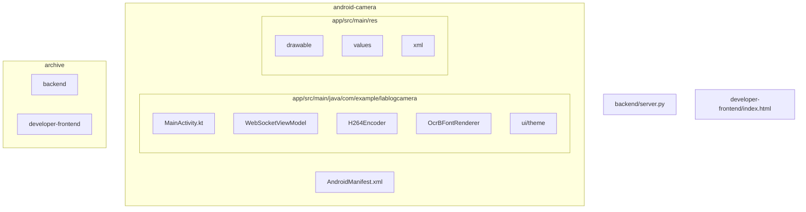
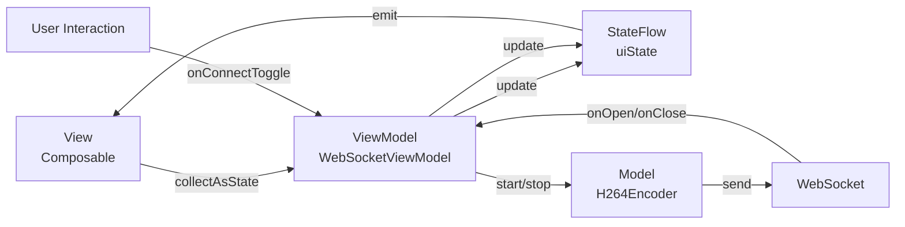
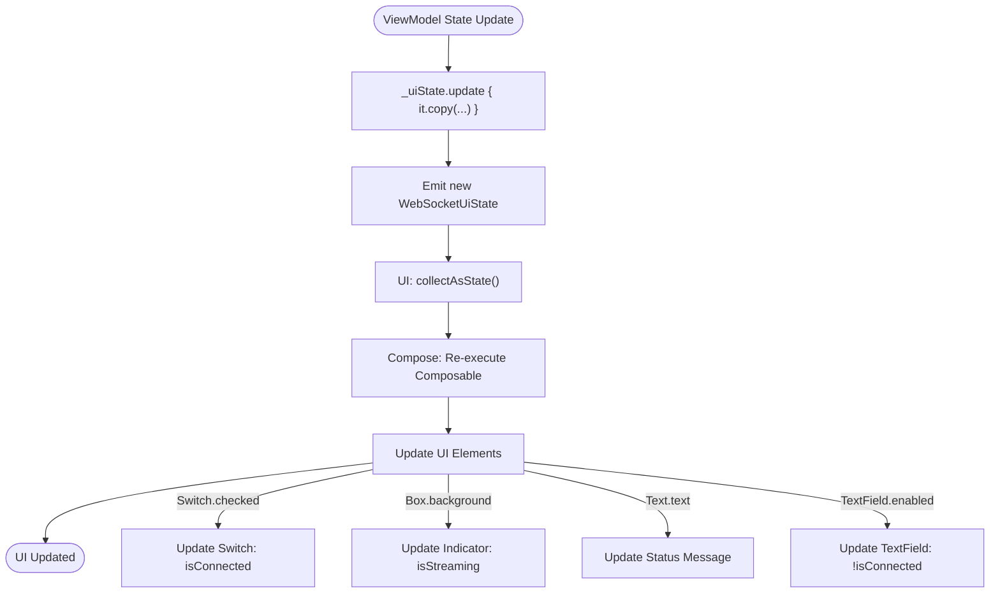
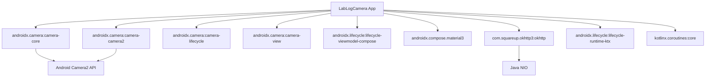

# UI状态同步

<cite>
**本文档引用的文件**   
- [MainActivity.kt](file://android-camera/app/src/main/java/com/example/lablogcamera/MainActivity.kt)
- [Theme.kt](file://android-camera/app/src/main/java/com/example/lablogcamera/ui/theme/Theme.kt)
- [AndroidManifest.xml](file://android-camera/app/src/main/AndroidManifest.xml)
</cite>

## 目录
1. [简介](#简介)
2. [项目结构](#项目结构)
3. [核心组件](#核心组件)
4. [架构概述](#架构概述)
5. [详细组件分析](#详细组件分析)
6. [依赖分析](#依赖分析)
7. [性能考虑](#性能考虑)
8. [故障排除指南](#故障排除指南)
9. [结论](#结论)
10. [附录](#附录)（如有必要）

## 简介
本文档详细阐述了Android客户端中UI层与WebSocket状态同步的实现机制。该应用通过Jetpack Compose构建用户界面，利用ViewModel管理WebSocket连接状态和摄像头数据流。UI通过`collectAsState`订阅ViewModel暴露的`uiState`流，实现自动重组。连接按钮、状态指示灯和录制开关等UI元素根据`isConnected`和`isStreaming`状态动态更新其外观和交互行为。当WebSocket连接建立或断开时，`LaunchedEffect`会监听状态变化并执行副作用操作，如显示Toast提示。整个状态同步过程具有生命周期感知特性，确保在配置变更时状态持久化。文档还提供了避免重复订阅和内存泄漏的最佳实践，包括正确使用`DisposableEffect`。

## 项目结构
该项目是一个典型的Android应用程序，采用Kotlin语言和Jetpack Compose进行UI开发。核心功能位于`android-camera`模块中，其`app/src/main/java/com/example/lablogcamera`目录包含了主要的业务逻辑。`MainActivity.kt`是应用的入口点，定义了`MainScreen`和`MainContent`等可组合函数。`WebSocketViewModel`负责管理WebSocket连接、摄像头分析和H.264编码。UI主题在`ui/theme`包中定义。应用通过`AndroidManifest.xml`声明了相机和互联网权限。项目还包含一些历史存档，用于参考。



**Diagram sources**
- [MainActivity.kt](file://android-camera/app/src/main/java/com/example/lablogcamera/MainActivity.kt)
- [AndroidManifest.xml](file://android-camera/app/src/main/AndroidManifest.xml)

**Section sources**
- [MainActivity.kt](file://android-camera/app/src/main/java/com/example/lablogcamera/MainActivity.kt)
- [AndroidManifest.xml](file://android-camera/app/src/main/AndroidManifest.xml)

## 核心组件
核心组件包括`WebSocketViewModel`、`MainContent`可组合函数和`H264Encoder`。`WebSocketViewModel`继承自`AndroidViewModel`，是状态管理的中心。它暴露一个`uiState`流，该流是一个`StateFlow<WebSocketUiState>`，包含`url`、`isConnected`、`isStreaming`和`statusMessage`等字段。UI通过`collectAsState()`收集此流，触发重组。`MainContent`函数是UI的主要部分，它根据`uiState`动态渲染连接状态、控制按钮和摄像头预览。`H264Encoder`封装了Android的`MediaCodec`，负责将摄像头的YUV数据编码为H.264流，并通过WebSocket发送。

**Section sources**
- [MainActivity.kt](file://android-camera/app/src/main/java/com/example/lablogcamera/MainActivity.kt#L553-L1448)

## 架构概述
该应用采用MVVM（Model-View-ViewModel）架构。`MainActivity`作为View层，负责展示UI。`MainContent`等可组合函数是View的具体实现。`WebSocketViewModel`作为ViewModel层，处理业务逻辑、管理状态并暴露给View。`H264Encoder`和`OcrBFontRenderer`可以视为Model层的一部分，负责数据处理和转换。状态同步通过Kotlin Flow实现，`ViewModel`中的`MutableStateFlow`被转换为`StateFlow`供UI收集。UI的交互（如点击连接按钮）会调用`ViewModel`的方法，这些方法会更新内部状态，从而触发UI重组。整个流程是生命周期感知的，确保了状态的持久化和资源的正确释放。



**Diagram sources**
- [MainActivity.kt](file://android-camera/app/src/main/java/com/example/lablogcamera/MainActivity.kt#L553-L1448)

## 详细组件分析

### WebSocket状态同步机制分析
该机制的核心是`WebSocketViewModel`中的`uiState`和UI中的`collectAsState`。

#### 状态定义与暴露
`WebSocketUiState`是一个数据类，定义了UI所需的所有状态：
```kotlin
data class WebSocketUiState(
    val url: String = "ws://pqzc1405495.bohrium.tech:50001/android-cam",
    val isConnected: Boolean = false,
    val isStreaming: Boolean = false,
    val statusMessage: String = "Disconnected"
)
```
在`WebSocketViewModel`中，一个`MutableStateFlow<WebSocketUiState>`被创建并暴露为只读的`StateFlow`：
```kotlin
private val _uiState = MutableStateFlow(WebSocketUiState())
val uiState: StateFlow<WebSocketUiState> = _uiState.asStateFlow()
```
当需要更新状态时，使用`_uiState.update`方法，它会创建一个新状态的副本并发出。

#### UI状态订阅与重组
在`MainContent`可组合函数中，UI通过`collectAsState()`收集`uiState`流：
```kotlin
val uiState by webSocketViewModel.uiState.collectAsState()
```
这行代码会将`StateFlow`转换为一个`State`对象，其`value`属性会随着流的更新而自动更新。当`uiState`的值发生变化时，Compose的重组机制会自动重新执行`MainContent`函数，从而更新UI。

#### UI元素动态更新
UI元素根据`uiState`的状态动态更新：
- **连接按钮/开关**：`Switch`组件的`checked`属性绑定到`uiState.isConnected`。当连接状态改变时，开关会自动切换。
- **状态指示灯**：一个`Box`组件的背景色根据`uiState.isStreaming`动态变化。当`isStreaming`为`true`时，背景色为绿色；否则为灰色。
- **状态消息**：`Text`组件显示`uiState.statusMessage`，实时反映当前状态（如“Connected, ready for command”或“Disconnected”）。
- **输入框禁用**：`TextField`的`enabled`属性设置为`!uiState.isConnected`，当已连接时，URL输入框被禁用，防止用户修改。



**Diagram sources**
- [MainActivity.kt](file://android-camera/app/src/main/java/com/example/lablogcamera/MainActivity.kt#L1670-L1675)
- [MainActivity.kt](file://android-camera/app/src/main/java/com/example/lablogcamera/MainActivity.kt#L1732)
- [MainActivity.kt](file://android-camera/app/src/main/java/com/example/lablogcamera/MainActivity.kt#L1970-L1983)

**Section sources**
- [MainActivity.kt](file://android-camera/app/src/main/java/com/example/lablogcamera/MainActivity.kt#L1670-L1869)
- [MainActivity.kt](file://android-camera/app/src/main/java/com/example/lablogcamera/MainActivity.kt#L1956-L2000)

### 错误处理与用户提示机制分析
该应用通过`statusMessage`和`LaunchedEffect`实现了错误处理和用户提示。

#### 错误消息显示逻辑
错误消息通过`uiState.statusMessage`统一管理。当发生错误时，`_uiState`会被更新，设置`statusMessage`为错误信息。例如，在WebSocket连接失败时：
```kotlin
override fun onFailure(webSocket: WebSocket, t: Throwable, response: Response?) {
    _uiState.update { it.copy(isConnected = false, isStreaming = false, statusMessage = "Error: ${t.message}") }
    stopStreaming()
}
```
这个错误消息会立即通过`collectAsState`反映到UI上，用户可以在界面上看到具体的错误原因。

#### 副作用操作与LaunchedEffect
`LaunchedEffect`用于监听状态变化并执行副作用操作。例如，在`MainScreen`中，当相机权限状态变化时，会启动一个协程来初始化摄像头分辨率：
```kotlin
LaunchedEffect(cameraPermissionState.status.isGranted) {
    if (cameraPermissionState.status.isGranted) {
        webSocketViewModel.initializeImageAnalysisResolution(context, lifecycleOwner)
    }
}
```
虽然文档中未直接显示Toast，但`LaunchedEffect`是执行此类UI副作用（如显示Toast或Snackbar）的标准方式。它确保协程在Composable进入组合时启动，并在离开组合或依赖项改变时取消，避免了内存泄漏。

#### 生命周期感知与状态持久化
整个状态同步是生命周期感知的。`ViewModel`的生命周期独立于`Activity`或`Fragment`，因此在配置变更（如屏幕旋转）时，`ViewModel`不会被销毁，其内部状态（如`_uiState`）得以保留。当`Activity`重建后，新的`MainContent`会重新收集`uiState`流，立即恢复到之前的状态。此外，`DisposableEffect`用于管理需要在组合离开时清理的资源，例如`OrientationEventListener`和保持屏幕常亮的标志：
```kotlin
DisposableEffect(isStreaming) {
    val activity = context as? Activity
    if (isStreaming) {
        activity?.window?.addFlags(android.view.WindowManager.LayoutParams.FLAG_KEEP_SCREEN_ON)
    } else {
        activity?.window?.clearFlags(android.view.WindowManager.LayoutParams.FLAG_KEEP_SCREEN_ON)
    }
    onDispose {
        activity?.window?.clearFlags(android.view.WindowManager.LayoutParams.FLAG_KEEP_SCREEN_ON)
    }
}
```
`onDispose`块确保了资源的正确释放。

**Section sources**
- [MainActivity.kt](file://android-camera/app/src/main/java/com/example/lablogcamera/MainActivity.kt#L888-L892)
- [MainActivity.kt](file://android-camera/app/src/main/java/com/example/lablogcamera/MainActivity.kt#L1698-L1718)
- [MainActivity.kt](file://android-camera/app/src/main/java/com/example/lablogcamera/MainActivity.kt#L1765-L1776)

## 依赖分析
该应用依赖于多个Android和第三方库。主要依赖在`android-camera/app/build.gradle.kts`中定义，包括`androidx.camera:camera-core`、`androidx.camera:camera-camera2`、`androidx.camera:camera-lifecycle`和`androidx.camera:camera-view`用于摄像头功能，`androidx.lifecycle:lifecycle-viewmodel-compose`用于ViewModel与Compose的集成，`androidx.compose.material3`用于UI组件，以及`com.squareup.okhttp3:okhttp`用于WebSocket通信。这些依赖通过`libs.versions.toml`进行版本管理。应用还依赖于`androidx.lifecycle`和`kotlinx.coroutines`来实现生命周期感知和异步操作。



**Diagram sources**
- [build.gradle.kts](file://android-camera/app/build.gradle.kts)
- [libs.versions.toml](file://android-camera/gradle/libs.versions.toml)

**Section sources**
- [build.gradle.kts](file://android-camera/app/build.gradle.kts)

## 性能考虑
应用在性能方面做了多项优化。H.264编码在`Dispatchers.IO`协程中进行，避免阻塞主线程。`ImageAnalysis`使用`STRATEGY_KEEP_ONLY_LATEST`策略，确保只处理最新的图像帧，防止队列积压。编码器在后台线程预加载OCR-B字体，避免在编码时进行耗时的字体渲染。应用还实现了基于目标FPS的主动丢帧机制，通过`shouldSendFrame`函数控制发送速率，防止过载。摄像头分析使用设备支持的最高分辨率，以获得最大的视场角（FOV），然后通过软件裁剪到目标宽高比，保证了视频质量。

## 故障排除指南
- **无法连接WebSocket**：检查网络权限是否在`AndroidManifest.xml`中声明，确认URL是否正确，检查服务器是否运行。
- **摄像头预览黑屏**：确保已授予相机权限。检查`PreviewView`的`implementationMode`和`scaleType`设置。
- **视频流有绿带或条纹**：这通常与YUV数据的UV平面对齐有关。确保裁剪区域的宽高为偶数，并且在`toNv12ByteArray`函数中正确处理了像素步长（pixel stride）。
- **状态不同步**：确保`ViewModel`是通过`viewModel()`函数获取的，以保证其生命周期正确。检查`collectAsState`是否在正确的组合范围内调用。
- **内存泄漏**：确保所有需要清理的资源（如`OrientationEventListener`）都在`DisposableEffect`的`onDispose`块中正确释放。

**Section sources**
- [MainActivity.kt](file://android-camera/app/src/main/java/com/example/lablogcamera/MainActivity.kt#L1741-L1763)
- [MainActivity.kt](file://android-camera/app/src/main/java/com/example/lablogcamera/MainActivity.kt#L1765-L1776)

## 结论
本文档深入分析了Android客户端中UI层与WebSocket状态同步的实现。通过`ViewModel`暴露`StateFlow`，UI使用`collectAsState`进行订阅，实现了声明式、响应式的UI更新。连接、录制等状态通过`uiState`数据类集中管理，UI元素根据这些状态动态调整其行为和外观。`LaunchedEffect`和`DisposableEffect`确保了副作用操作的正确执行和资源的及时清理。整个机制具有生命周期感知特性，保证了状态的持久化和应用的健壮性。该设计模式清晰、高效，是现代Android开发中推荐的最佳实践。

## 附录
### WebSocketUiState数据结构
| 属性 | 类型 | 描述 | 默认值 |
| :--- | :--- | :--- | :--- |
| `url` | `String` | WebSocket服务器的URL | `ws://pqzc1405495.bohrium.tech:50001/android-cam` |
| `isConnected` | `Boolean` | 是否已连接到WebSocket服务器 | `false` |
| `isStreaming` | `Boolean` | 是否正在流式传输视频 | `false` |
| `statusMessage` | `String` | 当前状态的文本描述 | `Disconnected` |