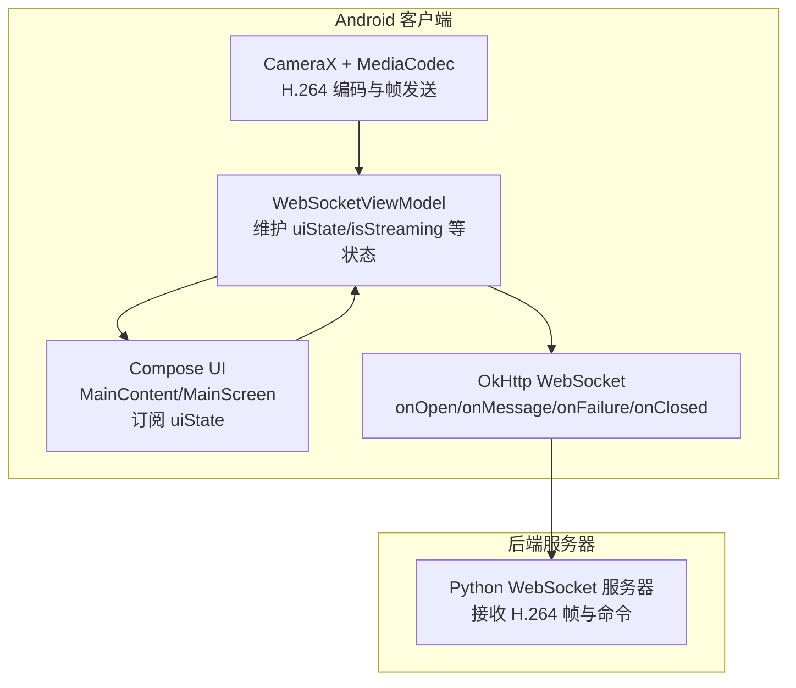
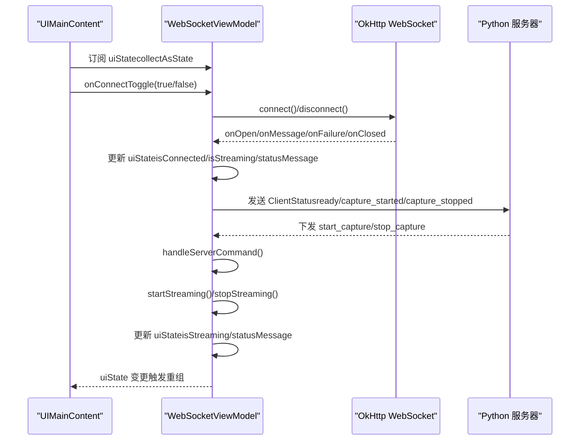
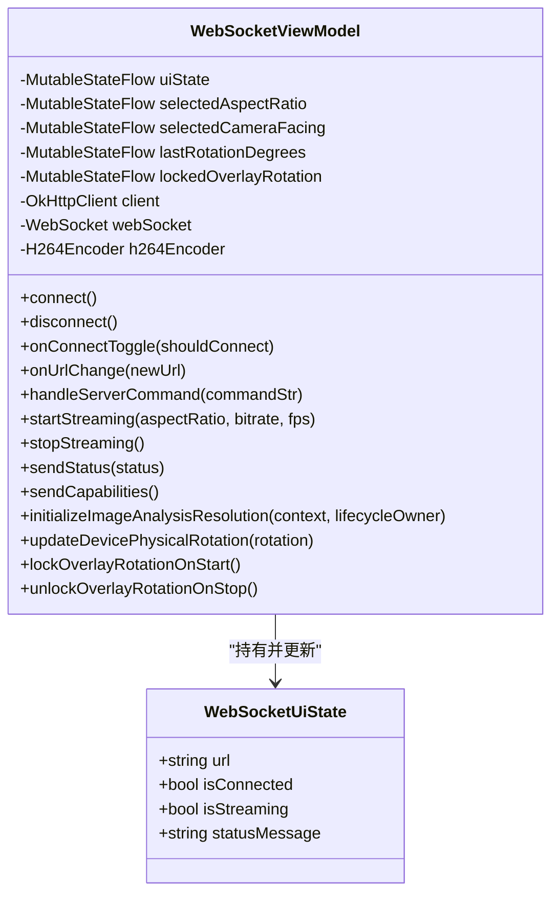
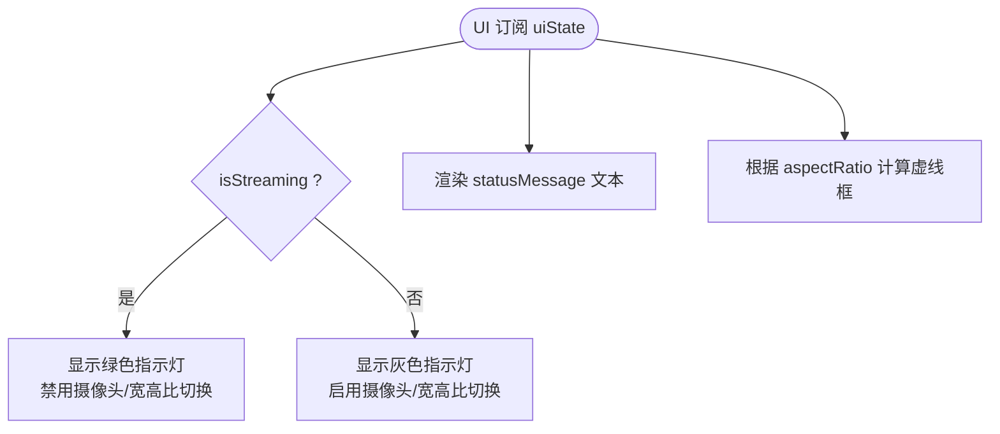
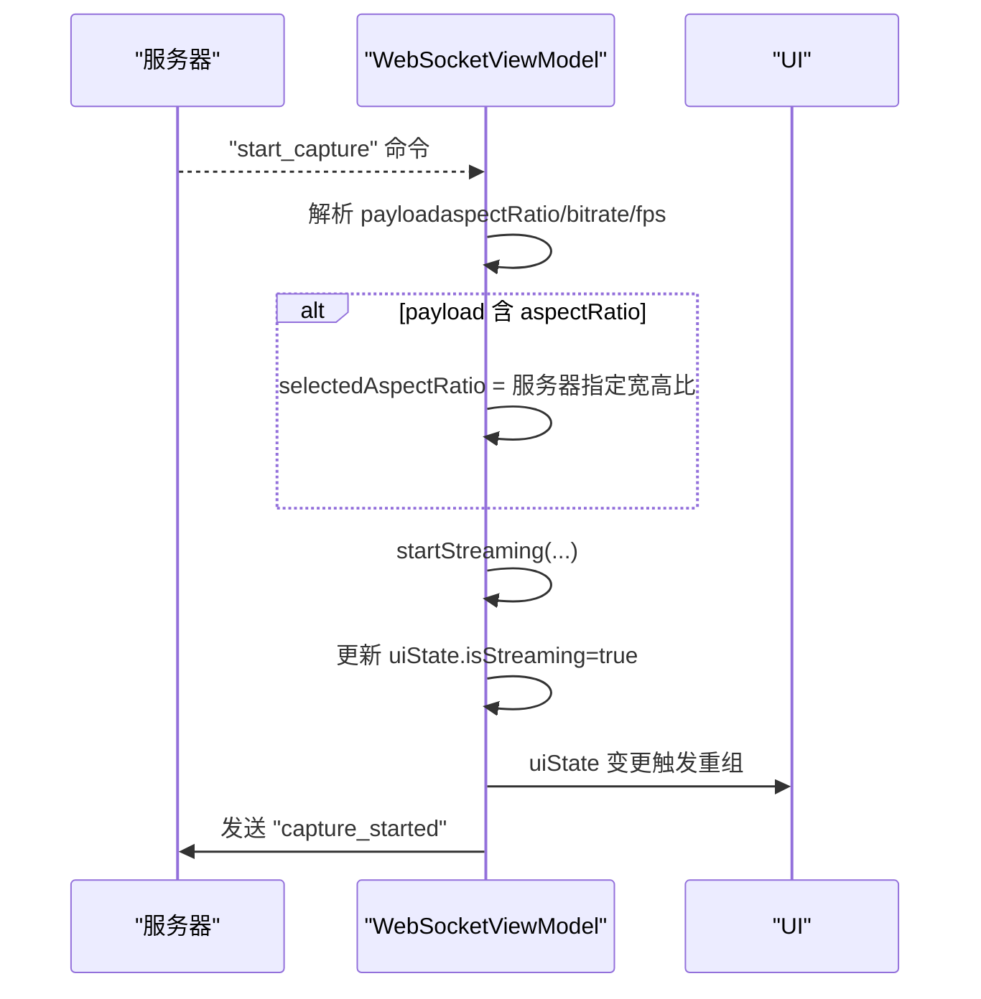
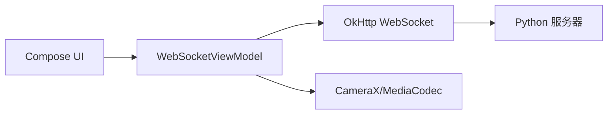

# 状态同步机制

<cite>
**本文引用的文件**
- [android-camera/app/src/main/java/com/example/lablogcamera/MainActivity.kt](file://android-camera/app/src/main/java/com/example/lablogcamera/MainActivity.kt)
- [android-camera/README.md](file://android-camera/README.md)
- [android-camera/app/src/main/AndroidManifest.xml](file://android-camera/app/src/main/AndroidManifest.xml)
</cite>

## 目录
1. [简介](#简介)
2. [项目结构](#项目结构)
3. [核心组件](#核心组件)
4. [架构总览](#架构总览)
5. [详细组件分析](#详细组件分析)
6. [依赖分析](#依赖分析)
7. [性能考量](#性能考量)
8. [故障排查指南](#故障排查指南)
9. [结论](#结论)
10. [附录](#附录)

## 简介
本文件围绕 Android 客户端的 WebSocket 状态同步展开，重点说明 WebSocketViewModel 如何通过 MutableStateFlow 维护连接状态（isConnected）、流状态（isStreaming）与错误信息（statusMessage），以及 UI 层如何通过 collectAsState 订阅状态流并实时更新界面元素（如连接按钮、状态指示灯）。文档还解释了状态变更的触发条件与传播路径（例如收到 'start_capture' 命令后如何同步更新 isStreaming），并讨论了状态持久化与异常清理、线程安全（ViewModelScope 与主线程更新限制）、状态监听最佳实践（避免内存泄漏与重复订阅），以及面向初学者与高级用户的实践建议。

## 项目结构
- Android 客户端位于 android-camera/app，核心业务逻辑集中在 MainActivity.kt 中，包含 WebSocketViewModel、UI 界面与相机/编码管线。
- README.md 提供了整体架构、协议与运行说明，有助于理解状态同步的上下文。
- AndroidManifest.xml 声明了相机与网络权限，以及网络安全配置。

图表来源
- [android-camera/app/src/main/java/com/example/lablogcamera/MainActivity.kt](file://android-camera/app/src/main/java/com/example/lablogcamera/MainActivity.kt#L553-L1328)
- [android-camera/README.md](file://android-camera/README.md#L135-L252)

章节来源
- [android-camera/app/src/main/java/com/example/lablogcamera/MainActivity.kt](file://android-camera/app/src/main/java/com/example/lablogcamera/MainActivity.kt#L553-L1328)
- [android-camera/README.md](file://android-camera/README.md#L1-L120)
- [android-camera/app/src/main/AndroidManifest.xml](file://android-camera/app/src/main/AndroidManifest.xml#L1-L32)

## 核心组件
- WebSocketViewModel：核心状态中枢，使用 MutableStateFlow 维护 uiState（包含 url、isConnected、isStreaming、statusMessage），并通过 OkHttp WebSocket 与后端交互，解析服务器命令并驱动 startStreaming/stopStreaming。
- UI 层（Compose）：通过 collectAsState 订阅 uiState，实时渲染连接开关、状态文本与预览区域的虚线框等。
- 命令解析与状态联动：收到 'start_capture' 时，解析 payload 并调用 startStreaming，进而更新 isStreaming 与 statusMessage；收到 'stop_capture' 时调用 stopStreaming，清理状态并发送 capture_stopped。

章节来源
- [android-camera/app/src/main/java/com/example/lablogcamera/MainActivity.kt](file://android-camera/app/src/main/java/com/example/lablogcamera/MainActivity.kt#L553-L1328)
- [android-camera/app/src/main/java/com/example/lablogcamera/MainActivity.kt](file://android-camera/app/src/main/java/com/example/lablogcamera/MainActivity.kt#L1670-L1675)
- [android-camera/app/src/main/java/com/example/lablogcamera/MainActivity.kt](file://android-camera/app/src/main/java/com/example/lablogcamera/MainActivity.kt#L1733-L1740)

## 架构总览
WebSocket 状态同步的关键路径：
- UI 订阅 uiState（isConnected/isStreaming/statusMessage）。
- WebSocketListener 在 onOpen/onMessage/onFailure/onClosed 中更新 uiState。
- 服务器命令（start_capture/stop_capture）触发 ViewModel 的 startStreaming/stopStreaming，进一步更新 isStreaming 与 statusMessage。
- 帧发送与状态上报（capture_started/capture_stopped/ready）贯穿生命周期。

图表来源
- [android-camera/app/src/main/java/com/example/lablogcamera/MainActivity.kt](file://android-camera/app/src/main/java/com/example/lablogcamera/MainActivity.kt#L867-L900)
- [android-camera/app/src/main/java/com/example/lablogcamera/MainActivity.kt](file://android-camera/app/src/main/java/com/example/lablogcamera/MainActivity.kt#L902-L942)
- [android-camera/app/src/main/java/com/example/lablogcamera/MainActivity.kt](file://android-camera/app/src/main/java/com/example/lablogcamera/MainActivity.kt#L944-L1226)
- [android-camera/app/src/main/java/com/example/lablogcamera/MainActivity.kt](file://android-camera/app/src/main/java/com/example/lablogcamera/MainActivity.kt#L1228-L1242)
- [android-camera/README.md](file://android-camera/README.md#L173-L252)

## 详细组件分析

### WebSocketViewModel 状态模型与流
- 状态载体：uiState（StateFlow<WebSocketUiState>），包含 url、isConnected、isStreaming、statusMessage。
- 流状态：isStreaming 用于 UI 切换按钮禁用/启用、预览区域锁定旋转等。
- 错误信息：statusMessage 用于连接失败、启动失败、停止等场景的提示。
- 关键状态更新点：
  - onOpen：isConnected=true，statusMessage=“Connected, ready for command”，发送 ready 状态与能力上报。
  - onFailure/onClosed：isConnected=false、isStreaming=false，调用 stopStreaming 清理，重置 webSocket。
  - handleServerCommand：
    - start_capture：解析 payload（aspectRatio/bitrate/fps），调用 startStreaming，更新 isStreaming 与 statusMessage。
    - stop_capture：调用 stopStreaming，更新 isStreaming 与 statusMessage。
  - startStreaming：设置 requestedAspectRatio/requestedWidth/requestedHeight/requestedFps，初始化编码器与 ImageAnalysis，发送 capture_started。
  - stopStreaming：清理 Analyzer/编码器/裁剪锁定，发送 capture_stopped。

图表来源
- [android-camera/app/src/main/java/com/example/lablogcamera/MainActivity.kt](file://android-camera/app/src/main/java/com/example/lablogcamera/MainActivity.kt#L553-L1328)
- [android-camera/app/src/main/java/com/example/lablogcamera/MainActivity.kt](file://android-camera/app/src/main/java/com/example/lablogcamera/MainActivity.kt#L1670-L1675)

章节来源
- [android-camera/app/src/main/java/com/example/lablogcamera/MainActivity.kt](file://android-camera/app/src/main/java/com/example/lablogcamera/MainActivity.kt#L553-L1328)
- [android-camera/app/src/main/java/com/example/lablogcamera/MainActivity.kt](file://android-camera/app/src/main/java/com/example/lablogcamera/MainActivity.kt#L1670-L1675)

### UI 层状态订阅与界面更新
- UI 通过 collectAsState 订阅 uiState，实时渲染：
  - 连接按钮：checked=uiState.isConnected，点击触发 onConnectToggle。
  - 状态指示灯：圆点颜色=Green/Gray，对应 uiState.isStreaming。
  - 状态文本：uiState.statusMessage。
- 预览区域的虚线框：根据 uiState.isStreaming 与 requestedAspectRatio/selectedAspectRatio 动态计算，反映实际采集区域。

图表来源
- [android-camera/app/src/main/java/com/example/lablogcamera/MainActivity.kt](file://android-camera/app/src/main/java/com/example/lablogcamera/MainActivity.kt#L1733-L1740)
- [android-camera/app/src/main/java/com/example/lablogcamera/MainActivity.kt](file://android-camera/app/src/main/java/com/example/lablogcamera/MainActivity.kt#L1965-L1990)
- [android-camera/app/src/main/java/com/example/lablogcamera/MainActivity.kt](file://android-camera/app/src/main/java/com/example/lablogcamera/MainActivity.kt#L1817-L1831)

章节来源
- [android-camera/app/src/main/java/com/example/lablogcamera/MainActivity.kt](file://android-camera/app/src/main/java/com/example/lablogcamera/MainActivity.kt#L1733-L1740)
- [android-camera/app/src/main/java/com/example/lablogcamera/MainActivity.kt](file://android-camera/app/src/main/java/com/example/lablogcamera/MainActivity.kt#L1965-L1990)
- [android-camera/app/src/main/java/com/example/lablogcamera/MainActivity.kt](file://android-camera/app/src/main/java/com/example/lablogcamera/MainActivity.kt#L1817-L1831)

### 命令触发的状态变更路径（start_capture）
- 服务器下发 start_capture：
  - 解析 payload（format/aspectRatio/bitrate/fps）。
  - 若 payload 含 aspectRatio：覆盖 selectedAspectRatio。
  - 调用 startStreaming，设置 requestedAspectRatio/requestedWidth/requestedHeight/requestedFps，初始化编码器与 ImageAnalysis。
  - 更新 uiState.isStreaming=true 与 statusMessage。
  - 发送 capture_started 状态。
- 服务器下发 stop_capture：
  - 调用 stopStreaming，清理 Analyzer/编码器/裁剪锁定，发送 capture_stopped。

图表来源
- [android-camera/app/src/main/java/com/example/lablogcamera/MainActivity.kt](file://android-camera/app/src/main/java/com/example/lablogcamera/MainActivity.kt#L902-L942)
- [android-camera/app/src/main/java/com/example/lablogcamera/MainActivity.kt](file://android-camera/app/src/main/java/com/example/lablogcamera/MainActivity.kt#L944-L1226)
- [android-camera/README.md](file://android-camera/README.md#L173-L252)

章节来源
- [android-camera/app/src/main/java/com/example/lablogcamera/MainActivity.kt](file://android-camera/app/src/main/java/com/example/lablogcamera/MainActivity.kt#L902-L942)
- [android-camera/app/src/main/java/com/example/lablogcamera/MainActivity.kt](file://android-camera/app/src/main/java/com/example/lablogcamera/MainActivity.kt#L944-L1226)
- [android-camera/README.md](file://android-camera/README.md#L173-L252)

### 状态持久化与异常清理
- 状态持久化：
  - uiState 本身为 ViewModel 内部状态，随进程生命周期存在；未见持久化到磁盘的实现。
  - selectedAspectRatio/selectedCameraFacing/lastRotationDegrees/lockedOverlayRotation 等为 ViewModel 内部状态，用于 UI 与采集过程的协调。
- 异常清理：
  - onOpen 成功后发送 ready 并上报能力。
  - onFailure/onClosed：isConnected=false、isStreaming=false，stopStreaming，webSocket=null。
  - stopStreaming：清理 Analyzer、编码器、裁剪锁定、帧计数与时间戳，重置 requested 参数，发送 capture_stopped。

章节来源
- [android-camera/app/src/main/java/com/example/lablogcamera/MainActivity.kt](file://android-camera/app/src/main/java/com/example/lablogcamera/MainActivity.kt#L867-L900)
- [android-camera/app/src/main/java/com/example/lablogcamera/MainActivity.kt](file://android-camera/app/src/main/java/com/example/lablogcamera/MainActivity.kt#L1203-L1226)

### 线程安全与主线程更新
- ViewModelScope 与 Dispatchers：
  - WebSocket 连接与命令处理在 IO 线程执行，避免阻塞主线程。
  - 状态更新通过 MutableStateFlow 的 update/赋值在主线程进行（如 onOpen/onFailure/onClosed 中的 _uiState.update），确保 Compose UI 可观察到一致状态。
  - 编码器与相机绑定在主线程完成，Analyzer 在 IO 线程执行，避免阻塞 UI。
- 主线程更新限制：
  - 所有对 uiState 的写操作均通过 _uiState.update 或赋值，确保 Compose 订阅能正确感知。

章节来源
- [android-camera/app/src/main/java/com/example/lablogcamera/MainActivity.kt](file://android-camera/app/src/main/java/com/example/lablogcamera/MainActivity.kt#L867-L900)
- [android-camera/app/src/main/java/com/example/lablogcamera/MainActivity.kt](file://android-camera/app/src/main/java/com/example/lablogcamera/MainActivity.kt#L944-L1226)

### 状态监听最佳实践
- 避免内存泄漏：
  - 使用 LaunchedEffect/DisposableEffect 管理生命周期，确保在 UI 不可见或 ViewModel 清理时释放资源。
  - 在 onCleared 中关闭 WebSocket、停止采集与释放线程池。
- 避免重复订阅：
  - 通过 collectAsState 在 Composable 内部订阅，遵循 Compose 的作用域生命周期。
  - 对于长生命周期任务（如相机绑定），使用 LaunchedEffect 并在 onDispose 中清理。
- 状态粒度与更新频率：
  - 将连接、流状态与 UI 选择（宽高比/摄像头）拆分为多个 StateFlow，降低耦合与不必要的重组。
  - 对高频状态（如旋转角度）使用独立 StateFlow，避免影响主 uiState 的重组。

章节来源
- [android-camera/app/src/main/java/com/example/lablogcamera/MainActivity.kt](file://android-camera/app/src/main/java/com/example/lablogcamera/MainActivity.kt#L1318-L1328)
- [android-camera/app/src/main/java/com/example/lablogcamera/MainActivity.kt](file://android-camera/app/src/main/java/com/example/lablogcamera/MainActivity.kt#L1733-L1740)
- [android-camera/app/src/main/java/com/example/lablogcamera/MainActivity.kt](file://android-camera/app/src/main/java/com/example/lablogcamera/MainActivity.kt#L2021-L2091)

### 初学者与高级用户实践建议
- 初学者示例（概念性说明）：
  - 在 UI 中订阅 uiState，使用 Switch 控制连接，使用 Text 显示 statusMessage，使用 Box 显示连接状态指示灯。
  - 收到 start_capture 后，将 isStreaming=true，禁用摄像头/宽高比切换；收到 stop_capture 后，将 isStreaming=false，恢复可用。
- 高级用户模式（概念性说明）：
  - 使用状态机（如 Connected/Streaming/Error）管理复杂流转，将命令解析与状态更新解耦。
  - 对异常路径进行幂等处理（如重复 stop），确保状态最终一致。
  - 将帧率控制与丢帧策略抽象为独立模块，便于测试与调优。

[本节为概念性指导，不直接分析具体文件]

## 依赖分析
- OkHttp WebSocket：负责与服务器通信，触发 WebSocketListener 的回调，进而更新 uiState。
- CameraX + MediaCodec：负责采集与编码，startStreaming 中创建 ImageAnalysis 与 H264Encoder，编码完成后通过 WebSocket 发送帧。
- Compose：负责 UI 渲染与状态订阅，通过 collectAsState 订阅 uiState。

图表来源
- [android-camera/app/src/main/java/com/example/lablogcamera/MainActivity.kt](file://android-camera/app/src/main/java/com/example/lablogcamera/MainActivity.kt#L553-L1328)
- [android-camera/README.md](file://android-camera/README.md#L1-L40)

章节来源
- [android-camera/app/src/main/java/com/example/lablogcamera/MainActivity.kt](file://android-camera/app/src/main/java/com/example/lablogcamera/MainActivity.kt#L553-L1328)
- [android-camera/README.md](file://android-camera/README.md#L1-L40)

## 性能考量
- 帧率控制：通过 shouldSendFrame 与最小时间间隔控制发送速率，避免过度发送导致网络拥塞。
- 编码器与裁剪：严格对齐（32/偶数）与安全尺寸（如 1920x1440/1920x1088）减少条纹与绿带，提升稳定性。
- 旋转与裁剪：当前实现先旋转再裁剪，可能带来 CPU 开销；可考虑先裁剪再旋转以降低处理量。
- 线程模型：IO 线程处理网络与编码，主线程仅负责状态更新与 UI 绑定，避免阻塞。

[本节为通用性能建议，不直接分析具体文件]

## 故障排查指南
- 连接失败：
  - 检查 onFailure/onClosed 路径是否将 isConnected=false、isStreaming=false，并调用 stopStreaming。
  - 查看 statusMessage 是否包含错误信息。
- 帧率异常：
  - 检查 requestedFps 与 shouldSendFrame 的逻辑，确认最小间隔计算是否正确。
- 采集异常：
  - 检查 startStreaming 是否正确初始化 ImageAnalysis 与 H264Encoder，是否设置了正确的 targetResolution/targetRotation。
  - 确认裁剪区域对齐（32/偶数）与旋转角度计算（calculateRotationForBackend）。
- 服务器命令未生效：
  - 检查 handleServerCommand 是否解析到 payload，start_capture/stop_capture 分支是否正确执行。

章节来源
- [android-camera/app/src/main/java/com/example/lablogcamera/MainActivity.kt](file://android-camera/app/src/main/java/com/example/lablogcamera/MainActivity.kt#L867-L900)
- [android-camera/app/src/main/java/com/example/lablogcamera/MainActivity.kt](file://android-camera/app/src/main/java/com/example/lablogcamera/MainActivity.kt#L902-L942)
- [android-camera/app/src/main/java/com/example/lablogcamera/MainActivity.kt](file://android-camera/app/src/main/java/com/example/lablogcamera/MainActivity.kt#L944-L1226)

## 结论
本项目通过 WebSocketViewModel 的 MutableStateFlow 将连接、流状态与 UI 紧密耦合，配合 Compose 的 collectAsState 实现了高响应性的状态同步。命令驱动的状态机（start_capture/stop_capture）清晰地定义了状态变更路径，异常清理与线程模型保障了稳定性。对于初学者，建议从订阅 uiState 与命令解析入手；对于高级用户，可在现有基础上引入状态机与更细粒度的状态流，以增强可维护性与可测试性。

[本节为总结性内容，不直接分析具体文件]

## 附录
- 权限与网络配置：
  - 相机与网络权限已在清单中声明。
  - 网络安全配置用于开发环境允许明文 HTTP/WebSocket。
- 协议要点：
  - 能力上报（capabilities）与状态上报（ready/capture_started/capture_stopped）。
  - 帧数据格式（16 字节帧头 + H.264 裸码流）。

章节来源
- [android-camera/app/src/main/AndroidManifest.xml](file://android-camera/app/src/main/AndroidManifest.xml#L1-L32)
- [android-camera/README.md](file://android-camera/README.md#L135-L252)