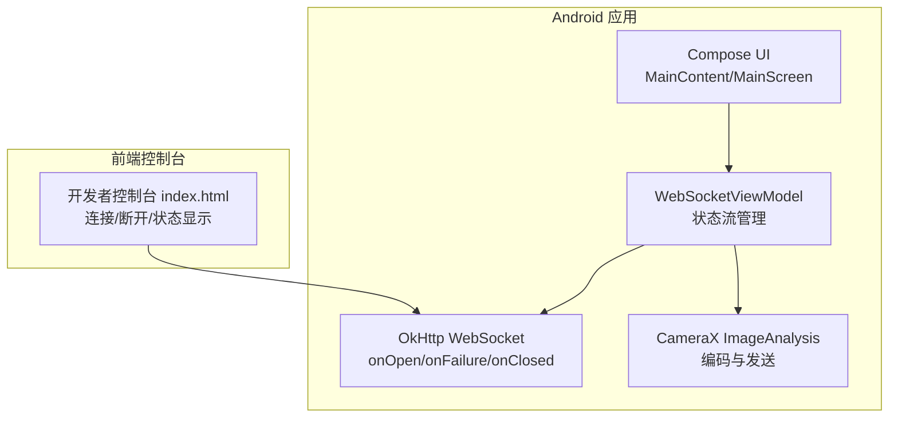
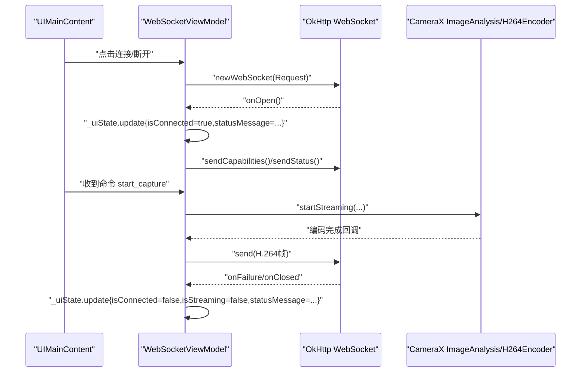
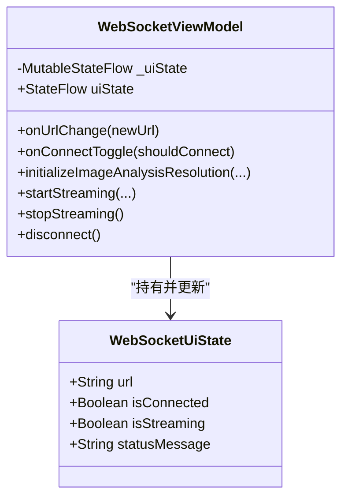
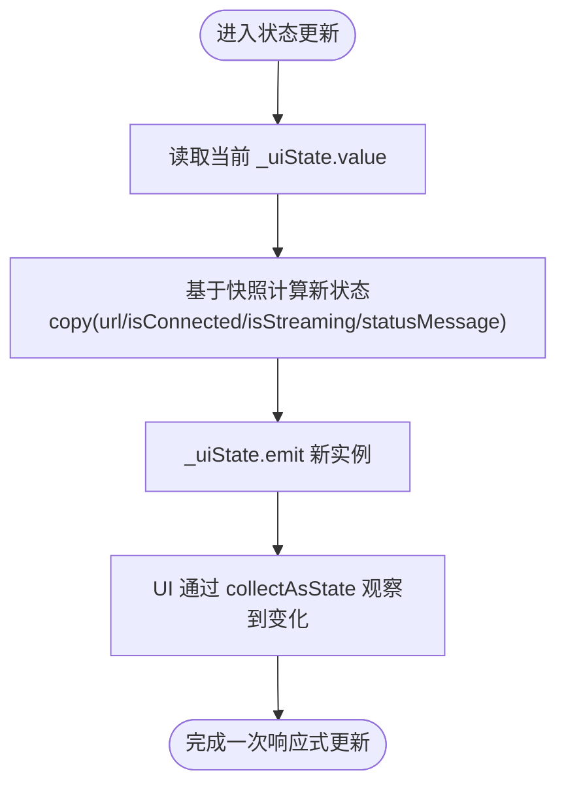
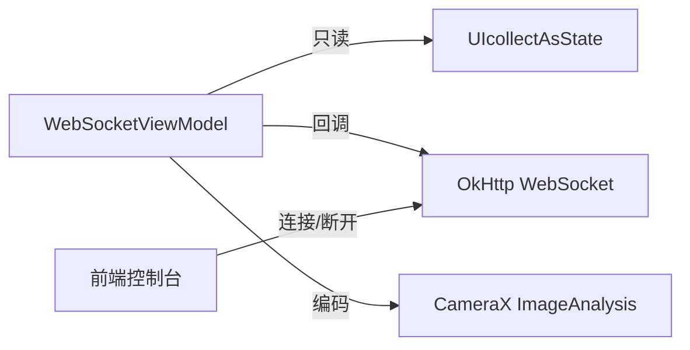

# 状态流管理

<cite>
**本文引用的文件**
- [MainActivity.kt](file://android-camera/app/src/main/java/com/example/lablogcamera/MainActivity.kt)
- [index.html](file://developer-frontend/index.html)
- [index.html（20251117_arduino_send_images_to_backend_and_frontend）](file://archive/20251117_arduino_send_images_to_backend_and_frontend/developer-frontend/index.html)
</cite>

## 目录
1. [引言](#引言)
2. [项目结构](#项目结构)
3. [核心组件](#核心组件)
4. [架构总览](#架构总览)
5. [详细组件分析](#详细组件分析)
6. [依赖关系分析](#依赖关系分析)
7. [性能考量](#性能考量)
8. [故障排查指南](#故障排查指南)
9. [结论](#结论)
10. [附录](#附录)

## 引言
本文件围绕 WebSocketViewModel 中使用 MutableStateFlow 管理 UI 状态展开，重点讲解 _uiState 可变状态流如何封装连接状态（isConnected）、流状态（isStreaming）、错误信息（statusMessage）与服务器 URL（url）等核心属性；阐释 WebSocketUiState 数据类的设计原则与不可变性优势；说明通过 update 函数进行状态更新的响应式编程模式及线程安全性保障；梳理状态流初始化与默认值设定策略；并提供在 ViewModel 中安全发射状态变更的最佳实践，包括避免内存泄漏与过度更新的方法。最后为初学者与高级用户提供从基础到复杂的状态合并与 debounce 处理设计模式参考路径。

## 项目结构
本仓库包含 Android 应用与前端开发者控制台两部分。与本主题直接相关的是 Android 应用中的 WebSocketViewModel 与 UI 层交互逻辑，以及前端控制台用于演示 WebSocket 连接状态与消息交互。

图表来源
- [MainActivity.kt](file://android-camera/app/src/main/java/com/example/lablogcamera/MainActivity.kt#L553-L600)
- [index.html](file://developer-frontend/index.html#L218-L377)
- [index.html（20251117_arduino_send_images_to_backend_and_frontend）](file://archive/20251117_arduino_send_images_to_backend_and_frontend/developer-frontend/index.html#L218-L377)

章节来源
- [MainActivity.kt](file://android-camera/app/src/main/java/com/example/lablogcamera/MainActivity.kt#L553-L600)

## 核心组件
- WebSocketViewModel：持有 _uiState（MutableStateFlow<WebSocketUiState>）与 uiState（只读 StateFlow），负责 WebSocket 生命周期、相机分析与编码控制、状态更新与 UI 交互。
- WebSocketUiState：不可变数据类，封装 url、isConnected、isStreaming、statusMessage 等 UI 关键状态字段。
- OkHttp WebSocket：作为网络层，触发 onOpen/onFailure/onClosed 等回调，驱动 ViewModel 更新 UI 状态。
- CameraX ImageAnalysis：在收到服务器命令后启动编码与发送流程，过程中通过 _uiState.update 更新状态。

章节来源
- [MainActivity.kt](file://android-camera/app/src/main/java/com/example/lablogcamera/MainActivity.kt#L553-L600)
- [MainActivity.kt](file://android-camera/app/src/main/java/com/example/lablogcamera/MainActivity.kt#L1669-L1676)
- [MainActivity.kt](file://android-camera/app/src/main/java/com/example/lablogcamera/MainActivity.kt#L867-L900)
- [MainActivity.kt](file://android-camera/app/src/main/java/com/example/lablogcamera/MainActivity.kt#L944-L1200)

## 架构总览
下面的序列图展示了从 UI 触发连接到 WebSocket 成功建立、状态更新与流启动的整体流程。

图表来源
- [MainActivity.kt](file://android-camera/app/src/main/java/com/example/lablogcamera/MainActivity.kt#L867-L900)
- [MainActivity.kt](file://android-camera/app/src/main/java/com/example/lablogcamera/MainActivity.kt#L944-L1200)
- [MainActivity.kt](file://android-camera/app/src/main/java/com/example/lablogcamera/MainActivity.kt#L1200-L1242)

## 详细组件分析

### WebSocketUiState 数据类与不可变性
- 字段设计
  - url：服务器 WebSocket 地址，默认值在数据类中定义，便于 UI 初始化时直接使用。
  - isConnected：表示 WebSocket 是否已连接。
  - isStreaming：表示是否正在进行视频流传输。
  - statusMessage：用于 UI 展示的连接/流状态文本。
- 不可变性优势
  - 数据类不可变，状态更新通过 copy 返回新实例，避免共享可变状态带来的竞态与副作用。
  - 在 Compose 中收集 StateFlow 时，不可变数据能更好地触发重组，提升 UI 一致性与可预测性。

章节来源
- [MainActivity.kt](file://android-camera/app/src/main/java/com/example/lablogcamera/MainActivity.kt#L1669-L1676)

### _uiState 初始化与默认值策略
- 初始化
  - 在 ViewModel 中以数据类默认值创建 MutableStateFlow，随后通过 asStateFlow 暴露只读 StateFlow，确保外部只能订阅状态，不能直接写入。
- 默认值
  - url 默认指向特定地址；isConnected 默认 false；isStreaming 默认 false；statusMessage 默认“Disconnected”。

章节来源
- [MainActivity.kt](file://android-camera/app/src/main/java/com/example/lablogcamera/MainActivity.kt#L553-L560)
- [MainActivity.kt](file://android-camera/app/src/main/java/com/example/lablogcamera/MainActivity.kt#L1669-L1676)

### 响应式更新：update 函数与线程安全
- 更新模式
  - 使用 _uiState.update { it.copy(...) } 进行状态更新，保证每次更新都是基于当前快照的新实例，避免竞态。
- 线程安全
  - StateFlow 的更新由协程作用域（viewModelScope）发起，结合 Dispatchers.IO/Main 的切换，确保网络回调与 UI 更新在合适线程执行。
  - 通过只暴露 uiState（只读）避免外部直接写入，降低并发风险。

章节来源
- [MainActivity.kt](file://android-camera/app/src/main/java/com/example/lablogcamera/MainActivity.kt#L553-L560)
- [MainActivity.kt](file://android-camera/app/src/main/java/com/example/lablogcamera/MainActivity.kt#L867-L900)
- [MainActivity.kt](file://android-camera/app/src/main/java/com/example/lablogcamera/MainActivity.kt#L944-L1200)

### 状态流在 UI 中的消费
- UI 收集
  - 在 Compose 中通过 collectAsState 收集 uiState，自动响应状态变化并触发重组。
- UI 展示
  - 连接开关、状态文本、URL 输入框等均直接绑定 uiState 字段，实现响应式 UI。

章节来源
- [MainActivity.kt](file://android-camera/app/src/main/java/com/example/lablogcamera/MainActivity.kt#L1693-L1740)
- [MainActivity.kt](file://android-camera/app/src/main/java/com/example/lablogcamera/MainActivity.kt#L1956-L1983)

### WebSocket 生命周期与状态联动
- 连接建立
  - onOpen：更新 isConnected 与 statusMessage，并上报能力与就绪状态。
- 连接失败/关闭
  - onFailure/onClosed：重置 isConnected、isStreaming，并清理流资源，确保状态一致。
- 断开
  - stopStreaming 后同样更新状态并发送停止状态。

章节来源
- [MainActivity.kt](file://android-camera/app/src/main/java/com/example/lablogcamera/MainActivity.kt#L867-L900)
- [MainActivity.kt](file://android-camera/app/src/main/java/com/example/lablogcamera/MainActivity.kt#L1200-L1242)

### 流启动与状态联动
- 命令解析
  - 收到服务器命令后，解析宽高比、码率、帧率等参数，决定采集与编码策略。
- 启动流
  - startStreaming 中初始化编码器、ImageAnalysis，随后通过 _uiState.update 更新 isStreaming 与 statusMessage。
- 停止流
  - stopStreaming 清理编码器与分析器，重置状态并发送停止状态。

章节来源
- [MainActivity.kt](file://android-camera/app/src/main/java/com/example/lablogcamera/MainActivity.kt#L902-L942)
- [MainActivity.kt](file://android-camera/app/src/main/java/com/example/lablogcamera/MainActivity.kt#L944-L1200)
- [MainActivity.kt](file://android-camera/app/src/main/java/com/example/lablogcamera/MainActivity.kt#L1200-L1242)

### 类关系图（代码级）

图表来源
- [MainActivity.kt](file://android-camera/app/src/main/java/com/example/lablogcamera/MainActivity.kt#L553-L600)
- [MainActivity.kt](file://android-camera/app/src/main/java/com/example/lablogcamera/MainActivity.kt#L1669-L1676)

### 状态更新流程图（算法级）

图表来源
- [MainActivity.kt](file://android-camera/app/src/main/java/com/example/lablogcamera/MainActivity.kt#L553-L560)
- [MainActivity.kt](file://android-camera/app/src/main/java/com/example/lablogcamera/MainActivity.kt#L867-L900)
- [MainActivity.kt](file://android-camera/app/src/main/java/com/example/lablogcamera/MainActivity.kt#L944-L1200)

### 复杂状态合并与去抖建议（设计模式）
- 状态合并
  - 将多个来源的状态（如网络状态、编码状态、UI 选择）合并为单一 WebSocketUiState，避免分散更新导致的不一致。
- 去抖处理
  - 对高频状态更新（如 UI 输入、日志刷新）采用去抖策略，减少 UI 重组与网络压力。
- 最佳实践
  - 使用 viewModelScope 管理生命周期，避免在 ViewModel 销毁后仍发射状态。
  - 在 UI 层使用 remember 与 LazyListState 等机制，避免不必要的重组。
  - 对网络回调与 UI 更新分离线程，必要时使用 Channel/SharedFlow 降低耦合。

（本节为通用设计建议，不直接对应具体代码片段）

## 依赖关系分析
- 组件耦合
  - WebSocketViewModel 与 OkHttp WebSocket、CameraX ImageAnalysis 存在回调与状态联动，属于松耦合的事件驱动模式。
- 外部依赖
  - OkHttp 用于 WebSocket 通信；CameraX 用于图像采集与分析；Compose 用于 UI 响应式展示。
- 潜在循环依赖
  - 未发现直接循环依赖；状态更新通过只读 StateFlow 下发至 UI，避免反向写入引发环路。

图表来源
- [MainActivity.kt](file://android-camera/app/src/main/java/com/example/lablogcamera/MainActivity.kt#L553-L600)
- [index.html](file://developer-frontend/index.html#L218-L377)
- [index.html（20251117_arduino_send_images_to_backend_and_frontend）](file://archive/20251117_arduino_send_images_to_backend_and_frontend/developer-frontend/index.html#L218-L377)

章节来源
- [MainActivity.kt](file://android-camera/app/src/main/java/com/example/lablogcamera/MainActivity.kt#L553-L600)

## 性能考量
- 状态更新成本
  - 不可变数据类与 copy 操作在频繁更新场景下需注意对象分配；可通过合并更新批次降低重组频率。
- 线程调度
  - 网络回调与 UI 更新分派到不同线程，避免阻塞主线程；编码与发送在 IO 线程执行。
- 资源释放
  - stopStreaming 与 disconnect 时及时清理编码器、分析器与 WebSocket，避免资源泄漏。

（本节为通用指导，不直接分析具体代码）

## 故障排查指南
- 连接失败
  - 检查 onFailure 回调中是否正确重置 isConnected/isStreaming，并清理 WebSocket 引用。
- 状态不一致
  - 确认所有状态更新均通过 _uiState.update 进行，避免直接赋值导致的竞态。
- UI 不刷新
  - 确认 UI 侧使用 collectAsState 订阅 uiState，且未被 remember/懒加载逻辑屏蔽。
- 前端控制台状态
  - 前端控制台展示了连接状态与按钮启用/禁用逻辑，可对照验证后端 WebSocket 行为。

章节来源
- [MainActivity.kt](file://android-camera/app/src/main/java/com/example/lablogcamera/MainActivity.kt#L867-L900)
- [MainActivity.kt](file://android-camera/app/src/main/java/com/example/lablogcamera/MainActivity.kt#L1200-L1242)
- [index.html](file://developer-frontend/index.html#L218-L377)
- [index.html（20251117_arduino_send_images_to_backend_and_frontend）](file://archive/20251117_arduino_send_images_to_backend_and_frontend/developer-frontend/index.html#L218-L377)

## 结论
通过将 UI 状态封装在不可变的 WebSocketUiState 中，并以 MutableStateFlow 作为唯一可变入口，配合 update 的响应式更新与线程安全调度，实现了清晰、可维护且高性能的状态管理。结合前端控制台与 Android 应用的协同，能够稳定地展示连接状态、流状态与错误信息，为后续扩展复杂状态合并与去抖策略提供了良好基础。

## 附录
- 初学者参考路径
  - 创建状态流：参考 _uiState 的初始化与 asStateFlow 暴露方式。
  - 更新状态：参考 onOpen/onFailure/onClosed 中的 _uiState.update 使用。
  - 消费状态：参考 UI 中 collectAsState 的订阅与展示。
- 高级用户参考路径
  - 复杂状态合并：将网络、编码、UI 选择等多源状态合并为单一数据类。
  - 去抖策略：对高频输入与日志刷新进行去抖，减少重组与网络压力。
  - 线程模型：明确网络回调、IO 编码与 UI 更新的线程边界，避免阻塞与竞态。