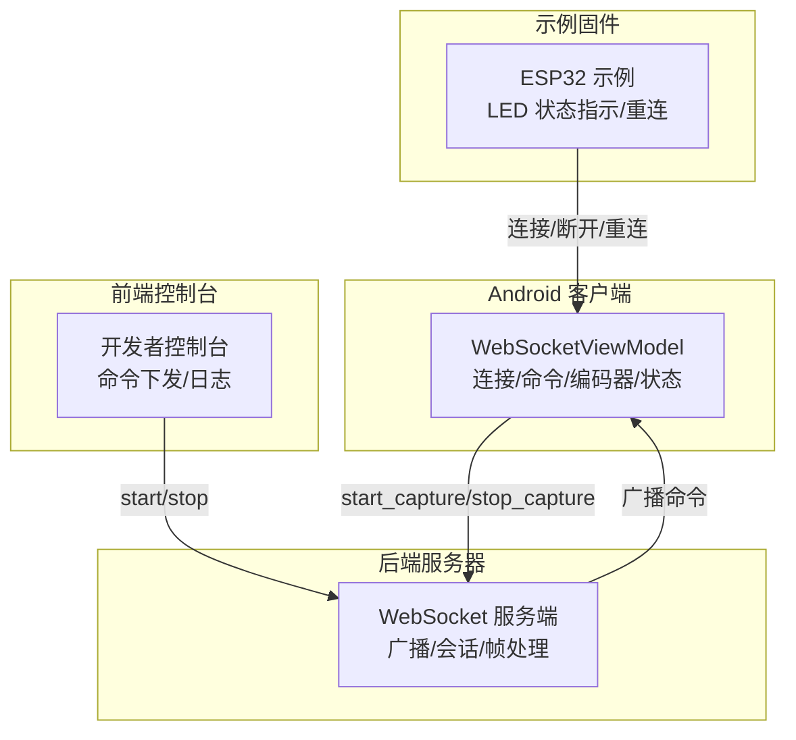
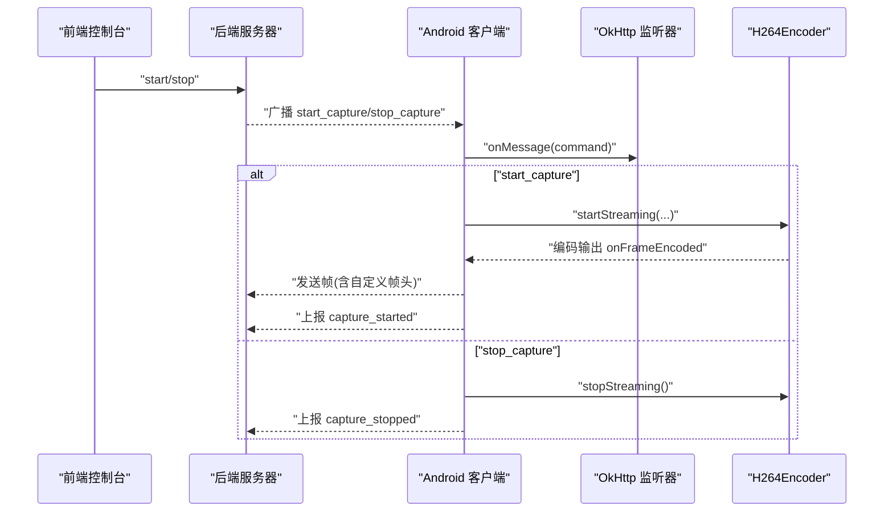
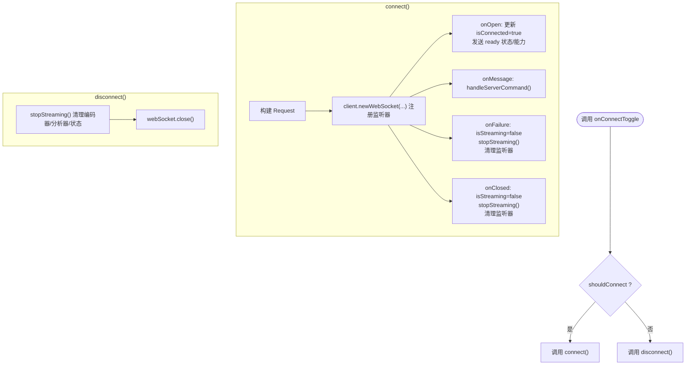
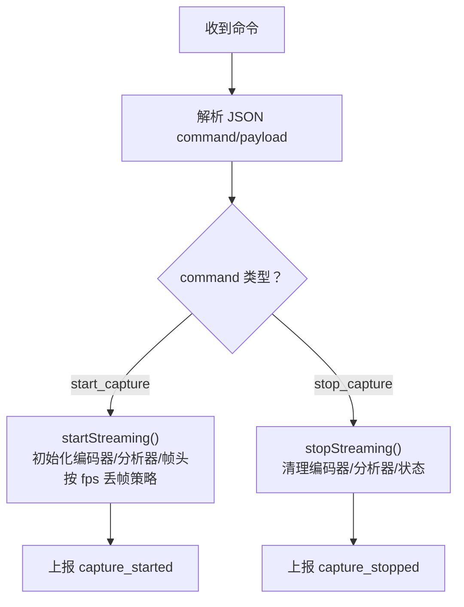
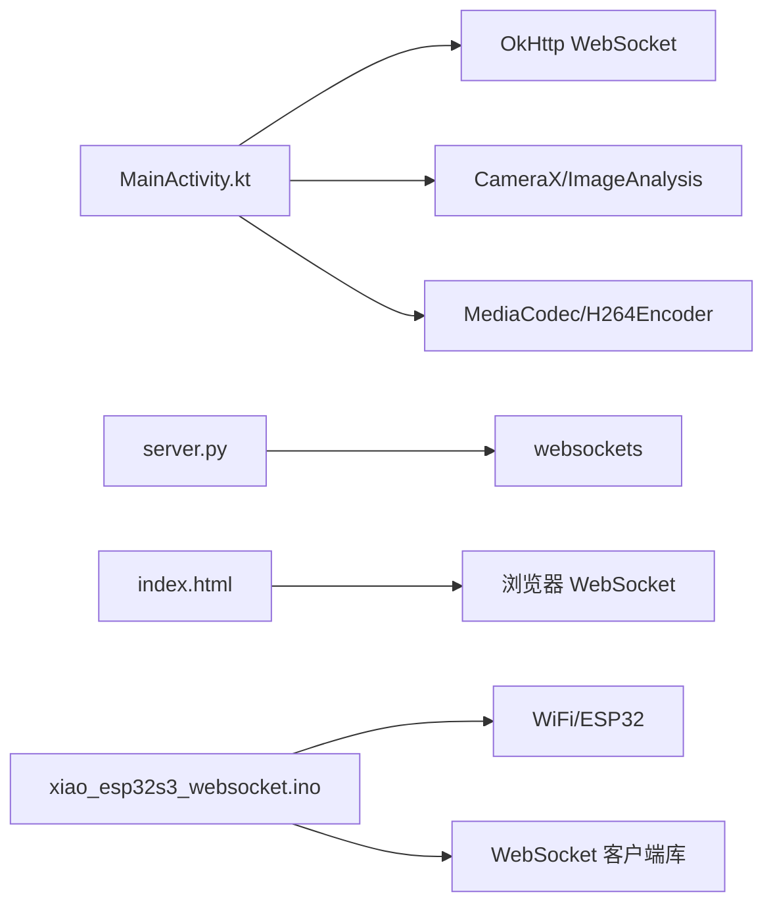
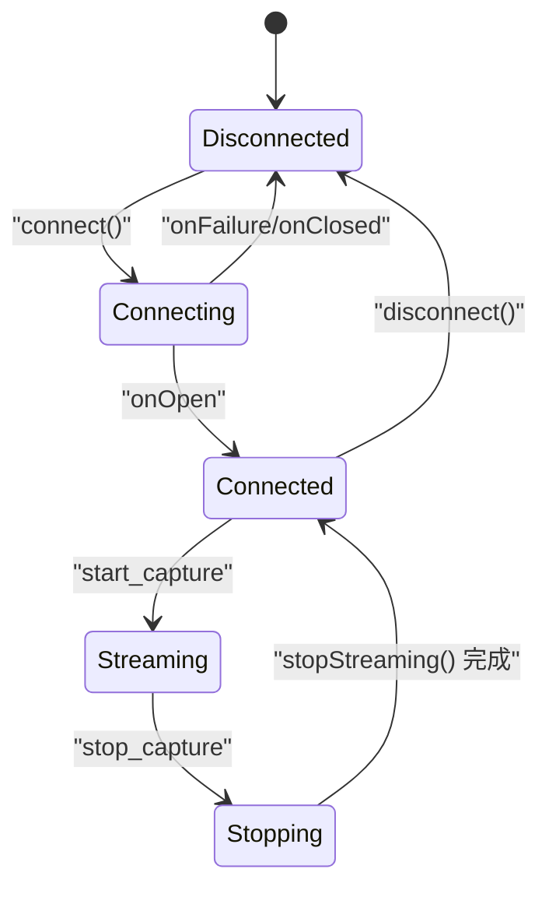

# 状态转换机制

<cite>
**本文引用的文件**
- [MainActivity.kt](file://android-camera/app/src/main/java/com/example/lablogcamera/MainActivity.kt)
- [server.py](file://backend/server.py)
- [index.html](file://developer-frontend/index.html)
- [xiao_esp32s3_websocket.ino](file://archive/20251116_websocket_send_random_num/xiao_esp32s3_websocket/xiao_esp32s3_websocket.ino)
</cite>

## 目录
1. [简介](#简介)
2. [项目结构](#项目结构)
3. [核心组件](#核心组件)
4. [架构总览](#架构总览)
5. [详细组件分析](#详细组件分析)
6. [依赖关系分析](#依赖关系分析)
7. [性能考量](#性能考量)
8. [故障排查指南](#故障排查指南)
9. [结论](#结论)
10. [附录](#附录)

## 简介
本文件围绕 WebSocket 连接与视频流状态转换机制展开，重点说明：
- onConnectToggle 如何依据 shouldConnect 参数调用 connect 或 disconnect 实现连接状态切换
- OkHttp WebSocket 的创建流程（请求构建、监听器注册、异常处理）
- disconnect 如何安全关闭连接并清理资源
- 收到 'start_capture' 和 'stop_capture' 命令后 isStreaming 状态变更逻辑及对编码器的影响
- 中间态（连接中、断开中）与超时/重试策略
- 提供状态机与时序图，帮助初学者理解状态迁移，为高级用户提供事务性与重试设计建议

## 项目结构
本仓库包含 Android 客户端、后端服务器以及若干演示示例。与本文主题最相关的模块如下：
- Android 客户端：使用 OkHttp WebSocket 与后端通信，负责状态上报、命令解析与编码器启停
- 后端服务器：接收命令并广播至所有客户端，维护录制会话与帧数据
- 前端控制台：用于演示 WebSocket 连接与命令下发
- 示例固件：展示嵌入式设备的连接状态机与重连策略

图表来源
- [MainActivity.kt](file://android-camera/app/src/main/java/com/example/lablogcamera/MainActivity.kt#L756-L942)
- [server.py](file://backend/server.py#L305-L418)
- [index.html](file://developer-frontend/index.html#L347-L377)
- [xiao_esp32s3_websocket.ino](file://archive/20251116_websocket_send_random_num/xiao_esp32s3_websocket/xiao_esp32s3_websocket.ino#L108-L149)

章节来源
- [MainActivity.kt](file://android-camera/app/src/main/java/com/example/lablogcamera/MainActivity.kt#L756-L942)
- [server.py](file://backend/server.py#L305-L418)
- [index.html](file://developer-frontend/index.html#L347-L377)
- [xiao_esp32s3_websocket.ino](file://archive/20251116_websocket_send_random_num/xiao_esp32s3_websocket/xiao_esp32s3_websocket.ino#L108-L149)

## 核心组件
- WebSocketViewModel：负责连接生命周期、命令解析、编码器启停、UI 状态与帧发送
- H264Encoder：封装 MediaCodec，负责 YUV->NV12 转换与编码输出
- WebSocketListener：OkHttp 监听器，处理 onOpen/onMessage/onFailure/onClosed
- 后端服务器：接收 start/stop 命令，广播到所有客户端，维护录制会话
- 前端控制台：向后端发送 start/stop，后端广播到客户端
- 示例固件：展示连接状态机与自动重连

章节来源
- [MainActivity.kt](file://android-camera/app/src/main/java/com/example/lablogcamera/MainActivity.kt#L180-L276)
- [MainActivity.kt](file://android-camera/app/src/main/java/com/example/lablogcamera/MainActivity.kt#L866-L900)
- [MainActivity.kt](file://android-camera/app/src/main/java/com/example/lablogcamera/MainActivity.kt#L902-L942)
- [MainActivity.kt](file://android-camera/app/src/main/java/com/example/lablogcamera/MainActivity.kt#L944-L1200)
- [MainActivity.kt](file://android-camera/app/src/main/java/com/example/lablogcamera/MainActivity.kt#L1203-L1226)
- [server.py](file://backend/server.py#L305-L418)
- [index.html](file://developer-frontend/index.html#L347-L377)
- [xiao_esp32s3_websocket.ino](file://archive/20251116_websocket_send_random_num/xiao_esp32s3_websocket/xiao_esp32s3_websocket.ino#L108-L149)

## 架构总览
下图展示了从命令下发到状态变更与编码器动作的端到端流程。

图表来源
- [server.py](file://backend/server.py#L305-L418)
- [MainActivity.kt](file://android-camera/app/src/main/java/com/example/lablogcamera/MainActivity.kt#L902-L942)
- [MainActivity.kt](file://android-camera/app/src/main/java/com/example/lablogcamera/MainActivity.kt#L944-L1200)
- [MainActivity.kt](file://android-camera/app/src/main/java/com/example/lablogcamera/MainActivity.kt#L1203-L1226)

## 详细组件分析

### onConnectToggle 与连接切换
- onConnectToggle 根据 shouldConnect 调用 connect 或 disconnect
- connect 构建 Request，创建 OkHttp WebSocket 并注册 WebSocketListener
- WebSocketListener 在 onOpen 时上报 ready 状态并发送能力信息；在 onFailure/onClosed 时重置 isStreaming 并清理资源
- disconnect 先 stopStreaming，再关闭 WebSocket

图表来源
- [MainActivity.kt](file://android-camera/app/src/main/java/com/example/lablogcamera/MainActivity.kt#L756-L759)
- [MainActivity.kt](file://android-camera/app/src/main/java/com/example/lablogcamera/MainActivity.kt#L866-L900)
- [MainActivity.kt](file://android-camera/app/src/main/java/com/example/lablogcamera/MainActivity.kt#L1318-L1321)
- [MainActivity.kt](file://android-camera/app/src/main/java/com/example/lablogcamera/MainActivity.kt#L1203-L1226)

章节来源
- [MainActivity.kt](file://android-camera/app/src/main/java/com/example/lablogcamera/MainActivity.kt#L756-L759)
- [MainActivity.kt](file://android-camera/app/src/main/java/com/example/lablogcamera/MainActivity.kt#L866-L900)
- [MainActivity.kt](file://android-camera/app/src/main/java/com/example/lablogcamera/MainActivity.kt#L1318-L1321)
- [MainActivity.kt](file://android-camera/app/src/main/java/com/example/lablogcamera/MainActivity.kt#L1203-L1226)

### OkHttp WebSocket 创建流程（请求构建、监听器注册、异常处理）
- 请求构建：使用当前 URL 构建 Request
- 监听器注册：通过 client.newWebSocket(Request, WebSocketListener)
- 异常处理：
  - onOpen：更新 isConnected 与状态消息，发送 ready 状态与能力信息
  - onMessage：解析命令，执行 start/stop 流程
  - onFailure：设置 isStreaming=false，stopStreaming，清理引用
  - onClosed：设置 isStreaming=false，stopStreaming，清理引用

章节来源
- [MainActivity.kt](file://android-camera/app/src/main/java/com/example/lablogcamera/MainActivity.kt#L866-L900)

### disconnect 安全关闭与资源清理
- stopStreaming：清空 ImageAnalysis 分析器、停止并释放 H264Encoder、重置裁剪与帧计数、更新 isStreaming=false
- 关闭 WebSocket：webSocket.close(1000, "User disconnected")

章节来源
- [MainActivity.kt](file://android-camera/app/src/main/java/com/example/lablogcamera/MainActivity.kt#L1203-L1226)
- [MainActivity.kt](file://android-camera/app/src/main/java/com/example/lablogcamera/MainActivity.kt#L1318-L1321)

### 命令解析与 isStreaming 状态变更
- 收到 'start_capture'：
  - 解析 payload（format/aspectRatio/bitrate/fps）
  - 若服务器显式下发 aspectRatio，则覆盖本地选择
  - startStreaming：初始化编码器、ImageAnalysis、帧头构造、按目标 fps 丢帧策略、上报 capture_started
- 收到 'stop_capture'：stopStreaming，上报 capture_stopped

图表来源
- [MainActivity.kt](file://android-camera/app/src/main/java/com/example/lablogcamera/MainActivity.kt#L902-L942)
- [MainActivity.kt](file://android-camera/app/src/main/java/com/example/lablogcamera/MainActivity.kt#L944-L1200)
- [MainActivity.kt](file://android-camera/app/src/main/java/com/example/lablogcamera/MainActivity.kt#L1203-L1226)

章节来源
- [MainActivity.kt](file://android-camera/app/src/main/java/com/example/lablogcamera/MainActivity.kt#L902-L942)
- [MainActivity.kt](file://android-camera/app/src/main/java/com/example/lablogcamera/MainActivity.kt#L944-L1200)
- [MainActivity.kt](file://android-camera/app/src/main/java/com/example/lablogcamera/MainActivity.kt#L1203-L1226)

### 编码器对帧头与发送逻辑
- 帧头字段：设备时间戳（毫秒）、帧序号（低32位）、payload 长度（字节）
- 发送时机：每帧编码完成后，拼接帧头并发送
- 速率控制：当目标 fps>0 时，按时间间隔丢帧，避免过度发送

章节来源
- [MainActivity.kt](file://android-camera/app/src/main/java/com/example/lablogcamera/MainActivity.kt#L968-L984)
- [MainActivity.kt](file://android-camera/app/src/main/java/com/example/lablogcamera/MainActivity.kt#L1329-L1341)

### 服务器广播与命令下发
- 服务器接收终端输入 start/stop，构造 JSON 广播到所有客户端
- start：包含 format、bitrate、fps，可选 aspectRatio
- stop：仅 stop_capture

章节来源
- [server.py](file://backend/server.py#L305-L418)

### 前端控制台与命令下发
- 前端控制台连接后，可发送 start/stop/status 等命令
- 服务器收到后转发给 ESP32 客户端（示例）

章节来源
- [index.html](file://developer-frontend/index.html#L347-L377)
- [server.py](file://backend/server.py#L305-L418)

### 示例固件状态机与重连
- 状态机：WiFi 连接中、WebSocket 连接中、已连接、错误
- 重连：setReconnectInterval(5000)，断开/错误时自动重连
- LED 指示：不同状态闪烁模式

章节来源
- [xiao_esp32s3_websocket.ino](file://archive/20251116_websocket_send_random_num/xiao_esp32s3_websocket/xiao_esp32s3_websocket.ino#L108-L149)
- [xiao_esp32s3_websocket.ino](file://archive/20251116_websocket_send_random_num/xiao_esp32s3_websocket/xiao_esp32s3_websocket.ino#L192-L241)

## 依赖关系分析
- Android 客户端依赖 OkHttp WebSocket 与 CameraX/媒体编解码
- 服务器依赖 websockets，负责广播与会话管理
- 前端控制台依赖浏览器原生 WebSocket
- 示例固件依赖 WiFi 与 WebSocket 库

图表来源
- [MainActivity.kt](file://android-camera/app/src/main/java/com/example/lablogcamera/MainActivity.kt#L108-L114)
- [MainActivity.kt](file://android-camera/app/src/main/java/com/example/lablogcamera/MainActivity.kt#L180-L276)
- [server.py](file://backend/server.py#L10-L11)
- [index.html](file://developer-frontend/index.html#L347-L377)
- [xiao_esp32s3_websocket.ino](file://archive/20251116_websocket_send_random_num/xiao_esp32s3_websocket/xiao_esp32s3_websocket.ino#L108-L149)

## 性能考量
- 帧率控制：通过 shouldSendFrame 按目标 fps 丢帧，降低网络与 CPU 压力
- 编码器对齐：裁剪与对齐确保硬件编码器稳定，减少伪影与重编码
- 传输优化：二进制帧头紧凑，避免额外序列化成本
- 会话管理：服务器按会话写裸 H.264，最终封装为 MP4，避免实时重编码

章节来源
- [MainActivity.kt](file://android-camera/app/src/main/java/com/example/lablogcamera/MainActivity.kt#L1329-L1341)
- [MainActivity.kt](file://android-camera/app/src/main/java/com/example/lablogcamera/MainActivity.kt#L1144-L1176)
- [server.py](file://backend/server.py#L150-L179)

## 故障排查指南
- 连接失败（onFailure）：检查 URL、网络、防火墙；确认服务器端口开放
- 无法发送命令：确认已连接（OPEN），并在 UI 禁用状态下避免操作
- 无法停止流：确认 stop_capture 命令已下发，stopStreaming 已执行
- 服务器未收到帧：检查客户端是否成功上报 capture_started，确认编码器已启动
- 前端控制台连接：确认 URL 与端口，观察 onopen/onerror/onclose 日志

章节来源
- [MainActivity.kt](file://android-camera/app/src/main/java/com/example/lablogcamera/MainActivity.kt#L866-L900)
- [index.html](file://developer-frontend/index.html#L347-L377)
- [server.py](file://backend/server.py#L305-L418)

## 结论
本文梳理了 Android 客户端与后端之间的 WebSocket 状态转换机制，明确了 onConnectToggle 的切换路径、OkHttp 连接创建与异常处理、命令解析与 isStreaming 的联动、编码器的启停与帧头发送策略，并结合服务器广播与前端控制台，给出了完整的端到端时序。对于复杂场景，可借鉴示例固件的状态机与重连策略，设计具备事务性与重试能力的连接与流控制方案。

## 附录

### 状态机模型（概念示意）

[本图为概念示意，不直接映射到具体源码文件]

### 初学者示例（基本状态切换）
- 在 UI 中切换开关，触发 onConnectToggle
- connect 成功后上报 ready，随后收到 start_capture
- startStreaming 启动编码器并发送帧，上报 capture_started
- 收到 stop_capture 后 stopStreaming，上报 capture_stopped

章节来源
- [MainActivity.kt](file://android-camera/app/src/main/java/com/example/lablogcamera/MainActivity.kt#L756-L759)
- [MainActivity.kt](file://android-camera/app/src/main/java/com/example/lablogcamera/MainActivity.kt#L866-L900)
- [MainActivity.kt](file://android-camera/app/src/main/java/com/example/lablogcamera/MainActivity.kt#L902-L942)
- [MainActivity.kt](file://android-camera/app/src/main/java/com/example/lablogcamera/MainActivity.kt#L944-L1200)
- [MainActivity.kt](file://android-camera/app/src/main/java/com/example/lablogcamera/MainActivity.kt#L1203-L1226)

### 高级用户：事务性与重试设计建议
- 事务性保障
  - start_capture：在编码器启动成功后再上报 capture_started
  - stop_capture：先停止分析器与编码器，再上报 capture_stopped
- 超时与重试
  - 连接失败时，onFailure 中设置 isStreaming=false 并清理
  - 可在 UI 层增加自动重试计数与指数退避
- 中间态
  - 连接中/断开中：UI 禁用相关按钮，避免并发状态切换
  - 服务器广播时记录发送结果，失败客户端单独处理

章节来源
- [MainActivity.kt](file://android-camera/app/src/main/java/com/example/lablogcamera/MainActivity.kt#L866-L900)
- [MainActivity.kt](file://android-camera/app/src/main/java/com/example/lablogcamera/MainActivity.kt#L1203-L1226)
- [xiao_esp32s3_websocket.ino](file://archive/20251116_websocket_send_random_num/xiao_esp32s3_websocket/xiao_esp32s3_websocket.ino#L108-L149)