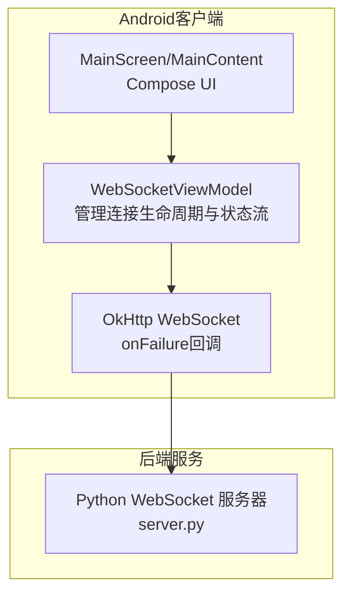
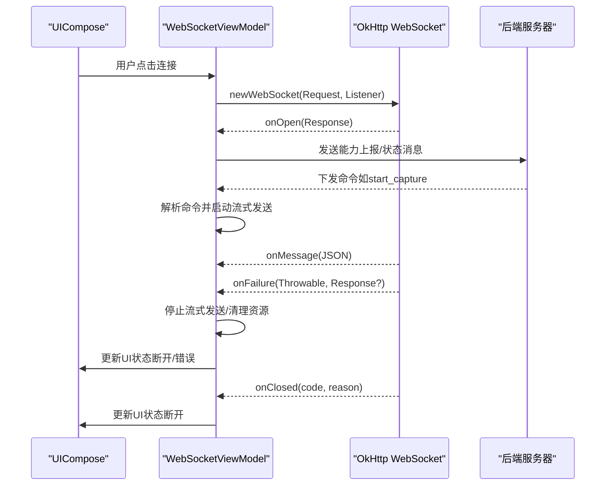
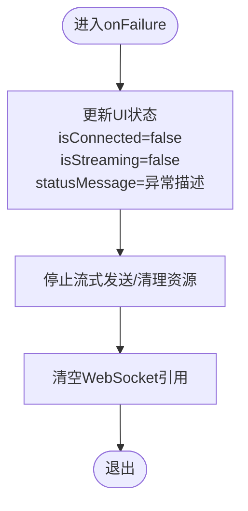
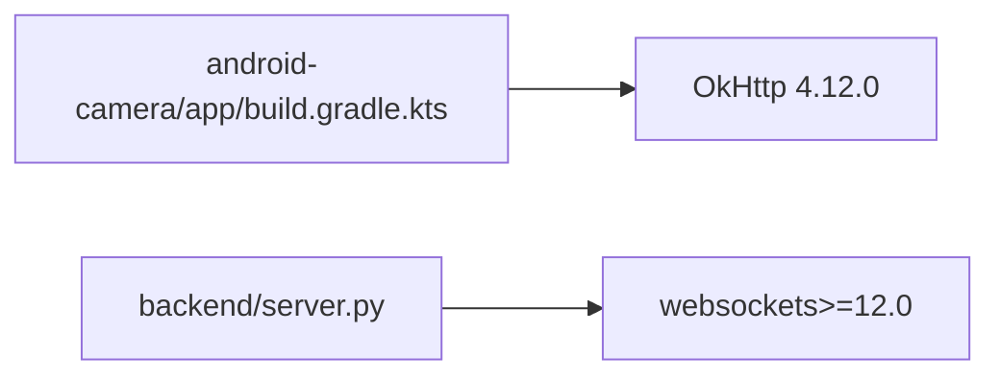

# 异常捕获与分类

<cite>
**本文引用的文件**
- [MainActivity.kt](file://android-camera/app/src/main/java/com/example/lablogcamera/MainActivity.kt)
- [build.gradle.kts](file://android-camera/app/build.gradle.kts)
- [server.py](file://backend/server.py)
</cite>

## 目录
1. [简介](#简介)
2. [项目结构](#项目结构)
3. [核心组件](#核心组件)
4. [架构总览](#架构总览)
5. [详细组件分析](#详细组件分析)
6. [依赖关系分析](#依赖关系分析)
7. [性能考量](#性能考量)
8. [故障排查指南](#故障排查指南)
9. [结论](#结论)
10. [附录](#附录)

## 简介
本文件围绕Android客户端的WebSocket异常捕获与分类展开，重点解析OkHttp WebSocketListener的onFailure回调中异常类型的识别与分类机制，说明如何通过异常类型判断网络中断、协议错误或服务器异常崩溃，并实现结构化的错误码映射。文档还展示在ViewModel中如何通过UI状态流安全地传递异常信息，避免主线程阻塞；提供从底层Socket异常到用户可读提示的转换示例，包括离线重试提示、服务器不可达警告等。最后为初学者提供基础的try-catch代码示例路径，为高级开发者展示异常拦截器和全局异常处理器的设计模式。

## 项目结构
该项目包含Android客户端与后端服务两部分：
- Android客户端：基于Compose UI与CameraX采集，使用OkHttp WebSocket与后端通信。
- 后端服务：基于Python的WebSocket服务器，接收H.264流并进行录制与封装。

图表来源
- [MainActivity.kt](file://android-camera/app/src/main/java/com/example/lablogcamera/MainActivity.kt#L867-L900)
- [server.py](file://backend/server.py#L426-L439)

章节来源
- [build.gradle.kts](file://android-camera/app/build.gradle.kts#L44-L68)

## 核心组件
- WebSocketViewModel：负责OkHttp WebSocket的创建、命令解析、状态上报、流式发送与UI状态流更新。
- WebSocketListener：在onFailure中处理异常，更新UI状态并停止流式发送。
- UI状态流：通过MutableStateFlow维护连接状态、是否正在推流、状态消息等，供Compose UI订阅展示。

章节来源
- [MainActivity.kt](file://android-camera/app/src/main/java/com/example/lablogcamera/MainActivity.kt#L554-L600)
- [MainActivity.kt](file://android-camera/app/src/main/java/com/example/lablogcamera/MainActivity.kt#L867-L900)

## 架构总览
Android客户端通过OkHttp WebSocket与后端建立长连接，服务器监听端口并处理终端输入。客户端在onFailure中统一捕获异常，更新UI状态并停止流式发送，避免主线程阻塞。

图表来源
- [MainActivity.kt](file://android-camera/app/src/main/java/com/example/lablogcamera/MainActivity.kt#L867-L900)
- [server.py](file://backend/server.py#L426-L439)

## 详细组件分析

### WebSocketListener onFailure 异常捕获与分类
- 异常来源：底层Socket连接失败、网络中断、协议错误、服务器异常崩溃等。
- 当前实现：在onFailure中统一设置断开状态、停止流式发送、清理WebSocket引用，并将异常消息写入状态消息。
- 分类建议：
  - 网络中断：DNS解析失败、TCP握手失败、TLS握手失败、连接超时等。
  - 协议错误：握手失败、非法帧、协议版本不匹配、关闭码为1002等。
  - 服务器异常崩溃：服务器主动关闭、非正常关闭、业务异常导致的断开。
- 结构化错误码映射（建议）：
  - 1000：正常关闭
  - 1002：协议错误
  - 1006：异常关闭（网络中断/服务器崩溃）
  - 1012：服务端不可用
  - 1013：服务端过载
  - 1015：网络超时
  - 1016：认证失败
  - 1017：业务错误（自定义）
- 识别方法：
  - 通过Throwable类型区分IO类异常与协议类异常。
  - 通过Response或关闭码进一步细化分类。
  - 通过异常栈信息定位具体阶段（DNS/TLS/握手/传输）。

章节来源
- [MainActivity.kt](file://android-camera/app/src/main/java/com/example/lablogcamera/MainActivity.kt#L887-L898)

### UI状态流与异常传播
- UI状态流：通过MutableStateFlow维护url、isConnected、isStreaming、statusMessage等字段。
- 更新策略：在onFailure/onClosed中更新状态，避免在子线程直接操作UI。
- 传播路径：ViewModel更新StateFlow，UI通过collectAsState订阅并展示。

图表来源
- [MainActivity.kt](file://android-camera/app/src/main/java/com/example/lablogcamera/MainActivity.kt#L887-L898)

章节来源
- [MainActivity.kt](file://android-camera/app/src/main/java/com/example/lablogcamera/MainActivity.kt#L1670-L1676)
- [MainActivity.kt](file://android-camera/app/src/main/java/com/example/lablogcamera/MainActivity.kt#L1970-L1983)

### 从底层异常到用户提示的转换
- 离线重试提示：当出现网络中断或服务器不可达时，UI显示“离线重试”按钮，触发ViewModel重连逻辑。
- 服务器不可达警告：当关闭码指向服务端不可用或超时，UI显示“服务器不可达”提示。
- 业务错误提示：当服务器返回业务错误码，UI显示具体错误信息并引导用户修复配置。

章节来源
- [MainActivity.kt](file://android-camera/app/src/main/java/com/example/lablogcamera/MainActivity.kt#L887-L898)
- [server.py](file://backend/server.py#L426-L439)

### 初学者基础try-catch示例（代码片段路径）
- 在WebSocketListener的onFailure中添加异常类型判断与日志记录。
- 在UI状态流更新处使用withContext切换到主线程更新UI。
- 在发送状态消息或能力上报时使用viewModelScope.launch(Dispatchers.IO)执行耗时任务。

章节来源
- [MainActivity.kt](file://android-camera/app/src/main/java/com/example/lablogcamera/MainActivity.kt#L887-L898)
- [MainActivity.kt](file://android-camera/app/src/main/java/com/example/lablogcamera/MainActivity.kt#L1228-L1242)
- [MainActivity.kt](file://android-camera/app/src/main/java/com/example/lablogcamera/MainActivity.kt#L1244-L1258)

### 高级开发者：异常拦截器与全局异常处理器
- 异常拦截器：在OkHttp层增加拦截器，统计异常类型与次数，记录上下文信息（URL、时间、设备信息）。
- 全局异常处理器：在Application或ViewModel层注册全局异常捕获，将异常转化为结构化错误码并上报。
- 重试策略：指数退避重连，结合网络状态监听与用户交互（如弹窗确认）。

章节来源
- [build.gradle.kts](file://android-camera/app/build.gradle.kts#L44-L68)

## 依赖关系分析
- OkHttp依赖：app模块引入OkHttp，用于WebSocket通信。
- 服务器依赖：后端使用websockets库，监听端口并处理连接。

图表来源
- [build.gradle.kts](file://android-camera/app/build.gradle.kts#L44-L68)
- [server.py](file://backend/server.py#L1-L20)

章节来源
- [build.gradle.kts](file://android-camera/app/build.gradle.kts#L44-L68)
- [server.py](file://backend/server.py#L1-L20)

## 性能考量
- 避免在onFailure中执行耗时操作，使用viewModelScope.launch(Dispatchers.IO)异步处理。
- UI状态更新尽量批量合并，减少重组次数。
- 流式发送时注意帧率控制与丢帧策略，降低网络拥塞风险。

## 故障排查指南
- 网络问题：检查WiFi连接、防火墙、代理设置；观察onFailure中的异常类型与关闭码。
- 协议问题：确认WebSocket版本、路径、头部字段；关注1002类协议错误。
- 服务器问题：查看后端日志与终端输入；确认服务端是否正常运行与端口开放。
- UI无响应：确认状态更新在主线程执行，避免阻塞UI线程。

章节来源
- [MainActivity.kt](file://android-camera/app/src/main/java/com/example/lablogcamera/MainActivity.kt#L887-L898)
- [server.py](file://backend/server.py#L426-L439)

## 结论
通过对OkHttp WebSocketListener的onFailure回调进行结构化异常捕获与分类，结合UI状态流的异步更新，可以有效提升Android客户端的稳定性与用户体验。建议在现有基础上完善异常类型识别、错误码映射与重试策略，并在应用层引入全局异常处理与拦截器，以实现更完善的异常治理。

## 附录
- 关键实现位置参考：
  - WebSocket连接与监听：[MainActivity.kt](file://android-camera/app/src/main/java/com/example/lablogcamera/MainActivity.kt#L867-L900)
  - UI状态流定义：[MainActivity.kt](file://android-camera/app/src/main/java/com/example/lablogcamera/MainActivity.kt#L1670-L1676)
  - 状态消息发送：[MainActivity.kt](file://android-camera/app/src/main/java/com/example/lablogcamera/MainActivity.kt#L1228-L1242)
  - 能力上报：[MainActivity.kt](file://android-camera/app/src/main/java/com/example/lablogcamera/MainActivity.kt#L1244-L1258)
  - 依赖声明：[build.gradle.kts](file://android-camera/app/build.gradle.kts#L44-L68)
  - 服务器入口：[server.py](file://backend/server.py#L426-L439)