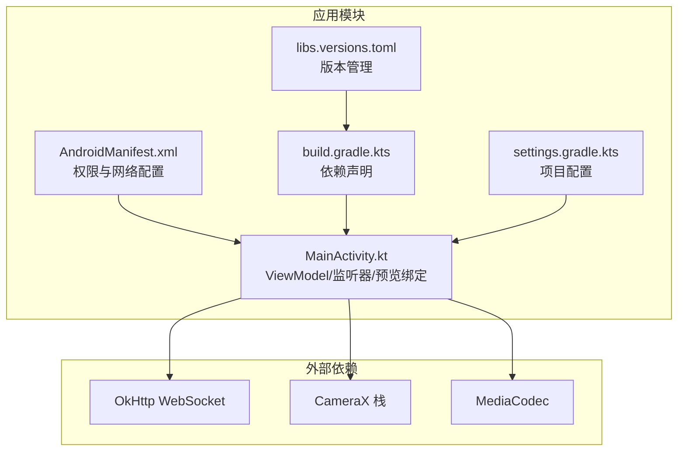
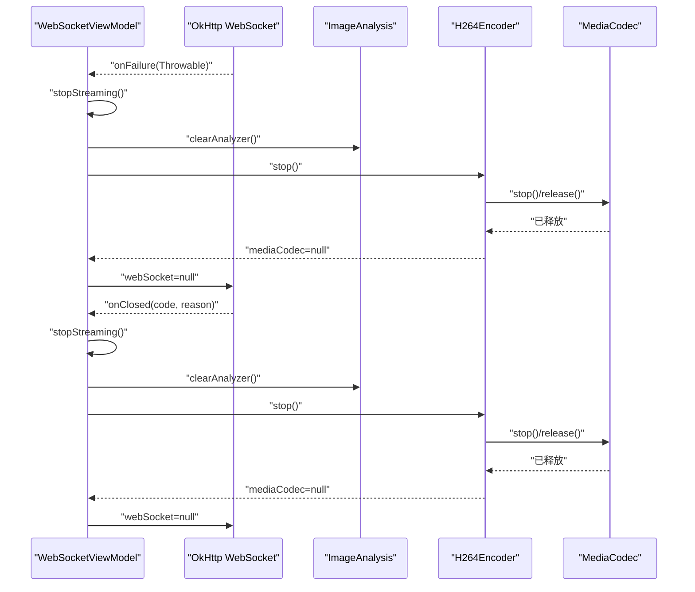
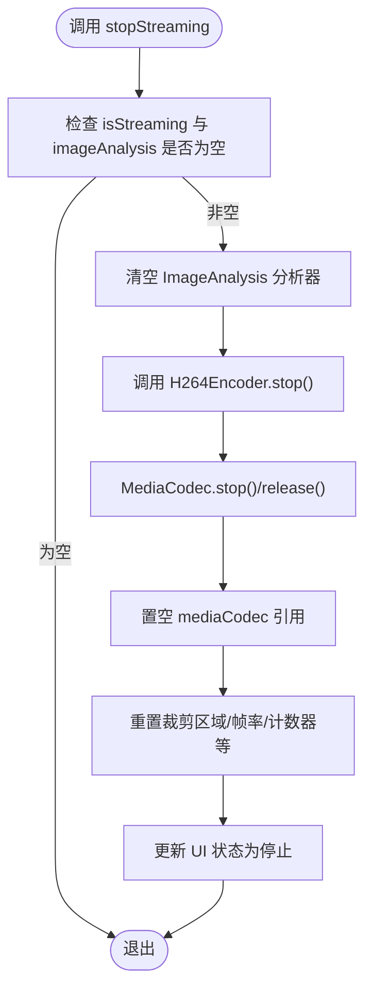
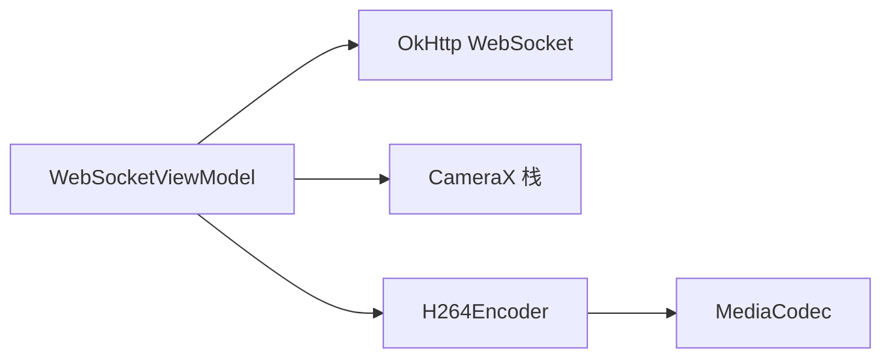

# 资源清理机制

<cite>
**本文引用的文件**
- [MainActivity.kt](file://android-camera/app/src/main/java/com/example/lablogcamera/MainActivity.kt)
- [AndroidManifest.xml](file://android-camera/app/src/main/AndroidManifest.xml)
- [build.gradle.kts](file://android-camera/app/build.gradle.kts)
- [settings.gradle.kts](file://android-camera/settings.gradle.kts)
- [libs.versions.toml](file://android-camera/gradle/libs.versions.toml)
</cite>

## 目录
1. [简介](#简介)
2. [项目结构](#项目结构)
3. [核心组件](#核心组件)
4. [架构总览](#架构总览)
5. [详细组件分析](#详细组件分析)
6. [依赖关系分析](#依赖关系分析)
7. [性能考量](#性能考量)
8. [故障排查指南](#故障排查指南)
9. [结论](#结论)
10. [附录](#附录)

## 简介
本文件聚焦于WebSocket连接异常终止时的资源清理流程，系统性说明以下内容：
- 在onFailure与onClosed回调中如何安全释放CameraX相机资源、停止ImageAnalysis图像分析流，并正确关闭MediaCodec编码器实例
- 在stop()方法中调用release()与置空引用的重要性，防止内存泄漏与硬件资源占用
- 异常情况下的兜底清理机制，如Activity销毁时的自动清理
- 资源状态监控建议（通过日志输出关键资源生命周期状态）
- 资源泄漏检测工具集成方案（LeakCanary结合自定义监控器）

## 项目结构
该项目为Android应用，采用Jetpack Compose构建UI，使用OkHttp的WebSocket与CameraX进行图像采集与编码传输。核心逻辑集中在单一Kotlin文件中，包含：
- WebSocket连接与命令处理
- CameraX图像分析与编码器封装
- 资源清理与生命周期管理

图表来源
- [MainActivity.kt](file://android-camera/app/src/main/java/com/example/lablogcamera/MainActivity.kt#L867-L900)
- [AndroidManifest.xml](file://android-camera/app/src/main/AndroidManifest.xml#L1-L32)
- [build.gradle.kts](file://android-camera/app/build.gradle.kts#L44-L68)
- [settings.gradle.kts](file://android-camera/settings.gradle.kts#L1-L24)
- [libs.versions.toml](file://android-camera/gradle/libs.versions.toml#L1-L33)

章节来源
- [MainActivity.kt](file://android-camera/app/src/main/java/com/example/lablogcamera/MainActivity.kt#L867-L900)
- [AndroidManifest.xml](file://android-camera/app/src/main/AndroidManifest.xml#L1-L32)
- [build.gradle.kts](file://android-camera/app/build.gradle.kts#L44-L68)
- [settings.gradle.kts](file://android-camera/settings.gradle.kts#L1-L24)
- [libs.versions.toml](file://android-camera/gradle/libs.versions.toml#L1-L33)

## 核心组件
- WebSocketViewModel：负责WebSocket生命周期管理、命令解析、CameraX绑定、ImageAnalysis分析器与H.264编码器的协调
- H264Encoder：对MediaCodec进行封装，提供start/encode/stop接口，内部持有MediaCodec实例
- MainActivity：应用入口，承载UI与生命周期，触发连接、断开与资源清理

章节来源
- [MainActivity.kt](file://android-camera/app/src/main/java/com/example/lablogcamera/MainActivity.kt#L554-L759)
- [MainActivity.kt](file://android-camera/app/src/main/java/com/example/lablogcamera/MainActivity.kt#L180-L276)
- [MainActivity.kt](file://android-camera/app/src/main/java/com/example/lablogcamera/MainActivity.kt#L1678-L1690)

## 架构总览
WebSocket连接异常终止时的关键清理路径如下：

图表来源
- [MainActivity.kt](file://android-camera/app/src/main/java/com/example/lablogcamera/MainActivity.kt#L887-L898)
- [MainActivity.kt](file://android-camera/app/src/main/java/com/example/lablogcamera/MainActivity.kt#L1203-L1226)
- [MainActivity.kt](file://android-camera/app/src/main/java/com/example/lablogcamera/MainActivity.kt#L180-L276)

## 详细组件分析

### WebSocket连接与异常回调
- onOpen：连接成功后上报能力并进入就绪态
- onMessage：解析服务器命令，触发start_capture或stop_capture
- onClosing/onClosed：收到关闭帧后主动close并调用stopStreaming
- onFailure：连接失败时调用stopStreaming，确保资源回收，随后置空webSocket引用

章节来源
- [MainActivity.kt](file://android-camera/app/src/main/java/com/example/lablogcamera/MainActivity.kt#L867-L900)
- [MainActivity.kt](file://android-camera/app/src/main/java/com/example/lablogcamera/MainActivity.kt#L887-L898)

### stopStreaming资源清理流程
- 清理ImageAnalysis分析器：clearAnalyzer后置空引用，避免继续回调
- 停止并释放H.264编码器：调用stop()内部执行stop()/release()并置空引用
- 清理状态：重置裁剪区域、帧率与计数器等，更新UI状态
- 发送capture_stopped状态消息（若仍处于连接态）

图表来源
- [MainActivity.kt](file://android-camera/app/src/main/java/com/example/lablogcamera/MainActivity.kt#L1203-L1226)
- [MainActivity.kt](file://android-camera/app/src/main/java/com/example/lablogcamera/MainActivity.kt#L180-L276)

章节来源
- [MainActivity.kt](file://android-camera/app/src/main/java/com/example/lablogcamera/MainActivity.kt#L1203-L1226)
- [MainActivity.kt](file://android-camera/app/src/main/java/com/example/lablogcamera/MainActivity.kt#L180-L276)

### H264Encoder编码器封装与释放
- start：创建并配置MediaCodec，设置颜色格式、码率、帧率与I帧间隔
- encode：将ImageProxy转换为NV12并送入编码器，循环拉取输出帧
- stop：stop()/release()并置空引用，防止后续继续使用

章节来源
- [MainActivity.kt](file://android-camera/app/src/main/java/com/example/lablogcamera/MainActivity.kt#L180-L276)

### CameraX绑定与预览
- CameraProvider绑定：使用UseCaseGroup统一管理Preview与ImageAnalysis，确保共享视口与旋转一致
- 预览绑定：当ImageAnalysis可用时，更新其targetRotation并与Preview一致
- 生命周期：在LaunchedEffect中根据条件重新绑定，避免重复绑定与资源冲突

章节来源
- [MainActivity.kt](file://android-camera/app/src/main/java/com/example/lablogcamera/MainActivity.kt#L2000-L2099)

### Activity销毁兜底清理
- onCleared：ViewModel生命周期结束时调用disconnect，内部再次stopStreaming并关闭WebSocket
- 关闭线程池：cameraExecutor.shutdown()，避免线程泄漏

章节来源
- [MainActivity.kt](file://android-camera/app/src/main/java/com/example/lablogcamera/MainActivity.kt#L1318-L1327)

## 依赖关系分析
- OkHttp WebSocket：负责网络连接与异常回调
- CameraX：提供CameraProvider、Preview、ImageAnalysis与生命周期管理
- MediaCodec：负责H.264编码，需在停止时释放

图表来源
- [MainActivity.kt](file://android-camera/app/src/main/java/com/example/lablogcamera/MainActivity.kt#L554-L759)
- [MainActivity.kt](file://android-camera/app/src/main/java/com/example/lablogcamera/MainActivity.kt#L180-L276)
- [build.gradle.kts](file://android-camera/app/build.gradle.kts#L44-L68)

章节来源
- [build.gradle.kts](file://android-camera/app/build.gradle.kts#L44-L68)
- [MainActivity.kt](file://android-camera/app/src/main/java/com/example/lablogcamera/MainActivity.kt#L554-L759)

## 性能考量
- ImageAnalysis策略：使用STRATEGY_KEEP_ONLY_LATEST，降低延迟，避免积压
- 帧率控制：通过shouldSendFrame按目标FPS主动丢帧，避免过度发送
- 编码器对齐：裁剪区域按32对齐，减少硬件编码器误判与伪影
- 旋转与裁剪：先固定旋转0，再在软件层面旋转与裁剪，避免HAL旋转叠加导致的平面错位

章节来源
- [MainActivity.kt](file://android-camera/app/src/main/java/com/example/lablogcamera/MainActivity.kt#L1012-L1016)
- [MainActivity.kt](file://android-camera/app/src/main/java/com/example/lablogcamera/MainActivity.kt#L1329-L1341)
- [MainActivity.kt](file://android-camera/app/src/main/java/com/example/lablogcamera/MainActivity.kt#L1359-L1411)

## 故障排查指南
- WebSocket异常
  - 现象：onFailure被触发，UI显示错误状态
  - 处理：确认stopStreaming已被调用，检查webSocket引用是否置空
  - 日志：关注onFailure与onClosed前后日志，定位异常来源
- 编码器异常
  - 现象：编码过程中抛出异常或输入缓冲区不足
  - 处理：在encode中捕获异常并记录日志；确保stop()被调用释放MediaCodec
- CameraX绑定异常
  - 现象：绑定失败或预览黑屏
  - 处理：检查权限、生命周期Owner与UseCaseGroup绑定顺序；确保unbindAll后再绑定

章节来源
- [MainActivity.kt](file://android-camera/app/src/main/java/com/example/lablogcamera/MainActivity.kt#L887-L898)
- [MainActivity.kt](file://android-camera/app/src/main/java/com/example/lablogcamera/MainActivity.kt#L1203-L1226)
- [MainActivity.kt](file://android-camera/app/src/main/java/com/example/lablogcamera/MainActivity.kt#L2021-L2091)

## 结论
本项目在WebSocket异常终止场景下，通过onFailure/onClosed回调统一触发stopStreaming，确保：
- ImageAnalysis分析器被及时清理
- H.264编码器stop()/release()并置空引用
- Activity销毁时的兜底清理（onCleared）
- 通过日志输出关键资源生命周期状态，便于问题定位
- 建议集成LeakCanary以辅助检测潜在内存泄漏

## 附录

### 资源状态监控建议
- 在关键节点输出日志：连接建立、开始采集、停止采集、编码器start/stop、MediaCodec释放
- 记录关键状态：isStreaming、webSocket引用、imageAnalysis引用、h264Encoder引用、裁剪区域与帧率
- 使用稳定的日志标签（如TAG）统一输出，便于过滤与分析

章节来源
- [MainActivity.kt](file://android-camera/app/src/main/java/com/example/lablogcamera/MainActivity.kt#L180-L276)
- [MainActivity.kt](file://android-camera/app/src/main/java/com/example/lablogcamera/MainActivity.kt#L867-L900)
- [MainActivity.kt](file://android-camera/app/src/main/java/com/example/lablogcamera/MainActivity.kt#L1203-L1226)

### LeakCanary集成与自定义监控器
- 集成方式
  - 在debug构建类型添加LeakCanary依赖
  - 在Application中初始化LeakCanary
- 自定义监控器
  - 在stopStreaming与onCleared中记录资源释放事件
  - 通过LeakCanary的监听器上报关键资源状态（如MediaCodec、ImageAnalysis、WebSocket）
  - 结合日志标签与时间戳，形成可追溯的资源生命周期报告

章节来源
- [build.gradle.kts](file://android-camera/app/build.gradle.kts#L63-L68)
- [AndroidManifest.xml](file://android-camera/app/src/main/AndroidManifest.xml#L1-L32)