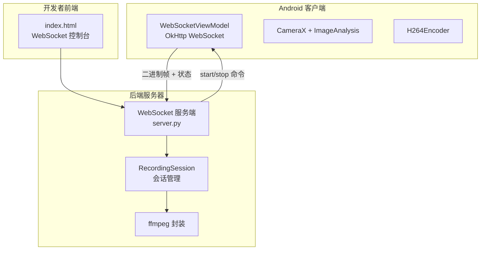
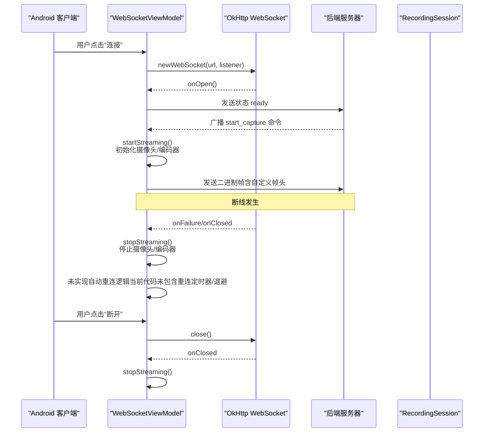
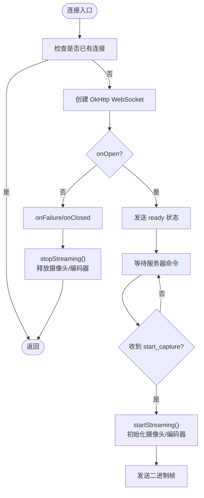
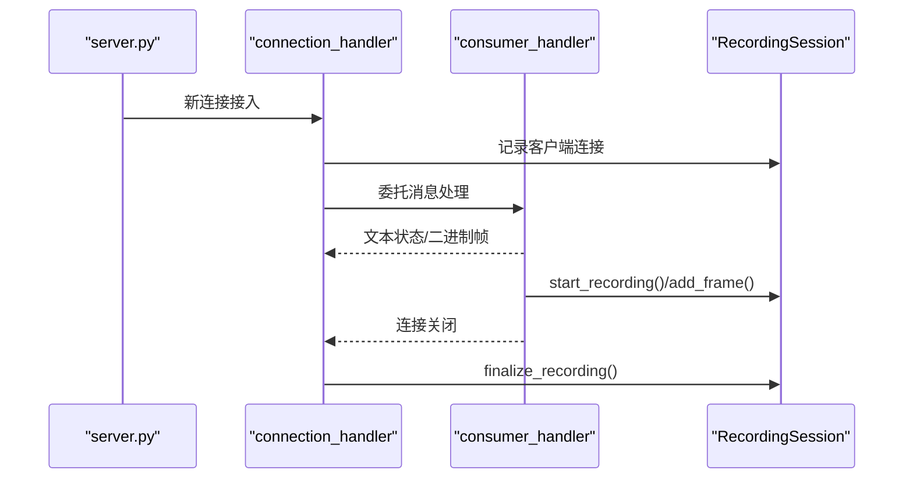
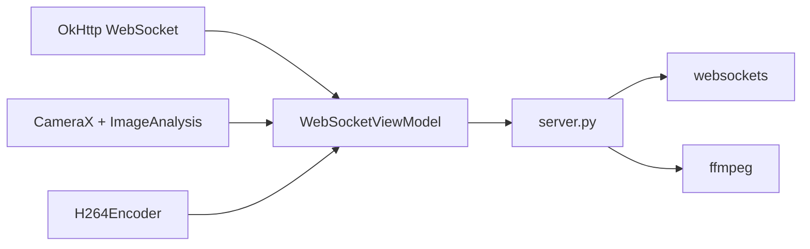

# 连接恢复策略

<cite>
**本文引用的文件**
- [android-camera/app/src/main/java/com/example/lablogcamera/MainActivity.kt](file://android-camera/app/src/main/java/com/example/lablogcamera/MainActivity.kt)
- [backend/server.py](file://backend/server.py)
- [backend/README.md](file://backend/README.md)
- [developer-frontend/index.html](file://developer-frontend/index.html)
</cite>

## 目录
1. [引言](#引言)
2. [项目结构](#项目结构)
3. [核心组件](#核心组件)
4. [架构总览](#架构总览)
5. [详细组件分析](#详细组件分析)
6. [依赖关系分析](#依赖关系分析)
7. [性能考量](#性能考量)
8. [故障排查指南](#故障排查指南)
9. [结论](#结论)
10. [附录](#附录)

## 引言
本文件围绕该项目的 WebSocket 连接恢复机制展开，结合 Android 客户端与后端服务器的行为，系统性阐述断线后的重连策略、指数退避算法、最大重试次数、条件触发、手动强制重连、以及在重连过程中对摄像头与编码器资源的状态保持策略。同时提供适用于移动网络不稳定场景的最佳实践建议与调试日志记录要点，帮助快速定位与解决连接问题。

## 项目结构
该项目包含三个主要部分：
- Android 客户端：负责摄像头采集、H.264 编码、WebSocket 推流与命令交互。
- 后端服务器：负责接收二进制帧、维护录制会话、封装 MP4、并通过终端控制命令广播给客户端。
- 开发者前端页面：提供简易的 WebSocket 控制台，便于测试与调试。

图表来源
- [android-camera/app/src/main/java/com/example/lablogcamera/MainActivity.kt](file://android-camera/app/src/main/java/com/example/lablogcamera/MainActivity.kt#L867-L900)
- [backend/server.py](file://backend/server.py#L282-L303)
- [backend/README.md](file://backend/README.md#L115-L158)

章节来源
- [android-camera/app/src/main/java/com/example/lablogcamera/MainActivity.kt](file://android-camera/app/src/main/java/com/example/lablogcamera/MainActivity.kt#L867-L900)
- [backend/server.py](file://backend/server.py#L282-L303)
- [backend/README.md](file://backend/README.md#L1-L114)

## 核心组件
- Android 端 WebSocket 管理：通过 OkHttp 的 WebSocketListener 管理连接生命周期，处理 onOpen/onFailure/onClosed/onMessage 等事件，并在 onClosed/onFailure 中将 isStreaming 置为 false，停止摄像头与编码器资源，避免重复初始化。
- 服务器端 WebSocket 处理：connection_handler/consumer_handler 负责连接接入、消息分发与会话管理；在连接关闭时调用 finalize_recording，确保录制会话正确结束。
- 开发者前端：提供连接/断开按钮与命令发送入口，便于在不稳定网络环境下验证连接与重连行为。

章节来源
- [android-camera/app/src/main/java/com/example/lablogcamera/MainActivity.kt](file://android-camera/app/src/main/java/com/example/lablogcamera/MainActivity.kt#L867-L900)
- [backend/server.py](file://backend/server.py#L282-L303)
- [developer-frontend/index.html](file://developer-frontend/index.html#L297-L569)

## 架构总览
下图展示了从 Android 客户端到后端服务器的关键交互路径，以及连接断开后的处理流程。

图表来源
- [android-camera/app/src/main/java/com/example/lablogcamera/MainActivity.kt](file://android-camera/app/src/main/java/com/example/lablogcamera/MainActivity.kt#L867-L900)
- [backend/server.py](file://backend/server.py#L282-L303)

## 详细组件分析

### Android 端连接与状态管理
- 连接建立：WebSocketViewModel.connect() 创建 OkHttp WebSocket，并注册 WebSocketListener。onOpen 时发送 ready 状态，随后发送能力上报。
- 断线处理：onFailure/onClosed 会将 isConnected/isStreaming 置为 false，并调用 stopStreaming() 停止摄像头与编码器资源，避免重复初始化。
- 命令处理：handleServerCommand() 解析 start_capture/stop_capture 命令，startStreaming() 中初始化摄像头、ImageAnalysis、H264Encoder，并按目标帧率与宽高比进行裁剪与旋转，最后发送二进制帧。
- 帧头格式：自定义帧头包含设备时间戳、帧序号与负载长度，用于后端重建时间轴与估算 FPS。

图表来源
- [android-camera/app/src/main/java/com/example/lablogcamera/MainActivity.kt](file://android-camera/app/src/main/java/com/example/lablogcamera/MainActivity.kt#L867-L900)
- [android-camera/app/src/main/java/com/example/lablogcamera/MainActivity.kt](file://android-camera/app/src/main/java/com/example/lablogcamera/MainActivity.kt#L902-L942)
- [android-camera/app/src/main/java/com/example/lablogcamera/MainActivity.kt](file://android-camera/app/src/main/java/com/example/lablogcamera/MainActivity.kt#L944-L1226)

章节来源
- [android-camera/app/src/main/java/com/example/lablogcamera/MainActivity.kt](file://android-camera/app/src/main/java/com/example/lablogcamera/MainActivity.kt#L867-L900)
- [android-camera/app/src/main/java/com/example/lablogcamera/MainActivity.kt](file://android-camera/app/src/main/java/com/example/lablogcamera/MainActivity.kt#L902-L942)
- [android-camera/app/src/main/java/com/example/lablogcamera/MainActivity.kt](file://android-camera/app/src/main/java/com/example/lablogcamera/MainActivity.kt#L944-L1226)

### 后端服务器连接与会话管理
- 连接入口：connection_handler() 将新连接加入全局集合 CONNECTED_CLIENTS，并委托 consumer_handler() 处理消息。
- 消息处理：consumer_handler() 支持文本状态消息（JSON）与二进制帧；在连接关闭时捕获 ConnectionClosed，调用 finalize_recording() 结束会话。
- 终端控制：terminal_input_handler() 通过 start/stop 命令广播给所有已连接客户端，start 命令可携带宽高比、码率与目标 FPS。

图表来源
- [backend/server.py](file://backend/server.py#L282-L303)
- [backend/server.py](file://backend/server.py#L233-L280)
- [backend/server.py](file://backend/server.py#L326-L423)

章节来源
- [backend/server.py](file://backend/server.py#L282-L303)
- [backend/server.py](file://backend/server.py#L233-L280)
- [backend/server.py](file://backend/server.py#L326-L423)

### 自动重连机制现状与建议
- 现状：Android 端 WebSocketViewModel 在 onFailure/onClosed 时会停止流与资源，但未实现自动重连定时器与指数退避逻辑。
- 建议实现（概念性设计，非现有代码）：
  - 在 onClosed/onFailure 中启动重连定时器，采用指数退避算法（例如 1s, 2s, 4s, 8s, 16s, 32s），上限不超过 60s。
  - 设置最大重试次数（例如 5 次），超过次数后停止重连并提示用户手动重连。
  - 触发条件：
    - 网络恢复：当网络状态变为可用时，立即尝试重连。
    - 服务器重启：在服务器重启后，客户端在退避间隔到期后自动重连。
    - 用户手动操作：提供“强制重连”按钮，清空计时器并立即发起连接。
  - 资源状态保持策略：
    - 重连期间不释放摄像头与编码器实例，避免重复初始化带来的抖动与延迟。
    - 重连成功后，继续发送二进制帧，保持时间戳连续性。
  - 调试日志建议：
    - 记录每次重连尝试的时间、原因（网络恢复/超时/服务器重启）、退避间隔与最终结果（成功/失败）。
    - 记录摄像头与编码器状态（是否已初始化、当前分辨率、帧率）以便排查资源泄漏或初始化异常。

章节来源
- [android-camera/app/src/main/java/com/example/lablogcamera/MainActivity.kt](file://android-camera/app/src/main/java/com/example/lablogcamera/MainActivity.kt#L867-L900)
- [android-camera/app/src/main/java/com/example/lablogcamera/MainActivity.kt](file://android-camera/app/src/main/java/com/example/lablogcamera/MainActivity.kt#L1203-L1226)

### 移动网络不稳定场景最佳实践
- 指数退避与抖动：在退避基础上增加随机抖动（Jitter），避免多个客户端同时重连造成雪崩。
- 最大退避与上限：设定最大退避时间（如 60s），超过后改为固定周期重连（如 60s），并提示用户检查网络。
- 前台/后台切换：应用进入后台时暂停重连，回到前台后根据网络状态决定是否立即重连。
- 电量与流量：在网络不佳时降低帧率或码率，减少重连压力；在 Wi-Fi 下恢复更高码率。
- 用户可见反馈：在 UI 中显示“重连中”状态与剩余重试次数，避免用户反复点击重连按钮。

## 依赖关系分析
- Android 客户端依赖 OkHttp WebSocket 与 CameraX 生态，负责网络与摄像头/编码器资源管理。
- 后端服务器依赖 websockets，负责 WebSocket 服务端与录制会话管理。
- 开发者前端提供简易控制台，便于在不稳定网络下验证连接与重连行为。

图表来源
- [android-camera/app/src/main/java/com/example/lablogcamera/MainActivity.kt](file://android-camera/app/src/main/java/com/example/lablogcamera/MainActivity.kt#L867-L900)
- [backend/server.py](file://backend/server.py#L282-L303)

章节来源
- [android-camera/app/src/main/java/com/example/lablogcamera/MainActivity.kt](file://android-camera/app/src/main/java/com/example/lablogcamera/MainActivity.kt#L867-L900)
- [backend/server.py](file://backend/server.py#L282-L303)

## 性能考量
- 指数退避会增加重连延迟，但在网络波动时能显著降低服务器压力。
- 在重连期间保持摄像头与编码器状态，可避免重复初始化带来的 CPU 与内存抖动。
- 服务器端在连接关闭时及时结束会话并生成 MP4，有助于资源回收与磁盘空间管理。

## 故障排查指南
- Android 端：
  - 检查 WebSocketListener 的 onFailure/onClosed 是否被触发，确认 stopStreaming() 是否被调用。
  - 查看日志中“连接中/已连接/错误/未连接”状态变化，定位断线时机。
  - 确认 start/stop 命令是否正确下发与接收。
- 服务器端：
  - 检查 consumer_handler 是否正确解析文本状态与二进制帧。
  - 确认 RecordingSession 的 add_frame/finalize 是否按预期执行。
  - 查看终端控制命令是否正确广播至所有客户端。

章节来源
- [android-camera/app/src/main/java/com/example/lablogcamera/MainActivity.kt](file://android-camera/app/src/main/java/com/example/lablogcamera/MainActivity.kt#L867-L900)
- [backend/server.py](file://backend/server.py#L233-L303)
- [backend/README.md](file://backend/README.md#L115-L158)

## 结论
当前代码未实现自动重连与指数退避逻辑，但具备完善的资源释放与状态上报能力。建议在 Android 端补充自动重连定时器与指数退避算法，并在重连过程中保持摄像头与编码器状态，以提升移动网络不稳定场景下的稳定性与用户体验。同时完善调试日志与用户反馈，有助于快速定位与解决问题。

## 附录
- 开发者前端页面提供连接/断开与命令发送入口，适合在弱网环境下验证连接与重连行为。
- 后端 README 详细描述了帧头格式、录制会话与终端控制命令，便于理解前后端协议与交互流程。

章节来源
- [developer-frontend/index.html](file://developer-frontend/index.html#L297-L569)
- [backend/README.md](file://backend/README.md#L1-L114)