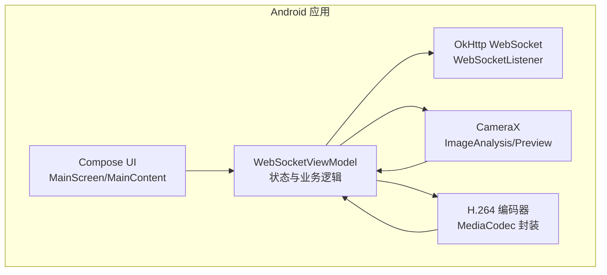
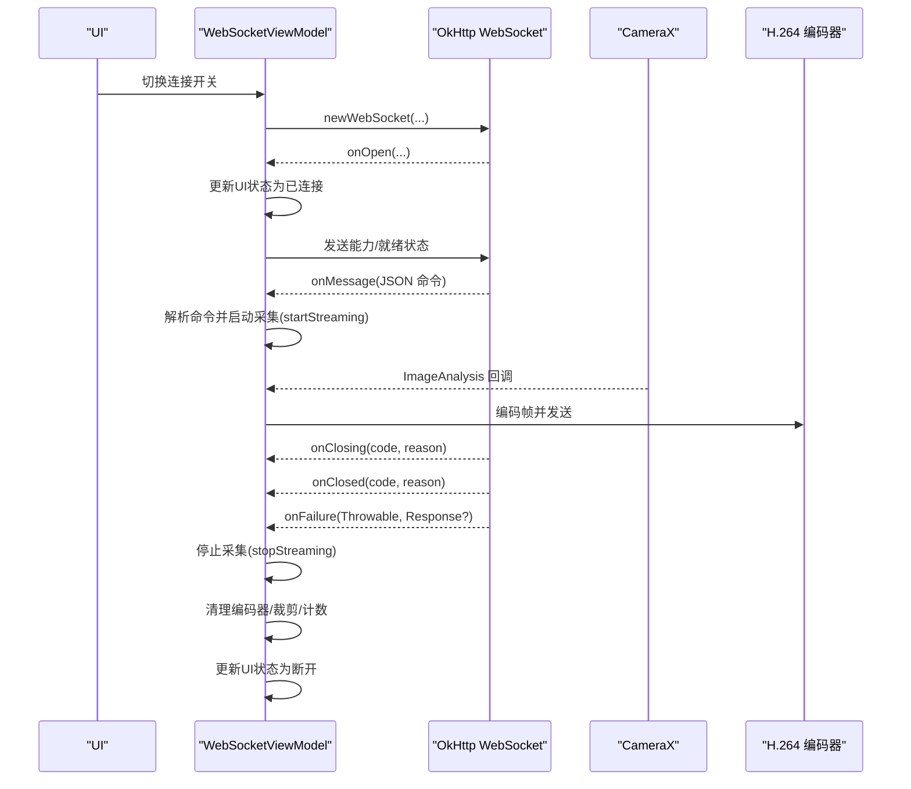
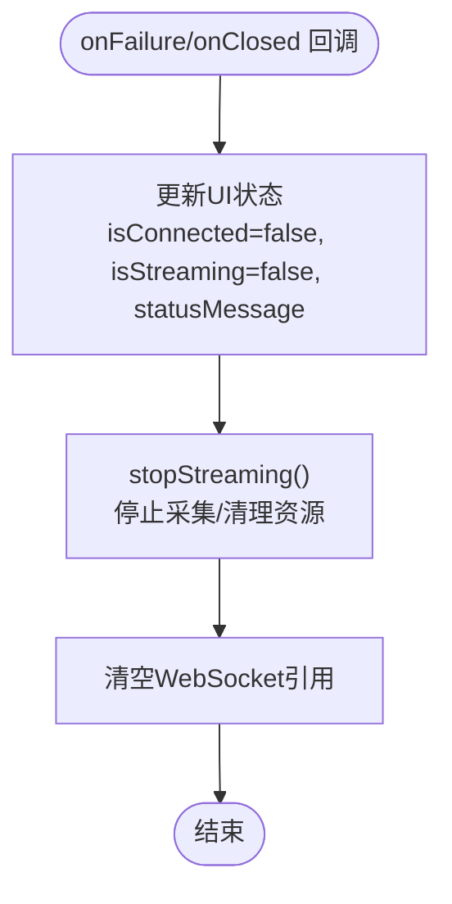
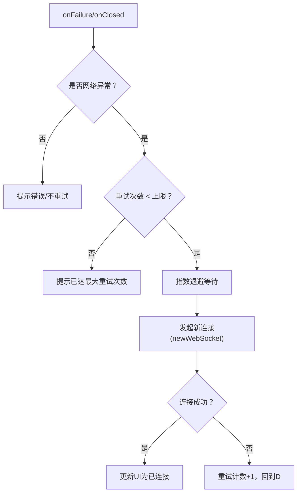
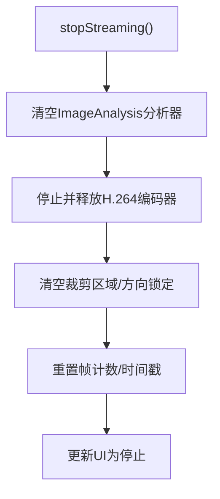
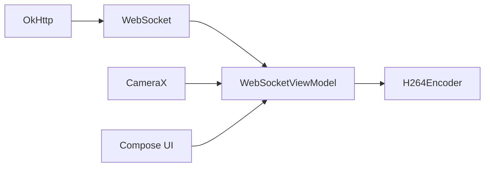

# 错误处理与健壮性

<cite>
**本文引用的文件**
- [MainActivity.kt](file://android-camera/app/src/main/java/com/example/lablogcamera/MainActivity.kt)
- [AndroidManifest.xml](file://android-camera/app/src/main/AndroidManifest.xml)
- [build.gradle.kts](file://android-camera/app/build.gradle.kts)
</cite>

## 目录
1. [引言](#引言)
2. [项目结构](#项目结构)
3. [核心组件](#核心组件)
4. [架构总览](#架构总览)
5. [详细组件分析](#详细组件分析)
6. [依赖关系分析](#依赖关系分析)
7. [性能考量](#性能考量)
8. [故障排查指南](#故障排查指南)
9. [结论](#结论)
10. [附录](#附录)

## 引言
本文件围绕Android客户端的WebSocket错误处理展开，聚焦于OkHttp WebSocketListener在onFailure与onClosed回调中的异常分类与响应策略，结合UI状态流向用户反馈错误信息，并给出连接恢复策略、资源清理逻辑、调试与监控建议。文档同时兼顾初学者与高级用户的实践需求，既提供基础的异常捕获示例路径，也展示错误分类与分级告警的架构设计思路。

## 项目结构
该项目为Android应用，采用Jetpack Compose构建UI，使用OkHttp进行WebSocket通信，CameraX进行图像采集与预览，MediaCodec进行H.264编码。关键实现集中在MainActivity.kt中，包含：
- WebSocket生命周期管理与命令处理
- UI状态流（StateFlow）驱动的错误与状态展示
- CameraX绑定与图像分析管线
- H.264编码器封装与资源释放

图表来源
- [MainActivity.kt](file://android-camera/app/src/main/java/com/example/lablogcamera/MainActivity.kt#L867-L900)
- [MainActivity.kt](file://android-camera/app/src/main/java/com/example/lablogcamera/MainActivity.kt#L1200-L1226)
- [MainActivity.kt](file://android-camera/app/src/main/java/com/example/lablogcamera/MainActivity.kt#L1670-L1676)

章节来源
- [MainActivity.kt](file://android-camera/app/src/main/java/com/example/lablogcamera/MainActivity.kt#L867-L900)
- [MainActivity.kt](file://android-camera/app/src/main/java/com/example/lablogcamera/MainActivity.kt#L1200-L1226)
- [MainActivity.kt](file://android-camera/app/src/main/java/com/example/lablogcamera/MainActivity.kt#L1670-L1676)

## 核心组件
- WebSocketViewModel：持有UI状态流，管理WebSocket连接、命令解析、编码器与CameraX绑定、状态上报与资源清理。
- WebSocketListener：在onFailure与onClosed中处理异常与关闭事件，更新UI状态并触发资源清理。
- H264Encoder：封装MediaCodec，负责编码与异常防护，提供stop释放资源。
- UI状态流：WebSocketUiState承载连接、采集、状态消息等，供Compose UI订阅展示。

章节来源
- [MainActivity.kt](file://android-camera/app/src/main/java/com/example/lablogcamera/MainActivity.kt#L554-L759)
- [MainActivity.kt](file://android-camera/app/src/main/java/com/example/lablogcamera/MainActivity.kt#L867-L900)
- [MainActivity.kt](file://android-camera/app/src/main/java/com/example/lablogcamera/MainActivity.kt#L180-L276)
- [MainActivity.kt](file://android-camera/app/src/main/java/com/example/lablogcamera/MainActivity.kt#L1670-L1676)

## 架构总览
WebSocket错误处理的关键路径如下：
- onOpen：连接成功，上报能力与就绪状态
- onMessage：解析服务器命令，启动/停止采集
- onClosing/onClosed：关闭握手与最终关闭，更新UI并停止采集
- onFailure：网络异常或协议错误，更新UI并停止采集
- stopStreaming：统一清理CameraX、编码器、状态与计数

图表来源
- [MainActivity.kt](file://android-camera/app/src/main/java/com/example/lablogcamera/MainActivity.kt#L867-L900)
- [MainActivity.kt](file://android-camera/app/src/main/java/com/example/lablogcamera/MainActivity.kt#L902-L942)
- [MainActivity.kt](file://android-camera/app/src/main/java/com/example/lablogcamera/MainActivity.kt#L944-L1200)
- [MainActivity.kt](file://android-camera/app/src/main/java/com/example/lablogcamera/MainActivity.kt#L1200-L1226)

## 详细组件分析

### WebSocketListener 错误处理与UI状态流
- onOpen：连接建立后更新UI为已连接，发送就绪状态与设备能力。
- onMessage：解析命令，启动采集或停止采集。
- onClosing：执行关闭握手，等待onClosed。
- onClosed：更新UI为断开，停止采集，清空WebSocket引用。
- onFailure：更新UI为错误状态，停止采集，清空WebSocket引用。

图表来源
- [MainActivity.kt](file://android-camera/app/src/main/java/com/example/lablogcamera/MainActivity.kt#L884-L899)
- [MainActivity.kt](file://android-camera/app/src/main/java/com/example/lablogcamera/MainActivity.kt#L1200-L1226)

章节来源
- [MainActivity.kt](file://android-camera/app/src/main/java/com/example/lablogcamera/MainActivity.kt#L867-L900)
- [MainActivity.kt](file://android-camera/app/src/main/java/com/example/lablogcamera/MainActivity.kt#L1200-L1226)

### 异常分类与识别策略
- 网络异常（IOException）：在编码器创建与运行过程中捕获，记录错误并继续流程，避免中断采集。
- 协议错误（ProtocolException）：当前代码未显式区分，但onFailure回调可统一处理。
- 服务器关闭（CloseException）：onClosed回调中处理，更新UI并清理。

建议的分类与响应：
- 网络异常（IO/网络栈错误）：降级为“网络不可达/超时”提示，触发有限次重试与退避。
- 协议错误（握手/帧格式/业务协议错误）：提示“协议错误”，引导用户检查URL与服务端版本。
- 服务器关闭（主动/被动关闭）：提示“服务器关闭”，允许用户手动重连。

章节来源
- [MainActivity.kt](file://android-camera/app/src/main/java/com/example/lablogcamera/MainActivity.kt#L211-L215)
- [MainActivity.kt](file://android-camera/app/src/main/java/com/example/lablogcamera/MainActivity.kt#L261-L264)

### 错误信息通过UI状态流传递
- WebSocketUiState包含url、isConnected、isStreaming、statusMessage等字段。
- onOpen/onFailure/onClosed均通过MutableStateFlow更新状态，UI通过collectAsState订阅展示。
- 建议在UI层根据isConnected与statusMessage呈现不同颜色与文案，增强可读性。

章节来源
- [MainActivity.kt](file://android-camera/app/src/main/java/com/example/lablogcamera/MainActivity.kt#L1670-L1676)
- [MainActivity.kt](file://android-camera/app/src/main/java/com/example/lablogcamera/MainActivity.kt#L872-L899)

### 连接恢复策略（设计建议）
当前实现未内置自动重试与退避逻辑。建议在onFailure/onClosed中引入：
- 重试次数上限（例如3次）
- 指数退避（1s、2s、4s…，上限10s）
- 用户手动重连入口（按钮触发）
- 仅在网络异常时重试，协议错误与服务器主动关闭不重试

[本图为概念性流程，不对应具体源码，故无图表来源]

### 资源清理逻辑（MediaCodec与CameraX）
- stopStreaming统一清理：
  - 清理ImageAnalysis分析器与绑定
  - 停止并释放H.264编码器
  - 清空裁剪区域与方向锁定
  - 重置帧计数与上次发送时间
  - 更新UI为“停止”
- onCleared在ViewModel销毁时调用，确保退出时彻底释放

图表来源
- [MainActivity.kt](file://android-camera/app/src/main/java/com/example/lablogcamera/MainActivity.kt#L1200-L1226)
- [MainActivity.kt](file://android-camera/app/src/main/java/com/example/lablogcamera/MainActivity.kt#L1318-L1327)

章节来源
- [MainActivity.kt](file://android-camera/app/src/main/java/com/example/lablogcamera/MainActivity.kt#L1200-L1226)
- [MainActivity.kt](file://android-camera/app/src/main/java/com/example/lablogcamera/MainActivity.kt#L1318-L1327)

### 调试工具与监控建议
- 日志记录：使用Log.d/w/e/i记录关键事件与错误，便于定位问题。
- 错误码定义：为不同异常场景定义错误码（如网络异常=1001，协议错误=1002，服务器关闭=1003），在上报时携带。
- 远程监控：在onFailure/onClosed中收集错误上下文（URL、设备型号、SDK版本、当前状态），上报至遥测平台。
- 前端对比：前端页面同样具备onerror/onclose处理，可与移动端形成对照，便于联调。

章节来源
- [MainActivity.kt](file://android-camera/app/src/main/java/com/example/lablogcamera/MainActivity.kt#L872-L899)
- [archive/20251117_arduino_send_images_to_backend_and_frontend/developer-frontend/index.html](file://archive/20251117_arduino_send_images_to_backend_and_frontend/developer-frontend/index.html#L356-L377)

## 依赖关系分析
- OkHttp：提供WebSocket客户端与WebSocketListener回调。
- CameraX：提供ImageAnalysis与Preview，与ViewModel协作完成采集与预览。
- MediaCodec：提供H.264编码能力，封装为H264Encoder。
- Compose：UI层订阅StateFlow，展示连接状态与采集信息。

图表来源
- [build.gradle.kts](file://android-camera/app/build.gradle.kts#L44-L68)
- [MainActivity.kt](file://android-camera/app/src/main/java/com/example/lablogcamera/MainActivity.kt#L867-L900)

章节来源
- [build.gradle.kts](file://android-camera/app/build.gradle.kts#L44-L68)

## 性能考量
- 帧率控制：通过shouldSendFrame按目标FPS主动丢帧，避免网络拥塞与编码压力。
- 编码器对齐：裁剪与对齐（32/偶数）减少硬件编码器兼容性问题。
- 旋转与裁剪：在编码前完成旋转与裁剪，避免重复处理。
- UI刷新：仅在必要时更新UI状态，避免频繁重组。

章节来源
- [MainActivity.kt](file://android-camera/app/src/main/java/com/example/lablogcamera/MainActivity.kt#L1299-L1341)
- [MainActivity.kt](file://android-camera/app/src/main/java/com/example/lablogcamera/MainActivity.kt#L1347-L1448)

## 故障排查指南
- 网络不可达/超时：检查URL、防火墙、证书与网络环境；观察onFailure回调与日志。
- 协议错误：确认URL与服务端版本兼容；关注onMessage解析异常与状态上报。
- 服务器主动关闭：检查服务端关闭原因；观察onClosed回调与UI状态。
- 编码器异常：关注H264Encoder创建与运行期异常；必要时降低分辨率或码率。
- CameraX绑定失败：检查权限与设备特性；查看Use case绑定异常日志。

章节来源
- [MainActivity.kt](file://android-camera/app/src/main/java/com/example/lablogcamera/MainActivity.kt#L211-L215)
- [MainActivity.kt](file://android-camera/app/src/main/java/com/example/lablogcamera/MainActivity.kt#L261-L264)
- [MainActivity.kt](file://android-camera/app/src/main/java/com/example/lablogcamera/MainActivity.kt#L2088-L2091)

## 结论
本项目在WebSocket层面提供了基础的连接管理与错误处理：onFailure与onClosed统一更新UI并清理资源，onOpen与onMessage支撑完整的工作流。为进一步提升健壮性，建议补充自动重试与退避、错误码分级与远程监控、以及针对网络异常、协议错误与服务器关闭的差异化响应策略。同时，完善日志与状态上报有助于快速定位问题并优化用户体验。

## 附录
- 权限与网络配置：应用声明相机与网络权限，并配置网络安全策略。
- 依赖清单：OkHttp、CameraX、Compose等关键依赖均已引入。

章节来源
- [AndroidManifest.xml](file://android-camera/app/src/main/AndroidManifest.xml#L1-L32)
- [build.gradle.kts](file://android-camera/app/build.gradle.kts#L44-L68)