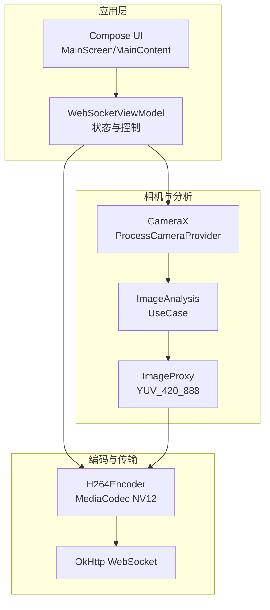
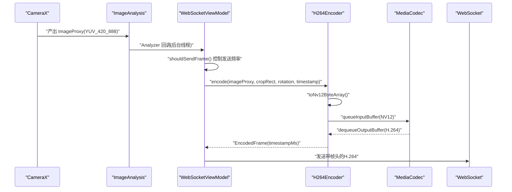
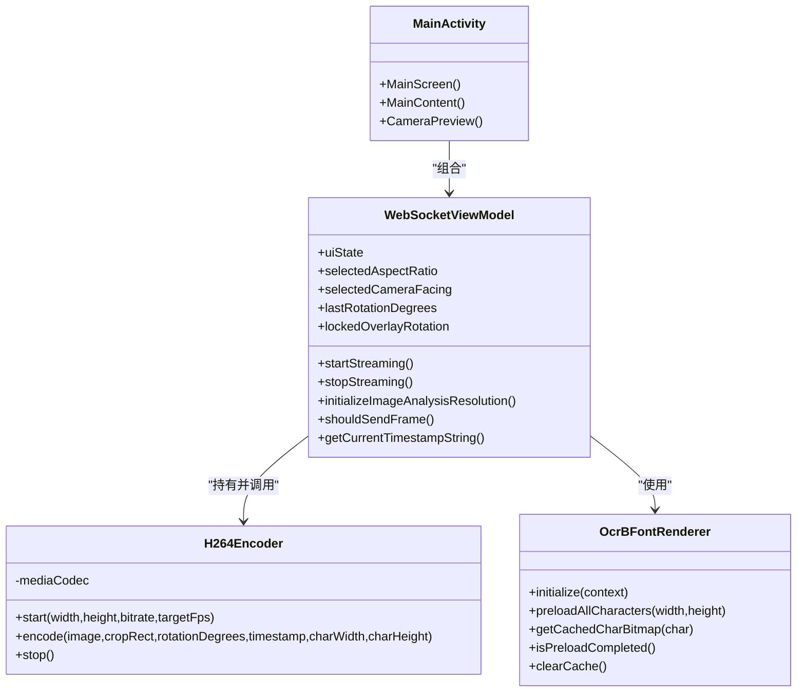

# 图像分析处理

<cite>
**本文引用的文件**
- [MainActivity.kt](file://android-camera/app/src/main/java/com/example/lablogcamera/MainActivity.kt)
- [README.md](file://android-camera/README.md)
- [AndroidManifest.xml](file://android-camera/app/src/main/AndroidManifest.xml)
- [build.gradle.kts](file://android-camera/app/build.gradle.kts)
</cite>

## 目录
1. [简介](#简介)
2. [项目结构](#项目结构)
3. [核心组件](#核心组件)
4. [架构总览](#架构总览)
5. [详细组件分析](#详细组件分析)
6. [依赖关系分析](#依赖关系分析)
7. [性能考量](#性能考量)
8. [故障排查指南](#故障排查指南)
9. [结论](#结论)
10. [附录](#附录)

## 简介
本文件围绕 Android 客户端的图像分析处理展开，重点讲解如何使用 CameraX 的 ImageAnalysis UseCase 进行实时帧处理，涵盖：
- 分析频率控制（setAnalyzer）
- 线程调度配置
- 图像格式（YUV_420_888）解析与 NV12 转换
- ImageProxy 的使用与数据提取
- 与 H.264 编码器的集成流程
- 通过 Analyzer 获取每帧旋转信息与时间戳，并传递给编码与水印模块
- 高帧率分析下的性能优化策略（跳帧机制、后台线程处理）
- 常见问题与调试技巧（内存泄漏、帧处理延迟、图像格式不兼容）

## 项目结构
android-camera/app 模块采用 Kotlin + Jetpack Compose UI，核心逻辑集中在 MainActivity.kt 中，配合 CameraX、MediaCodec、OkHttp WebSocket 实现移动端视频采集、编码与推流。

图表来源
- [MainActivity.kt](file://android-camera/app/src/main/java/com/example/lablogcamera/MainActivity.kt#L800-L1200)
- [MainActivity.kt](file://android-camera/app/src/main/java/com/example/lablogcamera/MainActivity.kt#L1450-L1660)
- [build.gradle.kts](file://android-camera/app/build.gradle.kts#L44-L68)

章节来源
- [build.gradle.kts](file://android-camera/app/build.gradle.kts#L44-L68)
- [AndroidManifest.xml](file://android-camera/app/src/main/AndroidManifest.xml#L1-L32)

## 核心组件
- WebSocketViewModel：负责 WebSocket 生命周期、UI 状态、相机与分析控制、帧率控制、能力上报、编码器生命周期管理。
- H264Encoder：封装 MediaCodec，接收 ImageProxy，转换为 NV12，送入编码器，输出 EncodedFrame。
- ImageProxy.toNv12ByteArray 扩展函数：将 YUV_420_888 三平面数据转换为 NV12，支持旋转与水印绘制。
- OcrBFontRenderer：OCR-B 字体渲染器，预加载字符位图，用于时间戳水印。
- MainScreen/MainContent：Compose UI，提供摄像头/宽高比选择、连接开关、预览与裁剪框叠加。

章节来源
- [MainActivity.kt](file://android-camera/app/src/main/java/com/example/lablogcamera/MainActivity.kt#L180-L276)
- [MainActivity.kt](file://android-camera/app/src/main/java/com/example/lablogcamera/MainActivity.kt#L1450-L1660)
- [MainActivity.kt](file://android-camera/app/src/main/java/com/example/lablogcamera/MainActivity.kt#L299-L459)
- [MainActivity.kt](file://android-camera/app/src/main/java/com/example/lablogcamera/MainActivity.kt#L1670-L1991)

## 架构总览
移动端以 CameraX 采集 YUV_420_888 帧，Analyzer 在后台线程中进行跳帧与裁剪，将 NV12 数据送入 MediaCodec 编码为 H.264，通过 WebSocket 以自定义二进制帧头发送给后端。后端直接封装为 MP4，无需再次旋转。

图表来源
- [MainActivity.kt](file://android-camera/app/src/main/java/com/example/lablogcamera/MainActivity.kt#L1020-L1190)
- [MainActivity.kt](file://android-camera/app/src/main/java/com/example/lablogcamera/MainActivity.kt#L180-L276)
- [MainActivity.kt](file://android-camera/app/src/main/java/com/example/lablogcamera/MainActivity.kt#L1450-L1660)

## 详细组件分析

### ImageAnalysis UseCase 与 Analyzer
- 设置目标分辨率与回压策略：使用硬件支持的最大 YUV_420_888 分辨率，固定 targetRotation 为 0，回压策略为仅保留最新帧，避免积压。
- Analyzer 线程：通过单线程执行器在后台线程处理，避免阻塞主线程。
- 首帧初始化：在开始录制前，先获取实际分辨率并缓存，用于上报与后续裁剪。
- 旋转与裁剪：根据设备物理方向与摄像头类型计算旋转角度，结合目标宽高比生成裁剪区域，确保尺寸满足编码器对齐要求（32 对齐、偶数）。
- 跳帧控制：根据服务器下发的目标帧率，使用时间间隔控制发送频率，多余帧丢弃并统计丢帧数。

章节来源
- [MainActivity.kt](file://android-camera/app/src/main/java/com/example/lablogcamera/MainActivity.kt#L815-L865)
- [MainActivity.kt](file://android-camera/app/src/main/java/com/example/lablogcamera/MainActivity.kt#L944-L1190)
- [MainActivity.kt](file://android-camera/app/src/main/java/com/example/lablogcamera/MainActivity.kt#L1328-L1341)

### ImageProxy 与 YUV_420_888 解析
- 三平面布局：Y 平面 + U 平面 + V 平面，像素步幅与行步幅不同，需按行复制。
- 裁剪与对齐：裁剪区域坐标与尺寸必须为偶数，且宽度/高度为 32 的倍数，避免硬件编码器对齐问题。
- 旋转与裁剪：支持 0/90/180/270 度旋转，先旋转再裁剪，或可优化为先裁剪再旋转以降低 CPU 开销。
- 水印：在 Y 平面绘制黑色背景与白色文字，使用 OCR-B 字体缓存位图。

章节来源
- [MainActivity.kt](file://android-camera/app/src/main/java/com/example/lablogcamera/MainActivity.kt#L1450-L1660)
- [MainActivity.kt](file://android-camera/app/src/main/java/com/example/lablogcamera/MainActivity.kt#L461-L551)

### H.264 编码器集成
- 颜色格式：配置为 NV12（半平面 YUV），与 toNv12ByteArray 输出一致。
- 输入缓冲：检查容量，避免 BufferOverflow；队列输入缓冲并设置时间戳。
- 输出处理：循环出队，提取编码数据与时间戳，回调 EncodedFrame。
- 生命周期：start()/stop() 安全释放 MediaCodec，避免资源泄漏。

章节来源
- [MainActivity.kt](file://android-camera/app/src/main/java/com/example/lablogcamera/MainActivity.kt#L180-L276)

### 时间戳与旋转信息传递
- 旋转信息：从 ImageProxy.imageInfo.rotationDegrees 获取，结合设备物理方向与摄像头类型计算后端所需旋转值。
- 时间戳：每秒缓存一次 "Time: hh:mm:ss" 字符串，避免频繁格式化。
- 水印：将时间戳绘制到 NV12 Y 平面，支持两种字符尺寸模式。

章节来源
- [MainActivity.kt](file://android-camera/app/src/main/java/com/example/lablogcamera/MainActivity.kt#L553-L793)
- [MainActivity.kt](file://android-camera/app/src/main/java/com/example/lablogcamera/MainActivity.kt#L794-L814)
- [MainActivity.kt](file://android-camera/app/src/main/java/com/example/lablogcamera/MainActivity.kt#L299-L459)

### 跳帧机制与后台线程处理
- 跳帧策略：根据目标帧率计算最小时间间隔，超过阈值才发送，多余帧丢弃并计数。
- 后台线程：Analyzer 在单线程执行器中运行，避免阻塞 UI；编码与网络发送均在 IO 协程中进行。
- 资源释放：Analyzer 回调中统一关闭 ImageProxy，停止录制时清空 Analyzer 并解除绑定，防止阻塞。

章节来源
- [MainActivity.kt](file://android-camera/app/src/main/java/com/example/lablogcamera/MainActivity.kt#L1328-L1341)
- [MainActivity.kt](file://android-camera/app/src/main/java/com/example/lablogcamera/MainActivity.kt#L1170-L1182)
- [MainActivity.kt](file://android-camera/app/src/main/java/com/example/lablogcamera/MainActivity.kt#L1203-L1226)

### 类关系图（代码级）

图表来源
- [MainActivity.kt](file://android-camera/app/src/main/java/com/example/lablogcamera/MainActivity.kt#L553-L793)
- [MainActivity.kt](file://android-camera/app/src/main/java/com/example/lablogcamera/MainActivity.kt#L180-L276)
- [MainActivity.kt](file://android-camera/app/src/main/java/com/example/lablogcamera/MainActivity.kt#L299-L459)
- [MainActivity.kt](file://android-camera/app/src/main/java/com/example/lablogcamera/MainActivity.kt#L1670-L1991)

## 依赖关系分析
- CameraX：camera-core/camera-camera2/camera-lifecycle/camera-view
- Jetpack Compose：material3/runtime/ui
- OkHttp：websocket 客户端
- MediaCodec：H.264 硬件编码

章节来源
- [build.gradle.kts](file://android-camera/app/build.gradle.kts#L44-L68)

## 性能考量
- 跳帧控制：通过最小时间间隔限制发送频率，避免网络与编码压力过大。
- 对齐策略：严格保证裁剪尺寸为 32 的倍数且为偶数，避免硬件编码器对齐问题导致的条纹/绿带。
- 旋转优化：当前实现先旋转整帧再裁剪，存在 CPU 密集开销；建议改为先裁剪再旋转，减少像素处理量。
- 并行化：可考虑并行处理 Y/UV 平面或使用协程池，进一步降低 CPU 占用。
- GPU 加速：如需极致性能，可考虑 OpenGL ES 或 NDK 原生旋转。

章节来源
- [README.md](file://android-camera/README.md#L505-L562)
- [MainActivity.kt](file://android-camera/app/src/main/java/com/example/lablogcamera/MainActivity.kt#L1328-L1341)
- [MainActivity.kt](file://android-camera/app/src/main/java/com/example/lablogcamera/MainActivity.kt#L1450-L1660)

## 故障排查指南
- 内存泄漏
  - 现象：持续录制后内存增长。
  - 排查：确认 Analyzer 回调中是否调用 imageProxy.close()；停止录制时是否 clearAnalyzer() 与解除绑定。
  - 参考路径：[MainActivity.kt](file://android-camera/app/src/main/java/com/example/lablogcamera/MainActivity.kt#L1179-L1182)、[MainActivity.kt](file://android-camera/app/src/main/java/com/example/lablogcamera/MainActivity.kt#L1207-L1210)
- 帧处理延迟
  - 现象：UI 卡顿或帧率骤降。
  - 排查：检查 Analyzer 是否在主线程执行；确认是否启用 STRATEGY_KEEP_ONLY_LATEST；观察跳帧日志。
  - 参考路径：[MainActivity.kt](file://android-camera/app/src/main/java/com/example/lablogcamera/MainActivity.kt#L1012-L1016)、[MainActivity.kt](file://android-camera/app/src/main/java/com/example/lablogcamera/MainActivity.kt#L1328-L1341)
- 图像格式不兼容
  - 现象：出现条纹/绿带。
  - 排查：确认裁剪尺寸是否满足 32 对齐与偶数；确认颜色格式为 NV12；确认 U/V 顺序正确。
  - 参考路径：[README.md](file://android-camera/README.md#L419-L504)、[MainActivity.kt](file://android-camera/app/src/main/java/com/example/lablogcamera/MainActivity.kt#L1450-L1660)
- 旋转方向异常
  - 现象：视频方向不正确。
  - 排查：使用设备物理方向计算 rotation，区分前后置摄像头；确保在 Android 端完成旋转，后端无需再旋转。
  - 参考路径：[MainActivity.kt](file://android-camera/app/src/main/java/com/example/lablogcamera/MainActivity.kt#L794-L814)、[README.md](file://android-camera/README.md#L354-L418)
- 日志与性能监控
  - 建议：在关键路径增加日志（分辨率、裁剪区域、编码器输入/输出、帧率估算），结合 droppedFrames 统计评估跳帧效果。
  - 参考路径：[MainActivity.kt](file://android-camera/app/src/main/java/com/example/lablogcamera/MainActivity.kt#L200-L276)

## 结论
本项目通过 CameraX 的 ImageAnalysis 与 Analyzer 实现高可靠、可控制的实时帧处理，结合 NV12 转换与 MediaCodec 编码，形成稳定的移动端 H.264 推流链路。通过跳帧机制与严格的对齐策略，有效规避了硬件编码器的兼容性问题；通过设备物理方向计算与 Android 端旋转，确保后端无需二次旋转，提升整体效率。未来可在旋转路径与并行化方面进一步优化，以满足更高帧率需求。

## 附录
- 关键 API 与路径
  - ImageAnalysis 配置与 Analyzer：[MainActivity.kt](file://android-camera/app/src/main/java/com/example/lablogcamera/MainActivity.kt#L1012-L1016)
  - 跳帧控制：[MainActivity.kt](file://android-camera/app/src/main/java/com/example/lablogcamera/MainActivity.kt#L1328-L1341)
  - NV12 转换与旋转：[MainActivity.kt](file://android-camera/app/src/main/java/com/example/lablogcamera/MainActivity.kt#L1450-L1660)
  - 编码器生命周期：[MainActivity.kt](file://android-camera/app/src/main/java/com/example/lablogcamera/MainActivity.kt#L180-L276)
  - 能力上报与分辨率查询：[MainActivity.kt](file://android-camera/app/src/main/java/com/example/lablogcamera/MainActivity.kt#L1244-L1316)