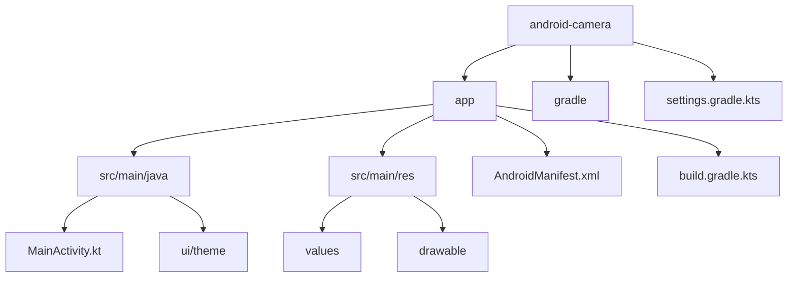
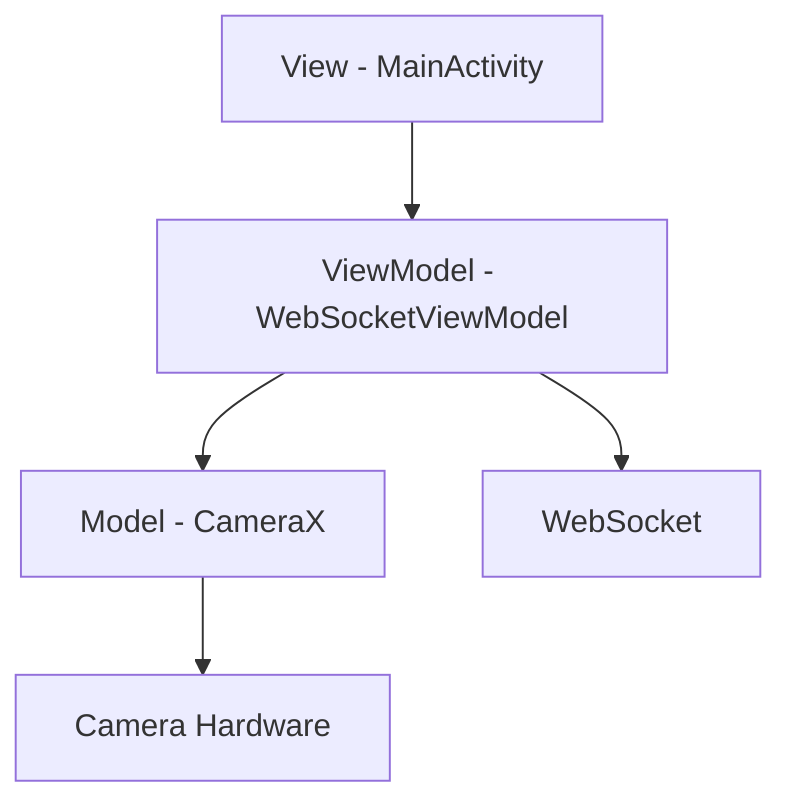
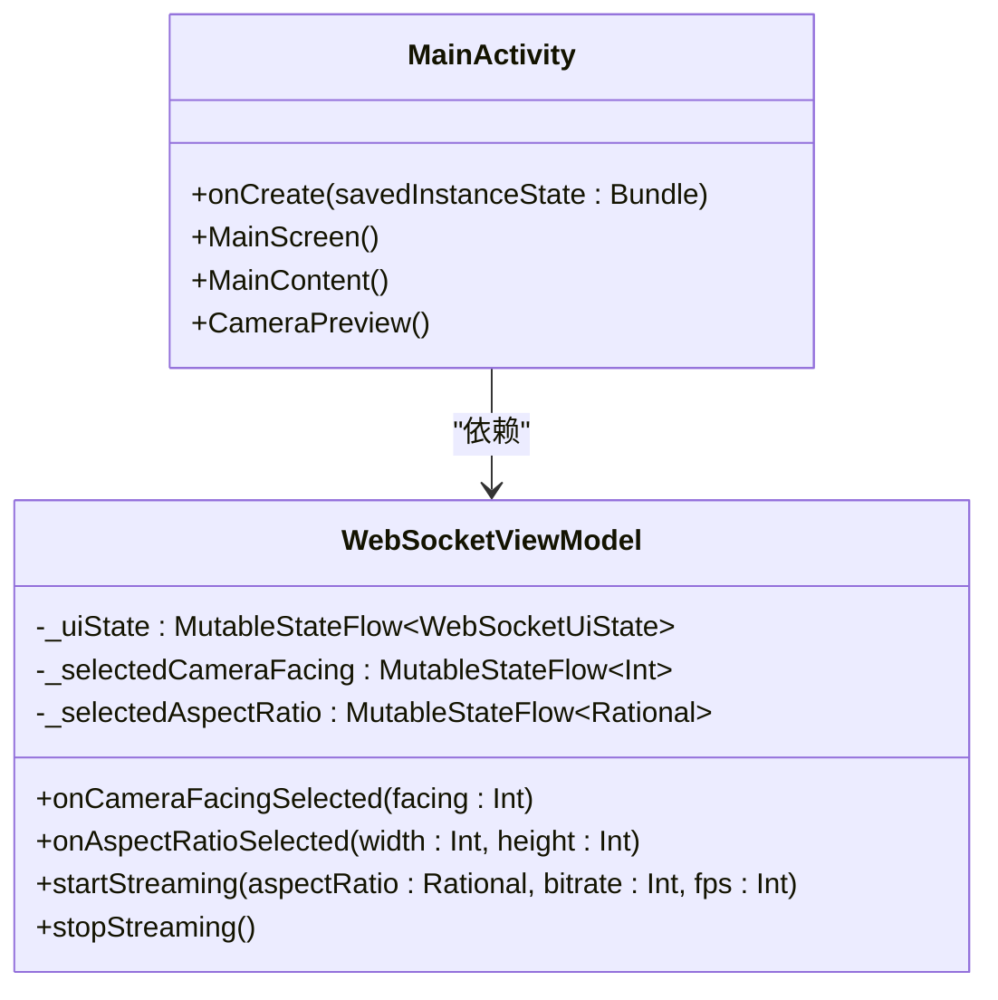
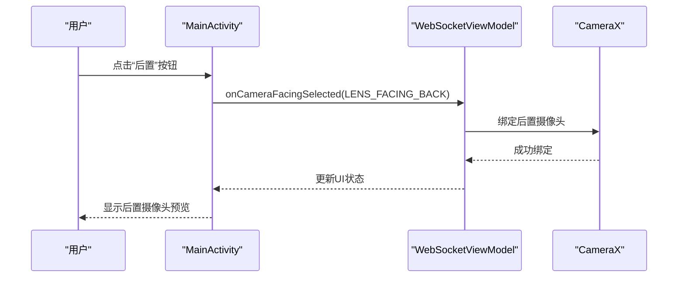
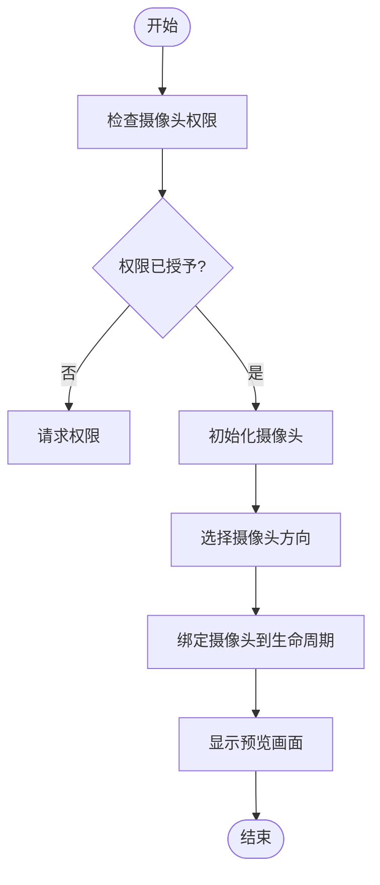
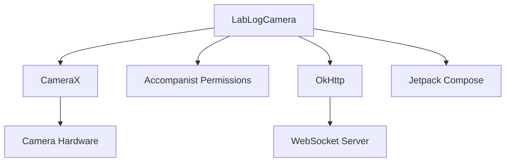

# 摄像头选择

<cite>
**本文档引用的文件**   
- [MainActivity.kt](file://android-camera/app/src/main/java/com/example/lablogcamera/MainActivity.kt)
- [AndroidManifest.xml](file://android-camera/app/src/main/AndroidManifest.xml)
- [build.gradle.kts](file://android-camera/app/build.gradle.kts)
</cite>

## 目录
1. [简介](#简介)
2. [项目结构](#项目结构)
3. [核心组件](#核心组件)
4. [架构概述](#架构概述)
5. [详细组件分析](#详细组件分析)
6. [依赖分析](#依赖分析)
7. [性能考虑](#性能考虑)
8. [故障排除指南](#故障排除指南)
9. [结论](#结论)

## 简介
本文档详细探讨了Android客户端中使用CameraX进行摄像头选择的实现机制。重点分析了如何使用`CameraSelector`来选择前后置摄像头，以及如何通过`CameraCharacteristics.LENS_FACING_BACK`和`LENS_FACING_FRONT`来管理摄像头方向。文档还深入解析了`ViewModel`中`selectedCameraFacing`状态的管理机制及其与UI的联动逻辑，提供了运行时切换摄像头的代码示例，并讨论了设备不支持特定摄像头方向时的容错处理策略。此外，文档还涵盖了摄像头权限管理、设备无前置摄像头、摄像头被占用等常见问题的解决方案，为初学者和高级开发者提供了全面的指导。

## 项目结构
本项目采用典型的Android应用结构，主要包含以下目录和文件：
- `android-camera/`：主应用模块
  - `app/src/main/java/`：Kotlin源代码，包含`MainActivity.kt`和UI主题相关文件
  - `app/src/main/res/`：资源文件，包括布局、值和可绘制资源
  - `app/src/main/AndroidManifest.xml`：应用清单文件，声明了摄像头和互联网权限
  - `app/build.gradle.kts`：构建脚本，定义了应用的依赖和配置
- `gradle/`：Gradle构建工具配置
- `settings.gradle.kts`：项目设置文件，包含模块配置

该结构遵循现代Android开发的最佳实践，使用Kotlin和Jetpack Compose进行UI开发，同时集成了CameraX库来处理摄像头功能。

**Diagram sources**
- [MainActivity.kt](file://android-camera/app/src/main/java/com/example/lablogcamera/MainActivity.kt)
- [AndroidManifest.xml](file://android-camera/app/src/main/AndroidManifest.xml)
- [build.gradle.kts](file://android-camera/app/build.gradle.kts)

**Section sources**
- [MainActivity.kt](file://android-camera/app/src/main/java/com/example/lablogcamera/MainActivity.kt)
- [AndroidManifest.xml](file://android-camera/app/src/main/AndroidManifest.xml)
- [build.gradle.kts](file://android-camera/app/build.gradle.kts)

## 核心组件
本项目的核心组件包括`MainActivity`、`WebSocketViewModel`和`CameraPreview`。`MainActivity`负责UI的构建和用户交互，`WebSocketViewModel`管理摄像头状态和WebSocket通信，`CameraPreview`则负责显示摄像头预览画面。这些组件通过Jetpack Compose的`ViewModel`和`StateFlow`机制紧密协作，实现了摄像头选择和预览的功能。

**Section sources**
- [MainActivity.kt](file://android-camera/app/src/main/java/com/example/lablogcamera/MainActivity.kt)

## 架构概述
应用的架构基于MVVM（Model-View-ViewModel）模式，使用Jetpack Compose进行UI构建。`MainActivity`作为View层，负责展示UI和处理用户输入；`WebSocketViewModel`作为ViewModel层，管理应用状态和业务逻辑；CameraX库作为Model层，提供摄像头硬件的抽象接口。这种分层架构使得代码更加模块化和可维护。

**Diagram sources**
- [MainActivity.kt](file://android-camera/app/src/main/java/com/example/lablogcamera/MainActivity.kt)

## 详细组件分析

### MainActivity分析
`MainActivity`是应用的入口点，负责初始化UI和绑定`ViewModel`。它使用Jetpack Compose的`Scaffold`和`Column`等组件构建了一个响应式的用户界面，包含了摄像头预览、摄像头选择按钮、宽高比选择和WebSocket连接状态显示等功能。

#### 对象导向组件

**Diagram sources**
- [MainActivity.kt](file://android-camera/app/src/main/java/com/example/lablogcamera/MainActivity.kt)

#### API/服务组件

**Diagram sources**
- [MainActivity.kt](file://android-camera/app/src/main/java/com/example/lablogcamera/MainActivity.kt)

### 复杂逻辑组件

**Diagram sources**
- [MainActivity.kt](file://android-camera/app/src/main/java/com/example/lablogcamera/MainActivity.kt)

**Section sources**
- [MainActivity.kt](file://android-camera/app/src/main/java/com/example/lablogcamera/MainActivity.kt)

## 依赖分析
项目依赖于多个Android库和第三方库，主要包括：
- `androidx.camera:camera-core`, `camera-camera2`, `camera-lifecycle`, `camera-view`：CameraX库，用于摄像头功能
- `com.google.accompanist:accompanist-permissions`：权限管理库
- `com.squareup.okhttp3:okhttp`：网络通信库，用于WebSocket连接
- `androidx.lifecycle:lifecycle-viewmodel-compose`：ViewModel和Compose集成库

这些依赖通过`build.gradle.kts`文件中的`libs.versions.toml`进行版本管理，确保了依赖的一致性和可维护性。

**Diagram sources**
- [build.gradle.kts](file://android-camera/app/build.gradle.kts)

**Section sources**
- [build.gradle.kts](file://android-camera/app/build.gradle.kts)

## 性能考虑
在摄像头应用中，性能是一个关键因素。本项目通过以下方式优化性能：
- 使用`ImageAnalysis.STRATEGY_KEEP_ONLY_LATEST`策略，确保只处理最新的图像帧，避免帧堆积
- 在`H264Encoder`中使用`MediaCodec`进行硬件编码，提高编码效率
- 通过`shouldSendFrame`方法控制帧率，避免不必要的帧处理
- 使用`Dispatchers.IO`和`Dispatchers.Main`进行线程切换，确保UI线程不被阻塞

这些优化措施确保了应用在高分辨率视频流处理时的流畅性和稳定性。

## 故障排除指南
在开发和使用摄像头应用时，可能会遇到以下常见问题：

### 摄像头权限缺失
如果应用没有获得摄像头权限，将无法访问摄像头硬件。解决方案是检查`AndroidManifest.xml`中是否声明了`CAMERA`权限，并在运行时请求权限。

**Section sources**
- [AndroidManifest.xml](file://android-camera/app/src/main/AndroidManifest.xml)
- [MainActivity.kt](file://android-camera/app/src/main/java/com/example/lablogcamera/MainActivity.kt)

### 设备无前置摄像头
并非所有设备都配备前置摄像头。在切换到前置摄像头时，应检查设备是否支持，如果不支持则禁用前置摄像头按钮。

**Section sources**
- [MainActivity.kt](file://android-camera/app/src/main/java/com/example/lablogcamera/MainActivity.kt)

### 摄像头被占用
如果摄像头被其他应用占用，当前应用将无法访问。建议在应用前后台切换时正确管理摄像头的绑定和解绑。

**Section sources**
- [MainActivity.kt](file://android-camera/app/src/main/java/com/example/lablogcamera/MainActivity.kt)

## 结论
本文档详细分析了Android客户端中摄像头选择的实现机制，涵盖了从权限管理到摄像头切换的各个方面。通过使用CameraX和Jetpack Compose，开发者可以轻松实现功能丰富且性能优良的摄像头应用。文档提供的代码示例和故障排除指南为开发者提供了实用的参考，有助于快速解决开发过程中遇到的问题。