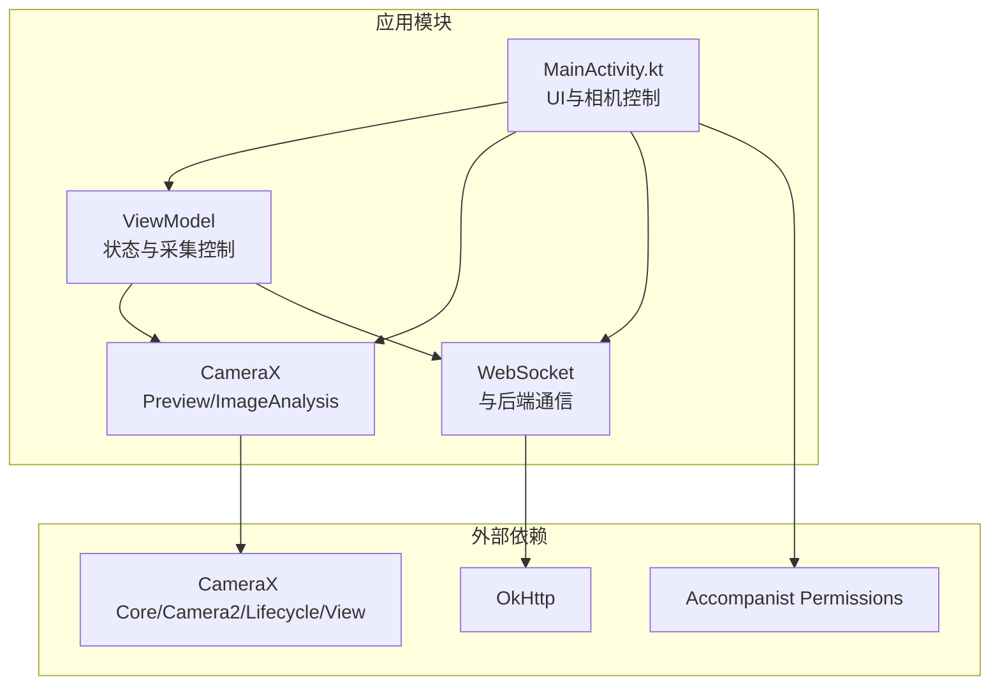
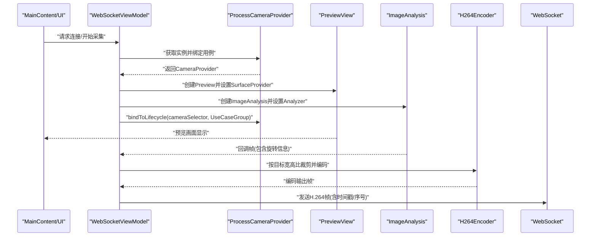
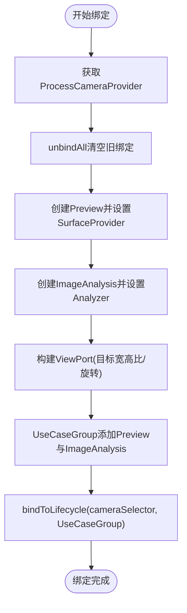
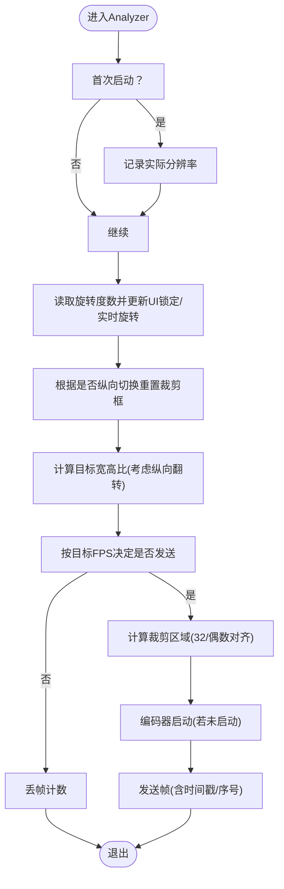
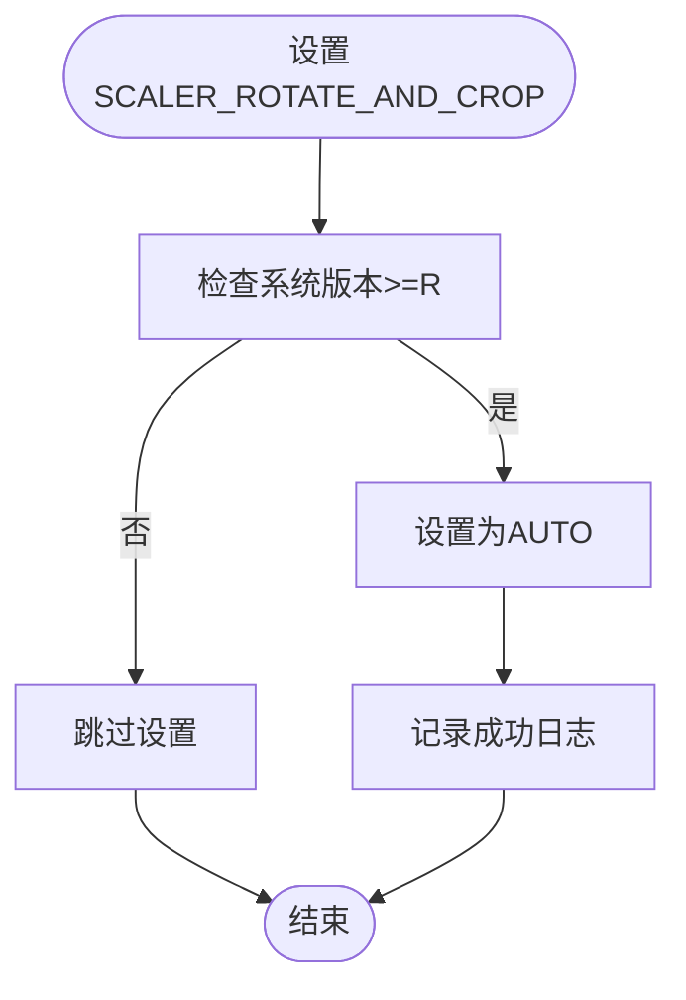
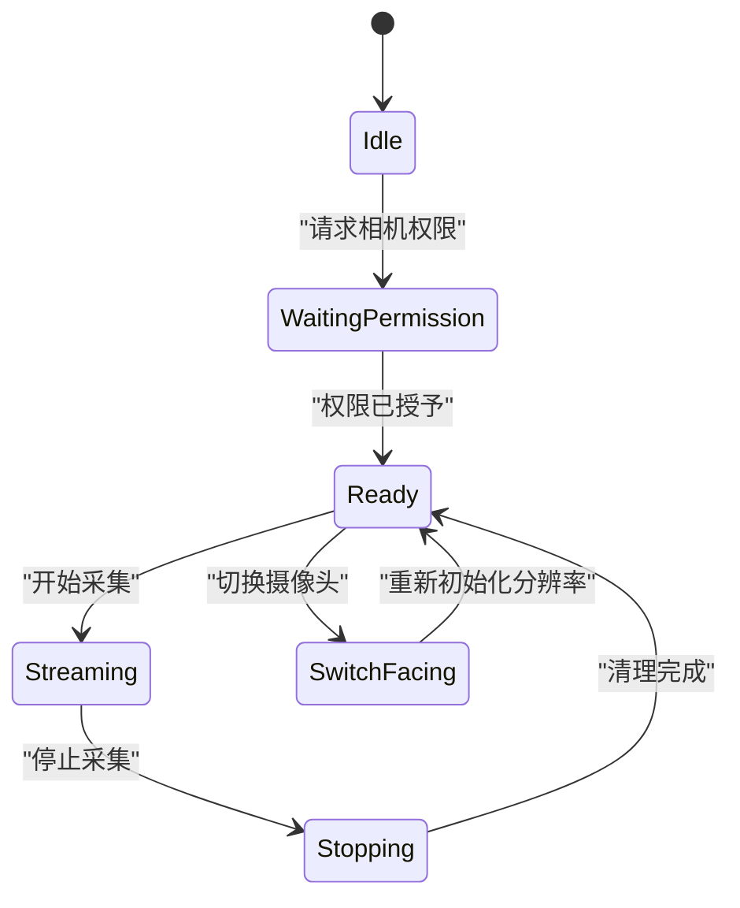
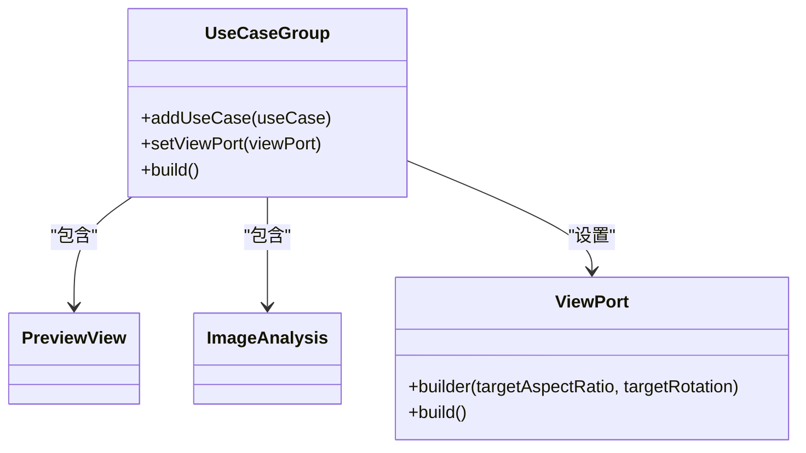
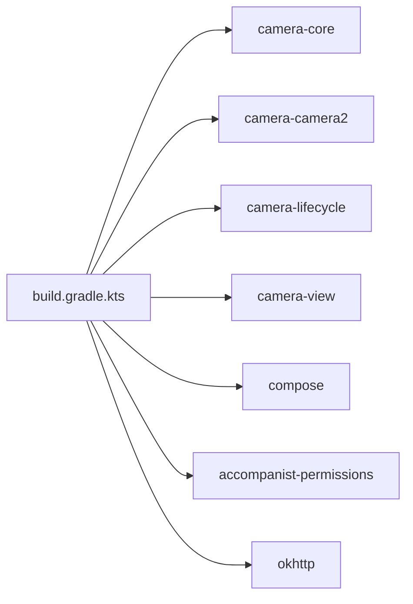

# 摄像头预览与采集

<cite>
**本文引用的文件**
- [MainActivity.kt](file://android-camera/app/src/main/java/com/example/lablogcamera/MainActivity.kt)
- [AndroidManifest.xml](file://android-camera/app/src/main/AndroidManifest.xml)
- [build.gradle.kts](file://android-camera/app/build.gradle.kts)
- [libs.versions.toml](file://android-camera/gradle/libs.versions.toml)
- [settings.gradle.kts](file://android-camera/settings.gradle.kts)
</cite>

## 目录
1. [简介](#简介)
2. [项目结构](#项目结构)
3. [核心组件](#核心组件)
4. [架构总览](#架构总览)
5. [详细组件分析](#详细组件分析)
6. [依赖关系分析](#依赖关系分析)
7. [性能考量](#性能考量)
8. [故障排查指南](#故障排查指南)
9. [结论](#结论)
10. [附录](#附录)

## 简介
本文件面向Android客户端摄像头预览与采集场景，围绕CameraX API展开，重点说明以下内容：
- 如何使用CameraSelector选择前后置摄像头
- 如何使用PreviewView显示预览画面
- 如何使用ImageAnalysis进行帧分析处理
- 如何通过Camera2Interop扩展配置SCALER_ROTATE_AND_CROP参数以优化裁剪行为
- 与ViewModel中selectedCameraFacing和selectedAspectRatio的状态联动机制
- 通过UseCaseGroup构建预览与分析用例，统一FOV与裁剪窗口
- 在不同分辨率与宽高比下的图像采集策略
- 常见问题：权限申请、设备兼容性、预览方向错误等
- 为初学者提供基础配置示例，为高级开发者提供性能调优建议

## 项目结构
该项目采用Android应用工程，核心业务集中在MainActivity.kt中，使用Jetpack Compose构建UI，CameraX负责相机生命周期与图像采集，OkHttp WebSocket负责与后端通信。

图表来源
- [MainActivity.kt](file://android-camera/app/src/main/java/com/example/lablogcamera/MainActivity.kt#L1678-L2108)
- [build.gradle.kts](file://android-camera/app/build.gradle.kts#L44-L68)

章节来源
- [MainActivity.kt](file://android-camera/app/src/main/java/com/example/lablogcamera/MainActivity.kt#L1678-L2108)
- [build.gradle.kts](file://android-camera/app/build.gradle.kts#L44-L68)

## 核心组件
- WebSocketViewModel：负责WebSocket生命周期、相机采集控制、状态管理（宽高比、摄像头朝向、设备物理旋转、叠加框锁定旋转等）、H.264编码器与帧发送、能力上报等。
- CameraPreview（Composable）：负责将PreviewView与UseCaseGroup绑定，确保Preview与ImageAnalysis共享ViewPort与裁剪窗口。
- H264Encoder：封装MediaCodec进行H.264编码，提供帧转换、时间戳水印、编码输出回调。
- OcrBFontRenderer：OCR-B字体渲染器，预加载字符位图，用于时间戳水印绘制。
- MainScreen/MainContent：权限申请、UI交互、设备物理旋转监听、虚线框采集区域指示。

章节来源
- [MainActivity.kt](file://android-camera/app/src/main/java/com/example/lablogcamera/MainActivity.kt#L553-L1448)
- [MainActivity.kt](file://android-camera/app/src/main/java/com/example/lablogcamera/MainActivity.kt#L1678-L2108)

## 架构总览
下图展示了从UI到相机采集再到编码传输的整体流程。

图表来源
- [MainActivity.kt](file://android-camera/app/src/main/java/com/example/lablogcamera/MainActivity.kt#L800-L1200)
- [MainActivity.kt](file://android-camera/app/src/main/java/com/example/lablogcamera/MainActivity.kt#L1200-L1999)
- [MainActivity.kt](file://android-camera/app/src/main/java/com/example/lablogcamera/MainActivity.kt#L2000-L2108)

## 详细组件分析

### 相机预览与绑定（CameraPreview）
- 使用PreviewView作为预览容器，设置COMPATIBLE模式与FIT_CENTER缩放，确保在正方形区域内完整显示不同宽高比的画面。
- 通过ProcessCameraProvider获取实例，unbindAll后重新绑定Preview与ImageAnalysis。
- 使用ViewPort统一Preview与ImageAnalysis的裁剪窗口，确保两者FOV一致。
- UseCaseGroup将Preview与ImageAnalysis组合绑定，避免裁剪窗口不一致导致的视觉差异。

图表来源
- [MainActivity.kt](file://android-camera/app/src/main/java/com/example/lablogcamera/MainActivity.kt#L2000-L2108)

章节来源
- [MainActivity.kt](file://android-camera/app/src/main/java/com/example/lablogcamera/MainActivity.kt#L2000-L2108)

### ImageAnalysis与帧分析处理
- 通过ImageAnalysis.Builder设置目标分辨率、目标旋转、背压策略等。
- Analyzer中根据设备物理旋转与摄像头朝向计算旋转角度，避免HAL旋转叠加导致的平面错位。
- 采用固定目标旋转0的方式，结合手动裁剪与旋转，确保编码器输入的稳定性。
- 支持按服务器下发的宽高比进行安全对齐裁剪（32对齐），并支持1:1全帧对齐（64对齐）验证条纹/绿带问题。
- 通过shouldSendFrame按目标FPS主动丢帧，平滑控制发送速率。

图表来源
- [MainActivity.kt](file://android-camera/app/src/main/java/com/example/lablogcamera/MainActivity.kt#L944-L1200)
- [MainActivity.kt](file://android-camera/app/src/main/java/com/example/lablogcamera/MainActivity.kt#L1329-L1448)

章节来源
- [MainActivity.kt](file://android-camera/app/src/main/java/com/example/lablogcamera/MainActivity.kt#L944-L1200)
- [MainActivity.kt](file://android-camera/app/src/main/java/com/example/lablogcamera/MainActivity.kt#L1329-L1448)

### Camera2Interop扩展与SCALER_ROTATE_AND_CROP
- 通过Camera2Interop.Extender为ImageAnalysis Builder设置CaptureRequest.SCALER_ROTATE_AND_CROP为AUTO，以优化裁剪行为。
- 仅在Android 11及以上设备生效，失败时进行降级处理并记录警告日志。
- 代码中提供了applyRotateAndCrop方法，便于在需要时启用该扩展。

图表来源
- [MainActivity.kt](file://android-camera/app/src/main/java/com/example/lablogcamera/MainActivity.kt#L683-L696)

章节来源
- [MainActivity.kt](file://android-camera/app/src/main/java/com/example/lablogcamera/MainActivity.kt#L683-L696)

### ViewModel状态联动：selectedCameraFacing与selectedAspectRatio
- selectedCameraFacing：保存当前选择的摄像头朝向（后置/前置），用于切换摄像头时重新初始化ImageAnalysis分辨率缓存。
- selectedAspectRatio：保存当前UI选择的宽高比（4:3/16:9/不裁剪），在服务器未下发宽高比时作为默认采集参数。
- 服务器下发start_capture时，若包含aspectRatio则覆盖本地选择并同步到UI；否则使用当前UI选择。
- UI侧MainContent根据selectedAspectRatio动态绘制虚线框采集区域，区分设备横竖方向。

图表来源
- [MainActivity.kt](file://android-camera/app/src/main/java/com/example/lablogcamera/MainActivity.kt#L553-L800)
- [MainActivity.kt](file://android-camera/app/src/main/java/com/example/lablogcamera/MainActivity.kt#L1693-L1760)
- [MainActivity.kt](file://android-camera/app/src/main/java/com/example/lablogcamera/MainActivity.kt#L1760-L1991)

章节来源
- [MainActivity.kt](file://android-camera/app/src/main/java/com/example/lablogcamera/MainActivity.kt#L553-L800)
- [MainActivity.kt](file://android-camera/app/src/main/java/com/example/lablogcamera/MainActivity.kt#L1693-L1991)

### UseCaseGroup构建与绑定
- 通过UseCaseGroup.Builder添加Preview与ImageAnalysis，并设置ViewPort以统一裁剪窗口。
- 绑定时确保Preview与ImageAnalysis使用相同的目标旋转，避免裁剪窗口不一致。
- 绑定完成后，Preview与ImageAnalysis共享相同的FOV，从而保证预览与采集区域一致。

图表来源
- [MainActivity.kt](file://android-camera/app/src/main/java/com/example/lablogcamera/MainActivity.kt#L2048-L2072)

章节来源
- [MainActivity.kt](file://android-camera/app/src/main/java/com/example/lablogcamera/MainActivity.kt#L2048-L2072)

### 分辨率与宽高比策略
- 采集策略：优先查询硬件支持的最大YUV_420_888分辨率，以获得最大FOV；随后按服务器指定宽高比进行安全对齐裁剪（32对齐），确保编码器输入稳定。
- 1:1时采用全帧对齐（64对齐）以验证条纹/绿带问题。
- 服务器下发start_capture时，若包含aspectRatio则强制使用服务器指定宽高比；否则使用UI选择的宽高比。
- UI侧MainContent根据设备物理旋转与所选/请求的宽高比，动态绘制虚线框采集区域，便于用户直观理解实际采集范围。

章节来源
- [MainActivity.kt](file://android-camera/app/src/main/java/com/example/lablogcamera/MainActivity.kt#L815-L865)
- [MainActivity.kt](file://android-camera/app/src/main/java/com/example/lablogcamera/MainActivity.kt#L944-L1200)
- [MainActivity.kt](file://android-camera/app/src/main/java/com/example/lablogcamera/MainActivity.kt#L1760-L1991)

### 权限与兼容性
- 权限：声明相机权限与网络权限；UI侧通过Accompanist Permissions请求相机权限，未授权时预览区域显示灰色提示。
- 设备兼容性：通过CameraManager查询各摄像头支持的分辨率列表，构建能力上报JSON；在低版本或异常情况下进行降级处理。
- 预览方向：使用Display旋转与ViewPort统一目标旋转，避免HAL旋转叠加导致的平面错位；同时在Analyzer中对旋转后的尺寸进行裁剪计算。

章节来源
- [AndroidManifest.xml](file://android-camera/app/src/main/AndroidManifest.xml#L1-L32)
- [MainActivity.kt](file://android-camera/app/src/main/java/com/example/lablogcamera/MainActivity.kt#L1693-L1760)
- [MainActivity.kt](file://android-camera/app/src/main/java/com/example/lablogcamera/MainActivity.kt#L1260-L1316)
- [MainActivity.kt](file://android-camera/app/src/main/java/com/example/lablogcamera/MainActivity.kt#L2032-L2047)

## 依赖关系分析
- CameraX相关依赖：camera-core、camera-camera2、camera-lifecycle、camera-view
- UI与权限：compose、lifecycle-viewmodel-compose、accompanist-permissions
- 网络：okhttp

图表来源
- [build.gradle.kts](file://android-camera/app/build.gradle.kts#L44-L68)
- [libs.versions.toml](file://android-camera/gradle/libs.versions.toml#L1-L33)
- [settings.gradle.kts](file://android-camera/settings.gradle.kts#L1-L24)

章节来源
- [build.gradle.kts](file://android-camera/app/build.gradle.kts#L44-L68)
- [libs.versions.toml](file://android-camera/gradle/libs.versions.toml#L1-L33)
- [settings.gradle.kts](file://android-camera/settings.gradle.kts#L1-L24)

## 性能考量
- 背压策略：ImageAnalysis使用“仅保留最新”策略，降低内存占用与延迟。
- 主动丢帧：根据目标FPS计算最小间隔，避免超频发送导致的网络与设备压力。
- 编码器输入对齐：32/64对齐裁剪，减少硬件编码器对UV对齐的敏感问题。
- 固定目标旋转0：避免HAL旋转叠加导致的平面错位与额外开销。
- 能力上报：在连接建立后上报设备支持的分辨率列表，便于后端做资源分配与策略选择。

章节来源
- [MainActivity.kt](file://android-camera/app/src/main/java/com/example/lablogcamera/MainActivity.kt#L1012-L1022)
- [MainActivity.kt](file://android-camera/app/src/main/java/com/example/lablogcamera/MainActivity.kt#L1329-L1341)
- [MainActivity.kt](file://android-camera/app/src/main/java/com/example/lablogcamera/MainActivity.kt#L1347-L1448)
- [MainActivity.kt](file://android-camera/app/src/main/java/com/example/lablogcamera/MainActivity.kt#L1244-L1316)

## 故障排查指南
- 权限未授予：预览区域显示“需要相机权限”，请确认在运行时请求相机权限并通过Accompanist Permissions处理。
- 预览方向错误：检查Display旋转与ViewPort目标旋转是否一致；确保Preview与ImageAnalysis使用相同目标旋转。
- 采集方向与预览不一致：在Analyzer中根据设备物理旋转与摄像头朝向计算旋转角度，避免HAL旋转叠加。
- 条纹/绿带问题：尝试禁用HAL旋转裁剪，改用手动裁剪+固定旋转0；必要时使用全帧对齐（64对齐）验证问题来源。
- 服务器未下发宽高比：默认使用UI选择的宽高比；可在start_capture中明确指定aspectRatio。
- 设备兼容性：通过能力上报接口获取设备支持的分辨率列表，避免选择设备不支持的分辨率。

章节来源
- [AndroidManifest.xml](file://android-camera/app/src/main/AndroidManifest.xml#L1-L32)
- [MainActivity.kt](file://android-camera/app/src/main/java/com/example/lablogcamera/MainActivity.kt#L1693-L1760)
- [MainActivity.kt](file://android-camera/app/src/main/java/com/example/lablogcamera/MainActivity.kt#L2032-L2047)
- [MainActivity.kt](file://android-camera/app/src/main/java/com/example/lablogcamera/MainActivity.kt#L1260-L1316)

## 结论
本项目基于CameraX实现了稳定的预览与采集流程，通过UseCaseGroup统一裁剪窗口，结合ViewModel的状态联动与H.264编码器，能够灵活适配不同分辨率与宽高比。通过Camera2Interop扩展优化裁剪行为，并在UI侧提供直观的采集区域指示，有助于提升用户体验与采集质量。针对性能与兼容性问题，项目提供了完善的降级与调试手段，适合在复杂设备环境中稳定运行。

## 附录
- 基础配置示例（路径指引）
  - 权限声明与网络权限：[AndroidManifest.xml](file://android-camera/app/src/main/AndroidManifest.xml#L1-L32)
  - CameraX依赖与Compose集成：[build.gradle.kts](file://android-camera/app/build.gradle.kts#L44-L68)
  - 相机权限请求与UI入口：[MainActivity.kt](file://android-camera/app/src/main/java/com/example/lablogcamera/MainActivity.kt#L1678-L1725)
  - 预览绑定与UseCaseGroup构建：[MainActivity.kt](file://android-camera/app/src/main/java/com/example/lablogcamera/MainActivity.kt#L2048-L2072)
  - ImageAnalysis初始化与分辨率缓存：[MainActivity.kt](file://android-camera/app/src/main/java/com/example/lablogcamera/MainActivity.kt#L815-L865)
  - 服务器命令处理与采集启动：[MainActivity.kt](file://android-camera/app/src/main/java/com/example/lablogcamera/MainActivity.kt#L902-L942)
  - H.264编码器与帧发送：[MainActivity.kt](file://android-camera/app/src/main/java/com/example/lablogcamera/MainActivity.kt#L944-L1200)
  - 能力上报与分辨率列表：[MainActivity.kt](file://android-camera/app/src/main/java/com/example/lablogcamera/MainActivity.kt#L1244-L1316)