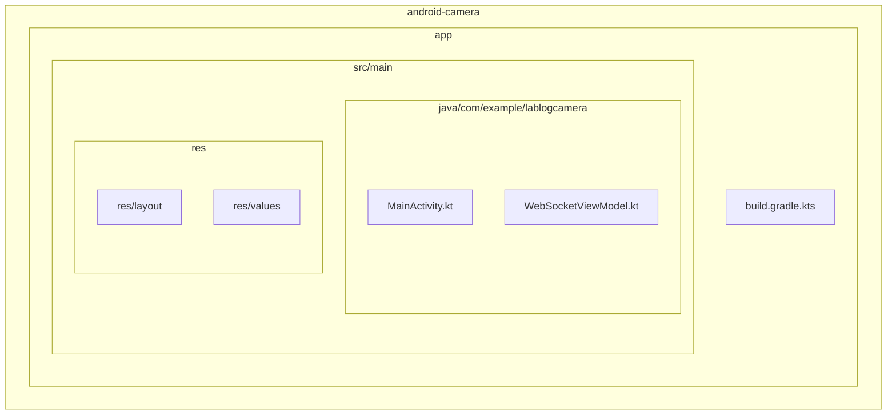
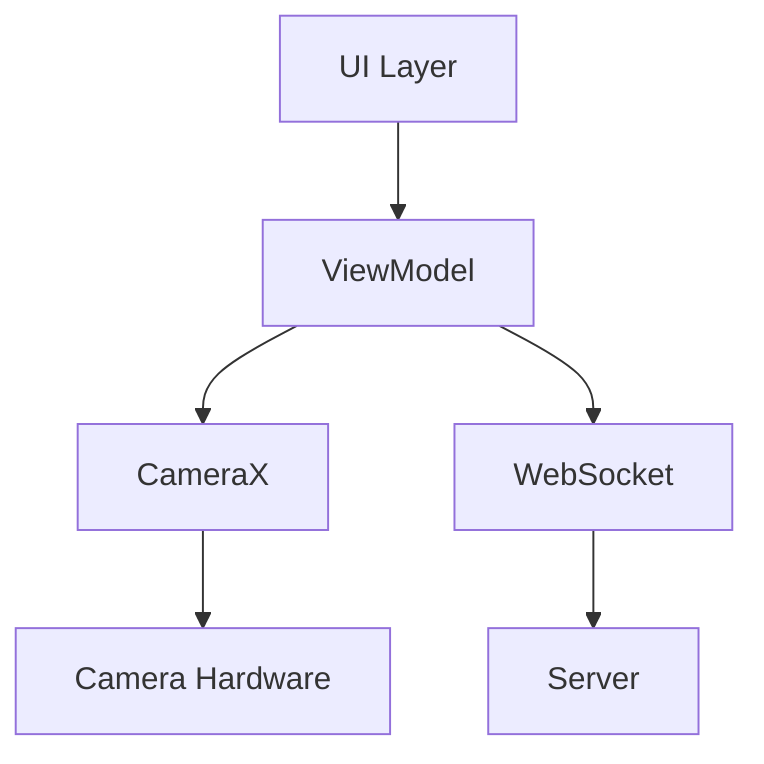
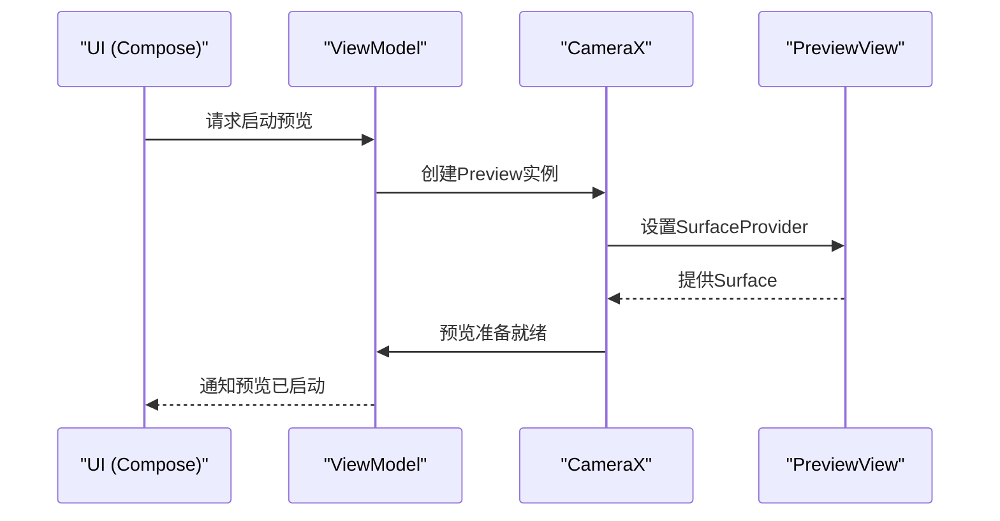
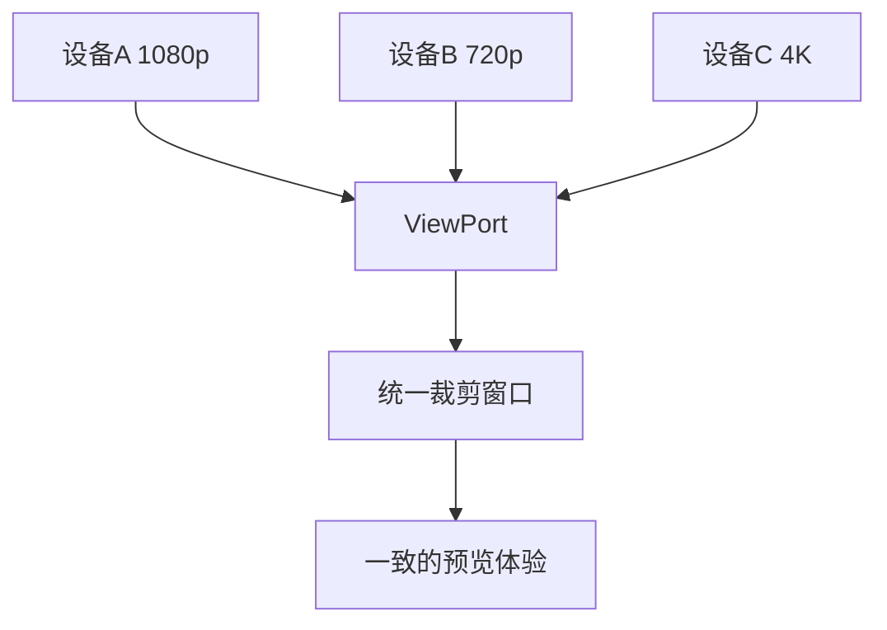
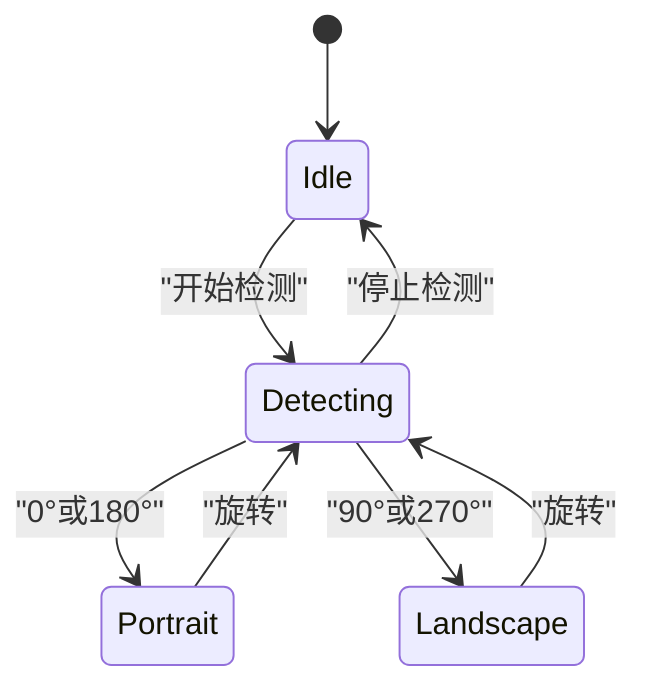
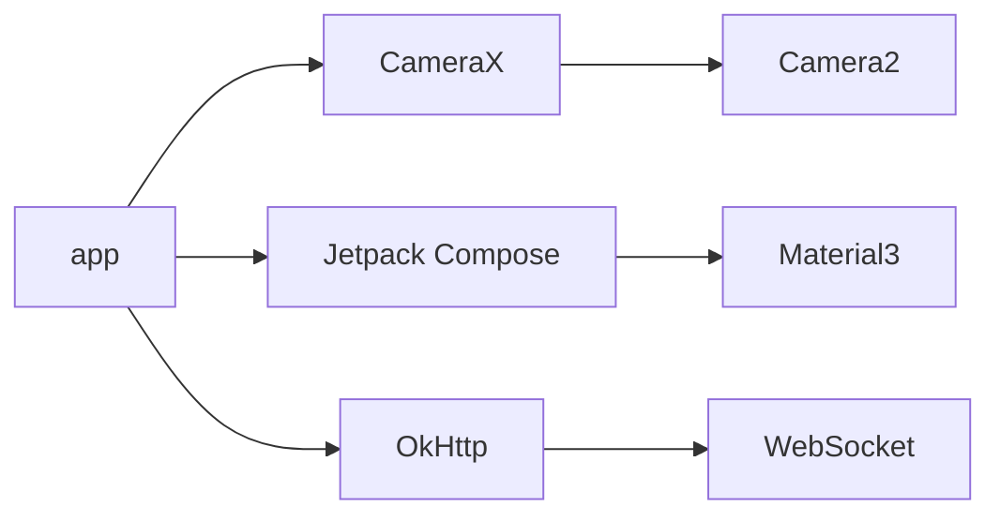

# 预览画面显示

<cite>
**本文档引用的文件**   
- [MainActivity.kt](file://android-camera/app/src/main/java/com/example/lablogcamera/MainActivity.kt)
- [build.gradle.kts](file://android-camera/app/build.gradle.kts)
- [AndroidManifest.xml](file://android-camera/app/src/main/AndroidManifest.xml)
</cite>

## 目录
1. [简介](#简介)
2. [项目结构](#项目结构)
3. [核心组件](#核心组件)
4. [架构概述](#架构概述)
5. [详细组件分析](#详细组件分析)
6. [依赖分析](#依赖分析)
7. [性能考虑](#性能考虑)
8. [故障排除指南](#故障排除指南)
9. [结论](#结论)

## 简介
本文档详细探讨了Android客户端中预览画面的显示实现，重点分析了如何使用CameraXPreview与PreviewView进行摄像头预览画面的渲染。文档涵盖了生命周期绑定、缩放模式配置、显示比例适配等关键功能，以及ViewPort在多分辨率设备上的适配作用。同时，文档还解释了预览方向与设备物理旋转的同步机制，并提供了全屏预览、比例裁剪和旋转适配的实现方法。

## 项目结构
项目采用标准的Android项目结构，主要功能集中在`android-camera`模块中。该模块使用Jetpack Compose进行UI构建，并通过CameraX库实现摄像头功能。项目结构清晰，分为源代码、资源文件和构建配置三个主要部分。

**Diagram sources**
- [MainActivity.kt](file://android-camera/app/src/main/java/com/example/lablogcamera/MainActivity.kt)
- [build.gradle.kts](file://android-camera/app/build.gradle.kts)

**Section sources**
- [MainActivity.kt](file://android-camera/app/src/main/java/com/example/lablogcamera/MainActivity.kt)
- [build.gradle.kts](file://android-camera/app/build.gradle.kts)

## 核心组件
本项目的核心组件包括CameraXPreview、PreviewView和ViewPort，这些组件共同实现了摄像头预览画面的渲染和适配。通过这些组件，应用能够提供高质量的预览体验，并支持多种显示模式和设备适配。

**Section sources**
- [MainActivity.kt](file://android-camera/app/src/main/java/com/example/lablogcamera/MainActivity.kt)

## 架构概述
应用的架构基于MVVM模式，使用ViewModel管理摄像头和WebSocket的状态。UI层通过Jetpack Compose构建，与ViewModel进行数据绑定。CameraX库负责摄像头的底层操作，包括预览、分析和编码。

**Diagram sources**
- [MainActivity.kt](file://android-camera/app/src/main/java/com/example/lablogcamera/MainActivity.kt)

## 详细组件分析

### CameraXPreview与PreviewView集成
CameraXPreview与PreviewView的集成是实现摄像头预览的关键。PreviewView作为UI组件，负责显示预览画面，而CameraXPreview则负责配置预览参数和绑定生命周期。

**Diagram sources**
- [MainActivity.kt](file://android-camera/app/src/main/java/com/example/lablogcamera/MainActivity.kt)

### ViewPort多分辨率适配
ViewPort组件在多分辨率设备上起到了关键的适配作用。它确保了预览画面在不同设备上的一致性，通过统一的裁剪窗口来协调Preview和ImageAnalysis的视野。

**Diagram sources**
- [MainActivity.kt](file://android-camera/app/src/main/java/com/example/lablogcamera/MainActivity.kt)

### 预览方向同步机制
预览方向与设备物理旋转的同步机制通过OrientationEventListener实现。该机制能够实时检测设备的物理旋转，并相应地调整预览画面的方向。

**Diagram sources**
- [MainActivity.kt](file://android-camera/app/src/main/java/com/example/lablogcamera/MainActivity.kt)

## 依赖分析
项目依赖于多个关键库，包括CameraX、Jetpack Compose和OkHttp。这些库共同提供了摄像头功能、UI构建和网络通信的能力。

**Diagram sources**
- [build.gradle.kts](file://android-camera/app/build.gradle.kts)

**Section sources**
- [build.gradle.kts](file://android-camera/app/build.gradle.kts)

## 性能考虑
在实现预览画面显示时，需要考虑多个性能因素。低延迟模式配置可以减少预览画面的延迟，提高用户体验。同时，合理的帧率控制和资源管理也是保证性能的关键。

**Section sources**
- [MainActivity.kt](file://android-camera/app/src/main/java/com/example/lablogcamera/MainActivity.kt)

## 故障排除指南
常见问题包括预览拉伸、黑屏和方向错误。这些问题通常可以通过检查缩放模式配置、生命周期绑定和方向同步机制来解决。确保PreviewView的scaleType设置正确，并且CameraX的绑定时机恰当，可以有效避免这些问题。

**Section sources**
- [MainActivity.kt](file://android-camera/app/src/main/java/com/example/lablogcamera/MainActivity.kt)

## 结论
本文档详细分析了Android客户端预览画面显示的实现，涵盖了从组件集成到性能优化的各个方面。通过合理使用CameraXPreview、PreviewView和ViewPort，可以实现高质量的预览体验，并有效适配多种设备和场景。