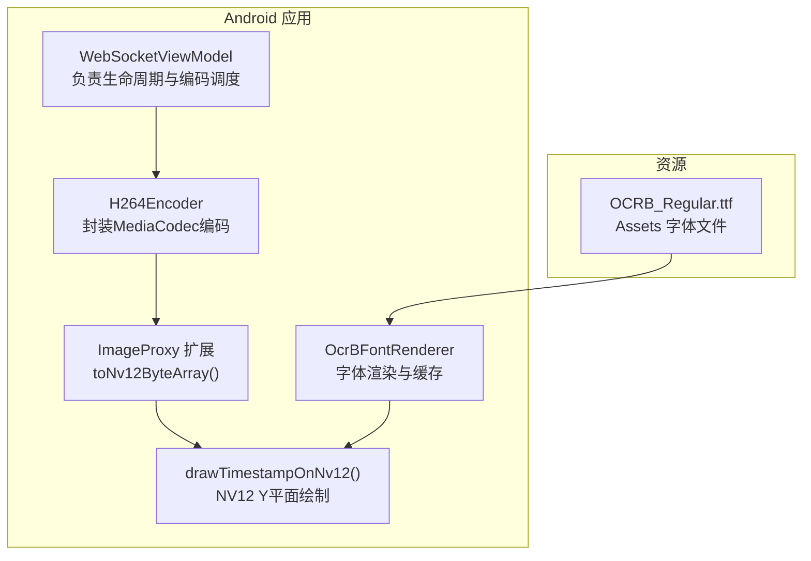
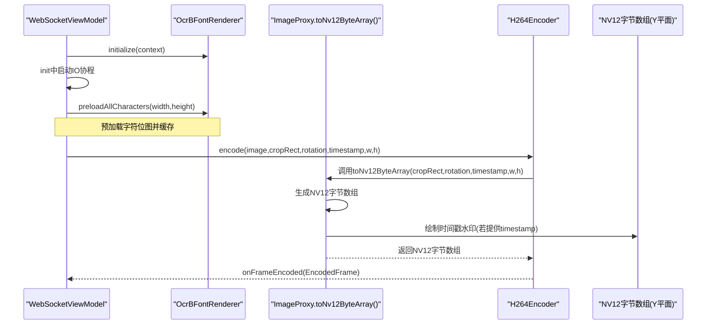
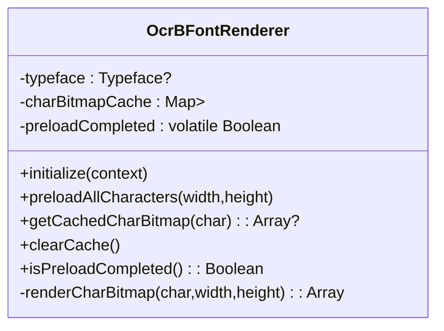
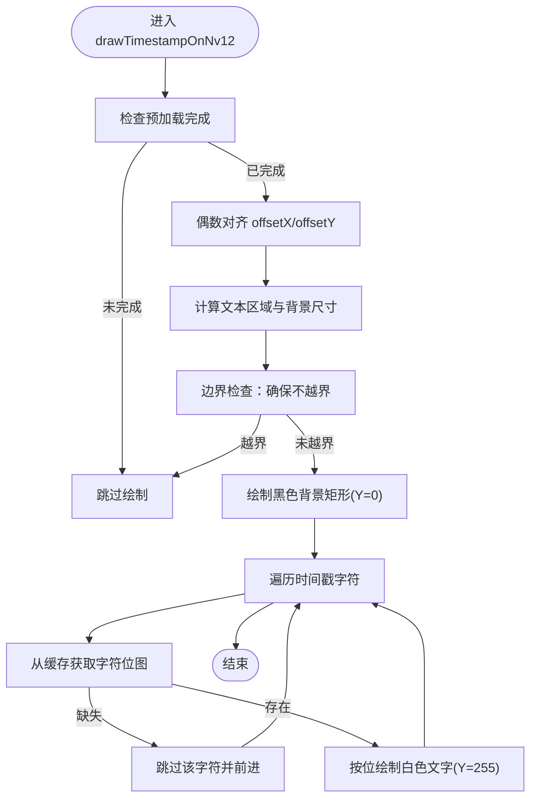
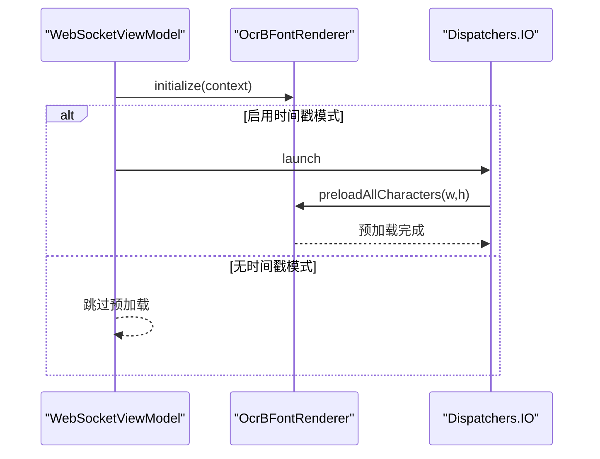
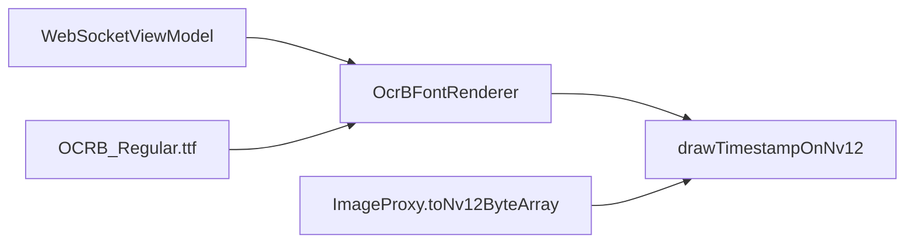

# 时间戳水印渲染

<cite>
**本文引用的文件**
- [MainActivity.kt](file://android-camera/app/src/main/java/com/example/lablogcamera/MainActivity.kt)
- [OCRB_Regular.ttf](file://android-camera/app/src/main/assets/fonts/OCRB_Regular.ttf)
</cite>

## 目录
1. [简介](#简介)
2. [项目结构](#项目结构)
3. [核心组件](#核心组件)
4. [架构概览](#架构概览)
5. [详细组件分析](#详细组件分析)
6. [依赖关系分析](#依赖关系分析)
7. [性能考量](#性能考量)
8. [故障排查指南](#故障排查指南)
9. [结论](#结论)
10. [附录](#附录)

## 简介
本文件围绕Android客户端的时间戳水印渲染展开，重点解析以下内容：
- OcrBFontRenderer对象的设计与实现：从Assets加载OCRB_Regular.ttf字体文件、使用Canvas和Paint预渲染字符位图并缓存为二维整型数组。
- drawTimestampOnNv12函数如何在NV12格式的Y平面左上角绘制“时间: hh:mm:ss”格式的白色文字水印，并支持16x24和20x30两种字体尺寸。
- getCurrentTimestampString()的秒级缓存机制以减少字符串格式化开销。
- ViewModel初始化时在IO协程中预加载所有必要字符的异步流程。
- 水印抗锯齿、背景填充、边界检查等细节处理的最佳实践。
- 自定义字体和布局的扩展建议。

## 项目结构
本项目为Android Camera应用，时间戳水印渲染相关的核心代码集中在MainActivity.kt中，字体资源位于assets/fonts目录。整体结构如下：

图表来源
- [MainActivity.kt](file://android-camera/app/src/main/java/com/example/lablogcamera/MainActivity.kt#L187-L276)
- [MainActivity.kt](file://android-camera/app/src/main/java/com/example/lablogcamera/MainActivity.kt#L299-L458)
- [MainActivity.kt](file://android-camera/app/src/main/java/com/example/lablogcamera/MainActivity.kt#L461-L551)
- [MainActivity.kt](file://android-camera/app/src/main/java/com/example/lablogcamera/MainActivity.kt#L553-L700)
- [MainActivity.kt](file://android-camera/app/src/main/java/com/example/lablogcamera/MainActivity.kt#L1450-L1660)
- [OCRB_Regular.ttf](file://android-camera/app/src/main/assets/fonts/OCRB_Regular.ttf)

章节来源
- [MainActivity.kt](file://android-camera/app/src/main/java/com/example/lablogcamera/MainActivity.kt#L187-L276)
- [MainActivity.kt](file://android-camera/app/src/main/java/com/example/lablogcamera/MainActivity.kt#L299-L458)
- [MainActivity.kt](file://android-camera/app/src/main/java/com/example/lablogcamera/MainActivity.kt#L461-L551)
- [MainActivity.kt](file://android-camera/app/src/main/java/com/example/lablogcamera/MainActivity.kt#L553-L700)
- [MainActivity.kt](file://android-camera/app/src/main/java/com/example/lablogcamera/MainActivity.kt#L1450-L1660)
- [OCRB_Regular.ttf](file://android-camera/app/src/main/assets/fonts/OCRB_Regular.ttf)

## 核心组件
- OcrBFontRenderer：负责从Assets加载OCR-B字体、预渲染字符位图并缓存，提供字符位图查询接口。
- drawTimestampOnNv12：在NV12 Y平面绘制时间戳水印，支持16x24与20x30两种字符尺寸。
- WebSocketViewModel：在IO协程中初始化字体渲染器并预加载字符，提供getCurrentTimestampString()的秒级缓存。
- ImageProxy扩展toNv12ByteArray：将YUV_420_888三平面转换为NV12半平面布局，并在必要时调用drawTimestampOnNv12绘制水印。

章节来源
- [MainActivity.kt](file://android-camera/app/src/main/java/com/example/lablogcamera/MainActivity.kt#L299-L458)
- [MainActivity.kt](file://android-camera/app/src/main/java/com/example/lablogcamera/MainActivity.kt#L461-L551)
- [MainActivity.kt](file://android-camera/app/src/main/java/com/example/lablogcamera/MainActivity.kt#L553-L700)
- [MainActivity.kt](file://android-camera/app/src/main/java/com/example/lablogcamera/MainActivity.kt#L1450-L1660)

## 架构概览
时间戳水印渲染的关键流程如下：

图表来源
- [MainActivity.kt](file://android-camera/app/src/main/java/com/example/lablogcamera/MainActivity.kt#L553-L700)
- [MainActivity.kt](file://android-camera/app/src/main/java/com/example/lablogcamera/MainActivity.kt#L1450-L1660)
- [MainActivity.kt](file://android-camera/app/src/main/java/com/example/lablogcamera/MainActivity.kt#L299-L458)

## 详细组件分析

### OcrBFontRenderer：字体加载与字符位图缓存
- 字体加载
  - 从Assets加载OCRB_Regular.ttf；若失败则回退到系统等宽字体。
  - 初始化入口initialize(context)接受Android Context。
- 预加载与缓存
  - preloadAllCharacters(width,height)批量渲染所需字符（时间戳格式包含的数字、冒号、空格、字母Time）。
  - 渲染采用Canvas+Paint，开启抗锯齿，字符居中绘制，最终提取为二维整型数组（1=白色，0=背景）。
  - 缓存结构为Map<Char, Array<IntArray>>，并维护预加载完成标志。
- 查询接口
  - getCachedCharBitmap(char)：在预加载完成后返回对应字符位图；否则返回空并记录警告。
  - clearCache()/isPreloadCompleted()用于内存管理和状态查询。

图表来源
- [MainActivity.kt](file://android-camera/app/src/main/java/com/example/lablogcamera/MainActivity.kt#L299-L458)

章节来源
- [MainActivity.kt](file://android-camera/app/src/main/java/com/example/lablogcamera/MainActivity.kt#L299-L458)
- [OCRB_Regular.ttf](file://android-camera/app/src/main/assets/fonts/OCRB_Regular.ttf)

### drawTimestampOnNv12：NV12 Y平面时间戳绘制
- 功能概述
  - 在NV12的Y平面左上角绘制“时间: hh:mm:ss”格式的白色文字水印。
  - 支持两种字符尺寸：16x24与20x30。
- 预加载检查
  - 若预加载未完成则跳过绘制。
- 偶数对齐与边界检查
  - offsetX与offsetY均按偶数对齐，确保与NV12的UV对齐要求一致。
  - 文本背景区域与文本区域均进行边界检查，避免越界写入。
- 背景与文字
  - 先绘制黑色背景矩形（Y=0），再在背景上绘制白色文字（Y=255）。
  - 文字字符逐位绘制，依据字符位图数组决定是否覆盖为白色。
- 参数与默认值
  - charWidth/charHeight默认16/24；可通过ViewModel切换至20/30。
  - offsetX/offsetY默认10。

图表来源
- [MainActivity.kt](file://android-camera/app/src/main/java/com/example/lablogcamera/MainActivity.kt#L461-L551)

章节来源
- [MainActivity.kt](file://android-camera/app/src/main/java/com/example/lablogcamera/MainActivity.kt#L461-L551)

### getCurrentTimestampString：秒级缓存机制
- 设计要点
  - 使用cachedTimestamp与cachedTimestampSecond进行秒级缓存。
  - 每秒更新一次字符串，减少重复格式化开销。
- 适用场景
  - 在编码循环中频繁调用，避免每帧都进行格式化。

章节来源
- [MainActivity.kt](file://android-camera/app/src/main/java/com/example/lablogcamera/MainActivity.kt#L614-L653)

### ViewModel初始化与预加载：IO协程异步流程
- 初始化阶段
  - 在init中调用OcrBFontRenderer.initialize()。
  - 若启用时间戳模式，则在viewModelScope.launch(Dispatchers.IO)中调用preloadAllCharacters(width,height)。
- 模式切换
  - 通过timestampMode选择16x24或20x30两种字符尺寸。
  - getTimestampCharWidth()/getTimestampCharHeight()根据模式返回相应尺寸。

图表来源
- [MainActivity.kt](file://android-camera/app/src/main/java/com/example/lablogcamera/MainActivity.kt#L553-L700)
- [MainActivity.kt](file://android-camera/app/src/main/java/com/example/lablogcamera/MainActivity.kt#L299-L458)

章节来源
- [MainActivity.kt](file://android-camera/app/src/main/java/com/example/lablogcamera/MainActivity.kt#L553-L700)
- [MainActivity.kt](file://android-camera/app/src/main/java/com/example/lablogcamera/MainActivity.kt#L299-L458)

### ImageProxy扩展：toNv12ByteArray与水印集成
- NV12转换
  - 将YUV_420_888三平面数据转换为NV12半平面布局（Y + 交错UV）。
  - 支持旋转（0/90/180/270度）与裁剪，确保对齐与偶数约束。
- 水印集成
  - 若提供timestamp参数，则在生成NV12后调用drawTimestampOnNv12绘制水印。
  - 字符尺寸由调用方传入（16x24或20x30）。

章节来源
- [MainActivity.kt](file://android-camera/app/src/main/java/com/example/lablogcamera/MainActivity.kt#L1450-L1660)

## 依赖关系分析
- 组件耦合
  - OcrBFontRenderer与drawTimestampOnNv12强耦合：前者提供字符位图，后者消费位图进行绘制。
  - WebSocketViewModel与OcrBFontRenderer弱耦合：仅在初始化阶段调用，预加载完成后二者解耦。
  - ImageProxy扩展与drawTimestampOnNv12弱耦合：通过可选参数timestamp触发水印绘制。
- 外部依赖
  - Assets字体文件OCRB_Regular.ttf作为渲染源。
  - Android图形API（Canvas/Paint/Bitmap）用于字符位图生成。
  - MediaCodec用于H.264编码，NV12字节序列作为编码输入。

图表来源
- [MainActivity.kt](file://android-camera/app/src/main/java/com/example/lablogcamera/MainActivity.kt#L299-L458)
- [MainActivity.kt](file://android-camera/app/src/main/java/com/example/lablogcamera/MainActivity.kt#L461-L551)
- [MainActivity.kt](file://android-camera/app/src/main/java/com/example/lablogcamera/MainActivity.kt#L1450-L1660)
- [OCRB_Regular.ttf](file://android-camera/app/src/main/assets/fonts/OCRB_Regular.ttf)

章节来源
- [MainActivity.kt](file://android-camera/app/src/main/java/com/example/lablogcamera/MainActivity.kt#L299-L458)
- [MainActivity.kt](file://android-camera/app/src/main/java/com/example/lablogcamera/MainActivity.kt#L461-L551)
- [MainActivity.kt](file://android-camera/app/src/main/java/com/example/lablogcamera/MainActivity.kt#L1450-L1660)
- [OCRB_Regular.ttf](file://android-camera/app/src/main/assets/fonts/OCRB_Regular.ttf)

## 性能考量
- 预渲染与缓存
  - 将字符位图预渲染并缓存，避免每帧重复创建位图与像素提取，显著降低CPU开销。
- 秒级缓存
  - getCurrentTimestampString()按秒更新，减少字符串格式化频率。
- NV12绘制优化
  - 使用整型数组索引直接写入Y平面，避免逐像素查找与分支过多。
  - 偶数对齐与边界检查减少越界风险与无效写入。
- 字体测量与抗锯齿
  - 抗锯齿开启提升视觉质量；通过动态测量与缩小字体大小确保字符不溢出目标尺寸。
- I/O与并发
  - 预加载在IO协程执行，避免阻塞主线程；编码与网络发送同样在IO线程池中进行。

## 故障排查指南
- 预加载失败
  - 现象：drawTimestampOnNv12跳过绘制并记录警告。
  - 排查：确认Assets中OCRB_Regular.ttf存在且路径正确；检查initialize()是否被调用。
- 字体回退
  - 现象：使用系统等宽字体替代OCR-B。
  - 排查：确认Assets字体加载异常日志；如需OCR-B，请确保字体文件可用。
- 水印越界
  - 现象：水印被截断或越界。
  - 排查：检查offsetX/offsetY与字符尺寸、文本长度是否导致背景区域越界；确保输入图像尺寸足够。
- 字符缺失
  - 现象：某些字符未绘制。
  - 排查：确认预加载字符集包含所需字符；检查getCachedCharBitmap()返回是否为空。
- NV12布局异常
  - 现象：出现绿带/伪影。
  - 排查：确保toNv12ByteArray按Y+UV顺序正确拼接；旋转与裁剪参数与编码器期望一致；对齐到偶数与32的倍数。

章节来源
- [MainActivity.kt](file://android-camera/app/src/main/java/com/example/lablogcamera/MainActivity.kt#L299-L458)
- [MainActivity.kt](file://android-camera/app/src/main/java/com/example/lablogcamera/MainActivity.kt#L461-L551)
- [MainActivity.kt](file://android-camera/app/src/main/java/com/example/lablogcamera/MainActivity.kt#L1450-L1660)

## 结论
本实现通过预渲染字符位图、秒级时间戳缓存与严格的NV12布局对齐，实现了高效稳定的时间戳水印渲染。OcrBFontRenderer提供了清晰的字体加载与缓存接口，drawTimestampOnNv12在NV12 Y平面进行快速绘制，配合ViewModel的异步预加载流程，确保了良好的用户体验与性能表现。对于扩展需求，建议遵循现有对齐与边界检查规范，并在Assets中提供高质量字体文件以保证渲染效果。

## 附录
- 自定义字体
  - 将自定义TTF文件放入assets/fonts目录，修改initialize()中的字体路径；确保预加载字符集覆盖所需字符。
- 自定义布局
  - 调整offsetX/offsetY以适配不同分辨率与UI布局；根据目标分辨率与字体尺寸计算字符间距与背景留白。
- 字体尺寸扩展
  - 在ViewModel中新增模式枚举与尺寸映射；在toNv12ByteArray与drawTimestampOnNv12中传入新的w/h参数。