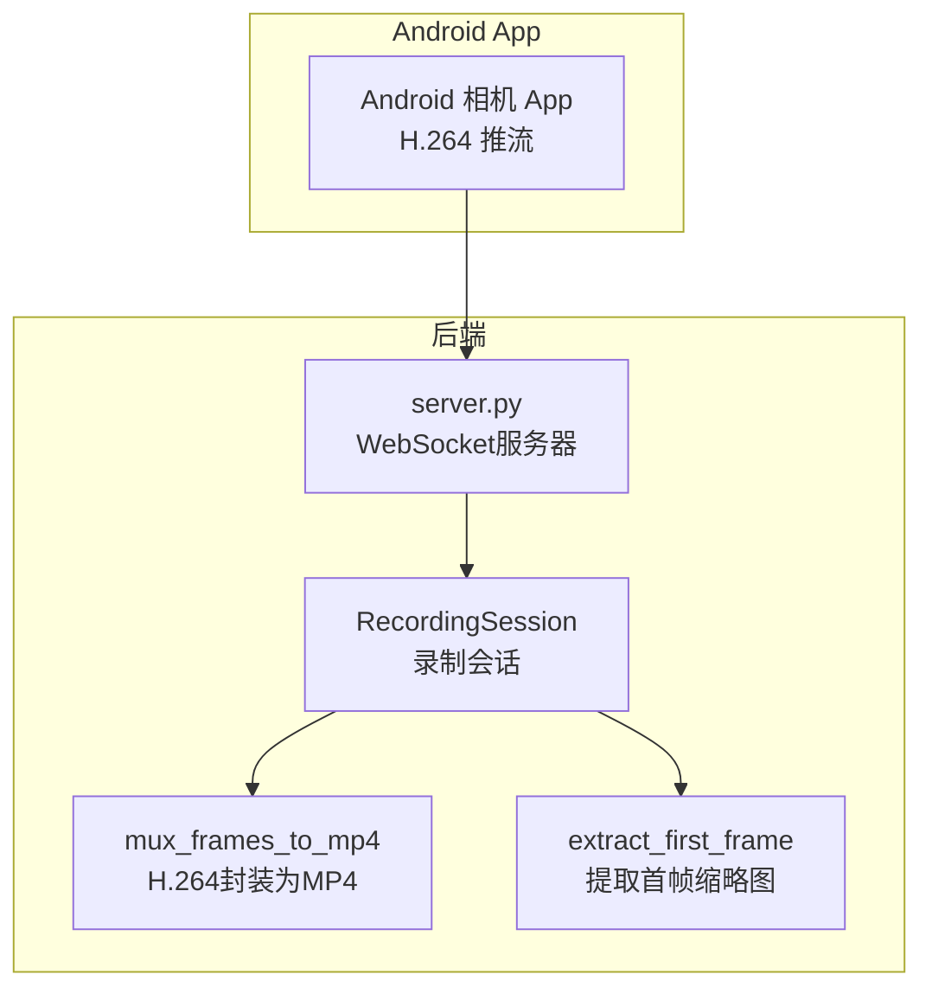
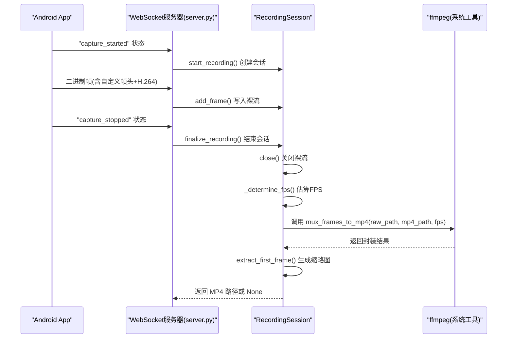
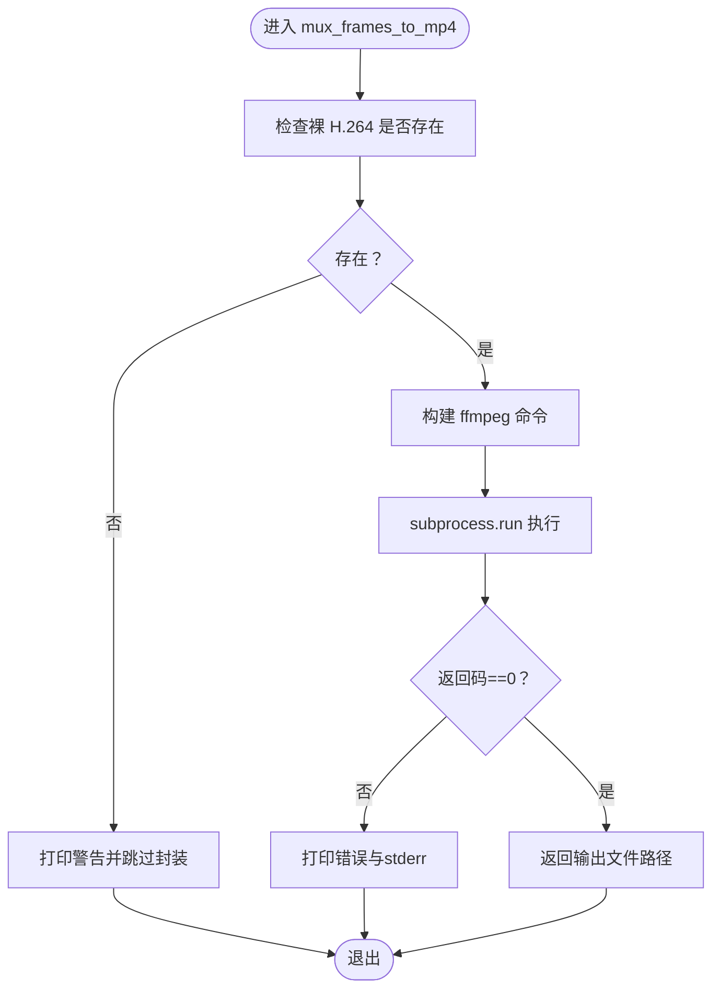
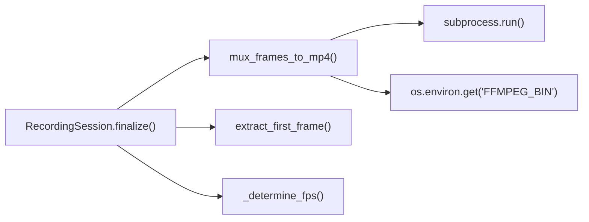

# H.264流封装为MP4

<cite>
**本文引用的文件**
- [server.py](file://backend/server.py)
- [README.md](file://backend/README.md)
- [README.md](file://android-camera/README.md)
</cite>

## 目录
1. [简介](#简介)
2. [项目结构](#项目结构)
3. [核心组件](#核心组件)
4. [架构总览](#架构总览)
5. [详细组件分析](#详细组件分析)
6. [依赖分析](#依赖分析)
7. [性能考量](#性能考量)
8. [故障排查指南](#故障排查指南)
9. [结论](#结论)
10. [附录](#附录)

## 简介
本篇文档围绕后端服务器中的 mux_frames_to_mp4 函数展开，系统性阐述其如何使用 ffmpeg 将裸 H.264 比特流封装为 MP4。重点说明：
- 参数 -f h264 的作用是显式告知输入为裸 H.264，避免 ffmpeg 误判；
- 参数 -r <fps> 用于强制设定帧率，防止 ffmpeg 基于码流推断导致时间轴异常；
- 参数 -c:v copy 实现视频轨无重编码拷贝，快速且无损；
- 通过 subprocess 调用 ffmpeg 命令行工具；
- FFMPEG_BIN 环境变量的优先级处理；
- 在 RecordingSession.finalize() 中的调用上下文，体现该函数在整个录制流程中的关键地位。

## 项目结构
后端服务器负责接收来自 Android App 的 H.264 帧，按会话写入磁盘，结束时调用 ffmpeg 将裸 H.264 封装为 MP4，并生成缩略图。

图表来源
- [server.py](file://backend/server.py#L26-L88)
- [server.py](file://backend/server.py#L150-L179)
- [server.py](file://backend/server.py#L181-L208)

章节来源
- [server.py](file://backend/server.py#L26-L88)
- [README.md](file://backend/README.md#L1-L33)

## 核心组件
- RecordingSession：维护每个客户端的录制会话，负责写入裸 H.264、估算 FPS、结束时调用封装与缩略图提取。
- mux_frames_to_mp4：使用 ffmpeg 将裸 H.264 封装为 MP4，参数与行为详见下文。
- extract_first_frame：从 H.264 中提取首帧 JPEG 缩略图。

章节来源
- [server.py](file://backend/server.py#L26-L88)
- [server.py](file://backend/server.py#L150-L179)
- [server.py](file://backend/server.py#L181-L208)

## 架构总览
下图展示从 App 推流到生成 MP4 的关键调用链，突出 RecordingSession.finalize() 中对 mux_frames_to_mp4 的调用。

图表来源
- [server.py](file://backend/server.py#L64-L78)
- [server.py](file://backend/server.py#L150-L179)
- [server.py](file://backend/server.py#L181-L208)

章节来源
- [server.py](file://backend/server.py#L64-L78)
- [README.md](file://android-camera/README.md#L31-L38)

## 详细组件分析

### mux_frames_to_mp4 函数详解
- 功能概述
  - 将 recordings/<client>_<timestamp>/stream.h264 封装为 stream.mp4；
  - 通过 -f h264 显式指定输入格式，避免 ffmpeg 错误推断；
  - 通过 -r <fps> 显式帧率，解决“1fps 视频”等时间轴问题；
  - 使用 -c:v copy 直接拷贝视频轨，无重编码，快速且无损；
  - 视频已在 Android 端旋转完成，后端无需再次旋转。

- 关键参数说明
  - -f h264：明确输入为裸 H.264，避免 ffmpeg 从扩展名或码流特征误判；
  - -r <fps>：强制帧率，确保 MP4 时间轴与实际拍摄节奏一致；
  - -c:v copy：不重编码，直接复制视频轨，速度快、无质量损失；
  - -y：覆盖输出文件，避免交互确认；
  - -i <input>：输入裸 H.264 文件路径；
  - 输出文件：<output>.mp4。

- 调用方式
  - 通过 subprocess.run(cmd, capture_output=True, text=True) 执行 ffmpeg；
  - 若返回码非 0，打印 stderr 并返回 None；
  - 若返回码为 0，返回输出文件路径。

- 环境变量优先级
  - 可通过 FFMPEG_BIN 环境变量指定 ffmpeg 可执行文件路径；
  - 若未设置，则使用系统 PATH 中的 ffmpeg。

- 日志与错误处理
  - 原始文件不存在：打印警告并跳过封装；
  - ffmpeg 执行失败：打印错误与 stderr，返回 None；
  - 成功：返回输出文件路径。

- 与 FPS 估算的关系
  - FPS 由 RecordingSession._determine_fps() 估算，优先使用服务器到达时间估算值，若不可信则回退到设备时间戳估算；
  - 估算值用于传入 mux_frames_to_mp4 的 -r 参数，确保时间轴正确。

- 与缩略图的关系
  - 成功生成 MP4 后，调用 extract_first_frame 从同一 H.264 中抽取首帧 JPEG 缩略图。

章节来源
- [server.py](file://backend/server.py#L150-L179)
- [README.md](file://backend/README.md#L99-L114)
- [README.md](file://backend/README.md#L284-L291)

### RecordingSession.finalize() 调用上下文
- finalize() 的职责
  - 关闭裸 H.264 文件；
  - 估算 FPS；
  - 调用 mux_frames_to_mp4 封装 MP4；
  - 若成功，提取首帧生成缩略图；
  - 返回 MP4 路径或 None。

- 关键流程
  - 关闭裸流：确保所有数据落盘；
  - FPS 估算：基于设备时间戳与服务器到达时间，优先服务器到达时间估算；
  - 封装 MP4：传入估算的 fps；
  - 缩略图：从同一 H.264 中抽取首帧 JPEG。

- 与 Android 端协作
  - 视频已在 Android 端旋转完成，后端无需再旋转；
  - 服务器仅负责封装与缩略图提取，降低后端负载。

章节来源
- [server.py](file://backend/server.py#L64-L78)
- [server.py](file://backend/server.py#L80-L133)
- [README.md](file://android-camera/README.md#L31-L38)

### 参数与行为的可视化
下图展示 mux_frames_to_mp4 的参数与行为关系，帮助理解为何需要这些参数。

图表来源
- [server.py](file://backend/server.py#L150-L179)

## 依赖分析
- 外部工具
  - ffmpeg：系统级工具，非 Python 依赖；
  - 可通过 FFMPEG_BIN 环境变量指定路径。

- 内部依赖
  - RecordingSession.finalize() 依赖 mux_frames_to_mp4 与 extract_first_frame；
  - mux_frames_to_mp4 依赖 subprocess 与 os.environ.get；
  - FPS 估算依赖 RecordingSession 内部的时间戳字段。

图表来源
- [server.py](file://backend/server.py#L64-L78)
- [server.py](file://backend/server.py#L150-L179)
- [server.py](file://backend/server.py#L181-L208)

章节来源
- [README.md](file://backend/README.md#L278-L291)
- [server.py](file://backend/server.py#L150-L179)

## 性能考量
- 无重编码封装
  - 使用 -c:v copy 直接拷贝视频轨，避免 CPU/GPU 重编码，速度极快；
  - 适合大模型处理与实时性要求高的场景。

- 环境与路径
  - 确保系统已安装 ffmpeg，并可在命令行直接执行；
  - 如需自定义路径，设置 FFMPEG_BIN 环境变量，避免硬编码路径。

- I/O 与磁盘
  - 裸 H.264 写入与 MP4 封装均涉及磁盘 I/O，建议：
    - 使用高性能存储介质；
    - 避免在同一磁盘上同时进行大量写操作；
    - 大文件录制时关注磁盘空间，预留足够空间。

- 大文件与时间轴
  - 通过 -r <fps> 显式帧率，避免 ffmpeg 基于码流推断导致时间轴异常；
  - FPS 估算优先使用服务器到达时间，若不可信再回退到设备时间戳。

- 与 Android 端协作
  - 视频已在 Android 端旋转完成，后端无需再次旋转，进一步降低负载。

章节来源
- [README.md](file://backend/README.md#L102-L114)
- [README.md](file://backend/README.md#L226-L233)
- [README.md](file://backend/README.md#L284-L291)
- [README.md](file://android-camera/README.md#L404-L418)

## 故障排查指南
- 常见失败场景与日志示例
  - 原始文件缺失
    - 现象：打印警告并跳过封装，返回 None；
    - 建议：确认 RecordingSession 是否正确创建与写入裸流。
  - ffmpeg 执行错误
    - 现象：打印错误与 stderr，返回 None；
    - 建议：检查 ffmpeg 安装与 FFMPEG_BIN 路径，确认输入文件存在且可读。
  - 时间轴异常
    - 现象：MP4 播放时帧率异常或卡顿；
    - 建议：确认 FPS 估算逻辑与 -r 参数传入是否正确，避免 ffmpeg 自动推断。

- 调试步骤
  - 确认 ffmpeg 可用：在服务器终端执行 ffmpeg -version；
  - 检查 FFMPEG_BIN：若自定义路径，确保环境变量设置正确；
  - 查看日志：关注 finalize() 与 mux_frames_to_mp4 的输出；
  - 验证输入：确认 recordings/<client>_<timestamp>/stream.h264 存在且非空。

章节来源
- [server.py](file://backend/server.py#L150-L179)
- [README.md](file://backend/README.md#L226-L233)
- [README.md](file://backend/README.md#L284-L291)

## 结论
mux_frames_to_mp4 通过明确的参数组合与 subprocess 调用，实现了对裸 H.264 的快速、无损封装。其在 RecordingSession.finalize() 中的关键调用，确保了录制流程的完整性与一致性。配合 Android 端的旋转与裁剪策略，后端仅承担封装与缩略图提取，整体架构简洁高效，适合在资源受限或对实时性有要求的场景中部署。

## 附录
- 相关文件与行号
  - [server.py](file://backend/server.py#L150-L179)：mux_frames_to_mp4 实现
  - [server.py](file://backend/server.py#L64-L78)：finalize() 调用
  - [server.py](file://backend/server.py#L80-L133)：FPS 估算
  - [README.md](file://backend/README.md#L99-L114)：封装命令与参数说明
  - [README.md](file://backend/README.md#L226-L233)：ffmpeg 安装与验证
  - [README.md](file://backend/README.md#L284-L291)：FFMPEG_BIN 环境变量
  - [README.md](file://android-camera/README.md#L31-L38)：Android 端旋转与封装协作