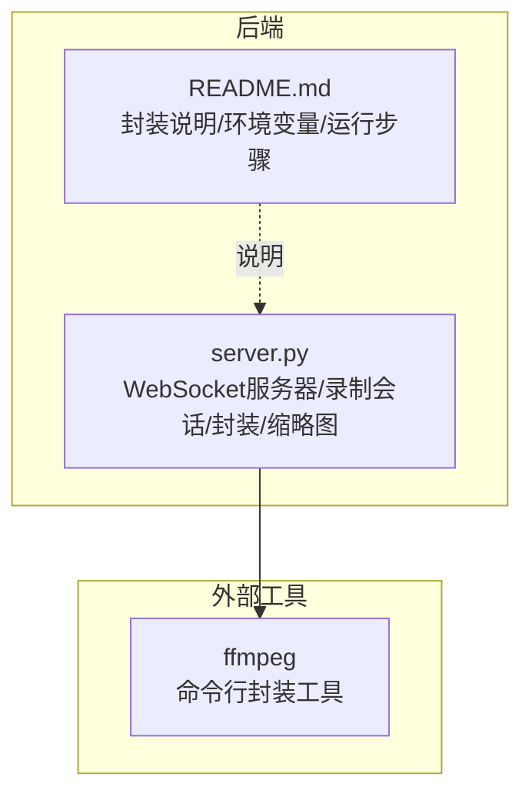
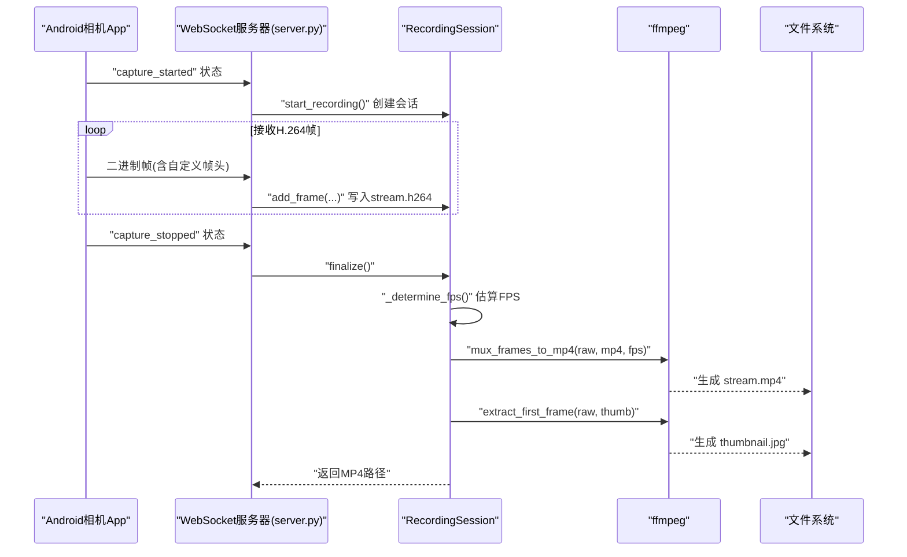
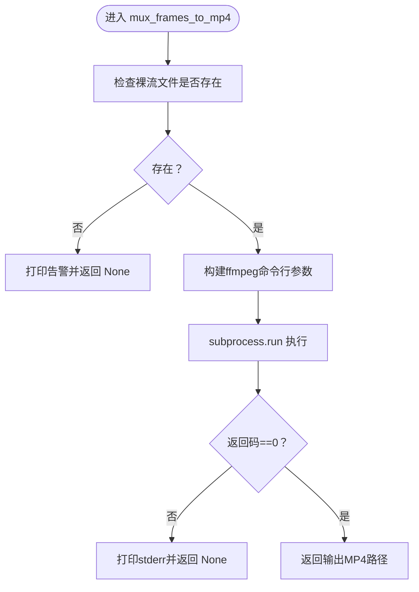
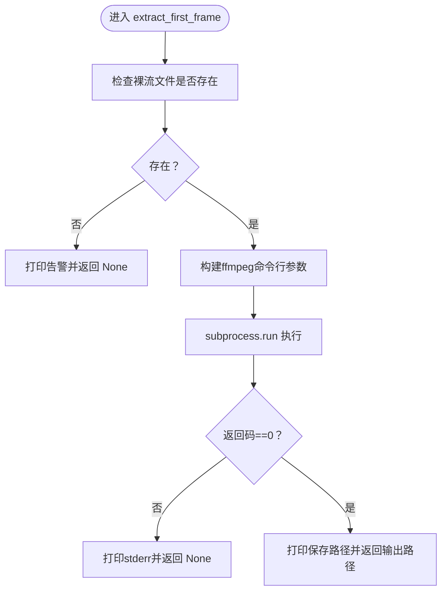
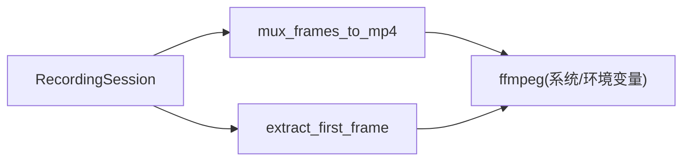

# MP4封装

<cite>
**本文引用的文件**
- [server.py](file://backend/server.py)
- [README.md](file://backend/README.md)
</cite>

## 目录
1. [简介](#简介)
2. [项目结构](#项目结构)
3. [核心组件](#核心组件)
4. [架构总览](#架构总览)
5. [详细组件分析](#详细组件分析)
6. [依赖关系分析](#依赖关系分析)
7. [性能考虑](#性能考虑)
8. [故障排查指南](#故障排查指南)
9. [结论](#结论)
10. [附录](#附录)

## 简介
本文件围绕后端录制与封装模块中的MP4封装能力展开，重点解释以下内容：
- 如何调用ffmpeg命令行工具进行H.264裸流封装；
- 参数-f h264、-r <fps>、-c:v copy的作用及对正确封装的重要性；
- extract_first_frame如何生成缩略图；
- FFMPEG_BIN环境变量的用途；
- 初学者与进阶开发者分别关注的日志与性能优化要点。

## 项目结构
后端服务负责接收来自Android相机App的H.264帧，按会话写入磁盘，结束时调用ffmpeg进行MP4封装，并生成缩略图。关键文件与职责如下：
- backend/server.py：WebSocket服务器、录制会话管理、帧解析、封装与缩略图生成、命令下发与广播等。
- backend/README.md：封装流程说明、环境变量FFMPEG_BIN说明、运行步骤等。

图表来源
- [server.py](file://backend/server.py#L150-L207)
- [README.md](file://backend/README.md#L89-L114)

章节来源
- [server.py](file://backend/server.py#L1-L120)
- [README.md](file://backend/README.md#L1-L60)

## 核心组件
- 录制会话RecordingSession：负责按会话写入H.264裸流、统计时间戳、估算FPS、触发封装与缩略图生成。
- 封装函数mux_frames_to_mp4：调用ffmpeg将H.264裸流封装为MP4。
- 缩略图函数extract_first_frame：从H.264裸流提取首帧生成JPEG缩略图。
- 环境变量FFMPEG_BIN：允许指定ffmpeg可执行文件路径。

章节来源
- [server.py](file://backend/server.py#L26-L133)
- [server.py](file://backend/server.py#L150-L207)
- [README.md](file://backend/README.md#L89-L114)

## 架构总览
下图展示了从收到帧到最终生成MP4与缩略图的整体流程。

图表来源
- [server.py](file://backend/server.py#L210-L231)
- [server.py](file://backend/server.py#L49-L78)
- [server.py](file://backend/server.py#L150-L207)

## 详细组件分析

### 封装函数mux_frames_to_mp4
该函数负责将H.264裸流封装为MP4，核心逻辑与参数说明如下：
- 输入检查：若裸流文件不存在则跳过并打印告警。
- 命令构建：通过subprocess调用ffmpeg，命令行参数包括：
  - -f h264：明确输入为裸H.264；
  - -r <fps>：显式指定帧率，避免ffmpeg基于码流错误推断导致“1fps视频”；
  - -c:v copy：不重编码，直接复制视频轨，速度快且无损；
  - -y：覆盖输出文件；
  - -i <输入路径>：H.264裸流路径；
  - 输出路径：MP4文件。
- 错误处理：若返回码非0，打印stderr并返回None。

图表来源
- [server.py](file://backend/server.py#L150-L178)

章节来源
- [server.py](file://backend/server.py#L150-L178)
- [README.md](file://backend/README.md#L89-L114)

### 缩略图函数extract_first_frame
该函数从H.264裸流中提取第一帧并保存为JPEG缩略图：
- 输入检查：若裸流文件不存在则跳过并打印告警。
- 命令构建：通过subprocess调用ffmpeg，命令行参数包括：
  - -f h264：明确输入为裸H.264；
  - -i <输入路径>：H.264裸流路径；
  - -vframes 1：仅抽取第一帧；
  - -q:v 2：高质量JPEG（数值越小质量越高）；
  - -y：覆盖输出文件；
  - 输出路径：thumbnail.jpg。
- 错误处理：若返回码非0，打印stderr并返回None；成功时打印保存路径。

图表来源
- [server.py](file://backend/server.py#L181-L207)

章节来源
- [server.py](file://backend/server.py#L181-L207)

### 录制会话与FPS估算
- 录制会话RecordingSession在会话期间持续写入H.264裸流，并记录首尾设备时间戳与服务器到达时间。
- finalize阶段先关闭裸流文件，再估算FPS：
  - 优先使用“服务器到达时间”估算结果，且要求>1.5fps才认为可信；
  - 否则回退到“设备时间戳”估算；
  - 两者都不可用时使用保底10.0fps。
- 使用估算得到的FPS调用mux_frames_to_mp4进行封装，并在MP4生成成功后调用extract_first_frame生成缩略图。

章节来源
- [server.py](file://backend/server.py#L26-L133)
- [server.py](file://backend/server.py#L49-L78)

### 环境变量FFMPEG_BIN
- 用途：允许在服务器环境中指定ffmpeg可执行文件的绝对路径，便于在不同部署环境下定位ffmpeg。
- 读取方式：通过os.environ.get("FFMPEG_BIN", "ffmpeg")实现，若未设置则回退到系统PATH中的ffmpeg。

章节来源
- [server.py](file://backend/server.py#L162-L164)
- [server.py](file://backend/server.py#L190-L192)
- [README.md](file://backend/README.md#L284-L291)

## 依赖关系分析
- 组件耦合：
  - RecordingSession依赖mux_frames_to_mp4与extract_first_frame进行封装与缩略图生成；
  - mux_frames_to_mp4与extract_first_frame共同依赖ffmpeg命令行工具；
  - 二者均通过subprocess调用ffmpeg，且共享FFMPEG_BIN环境变量。
- 外部依赖：
  - ffmpeg：系统级工具，需在服务器环境中可用或通过FFMPEG_BIN指定路径。

图表来源
- [server.py](file://backend/server.py#L49-L78)
- [server.py](file://backend/server.py#L150-L207)

章节来源
- [server.py](file://backend/server.py#L49-L78)
- [server.py](file://backend/server.py#L150-L207)

## 性能考虑
- ffmpeg路径正确性
  - 确保系统PATH中存在ffmpeg，或通过FFMPEG_BIN显式指定路径，避免找不到命令导致失败。
- 处理大文件时的磁盘I/O
  - H.264裸流写入与MP4封装均为顺序I/O，建议：
    - 使用高性能存储介质（如SSD）；
    - 避免在同一磁盘上同时进行大量并发写入；
    - 合理安排会话目录与输出位置，减少跨盘符移动。
- 封装策略
  - 使用-c:v copy避免重编码，显著降低CPU占用与时间成本；
  - 通过显式-r <fps>避免时间轴错误，提升播放体验。
- 缩略图生成
  - -q:v 2保证缩略图质量；若对缩略图生成耗时敏感，可评估是否降低质量或延迟生成。

章节来源
- [server.py](file://backend/server.py#L150-L178)
- [server.py](file://backend/server.py#L181-L207)
- [README.md](file://backend/README.md#L89-L114)

## 故障排查指南
- 常见日志与含义
  - [Warning]: Raw H.264 file not found; skip MP4 muxing. → 裸流文件缺失，可能未收到任何帧或会话未创建。
  - [Error]: ffmpeg failed to mux MP4 → ffmpeg执行失败，检查命令行参数与输入文件有效性。
  - [Warning]: ffmpeg failed to extract thumbnail → ffmpeg提取首帧失败，检查输入文件与权限。
  - [Warning]: Unable to estimate FPS accurately, using fallback 10 FPS → 时间戳统计不足或异常，使用保底帧率。
- 典型成功日志
  - [Info]: MP4 saved to <路径> → 成功生成MP4。
  - [Info]: Thumbnail saved to <路径> → 成功生成缩略图。
- 典型失败日志
  - [Error]: ffmpeg failed to mux MP4 → 检查FFMPEG_BIN、输入文件路径、磁盘空间与权限。
  - [Warning]: ffmpeg failed to extract thumbnail → 检查输入文件是否为有效H.264。
  - [Warning]: Raw H.264 file not found; skip thumbnail extraction. → 无裸流文件，无法生成缩略图。
- 建议排查步骤
  - 确认ffmpeg可用：在终端执行ffmpeg -version；
  - 检查FFMPEG_BIN是否正确设置；
  - 确认裸流文件存在且可读；
  - 查看stderr输出定位具体错误原因；
  - 对于大文件，关注磁盘I/O瓶颈与存储空间。

章节来源
- [server.py](file://backend/server.py#L158-L178)
- [server.py](file://backend/server.py#L186-L207)
- [server.py](file://backend/server.py#L227-L230)

## 结论
- 本项目采用“裸H.264 + ffmpeg封装”的轻量方案，通过显式帧率与直拷贝策略，既保证了封装效率也避免了时间轴错误。
- 通过环境变量FFMPEG_BIN灵活适配不同部署环境，结合日志与错误处理，能够快速定位问题并稳定产出MP4与缩略图。

## 附录
- 关键实现位置参考
  - 封装函数：[mux_frames_to_mp4](file://backend/server.py#L150-L178)
  - 缩略图函数：[extract_first_frame](file://backend/server.py#L181-L207)
  - 录制会话与FPS估算：[RecordingSession](file://backend/server.py#L26-L133)
  - 环境变量说明：[FFMPEG_BIN](file://backend/README.md#L284-L291)