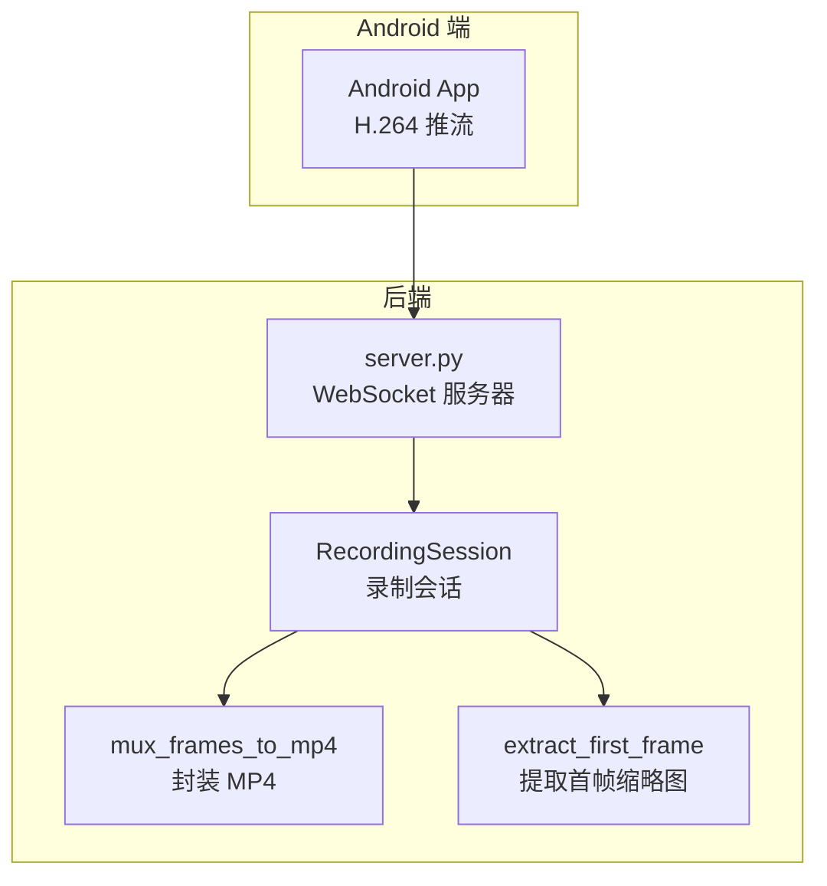
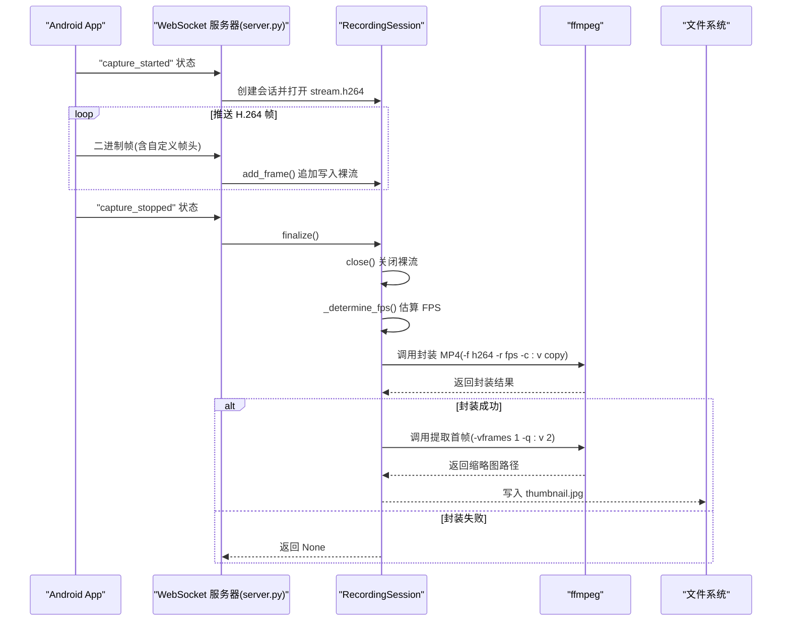
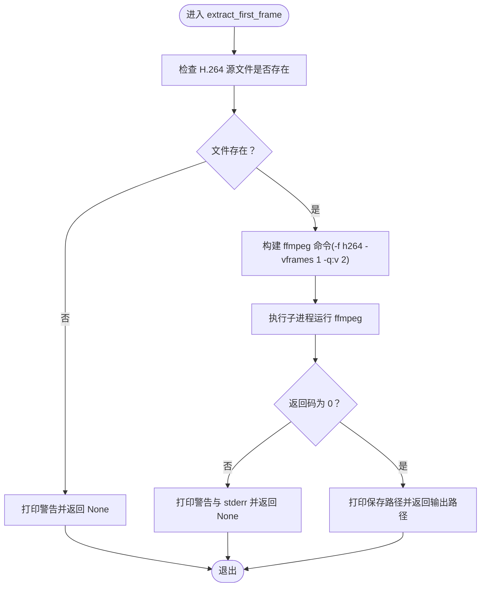
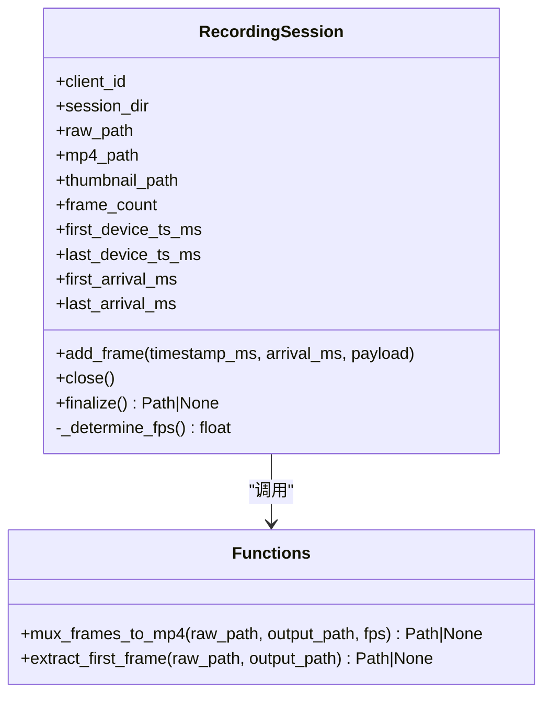
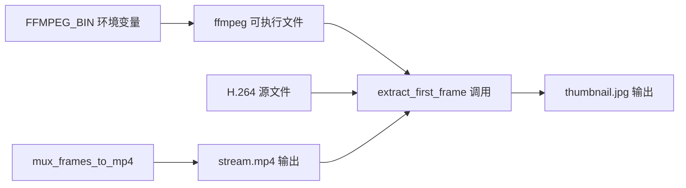

# 提取首帧生成缩略图

<cite>
**本文引用的文件**
- [server.py](file://backend/server.py)
- [README.md](file://backend/README.md)
- [android-camera/README.md](file://android-camera/README.md)
</cite>

## 目录
1. [简介](#简介)
2. [项目结构](#项目结构)
3. [核心组件](#核心组件)
4. [架构总览](#架构总览)
5. [详细组件分析](#详细组件分析)
6. [依赖分析](#依赖分析)
7. [性能考量](#性能考量)
8. [故障排查指南](#故障排查指南)
9. [结论](#结论)
10. [附录](#附录)

## 简介
本文围绕 extract_first_frame 函数展开，系统阐述其如何利用 ffmpeg 从 H.264 裸流中提取第一帧并保存为高质量 JPEG 缩略图。重点解释命令行参数 -vframes 1 的作用（仅输出一帧）与 -q:v 2 的含义（最高 JPEG 质量等级），说明通过 FFMPEG_BIN 环境变量灵活指定 ffmpeg 可执行文件路径的方式，并梳理在原始文件不存在时的警告逻辑。结合 RecordingSession.finalize() 的调用流程，阐明缩略图在录制会话结束后的用途与生成时机。最后提供初学者与资深开发者分别适用的成功与失败日志示例、优化建议与无头服务器环境配置要点。

## 项目结构
- 后端服务器位于 backend/server.py，负责接收 Android 相机 App 推送的 H.264 帧，按会话写入磁盘，结束时封装为 MP4，并提取首帧生成缩略图。
- README.md 提供了 extract_first_frame 的使用说明、环境变量 FFMPEG_BIN 的配置方式以及典型日志输出示例。
- android-camera/README.md 描述了 Android 端如何在采集阶段完成视频旋转，确保后端无需再次旋转，从而提升整体效率。

图表来源
- [server.py](file://backend/server.py#L26-L88)
- [server.py](file://backend/server.py#L150-L179)
- [server.py](file://backend/server.py#L181-L208)
- [android-camera/README.md](file://android-camera/README.md#L31-L37)

章节来源
- [server.py](file://backend/server.py#L26-L88)
- [README.md](file://backend/README.md#L112-L114)

## 核心组件
- extract_first_frame(raw_path: Path, output_path: Path) -> Optional[Path]
  - 功能：从 H.264 裸流中提取第一帧并保存为 JPEG。
  - 关键点：
    - 输入文件存在性检查：不存在则打印警告并返回 None。
    - 使用 ffmpeg 命令行，输入格式为 h264，显式指定 -vframes 1 仅输出一帧，-q:v 2 为最高 JPEG 质量等级。
    - 通过 os.environ.get("FFMPEG_BIN", "ffmpeg") 获取可执行文件路径，支持自定义路径。
    - 成功时打印保存路径，失败时打印警告与 stderr。
- RecordingSession.finalize() -> Optional[Path]
  - 功能：结束会话，关闭裸流文件，估算 FPS，封装 MP4，若成功则提取首帧生成缩略图。
  - 关键点：在封装 MP4 成功后调用 extract_first_frame，确保缩略图与 MP4 使用同一份 H.264 源。

章节来源
- [server.py](file://backend/server.py#L181-L208)
- [server.py](file://backend/server.py#L64-L78)

## 架构总览
下图展示了从 Android App 推送 H.264 帧到后端生成缩略图的关键流程，包括 RecordingSession 的生命周期、MP4 封装与缩略图提取的时序关系。

图表来源
- [server.py](file://backend/server.py#L26-L88)
- [server.py](file://backend/server.py#L150-L179)
- [server.py](file://backend/server.py#L181-L208)

## 详细组件分析

### extract_first_frame 函数详解
- 参数与返回
  - 输入：raw_path（H.264 源文件路径）、output_path（缩略图输出路径）
  - 返回：封装成功时返回输出路径，否则返回 None
- 命令行参数解析
  - -f h264：明确输入为裸 H.264 流
  - -vframes 1：仅输出一帧，即第一帧
  - -q:v 2：设置 JPEG 编码质量等级，数值越小质量越高（2 为最高质量）
  - -y：覆盖输出文件
- 环境变量与可执行文件路径
  - 通过 os.environ.get("FFMPEG_BIN", "ffmpeg") 获取 ffmpeg 可执行文件路径，若未设置则使用系统 PATH 中的 ffmpeg
  - README.md 提供了设置 FFMPEG_BIN 的示例与说明
- 错误处理与日志
  - 输入文件不存在：打印警告并返回 None
  - ffmpeg 返回非 0：打印警告与 stderr，返回 None
  - 成功：打印保存路径并返回输出路径

图表来源
- [server.py](file://backend/server.py#L181-L208)
- [README.md](file://backend/README.md#L112-L114)

章节来源
- [server.py](file://backend/server.py#L181-L208)
- [README.md](file://backend/README.md#L112-L114)

### RecordingSession.finalize() 与缩略图生成时机
- finalize() 的职责
  - 关闭裸流文件
  - 估算 FPS（优先使用服务器到达时间估算，其次设备时间戳，最后保底 10 FPS）
  - 调用 mux_frames_to_mp4 封装 MP4（-f h264 -r fps -c:v copy）
  - 若封装成功，则调用 extract_first_frame 生成缩略图
- 缩略图用途
  - 作为 MP4 的封面或预览图，便于快速浏览与检索
  - 由于视频已在 Android 端旋转完成，后端无需再次旋转，直接提取首帧即可

图表来源
- [server.py](file://backend/server.py#L26-L88)
- [server.py](file://backend/server.py#L150-L179)
- [server.py](file://backend/server.py#L181-L208)

章节来源
- [server.py](file://backend/server.py#L64-L78)
- [server.py](file://backend/server.py#L80-L133)

### 命令行参数与质量控制
- -vframes 1
  - 作用：仅输出一帧，即第一帧，避免生成多帧导致的冗余与资源浪费
- -q:v 2
  - 作用：设置 JPEG 编码质量等级，数值越小质量越高（2 为最高质量）
  - 适用场景：对缩略图清晰度要求较高，可接受稍大的文件体积
- FFMPEG_BIN 环境变量
  - 作用：灵活指定 ffmpeg 可执行文件路径，便于在不同部署环境中定制
  - 设置方式：README.md 提供了示例与说明

章节来源
- [server.py](file://backend/server.py#L181-L208)
- [README.md](file://backend/README.md#L112-L114)

### 典型日志输出示例

- 成功生成缩略图（初学者视角）
  - 日志片段（来源于 README.md 的运行说明与 Android 端 README.md 的输出示例）：
    - [Info]: FPS estimate (server) frame_count=57 -> 4.81
    - [Info]: Thumbnail saved to recordings/<client>_<timestamp>/thumbnail.jpg
    - [Info]: MP4 saved to recordings/<client>_<timestamp>/stream.mp4
  - 说明：会话结束时，后端估算 FPS 并生成缩略图与 MP4，日志清晰展示生成结果。

- 失败或跳过（初学者视角）
  - 原因：H.264 源文件不存在
    - [Warning]: Raw H.264 file not found; skip thumbnail extraction.
  - 原因：ffmpeg 封装失败
    - [Error]: ffmpeg failed to mux MP4
    - [Warning]: MP4 generation skipped (no frames or muxing error).
  - 原因：ffmpeg 提取缩略图失败
    - [Warning]: ffmpeg failed to extract thumbnail

- 成功与失败的对比（资深开发者视角）
  - 成功：-vframes 1 确保仅提取首帧；-q:v 2 提升质量；FFMPEG_BIN 指向可用路径；源文件存在且可读。
  - 失败：FFMPEG_BIN 指向不存在的路径；源文件被删除或权限不足；ffmpeg 未安装或无执行权限；命令行参数不兼容。

章节来源
- [server.py](file://backend/server.py#L150-L179)
- [server.py](file://backend/server.py#L181-L208)
- [README.md](file://backend/README.md#L112-L114)
- [android-camera/README.md](file://android-camera/README.md#L332-L351)

## 依赖分析
- 组件耦合
  - extract_first_frame 依赖 ffmpeg 可执行文件与 H.264 源文件存在性
  - RecordingSession.finalize() 依赖 mux_frames_to_mp4 的成功结果，再调用 extract_first_frame
- 外部依赖
  - ffmpeg：系统级工具，通过 FFMPEG_BIN 环境变量可定制路径
  - Python 子进程模块：用于执行外部命令并捕获输出
- 潜在风险
  - 环境变量未设置或路径错误：导致 ffmpeg 无法找到
  - 源文件被提前清理或权限不足：导致提取失败
  - ffmpeg 版本与参数不兼容：导致返回码非 0

图表来源
- [server.py](file://backend/server.py#L150-L179)
- [server.py](file://backend/server.py#L181-L208)
- [README.md](file://backend/README.md#L112-L114)

章节来源
- [server.py](file://backend/server.py#L150-L179)
- [server.py](file://backend/server.py#L181-L208)
- [README.md](file://backend/README.md#L112-L114)

## 性能考量
- 无重编码策略
  - 后端始终使用 -c:v copy 直接拷贝视频轨，避免重编码带来的 CPU/GPU 开销与时间延迟
  - Android 端已完成视频旋转，后端无需再次旋转，进一步降低处理成本
- 缩略图质量与体积权衡
  - -q:v 2 为最高质量，文件体积相对较大；若对体积敏感，可适当提高质量等级（数值增大）以换取更小体积
  - -vframes 1 仅提取首帧，避免生成多帧导致的冗余
- 批量处理扩展思路
  - 单会话：在 RecordingSession.finalize() 中按顺序完成封装与缩略图提取
  - 多会话：可引入异步任务队列或并发执行器，对多个会话的缩略图提取进行并行化，注意控制并发度以避免 IO 抖动
- 无头服务器配置要点
  - 确保 ffmpeg 已安装且可通过命令行直接调用
  - 通过 FFMPEG_BIN 指定绝对路径，避免 PATH 解析问题
  - 确认输出目录具有写权限，避免缩略图保存失败
  - 在容器或 Docker 环境中，确保 ffmpeg 的图像编码支持（如 libjpeg）已启用

章节来源
- [server.py](file://backend/server.py#L150-L179)
- [README.md](file://backend/README.md#L112-L114)
- [android-camera/README.md](file://android-camera/README.md#L404-L418)

## 故障排查指南
- 常见问题与定位
  - ffmpeg 未安装或不可执行
    - 现象：返回码非 0，stderr 中包含找不到命令或权限问题
    - 处理：安装 ffmpeg 并确保可执行；或设置 FFMPEG_BIN 指向正确路径
  - H.264 源文件不存在
    - 现象：打印警告并跳过缩略图提取
    - 处理：确认 RecordingSession 是否正确创建与关闭；检查文件路径与权限
  - 封装 MP4 失败
    - 现象：打印错误并跳过缩略图提取
    - 处理：检查 FPS 估算是否合理；确认 -f h264 与 -r fps 参数是否匹配；查看 stderr 获取具体原因
- 日志与调试
  - 成功日志：包含缩略图保存路径与 MP4 保存路径
  - 失败日志：包含警告与 stderr 输出，便于定位问题

章节来源
- [server.py](file://backend/server.py#L150-L179)
- [server.py](file://backend/server.py#L181-L208)
- [README.md](file://backend/README.md#L112-L114)

## 结论
extract_first_frame 通过简洁高效的命令行参数组合，实现了从 H.264 裸流中提取高质量 JPEG 缩略图的目标。配合 RecordingSession.finalize() 的调用流程，缩略图在录制会话结束后生成，既满足了预览与检索需求，又避免了不必要的重编码开销。通过 FFMPEG_BIN 环境变量，系统具备良好的可移植性与可维护性。对于生产环境，建议在无头服务器上确保 ffmpeg 的可用性与图像编码支持，并根据业务需求在质量与体积之间取得平衡。

## 附录
- 相关实现与文档位置
  - extract_first_frame 函数定义与调用：[server.py](file://backend/server.py#L181-L208)
  - RecordingSession.finalize() 调用链：[server.py](file://backend/server.py#L64-L78)
  - mux_frames_to_mp4 封装逻辑与环境变量说明：[server.py](file://backend/server.py#L150-L179)，[README.md](file://backend/README.md#L112-L114)
  - Android 端旋转与预览一致性说明：[android-camera/README.md](file://android-camera/README.md#L31-L37)