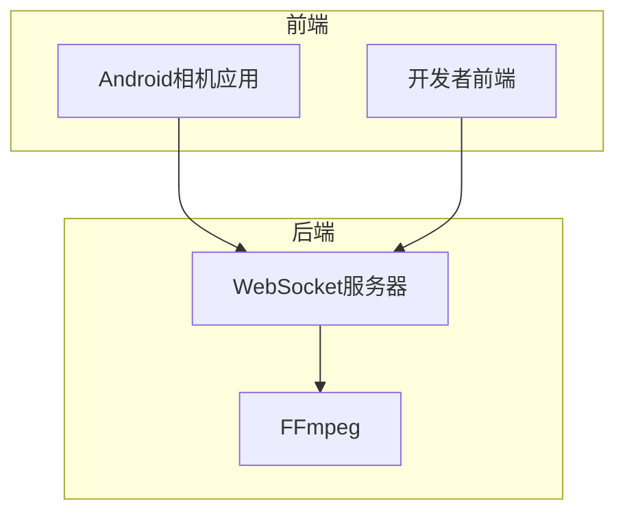
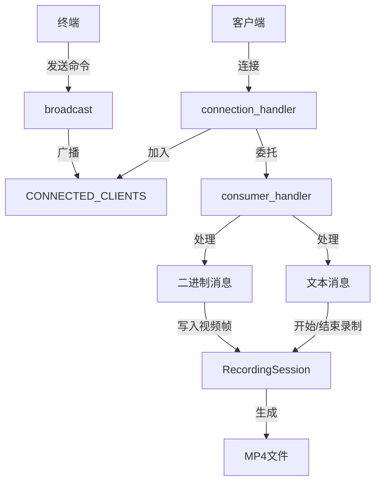
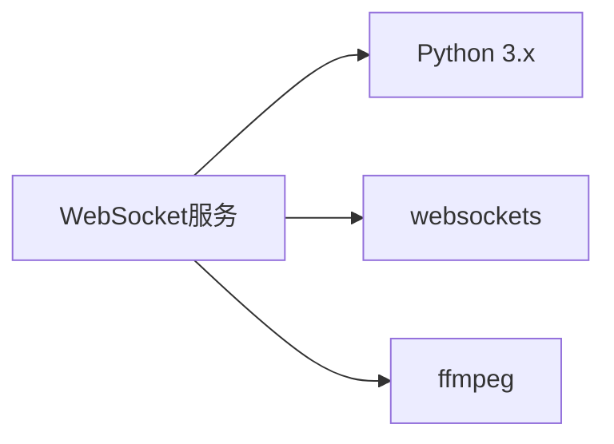

# WebSocket服务

<cite>
**本文档引用的文件**   
- [server.py](file://backend/server.py#L1-L440)
- [README.md](file://backend/README.md#L1-L291)
</cite>

## 目录
1. [引言](#引言)
2. [项目结构](#项目结构)
3. [核心组件](#核心组件)
4. [架构概述](#架构概述)
5. [详细组件分析](#详细组件分析)
6. [依赖分析](#依赖分析)
7. [性能考量](#性能考量)
8. [故障排除指南](#故障排除指南)
9. [结论](#结论)

## 引言
WebSocket服务是本项目的核心，负责接收来自Android相机应用的H.264视频帧，按会话写入磁盘，并在录制结束后封装成MP4文件。该服务通过WebSocket协议与客户端通信，支持文本状态消息和二进制视频帧的处理。服务器还提供了终端控制命令，允许用户通过命令行启动和停止录制。

## 项目结构
项目结构清晰，主要包含以下几个部分：
- `android-camera/`：Android相机应用，负责采集和编码视频。
- `backend/`：后端服务器，负责接收视频帧并进行处理。
- `developer-frontend/`：开发者前端，用于调试和监控。
- `archive/`：历史版本和示例代码。



**Diagram sources**
- [server.py](file://backend/server.py#L1-L440)
- [README.md](file://backend/README.md#L1-L291)

**Section sources**
- [server.py](file://backend/server.py#L1-L50)
- [README.md](file://backend/README.md#L1-L10)

## 核心组件
### connection_handler
`connection_handler`是新客户端连接的入口点。当客户端连接时，该处理器会将连接加入`CONNECTED_CLIENTS`集合，并记录客户端ID和请求路径。然后，它会委托给`consumer_handler`处理具体的消息收发逻辑。

### consumer_handler
`consumer_handler`负责处理来自单个客户端的所有消息。它可以处理文本消息和二进制消息：
- **文本消息**：被视为JSON状态消息，用于开始或结束录制。
- **二进制消息**：被视为H.264视频帧，写入对应的录制会话。

### CONNECTED_CLIENTS
`CONNECTED_CLIENTS`是一个集合，用于跟踪所有当前已连接的客户端。每当有新连接时，`connection_handler`会将连接加入此集合；当连接断开时，`consumer_handler`会在`finally`块中将连接从集合中移除。

**Section sources**
- [server.py](file://backend/server.py#L282-L303)
- [server.py](file://backend/server.py#L234-L280)
- [server.py](file://backend/server.py#L22)

## 架构概述
WebSocket服务的架构设计简洁高效，主要由以下几个部分组成：
- **连接管理**：`connection_handler`负责管理新连接，将连接加入`CONNECTED_CLIENTS`集合。
- **消息处理**：`consumer_handler`负责处理来自客户端的消息，区分文本和二进制消息。
- **录制会话**：`RecordingSession`类负责管理单个客户端的录制会话，包括创建会话目录、写入视频帧和生成MP4文件。
- **广播机制**：`broadcast`函数用于向所有已连接的客户端发送控制命令。



**Diagram sources**
- [server.py](file://backend/server.py#L282-L303)
- [server.py](file://backend/server.py#L234-L280)
- [server.py](file://backend/server.py#L26-L80)
- [server.py](file://backend/server.py#L306-L324)

**Section sources**
- [server.py](file://backend/server.py#L282-L303)
- [server.py](file://backend/server.py#L234-L280)
- [server.py](file://backend/server.py#L26-L80)
- [server.py](file://backend/server.py#L306-L324)

## 详细组件分析
### connection_handler实现
`connection_handler`是新客户端连接的入口点。当客户端连接时，该处理器会执行以下步骤：
1. 将连接加入`CONNECTED_CLIENTS`集合。
2. 记录客户端ID和请求路径。
3. 打印连接日志，包括客户端ID和总连接数。
4. 委托给`consumer_handler`处理具体的消息收发逻辑。
5. 在`finally`块中，无论连接是否正常关闭，都会将连接从`CONNECTED_CLIENTS`集合中移除，并打印断开连接的日志。

```python
async def connection_handler(websocket):
    """
    新客户端连接入口：
    - 记录客户端 ID 与请求路径
    - 将连接加入 CONNECTED_CLIENTS，方便广播控制命令
    - 委托给 consumer_handler 处理具体收发逻辑
    """
    CONNECTED_CLIENTS.add(websocket)
    client_id = f"{websocket.remote_address[0]}_{websocket.remote_address[1]}"
    path = websocket.request.path
    print(
        f"[Connection]: New client {client_id} connected from {path}. Total clients: {len(CONNECTED_CLIENTS)}"
    )
    try:
        await consumer_handler(websocket)
    finally:
        CONNECTED_CLIENTS.remove(websocket)
        print(
            f"[Connection]: Client {client_id} removed. Total clients: {len(CONNECTED_CLIENTS)}"
        )
```

**Section sources**
- [server.py](file://backend/server.py#L282-L303)

### consumer_handler实现
`consumer_handler`负责处理来自单个客户端的所有消息。它通过`async for`循环接收消息，并根据消息类型进行处理：
- **文本消息**：解析为JSON状态消息，用于开始或结束录制。
- **二进制消息**：解析为H.264视频帧，写入对应的录制会话。

```python
async def consumer_handler(websocket):
    """
    处理来自单个客户端的所有消息：
    - 文本消息：视为 JSON 状态（ClientStatus），用于开始 / 结束录制
    - 二进制消息：视为一帧 H.264 数据（带自定义帧头），写入对应会话
    """
    client_id = f"{websocket.remote_address[0]}_{websocket.remote_address[1]}"
    print(f"[Info]: Client {client_id} consumer handler started.")
    
    try:
        async for message in websocket:
            if isinstance(message, str):
                # 文本：来自 App 的 JSON 状态消息
                print(f"[App Status] from {client_id}: {message}")
                try:
                    data = json.loads(message)
                    status = data.get("status")
                    if status == "capture_started":
                        start_recording(websocket, client_id)
                    elif status == "capture_stopped":
                        finalize_recording(websocket, client_id)
                except (json.JSONDecodeError, TypeError):
                    # 不是我们关心的 JSON，忽略
                    pass
            else:
                # 二进制：H.264 帧（带自定义帧头）
                session = RECORDING_SESSIONS.get(websocket)
                if not session:
                    print(f"[Warning]: Received frame from {client_id} without active session.")
                    continue
                try:
                    timestamp_ms, frame_seq, payload = parse_frame_packet(message)
                except ValueError as err:
                    print(f"[Error]: Failed to parse frame from {client_id} - {err}")
                    continue
                print(
                    f"[Frame]: {client_id} seq={frame_seq} timestamp={timestamp_ms}ms size={len(payload)} bytes"
                )
                arrival_ms = int(asyncio.get_running_loop().time() * 1000)
                session.add_frame(timestamp_ms, arrival_ms, payload)
    except websockets.exceptions.ConnectionClosed as e:
        print(f"[Connection]: Client {client_id} disconnected: {e.code} {e.reason}")
    finally:
        finalize_recording(websocket, client_id)
        print(f"[Info]: Recording session for {client_id} closed.")
```

**Section sources**
- [server.py](file://backend/server.py#L234-L280)

### CONNECTED_CLIENTS集合
`CONNECTED_CLIENTS`是一个集合，用于跟踪所有当前已连接的客户端。每当有新连接时，`connection_handler`会将连接加入此集合；当连接断开时，`consumer_handler`会在`finally`块中将连接从集合中移除。这种设计确保了连接状态的准确性和一致性。

```python
# 跟踪当前已连接的客户端及其录制会话
CONNECTED_CLIENTS = set()
RECORDING_SESSIONS: Dict[websockets.WebSocketServerProtocol, "RecordingSession"] = {}
```

**Section sources**
- [server.py](file://backend/server.py#L22-L23)

## 依赖分析
WebSocket服务依赖于以下组件：
- **Python 3.x**：运行环境。
- **websockets**：WebSocket库，用于处理WebSocket连接。
- **ffmpeg**：视频处理工具，用于将H.264裸流封装成MP4文件。



**Diagram sources**
- [requirements.txt](file://backend/requirements.txt#L1-L3)
- [README.md](file://backend/README.md#L278-L283)

**Section sources**
- [requirements.txt](file://backend/requirements.txt#L1-L3)
- [README.md](file://backend/README.md#L278-L283)

## 性能考量
### 高并发连接处理
为了处理高并发连接，WebSocket服务采用了异步编程模型。`asyncio`库提供了高效的事件循环，能够同时处理多个连接。`connection_handler`和`consumer_handler`都是异步函数，能够在不阻塞的情况下处理多个客户端的请求。

### 异常断开处理
当客户端异常断开时，`consumer_handler`会捕获`websockets.exceptions.ConnectionClosed`异常，并在`finally`块中调用`finalize_recording`函数，确保录制会话被正确结束。这种设计保证了即使在异常情况下，录制数据也不会丢失。

**Section sources**
- [server.py](file://backend/server.py#L234-L280)
- [server.py](file://backend/server.py#L282-L303)

## 故障排除指南
### 连接问题
- **检查网络连接**：确保客户端和服务器之间的网络连接正常。
- **检查端口**：确保服务器监听的端口没有被其他程序占用。
- **检查防火墙**：确保防火墙没有阻止WebSocket连接。

### 录制问题
- **检查ffmpeg**：确保`ffmpeg`已正确安装，并且可以在命令行中直接调用。
- **检查文件权限**：确保服务器有权限在`recordings/`目录下创建文件和目录。
- **检查日志**：查看服务器日志，查找可能的错误信息。

**Section sources**
- [server.py](file://backend/server.py#L150-L178)
- [README.md](file://backend/README.md#L112-L114)

## 结论
WebSocket服务通过`connection_handler`和`consumer_handler`实现了高效的连接管理和消息处理。`CONNECTED_CLIENTS`集合确保了连接状态的准确跟踪。通过异步编程模型和异常处理机制，服务能够处理高并发连接和异常断开情况。对于初学者，连接生命周期的示例提供了清晰的指导；对于经验丰富的开发者，健壮性设计考量提供了深入的理解。