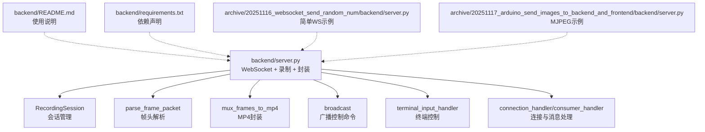
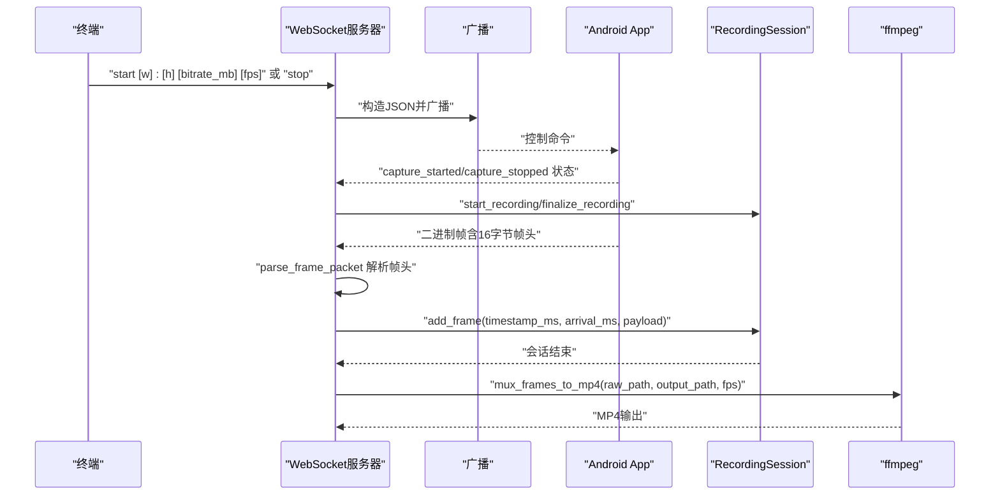
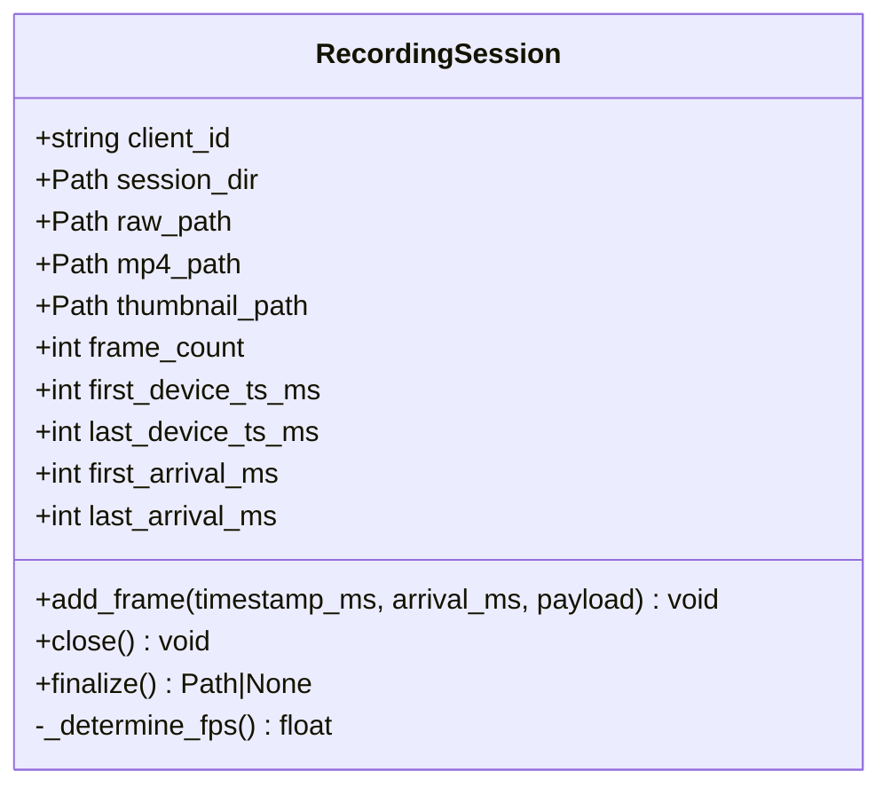
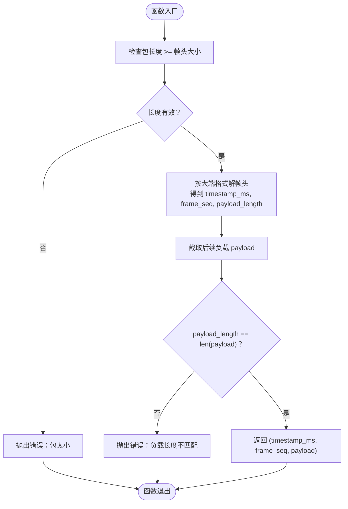
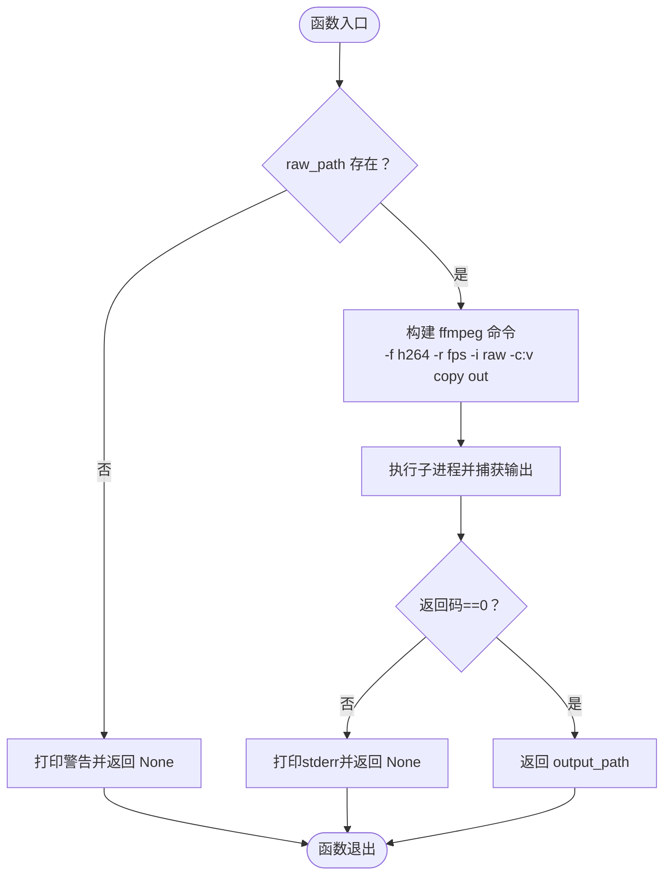
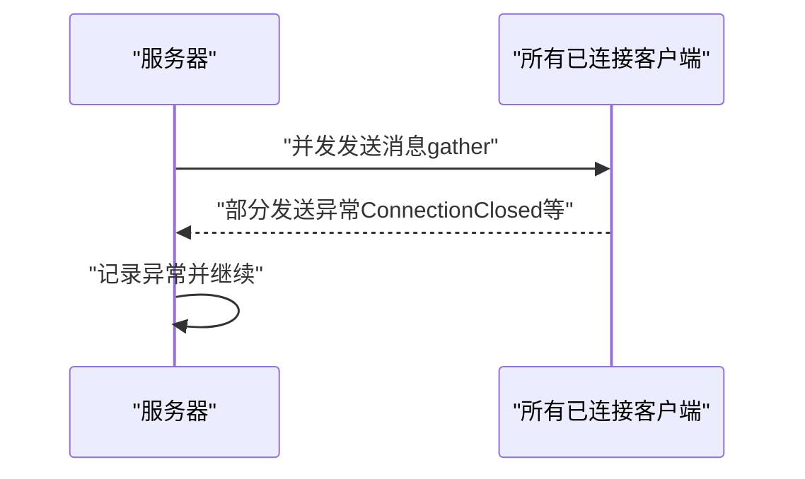
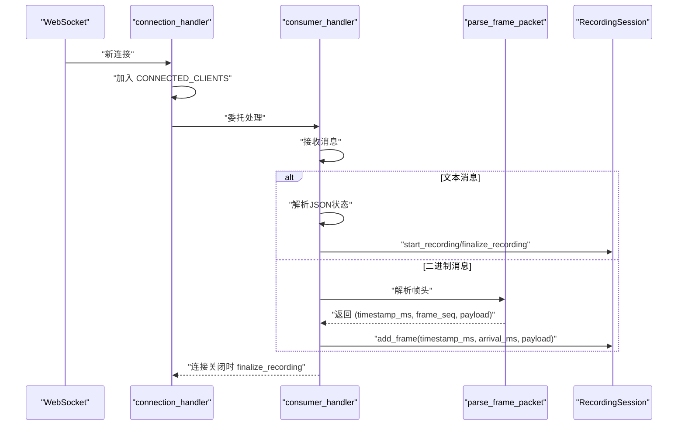
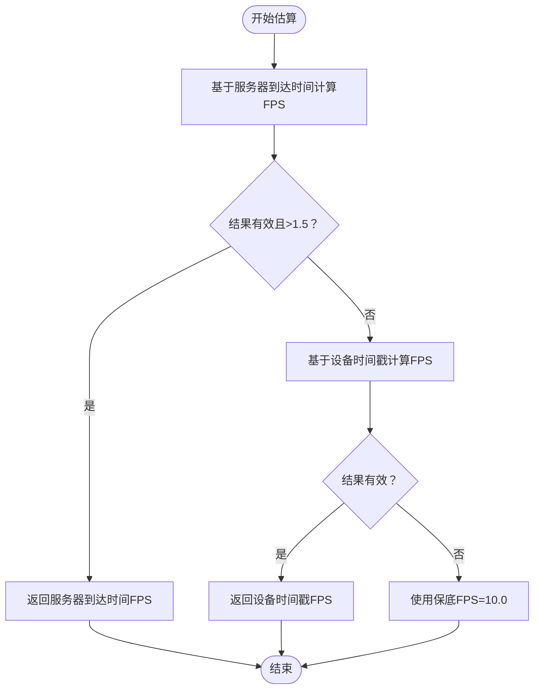
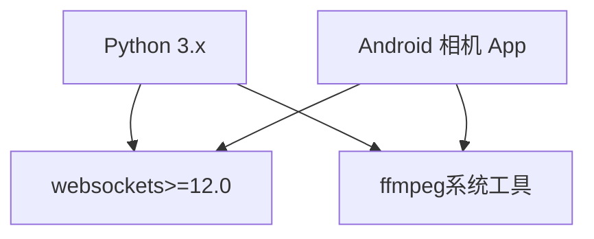

# 后端服务器

<cite>
**本文引用的文件**
- [backend/server.py](file://backend/server.py)
- [backend/README.md](file://backend/README.md)
- [backend/requirements.txt](file://backend/requirements.txt)
- [archive/20251116_websocket_send_random_num/backend/server.py](file://archive/20251116_websocket_send_random_num/backend/server.py)
- [archive/20251116_websocket_send_random_num/backend/README.md](file://archive/20251116_websocket_send_random_num/backend/README.md)
- [archive/20251117_arduino_send_images_to_backend_and_frontend/backend/server.py](file://archive/20251117_arduino_send_images_to_backend_and_frontend/backend/server.py)
- [archive/20251117_arduino_send_images_to_backend_and_frontend/backend/README.md](file://archive/20251117_arduino_send_images_to_backend_and_frontend/backend/README.md)
- [android-camera/app/src/main/AndroidManifest.xml](file://android-camera/app/src/main/AndroidManifest.xml)
</cite>

## 目录
1. [简介](#简介)
2. [项目结构](#项目结构)
3. [核心组件](#核心组件)
4. [架构总览](#架构总览)
5. [详细组件分析](#详细组件分析)
6. [依赖关系分析](#依赖关系分析)
7. [性能考量](#性能考量)
8. [故障排查指南](#故障排查指南)
9. [结论](#结论)
10. [附录](#附录)

## 简介
本文件围绕后端服务器展开，重点覆盖以下方面：
- WebSocket 服务器的建立与连接生命周期管理
- 录制会话管理（RecordingSession）与会话目录组织
- 使用 ffmpeg 对裸 H.264 流进行 MP4 封装
- parse_frame_packet 函数如何解析自定义的16字节帧头
- broadcast 函数如何将控制命令分发给所有连接的客户端
- mux_frames_to_mp4 函数的参数与行为
- 基于设备与服务器时间戳估算 FPS 的逻辑
- 初学者服务器启动与控制示例
- 高并发连接场景下的性能优化建议

本服务器面向 Android 相机 App，接收 H.264 帧（含自定义帧头），按会话落盘并最终封装为 MP4，同时支持通过终端广播控制命令。

## 项目结构
本仓库包含多个示例后端服务器实现，其中与本文主题最相关的是 backend 目录中的 server.py。其他目录展示了不同场景的 WebSocket 服务器实现，便于对比理解。

图表来源
- [backend/server.py](file://backend/server.py#L1-L440)
- [backend/README.md](file://backend/README.md#L1-L291)
- [backend/requirements.txt](file://backend/requirements.txt#L1-L3)
- [archive/20251116_websocket_send_random_num/backend/server.py](file://archive/20251116_websocket_send_random_num/backend/server.py#L1-L52)
- [archive/20251117_arduino_send_images_to_backend_and_frontend/backend/server.py](file://archive/20251117_arduino_send_images_to_backend_and_frontend/backend/server.py#L1-L290)

章节来源
- [backend/server.py](file://backend/server.py#L1-L440)
- [backend/README.md](file://backend/README.md#L1-L291)
- [backend/requirements.txt](file://backend/requirements.txt#L1-L3)

## 核心组件
- 录制会话 RecordingSession：负责为每个客户端创建独立会话目录，写入裸 H.264，记录时间戳，结束时估算 FPS 并调用 ffmpeg 封装为 MP4。
- 帧头解析 parse_frame_packet：解析自定义16字节帧头（设备时间戳、帧序号、负载长度），并校验负载长度一致性。
- MP4 封装 mux_frames_to_mp4：调用 ffmpeg，显式指定帧率并直接拷贝视频轨，避免时间轴错误。
- 广播 broadcast：将控制命令广播给所有已连接客户端，使用 asyncio.gather 并记录发送异常。
- 终端控制 terminal_input_handler：解析 start/stop 命令，构造 JSON payload 并广播。
- 连接与消息处理 connection_handler/consumer_handler：维护 CONNECTED_CLIENTS，处理文本状态与二进制帧。

章节来源
- [backend/server.py](file://backend/server.py#L26-L133)
- [backend/server.py](file://backend/server.py#L135-L148)
- [backend/server.py](file://backend/server.py#L150-L179)
- [backend/server.py](file://backend/server.py#L305-L324)
- [backend/server.py](file://backend/server.py#L282-L303)
- [backend/server.py](file://backend/server.py#L233-L280)

## 架构总览
后端服务器采用异步事件驱动模型，使用 websockets 库提供 WebSocket 服务。整体流程如下：
- 启动时创建 WebSocket 服务，绑定到 0.0.0.0:50001
- 终端输入任务持续监听用户命令，构造 JSON 控制指令并通过 broadcast 广播
- 每个新连接进入 connection_handler，加入 CONNECTED_CLIENTS，随后委托 consumer_handler 处理消息
- consumer_handler 根据消息类型分别处理状态上报与二进制帧
- 二进制帧经 parse_frame_packet 解析后写入对应 RecordingSession
- 会话结束时调用 finalize，估算 FPS 并通过 mux_frames_to_mp4 封装为 MP4

图表来源
- [backend/server.py](file://backend/server.py#L326-L424)
- [backend/server.py](file://backend/server.py#L305-L324)
- [backend/server.py](file://backend/server.py#L233-L280)
- [backend/server.py](file://backend/server.py#L135-L148)
- [backend/server.py](file://backend/server.py#L150-L179)

## 详细组件分析

### 录制会话管理（RecordingSession）
- 会话目录：每个会话在 recordings/ 下创建独立目录，文件名包含客户端标识与时间戳，包含 stream.h264、stream.mp4、thumbnail.jpg。
- 时间戳记录：记录首尾帧的设备时间戳与服务器到达时间，用于事后估算 FPS。
- 结束流程：finalize 关闭裸流文件，估算 FPS，调用 mux_frames_to_mp4 封装 MP4，并提取首帧作为缩略图。

图表来源
- [backend/server.py](file://backend/server.py#L26-L133)

章节来源
- [backend/server.py](file://backend/server.py#L26-L133)

### 帧头解析（parse_frame_packet）
- 帧头格式：大端序，包含设备时间戳（uint64）、帧序号（uint32）、后续 H.264 负载长度（uint32），共16字节。
- 校验逻辑：检查包长度至少包含帧头；截取负载并校验长度与声明一致；返回三元组（设备时间戳、帧序号、裸 H.264 数据）。

图表来源
- [backend/server.py](file://backend/server.py#L135-L148)

章节来源
- [backend/server.py](file://backend/server.py#L135-L148)

### MP4 封装（mux_frames_to_mp4）
- 参数：raw_path（裸 H.264 输入路径）、output_path（MP4 输出路径）、fps（显式帧率）。
- 行为：若裸流不存在则跳过；否则调用 ffmpeg，输入格式为 h264，显式帧率 -r fps，视频轨直接拷贝 -c:v copy；若返回码非0，记录 stderr 并返回 None。

图表来源
- [backend/server.py](file://backend/server.py#L150-L179)

章节来源
- [backend/server.py](file://backend/server.py#L150-L179)

### 广播控制命令（broadcast）
- 目的：将控制命令广播给所有已连接客户端，当前主要用于从终端向所有 Android App 发送 start/stop_capture 指令。
- 实现：使用 asyncio.gather 并允许异常，记录发送失败的客户端；若无客户端则打印提示。

图表来源
- [backend/server.py](file://backend/server.py#L305-L324)

章节来源
- [backend/server.py](file://backend/server.py#L305-L324)

### 连接与消息处理（connection_handler/consumer_handler）
- connection_handler：为每个新连接计算 client_id，记录请求路径，加入 CONNECTED_CLIENTS，然后委托 consumer_handler。
- consumer_handler：区分文本消息（JSON 状态）与二进制消息（H.264 帧）。文本消息用于开始/结束录制；二进制消息先解析帧头，再写入会话，并记录服务器到达时间。

图表来源
- [backend/server.py](file://backend/server.py#L282-L303)
- [backend/server.py](file://backend/server.py#L233-L280)
- [backend/server.py](file://backend/server.py#L135-L148)

章节来源
- [backend/server.py](file://backend/server.py#L282-L303)
- [backend/server.py](file://backend/server.py#L233-L280)
- [backend/server.py](file://backend/server.py#L135-L148)

### FPS 估算逻辑
- 优先使用“服务器到达时间”估算，要求大于 1.5fps 才认为可信；否则回退到“设备时间戳”估算；若两者均不可用，使用保底 10.0 FPS。
- 估算公式：frame_count / (duration_ms / 1000)，并对结果进行边界约束（最小1.0，最大60.0）。

图表来源
- [backend/server.py](file://backend/server.py#L80-L133)

章节来源
- [backend/server.py](file://backend/server.py#L80-L133)

### 终端控制命令（terminal_input_handler）
- 支持 start 与 stop 命令；start 可携带宽高比、码率（MB）、目标 FPS；内部构造 JSON payload 并广播。
- 对参数进行格式与范围校验，非法输入使用默认值并打印错误提示。

章节来源
- [backend/server.py](file://backend/server.py#L326-L424)

## 依赖关系分析
- 依赖库：websockets（>=12.0），用于提供 WebSocket 服务。
- 系统工具：ffmpeg（可选环境变量 FFMPEG_BIN 指定路径），用于 H.264 封装。
- Android App 权限：相机与网络权限，用于推送 H.264 帧与建立 WebSocket 连接。

图表来源
- [backend/requirements.txt](file://backend/requirements.txt#L1-L3)
- [backend/server.py](file://backend/server.py#L150-L179)
- [android-camera/app/src/main/AndroidManifest.xml](file://android-camera/app/src/main/AndroidManifest.xml#L1-L32)

章节来源
- [backend/requirements.txt](file://backend/requirements.txt#L1-L3)
- [backend/server.py](file://backend/server.py#L150-L179)
- [android-camera/app/src/main/AndroidManifest.xml](file://android-camera/app/src/main/AndroidManifest.xml#L1-L32)

## 性能考量
- 并发连接：使用 asyncio 与 websockets，天然支持高并发；broadcast 使用 asyncio.gather 并允许异常，避免阻塞。
- I/O 优化：裸 H.264 直接写入磁盘，避免额外编码；MP4 封装使用 -c:v copy，零重编码，速度快且无损。
- 时间戳估算：优先使用服务器到达时间，减少网络抖动影响；若不可用再回退设备时间戳。
- 资源释放：consumer_handler 在连接关闭时调用 finalize_recording，确保会话资源回收。
- 建议：
  - 合理设置 ffmpeg 帧率，避免时间轴错误
  - 控制录制目录与文件命名，避免磁盘空间不足
  - 对于极高并发，可考虑连接池、背压策略与限速
  - 使用环境变量 FFMPEG_BIN 指定高性能 ffmpeg 路径

[本节为通用性能建议，不直接分析具体文件]

## 故障排查指南
- ffmpeg 未安装或不可执行：mux_frames_to_mp4 返回 None 并打印 stderr；可通过环境变量 FFMPEG_BIN 指定路径。
- 帧头长度不匹配：parse_frame_packet 抛出错误并记录；检查 Android App 发送的帧头格式是否符合约定。
- 客户端未处于录制会话：二进制帧到达时若无活动会话，将打印警告并忽略；确认 App 先上报 capture_started。
- 广播失败：broadcast 记录异常客户端；检查客户端连接状态与网络。
- 终端命令无效：unknown command 会在终端打印错误提示；检查命令格式与参数。

章节来源
- [backend/server.py](file://backend/server.py#L150-L179)
- [backend/server.py](file://backend/server.py#L135-L148)
- [backend/server.py](file://backend/server.py#L305-L324)
- [backend/server.py](file://backend/server.py#L233-L280)
- [backend/server.py](file://backend/server.py#L326-L424)

## 结论
本后端服务器围绕 Android 相机 App 的 H.264 推流需求，提供了完整的 WebSocket 接收、会话管理、帧头解析与 MP4 封装能力。其设计强调：
- 明确的帧头协议与严格的长度校验
- 基于设备与服务器时间戳的稳健 FPS 估算
- 零重编码的高效封装策略
- 通过终端广播统一控制所有客户端
- 异步事件驱动模型，具备良好的并发扩展性

对于初学者，建议先按照 README 的步骤安装依赖与 ffmpeg，启动服务器并使用终端命令控制录制；对于有经验的开发者，可结合高并发场景进行资源与 I/O 优化。

[本节为总结性内容，不直接分析具体文件]

## 附录

### 初学者使用示例
- 安装依赖与 ffmpeg
- 启动服务器
- 在终端输入 start/stop 控制录制
- 查看 recordings 目录中的 MP4 与缩略图

章节来源
- [backend/README.md](file://backend/README.md#L217-L276)

### 与其他示例的对比
- 简单随机数示例：仅演示基本 WebSocket 连接与消息打印，适合理解连接生命周期。
- MJPEG 示例：展示多 endpoint（/esp、/dev）与图片管理、FPS 统计，便于理解路由与模块化设计。

章节来源
- [archive/20251116_websocket_send_random_num/backend/server.py](file://archive/20251116_websocket_send_random_num/backend/server.py#L1-L52)
- [archive/20251117_arduino_send_images_to_backend_and_frontend/backend/server.py](file://archive/20251117_arduino_send_images_to_backend_and_frontend/backend/server.py#L1-L290)