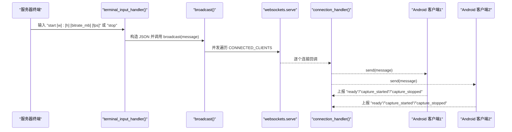
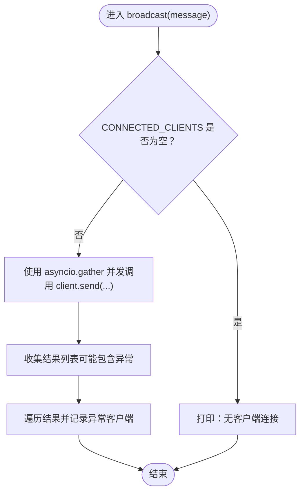
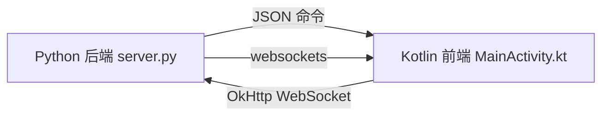

# 命令广播

<cite>
**本文引用的文件**
- [server.py](file://backend/server.py)
- [README.md](file://backend/README.md)
- [MainActivity.kt](file://android-camera/app/src/main/java/com/example/lablogcamera/MainActivity.kt)
</cite>

## 目录
1. [引言](#引言)
2. [项目结构](#项目结构)
3. [核心组件](#核心组件)
4. [架构总览](#架构总览)
5. [详细组件分析](#详细组件分析)
6. [依赖关系分析](#依赖关系分析)
7. [性能考量](#性能考量)
8. [故障排查指南](#故障排查指南)
9. [结论](#结论)
10. [附录](#附录)

## 引言
本篇文档围绕“命令广播”展开，聚焦后端服务器如何将来自终端的控制命令（如 start_capture、stop_capture）以 JSON 格式广播给所有已连接的 Android 客户端。我们将深入解析 broadcast 函数的实现细节，解释其如何使用 asyncio.gather 并发发送消息，以及 return_exceptions=True 如何优雅地处理个别客户端发送失败的情况。同时，我们将阐明 CONNECTED_CLIENTS 集合在此过程中的作用，并提供从终端输入命令到 Android 客户端接收与执行的完整流程示例，最后给出在大规模连接下的性能优化建议。

## 项目结构
该项目采用前后端分离的结构：
- 后端：Python + websockets，负责 WebSocket 服务、录制会话管理、命令广播与终端交互。
- Android 前端：Kotlin + OkHttp WebSocket，负责连接后端、接收命令、启动/停止推流、上报状态。

```mermaid
graph TB
subgraph "后端"
S["server.py<br/>WebSocket 服务器"]
T["README.md<br/>使用说明与协议"]
end
subgraph "Android 前端"
A["MainActivity.kt<br/>OkHttp WebSocket 客户端"]
end
T --> S
S <- --> A
```

图表来源
- [server.py](file://backend/server.py#L305-L324)
- [README.md](file://backend/README.md#L160-L214)
- [MainActivity.kt](file://android-camera/app/src/main/java/com/example/lablogcamera/MainActivity.kt#L867-L900)

章节来源
- [server.py](file://backend/server.py#L305-L324)
- [README.md](file://backend/README.md#L160-L214)
- [MainActivity.kt](file://android-camera/app/src/main/java/com/example/lablogcamera/MainActivity.kt#L867-L900)

## 核心组件
- 广播函数 broadcast(message: str)：将 JSON 命令并发发送给所有 CONNECTED_CLIENTS。
- 终端输入处理器 terminal_input_handler()：读取服务器终端输入，构造 JSON 命令并通过 broadcast 广播。
- 连接处理器 connection_handler(websocket)：新连接加入 CONNECTED_CLIENTS，断开时移除。
- Android 客户端命令处理 handleServerCommand(commandStr: String)：解析 JSON 命令并启动/停止推流。

章节来源
- [server.py](file://backend/server.py#L305-L324)
- [server.py](file://backend/server.py#L326-L423)
- [server.py](file://backend/server.py#L282-L303)
- [MainActivity.kt](file://android-camera/app/src/main/java/com/example/lablogcamera/MainActivity.kt#L902-L942)

## 架构总览
后端服务器通过 websockets.serve 提供 WebSocket 服务，维护 CONNECTED_CLIENTS 集合，用于广播控制命令。终端输入处理器将 start/stop 命令转换为 JSON，调用 broadcast 并发发送至所有已连接客户端。Android 客户端在连接建立后立即上报“ready”状态，并在收到 start_capture/stop_capture 命令后执行相应动作。



图表来源
- [server.py](file://backend/server.py#L305-L324)
- [server.py](file://backend/server.py#L326-L423)
- [server.py](file://backend/server.py#L282-L303)
- [MainActivity.kt](file://android-camera/app/src/main/java/com/example/lablogcamera/MainActivity.kt#L867-L900)
- [MainActivity.kt](file://android-camera/app/src/main/java/com/example/lablogcamera/MainActivity.kt#L902-L942)

## 详细组件分析

### 广播函数 broadcast 的实现与行为
- 并发发送：broadcast 使用 asyncio.gather 展开 CONNECTED_CLIENTS，对每个客户端调用 client.send(message)。
- 异常处理：通过 return_exceptions=True，gather 不会因个别客户端发送失败而中断整体流程，返回的结果列表中包含异常对象，便于后续日志记录。
- 优雅降级：当 CONNECTED_CLIENTS 为空时，打印“没有客户端连接”的提示；当存在客户端时，打印发送数量与消息摘要，随后遍历结果记录失败的客户端。



图表来源
- [server.py](file://backend/server.py#L305-L324)

章节来源
- [server.py](file://backend/server.py#L305-L324)

### 终端输入与命令构造
- 终端输入处理器 terminal_input_handler() 通过 input() 读取命令字符串，解析 start/stop。
- start 命令支持可选参数：宽高比、码率（MB）、目标 FPS。若提供宽高比，则 payload 中包含 aspectRatio 字段；否则省略该字段，由客户端使用当前 UI 选择的宽高比。
- stop 命令构造为 { "command": "stop_capture" }，同样通过 broadcast 广播。

章节来源
- [server.py](file://backend/server.py#L326-L423)

### 连接生命周期与 CONNECTED_CLIENTS
- 连接入口 connection_handler(websocket)：在连接建立时将 websocket 加入 CONNECTED_CLIENTS；在 finally 中断开时移除。
- 该集合是广播的唯一来源，确保 broadcast 能够遍历所有当前活跃连接。

章节来源
- [server.py](file://backend/server.py#L282-L303)

### Android 客户端命令接收与执行
- 连接建立后，客户端立即上报状态（例如 "ready"），并在收到 start_capture/stop_capture 命令后执行相应动作。
- start_capture：解析 payload，根据是否包含 aspectRatio 决定是否覆盖本地 UI 选择的宽高比；随后启动推流，按目标码率与帧率发送二进制帧。
- stop_capture：停止推流并上报 "capture_stopped"。

章节来源
- [MainActivity.kt](file://android-camera/app/src/main/java/com/example/lablogcamera/MainActivity.kt#L867-L900)
- [MainActivity.kt](file://android-camera/app/src/main/java/com/example/lablogcamera/MainActivity.kt#L902-L942)
- [MainActivity.kt](file://android-camera/app/src/main/java/com/example/lablogcamera/MainActivity.kt#L1200-L1226)

## 依赖关系分析
- 后端依赖 websockets，用于建立 WebSocket 服务与处理连接。
- Android 前端依赖 OkHttp WebSocket，用于与后端建立连接、发送/接收消息。
- 录制会话与命令广播相互独立：命令广播不依赖录制会话，但客户端在收到 start_capture 后会创建/结束录制会话。



图表来源
- [server.py](file://backend/server.py#L1-L20)
- [MainActivity.kt](file://android-camera/app/src/main/java/com/example/lablogcamera/MainActivity.kt#L1-L120)

章节来源
- [server.py](file://backend/server.py#L1-L20)
- [MainActivity.kt](file://android-camera/app/src/main/java/com/example/lablogcamera/MainActivity.kt#L1-L120)

## 性能考量
- 并发发送的吞吐与延迟
  - broadcast 使用 asyncio.gather 并发发送，适合中小规模连接。在大规模连接场景下，建议：
    - 限制并发度：使用 asyncio.as_completed 或分批发送，避免过多并发导致 CPU/IO 压力。
    - 优先级队列：对关键命令（如 stop）可单独队列，确保及时送达。
- 异常隔离与可观测性
  - return_exceptions=True 使个别客户端发送失败不影响整体广播，但需记录失败客户端以便后续重试或告警。
- 连接集合的维护
  - CONNECTED_CLIENTS 为 set，添加/删除均为 O(1)。在高并发断连场景下，建议：
    - 使用弱引用集合或定期清理无效连接，避免集合膨胀。
    - 在 broadcast 前过滤掉已关闭的连接，减少无效发送。
- 客户端侧的发送速率控制
  - Android 端可根据目标 FPS 主动丢帧，降低网络压力；后端仅负责转发命令，不参与速率控制。
- I/O 与序列化
  - JSON 序列化与发送在 Python 端为 CPU 密集型；在高并发下可考虑：
    - 预序列化常用命令，减少重复构建。
    - 使用更高效的序列化库（如 ujson）或二进制协议（如 MessagePack）以降低 CPU 开销。

[本节为通用性能讨论，不直接分析特定文件]

## 故障排查指南
- 广播未生效
  - 检查 CONNECTED_CLIENTS 是否为空：若为空，广播不会发送任何消息。
  - 检查终端输入是否正确：start 命令参数格式错误会导致构造 payload 失败或被忽略。
- 客户端未收到命令
  - 确认客户端已连接并处于“已连接”状态；检查客户端 onOpen 回调是否上报 "ready"。
  - 检查 handleServerCommand 的 JSON 解析逻辑，确认命令字段与 payload 结构一致。
- 发送失败与异常
  - broadcast 会记录异常客户端，可在日志中定位失败原因（如连接断开、发送阻塞）。
  - Android 端 onFailure/onClosed 会重置状态并停止推流，需检查网络与服务器可达性。

章节来源
- [server.py](file://backend/server.py#L305-L324)
- [server.py](file://backend/server.py#L326-L423)
- [MainActivity.kt](file://android-camera/app/src/main/java/com/example/lablogcamera/MainActivity.kt#L867-L900)
- [MainActivity.kt](file://android-camera/app/src/main/java/com/example/lablogcamera/MainActivity.kt#L902-L942)

## 结论
命令广播通过 broadcast 函数实现了对所有已连接客户端的高效、容错式消息下发。CONNECTED_CLIENTS 集合作为广播的唯一数据源，配合 asyncio.gather 的并发发送与 return_exceptions=True 的异常处理策略，确保了在个别客户端失败时的整体稳定性。结合 Android 客户端对 start_capture/stop_capture 的解析与执行，形成了从终端输入到客户端响应的完整闭环。在大规模连接场景下，建议进一步优化并发度、异常隔离与可观测性，以提升整体吞吐与可靠性。

[本节为总结性内容，不直接分析特定文件]

## 附录

### 从终端到客户端接收的完整流程示例
- 步骤 1：服务器启动后，终端打印命令提示。
- 步骤 2：在终端输入 start 命令（可选参数：宽高比、码率、FPS），terminal_input_handler() 解析并构造 JSON。
- 步骤 3：调用 broadcast(message)，并发遍历 CONNECTED_CLIENTS，逐个发送 JSON。
- 步骤 4：Android 客户端收到命令，handleServerCommand() 解析并启动推流；随后上报 "capture_started"。
- 步骤 5：在终端输入 stop 命令，broadcast 广播 stop_capture；客户端停止推流并上报 "capture_stopped"。

章节来源
- [README.md](file://backend/README.md#L160-L214)
- [server.py](file://backend/server.py#L326-L423)
- [server.py](file://backend/server.py#L305-L324)
- [MainActivity.kt](file://android-camera/app/src/main/java/com/example/lablogcamera/MainActivity.kt#L902-L942)
- [MainActivity.kt](file://android-camera/app/src/main/java/com/example/lablogcamera/MainActivity.kt#L1200-L1226)