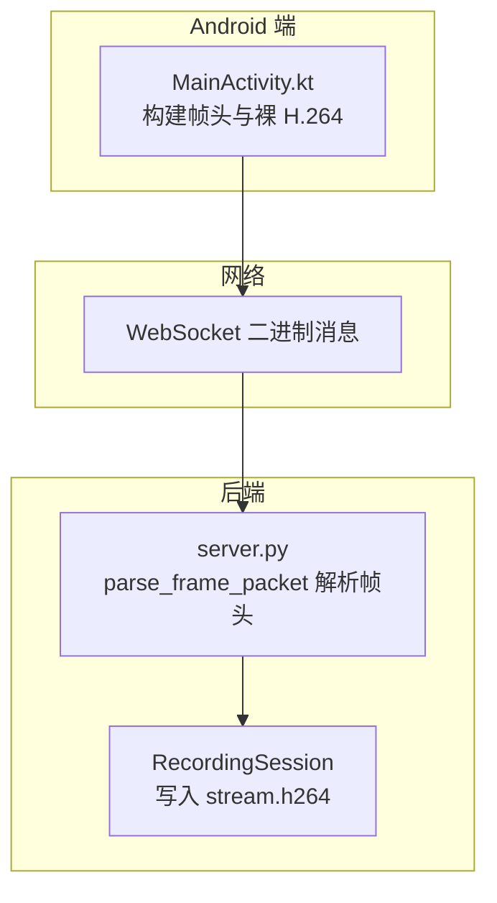
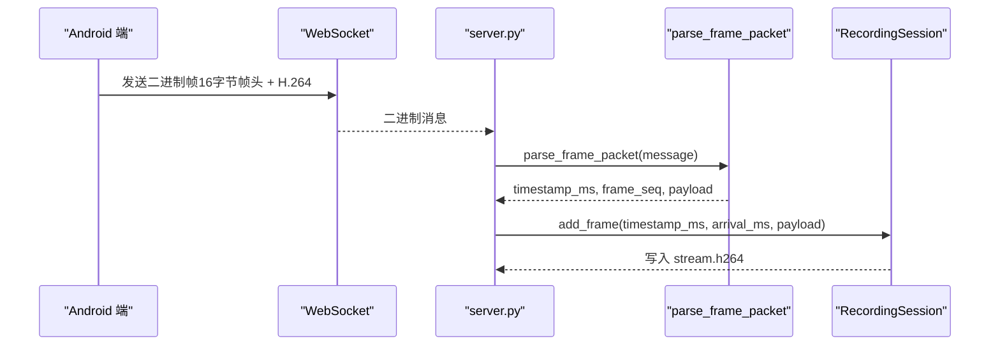
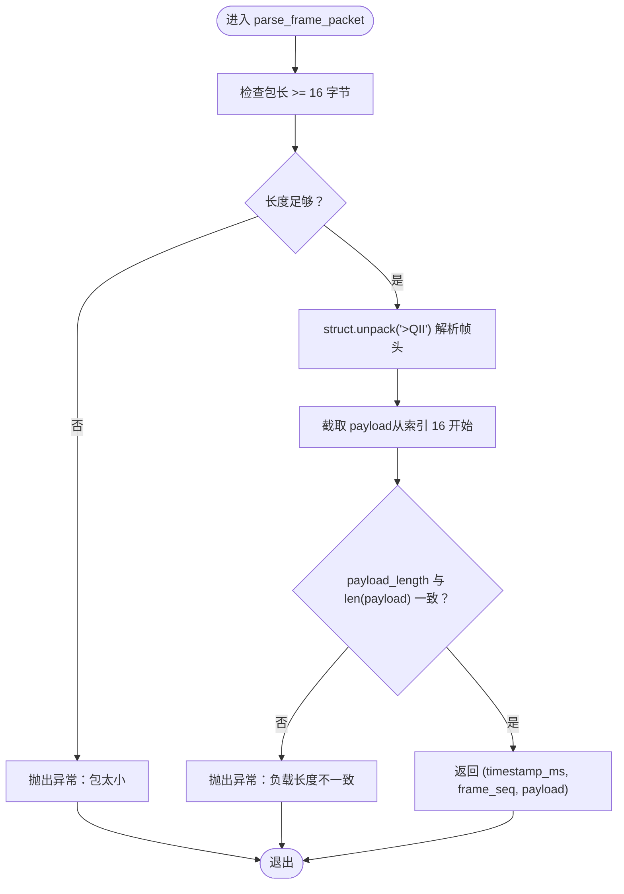
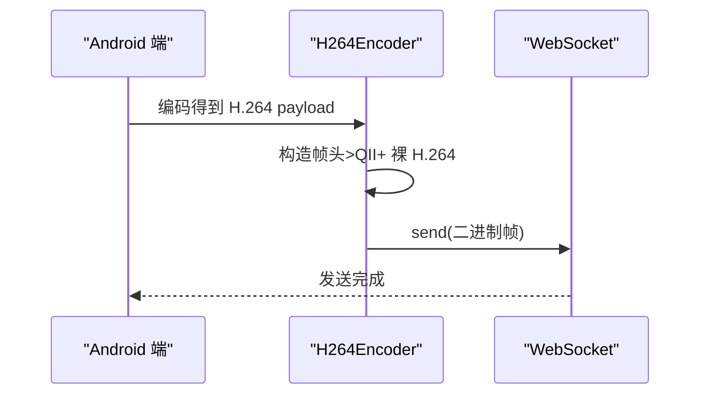
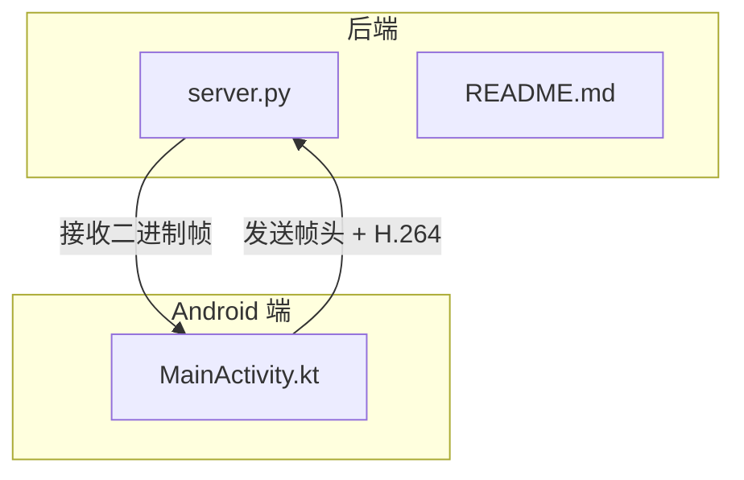

# 帧解析

<cite>
**本文引用的文件**
- [backend/server.py](file://backend/server.py)
- [backend/README.md](file://backend/README.md)
- [android-camera/app/src/main/java/com/example/lablogcamera/MainActivity.kt](file://android-camera/app/src/main/java/com/example/lablogcamera/MainActivity.kt)
</cite>

## 目录
1. [简介](#简介)
2. [项目结构](#项目结构)
3. [核心组件](#核心组件)
4. [架构概览](#架构概览)
5. [详细组件分析](#详细组件分析)
6. [依赖关系分析](#依赖关系分析)
7. [性能考量](#性能考量)
8. [故障排查指南](#故障排查指南)
9. [结论](#结论)

## 简介
本章节聚焦于“帧解析”的实现与使用，围绕后端服务器对来自 Android 端的二进制帧进行解析的关键流程展开，重点解释 parse_frame_packet 函数如何使用 struct.unpack 严格解析 16 字节自定义帧头（>QII 格式），并验证负载长度一致性。文档同时提供解析成功与失败的示例思路，以及在网络传输中帧损坏或截断场景下的调试策略，帮助初学者快速理解，也为有经验的开发者提供可操作的排障建议。

## 项目结构
- 后端服务器位于 backend/server.py，负责接收 WebSocket 二进制帧，解析帧头并写入录制会话。
- Android 端位于 android-camera/app/src/main/java/com/example/lablogcamera/MainActivity.kt，负责构建自定义帧头并发送 H.264 裸码流。
- 后端 README.md 对帧头格式、解析流程与录制会话进行了说明。

**图表来源**
- [backend/server.py](file://backend/server.py#L135-L147)
- [android-camera/app/src/main/java/com/example/lablogcamera/MainActivity.kt](file://android-camera/app/src/main/java/com/example/lablogcamera/MainActivity.kt#L967-L983)

**章节来源**
- [backend/README.md](file://backend/README.md#L36-L62)

## 核心组件
- 自定义帧头格式与常量
  - 帧头格式：">QII"（大端，8+4+4 字节）
  - 帧头大小：16 字节
  - 字段含义：
    - timestamp_ms：设备时间戳（毫秒）
    - frame_seq：帧序号（低 32 位递增）
    - payload_length：后续 H.264 负载长度（字节数）

- parse_frame_packet(packet: bytes)
  - 校验包长至少包含帧头
  - 使用 struct.unpack 解析出 timestamp_ms、frame_seq、payload_length
  - 截取 payload 并校验长度一致性
  - 返回 timestamp_ms、frame_seq、payload

- 录制会话 RecordingSession
  - 将 payload 追加写入 stream.h264
  - 记录首尾帧设备时间戳与服务器到达时间，用于事后估算 FPS

**章节来源**
- [backend/server.py](file://backend/server.py#L12-L20)
- [backend/server.py](file://backend/server.py#L135-L147)
- [backend/server.py](file://backend/server.py#L210-L274)
- [backend/README.md](file://backend/README.md#L36-L62)

## 架构概览
后端通过 WebSocket 接收 Android 端发送的二进制帧，帧结构为“16 字节帧头 + H.264 裸码流”。解析流程如下：
- consumer_handler 接收消息
- 若为二进制帧，调用 parse_frame_packet 解析
- 成功解析后，记录服务器到达时间并写入会话

**图表来源**
- [backend/server.py](file://backend/server.py#L233-L274)
- [backend/server.py](file://backend/server.py#L135-L147)

## 详细组件分析

### parse_frame_packet 函数解析流程
- 输入：bytes 类型的完整帧（包含帧头与负载）
- 步骤：
  1) 校验包长至少等于帧头大小（16 字节）
  2) 使用 struct.unpack 按 ">QII" 解析出 timestamp_ms、frame_seq、payload_length
  3) 截取 payload（从第 16 字节起）
  4) 校验 payload_length 与 len(payload) 是否一致
  5) 返回 timestamp_ms、frame_seq、payload

**图表来源**
- [backend/server.py](file://backend/server.py#L135-L147)

**章节来源**
- [backend/server.py](file://backend/server.py#L135-L147)

### 字段语义与作用
- timestamp_ms（设备时间戳，毫秒）
  - 含义：编码器输出时间戳（微秒转毫秒），用于重建时间轴与估算 FPS
  - 用途：服务器记录首尾帧设备时间戳，用于事后估算 FPS

- frame_seq（帧序号，低 32 位递增）
  - 含义：帧序列号，低 32 位单调递增
  - 用途：辅助定位丢帧、重放或统计

- payload_length（负载长度，字节数）
  - 含义：紧随帧头之后的 H.264 裸码流长度
  - 用途：与实际 payload 长度对比，确保帧完整性

**章节来源**
- [backend/README.md](file://backend/README.md#L36-L62)
- [backend/server.py](file://backend/server.py#L12-L20)

### Android 端帧头构造（与后端严格对应）
- 帧头字段与顺序：
  - [0..7] int64 timestampMs（设备时间）
  - [8..11] int32 frameSequence（低 32 位递增序号）
  - [12..15] int32 payload.size（后续 H.264 数据长度）
- 发送逻辑：
  - 使用 ByteBuffer.allocate(16 + payload.size).order(BIG_ENDIAN)
  - 依次写入 timestampMs、frameSequence、payload.size，再写入 payload
  - 通过 WebSocket 发送二进制数据

**图表来源**
- [android-camera/app/src/main/java/com/example/lablogcamera/MainActivity.kt](file://android-camera/app/src/main/java/com/example/lablogcamera/MainActivity.kt#L967-L983)

**章节来源**
- [android-camera/app/src/main/java/com/example/lablogcamera/MainActivity.kt](file://android-camera/app/src/main/java/com/example/lablogcamera/MainActivity.kt#L967-L983)

### 解析成功与失败示例（概念性说明）
- 解析成功示例（概念）：
  - 帧头：timestamp_ms=1700000000000，frame_seq=12345，payload_length=1024
  - 负载：长度正好为 1024 字节
  - 结果：返回 (1700000000000, 12345, payload)

- 解析失败示例（概念）：
  - 帧头：timestamp_ms=1700000000000，frame_seq=12345，payload_length=2048
  - 负载：长度只有 1024 字节
  - 结果：抛出异常（负载长度不一致）

说明：以上为概念性示例，不展示具体字节内容。

**章节来源**
- [backend/server.py](file://backend/server.py#L135-L147)

## 依赖关系分析
- 后端依赖
  - struct.unpack：用于严格解析帧头
  - asyncio：记录服务器到达时间
  - websockets：接收二进制帧
  - subprocess：封装 MP4（与帧解析无直接耦合，但与录制流程相关）

- Android 端依赖
  - OkHttp WebSocket：发送二进制帧
  - MediaCodec：编码 H.264
  - ByteBuffer：构造帧头

**图表来源**
- [backend/server.py](file://backend/server.py#L233-L274)
- [android-camera/app/src/main/java/com/example/lablogcamera/MainActivity.kt](file://android-camera/app/src/main/java/com/example/lablogcamera/MainActivity.kt#L967-L983)

**章节来源**
- [backend/server.py](file://backend/server.py#L1-L40)
- [android-camera/app/src/main/java/com/example/lablogcamera/MainActivity.kt](file://android-camera/app/src/main/java/com/example/lablogcamera/MainActivity.kt#L1-L120)

## 性能考量
- 帧头固定 16 字节，解析成本极低，适合高频帧场景
- 负载长度一致性校验在解析阶段完成，避免后续写盘与封装阶段的无效工作
- 服务器到达时间与设备时间戳双通道估算 FPS，有助于稳定封装参数

[本节为通用性能讨论，不涉及具体文件分析]

## 故障排查指南
- 常见问题与定位
  - 包太小：当 len(packet) < 16 时，抛出异常。检查 Android 端是否正确构造帧头与负载
  - 负载长度不一致：当 payload_length != len(payload) 时，抛出异常。检查网络传输是否截断或 Android 端 payload.size 写入错误
  - 未在活动会话中：若未收到 capture_started 状态，后端不会处理二进制帧，需确认 Android 端状态上报
  - 连接异常：捕获 ConnectionClosed 并最终化会话，检查网络稳定性

- 调试策略（网络传输中帧损坏/截断）
  - 在 Android 端打印发送前的 payload.size 与实际发送字节数，核对是否一致
  - 在后端 consumer_handler 中增加日志，记录收到的二进制长度与解析结果
  - 使用抓包工具（如 Wireshark）观察 WebSocket 二进制帧边界，确认是否存在粘包/拆包
  - 逐步降低帧率与码率，验证问题是否与带宽或编码器压力相关
  - 检查 Android 端 ByteBuffer 的 ByteOrder（必须为大端）与写入顺序（timestampMs → frame_seq → payload.size）

**章节来源**
- [backend/server.py](file://backend/server.py#L233-L274)
- [backend/server.py](file://backend/server.py#L135-L147)
- [android-camera/app/src/main/java/com/example/lablogcamera/MainActivity.kt](file://android-camera/app/src/main/java/com/example/lablogcamera/MainActivity.kt#L967-L983)

## 结论
parse_frame_packet 通过严格的 16 字节帧头解析与长度一致性校验，确保了后端对 Android 端推送的 H.264 帧的可靠接收。结合设备时间戳与服务器到达时间，后端可在录制结束后准确估算 FPS 并封装高质量 MP4。对于初学者，理解帧头字段与解析流程即可快速上手；对于有经验的开发者，建议在 Android 端加强发送前校验与日志，在后端完善异常分支与抓包验证，以应对复杂网络环境下的帧损坏与截断问题。