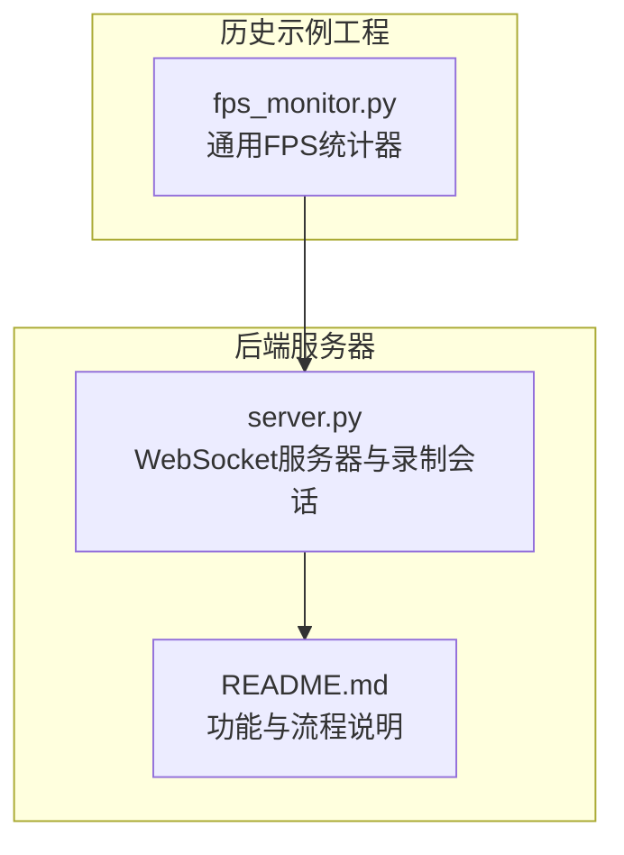
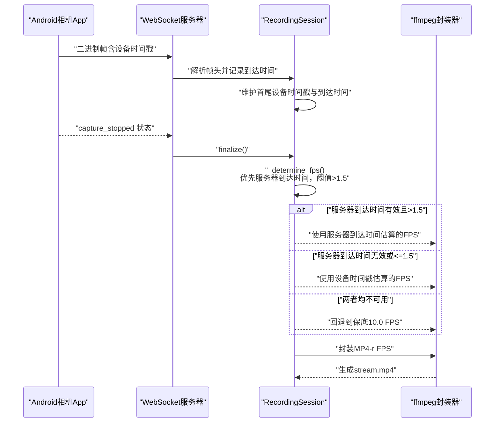
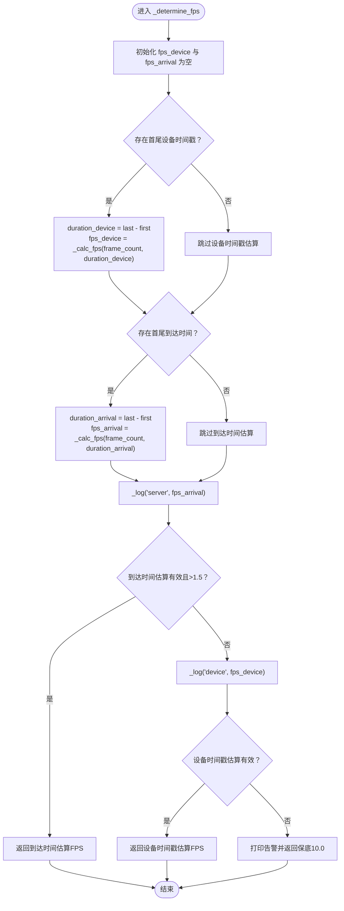
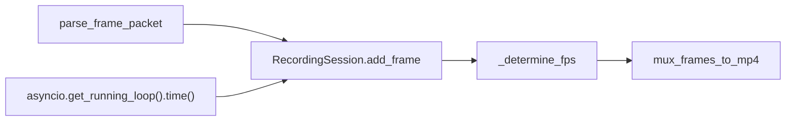

# FPS估算

<cite>
**本文引用的文件**
- [backend/server.py](file://backend/server.py)
- [backend/README.md](file://backend/README.md)
- [archive/20251117_arduino_send_images_to_backend_and_frontend/backend/fps_monitor.py](file://archive/20251117_arduino_send_images_to_backend_and_frontend/backend/fps_monitor.py)
</cite>

## 目录
1. [简介](#简介)
2. [项目结构](#项目结构)
3. [核心组件](#核心组件)
4. [架构总览](#架构总览)
5. [详细组件分析](#详细组件分析)
6. [依赖关系分析](#依赖关系分析)
7. [性能考量](#性能考量)
8. [故障排查指南](#故障排查指南)
9. [结论](#结论)
10. [附录](#附录)

## 简介
本文件围绕后端服务器中的 _determine_fps 方法，系统性阐述其如何基于“设备时间戳”和“服务器到达时间”两种来源估算实际帧率（FPS），并给出优先级策略、边界条件处理、阈值设定依据、日志与告警机制，以及面向初学者的流程图与面向资深工程师的实现细节与优化建议。同时提供模拟低帧率、时间戳乱序等异常场景的测试思路与实践建议。

## 项目结构
本仓库包含多个子项目，其中与本主题最相关的是后端服务器与一个历史示例工程。与 _determine_fps 直接相关的代码位于后端服务器模块中，另有历史示例工程包含一个通用的 FPSMonitor 类，可用于理解帧率统计的基本原理。

图表来源
- [backend/server.py](file://backend/server.py#L1-L120)
- [backend/README.md](file://backend/README.md#L1-L120)
- [archive/20251117_arduino_send_images_to_backend_and_frontend/backend/fps_monitor.py](file://archive/20251117_arduino_send_images_to_backend_and_frontend/backend/fps_monitor.py#L1-L67)

章节来源
- [backend/server.py](file://backend/server.py#L1-L120)
- [backend/README.md](file://backend/README.md#L1-L120)

## 核心组件
- 录制会话 RecordingSession：负责接收帧、记录首尾设备时间戳与服务器到达时间，并在会话结束时调用 _determine_fps 估算实际帧率。
- _determine_fps：核心算法，结合“设备时间戳”和“服务器到达时间”，采用优先级与阈值策略，返回最终 FPS。
- _calc_fps：内部辅助函数，执行帧数/时长（秒）的计算，并在无效输入时返回空值。
- _log：内部辅助函数，负责对估算结果进行边界裁剪与日志输出。
- finalize：会话结束时的收尾流程，调用 _determine_fps 并将结果传给封装器。

章节来源
- [backend/server.py](file://backend/server.py#L26-L133)
- [backend/README.md](file://backend/README.md#L60-L110)

## 架构总览
下图展示了从客户端推送帧到最终生成 MP4 的整体流程，重点标注了时间戳采集点与 FPS 估算位置。

图表来源
- [backend/server.py](file://backend/server.py#L26-L133)
- [backend/README.md](file://backend/README.md#L60-L110)

## 详细组件分析

### _determine_fps 方法详解
- 目标：在录制结束时，基于记录的首尾时间戳估算实际帧率，确保封装阶段使用正确的帧率，避免时间轴错误。
- 输入来源：
  - 设备时间戳：来自帧头，表示设备侧拍摄/编码时间。
  - 服务器到达时间：来自服务器接收时刻，表示网络与服务端的实际节奏。
- 优先级与阈值：
  - 优先使用“服务器到达时间”估算结果；
  - 要求该结果大于 1.5 FPS 才认为可信；
  - 若不可用或低于等于 1.5，则回退到“设备时间戳”估算；
  - 若两者均不可用，使用保底值 10.0 FPS。
- 边界条件：
  - 当帧数小于等于 1 或时长小于等于 0 时，_calc_fps 返回空值，避免除零与无意义结果；
  - 对估算结果进行裁剪，限定在合理区间（例如 1.0–60.0），防止极端异常值影响封装。
- 日志与告警：
  - _log 负责输出估算过程与结果，便于诊断；
  - 当任一估算不可用时输出告警信息；
  - 当使用保底值时输出明确提示。

图表来源
- [backend/server.py](file://backend/server.py#L80-L133)

章节来源
- [backend/server.py](file://backend/server.py#L80-L133)

### _calc_fps 数学模型与边界条件
- 数学模型：FPS = 帧数 / 时间（秒）。时间以毫秒为单位，需换算为秒。
- 边界条件：
  - 帧数 ≤ 1 或时长 ≤ 0：返回空值，避免除零与无意义结果；
  - 时长最小值设为 1 毫秒，保证分母非零；
  - 估算结果经 _log 进行裁剪，避免极端值干扰。
- 复杂度：O(1)，常数时间与空间。

章节来源
- [backend/server.py](file://backend/server.py#L87-L90)
- [backend/server.py](file://backend/server.py#L92-L100)

### _log 与 _warn 的诊断作用
- _log：
  - 当估算结果为空时，输出“估算不可用”的告警；
  - 对估算结果进行边界裁剪（例如 1.0–60.0），并输出包含帧数与估算值的日志；
  - 返回裁剪后的数值供上层决策使用。
- _warn：
  - 在本实现中未定义独立的 _warn 函数，但通过 _log 的“不可用”分支与最终保底逻辑，实现了等价的诊断与降级提示。
- 诊断价值：
  - 帮助定位“服务器到达时间”缺失或异常（如极低帧率）；
  - 帮助定位“设备时间戳”异常（如时间戳乱序、重复）；
  - 为最终封装阶段提供稳定输入，避免时间轴错误。

章节来源
- [backend/server.py](file://backend/server.py#L92-L100)
- [backend/server.py](file://backend/server.py#L123-L132)

### 优先使用服务器到达时间的原因
- 更贴近真实接收节奏：服务器到达时间反映了网络与服务端的实际处理节奏，更接近用户感知的“真实帧率”；
- 抗抖动能力强：在网络抖动或客户端发送不稳定的情况下，服务器到达时间能平滑部分波动；
- 与封装器对接更稳健：ffmpeg 封装时显式指定帧率，避免因码流内时间戳不准确导致的“1fps 视频”问题。

章节来源
- [backend/README.md](file://backend/README.md#L80-L110)
- [backend/server.py](file://backend/server.py#L150-L178)

### 设备时间戳作为降级方案的场景
- 服务器到达时间缺失或异常（如网络中断导致时间戳丢失、或估算结果过低）；
- 设备端时间戳正常但服务器端统计异常；
- 两者均不可用时，使用保底值 10.0 FPS，确保封装流程不中断。

章节来源
- [backend/server.py](file://backend/server.py#L102-L132)

### 1.5 FPS 阈值的设定依据
- 保守阈值：1.5 FPS 作为“可信”下限，过滤掉明显异常或极低的估算结果；
- 与保底值衔接：当服务器到达时间估算不可信时，回退到设备时间戳；若仍不可信，则使用保底值；
- 实践考量：避免将极低或异常估算值用于封装，导致时间轴严重失真。

章节来源
- [backend/server.py](file://backend/server.py#L123-L125)
- [backend/README.md](file://backend/README.md#L80-L110)

### 与通用 FPSMonitor 的关系
- 历史示例工程中的 FPSMonitor 提供了基于本地时间的简单 FPS 统计能力，适合实时显示与短期观测；
- 本项目的 _determine_fps 则聚焦于“事后估算”，利用首尾时间戳进行跨会话、跨网络的稳健估算，更适合封装阶段使用。

章节来源
- [archive/20251117_arduino_send_images_to_backend_and_frontend/backend/fps_monitor.py](file://archive/20251117_arduino_send_images_to_backend_and_frontend/backend/fps_monitor.py#L1-L67)
- [backend/README.md](file://backend/README.md#L1-L40)

## 依赖关系分析
- RecordingSession 依赖：
  - parse_frame_packet：解析帧头，获取设备时间戳；
  - asyncio.get_running_loop().time()：获取服务器到达时间；
  - _determine_fps：估算最终 FPS；
  - mux_frames_to_mp4：封装 MP4，显式指定帧率。
- 关键耦合点：
  - 时间戳来源的稳定性与一致性；
  - 估算结果的边界裁剪与阈值判断；
  - 保底值的存在确保流程健壮性。

图表来源
- [backend/server.py](file://backend/server.py#L135-L178)
- [backend/server.py](file://backend/server.py#L260-L273)

章节来源
- [backend/server.py](file://backend/server.py#L135-L178)
- [backend/server.py](file://backend/server.py#L260-L273)

## 性能考量
- 时间复杂度：_determine_fps 为 O(1)，仅涉及常数次算术运算与条件判断；
- 空间复杂度：O(1)，仅使用少量变量；
- I/O 与网络：
  - 服务器到达时间由事件循环时间获取，开销极低；
  - 封装阶段使用 -r 显式帧率，避免 ffmpeg 依赖码流推断，减少不确定性；
- 建议：
  - 保持设备时间戳的单调性与合理性；
  - 在网络抖动较大时，优先信任服务器到达时间估算；
  - 对异常日志进行集中化收集与可视化，便于快速定位问题。

[本节为一般性指导，不直接分析具体文件]

## 故障排查指南
- 现象：日志显示“估算不可用”
  - 可能原因：首尾时间戳缺失或无效；
  - 处理：检查帧头解析与会话生命周期，确保每帧都被正确记录。
- 现象：估算结果极低（≤1.5）
  - 可能原因：网络延迟、丢包、客户端发送不稳定；
  - 处理：切换到设备时间戳估算；若仍不可用，使用保底值。
- 现象：最终生成的 MP4 时间轴异常（如极慢或极快）
  - 可能原因：封装时使用的帧率不正确；
  - 处理：确认 _determine_fps 的估算与阈值逻辑；检查日志中裁剪后的数值。
- 现象：保底值被使用
  - 可能原因：服务器到达时间与设备时间戳均不可用；
  - 处理：检查网络与客户端稳定性，修复时间戳来源问题。

章节来源
- [backend/server.py](file://backend/server.py#L92-L100)
- [backend/server.py](file://backend/server.py#L123-L132)

## 结论
_determine_fps 通过“服务器到达时间优先、阈值筛选、设备时间戳降级、保底值兜底”的策略，实现了稳健的帧率估算。配合 _calc_fps 的边界条件与 _log 的诊断输出，能够在异常场景下提供可靠的封装帧率，避免时间轴错误。对于初学者，建议先理解“服务器到达时间优先”的动机与阈值的意义；对于资深工程师，建议关注时间戳来源的稳定性、异常日志的可观测性，以及在极端网络条件下如何进一步优化估算鲁棒性。

[本节为总结性内容，不直接分析具体文件]

## 附录

### 测试案例设计（模拟异常场景）
- 低帧率场景
  - 目的：验证阈值 1.5 的作用与回退逻辑；
  - 方法：构造服务器到达时间跨度极长、帧数较少的数据，使到达时间估算显著低于 1.5；
  - 预期：优先估算被舍弃，回退到设备时间戳；若设备时间戳也异常，则使用保底值。
- 时间戳乱序场景
  - 目的：验证首尾时间戳一致性与边界条件；
  - 方法：将最后一帧的设备时间戳设置为早于第一帧；
  - 预期：时长计算为正（最小值设为 1），_calc_fps 返回空值或异常值，_log 输出告警，最终回退到另一来源或保底值。
- 到达时间缺失场景
  - 目的：验证服务器到达时间不可用时的降级；
  - 方法：不记录到达时间或仅记录一次；
  - 预期：到达时间估算为空，回退到设备时间戳；若仍不可用，使用保底值。
- 两源均不可用场景
  - 目的：验证保底值逻辑；
  - 方法：不记录任何时间戳；
  - 预期：输出告警并返回 10.0 FPS。

章节来源
- [backend/server.py](file://backend/server.py#L87-L100)
- [backend/server.py](file://backend/server.py#L102-L132)