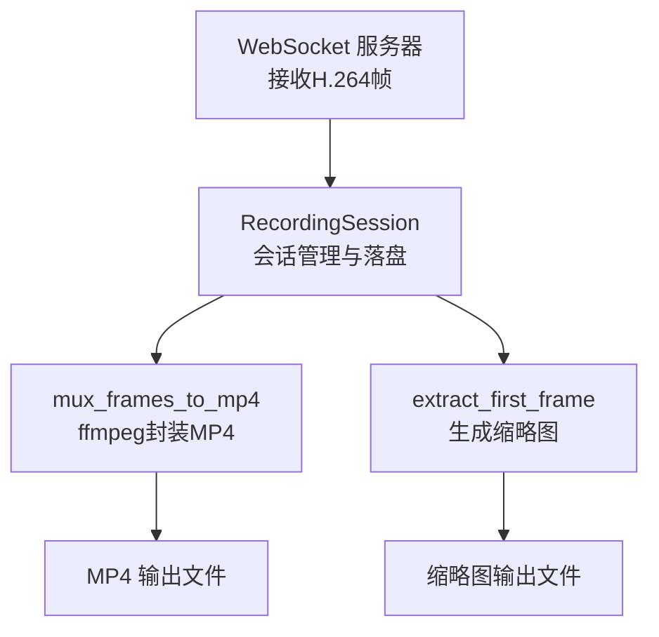
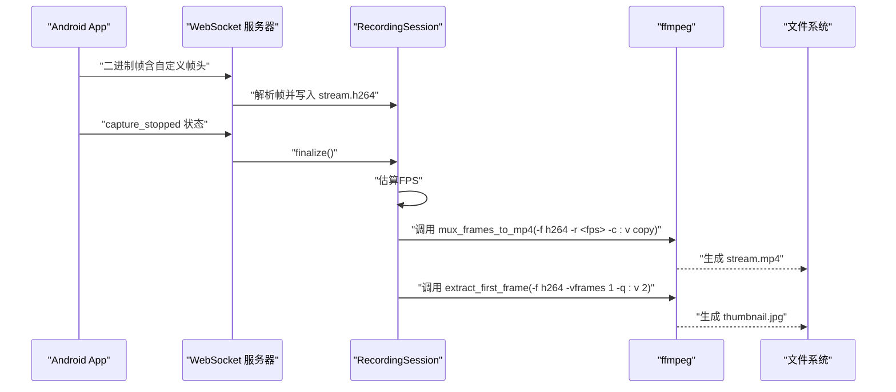
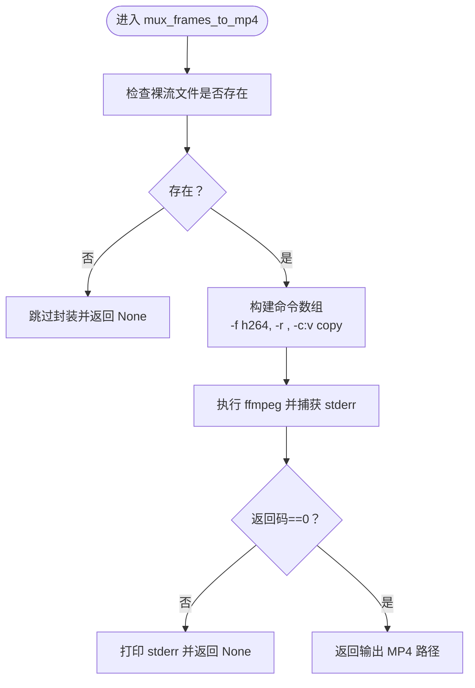
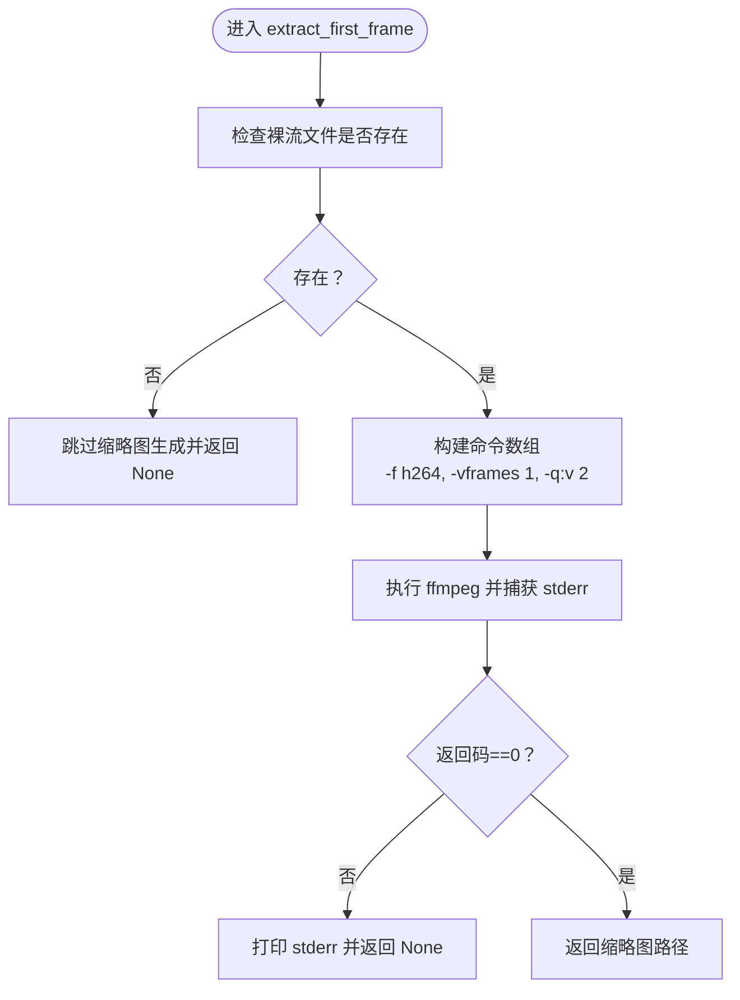
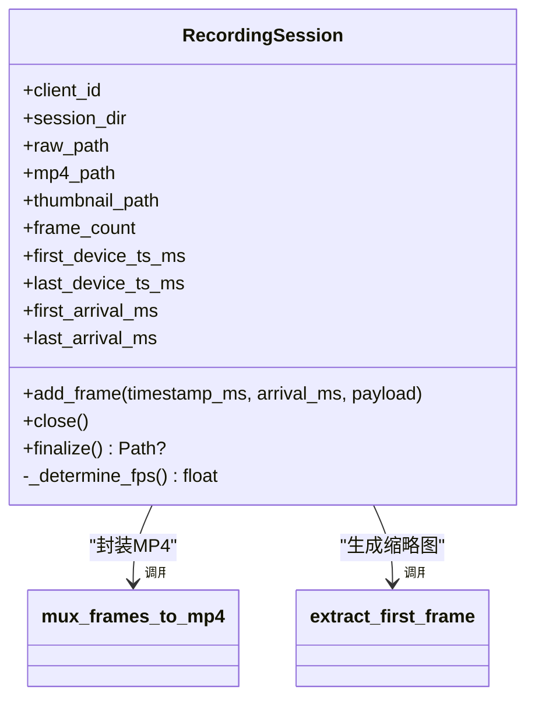
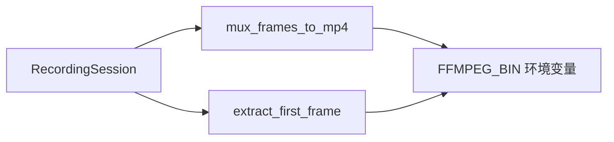

# MP4封装

<cite>
**本文引用的文件**
- [server.py](file://backend/server.py)
- [README.md](file://backend/README.md)
</cite>

## 目录
1. [简介](#简介)
2. [项目结构](#项目结构)
3. [核心组件](#核心组件)
4. [架构总览](#架构总览)
5. [详细组件分析](#详细组件分析)
6. [依赖关系分析](#依赖关系分析)
7. [性能考量](#性能考量)
8. [故障排查指南](#故障排查指南)
9. [结论](#结论)
10. [附录](#附录)

## 简介
本文件围绕后端服务中的 MP4 封装能力展开，重点解析 mux_frames_to_mp4 函数的实现与 ffmpeg 命令行参数选择逻辑，说明 -f h264、-r、-c:v copy 的技术优势；阐述环境变量 FFMPEG_BIN 的配置方法与部署适配；提供初学者与进阶开发者分别适用的日志分析与恢复策略，并结合 extract_first_frame 函数说明缩略图生成的 -q:v 2 参数在画质与体积上的权衡。

## 项目结构
- 后端核心逻辑集中在 backend/server.py，其中包含：
  - 录制会话 RecordingSession：负责接收帧、估算 FPS、触发封装与缩略图提取。
  - mux_frames_to_mp4：使用 ffmpeg 将裸 H.264 流封装为 MP4。
  - extract_first_frame：从 H.264 流中抽取首帧生成 JPEG 缩略图。
- 文档 backend/README.md 对上述功能进行了说明与使用指导。

**图表来源**
- [server.py](file://backend/server.py#L49-L88)
- [server.py](file://backend/server.py#L150-L179)
- [server.py](file://backend/server.py#L181-L207)

**章节来源**
- [server.py](file://backend/server.py#L49-L88)
- [README.md](file://backend/README.md#L1-L33)

## 核心组件
- 录制会话 RecordingSession
  - 负责将二进制帧写入 stream.h264，并在会话结束时估算 FPS、调用封装与缩略图提取。
- 封装函数 mux_frames_to_mp4
  - 使用 ffmpeg 将裸 H.264 封装为 MP4，关键参数：-f h264、-r、-c:v copy。
- 缩略图提取 extract_first_frame
  - 从 H.264 流中抽取首帧并保存为 JPEG，-q:v 2 用于高质量输出。

**章节来源**
- [server.py](file://backend/server.py#L49-L88)
- [server.py](file://backend/server.py#L150-L179)
- [server.py](file://backend/server.py#L181-L207)

## 架构总览
下图展示了从 WebSocket 接收帧到最终生成 MP4 与缩略图的整体流程。

**图表来源**
- [server.py](file://backend/server.py#L49-L88)
- [server.py](file://backend/server.py#L150-L179)
- [server.py](file://backend/server.py#L181-L207)

## 详细组件分析

### 封装函数 mux_frames_to_mp4：参数选择与技术优势
- 功能定位
  - 将录制期间写入的裸 H.264 流封装为标准 MP4 文件，供播放器与上层应用使用。
- 关键参数说明
  - -f h264：明确输入为裸 H.264 流，避免 ffmpeg 误判容器或像素格式。
  - -r <fps>：显式指定帧率，防止 ffmpeg 基于码流推断导致时间轴异常（例如出现极低帧率）。
  - -c:v copy：直接复制视频轨，不做重编码，实现无损且高性能的封装。
- 执行流程
  - 若裸流文件不存在，直接跳过并返回空。
  - 构造命令数组，使用 os.environ.get("FFMPEG_BIN", "ffmpeg") 作为可执行文件名，支持通过环境变量指定自定义路径。
  - 调用 subprocess.run 捕获 stderr，若返回码非 0，则打印错误信息并返回空。
  - 成功时返回输出文件路径。

**图表来源**
- [server.py](file://backend/server.py#L150-L179)

**章节来源**
- [server.py](file://backend/server.py#L150-L179)
- [README.md](file://backend/README.md#L97-L114)

### 环境变量 FFMPEG_BIN：配置方法与部署适配
- 作用
  - 指定 ffmpeg 可执行文件的绝对路径，便于在不同部署环境中灵活定位。
- 配置方式
  - 在启动后端服务前设置环境变量，例如在 Linux/macOS 中使用 export 或在 systemd 环境中通过 Environment= 指定。
- 部署建议
  - 容器化部署：将 ffmpeg 安装到镜像内，并通过环境变量指向其绝对路径。
  - 权限与路径：确保服务进程对 ffmpeg 可执行文件有执行权限。
  - 多版本共存：在某些系统中可使用包管理器安装 ffmpeg，并通过环境变量指向特定版本。

**章节来源**
- [server.py](file://backend/server.py#L162-L164)
- [README.md](file://backend/README.md#L284-L291)

### 缩略图生成 extract_first_frame：-q:v 2 的权衡
- 功能定位
  - 从 H.264 流中抽取首帧并保存为 JPEG，便于预览与索引。
- 关键参数
  - -f h264：明确输入为裸 H.264。
  - -vframes 1：仅抽取第一帧。
  - -q:v 2：设定 JPEG 编码质量参数（范围通常为 2-31，数值越小质量越高），此处选择较高质量以获得更好的视觉效果。
- 输出与容错
  - 若裸流文件不存在，跳过并返回空；执行失败时打印 stderr 并返回空。

**图表来源**
- [server.py](file://backend/server.py#L181-L207)

**章节来源**
- [server.py](file://backend/server.py#L181-L207)

### 录制会话 RecordingSession：封装与缩略图的触发时机
- 生命周期
  - start_recording：创建会话目录与裸流文件。
  - consumer_handler：接收帧并写入裸流，记录时间戳。
  - finalize：关闭裸流、估算 FPS、调用封装与缩略图提取。
- FPS 估算策略
  - 优先使用服务器到达时间估算，要求大于 1.5fps 才认为可信；否则回退到设备时间戳；均不可用时使用保底 10.0fps。
- 与封装的关系
  - 封装时将估算得到的 fps 传入 mux_frames_to_mp4，确保时间轴准确。

**图表来源**
- [server.py](file://backend/server.py#L26-L88)
- [server.py](file://backend/server.py#L150-L179)
- [server.py](file://backend/server.py#L181-L207)

**章节来源**
- [server.py](file://backend/server.py#L26-L88)

## 依赖关系分析
- 组件耦合
  - RecordingSession 与封装/缩略图函数之间为调用关系，耦合度低，职责清晰。
- 外部依赖
  - ffmpeg：通过环境变量 FFMPEG_BIN 指定路径，避免硬编码可执行名。
- 潜在风险
  - ffmpeg 未安装或不可执行会导致封装失败。
  - -r 参数与实际码流帧率不一致可能导致时间轴误差或播放器警告。

**图表来源**
- [server.py](file://backend/server.py#L150-L179)
- [server.py](file://backend/server.py#L181-L207)
- [server.py](file://backend/server.py#L162-L164)

**章节来源**
- [server.py](file://backend/server.py#L150-L179)
- [server.py](file://backend/server.py#L181-L207)
- [server.py](file://backend/server.py#L162-L164)

## 性能考量
- 无重编码封装
  - 使用 -c:v copy 可显著降低 CPU 占用与延迟，适合实时性要求高的场景。
- 帧率准确性
  - 通过估算的 fps 传入 -r，避免 ffmpeg 基于码流推断导致的帧率异常，减少播放器解码抖动。
- I/O 与磁盘空间
  - 裸 H.264 写入与 MP4 封装均涉及磁盘 I/O，建议在具备足够磁盘空间与良好吞吐的存储介质上运行。

[本节为通用性能讨论，不直接分析具体文件]

## 故障排查指南

### 初学者日志分析示例
- 常见现象
  - 服务器终端打印“ffmpeg failed to mux MP4”，并显示 stderr。
- 可能原因
  - ffmpeg 未安装或不可执行。
  - FFMPEG_BIN 指向的路径不正确或无执行权限。
  - 裸流文件不存在或被提前删除。
  - 码流格式不符合预期（例如包含非 H.264 数据）。
- 快速检查
  - 确认系统已安装 ffmpeg 并可在命令行直接调用。
  - 检查 FFMPEG_BIN 是否正确设置。
  - 确认 recordings/<session>/stream.h264 存在且非空。
  - 使用播放器验证 MP4 是否可正常播放。

**章节来源**
- [server.py](file://backend/server.py#L172-L178)
- [README.md](file://backend/README.md#L227-L233)
- [README.md](file://backend/README.md#L284-L291)

### 进阶开发者恢复策略
- 临时文件清理
  - 若封装失败，保留原始裸流文件以便复测；必要时清理旧会话目录以释放空间。
- 重试机制设计
  - 在封装失败时记录错误上下文（如裸流大小、时间戳范围、stderr），并在短暂等待后重试一次。
- 资源泄漏防范
  - 确保 RecordingSession 在 finalize 时正确关闭裸流文件句柄。
  - 对 ffmpeg 进程的 stderr/stdout 采用一次性捕获，避免长时间占用缓冲区。
- 可观测性增强
  - 在封装前后记录裸流与 MP4 的文件大小、时间戳范围，辅助定位问题。

**章节来源**
- [server.py](file://backend/server.py#L60-L63)
- [server.py](file://backend/server.py#L172-L178)

## 结论
- mux_frames_to_mp4 通过 -f h264、-r、-c:v copy 的组合，实现了高效、稳定的 MP4 封装。
- FFMPEG_BIN 环境变量提供了灵活的部署适配能力，建议在生产环境中显式配置。
- 通过 RecordingSession 的 FPS 估算与缩略图生成，形成完整的录制后处理闭环。
- 面向初学者与进阶开发者，本文提供了日志分析与恢复策略，便于快速定位与解决问题。

[本节为总结性内容，不直接分析具体文件]

## 附录

### 命令行参数速查
- -f h264：明确输入为裸 H.264 流。
- -r <fps>：显式帧率，避免错误推断。
- -c:v copy：无重编码封装，速度快且无损。
- -vframes 1：仅抽取首帧。
- -q:v 2：JPEG 质量参数，数值越小质量越高。

**章节来源**
- [server.py](file://backend/server.py#L150-L179)
- [server.py](file://backend/server.py#L181-L207)
- [README.md](file://backend/README.md#L97-L114)