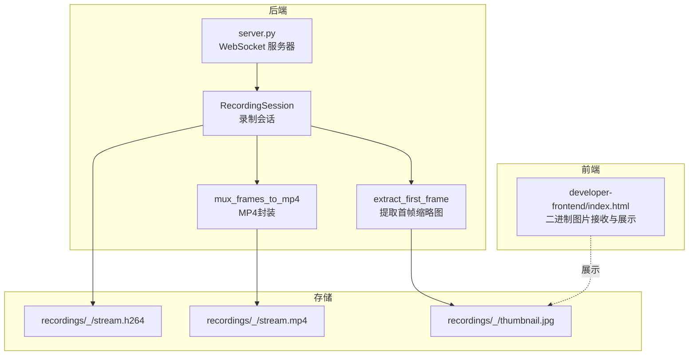
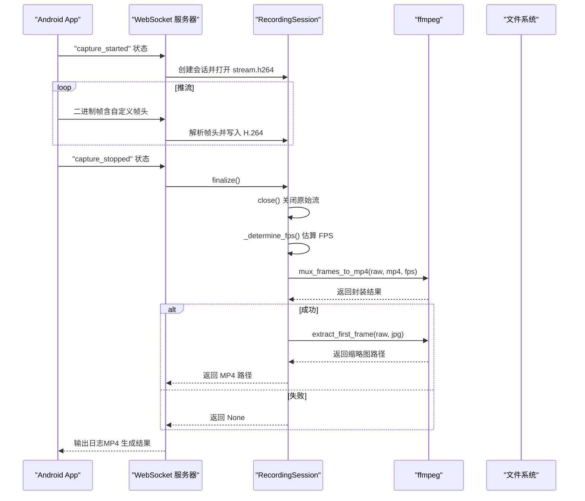
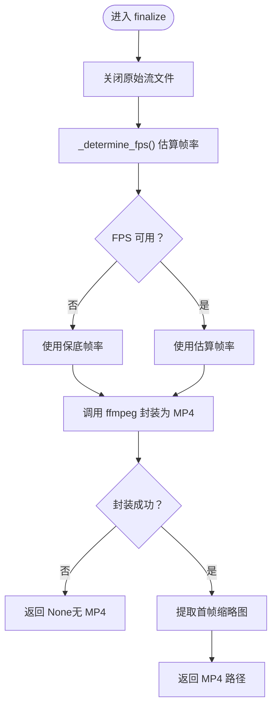
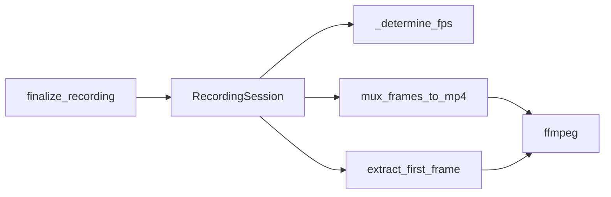

# 会话终结与封装

<cite>
**本文引用的文件**
- [server.py](file://backend/server.py)
- [README.md](file://backend/README.md)
- [index.html](file://developer-frontend/index.html)
</cite>

## 目录
1. [简介](#简介)
2. [项目结构](#项目结构)
3. [核心组件](#核心组件)
4. [架构总览](#架构总览)
5. [详细组件分析](#详细组件分析)
6. [依赖关系分析](#依赖关系分析)
7. [性能考量](#性能考量)
8. [故障排查指南](#故障排查指南)
9. [结论](#结论)
10. [附录](#附录)

## 简介
本文件围绕后端录制会话的“会话终结与封装”流程展开，重点解释 finalize 方法如何安全关闭 H.264 原始流文件、如何调用 _determine_fps 进行帧率估算、如何通过 mux_frames_to_mp4 函数调用 ffmpeg 将裸流封装为标准 MP4 文件，以及 extract_first_frame 如何提取首帧作为缩略图并在前端展示中的用途。文档还为初学者提供完整的会话结束流程图，为有经验的开发者解析 ffmpeg 命令行参数的选择依据、错误码处理、环境变量 FFMPEG_BIN 的配置方式及封装失败的恢复策略。

## 项目结构
- 后端服务器位于 backend/server.py，负责：
  - 接收 Android 相机 App 的 H.264 帧（含自定义帧头）并写入磁盘；
  - 在录制结束时调用 finalize，完成 MP4 封装与缩略图提取；
  - 通过终端命令控制所有已连接客户端。
- 录制输出目录 recordings/ 下每个会话一个子目录，包含 stream.h264、stream.mp4、thumbnail.jpg。
- 前端 developer-frontend/index.html 用于演示二进制图片数据的接收与展示，便于理解缩略图在前端的呈现方式。

图表来源
- [server.py](file://backend/server.py#L26-L78)
- [server.py](file://backend/server.py#L150-L207)
- [README.md](file://backend/README.md#L26-L33)

章节来源
- [server.py](file://backend/server.py#L26-L78)
- [README.md](file://backend/README.md#L26-L33)

## 核心组件
- RecordingSession：管理一次录制会话，负责写入 H.264 帧、记录时间戳、估算 FPS、调用封装与缩略图提取。
- mux_frames_to_mp4：调用 ffmpeg 将裸 H.264 封装为 MP4。
- extract_first_frame：从 H.264 中提取首帧 JPEG 缩略图。
- finalize_recording：在客户端上报 capture_stopped 或连接断开时触发会话终结。

章节来源
- [server.py](file://backend/server.py#L26-L78)
- [server.py](file://backend/server.py#L150-L207)
- [server.py](file://backend/server.py#L222-L231)

## 架构总览
后端通过 WebSocket 接收来自 Android App 的 H.264 帧，按会话写入磁盘；录制结束时，调用 finalize 完成以下关键步骤：
1) 关闭原始流文件；
2) 估算帧率（优先服务器到达时间，其次设备时间戳，最后保底值）；
3) 调用 ffmpeg 封装为 MP4；
4) 成功后提取首帧作为缩略图。

图表来源
- [server.py](file://backend/server.py#L222-L231)
- [server.py](file://backend/server.py#L64-L78)
- [server.py](file://backend/server.py#L80-L133)
- [server.py](file://backend/server.py#L150-L207)

## 详细组件分析

### finalize 方法与会话终结流程
- 安全关闭 H.264 原始流文件：在 finalize 中首先调用 close，确保文件句柄被释放，避免资源泄漏。
- 帧率估算 _determine_fps：
  - 优先使用“服务器到达时间”估算结果，且要求大于阈值才认为可信；
  - 若不可信，则回退到“设备时间戳”估算；
  - 两者均不可用时，使用保底值。
- 封装为 MP4：调用 mux_frames_to_mp4，传入估算的 fps，使用 ffmpeg 直接拷贝视频轨，避免重编码。
- 提取缩略图：成功封装后，调用 extract_first_frame 从同一 H.264 中提取首帧 JPEG，供前端展示。

图表来源
- [server.py](file://backend/server.py#L64-L78)
- [server.py](file://backend/server.py#L80-L133)
- [server.py](file://backend/server.py#L150-L207)

章节来源
- [server.py](file://backend/server.py#L64-L78)
- [server.py](file://backend/server.py#L80-L133)

### 帧率估算策略与阈值
- 估算公式：frame_count / duration_seconds；
- 优先使用“服务器到达时间”（更贴近真实接收节奏）；
- 可信度阈值：大于阈值才采用；
- 回退策略：设备时间戳；均不可用时使用保底帧率。

章节来源
- [server.py](file://backend/server.py#L80-L133)

### ffmpeg 封装与参数解析
- 输入格式：-f h264 明确裸 H.264；
- 帧率：-r <fps> 显式指定，避免 ffmpeg 误判导致极慢视频；
- 视频编码：-c:v copy 直接拷贝，零重编码，速度快且无损；
- 输出：将封装结果写入 stream.mp4；
- 错误处理：返回码非 0 时打印 stderr 并返回 None。

章节来源
- [server.py](file://backend/server.py#L150-L179)
- [README.md](file://backend/README.md#L97-L114)

### 缩略图提取与前端展示
- 从同一 H.264 中提取首帧 JPEG，质量参数较高；
- 成功后输出缩略图路径；
- 前端 developer-frontend/index.html 可接收二进制图片数据并展示，便于理解缩略图在前端的呈现方式。

章节来源
- [server.py](file://backend/server.py#L181-L207)
- [index.html](file://developer-frontend/index.html#L379-L450)

## 依赖关系分析
- RecordingSession 依赖：
  - 文件系统：写入 stream.h264、读取并生成 stream.mp4、thumbnail.jpg；
  - 子程序：_determine_fps、mux_frames_to_mp4、extract_first_frame；
  - 外部工具：ffmpeg（通过环境变量 FFMPEG_BIN 指定路径）。
- finalize_recording：从全局会话表取出会话并调用其 finalize，统一处理 MP4 生成与日志输出。

图表来源
- [server.py](file://backend/server.py#L222-L231)
- [server.py](file://backend/server.py#L64-L78)
- [server.py](file://backend/server.py#L80-L133)
- [server.py](file://backend/server.py#L150-L207)

章节来源
- [server.py](file://backend/server.py#L222-L231)

## 性能考量
- 无重编码：使用 -c:v copy 直接拷贝，避免 CPU 重压与时间消耗；
- 显式帧率：-r <fps> 避免 ffmpeg 对码流的不可靠推断，减少时间轴误差；
- 保底帧率：在极端情况下仍能保证 MP4 可用性，避免长时间黑屏或播放异常；
- 资源释放：finalize 中先 close，降低文件句柄占用与潜在锁冲突风险。

章节来源
- [server.py](file://backend/server.py#L150-L179)
- [server.py](file://backend/server.py#L80-L133)

## 故障排查指南
- ffmpeg 未安装或不可执行：
  - 现象：封装失败，stderr 输出；
  - 处理：安装 ffmpeg 并确保命令行可用；或设置环境变量 FFMPEG_BIN 指向可执行文件路径。
- H.264 文件缺失：
  - 现象：封装与缩略图提取均跳过；
  - 处理：确认会话期间未发生异常中断，确保帧写入正常。
- 帧率估算不可信：
  - 现象：使用保底帧率，可能影响播放流畅度；
  - 处理：检查设备时间戳与服务器到达时间记录是否完整，必要时调整阈值策略。
- 封装失败的恢复策略：
  - 重试：确认 ffmpeg 参数与输入文件有效后再次尝试；
  - 降级：若无帧或输入为空，返回 None 并记录告警，避免产生无效文件；
  - 日志：关注 stderr 输出，定位具体原因（权限、路径、格式等）。

章节来源
- [server.py](file://backend/server.py#L150-L179)
- [server.py](file://backend/server.py#L181-L207)
- [README.md](file://backend/README.md#L284-L291)

## 结论
finalize 方法通过“安全关闭 → 帧率估算 → 封装 MP4 → 提取缩略图”的顺序，实现了从原始 H.264 到可播放 MP4 的完整闭环。_determine_fps 的多策略估算与保底帧率设计提升了鲁棒性；ffmpeg 的直拷贝封装兼顾性能与质量；extract_first_frame 为前端提供了直观的缩略图素材。结合环境变量 FFMPEG_BIN 与完善的错误处理，整体流程对初学者友好，同时为高级用户提供可控的参数与恢复策略。

## 附录

### 初学者会话结束流程图（文字版）
- 步骤 1：收到 capture_stopped 或连接断开，触发 finalize_recording；
- 步骤 2：会话对象 finalize：
  - 关闭原始流文件；
  - 估算帧率（服务器到达时间优先，其次设备时间戳，最后保底）；
  - 调用 ffmpeg 封装为 MP4；
  - 若成功，提取首帧为缩略图；
  - 返回 MP4 路径或 None。

章节来源
- [server.py](file://backend/server.py#L222-L231)
- [server.py](file://backend/server.py#L64-L78)
- [server.py](file://backend/server.py#L80-L133)
- [server.py](file://backend/server.py#L150-L207)

### 开发者参考：ffmpeg 命令行参数与环境变量
- -f h264：明确输入为裸 H.264；
- -r <fps>：显式帧率，避免误判；
- -c:v copy：零重编码，直接拷贝视频轨；
- -y：覆盖输出文件；
- -vframes 1：仅提取首帧；
- -q:v 2：高质量 JPEG（数值越小质量越高）；
- FFMPEG_BIN：可通过环境变量指定 ffmpeg 可执行文件路径。

章节来源
- [server.py](file://backend/server.py#L150-L207)
- [README.md](file://backend/README.md#L97-L114)
- [README.md](file://backend/README.md#L284-L291)