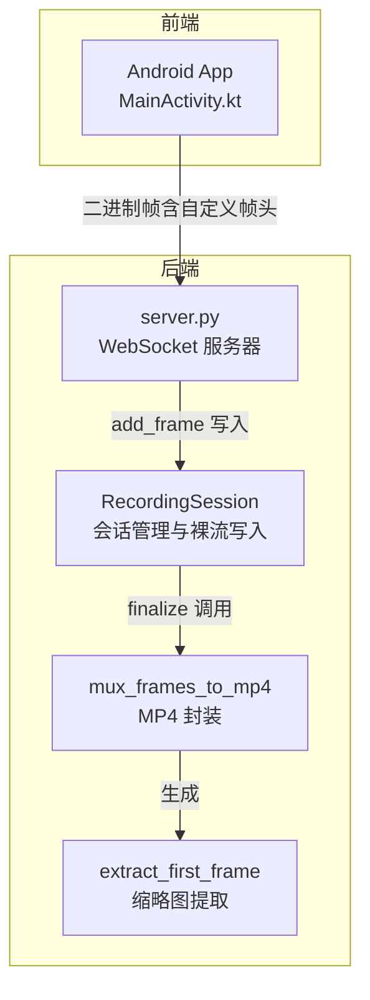
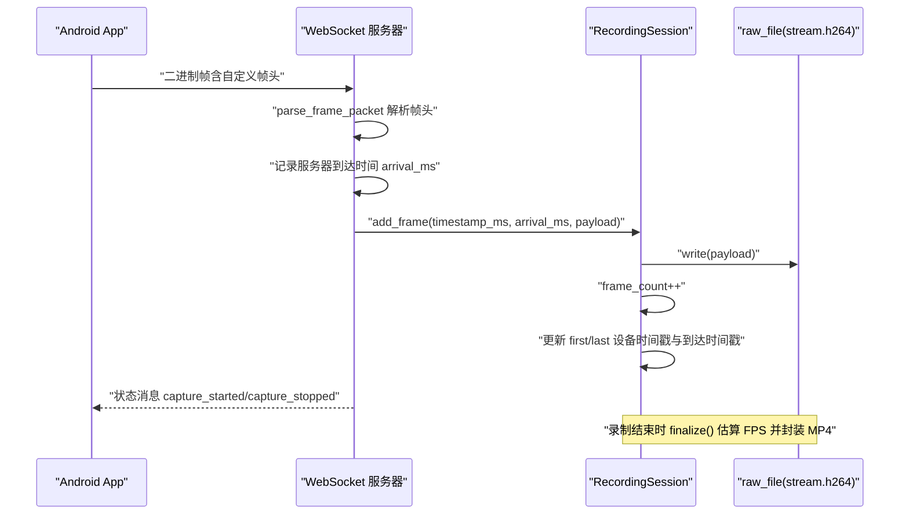
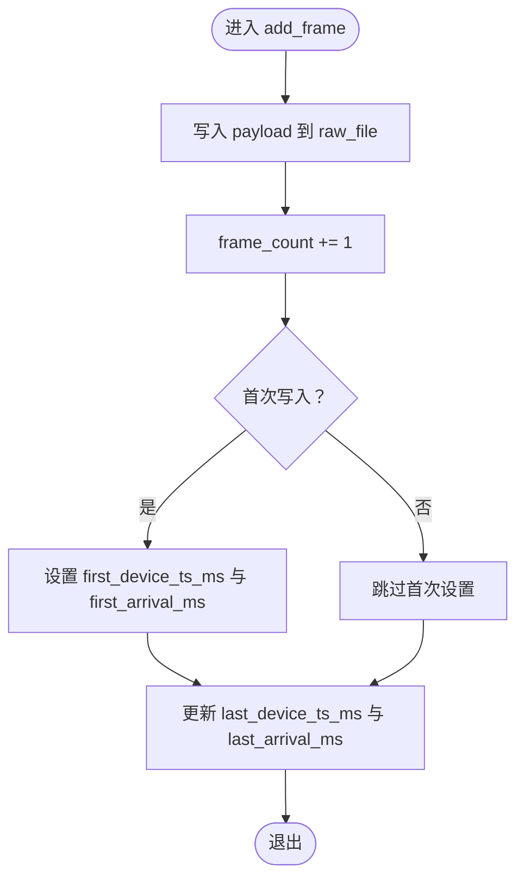
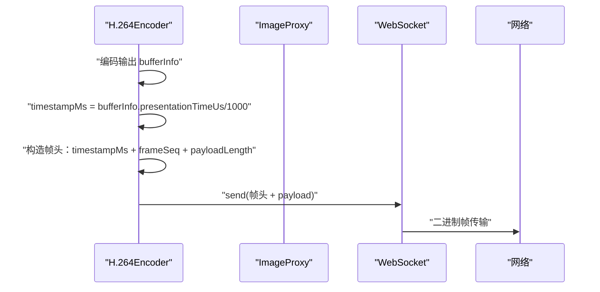
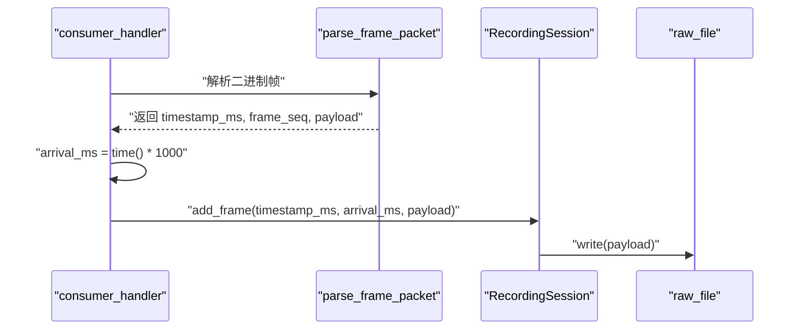
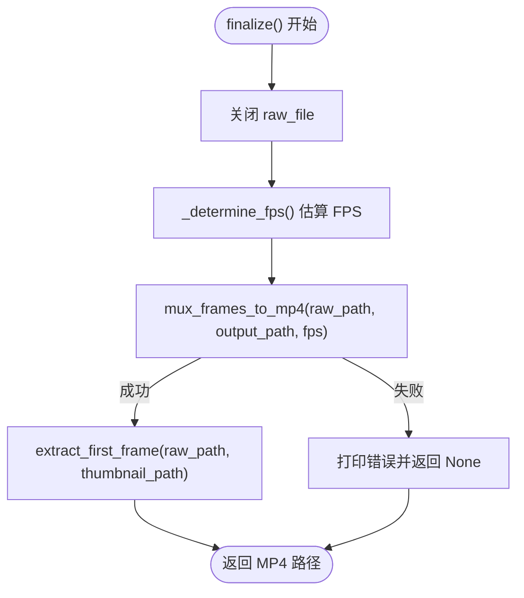
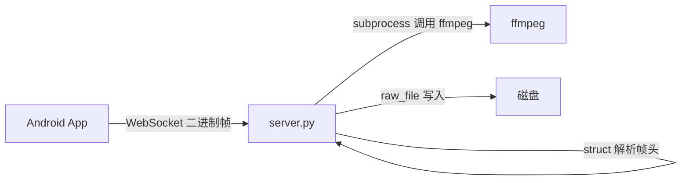

# 帧数据写入

<cite>
**本文引用的文件**
- [server.py](file://backend/server.py)
- [README.md](file://backend/README.md)
- [MainActivity.kt](file://android-camera/app/src/main/java/com/example/lablogcamera/MainActivity.kt)
</cite>

## 目录
1. [简介](#简介)
2. [项目结构](#项目结构)
3. [核心组件](#核心组件)
4. [架构总览](#架构总览)
5. [详细组件分析](#详细组件分析)
6. [依赖关系分析](#依赖关系分析)
7. [性能考量](#性能考量)
8. [故障排查指南](#故障排查指南)
9. [结论](#结论)

## 简介
本章节围绕后端服务器中的 add_frame 方法展开，系统性阐述其如何接收设备时间戳、服务器到达时间以及 H.264 编码后的视频帧数据，并将其追加写入到 raw_file（裸 H.264 文件）。文档还解释 frame_count 计数器的递增逻辑，以及 first_device_ts_ms、last_device_ts_ms、first_arrival_ms、last_arrival_ms 等字段在 FPS 估算中的关键作用。面向初学者提供帧写入流程的时序图示例，面向高级开发者分析高并发场景下多客户端写入的性能瓶颈与优化策略，包括文件 I/O 调度与异常处理机制。

## 项目结构
后端采用单进程异步 WebSocket 服务，负责接收来自 Android App 的二进制帧，按会话写入磁盘并在录制结束时封装为 MP4。关键文件与职责如下：
- backend/server.py：WebSocket 服务器、帧解析、会话管理、裸流写入、MP4 封装与缩略图提取。
- android-camera/app/src/main/java/com/example/lablogcamera/MainActivity.kt：Android 端实现帧头打包、编码与发送，包含设备时间戳来源与帧率控制逻辑。
- backend/README.md：后端功能与协议说明，包含帧头格式、会话字段与 FPS 估算策略。

图表来源
- [server.py](file://backend/server.py#L26-L88)
- [server.py](file://backend/server.py#L135-L179)
- [server.py](file://backend/server.py#L181-L208)
- [MainActivity.kt](file://android-camera/app/src/main/java/com/example/lablogcamera/MainActivity.kt#L968-L984)

章节来源
- [server.py](file://backend/server.py#L26-L88)
- [README.md](file://backend/README.md#L1-L115)

## 核心组件
- 自定义帧头与解析
  - 帧头格式：8 字节设备时间戳（毫秒）、4 字节帧序号（低 32 位递增）、4 字节负载长度（字节数），随后为 H.264 裸码流。
  - 解析函数：parse_frame_packet(packet: bytes) 校验长度、解包并返回 (timestamp_ms, frame_seq, payload)。
- 录制会话 RecordingSession
  - 会话目录与文件：recordings/<client>_<timestamp>/，包含 stream.h264、stream.mp4、thumbnail.jpg。
  - 关键字段：frame_count、first_device_ts_ms、last_device_ts_ms、first_arrival_ms、last_arrival_ms。
  - add_frame(timestamp_ms, arrival_ms, payload)：将 payload 追加写入 raw_file，更新计数与时间戳边界。
  - finalize()：关闭文件、估算 FPS、封装 MP4、提取缩略图。
- FPS 估算策略
  - 优先使用“服务器到达时间”估算，若不可信则回退到“设备时间戳”，均不可用则使用保底 10 FPS。
- WebSocket 处理流程
  - consumer_handler：解析文本状态消息（capture_started/capture_stopped）与二进制帧；二进制帧到达时记录服务器到达时间并调用 session.add_frame。

章节来源
- [server.py](file://backend/server.py#L135-L147)
- [server.py](file://backend/server.py#L26-L88)
- [server.py](file://backend/server.py#L80-L133)
- [server.py](file://backend/server.py#L233-L280)

## 架构总览
后端与 Android App 之间的数据通路如下：
- Android App 侧：编码器输出时间戳（bufferInfo.presentationTimeUs/1000），打包帧头（设备时间戳、帧序号、负载长度），通过 WebSocket 发送二进制帧。
- 后端侧：consumer_handler 解析帧头，记录服务器到达时间（asyncio.get_running_loop().time() * 1000），调用 session.add_frame 写入裸流文件。

图表来源
- [server.py](file://backend/server.py#L135-L147)
- [server.py](file://backend/server.py#L233-L280)
- [server.py](file://backend/server.py#L49-L59)
- [MainActivity.kt](file://android-camera/app/src/main/java/com/example/lablogcamera/MainActivity.kt#L968-L984)

## 详细组件分析

### add_frame 方法详解
- 输入参数
  - timestamp_ms：设备时间戳（毫秒），由 Android 端编码器输出时间戳转换而来。
  - arrival_ms：服务器到达时间（毫秒），由后端在收到帧时记录。
  - payload：H.264 裸码流字节数据。
- 写入逻辑
  - 将 payload 追加写入 raw_file（stream.h264）。
  - frame_count 自增 1。
  - 首帧时初始化 first_device_ts_ms 与 first_arrival_ms；每次写入更新 last_device_ts_ms 与 last_arrival_ms。
- 计数器与时间戳的作用
  - frame_count：统计总帧数，用于 FPS 估算。
  - first_device_ts_ms/last_device_ts_ms：设备侧时间跨度，用于“设备时间戳”FPS 估算。
  - first_arrival_ms/last_arrival_ms：服务器侧到达时间跨度，用于“服务器到达时间”FPS 估算。
- FPS 估算（finalize 阶段）
  - 优先使用“服务器到达时间”估算，要求估算值 > 1.5fps 才认为可信；否则回退到“设备时间戳”估算；均不可用则使用保底 10 FPS。
  - 估算公式：FPS = frame_count / (duration_ms / 1000)，并对结果进行 1.0~60.0 的边界约束。

图表来源
- [server.py](file://backend/server.py#L49-L59)

章节来源
- [server.py](file://backend/server.py#L49-L59)
- [server.py](file://backend/server.py#L80-L133)

### 设备时间戳来源与帧头打包（Android 端）
- 设备时间戳来源
  - Android 端使用 MediaCodec 输出时间戳（bufferInfo.presentationTimeUs/1000）作为“设备时间戳”，与原始图像时间基本一致。
- 帧头打包
  - 二进制帧头包含：设备时间戳（8 字节）、帧序号（4 字节）、负载长度（4 字节），随后为 H.264 裸码流。
  - 发送时将帧头与 payload 组合并通过 WebSocket 发送。

图表来源
- [MainActivity.kt](file://android-camera/app/src/main/java/com/example/lablogcamera/MainActivity.kt#L247-L264)
- [MainActivity.kt](file://android-camera/app/src/main/java/com/example/lablogcamera/MainActivity.kt#L968-L984)

章节来源
- [MainActivity.kt](file://android-camera/app/src/main/java/com/example/lablogcamera/MainActivity.kt#L247-L264)
- [MainActivity.kt](file://android-camera/app/src/main/java/com/example/lablogcamera/MainActivity.kt#L968-L984)

### 服务器到达时间记录与写入时机
- 服务器到达时间
  - 在 consumer_handler 中，使用 asyncio.get_running_loop().time() * 1000 获取当前毫秒时间，作为 arrival_ms。
- 写入时机
  - 在解析帧头成功后，立即记录到达时间并调用 session.add_frame，确保时间戳与帧一一对应。

图表来源
- [server.py](file://backend/server.py#L233-L280)
- [server.py](file://backend/server.py#L135-L147)
- [server.py](file://backend/server.py#L49-L59)

章节来源
- [server.py](file://backend/server.py#L233-L280)
- [server.py](file://backend/server.py#L135-L147)
- [server.py](file://backend/server.py#L49-L59)

### FPS 估算与 MP4 封装
- FPS 估算
  - 优先使用“服务器到达时间”估算，若 > 1.5fps 则采用；否则回退到“设备时间戳”；均不可用则使用 10 FPS。
  - 估算公式：FPS = frame_count / (duration_ms / 1000)，并进行 1.0~60.0 边界约束。
- MP4 封装
  - 使用 ffmpeg -f h264 -r <fps> -i stream.h264 -c:v copy stream.mp4 封装，避免依赖不可靠的码流推断。
  - 成功后提取第一帧为缩略图 thumbnail.jpg。

图表来源
- [server.py](file://backend/server.py#L64-L78)
- [server.py](file://backend/server.py#L80-L133)
- [server.py](file://backend/server.py#L150-L179)
- [server.py](file://backend/server.py#L181-L208)

章节来源
- [server.py](file://backend/server.py#L64-L78)
- [server.py](file://backend/server.py#L80-L133)
- [server.py](file://backend/server.py#L150-L179)
- [server.py](file://backend/server.py#L181-L208)

## 依赖关系分析
- 后端依赖
  - websockets：WebSocket 服务器与客户端通信。
  - subprocess：调用 ffmpeg 进行 MP4 封装与缩略图提取。
  - struct：解析自定义帧头。
- 前端依赖
  - OkHttp WebSocket：与后端建立连接。
  - MediaCodec：H.264 编码器，输出时间戳作为设备时间戳。
- 关键耦合点
  - 帧头格式约定（大端、长度固定）必须前后端一致。
  - 服务器到达时间与设备时间戳共同用于 FPS 估算，提升封装精度。

图表来源
- [server.py](file://backend/server.py#L135-L147)
- [server.py](file://backend/server.py#L150-L179)
- [server.py](file://backend/server.py#L41-L47)

章节来源
- [server.py](file://backend/server.py#L135-L147)
- [server.py](file://backend/server.py#L150-L179)
- [server.py](file://backend/server.py#L41-L47)

## 性能考量
- 单会话写入性能
  - raw_file 以二进制追加写入，I/O 操作为顺序写，吞吐量主要受限于磁盘写入速度与编码器输出速率。
  - 建议：使用高性能磁盘（SSD）与合适的文件系统（ext4/xfs），避免频繁 fsync。
- 多客户端并发写入
  - 每个客户端对应一个 RecordingSession，各自拥有独立 raw_file，避免跨会话竞争。
  - 服务器端使用 asyncio 异步处理，单线程事件循环可高效调度多个连接。
  - 可能的瓶颈：
    - 磁盘写入带宽：多客户端同时写入可能达到磁盘上限。
    - CPU 编码压力：Android 端编码器配置（分辨率、码率、目标帧率）直接影响后端接收压力。
    - 网络抖动：高延迟或丢包会影响服务器到达时间的稳定性。
- 优化建议
  - 服务器端
    - 使用异步 I/O 与合适的缓冲策略，减少阻塞。
    - 对高频日志输出进行降频或异步化，降低 I/O 压力。
    - 在 finalize 阶段并行化（如多核封装）需谨慎评估，避免与主线程争抢资源。
  - Android 端
    - 合理设置目标帧率（0 表示不限），避免过度发送导致网络拥塞。
    - 选择合适分辨率与码率，平衡清晰度与网络/磁盘压力。
  - 文件 I/O 调度
    - 将 recordings 目录置于高速磁盘，必要时启用写缓存策略。
    - 对于极高并发场景，可考虑将不同客户端写入分散到不同磁盘或分区。
  - 异常处理
    - 对 ffmpeg 失败、文件不存在等情况进行健壮处理，避免中断整个会话。
    - 对 WebSocket 断连进行捕获并触发 finalize，确保资源释放与产物生成。

[本节为通用性能讨论，不直接分析具体文件，故无章节来源]

## 故障排查指南
- 帧头解析失败
  - 现象：后端打印“Failed to parse frame from …”。
  - 可能原因：二进制帧长度不足、帧头格式不匹配、payload 长度与声明不符。
  - 处理：检查 Android 端帧头打包逻辑与长度计算，确保与后端约定一致。
- 服务器到达时间异常
  - 现象：FPS 估算不可信或为保底值。
  - 可能原因：网络延迟过高、服务器时间源不稳定、消费者处理阻塞。
  - 处理：检查服务器负载与网络状况，确保 consumer_handler 无长时间阻塞。
- MP4 封装失败
  - 现象：后端打印“ffmpeg failed to mux MP4”并返回 None。
  - 可能原因：ffmpeg 未安装、路径不可用、输入裸流不存在或损坏。
  - 处理：确认 ffmpeg 可用与路径配置（FFMPEG_BIN），检查 recordings 目录与文件完整性。
- 缩略图提取失败
  - 现象：后端打印“ffmpeg failed to extract thumbnail”。
  - 可能原因：ffmpeg 未安装、输入文件不存在或参数错误。
  - 处理：同上，确保 ffmpeg 可用与输入文件存在。

章节来源
- [server.py](file://backend/server.py#L233-L280)
- [server.py](file://backend/server.py#L150-L179)
- [server.py](file://backend/server.py#L181-L208)

## 结论
add_frame 方法通过简洁而稳健的实现，完成了设备时间戳、服务器到达时间与 H.264 裸码流的接收与落盘。配合会话级别的时间戳边界记录与最终的 FPS 估算，后端能够在录制结束后以较高精度封装 MP4 并生成缩略图。对于高并发场景，建议从磁盘 I/O、网络与编码器配置三方面协同优化，并完善异常处理与监控告警，以保障系统的稳定与性能。