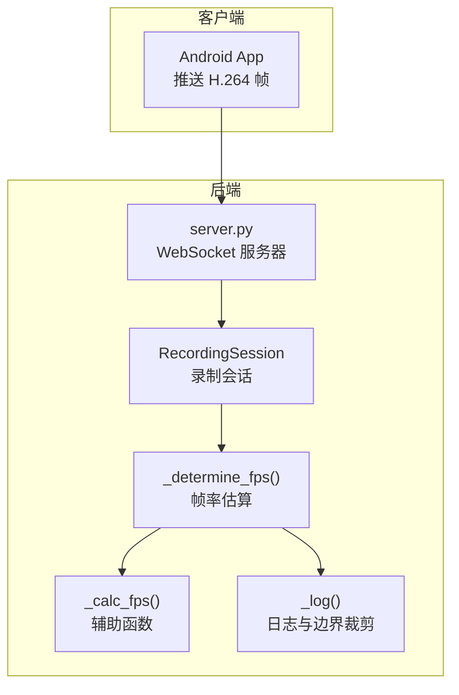
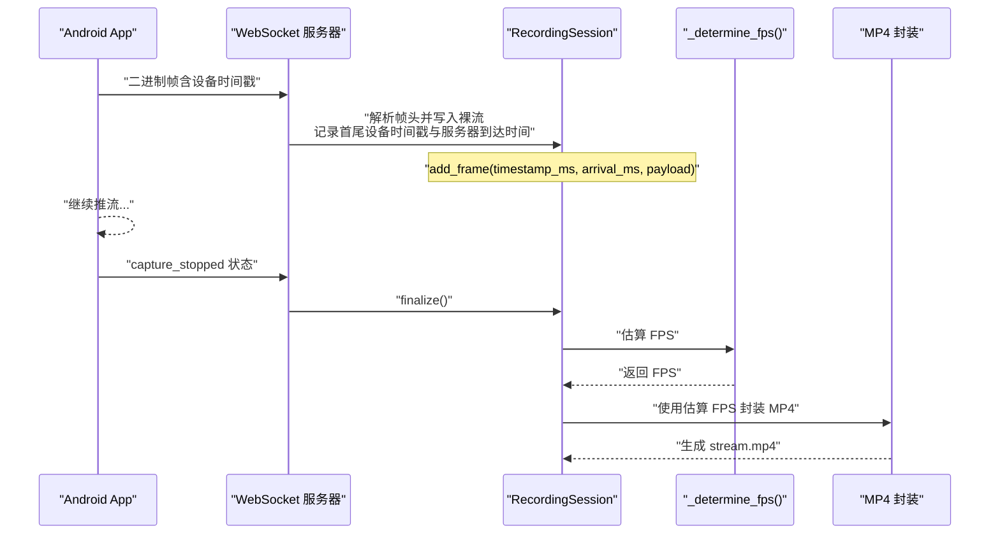
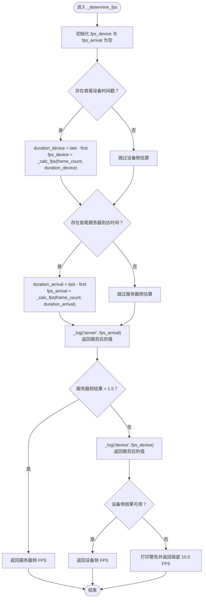
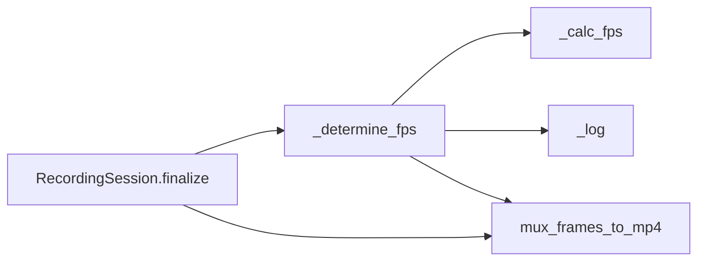
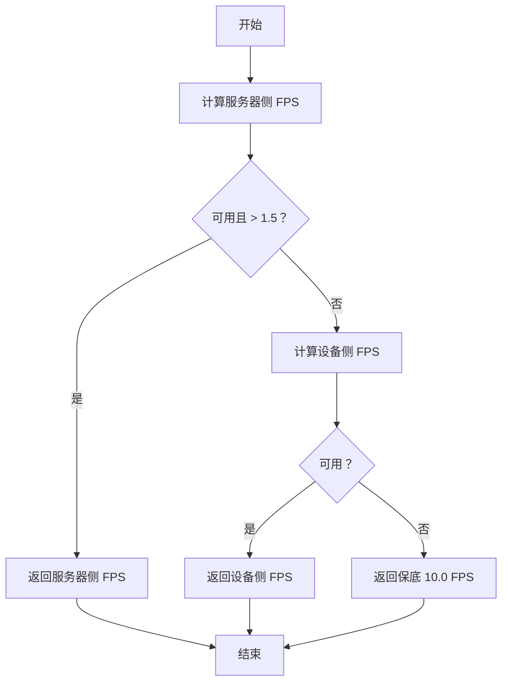

# 帧率估算逻辑

<cite>
**本文引用的文件**
- [server.py](file://backend/server.py)
- [README.md](file://backend/README.md)
- [fps_monitor.py](file://archive/20251117_arduino_send_images_to_backend_and_frontend/backend/fps_monitor.py)
</cite>

## 目录
1. [简介](#简介)
2. [项目结构](#项目结构)
3. [核心组件](#核心组件)
4. [架构概览](#架构概览)
5. [详细组件分析](#详细组件分析)
6. [依赖关系分析](#依赖关系分析)
7. [性能考量](#性能考量)
8. [故障排查指南](#故障排查指南)
9. [结论](#结论)
10. [附录](#附录)

## 简介
本文件围绕后端服务器中的 _determine_fps 方法展开，系统性解析其如何基于两类时间戳（设备侧时间戳与服务器到达时间）分别计算两种 FPS 估计值，并以“服务器侧时间间隔”为优先策略，以更贴近真实接收节奏。文档还深入阐述 _calc_fps 辅助函数的数学模型与边界条件处理（如单帧或负时长），解释日志输出中的保底机制（fallback 10 FPS）及其合理性。最后，面向初学者提供估算逻辑的决策流程图，面向高级开发者讨论网络抖动对估算精度的影响及可能的加权平均优化方案。

## 项目结构
- 后端服务器位于 backend/server.py，负责接收 Android App 推送的 H.264 帧，记录首尾设备时间戳与服务器到达时间，录制结束后通过 _determine_fps 估算实际帧率并封装为 MP4。
- README.md 对帧头格式、录制会话、封装流程与 FPS 估算策略有完整说明。
- archive/20251117_arduino_send_images_to_backend_and_frontend/backend/fps_monitor.py 展示了另一种基于系统时间的实时 FPS 监控思路，可作为对比参考。

图表来源
- [server.py](file://backend/server.py#L26-L87)
- [server.py](file://backend/server.py#L80-L133)

章节来源
- [server.py](file://backend/server.py#L26-L87)
- [README.md](file://backend/README.md#L80-L110)

## 核心组件
- 录制会话 RecordingSession：维护每会话的帧计数与首尾设备时间戳、服务器到达时间，最终在 finalize 中调用 _determine_fps。
- _determine_fps：核心估算逻辑，分别计算“设备侧 FPS”与“服务器到达 FPS”，优先采用服务器侧结果，若不可信则回退到设备侧，均不可用则使用保底 10 FPS。
- _calc_fps：数学模型为 帧数 / 时间跨度（秒），并处理边界条件（帧数 ≤ 1 或时长 ≤ 0）。
- _log：对估算结果进行日志输出与边界裁剪（最小 1.0，最大 60.0），并返回裁剪后的数值供上层判断。

章节来源
- [server.py](file://backend/server.py#L26-L87)
- [server.py](file://backend/server.py#L80-L133)

## 架构概览
下图展示从客户端到服务器再到封装阶段的整体流程，重点标注了帧率估算的关键节点。

图表来源
- [server.py](file://backend/server.py#L26-L87)
- [server.py](file://backend/server.py#L80-L133)
- [server.py](file://backend/server.py#L150-L179)

章节来源
- [server.py](file://backend/server.py#L26-L87)
- [server.py](file://backend/server.py#L150-L179)

## 详细组件分析

### _determine_fps 方法详解
- 优先策略：优先使用“服务器到达时间”计算的 FPS，因为其更贴近服务器实际接收节奏；仅当服务器侧结果不可信（例如过低或不可用）时，才回退到“设备时间戳”。
- 可信度阈值：服务器侧估算结果需大于 1.5 FPS 才被接受，以过滤掉极不稳定或异常的估算。
- 回退顺序：若服务器侧不可用或不可信，则尝试设备侧；若设备侧可用则返回；若两者均不可用，则使用保底 10 FPS。
- 日志与边界：估算值会经过边界裁剪（最小 1.0，最大 60.0），并在日志中输出，便于观测与排障。

图表来源
- [server.py](file://backend/server.py#L80-L133)

章节来源
- [server.py](file://backend/server.py#L80-L133)

### _calc_fps 数学模型与边界条件
- 数学模型：FPS = 帧数 / 时间跨度（秒）。其中时间跨度以毫秒为单位传入，内部转换为秒。
- 边界条件：
  - 帧数 ≤ 1 或时长 ≤ 0：返回空值，表示无法估算。
  - 时长取最大值 1 毫秒，避免除零或极小分母导致的异常放大。
- 作用：为服务器侧与设备侧分别提供基础估算值，供上层决策使用。

章节来源
- [server.py](file://backend/server.py#L86-L91)

### 日志输出与保底机制
- 日志输出：
  - 当估算不可用时输出警告日志。
  - 当估算可用时输出裁剪后的 FPS，并包含帧总数，便于核对。
  - 裁剪范围：最小 1.0，最大 60.0，防止极端值污染显示与后续处理。
- 保底机制：
  - 当服务器侧与设备侧均不可用时，返回固定保底值 10.0 FPS。
  - 合理性：在极端情况下（如网络中断、时间戳缺失）仍能保证 MP4 封装不会因时间轴错误而产生“1fps 视频”等灾难性结果；同时 10 FPS 通常足以覆盖常见场景的最低需求。

章节来源
- [server.py](file://backend/server.py#L92-L100)
- [server.py](file://backend/server.py#L131-L133)

### 与实时 FPS 监控的对比（参考实现）
- archive/20251117_arduino_send_images_to_backend_and_frontend/backend/fps_monitor.py 展示了基于系统时间的实时 FPS 监控思路：每秒统计一次，适合运行时观测，但不涉及设备时间戳与服务器到达时间的差异分析。
- 本项目中的 _determine_fps 更关注“事后”封装阶段的准确时间轴，因此采用两类时间戳的差异来评估真实接收节奏。

章节来源
- [fps_monitor.py](file://archive/20251117_arduino_send_images_to_backend_and_frontend/backend/fps_monitor.py#L1-L67)

## 依赖关系分析
- RecordingSession.finalize 调用 _determine_fps，后者内部依赖 _calc_fps 与 _log。
- _determine_fps 的结果用于 mux_frames_to_mp4，确保封装时使用可靠的帧率，避免时间轴错误。

图表来源
- [server.py](file://backend/server.py#L64-L87)
- [server.py](file://backend/server.py#L80-L133)
- [server.py](file://backend/server.py#L150-L179)

章节来源
- [server.py](file://backend/server.py#L64-L87)
- [server.py](file://backend/server.py#L150-L179)

## 性能考量
- 计算复杂度：_calc_fps 为 O(1)，_determine_fps 也为 O(1)，整体开销极低，适合在录制结束时快速估算。
- I/O 与 CPU：估算本身不引入额外 I/O；主要瓶颈在于最终 MP4 封装（依赖 ffmpeg），建议在资源充足的环境中运行。
- 网络抖动影响：
  - 服务器侧 FPS 更贴近真实接收节奏，但在高抖动场景下仍可能出现波动。若需要更平滑的估计，可在上层引入滑动窗口或指数加权移动平均（EWMA）对多批次估算结果进行平滑，从而降低瞬时抖动的影响。
  - 注意：本仓库未内置 EWMA，如需实现，可在调用 _determine_fps 的上层逻辑中扩展。

[本节为通用性能讨论，不直接分析具体文件]

## 故障排查指南
- 服务器侧估算不可用：
  - 检查是否存在首尾服务器到达时间（即会话中是否有帧到达且记录了到达时间）。
  - 若仅有一帧或时长为 0，_calc_fps 会返回空值，_determine_fps 将回退到设备侧。
- 设备侧估算不可用：
  - 检查帧头是否正确解析，确保设备时间戳有效。
  - 若帧数 ≤ 1 或时长 ≤ 0，_calc_fps 会返回空值。
- 估算结果异常低或过高：
  - _log 会对结果进行边界裁剪（1.0~60.0），若仍异常，检查网络链路与设备端时间源。
- 保底 10 FPS 出现：
  - 通常意味着服务器侧与设备侧均不可用。检查客户端连接、帧头解析与时间戳字段是否正确。

章节来源
- [server.py](file://backend/server.py#L86-L100)
- [server.py](file://backend/server.py#L131-L133)

## 结论
_determine_fps 通过“服务器侧优先、设备侧回退、保底兜底”的策略，结合 _calc_fps 的稳健数学模型与 _log 的边界裁剪，实现了在复杂网络环境下对实际接收节奏的可靠估计。对于初学者，可依据本文提供的决策流程图快速理解优先级与回退逻辑；对于高级开发者，可在上层引入滑动窗口或 EWMA 等平滑算法进一步提升估算稳定性。

[本节为总结性内容，不直接分析具体文件]

## 附录

### 决策流程图（面向初学者）

图表来源
- [server.py](file://backend/server.py#L80-L133)