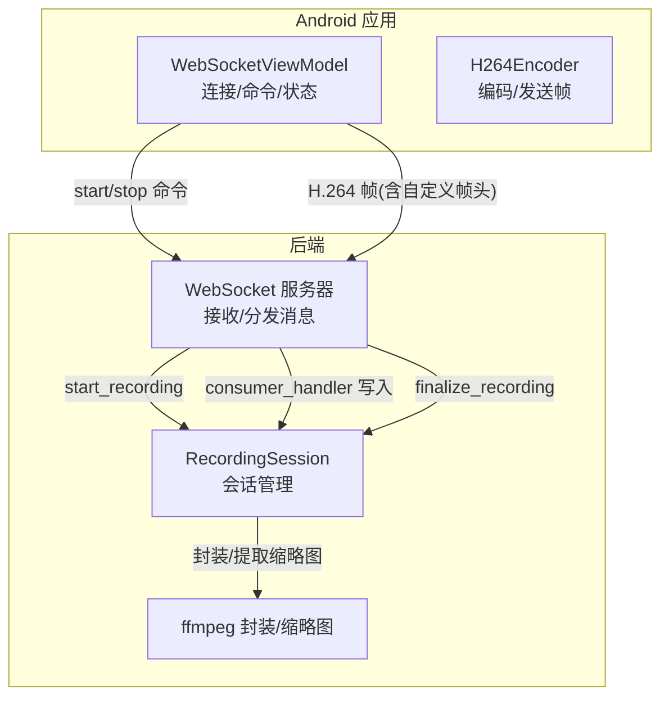
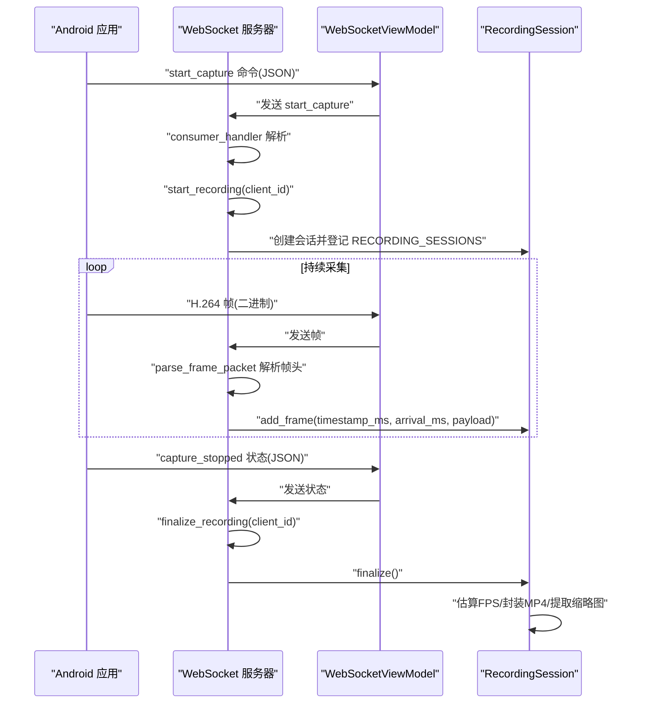
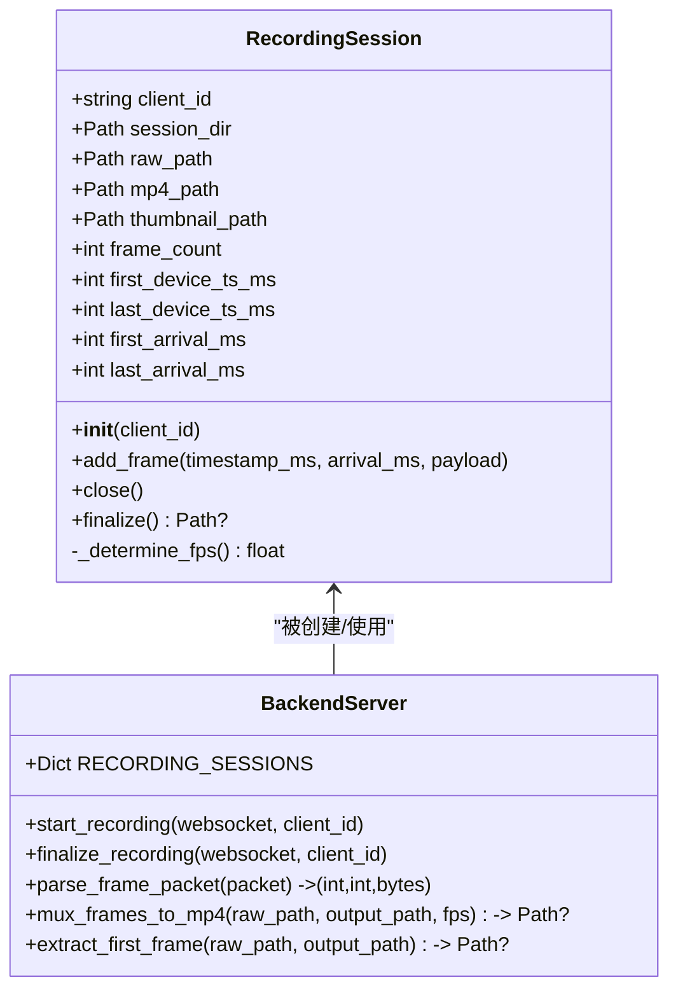
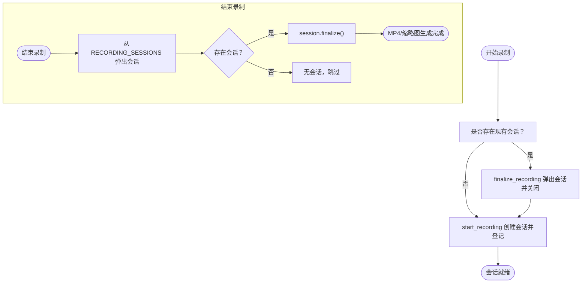
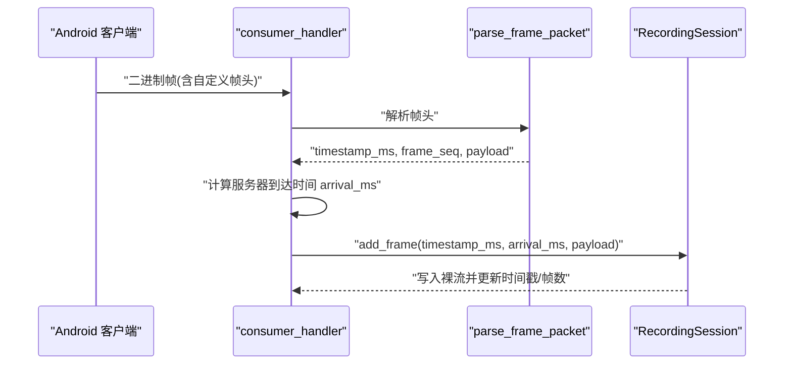
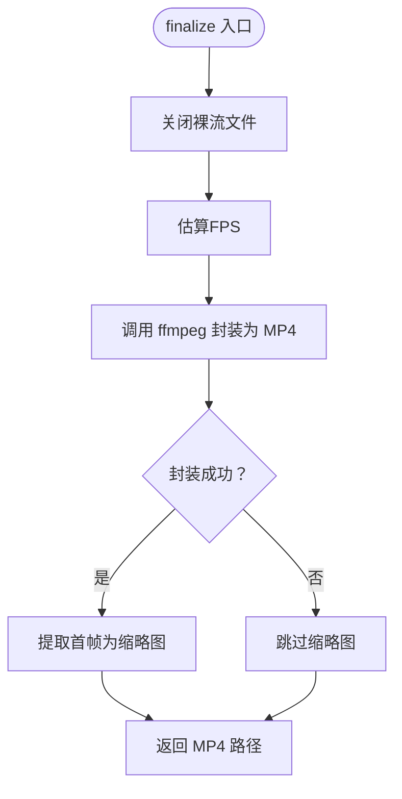
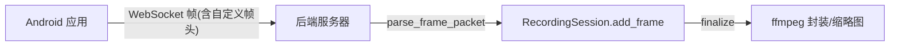

# 录制会话管理

<cite>
**本文引用的文件**
- [backend/server.py](file://backend/server.py)
- [android-camera/app/src/main/java/com/example/lablogcamera/MainActivity.kt](file://android-camera/app/src/main/java/com/example/lablogcamera/MainActivity.kt)
</cite>

## 目录
1. [简介](#简介)
2. [项目结构](#项目结构)
3. [核心组件](#核心组件)
4. [架构总览](#架构总览)
5. [详细组件分析](#详细组件分析)
6. [依赖关系分析](#依赖关系分析)
7. [性能考量](#性能考量)
8. [故障排查指南](#故障排查指南)
9. [结论](#结论)
10. [附录](#附录)

## 简介
本文件围绕“录制会话管理”主题，系统性梳理后端 RecordingSession 类的实现细节，涵盖会话创建与文件落盘、帧写入与时间戳记录、会话终结与 MP4 封装流程；并对 start_recording 与 finalize_recording 如何管理 RECORDING_SESSIONS 字典进行说明。文档同时面向初学者提供会话创建与销毁的示例步骤，面向资深开发者总结状态一致性与资源清理的最佳实践。

## 项目结构
本仓库包含后端 WebSocket 服务器与 Android 摄像头应用两部分：
- 后端：负责接收 H.264 帧、维护录制会话、落盘裸流、估算帧率并封装为 MP4。
- Android 应用：负责采集、编码、按固定帧头格式发送 H.264 帧，并上报状态。

图表来源
- [backend/server.py](file://backend/server.py#L210-L303)
- [android-camera/app/src/main/java/com/example/lablogcamera/MainActivity.kt](file://android-camera/app/src/main/java/com/example/lablogcamera/MainActivity.kt#L867-L941)

章节来源
- [backend/server.py](file://backend/server.py#L1-L20)
- [android-camera/app/src/main/java/com/example/lablogcamera/MainActivity.kt](file://android-camera/app/src/main/java/com/example/lablogcamera/MainActivity.kt#L867-L941)

## 核心组件
- RecordingSession：后端针对单个客户端的一次录制会话，负责：
  - 会话目录与文件创建（裸 H.264 与 MP4、缩略图）
  - 追加 H.264 帧并记录时间戳
  - 估算帧率并封装为 MP4，提取首帧缩略图
- start_recording / finalize_recording：管理 RECORDING_SESSIONS 字典的生命周期，确保会话创建与结束时的幂等与一致性。
- consumer_handler：接收来自客户端的消息，区分文本状态与二进制帧，驱动会话写入与结束。

章节来源
- [backend/server.py](file://backend/server.py#L26-L133)
- [backend/server.py](file://backend/server.py#L210-L231)
- [backend/server.py](file://backend/server.py#L234-L279)

## 架构总览
后端以 WebSocket 为入口，通过 consumer_handler 统一分发消息；Android 应用通过 WebSocket 发送命令与 H.264 帧。后端在收到 capture_started/capture_stopped 状态时触发 start_recording/finalize_recording；收到二进制帧时解析帧头并写入 RecordingSession。

图表来源
- [backend/server.py](file://backend/server.py#L135-L147)
- [backend/server.py](file://backend/server.py#L210-L231)
- [backend/server.py](file://backend/server.py#L234-L279)
- [android-camera/app/src/main/java/com/example/lablogcamera/MainActivity.kt](file://android-camera/app/src/main/java/com/example/lablogcamera/MainActivity.kt#L902-L941)

## 详细组件分析

### RecordingSession 类详解
- 会话目录与文件
  - 构造函数创建 recordings/<client_id>_<timestamp> 目录，生成 stream.h264、stream.mp4、thumbnail.jpg 路径，并打开裸流文件句柄。
- 帧写入与时间戳记录
  - add_frame 接收设备时间戳、服务器到达时间与裸 H.264 负载，写入裸流并累计帧数，同时维护首尾设备时间戳与首尾到达时间戳。
- 会话终结与封装
  - finalize 关闭裸流，估算 FPS，调用封装函数生成 MP4，并提取首帧为缩略图。
- FPS 估算策略
  - 优先使用“服务器到达时间”估算，若异常或不可用则回退到“设备时间戳”，均不可用则使用保底 10 FPS。

图表来源
- [backend/server.py](file://backend/server.py#L26-L133)
- [backend/server.py](file://backend/server.py#L135-L207)
- [backend/server.py](file://backend/server.py#L210-L231)

章节来源
- [backend/server.py](file://backend/server.py#L26-L133)
- [backend/server.py](file://backend/server.py#L80-L133)

### 字段用途说明
- frame_count：记录会话累计帧数，用于 FPS 估算与日志输出。
- first_device_ts_ms / last_device_ts_ms：首帧与末帧的设备时间戳，用于“设备时间戳”FPS 估算。
- first_arrival_ms / last_arrival_ms：首帧与末帧到达服务器的时间（毫秒），用于“服务器到达时间”FPS 估算。

章节来源
- [backend/server.py](file://backend/server.py#L41-L59)
- [backend/server.py](file://backend/server.py#L102-L132)

### start_recording 与 finalize_recording 生命周期管理
- start_recording
  - 若当前 WebSocket 已存在会话，先执行 finalize_recording，确保资源回收后再创建新会话。
  - 创建 RecordingSession 并登记到 RECORDING_SESSIONS 字典。
- finalize_recording
  - 从 RECORDING_SESSIONS 弹出会话并调用 finalize，若成功则输出保存路径，否则提示跳过。

图表来源
- [backend/server.py](file://backend/server.py#L210-L231)

章节来源
- [backend/server.py](file://backend/server.py#L210-L231)

### add_frame 写入流程与帧头解析
- 帧头格式（与 Android 端严格对应）：
  - 设备时间戳（uint64，毫秒）
  - 帧序号（uint32，低 32 位递增）
  - 负载长度（uint32，字节数）
- consumer_handler
  - 文本消息：解析 JSON 状态，触发 start_recording 或 finalize_recording。
  - 二进制消息：parse_frame_packet 解析帧头，计算服务器到达时间，调用 session.add_frame 写入裸流。

图表来源
- [backend/server.py](file://backend/server.py#L135-L147)
- [backend/server.py](file://backend/server.py#L234-L274)
- [android-camera/app/src/main/java/com/example/lablogcamera/MainActivity.kt](file://android-camera/app/src/main/java/com/example/lablogcamera/MainActivity.kt#L968-L984)

章节来源
- [backend/server.py](file://backend/server.py#L135-L147)
- [backend/server.py](file://backend/server.py#L234-L274)
- [android-camera/app/src/main/java/com/example/lablogcamera/MainActivity.kt](file://android-camera/app/src/main/java/com/example/lablogcamera/MainActivity.kt#L968-L984)

### finalize 封装流程与缩略图提取
- finalize 步骤
  - 关闭裸流文件
  - 估算 FPS（优先服务器到达时间，其次设备时间戳，最后保底）
  - 调用 mux_frames_to_mp4 使用 ffmpeg 将裸 H.264 封装为 MP4（显式指定输入格式与帧率，复制视频轨）
  - 成功后提取首帧为缩略图
- 错误处理
  - 若裸流不存在或 ffmpeg 失败，输出警告并返回 None。

图表来源
- [backend/server.py](file://backend/server.py#L64-L79)
- [backend/server.py](file://backend/server.py#L150-L179)
- [backend/server.py](file://backend/server.py#L181-L207)

章节来源
- [backend/server.py](file://backend/server.py#L64-L79)
- [backend/server.py](file://backend/server.py#L150-L207)

## 依赖关系分析
- 后端依赖
  - Python 标准库：os、subprocess、struct、pathlib、asyncio、websockets、datetime、typing
  - ffmpeg：通过环境变量 FFMPEG_BIN 指定可执行文件路径
- Android 应用依赖
  - OkHttp WebSocket：与后端建立连接
  - CameraX + MediaCodec：采集与 H.264 编码
  - 自定义帧头：设备时间戳、帧序号、负载长度

图表来源
- [backend/server.py](file://backend/server.py#L135-L147)
- [backend/server.py](file://backend/server.py#L234-L274)
- [android-camera/app/src/main/java/com/example/lablogcamera/MainActivity.kt](file://android-camera/app/src/main/java/com/example/lablogcamera/MainActivity.kt#L968-L984)

章节来源
- [backend/server.py](file://backend/server.py#L1-L19)
- [android-camera/app/src/main/java/com/example/lablogcamera/MainActivity.kt](file://android-camera/app/src/main/java/com/example/lablogcamera/MainActivity.kt#L1-L120)

## 性能考量
- 帧率估算
  - 优先使用服务器到达时间估算，更贴近网络传输节奏；设备时间戳作为回退。
  - 对异常值进行边界约束，避免极端 FPS 导致封装失败。
- 封装效率
  - 使用 ffmpeg -c:v copy 直接拷贝视频轨，避免重编码，提升吞吐。
  - 显式指定输入格式与帧率，减少 ffmpeg 自动推断误差。
- 资源管理
  - 会话结束时及时关闭裸流文件，避免句柄泄漏。
  - 通过 RECORDING_SESSIONS 字典管理会话生命周期，避免并发竞态。

章节来源
- [backend/server.py](file://backend/server.py#L80-L133)
- [backend/server.py](file://backend/server.py#L150-L179)

## 故障排查指南
- 无法生成 MP4
  - 检查裸 H.264 文件是否存在
  - 查看 ffmpeg 返回码与 stderr 输出
  - 确认环境变量 FFMPEG_BIN 指向正确的可执行文件
- FPS 估算异常
  - 检查首尾帧时间戳是否正确写入
  - 确认服务器到达时间计算逻辑未被阻塞
- 会话未结束
  - 确认客户端发送 capture_stopped 状态
  - 检查 consumer_handler 是否在 finally 中调用 finalize_recording
- 帧头解析失败
  - 校验帧头长度与负载长度一致性
  - 确认大小端与数据类型匹配

章节来源
- [backend/server.py](file://backend/server.py#L135-L147)
- [backend/server.py](file://backend/server.py#L150-L179)
- [backend/server.py](file://backend/server.py#L234-L279)

## 结论
本设计以 RecordingSession 为核心，结合 start_recording/finalize_recording 的生命周期管理，实现了从帧写入到 MP4 封装的完整闭环。通过严格的帧头格式与双路 FPS 估算策略，兼顾了准确性与鲁棒性。建议在生产环境中：
- 明确 ffmpeg 可执行文件路径与权限
- 在高并发场景下确保 RECORDING_SESSIONS 的线程安全
- 对异常情况进行日志与告警，保障可观测性

## 附录

### 初学者示例：创建与销毁会话
- 启动后端服务器
- 在 Android 应用中连接 WebSocket
- 发送 start_capture 命令（可携带宽高比、码率、目标 FPS）
- 发送 capture_started 状态
- 持续接收 H.264 帧并写入会话
- 发送 capture_stopped 状态
- 等待 finalize 完成，检查 recordings/<client_id>_<timestamp>/ 下的 stream.mp4 与 thumbnail.jpg

章节来源
- [backend/server.py](file://backend/server.py#L234-L279)
- [android-camera/app/src/main/java/com/example/lablogcamera/MainActivity.kt](file://android-camera/app/src/main/java/com/example/lablogcamera/MainActivity.kt#L902-L941)

### 资深开发者最佳实践
- 幂等性
  - start_recording 中若已有会话，先 finalize 再创建，避免资源泄漏
- 状态一致性
  - consumer_handler 在 finally 中统一调用 finalize_recording，确保异常断连也能回收
- 资源清理
  - finalize 中关闭裸流文件，封装失败时避免残留句柄
- 错误隔离
  - parse_frame_packet 对帧头长度与负载长度进行校验，异常时跳过并记录错误
- 性能优化
  - 使用 -c:v copy 与显式帧率，减少封装耗时
  - 对 FPS 估算结果进行边界约束，避免异常值影响封装

章节来源
- [backend/server.py](file://backend/server.py#L210-L231)
- [backend/server.py](file://backend/server.py#L234-L279)
- [backend/server.py](file://backend/server.py#L150-L179)