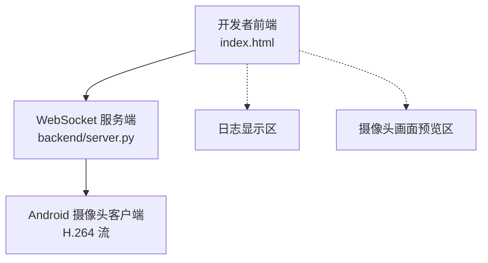
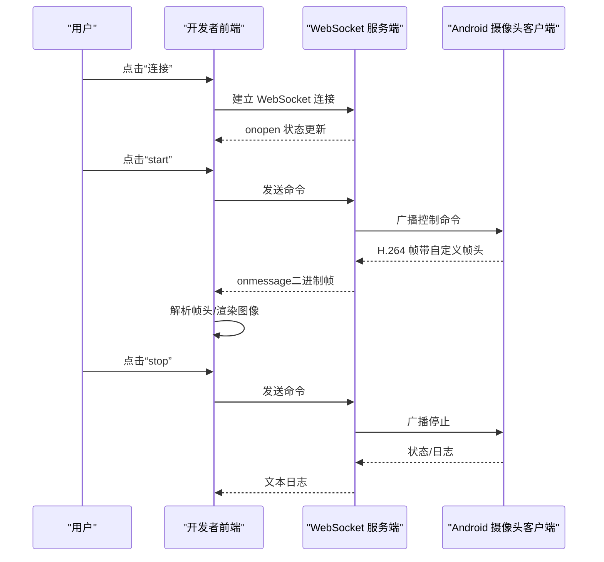
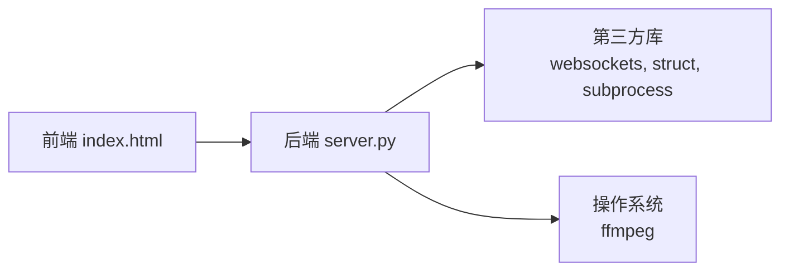

# 开发者前端

<cite>
**本文引用的文件**
- [index.html](file://developer-frontend/index.html)
- [server.py](file://backend/server.py)
- [index.html（历史版本）](file://archive/20251117_arduino_send_images_to_backend_and_frontend/developer-frontend/index.html)
- [server.py（历史版本）](file://archive/20251117_arduino_send_images_to_backend_and_frontend/backend/server.py)
- [image_manager.py（历史版本）](file://archive/20251117_arduino_send_images_to_backend_and_frontend/backend/image_manager.py)
- [fps_monitor.py（历史版本）](file://archive/20251117_arduino_send_images_to_backend_and_frontend/backend/fps_monitor.py)
</cite>

## 目录
1. [简介](#简介)
2. [项目结构](#项目结构)
3. [核心组件](#核心组件)
4. [架构总览](#架构总览)
5. [详细组件分析](#详细组件分析)
6. [依赖关系分析](#依赖关系分析)
7. [性能考量](#性能考量)
8. [故障排查指南](#故障排查指南)
9. [结论](#结论)
10. [附录](#附录)

## 简介
本文件面向开发者前端，系统化说明其作为控制台的视觉外观、行为与用户交互模式，以及通过 WebSocket 与后端通信以发送控制命令（如 start、stop）并接收日志与图像数据的机制。文档覆盖界面布局（连接配置、命令控制、日志显示、摄像头画面预览）、响应式设计与全屏功能，并提供使用示例与跨浏览器兼容性建议。

## 项目结构
开发者前端位于 developer-frontend/index.html，采用单页 HTML + 内联脚本实现，无外部依赖。后端包含两套实现：
- 现行后端（H.264 录制与封装）：位于 backend/server.py
- 历史后端（MJPEG 图像转发与统计）：位于 archive/20251117_arduino_send_images_to_backend_and_frontend/backend/server.py，配套 image_manager.py 与 fps_monitor.py

下图展示当前前端与后端的交互关系（基于 H.264 流）：

图表来源
- [index.html](file://developer-frontend/index.html#L224-L566)
- [server.py](file://backend/server.py#L282-L440)

章节来源
- [index.html](file://developer-frontend/index.html#L224-L566)
- [server.py](file://backend/server.py#L282-L440)

## 核心组件
- 连接配置面板：设置 WebSocket URL、连接/断开按钮、状态指示
- 命令控制面板：分辨率选择、JPEG质量输入、start/stop/status、自定义命令
- 日志显示区：按时间顺序输出系统、入站、出站日志
- 摄像头画面预览区：接收二进制图像数据，支持双缓冲无缝切换与全屏

章节来源
- [index.html](file://developer-frontend/index.html#L230-L291)
- [index.html](file://developer-frontend/index.html#L297-L566)

## 架构总览
开发者前端通过 WebSocket 与后端建立双向通信：
- 发送：start、stop、status 与自定义命令
- 接收：文本日志与二进制图像数据（历史版本为 JPEG，当前版本为 H.264 流）

图表来源
- [index.html](file://developer-frontend/index.html#L347-L453)
- [server.py](file://backend/server.py#L282-L324)
- [server.py](file://backend/server.py#L233-L279)

章节来源
- [index.html](file://developer-frontend/index.html#L347-L453)
- [server.py](file://backend/server.py#L233-L279)
- [server.py](file://backend/server.py#L282-L324)

## 详细组件分析

### 视觉外观与布局
- 整体采用深色主题，网格布局三列：左侧连接配置与命令控制、中间日志、右侧摄像头画面
- 面板统一圆角边框、阴影与背景色，强调对比度与可读性
- 状态栏显示连接状态（未连接/连接中/已连接/错误）
- 日志区域自动滚动至最新条目，区分系统、入站、出站日志颜色

章节来源
- [index.html](file://developer-frontend/index.html#L1-L222)
- [index.html](file://developer-frontend/index.html#L224-L291)

### 用户交互模式
- 连接管理：输入 WebSocket URL，点击连接/断开；连接成功后启用命令按钮
- 命令发送：start/stop/status 四个快捷按钮；自定义命令支持 Enter 快捷键
- 图像预览：二进制数据转为图片显示；首次接收时移除占位提示；双缓冲无缝切换
- 全屏功能：悬浮全屏按钮与键盘 F11/ESC 快捷键；全屏状态下优化显示尺寸与按钮样式

章节来源
- [index.html](file://developer-frontend/index.html#L297-L566)
- [index.html](file://developer-frontend/index.html#L347-L453)

### WebSocket 通信与命令协议
- 前端命令构造：start 命令可携带分辨率与质量参数；其他命令原样发送
- 后端广播：服务端将控制命令广播给所有已连接客户端
- 历史版本（MJPEG）：后端将二进制 JPEG 直接转发给前端；文本日志同步显示
- 当前版本（H.264）：后端解析自定义帧头，按会话写入裸 H.264，结束时封装为 MP4 并生成缩略图

章节来源
- [index.html](file://developer-frontend/index.html#L531-L563)
- [server.py](file://backend/server.py#L305-L324)
- [server.py](file://backend/server.py#L135-L148)
- [server.py](file://backend/server.py#L150-L179)
- [server.py](file://backend/server.py#L181-L208)

### 响应式设计与全屏功能
- 响应式网格：左侧控制面板宽度最小 0，右侧日志与画面随窗口自适应
- 全屏样式：进入全屏后背景变黑、图片最大宽度/高度适配视窗，按钮放大
- 事件绑定：监听 fullscreenchange/webkitfullscreenchange/msfullscreenchange，动态更新按钮文案

章节来源
- [index.html](file://developer-frontend/index.html#L136-L203)
- [index.html](file://developer-frontend/index.html#L475-L516)

### 历史版本对比（MJPEG）
- 前端：与当前版本一致的 UI 与交互，但后端转发的是 JPEG 二进制数据
- 后端：按帧统计 FPS，保存图片，向前端发送日志与图片；支持命令行控制
- 适用场景：早期摄像头以 MJPEG 传输的演示环境

章节来源
- [index.html（历史版本）](file://archive/20251117_arduino_send_images_to_backend_and_frontend/developer-frontend/index.html#L224-L566)
- [server.py（历史版本）](file://archive/20251117_arduino_send_images_to_backend_and_frontend/backend/server.py#L40-L194)
- [image_manager.py（历史版本）](file://archive/20251117_arduino_send_images_to_backend_and_frontend/backend/image_manager.py#L1-L90)
- [fps_monitor.py（历史版本）](file://archive/20251117_arduino_send_images_to_backend_and_frontend/backend/fps_monitor.py#L1-L67)

## 依赖关系分析
- 前端依赖：现代浏览器的 WebSocket API、FileReader、全屏 API
- 后端依赖：Python websockets 库、struct（解析自定义帧头）、subprocess（调用 ffmpeg）

图表来源
- [index.html](file://developer-frontend/index.html#L297-L566)
- [server.py](file://backend/server.py#L1-L20)

章节来源
- [index.html](file://developer-frontend/index.html#L297-L566)
- [server.py](file://backend/server.py#L1-L20)

## 性能考量
- 图像渲染：前端采用双缓冲策略，先隐藏新图再替换旧图，减少闪烁
- 日志滚动：每次新增日志自动滚动到底部，避免长列表卡顿
- 二进制处理：历史版本直接读取二进制为 DataURL，当前版本后端解析 H.264 帧头，避免前端解码负担
- 帧率统计：历史版本每秒统计一次 FPS，便于观察网络与设备性能

章节来源
- [index.html](file://developer-frontend/index.html#L383-L439)
- [server.py（历史版本）](file://archive/20251117_arduino_send_images_to_backend_and_frontend/backend/server.py#L80-L106)
- [fps_monitor.py（历史版本）](file://archive/20251117_arduino_send_images_to_backend_and_frontend/backend/fps_monitor.py#L25-L58)

## 故障排查指南
- 连接失败
  - 检查 WebSocket URL 是否正确，端口与路径是否匹配
  - 查看状态栏与日志输出，确认 onerror/onclose 事件
  - 确认后端服务已启动并监听相应端口
- 无法发送命令
  - 确认连接状态为“已连接”，按钮未禁用
  - 若后端未连接到摄像头客户端，命令可能被忽略或返回错误
- 图像不显示
  - 确认后端确实在推送图像数据（历史版本）
  - 检查图片加载错误回调，确认 DataURL 读取成功
- 全屏异常
  - 确认浏览器支持全屏 API，不同内核需要前缀
  - 使用 F11/ESC 快捷键验证，或点击悬浮按钮

章节来源
- [index.html](file://developer-frontend/index.html#L347-L453)
- [index.html](file://developer-frontend/index.html#L475-L516)
- [server.py（历史版本）](file://archive/20251117_arduino_send_images_to_backend_and_frontend/backend/server.py#L140-L194)

## 结论
开发者前端提供了简洁直观的控制台界面，通过 WebSocket 实现与后端的稳定通信。当前版本聚焦 H.264 流的录制与封装，历史版本展示了 MJPEG 的转发与统计能力。界面具备良好的响应式与全屏体验，适合在多种设备上进行摄像头控制与监控。

## 附录

### 使用示例（文字版）
- 打开页面，确认默认 WebSocket URL，点击“连接”
- 点击“start”开始采集；可在分辨率与质量处调整参数
- 在“日志”区域查看系统与入站/出站信息
- 在“摄像头画面”区域预览图像；双击图片或点击全屏按钮进入全屏
- 点击“stop”停止采集；点击“status”查询状态

章节来源
- [index.html](file://developer-frontend/index.html#L230-L291)
- [index.html](file://developer-frontend/index.html#L531-L563)

### 跨浏览器兼容性建议
- 全屏 API：不同浏览器内核需要 requestFullscreen/webkitRequestFullscreen/msRequestFullscreen 前缀；代码已内置检测
- WebSocket：现代浏览器均支持；若遇到代理或安全策略限制，需检查证书与 CORS
- 图像加载：Data URL 读取失败时会触发错误回调，前端会移除临时节点并记录日志

章节来源
- [index.html](file://developer-frontend/index.html#L475-L516)
- [index.html](file://developer-frontend/index.html#L383-L439)