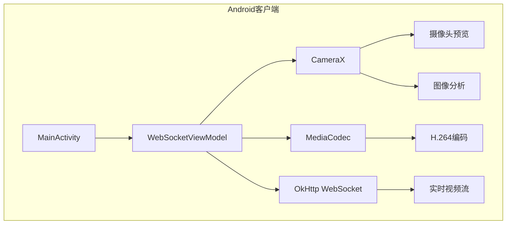
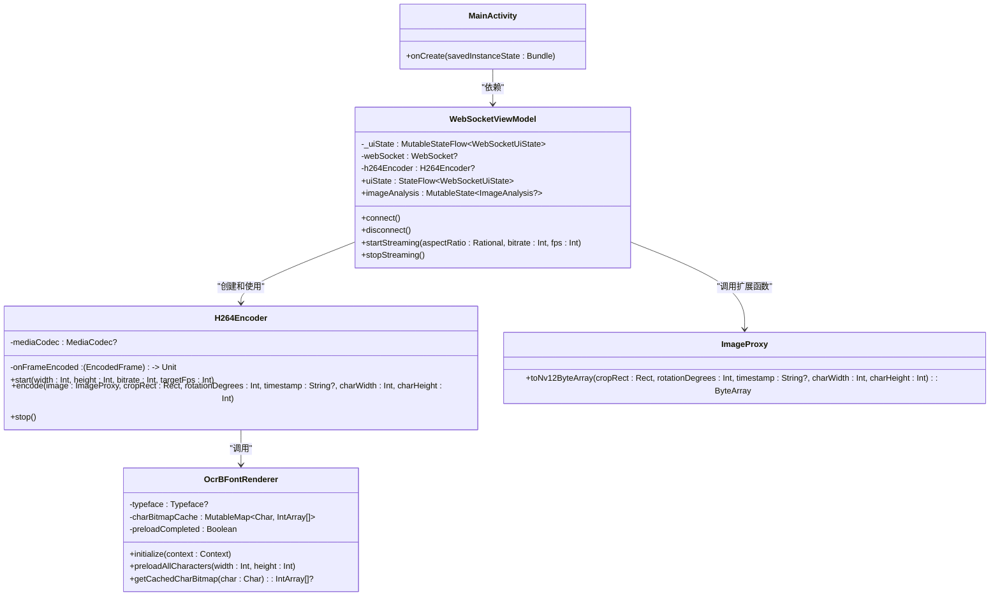
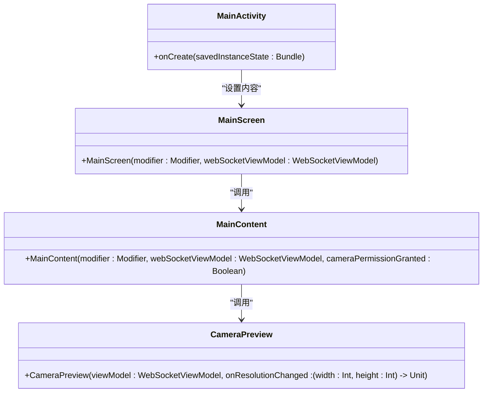
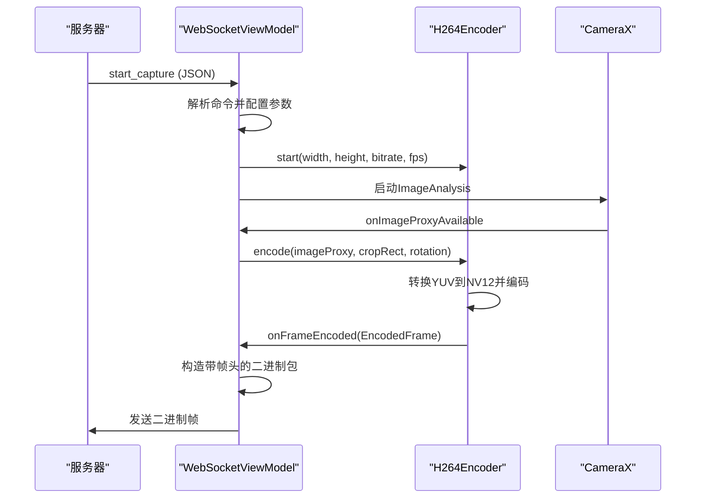
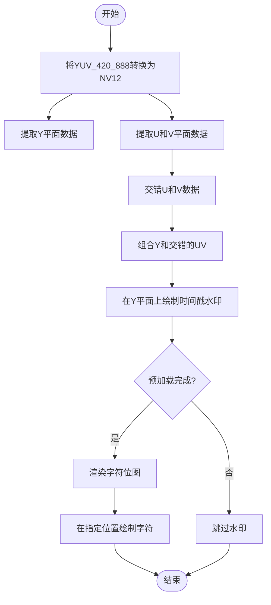
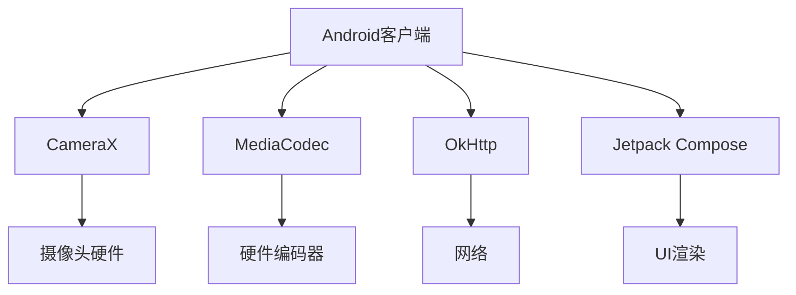

# Android客户端

<cite>
**本文档引用的文件**   
- [MainActivity.kt](file://android-camera/app/src/main/java/com/example/lablogcamera/MainActivity.kt)
- [AndroidManifest.xml](file://android-camera/app/src/main/AndroidManifest.xml)
</cite>

## 目录
1. [简介](#简介)
2. [项目结构](#项目结构)
3. [核心组件](#核心组件)
4. [架构概述](#架构概述)
5. [详细组件分析](#详细组件分析)
6. [依赖分析](#依赖分析)
7. [性能考虑](#性能考虑)
8. [故障排除指南](#故障排除指南)
9. [结论](#结论)

## 简介
本架构文档详细描述了lab-log项目的Android客户端，该客户端实现了基于MVVM架构模式的实时视频流传输系统。系统以`MainActivity`作为视图层，`WebSocketViewModel`作为视图模型层，负责管理WebSocket连接和视频编码状态。客户端利用CameraX进行摄像头预览和图像分析，使用MediaCodec进行H.264硬件编码，并通过OkHttp WebSocket客户端将编码后的视频帧实时传输到后端服务器。文档还解释了自定义帧头协议的设计，该协议包含设备时间戳、帧序号和负载长度，用于在后端重建时间轴和估算FPS。此外，文档涵盖了摄像头权限处理、YUV到NV12转换、时间戳水印渲染（使用OCR-B字体）等关键实现细节，以及分辨率选择、摄像头切换和参数动态调整等用户交互功能。

## 项目结构
Android客户端项目结构遵循标准的Android应用布局，主要功能集中在`android-camera`模块中。`app/src/main/java/com/example/lablogcamera`目录包含了应用的核心代码，包括`MainActivity`和`WebSocketViewModel`。UI组件使用Jetpack Compose构建，位于`ui/theme`包中。资源文件（如字符串、颜色、主题）位于`res`目录下。应用的入口点是`MainActivity`，它通过`AndroidManifest.xml`声明为启动Activity。

**Diagram sources**
- [MainActivity.kt](file://android-camera/app/src/main/java/com/example/lablogcamera/MainActivity.kt#L1678-L2108)
- [AndroidManifest.xml](file://android-camera/app/src/main/AndroidManifest.xml#L1-L32)

## 核心组件
Android客户端的核心组件包括`MainActivity`、`WebSocketViewModel`、`H264Encoder`、`OcrBFontRenderer`和`ImageProxy`扩展函数。`MainActivity`作为视图层，负责用户界面的展示和用户交互的处理。`WebSocketViewModel`作为视图模型层，负责管理WebSocket连接、摄像头分析和视频编码的生命周期。`H264Encoder`封装了MediaCodec，负责将YUV图像数据编码为H.264格式。`OcrBFontRenderer`负责加载OCR-B字体并预渲染时间戳字符位图。`ImageProxy`扩展函数`toNv12ByteArray`负责将CameraX的YUV_420_888三平面数据转换为NV12半平面格式，并在Y平面上绘制时间戳水印。

**Section sources**
- [MainActivity.kt](file://android-camera/app/src/main/java/com/example/lablogcamera/MainActivity.kt#L1-L2108)

## 架构概述
Android客户端采用MVVM架构模式，将视图层与业务逻辑层分离。`MainActivity`作为视图层，通过Jetpack Compose构建用户界面，并与`WebSocketViewModel`进行数据绑定。`WebSocketViewModel`作为视图模型层，持有`H264Encoder`实例和OkHttp WebSocket客户端，负责处理摄像头数据流、视频编码和网络传输。`H264Encoder`作为模型层的一部分，封装了MediaCodec的复杂性，提供简单的编码接口。整个系统通过`WebSocketViewModel`的`uiState`和`imageAnalysis`等状态流，实现数据的单向流动和UI的自动更新。

**Diagram sources**
- [MainActivity.kt](file://android-camera/app/src/main/java/com/example/lablogcamera/MainActivity.kt#L554-L1448)
- [MainActivity.kt](file://android-camera/app/src/main/java/com/example/lablogcamera/MainActivity.kt#L187-L276)
- [MainActivity.kt](file://android-camera/app/src/main/java/com/example/lablogcamera/MainActivity.kt#L305-L458)
- [MainActivity.kt](file://android-camera/app/src/main/java/com/example/lablogcamera/MainActivity.kt#L1466-L1659)

## 详细组件分析

### 主要活动分析
`MainActivity`是应用的入口点，负责初始化UI和设置`WebSocketViewModel`。它使用Jetpack Compose的`Scaffold`和`MainScreen`可组合函数构建用户界面。`MainScreen`包含一个权限检查逻辑，确保在获取摄像头权限后才初始化摄像头预览。`MainContent`可组合函数负责显示摄像头预览、控制按钮和状态信息。`CameraPreview`可组合函数使用`PreviewView`来显示摄像头预览，并通过`UseCaseGroup`确保预览和图像分析使用相同的视口，从而保持一致的视野。

#### 对于对象导向组件：

**Diagram sources**
- [MainActivity.kt](file://android-camera/app/src/main/java/com/example/lablogcamera/MainActivity.kt#L1678-L2108)

### 视图模型分析
`WebSocketViewModel`是应用的核心业务逻辑所在。它管理WebSocket连接的生命周期，处理来自服务器的命令（如`start_capture`和`stop_capture`），并控制视频流的开始和停止。当收到`start_capture`命令时，`WebSocketViewModel`会配置`H264Encoder`，设置目标分辨率、码率和帧率，并启动`ImageAnalysis`用例来接收摄像头帧。它还负责将编码后的H.264帧通过WebSocket发送到服务器，并在帧头中添加设备时间戳、帧序号和负载长度。

#### 对于API/服务组件：

**Diagram sources**
- [MainActivity.kt](file://android-camera/app/src/main/java/com/example/lablogcamera/MainActivity.kt#L867-L942)
- [MainActivity.kt](file://android-camera/app/src/main/java/com/example/lablogcamera/MainActivity.kt#L944-L1200)

### 复杂逻辑组件分析
`H264Encoder`类封装了MediaCodec的复杂性。`toNv12ByteArray`扩展函数负责将CameraX的YUV_420_888三平面数据转换为NV12半平面格式，这是MediaCodec编码器所期望的输入格式。转换过程包括从`ImageProxy`的三个平面（Y、U、V）中提取数据，并将U和V平面交错排列。`drawTimestampOnNv12`函数负责在NV12数据的Y平面上绘制时间戳水印。它使用`OcrBFontRenderer`预渲染的字符位图，将时间戳字符串逐个字符地绘制到指定位置。

#### 对于复杂逻辑组件：

**Diagram sources**
- [MainActivity.kt](file://android-camera/app/src/main/java/com/example/lablogcamera/MainActivity.kt#L1466-L1659)
- [MainActivity.kt](file://android-camera/app/src/main/java/com/example/lablogcamera/MainActivity.kt#L474-L550)

## 依赖分析
Android客户端的主要依赖包括AndroidX库、CameraX、MediaCodec、OkHttp和Jetpack Compose。`AndroidManifest.xml`声明了摄像头和互联网权限，这是应用正常运行所必需的。`build.gradle.kts`文件中定义了这些库的依赖关系。`WebSocketViewModel`依赖于`H264Encoder`进行视频编码，依赖于CameraX进行图像分析，依赖于OkHttp进行网络通信。`H264Encoder`依赖于`OcrBFontRenderer`进行时间戳水印渲染。

**Diagram sources**
- [AndroidManifest.xml](file://android-camera/app/src/main/AndroidManifest.xml#L1-L32)
- [MainActivity.kt](file://android-camera/app/src/main/java/com/example/lablogcamera/MainActivity.kt#L3-L119)

## 性能考虑
为了优化性能，客户端实现了多种策略。首先，`H264Encoder`在编码前检查输入缓冲区的大小，避免`BufferOverflow`异常。其次，`WebSocketViewModel`通过`shouldSendFrame`函数实现帧率控制，根据服务器指定的目标帧率主动丢弃多余的帧，从而平滑控制发送速率。此外，`OcrBFontRenderer`在应用启动时预加载所有时间戳所需的字符位图，避免在编码过程中进行耗时的字体渲染操作。最后，`toNv12ByteArray`函数在转换YUV数据时，对裁剪区域进行对齐处理，确保宽度和高度为偶数，以满足硬件编码器的要求。

## 故障排除指南
如果客户端无法连接到服务器，请检查WebSocket URL是否正确，并确保设备具有互联网连接。如果摄像头预览无法显示，请检查是否已授予摄像头权限。如果视频流中断，请检查设备是否锁屏或应用是否被切换到后台，因为这会导致摄像头连接断开。如果编码失败，请检查日志中是否有`BufferOverflow`错误，这可能是由于输入缓冲区太小导致的。如果时间戳水印未显示，请检查`OcrBFontRenderer`的预加载是否成功完成。

**Section sources**
- [MainActivity.kt](file://android-camera/app/src/main/java/com/example/lablogcamera/MainActivity.kt#L887-L892)
- [MainActivity.kt](file://android-camera/app/src/main/java/com/example/lablogcamera/MainActivity.kt#L196-L200)

## 结论
lab-log项目的Android客户端成功实现了一个基于MVVM架构的实时视频流传输系统。通过合理利用CameraX、MediaCodec和OkHttp等Android平台组件，客户端能够高效地采集摄像头数据、进行硬件编码，并通过WebSocket将视频流实时传输到后端服务器。自定义帧头协议的设计使得后端能够准确重建时间轴和估算FPS。整体架构清晰，组件职责分明，为后续的功能扩展和维护提供了良好的基础。