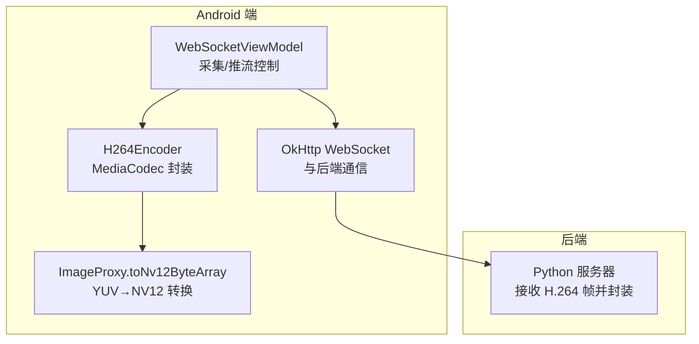
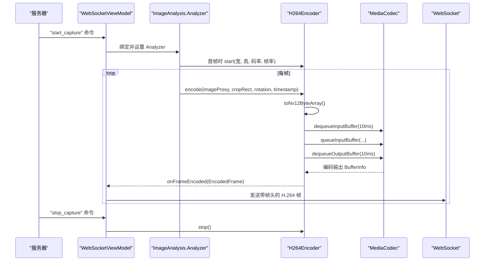
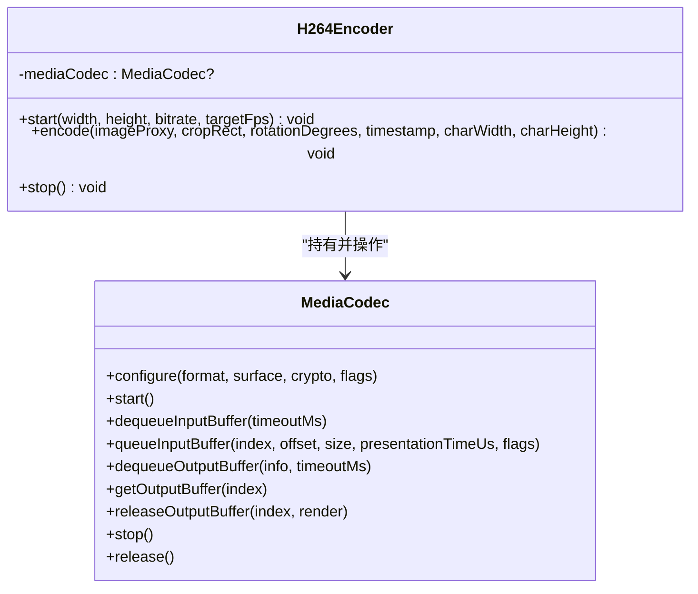
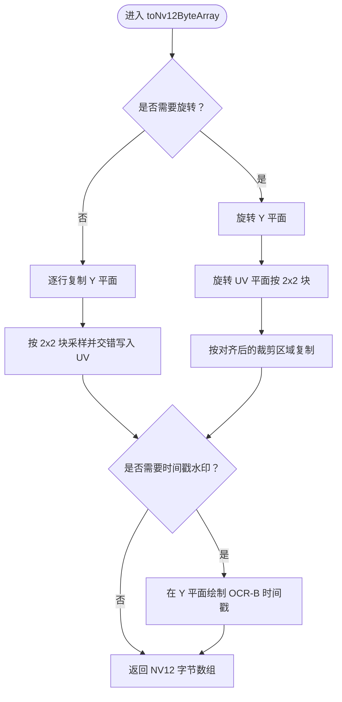
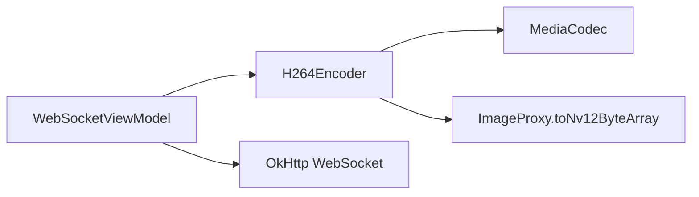

# H.264编码

<cite>
**本文引用的文件**
- [MainActivity.kt](file://android-camera/app/src/main/java/com/example/lablogcamera/MainActivity.kt)
- [README.md](file://android-camera/README.md)
</cite>

## 目录
1. [简介](#简介)
2. [项目结构](#项目结构)
3. [核心组件](#核心组件)
4. [架构总览](#架构总览)
5. [详细组件分析](#详细组件分析)
6. [依赖关系分析](#依赖关系分析)
7. [性能考量](#性能考量)
8. [故障排查指南](#故障排查指南)
9. [结论](#结论)

## 简介
本文件面向 lab-log 项目中的 Android 端 H.264 硬件编码功能，围绕 H264Encoder 类的实现进行深入说明，涵盖：
- 使用 MediaCodec 进行 H.264 编码的配置与流程
- MediaFormat 参数（分辨率、码率、帧率、I 帧间隔）的设置
- YUV420SemiPlanar（NV12）颜色格式的选择与 toNv12ByteArray 转换过程
- 输入/输出缓冲区管理（dequeueInputBuffer/dequeueOutputBuffer 超时与溢出保护）
- start/encode/stop 方法的调用时序与异常处理策略
- 码率单位转换（MB 到 bps）的实现细节
- 性能优化建议（输入缓冲区容量检查、异常捕获防止 Analyzer 中断）

## 项目结构
Android 端采用 Kotlin + Jetpack Compose，H.264 编码位于 MainActivity.kt 中，配合 WebSocketViewModel 的采集与推流控制。README.md 提供了整体架构与协议说明。

图表来源
- [MainActivity.kt](file://android-camera/app/src/main/java/com/example/lablogcamera/MainActivity.kt#L180-L276)
- [README.md](file://android-camera/README.md#L1-L60)

章节来源
- [MainActivity.kt](file://android-camera/app/src/main/java/com/example/lablogcamera/MainActivity.kt#L180-L276)
- [README.md](file://android-camera/README.md#L1-L60)

## 核心组件
- H264Encoder：对 MediaCodec 的轻量封装，负责编码器生命周期与帧处理。
- ImageProxy.toNv12ByteArray 扩展：将 CameraX 的 YUV_420_888（Y、U、V 三平面）转换为 NV12（半平面，UV 交错），并支持旋转与可选时间戳水印。
- WebSocketViewModel：驱动采集、裁剪、旋转、编码与发送的主控制器。

章节来源
- [MainActivity.kt](file://android-camera/app/src/main/java/com/example/lablogcamera/MainActivity.kt#L180-L276)
- [MainActivity.kt](file://android-camera/app/src/main/java/com/example/lablogcamera/MainActivity.kt#L1450-L1659)
- [README.md](file://android-camera/README.md#L40-L90)

## 架构总览
H.264 编码在 Android 端的端到端流程如下：
- WebSocketViewModel 接收服务器命令，初始化 ImageAnalysis 并设置 Analyzer
- Analyzer 首帧时根据裁剪区域启动 H264Encoder（分辨率与旋转已对齐）
- 每帧调用 H264Encoder.encode，内部将 ImageProxy 转换为 NV12，送入 MediaCodec 输入缓冲区
- 循环从输出缓冲区取出编码数据并通过回调传出
- WebSocketViewModel 将编码帧与自定义二进制帧头一起发送到后端

图表来源
- [MainActivity.kt](file://android-camera/app/src/main/java/com/example/lablogcamera/MainActivity.kt#L944-L1220)
- [MainActivity.kt](file://android-camera/app/src/main/java/com/example/lablogcamera/MainActivity.kt#L180-L276)
- [MainActivity.kt](file://android-camera/app/src/main/java/com/example/lablogcamera/MainActivity.kt#L1450-L1659)

## 详细组件分析

### H264Encoder 类
- 职责
  - start(width, height, bitrate, targetFps)：配置 MediaFormat（颜色格式 NV12、分辨率、码率、帧率、I 帧间隔），创建并启动 MediaCodec
  - encode(imageProxy, cropRect, rotationDegrees, timestamp, charWidth, charHeight)：将 YUV_420_888 转换为 NV12，送入输入缓冲区；循环从输出缓冲区拉取编码数据并通过回调传出
  - stop()：停止并释放 MediaCodec

- 关键实现要点
  - 颜色格式：使用 YUV420 半平面（NV12），与 toNv12ByteArray 输出格式一致
  - 帧率：targetFps<=0 时使用默认 10fps 作为编码参考；实际发送帧率由上层 Analyzer 控制
  - I 帧间隔：KEY_FRAME_INTERVAL=1，每秒一个 I 帧
  - 输入缓冲区：dequeueInputBuffer 设置 10ms 超时；容量检查避免 BufferOverflow
  - 输出缓冲区：dequeueOutputBuffer 循环拉取，直到返回负值；使用 BufferInfo.presentationTimeUs 作为设备时间戳
  - 异常处理：encode 内部 try/catch，避免异常传播导致 Analyzer 中断；stop 内部 try/catch 并置空引用

图表来源
- [MainActivity.kt](file://android-camera/app/src/main/java/com/example/lablogcamera/MainActivity.kt#L180-L276)

章节来源
- [MainActivity.kt](file://android-camera/app/src/main/java/com/example/lablogcamera/MainActivity.kt#L180-L276)

### toNv12ByteArray 转换过程
- 目标：将 CameraX 的 YUV_420_888（三平面）转换为 NV12（Y + 交错 UV）
- 关键点
  - 严格偶数对齐：裁剪区域与尺寸均强制为偶数，且满足 32 对齐
  - 旋转支持：支持 0/90/180/270 度旋转；旋转后按对齐后的尺寸裁剪
  - 时间戳水印：可选地在 Y 平面绘制 OCR-B 字体时间戳（白色文字、黑色背景）
  - 布局一致性：输出布局与 COLOR_FormatYUV420SemiPlanar 对应，减少伪影

图表来源
- [MainActivity.kt](file://android-camera/app/src/main/java/com/example/lablogcamera/MainActivity.kt#L1450-L1659)

章节来源
- [MainActivity.kt](file://android-camera/app/src/main/java/com/example/lablogcamera/MainActivity.kt#L1450-L1659)
- [README.md](file://android-camera/README.md#L40-L90)

### 输入缓冲区管理与异常防护
- dequeueInputBuffer 超时：设置 10ms 超时，避免无限阻塞
- 容量检查：比较输入缓冲区 capacity 与 NV12 数据大小，防止 BufferOverflow
- 异常捕获：encode 内部 try/catch，防止异常向上抛出导致 Analyzer 中断
- 输出缓冲区循环：dequeueOutputBuffer 循环拉取，直到返回负值；releaseOutputBuffer(false) 释放

章节来源
- [MainActivity.kt](file://android-camera/app/src/main/java/com/example/lablogcamera/MainActivity.kt#L217-L276)

### start/encode/stop 调用时序与异常处理
- start：首帧时根据裁剪后的尺寸与服务器目标帧率启动编码器
- encode：转换 NV12、送入输入缓冲区、循环拉取输出、回调编码帧
- stop：停止并释放 MediaCodec，置空引用，清除状态

章节来源
- [MainActivity.kt](file://android-camera/app/src/main/java/com/example/lablogcamera/MainActivity.kt#L944-L1220)
- [MainActivity.kt](file://android-camera/app/src/main/java/com/example/lablogcamera/MainActivity.kt#L180-L276)

### 码率单位转换（MB 到 bps）
- 服务器下发的 bitrate 以 MB 为单位（例如 4 表示 4MB/s）
- 转换为 bps：bitrateBps = bitrateMb * 1_000_000
- 传入 MediaFormat.KEY_BIT_RATE，作为编码器目标码率

章节来源
- [MainActivity.kt](file://android-camera/app/src/main/java/com/example/lablogcamera/MainActivity.kt#L925-L931)
- [README.md](file://android-camera/README.md#L208-L214)

## 依赖关系分析
- H264Encoder 依赖 MediaCodec（创建、配置、输入/输出队列）
- ImageProxy.toNv12ByteArray 依赖 ImageProxy 的三平面数据与像素/行对齐信息
- WebSocketViewModel 驱动编码器生命周期与帧发送，负责裁剪、旋转、帧率控制与异常清理

图表来源
- [MainActivity.kt](file://android-camera/app/src/main/java/com/example/lablogcamera/MainActivity.kt#L180-L276)
- [MainActivity.kt](file://android-camera/app/src/main/java/com/example/lablogcamera/MainActivity.kt#L1450-L1659)
- [MainActivity.kt](file://android-camera/app/src/main/java/com/example/lablogcamera/MainActivity.kt#L944-L1220)

章节来源
- [MainActivity.kt](file://android-camera/app/src/main/java/com/example/lablogcamera/MainActivity.kt#L180-L276)
- [MainActivity.kt](file://android-camera/app/src/main/java/com/example/lablogcamera/MainActivity.kt#L944-L1220)

## 性能考量
- 输入缓冲区容量检查：避免帧数据大于输入缓冲区导致溢出
- 异常捕获：防止 Analyzer 中断，保障持续采集
- 帧率控制：Analyzer 层通过最小时间间隔丢帧，避免过度发送
- 旋转与裁剪：先裁剪再旋转可降低 CPU 开销（建议优化方向）
- 对齐策略：32 对齐与偶数约束，减少硬件编码器伪影与性能抖动

章节来源
- [MainActivity.kt](file://android-camera/app/src/main/java/com/example/lablogcamera/MainActivity.kt#L217-L276)
- [README.md](file://android-camera/README.md#L505-L561)

## 故障排查指南
- 无编码输出
  - 检查 dequeueOutputBuffer 是否持续返回负值；确认输入已正确 queueInputBuffer
  - 确认颜色格式与 toNv12ByteArray 输出一致（NV12）
- 绿色/紫色条纹
  - 检查裁剪尺寸是否满足 32 对齐与偶数约束
  - 确认旋转后数据满足 stride 对齐
- 帧率异常
  - 检查 Analyzer 的帧率控制逻辑（最小时间间隔）
  - 评估旋转策略对性能的影响（先裁剪再旋转）
- 异常中断
  - 确认 encode 内部异常被捕获，避免 Analyzer 中断
  - stop 时确保 MediaCodec 正常 stop/release

章节来源
- [MainActivity.kt](file://android-camera/app/src/main/java/com/example/lablogcamera/MainActivity.kt#L217-L276)
- [README.md](file://android-camera/README.md#L419-L504)

## 结论
H264Encoder 通过 MediaCodec 实现高效的 H.264 硬件编码，结合 toNv12ByteArray 的 NV12 转换与严格的对齐策略，有效降低了伪影与性能波动。输入/输出缓冲区的超时与容量检查、异常捕获与帧率控制共同保障了稳定性。未来可在旋转策略上进一步优化以提升帧率表现。