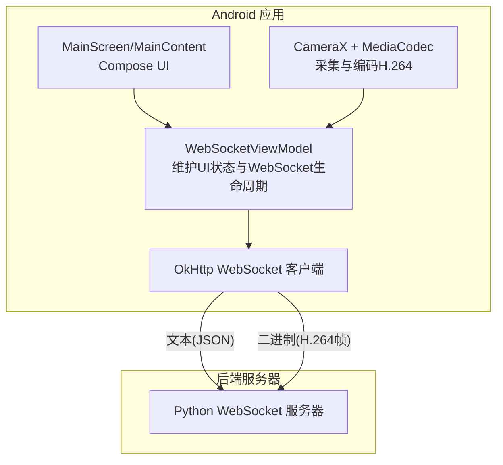
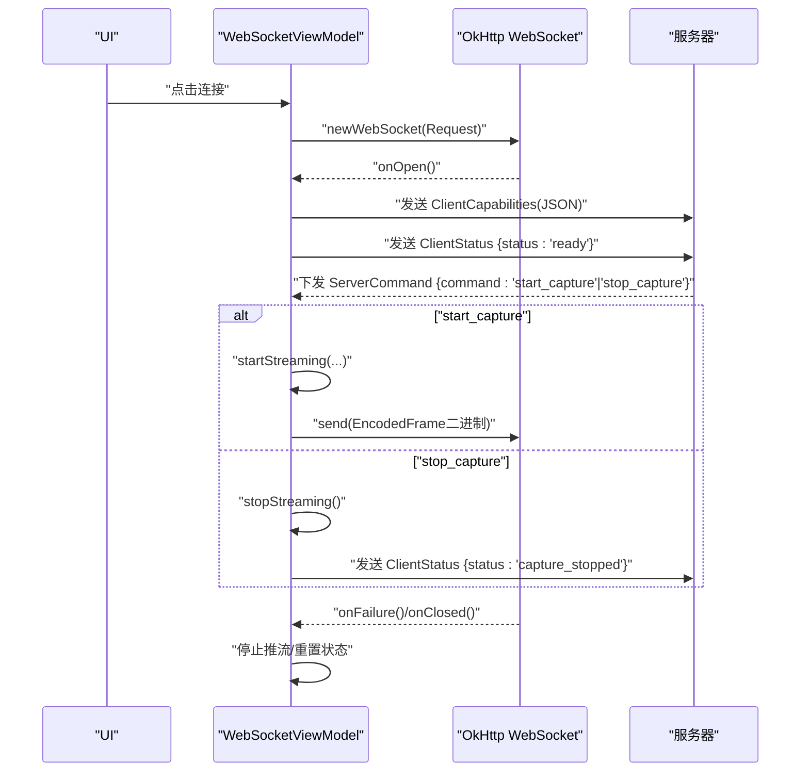
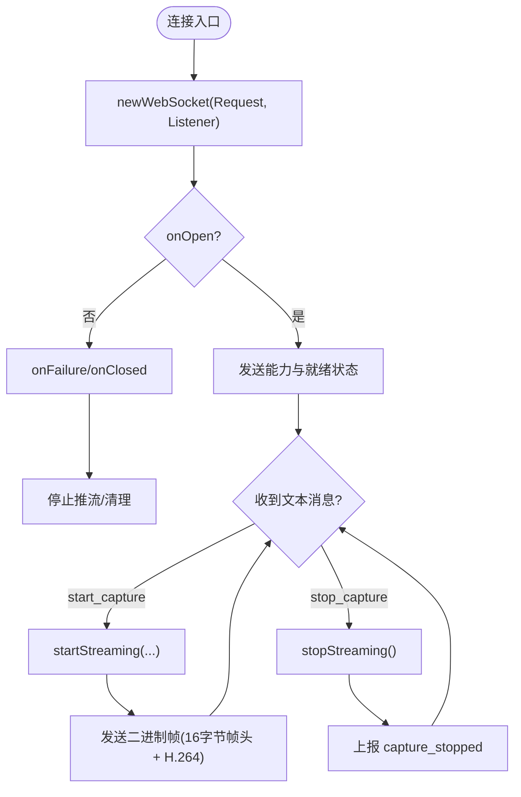
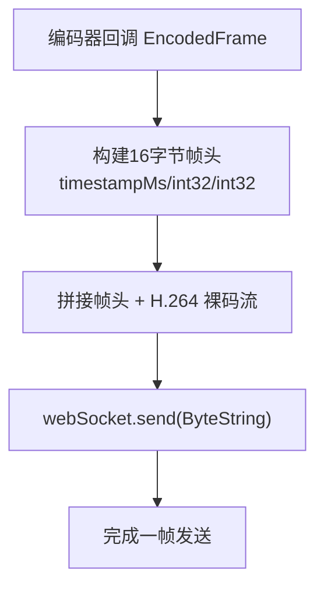
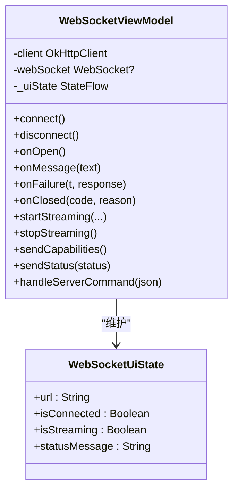
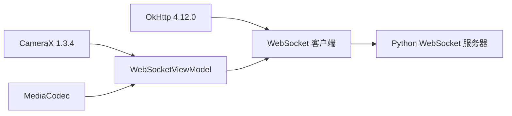

# WebSocket通信

<cite>
**本文引用的文件**
- [MainActivity.kt](file://android-camera/app/src/main/java/com/example/lablogcamera/MainActivity.kt)
- [README.md](file://android-camera/README.md)
- [network_security_config.xml](file://android-camera/app/src/main/res/xml/network_security_config.xml)
- [AndroidManifest.xml](file://android-camera/app/src/main/AndroidManifest.xml)
- [build.gradle.kts](file://android-camera/app/build.gradle.kts)
</cite>

## 目录
1. [简介](#简介)
2. [项目结构](#项目结构)
3. [核心组件](#核心组件)
4. [架构总览](#架构总览)
5. [详细组件分析](#详细组件分析)
6. [依赖分析](#依赖分析)
7. [性能考量](#性能考量)
8. [故障排查指南](#故障排查指南)
9. [结论](#结论)
10. [附录](#附录)

## 简介
本文件面向 lab-log 项目的 Android 端 WebSocket 通信机制，围绕 OkHttp WebSocket 的使用展开，重点说明：
- 如何使用 OkHttp 建立 WebSocket 连接，以及 WebSocketListener 的回调处理（onOpen、onMessage、onFailure、onClosed、onClosing）。
- 文本消息与二进制消息的处理方式：文本消息承载 JSON 控制命令与状态信息，二进制消息承载带帧头的 H.264 视频帧。
- WebSocketViewModel 如何管理连接生命周期、状态更新、重连与错误处理。
- ServerCommand 与 ClientStatus 数据类的使用示例与交互流程。
- WebSocket 连接参数配置（超时、请求头、明文流量策略）。
- 消息发送与接收的线程管理，确保在正确线程上下文中更新 UI。
- 连接状态在 UI 中的反映机制。

## 项目结构
Android 端采用 Kotlin + Jetpack Compose，核心通信逻辑集中在 MainActivity.kt 中的 WebSocketViewModel 类，配合 Compose UI 实时展示连接状态与推流状态。

图表来源
- [MainActivity.kt](file://android-camera/app/src/main/java/com/example/lablogcamera/MainActivity.kt#L554-L900)
- [README.md](file://android-camera/README.md#L135-L269)

章节来源
- [MainActivity.kt](file://android-camera/app/src/main/java/com/example/lablogcamera/MainActivity.kt#L554-L900)
- [README.md](file://android-camera/README.md#L1-L120)

## 核心组件
- WebSocketViewModel：负责连接管理、命令解析、推流控制、状态上报、能力上报、错误处理与资源回收。
- WebSocketListener 回调：onOpen、onMessage、onFailure、onClosed、onClosing。
- ServerCommand/ClientStatus：用于服务端下发命令与客户端上报状态的 JSON 数据结构。
- EncodedFrame：封装编码后的 H.264 帧与设备时间戳，用于二进制帧头构建。
- OkHttp 客户端：创建 WebSocket 请求并驱动连接生命周期。
- ImageAnalysis + H264Encoder：采集 YUV 帧并编码为 H.264，按帧发送二进制数据。

章节来源
- [MainActivity.kt](file://android-camera/app/src/main/java/com/example/lablogcamera/MainActivity.kt#L125-L178)
- [MainActivity.kt](file://android-camera/app/src/main/java/com/example/lablogcamera/MainActivity.kt#L554-L900)
- [MainActivity.kt](file://android-camera/app/src/main/java/com/example/lablogcamera/MainActivity.kt#L944-L1200)
- [README.md](file://android-camera/README.md#L135-L269)

## 架构总览
WebSocket 通信在客户端与服务器之间形成双向通道：
- 客户端在 onOpen 后立即上报能力（ClientCapabilities），随后上报就绪状态（ClientStatus "ready"）。
- 服务器下发控制命令（ServerCommand）触发 start_capture/stop_capture。
- 客户端在 startStreaming 中启动 ImageAnalysis 与 H264Encoder，按帧发送二进制帧（16字节帧头 + H.264 裸码流）。
- 客户端在关键状态变更时上报状态（capture_started/capture_stopped/error）。

图表来源
- [MainActivity.kt](file://android-camera/app/src/main/java/com/example/lablogcamera/MainActivity.kt#L867-L900)
- [MainActivity.kt](file://android-camera/app/src/main/java/com/example/lablogcamera/MainActivity.kt#L902-L942)
- [MainActivity.kt](file://android-camera/app/src/main/java/com/example/lablogcamera/MainActivity.kt#L944-L1200)
- [README.md](file://android-camera/README.md#L135-L269)

## 详细组件分析

### WebSocket 连接与回调处理
- 连接建立：通过 OkHttpClient.newWebSocket(Request, WebSocketListener) 建立连接。
- onOpen：连接成功后，上报能力与就绪状态。
- onMessage：解析文本 JSON 命令，分派到 start_capture/stop_capture。
- onFailure/onClosed：更新 UI 状态为断开，停止推流，清理引用。
- onClosing：优雅关闭。

图表来源
- [MainActivity.kt](file://android-camera/app/src/main/java/com/example/lablogcamera/MainActivity.kt#L867-L900)
- [MainActivity.kt](file://android-camera/app/src/main/java/com/example/lablogcamera/MainActivity.kt#L902-L942)
- [MainActivity.kt](file://android-camera/app/src/main/java/com/example/lablogcamera/MainActivity.kt#L944-L1200)

章节来源
- [MainActivity.kt](file://android-camera/app/src/main/java/com/example/lablogcamera/MainActivity.kt#L867-L900)
- [MainActivity.kt](file://android-camera/app/src/main/java/com/example/lablogcamera/MainActivity.kt#L902-L942)

### 文本消息与二进制消息处理
- 文本消息（JSON）：
  - 控制命令：ServerCommand(command, payload)。payload 包含 format、aspectRatio、bitrate(MB)、fps。
  - 状态上报：ClientStatus(status, message)。
- 二进制消息（H.264 帧）：
  - 帧头：16 字节（大端），包含 timestampMs、frameSequence（低 32 位）、payloadSize。
  - 负载：H.264 NAL 裸码流。
  - 发送时机：编码器回调中，按帧拼接后通过 webSocket.send(ByteString) 发送。

图表来源
- [MainActivity.kt](file://android-camera/app/src/main/java/com/example/lablogcamera/MainActivity.kt#L968-L984)
- [README.md](file://android-camera/README.md#L253-L269)

章节来源
- [MainActivity.kt](file://android-camera/app/src/main/java/com/example/lablogcamera/MainActivity.kt#L968-L984)
- [README.md](file://android-camera/README.md#L253-L269)

### WebSocketViewModel：连接状态、重连与错误处理
- 状态管理：WebSocketUiState(url, isConnected, isStreaming, statusMessage)。
- 连接控制：connect()/disconnect()，在 UI 切换开关时调用。
- 命令处理：handleServerCommand() 解析 JSON，分派 start_capture/stop_capture。
- 推流控制：startStreaming() 启动 ImageAnalysis + H264Encoder，按帧发送二进制；stopStreaming() 停止并清理。
- 错误处理：onFailure/onClosed 中重置 isConnected/isStreaming，停止推流，webSocket 置空。
- 能力上报：sendCapabilities() 与 buildCapabilitiesJson()。
- 状态上报：sendStatus()。

图表来源
- [MainActivity.kt](file://android-camera/app/src/main/java/com/example/lablogcamera/MainActivity.kt#L554-L900)
- [MainActivity.kt](file://android-camera/app/src/main/java/com/example/lablogcamera/MainActivity.kt#L1670-L1676)

章节来源
- [MainActivity.kt](file://android-camera/app/src/main/java/com/example/lablogcamera/MainActivity.kt#L554-L900)
- [MainActivity.kt](file://android-camera/app/src/main/java/com/example/lablogcamera/MainActivity.kt#L1670-L1676)

### ServerCommand 与 ClientStatus 使用示例
- ServerCommand：用于服务端下发控制命令，如 start_capture/stop_capture。
- ClientStatus：用于客户端上报状态，如 ready/capture_started/capture_stopped/error。

章节来源
- [MainActivity.kt](file://android-camera/app/src/main/java/com/example/lablogcamera/MainActivity.kt#L125-L178)
- [README.md](file://android-camera/README.md#L135-L269)

### WebSocket 连接参数配置
- URL：默认 ws://pqzc1405495.bohrium.tech:50001/android-cam，可在 UI 中修改。
- 请求头：当前实现未显式添加额外请求头。
- 超时设置：MainActivity.kt 中未显式配置 OkHttp 的 connect/read/write 超时；默认使用 OkHttp 的默认超时。
- 明文 HTTP/WebSocket：通过 network_security_config.xml 允许对指定域名的明文流量，便于开发调试。

章节来源
- [MainActivity.kt](file://android-camera/app/src/main/java/com/example/lablogcamera/MainActivity.kt#L1670-L1676)
- [network_security_config.xml](file://android-camera/app/src/main/res/xml/network_security_config.xml#L1-L7)
- [AndroidManifest.xml](file://android-camera/app/src/main/AndroidManifest.xml#L1-L32)
- [build.gradle.kts](file://android-camera/app/build.gradle.kts#L44-L68)

### 线程管理与 UI 更新
- WebSocket 回调在后台线程触发，ViewModel 通过 _uiState.update 与 viewModelScope.launch(Dispatchers.IO) 进行异步处理。
- UI 通过 collectAsState 订阅 StateFlow，自动在主线程更新。
- ImageAnalysis 的 analyzer 在独立线程执行，编码完成后通过回调在 IO 线程发送二进制帧。

章节来源
- [MainActivity.kt](file://android-camera/app/src/main/java/com/example/lablogcamera/MainActivity.kt#L554-L900)
- [MainActivity.kt](file://android-camera/app/src/main/java/com/example/lablogcamera/MainActivity.kt#L944-L1200)

### 连接状态在 UI 中的反映
- UI 顶部显示连接状态与推流状态（圆点颜色与状态文本）。
- 连接开关（Switch）启用/禁用取决于 isConnected。
- URL 输入框在连接时禁用。
- 预览区域根据宽高比与设备方向动态绘制虚线框，直观反映采集范围。

章节来源
- [MainActivity.kt](file://android-camera/app/src/main/java/com/example/lablogcamera/MainActivity.kt#L1692-L2108)

## 依赖分析
- OkHttp：提供 WebSocket 客户端能力，用于与服务器通信。
- CameraX：提供预览与图像分析，采集 YUV_420_888 帧。
- MediaCodec：硬件 H.264 编码器，输出 H.264 裸码流。
- Jetpack Compose：UI 层，订阅 ViewModel 的 StateFlow 并响应用户交互。

图表来源
- [build.gradle.kts](file://android-camera/app/build.gradle.kts#L44-L68)

章节来源
- [build.gradle.kts](file://android-camera/app/build.gradle.kts#L44-L68)

## 性能考量
- 帧率控制：shouldSendFrame() 基于 System.nanoTime() 与 targetFps 控制最小发送间隔，超过目标帧率时丢帧。
- 编码器配置：MediaFormat.KEY_FRAME_RATE 设置为 10（当 fps>0 时），实际发送速率由上层控制。
- 旋转与裁剪：在 Android 端完成旋转与裁剪，避免后端旋转开销；注意旋转路径的性能问题，当前实现存在较大 CPU 开销。
- 对齐与稳定性：严格 32 对齐与偶数尺寸，避免硬件编码器伪影；全帧对齐（不裁剪）可作为验证手段。

章节来源
- [MainActivity.kt](file://android-camera/app/src/main/java/com/example/lablogcamera/MainActivity.kt#L1299-L1341)
- [README.md](file://android-camera/README.md#L419-L504)

## 故障排查指南
- 连接失败（onFailure）：
  - 检查 URL 与网络连通性。
  - 查看日志中的错误信息，确认是否因证书或明文流量受限。
  - 确认 AndroidManifest 中已配置 networkSecurityConfig。
- 断开连接（onClosed）：
  - 检查服务器端是否主动关闭。
  - 确认客户端是否调用 disconnect() 或 UI 切换开关。
- 帧发送异常：
  - 检查 EncodedFrame 的时间戳与帧序号是否正确。
  - 确认 payloadSize 与 H.264 裸码流长度一致。
- 伪影与绿带：
  - 检查裁剪尺寸是否满足 32 对齐与偶数要求。
  - 确认旋转路径与 stride 处理是否正确。
- UI 不更新：
  - 确认 _uiState.update 在主线程触发。
  - 检查 collectAsState 是否正确订阅。

章节来源
- [MainActivity.kt](file://android-camera/app/src/main/java/com/example/lablogcamera/MainActivity.kt#L884-L899)
- [MainActivity.kt](file://android-camera/app/src/main/java/com/example/lablogcamera/MainActivity.kt#L944-L1200)
- [README.md](file://android-camera/README.md#L419-L504)

## 结论
lab-log 的 Android 端通过 OkHttp WebSocket 实现与服务器的稳定通信，结合 ServerCommand 与 ClientStatus 的 JSON 协议，以及 EncodedFrame 的二进制帧格式，完成了从采集、编码到推流的完整链路。WebSocketViewModel 统一管理连接生命周期与状态，UI 通过 StateFlow 实时反映连接与推流状态。在性能方面，帧率控制与对齐策略有效提升了稳定性，但仍需关注旋转路径的性能瓶颈。

## 附录
- 通信协议要点（摘要）：
  - 能力上报：ClientCapabilities（设备型号、SDK 版本、分辨率列表、ImageAnalysis 实际分辨率）。
  - 控制命令：ServerCommand（start_capture/stop_capture），payload 包含 format、aspectRatio、bitrate、fps。
  - 状态上报：ClientStatus（ready/capture_started/capture_stopped/error）。
  - 帧格式：16 字节帧头（timestampMs、frameSequence、payloadSize）+ H.264 裸码流。

章节来源
- [README.md](file://android-camera/README.md#L135-L269)