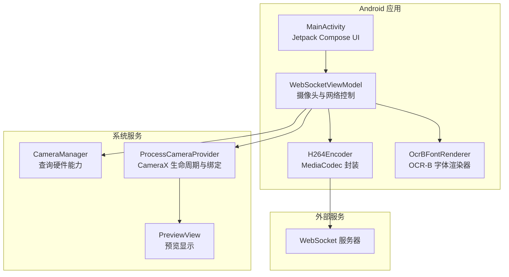
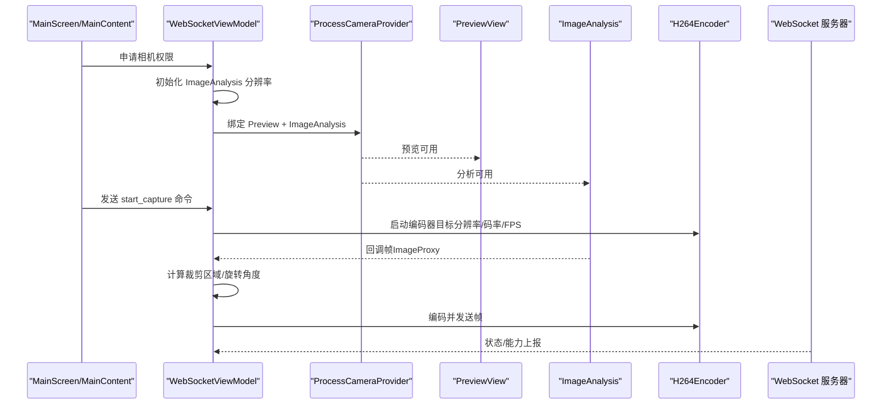
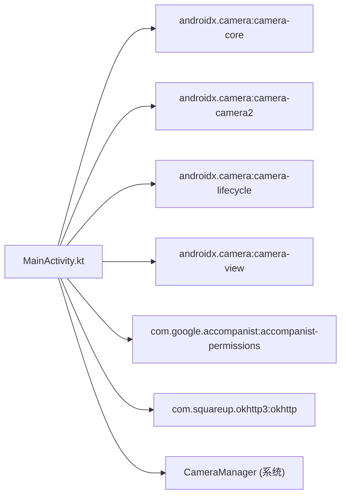

# 摄像头实现

<cite>
**本文引用的文件**
- [MainActivity.kt](file://android-camera/app/src/main/java/com/example/lablogcamera/MainActivity.kt)
- [AndroidManifest.xml](file://android-camera/app/src/main/AndroidManifest.xml)
- [build.gradle.kts](file://android-camera/app/build.gradle.kts)
- [libs.versions.toml](file://android-camera/gradle/libs.versions.toml)
</cite>

## 目录
1. [简介](#简介)
2. [项目结构](#项目结构)
3. [核心组件](#核心组件)
4. [架构总览](#架构总览)
5. [详细组件分析](#详细组件分析)
6. [依赖关系分析](#依赖关系分析)
7. [性能考量](#性能考量)
8. [故障排查指南](#故障排查指南)
9. [结论](#结论)
10. [附录](#附录)

## 简介
本文件面向 lab-log 项目的 Android 客户端摄像头实现，聚焦 CameraX API 的摄像头预览与图像分析集成，涵盖以下主题：
- 使用 CameraSelector 选择前后置摄像头
- 使用 ImageAnalysis 实时帧处理与 H.264 编码
- 使用 PreviewView 展示预览画面
- 摄像头权限处理流程
- 支持的分辨率选择逻辑与通过 Rational 宽高比控制裁剪区域
- 摄像头切换功能与 Camera2Interop 扩展设置 SCALER_ROTATE_AND_CROP_AUTO
- 摄像头生命周期管理（bindToLifecycle）
- 摄像头特性查询（通过 CameraManager 获取最大支持分辨率）
- 摄像头旋转处理（设备物理方向与图像旋转角度映射）

## 项目结构
- Android 客户端位于 android-camera/app，采用 Jetpack Compose + CameraX 架构
- 关键实现集中在 MainActivity.kt，包含 ViewModel、权限处理、预览与分析绑定、编码与发送等
- 依赖通过 Gradle 引入 CameraX、Accompanist Permissions、OkHttp 等库

图表来源
- [MainActivity.kt](file://android-camera/app/src/main/java/com/example/lablogcamera/MainActivity.kt#L1678-L2108)
- [MainActivity.kt](file://android-camera/app/src/main/java/com/example/lablogcamera/MainActivity.kt#L554-L1348)
- [MainActivity.kt](file://android-camera/app/src/main/java/com/example/lablogcamera/MainActivity.kt#L1450-L1659)

章节来源
- [build.gradle.kts](file://android-camera/app/build.gradle.kts#L44-L68)
- [libs.versions.toml](file://android-camera/gradle/libs.versions.toml#L1-L33)

## 核心组件
- WebSocketViewModel：负责 WebSocket 生命周期、摄像头参数与状态、图像分析与编码控制、能力上报与帧率控制
- H264Encoder：封装 MediaCodec，将 CameraX ImageProxy 转换为 NV12 并编码为 H.264
- OcrBFontRenderer：预加载 OCR-B 字体位图，用于在 NV12 帧上绘制时间戳水印
- MainActivity/MainScreen/MainContent/CameraPreview：Compose UI，负责权限申请、预览布局、摄像头与宽高比选择、绑定与解绑

章节来源
- [MainActivity.kt](file://android-camera/app/src/main/java/com/example/lablogcamera/MainActivity.kt#L554-L1348)
- [MainActivity.kt](file://android-camera/app/src/main/java/com/example/lablogcamera/MainActivity.kt#L1450-L1659)
- [MainActivity.kt](file://android-camera/app/src/main/java/com/example/lablogcamera/MainActivity.kt#L1678-L2108)

## 架构总览
摄像头实现围绕“权限 → 特性查询 → 预览绑定 → 分析绑定 → 编码发送”的主流程展开。服务器通过 WebSocket 下发命令，驱动客户端启动/停止采集与参数变更。

图表来源
- [MainActivity.kt](file://android-camera/app/src/main/java/com/example/lablogcamera/MainActivity.kt#L1678-L2108)
- [MainActivity.kt](file://android-camera/app/src/main/java/com/example/lablogcamera/MainActivity.kt#L800-L1200)
- [MainActivity.kt](file://android-camera/app/src/main/java/com/example/lablogcamera/MainActivity.kt#L1200-L1448)

## 详细组件分析

### 权限与生命周期管理
- 权限申请：使用 Accompanist Permissions 在 Compose 中申请相机权限，未授权时 UI 提示
- 生命周期绑定：通过 bindToLifecycle 将 Preview 与 ImageAnalysis 绑定到 LifecycleOwner，确保在合适的生命周期阶段启动/停止
- 预览绑定：CameraPreview 中使用 UseCaseGroup 统一管理 Preview 与 ImageAnalysis，共享 ViewPort 与目标旋转
- 解绑策略：每次参数变化（如摄像头选择、宽高比、目标旋转）均先 unbindAll，再重新绑定，确保一致性

章节来源
- [MainActivity.kt](file://android-camera/app/src/main/java/com/example/lablogcamera/MainActivity.kt#L1678-L2108)
- [AndroidManifest.xml](file://android-camera/app/src/main/AndroidManifest.xml#L1-L32)

### 摄像头选择与切换
- 选择逻辑：通过 selectedCameraFacing 状态切换 LENS_FACING_BACK/FRONT，触发重新初始化分辨率与绑定
- 切换时机：LaunchedEffect 监听摄像头选择变化，权限就绪后立即执行初始化
- 绑定细节：CameraSelector.DEFAULT_BACK_CAMERA / DEFAULT_FRONT_CAMERA，结合 UseCaseGroup 与 ViewPort

章节来源
- [MainActivity.kt](file://android-camera/app/src/main/java/com/example/lablogcamera/MainActivity.kt#L1678-L2108)
- [MainActivity.kt](file://android-camera/app/src/main/java/com/example/lablogcamera/MainActivity.kt#L1712-L1718)

### 宽高比与裁剪区域控制
- 宽高比来源：服务器下发或 UI 选择，默认 4:3；1:1 表示不裁剪（全帧对齐）
- 裁剪策略：基于目标宽高比计算安全尺寸，确保宽>高且 32 对齐；纵向时翻转宽高比
- 旋转与裁剪：先计算旋转后的尺寸，再基于旋转后尺寸计算裁剪区域，最终在 toNv12ByteArray 中完成旋转与裁剪
- 锁定裁剪：录制开始后锁定裁剪区域，避免设备方向切换导致尺寸漂移

章节来源
- [MainActivity.kt](file://android-camera/app/src/main/java/com/example/lablogcamera/MainActivity.kt#L944-L1200)
- [MainActivity.kt](file://android-camera/app/src/main/java/com/example/lablogcamera/MainActivity.kt#L1347-L1448)
- [MainActivity.kt](file://android-camera/app/src/main/java/com/example/lablogcamera/MainActivity.kt#L1450-L1659)

### 分辨率选择与特性查询
- 最大分辨率查询：通过 CameraManager 与 SCALER_STREAM_CONFIGURATION_MAP 获取指定摄像头方向的最大支持分辨率
- ImageAnalysis 目标分辨率：优先使用硬件支持的最大分辨率，以获得更大 FOV
- 能力上报：构建 capabilities JSON，包含设备模型、SDK 版本、分辨率列表与当前 ImageAnalysis 分辨率

章节来源
- [MainActivity.kt](file://android-camera/app/src/main/java/com/example/lablogcamera/MainActivity.kt#L718-L751)
- [MainActivity.kt](file://android-camera/app/src/main/java/com/example/lablogcamera/MainActivity.kt#L1244-L1316)
- [MainActivity.kt](file://android-camera/app/src/main/java/com/example/lablogcamera/MainActivity.kt#L815-L865)

### 旋转处理与映射关系
- 设备物理方向：使用 OrientationEventListener 检测 0/90/180/270 四档离散旋转
- 后端旋转映射：根据摄像头朝向（前置/后置）与设备方向计算 rotationForBackend，确保服务器收到的旋转值符合预期
- 图像旋转：在 toNv12ByteArray 中按 0/90/180/270 旋转 Y 平面与 UV 平面，再裁剪

章节来源
- [MainActivity.kt](file://android-camera/app/src/main/java/com/example/lablogcamera/MainActivity.kt#L795-L813)
- [MainActivity.kt](file://android-camera/app/src/main/java/com/example/lablogcamera/MainActivity.kt#L1450-L1659)

### Camera2Interop 与 SCALER_ROTATE_AND_CROP
- 扩展设置：通过 Camera2Interop.Extender 在 ImageAnalysis Builder 上设置 CaptureRequest.SCALER_ROTATE_AND_CROP 为 AUTO
- 版本条件：仅在 Android R（API 30）及以上生效
- 当前策略：注释掉 applyRotateAndCrop 调用，改为在 Android 端手动旋转与裁剪，以验证条纹/绿带问题

章节来源
- [MainActivity.kt](file://android-camera/app/src/main/java/com/example/lablogcamera/MainActivity.kt#L683-L696)
- [MainActivity.kt](file://android-camera/app/src/main/java/com/example/lablogcamera/MainActivity.kt#L1012-L1022)

### 预览与分析绑定流程
- 绑定入口：CameraPreview 中根据 selectedCameraFacing 选择 CameraSelector，获取显示旋转并设置 Preview 与 ImageAnalysis 的 targetRotation
- UseCaseGroup：将 Preview 与 ImageAnalysis 放入同一组，统一 ViewPort 与 FOV
- 绑定调用：bindToLifecycle 返回 Camera 对象，便于后续控制（如线性变焦）

章节来源
- [MainActivity.kt](file://android-camera/app/src/main/java/com/example/lablogcamera/MainActivity.kt#L1993-L2100)

### 图像分析与编码流水线
- 分析器：ImageAnalysis.setAnalyzer 使用单线程执行器，接收 ImageProxy
- 帧率控制：根据服务器下发的 fps 目标，按时间间隔主动丢帧
- 编码器：H264Encoder.start 初始化 MediaCodec，encode 将 YUV 转 NV12，绘制时间戳，队列输入并拉取输出
- 发送：编码完成后通过 WebSocket 发送自定义帧头（时间戳、序号、负载长度）+ H.264 数据

章节来源
- [MainActivity.kt](file://android-camera/app/src/main/java/com/example/lablogcamera/MainActivity.kt#L1200-L1448)
- [MainActivity.kt](file://android-camera/app/src/main/java/com/example/lablogcamera/MainActivity.kt#L1450-L1659)

### 时间戳水印
- 字体预加载：在 ViewModel 初始化时异步预加载 OCR-B 字体位图，避免首帧卡顿
- 绘制策略：在 NV12 Y 平面绘制黑色背景与白色字符，支持两种字符尺寸
- 模式切换：通过常量切换时间戳模式，支持关闭

章节来源
- [MainActivity.kt](file://android-camera/app/src/main/java/com/example/lablogcamera/MainActivity.kt#L299-L459)
- [MainActivity.kt](file://android-camera/app/src/main/java/com/example/lablogcamera/MainActivity.kt#L460-L551)

## 依赖关系分析
- CameraX 生态：camera-core、camera-camera2、camera-lifecycle、camera-view
- UI 与权限：Jetpack Compose、lifecycle-viewmodel-compose、accompanist-permissions
- 网络：OkHttp 用于 WebSocket 通信
- 系统服务：CameraManager 用于查询摄像头特性

图表来源
- [build.gradle.kts](file://android-camera/app/build.gradle.kts#L44-L68)

章节来源
- [build.gradle.kts](file://android-camera/app/build.gradle.kts#L44-L68)
- [libs.versions.toml](file://android-camera/gradle/libs.versions.toml#L1-L33)

## 性能考量
- 分辨率策略：优先使用硬件支持的最大分辨率，提升 FOV；同时通过裁剪与对齐保证编码器兼容性
- 帧率控制：当服务器指定 fps 时，按时间间隔丢帧，避免过度发送
- 编码路径：在 Android 端完成旋转与裁剪，减少 HAL 旋转带来的平面错位风险
- 资源管理：编码器在停止时释放 MediaCodec，清除裁剪区域与状态，避免泄漏

## 故障排查指南
- 权限未授予：确认 Manifest 中声明 CAMERA 权限，UI 中提示需要相机权限
- 绑定失败：检查 bindToLifecycle 参数（LifecycleOwner、CameraSelector、UseCaseGroup）是否正确
- 分析器异常：检查 ImageAnalysis.setAnalyzer 的执行器与回调逻辑，确保异常不中断分析链
- 编码失败：确认 MediaFormat 参数（颜色格式、码率、帧率）与输入缓冲区容量匹配
- 旋转异常：核对设备物理方向与摄像头朝向映射，确保 rotationForBackend 正确

章节来源
- [AndroidManifest.xml](file://android-camera/app/src/main/AndroidManifest.xml#L1-L32)
- [MainActivity.kt](file://android-camera/app/src/main/java/com/example/lablogcamera/MainActivity.kt#L1678-L2108)
- [MainActivity.kt](file://android-camera/app/src/main/java/com/example/lablogcamera/MainActivity.kt#L1200-L1448)

## 结论
本实现以 CameraX 为核心，结合 Compose UI、Camera2Interop 与 MediaCodec，实现了稳定的摄像头预览、实时帧处理与 H.264 编码发送。通过特性查询与手动旋转裁剪，兼顾了最大 FOV 与服务器期望的编码分辨率；通过权限与生命周期管理，确保在不同设备与系统版本上的稳定性。

## 附录
- 代码片段路径（示例）
  - 权限与生命周期绑定：[MainActivity.kt](file://android-camera/app/src/main/java/com/example/lablogcamera/MainActivity.kt#L1678-L2108)
  - 宽高比与裁剪区域：[MainActivity.kt](file://android-camera/app/src/main/java/com/example/lablogcamera/MainActivity.kt#L944-L1200)
  - 分辨率查询与上报：[MainActivity.kt](file://android-camera/app/src/main/java/com/example/lablogcamera/MainActivity.kt#L718-L751), [MainActivity.kt](file://android-camera/app/src/main/java/com/example/lablogcamera/MainActivity.kt#L1244-L1316)
  - 旋转映射与裁剪：[MainActivity.kt](file://android-camera/app/src/main/java/com/example/lablogcamera/MainActivity.kt#L795-L813), [MainActivity.kt](file://android-camera/app/src/main/java/com/example/lablogcamera/MainActivity.kt#L1450-L1659)
  - Camera2Interop 设置：[MainActivity.kt](file://android-camera/app/src/main/java/com/example/lablogcamera/MainActivity.kt#L683-L696)
  - 预览绑定与 ViewPort：[MainActivity.kt](file://android-camera/app/src/main/java/com/example/lablogcamera/MainActivity.kt#L1993-L2100)
  - 编码器初始化与发送：[MainActivity.kt](file://android-camera/app/src/main/java/com/example/lablogcamera/MainActivity.kt#L1200-L1448)