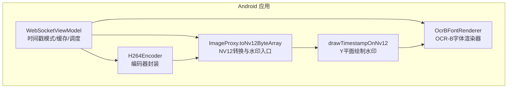
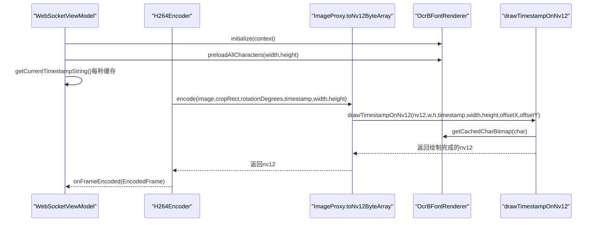
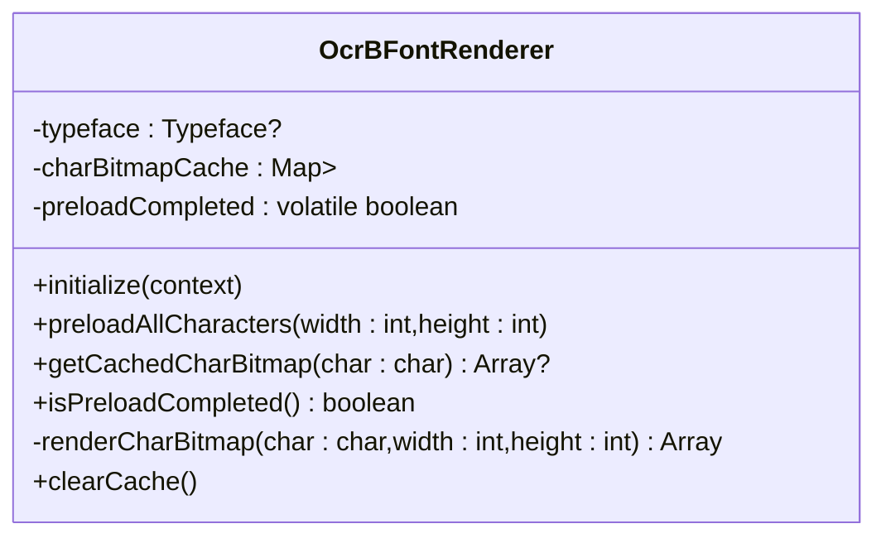
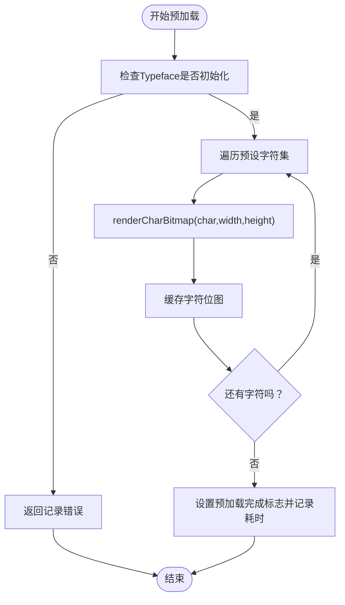
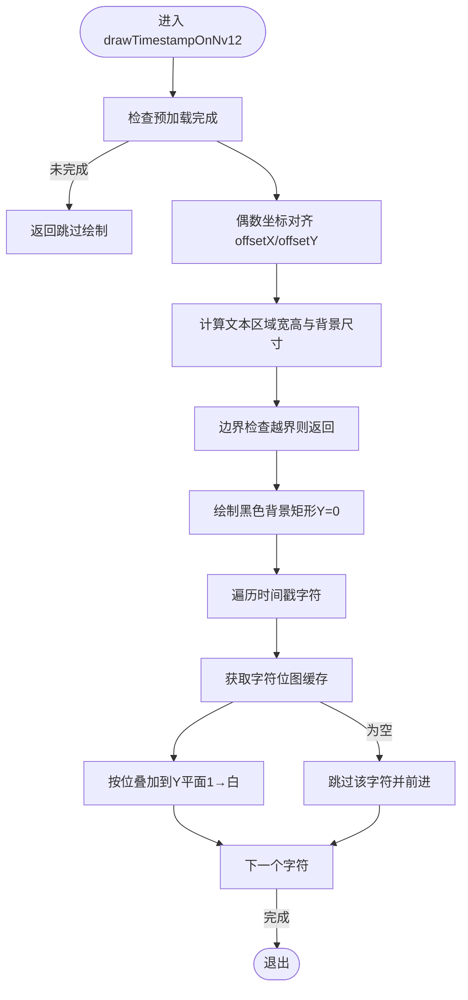
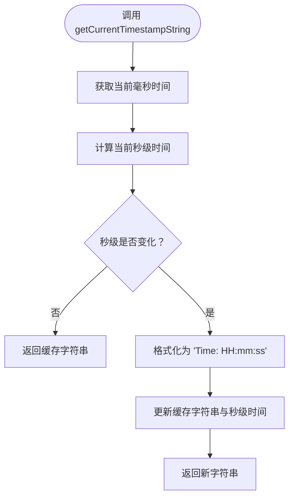
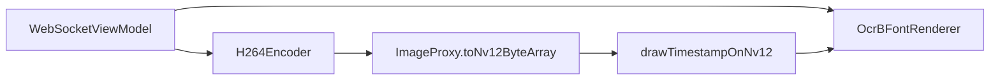

# 时间戳水印

<cite>
**本文引用的文件**
- [MainActivity.kt](file://android-camera/app/src/main/java/com/example/lablogcamera/MainActivity.kt)
- [README.md](file://android-camera/README.md)
</cite>

## 目录
1. [简介](#简介)
2. [项目结构](#项目结构)
3. [核心组件](#核心组件)
4. [架构总览](#架构总览)
5. [详细组件分析](#详细组件分析)
6. [依赖关系分析](#依赖关系分析)
7. [性能考量](#性能考量)
8. [故障排查指南](#故障排查指南)
9. [结论](#结论)

## 简介
本章节面向 lab-log 项目中的“时间戳水印”功能，聚焦以下目标：
- 解释 OcrBFontRenderer 对象如何加载 OCR-B 字体并预渲染字符位图，包括从 Assets 加载字体文件、Typeface 创建和字符缓存机制。
- 描述 preloadAllCharacters 方法在后台线程预加载时间戳所需字符（0-9、冒号、空格、T、i、m、e）的过程。
- 说明 drawTimestampOnNv12 函数如何在 NV12 格式的 Y 平面绘制时间戳水印，包括黑色背景矩形绘制和白色文字叠加。
- 解释时间戳缓存机制，每秒更新一次以减少字符串格式化开销。
- 覆盖不同字体尺寸（16x24 和 20x30）的支持与选择逻辑。
- 提供水印位置偏移、边界检查和偶数坐标对齐的实现细节。
- 说明当字体预加载未完成时的优雅降级处理。

## 项目结构
时间戳水印功能位于 Android 应用模块中，核心代码集中在 MainActivity.kt 的扩展函数与对象中，配合 ViewModel 的时间戳模式选择与缓存策略。

图表来源
- [MainActivity.kt](file://android-camera/app/src/main/java/com/example/lablogcamera/MainActivity.kt#L180-L360)
- [MainActivity.kt](file://android-camera/app/src/main/java/com/example/lablogcamera/MainActivity.kt#L460-L551)
- [MainActivity.kt](file://android-camera/app/src/main/java/com/example/lablogcamera/MainActivity.kt#L1465-L1659)

章节来源
- [MainActivity.kt](file://android-camera/app/src/main/java/com/example/lablogcamera/MainActivity.kt#L180-L360)
- [MainActivity.kt](file://android-camera/app/src/main/java/com/example/lablogcamera/MainActivity.kt#L460-L551)
- [MainActivity.kt](file://android-camera/app/src/main/java/com/example/lablogcamera/MainActivity.kt#L1465-L1659)

## 核心组件
- OcrBFontRenderer：负责从 Assets 加载 OCR-B 字体（失败时回退系统等宽字体），批量预渲染时间戳所需字符位图并缓存，提供查询接口与预加载完成状态。
- drawTimestampOnNv12：在 NV12 Y 平面绘制时间戳水印，包含背景矩形绘制、文字叠加、边界检查与偶数坐标对齐。
- WebSocketViewModel：选择时间戳模式（16x24 或 20x30）、在后台线程预加载字符、维护每秒更新的时间戳缓存。
- ImageProxy.toNv12ByteArray：将 YUV_420_888 转换为 NV12，并在提供时间戳时调用 drawTimestampOnNv12。

章节来源
- [MainActivity.kt](file://android-camera/app/src/main/java/com/example/lablogcamera/MainActivity.kt#L299-L458)
- [MainActivity.kt](file://android-camera/app/src/main/java/com/example/lablogcamera/MainActivity.kt#L461-L551)
- [MainActivity.kt](file://android-camera/app/src/main/java/com/example/lablogcamera/MainActivity.kt#L590-L654)
- [MainActivity.kt](file://android-camera/app/src/main/java/com/example/lablogcamera/MainActivity.kt#L1465-L1659)

## 架构总览
时间戳水印的调用链路如下：

图表来源
- [MainActivity.kt](file://android-camera/app/src/main/java/com/example/lablogcamera/MainActivity.kt#L590-L654)
- [MainActivity.kt](file://android-camera/app/src/main/java/com/example/lablogcamera/MainActivity.kt#L218-L264)
- [MainActivity.kt](file://android-camera/app/src/main/java/com/example/lablogcamera/MainActivity.kt#L1465-L1659)
- [MainActivity.kt](file://android-camera/app/src/main/java/com/example/lablogcamera/MainActivity.kt#L461-L551)

## 详细组件分析

### OCR-B 字体渲染器 OcrBFontRenderer
- 字体加载
  - 从 Assets 加载 OCR-B 字体文件；若失败则回退到系统等宽字体。
- 预渲染与缓存
  - 预加载时间戳所需字符集合（0-9、冒号、空格、T、i、m、e）。
  - 在后台线程批量渲染每个字符为位图数组（行 x 列，1=白色，0=背景），并缓存。
  - 提供预加载完成状态查询与字符位图查询接口。
- 字符渲染细节
  - 使用 Canvas + Paint 渲染，抗锯齿开启，居中绘制。
  - 根据目标尺寸动态调整字体大小，确保字符宽度不超过目标宽度。
  - 将像素 Alpha 值转换为 0/1 的二值位图，节省内存与绘制成本。

图表来源
- [MainActivity.kt](file://android-camera/app/src/main/java/com/example/lablogcamera/MainActivity.kt#L299-L458)

章节来源
- [MainActivity.kt](file://android-camera/app/src/main/java/com/example/lablogcamera/MainActivity.kt#L299-L458)

### 预加载流程（preloadAllCharacters）
- 触发时机：在 ViewModel 初始化时，根据选定的时间戳模式（16x24 或 20x30）在后台线程调用。
- 执行过程：
  - 校验 Typeface 是否已初始化。
  - 遍历预设字符集，逐个渲染为位图并缓存。
  - 设置预加载完成标志，记录耗时。
  - 若过程中发生异常，重置完成标志，保证后续绘制安全。
- 线程模型：使用 IO 调度器在后台线程执行，避免阻塞 UI。

图表来源
- [MainActivity.kt](file://android-camera/app/src/main/java/com/example/lablogcamera/MainActivity.kt#L344-L367)
- [MainActivity.kt](file://android-camera/app/src/main/java/com/example/lablogcamera/MainActivity.kt#L389-L443)

章节来源
- [MainActivity.kt](file://android-camera/app/src/main/java/com/example/lablogcamera/MainActivity.kt#L344-L367)
- [MainActivity.kt](file://android-camera/app/src/main/java/com/example/lablogcamera/MainActivity.kt#L389-L443)

### drawTimestampOnNv12：在 NV12 Y 平面绘制水印
- 预加载检查：若预加载未完成，直接跳过绘制，避免空指针或错误渲染。
- 偏移与对齐：
  - 将 offsetX、offsetY 向下取偶数，确保起始坐标为偶数。
  - 文本区域尺寸为字符数量 × 字符宽度 × 字符高度，外加固定内边距。
  - 边界检查：若背景矩形越界则直接返回。
- 背景绘制：
  - 在文本背景区域内，将 Y 平面对应像素写入黑色（0）。
- 文字绘制：
  - 逐字符查询缓存位图，按位叠加到 Y 平面（1→白色，0→背景）。
  - 逐像素写入，注意索引越界保护。
- 参数与默认值：
  - charWidth、charHeight 默认 16x24；也可选择 20x30（见模式选择）。
  - offsetX、offsetY 默认 10。

图表来源
- [MainActivity.kt](file://android-camera/app/src/main/java/com/example/lablogcamera/MainActivity.kt#L461-L551)

章节来源
- [MainActivity.kt](file://android-camera/app/src/main/java/com/example/lablogcamera/MainActivity.kt#L461-L551)

### 时间戳缓存机制（每秒更新一次）
- 设计目的：减少每帧字符串格式化的开销，提升性能。
- 实现要点：
  - 使用 volatile 变量缓存当前时间戳字符串与秒级时间戳。
  - 每次获取时比较当前秒级时间，只有秒级变化才重新格式化字符串。
  - 格式为 "Time: HH:mm:ss"（24 小时制）。

图表来源
- [MainActivity.kt](file://android-camera/app/src/main/java/com/example/lablogcamera/MainActivity.kt#L638-L653)

章节来源
- [MainActivity.kt](file://android-camera/app/src/main/java/com/example/lablogcamera/MainActivity.kt#L638-L653)

### 字体尺寸选择与模式切换
- 模式常量：
  - 无时间戳：TIMESTAMP_MODE_NONE
  - OCR-B 16x24：TIMESTAMP_MODE_OCRB_16x24
  - OCR-B 20x30：TIMESTAMP_MODE_OCRB_20x30（默认）
- 选择逻辑：
  - 通过 getTimestampCharWidth/getTimestampCharHeight 根据模式返回对应字符尺寸。
  - 在 ViewModel 初始化时，根据模式调用 OcrBFontRenderer.preloadAllCharacters(width,height)。
- 说明：模式切换为编译时配置，需修改变量并重新编译生效。

章节来源
- [MainActivity.kt](file://android-camera/app/src/main/java/com/example/lablogcamera/MainActivity.kt#L590-L612)
- [MainActivity.kt](file://android-camera/app/src/main/java/com/example/lablogcamera/MainActivity.kt#L620-L632)
- [README.md](file://android-camera/README.md#L120-L126)

### 水印位置偏移、边界检查与偶数坐标对齐
- 偏移对齐：
  - 将 offsetX、offsetY 向下取偶数，确保起始坐标为偶数。
- 文本区域与背景：
  - 文本宽度 = 字符数 × 字符宽度；高度 = 字符高度。
  - 背景增加固定内边距，形成黑色矩形背景。
- 边界检查：
  - 若背景矩形越界（右/下超出图像边界），直接返回，避免越界写入。
- 偶数坐标：
  - 背景矩形的 left/top/right/bottom 均为偶数，满足 NV12/编码器对齐要求。

章节来源
- [MainActivity.kt](file://android-camera/app/src/main/java/com/example/lablogcamera/MainActivity.kt#L484-L504)
- [MainActivity.kt](file://android-camera/app/src/main/java/com/example/lablogcamera/MainActivity.kt#L506-L515)
- [MainActivity.kt](file://android-camera/app/src/main/java/com/example/lablogcamera/MainActivity.kt#L517-L549)

### 优雅降级：预加载未完成时的处理
- 当 OcrBFontRenderer.isPreloadCompleted() 为 false 时：
  - drawTimestampOnNv12 直接返回，不进行任何绘制。
  - 日志记录警告，提示预加载尚未完成。
- 保障：即使预加载失败或尚未开始，也不会影响编码流程与稳定性。

章节来源
- [MainActivity.kt](file://android-camera/app/src/main/java/com/example/lablogcamera/MainActivity.kt#L484-L488)
- [MainActivity.kt](file://android-camera/app/src/main/java/com/example/lablogcamera/MainActivity.kt#L374-L380)

## 依赖关系分析
- 组件耦合
  - WebSocketViewModel 依赖 OcrBFontRenderer（初始化、预加载、模式选择）。
  - H264Encoder 依赖 ImageProxy.toNv12ByteArray，后者在提供 timestamp 时调用 drawTimestampOnNv12。
  - drawTimestampOnNv12 依赖 OcrBFontRenderer 的字符位图缓存。
- 外部依赖
  - Android Typeface/Canvas/Paint：用于字体渲染与位图生成。
  - MediaCodec：编码器封装，提供 NV12 输入输出。
- 潜在风险
  - 预加载未完成时的空缓存处理，避免崩溃。
  - NV12 写入时的边界检查与偶数对齐，避免编码器对齐错误。

图表来源
- [MainActivity.kt](file://android-camera/app/src/main/java/com/example/lablogcamera/MainActivity.kt#L590-L654)
- [MainActivity.kt](file://android-camera/app/src/main/java/com/example/lablogcamera/MainActivity.kt#L1465-L1659)
- [MainActivity.kt](file://android-camera/app/src/main/java/com/example/lablogcamera/MainActivity.kt#L461-L551)

章节来源
- [MainActivity.kt](file://android-camera/app/src/main/java/com/example/lablogcamera/MainActivity.kt#L590-L654)
- [MainActivity.kt](file://android-camera/app/src/main/java/com/example/lablogcamera/MainActivity.kt#L1465-L1659)
- [MainActivity.kt](file://android-camera/app/src/main/java/com/example/lablogcamera/MainActivity.kt#L461-L551)

## 性能考量
- 预渲染与缓存
  - 将字符渲染为位图并缓存，运行时直接按位叠加，避免每帧重复渲染。
- 时间戳缓存
  - 每秒更新一次字符串，减少格式化开销。
- NV12 写入
  - 逐像素写入 Y 平面，注意边界检查与偶数对齐，避免越界与对齐错误导致的性能问题。
- 预加载线程
  - 在后台线程执行预加载，避免阻塞 UI 与编码流程。

[本节为通用性能讨论，不直接分析具体文件]

## 故障排查指南
- 水印未显示
  - 检查预加载是否完成：若返回警告并跳过绘制，确认初始化与预加载流程。
  - 检查字符缓存是否存在：若某字符未命中缓存，将跳过该字符。
- 越界或黑边
  - 检查 offsetX/offsetY 是否过大；背景矩形越界将直接返回。
  - 确认字符尺寸与文本长度是否超过图像边界。
- 编码器对齐问题
  - 确保裁剪尺寸与坐标为偶数，必要时使用“安全尺寸”（如 1920×1440 或 1920×1088）。
- 字体加载失败
  - 若 OCR-B 字体加载失败，系统会回退到等宽字体；检查 Assets 中字体文件路径与可用性。

章节来源
- [MainActivity.kt](file://android-camera/app/src/main/java/com/example/lablogcamera/MainActivity.kt#L484-L504)
- [MainActivity.kt](file://android-camera/app/src/main/java/com/example/lablogcamera/MainActivity.kt#L326-L336)
- [README.md](file://android-camera/README.md#L471-L504)

## 结论
lab-log 项目的时间戳水印通过“预渲染 + 缓存 + 每秒字符串缓存”的组合，实现了高性能、稳定的 NV12 水印绘制。OcrBFontRenderer 负责高质量的 OCR-B 字体渲染与缓存；drawTimestampOnNv12 在 NV12 Y 平面进行高效叠加；WebSocketViewModel 提供灵活的模式选择与预加载调度。配合严格的边界检查与偶数对齐策略，确保在不同设备与分辨率下稳定运行。