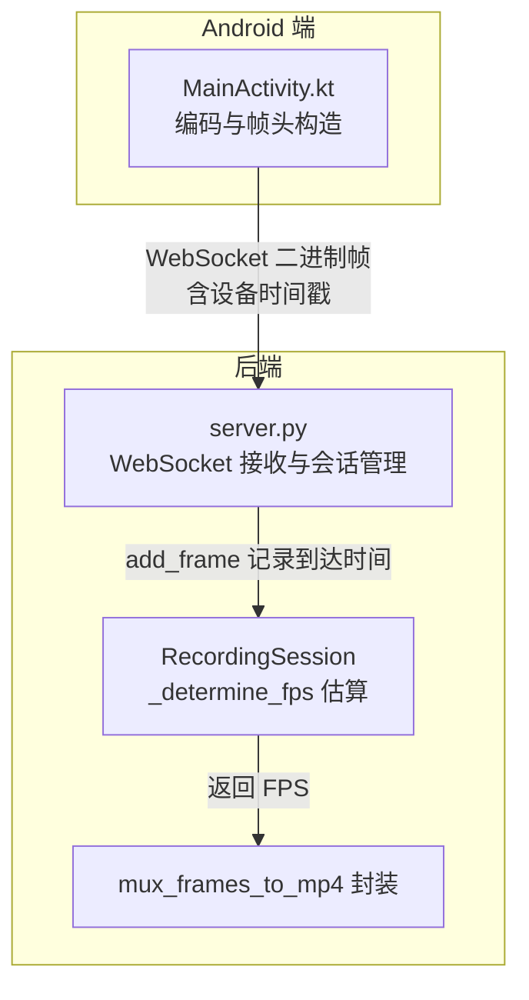
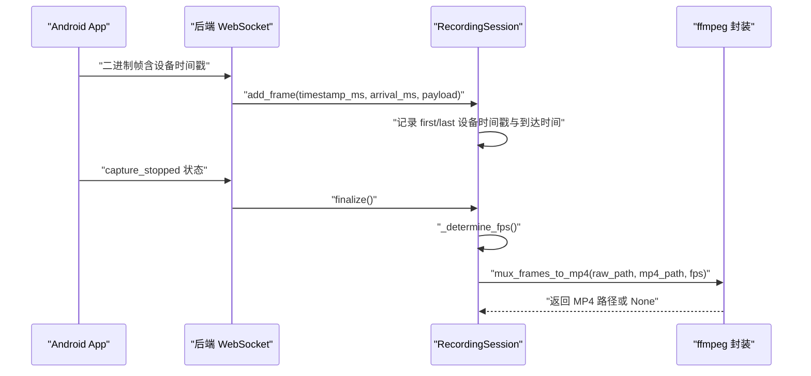
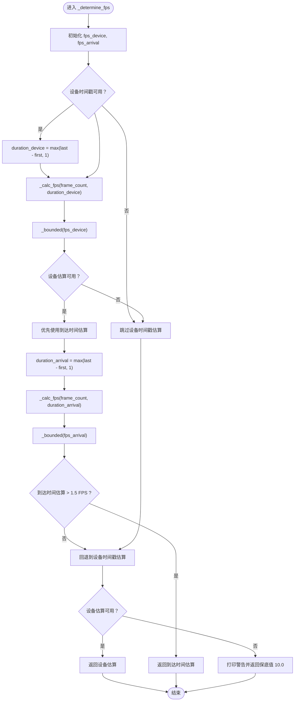
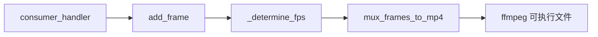

# FPS估算机制

<cite>
**本文引用的文件**
- [server.py](file://backend/server.py)
- [README.md](file://backend/README.md)
- [MainActivity.kt](file://android-camera/app/src/main/java/com/example/lablogcamera/MainActivity.kt)
- [fps_monitor.py](file://archive/20251117_arduino_send_images_to_backend_and_frontend/backend/fps_monitor.py)
- [image_manager.py](file://archive/20251117_arduino_send_images_to_backend_and_frontend/backend/image_manager.py)
- [server.py（历史项目）](file://archive/20251117_arduino_send_images_to_backend_and_frontend/backend/server.py)
</cite>

## 目录
1. [引言](#引言)
2. [项目结构](#项目结构)
3. [核心组件](#核心组件)
4. [架构总览](#架构总览)
5. [详细组件分析](#详细组件分析)
6. [依赖关系分析](#依赖关系分析)
7. [性能考量](#性能考量)
8. [故障排查指南](#故障排查指南)
9. [结论](#结论)
10. [附录](#附录)

## 引言
本文件围绕 lab-log 项目的后端 FPS 估算逻辑展开，重点解析 RecordingSession 类中的 _determine_fps 私有方法。该方法在录制会话结束后，基于服务器记录的帧到达时间与 Android 设备发送的时间戳，采用“双轨估算 + 边界限制 + 保底值”的策略，计算视频的实际帧率，并将其传递给 MP4 封装流程，避免时间轴错误。本文将逐步拆解估算策略、辅助函数、边界处理与回退机制，并讨论其准确性、局限性及在 MP4 封装中的应用。

## 项目结构
- 后端服务器位于 backend/server.py，负责接收 Android 相机 App 的 H.264 帧，按会话落盘，结束时估算 FPS 并封装为 MP4。
- Android 端位于 android-camera/app/src/main/java/com/example/lablogcamera/MainActivity.kt，负责 H.264 编码、帧头构造（含设备时间戳）、按目标帧率主动丢帧与发送。
- 历史项目 archive/ 展示了另一种基于 MJPEG 的 FPS 监控思路（与本项目无关，仅用于对比理解）。

图表来源
- [server.py](file://backend/server.py#L26-L133)
- [MainActivity.kt](file://android-camera/app/src/main/java/com/example/lablogcamera/MainActivity.kt#L968-L984)

章节来源
- [server.py](file://backend/server.py#L26-L133)
- [README.md](file://backend/README.md#L1-L115)

## 核心组件
- RecordingSession：单客户端录制会话的生命周期管理，负责记录首尾帧的设备时间戳与服务器到达时间，并在 finalize 时调用 _determine_fps 估算 FPS。
- _determine_fps：双轨估算策略的核心，优先使用服务器到达时间估算，其次使用设备时间戳，最后回退到保底值。
- _calc_fps：辅助函数，按帧数与持续时间（毫秒）计算 FPS。
- _bounded：对 FPS 结果进行边界限制（1.0–60.0）。
- mux_frames_to_mp4：使用 ffmpeg 将裸 H.264 封装为 MP4，并显式指定帧率，避免时间轴错误。

章节来源
- [server.py](file://backend/server.py#L26-L133)
- [server.py](file://backend/server.py#L150-L179)

## 架构总览
后端通过 WebSocket 接收 Android 发来的二进制帧，帧头包含设备时间戳与帧序号，服务器同时记录帧到达时间。录制结束时，会话对象根据两种时间轴分别估算 FPS，并在封装阶段将估算结果传递给 ffmpeg，确保 MP4 的时间轴与实际拍摄节奏一致。

图表来源
- [server.py](file://backend/server.py#L210-L231)
- [server.py](file://backend/server.py#L64-L79)
- [server.py](file://backend/server.py#L80-L133)
- [server.py](file://backend/server.py#L150-L179)

## 详细组件分析

### RecordingSession._determine_fps 双轨估算策略
- 估算目标：在录制结束后，基于记录的时间戳估算视频的实际帧率，用于 MP4 封装。
- 估算依据：
  - 服务器到达时间：记录每帧到达服务器的时间，能更贴近“服务器实际接收节奏”。
  - 设备时间戳：来自 Android App 帧头，表示编码器输出的时间戳。
- 估算流程：
  1) 计算设备时间戳跨度 duration_device = max(last_device_ts - first_device_ts, 1)；
  2) 计算到达时间跨度 duration_arrival = max(last_arrival_ms - first_arrival_ms, 1)；
  3) 使用 _calc_fps(frame_count, duration_ms) 分别计算 fps_device 与 fps_arrival；
  4) 对两个结果调用 _bounded（限制在 1.0–60.0）；
  5) 优先返回“服务器到达时间”估算，且要求 > 1.5 FPS 才认为可信；
  6) 若不可信或不可用，则回退到“设备时间戳”估算；
  7) 若两者均不可用，返回保底值 10.0 FPS。
- 边界与异常处理：
  - 当帧数 ≤ 1 或持续时间为非正时，_calc_fps 返回 None，表示不可用；
  - _bounded 将结果限制在 1.0–60.0；
  - 无法估算时打印警告并返回 10.0 FPS。

图表来源
- [server.py](file://backend/server.py#L80-L133)

章节来源
- [server.py](file://backend/server.py#L80-L133)

### 辅助函数 _calc_fps 与 _bounded
- _calc_fps(frame_count, duration_ms)：
  - 输入：帧数与持续时间（毫秒）；
  - 输出：若帧数 > 1 且持续时间 > 0，则返回 frame_count / (duration_ms / 1000.0)；否则返回 None；
  - 作用：将“帧数/时长”转换为“帧/秒”的 FPS。
- _bounded(fps)：
  - 输入：估算得到的 FPS；
  - 输出：max(1.0, min(fps, 60.0))；
  - 作用：对估算结果进行上下限约束，避免极端值影响封装。

章节来源
- [server.py](file://backend/server.py#L87-L101)

### 录制会话 finalize 与 MP4 封装
- finalize()：
  - 关闭裸 H.264 文件；
  - 调用 _determine_fps 获取 FPS；
  - 调用 mux_frames_to_mp4(raw_path, mp4_path, fps) 进行封装；
  - 成功后提取首帧生成缩略图。
- mux_frames_to_mp4：
  - 使用 ffmpeg 以 -f h264 指定输入格式，-r <fps> 显式指定帧率，-c:v copy 直接拷贝视频轨；
  - 若 ffmpeg 返回非 0，打印错误并返回 None；
  - 该流程确保时间轴与实际拍摄节奏一致，避免“1fps 视频”等问题。

章节来源
- [server.py](file://backend/server.py#L64-L79)
- [server.py](file://backend/server.py#L150-L179)

### Android 端帧头与时间戳来源
- 帧头格式（16 字节）：
  - 8 字节：设备时间戳（毫秒）；
  - 4 字节：帧序号（低 32 位递增）；
  - 4 字节：H.264 负载长度；
- 服务器到达时间：
  - 在 consumer_handler 中，使用 asyncio.get_running_loop().time() 获取当前服务器时间（秒），转换为毫秒；
  - 作为到达时间传入 session.add_frame(timestamp_ms, arrival_ms, payload)。
- 设备时间戳来源：
  - Android 端编码器输出时间戳（bufferInfo.presentationTimeUs/1000）作为设备时间戳写入帧头；
  - 服务器解析帧头时读取该字段，用于设备时间戳估算。

章节来源
- [server.py](file://backend/server.py#L135-L148)
- [server.py](file://backend/server.py#L265-L274)
- [MainActivity.kt](file://android-camera/app/src/main/java/com/example/lablogcamera/MainActivity.kt#L968-L984)
- [MainActivity.kt](file://android-camera/app/src/main/java/com/example/lablogcamera/MainActivity.kt#L243-L256)

## 依赖关系分析
- 录制会话依赖：
  - 服务器端：consumer_handler 从 WebSocket 接收帧，解析帧头并记录到达时间；
  - 会话对象：add_frame 记录首尾设备时间戳与到达时间；
  - finalize：调用 _determine_fps 与 mux_frames_to_mp4。
- 封装依赖：
  - ffmpeg：必须可执行，且 -r <fps> 显式指定帧率，避免错误推断；
  - 环境变量：可通过 FFMPEG_BIN 指定 ffmpeg 路径。

图表来源
- [server.py](file://backend/server.py#L234-L280)
- [server.py](file://backend/server.py#L64-L79)
- [server.py](file://backend/server.py#L150-L179)

章节来源
- [server.py](file://backend/server.py#L234-L280)
- [server.py](file://backend/server.py#L150-L179)

## 性能考量
- 估算效率：_calc_fps 与 _bounded 均为 O(1) 操作，开销极小；
- I/O 与 CPU：finalize 时进行一次文件关闭与一次 ffmpeg 调用，CPU 与 I/O 成本主要集中在封装阶段；
- 估算准确性：
  - 服务器到达时间估算通常更贴近“服务器实际接收节奏”，且阈值 > 1.5 FPS 提升了可信度；
  - 设备时间戳估算作为回退，适用于服务器时间不可用的情况；
  - 保底值 10.0 FPS 保证在极端情况下仍能生成可用的 MP4。
- 误差来源：
  - 网络抖动、时钟漂移、设备端时间戳精度差异；
  - 单帧录制或时间戳缺失时，估算不可用，依赖回退策略；
  - 服务器到达时间可能受队列延迟影响，阈值设计有助于规避异常低值。

[本节为通用性能讨论，不直接分析具体文件]

## 故障排查指南
- 无法估算 FPS：
  - 现象：打印“FPS estimate (label) unavailable.”或“Unable to estimate FPS accurately, using fallback 10 FPS.”；
  - 可能原因：单帧录制、时间戳缺失、设备时间戳或到达时间为空；
  - 处理建议：确认 Android 端帧头构造与时间戳写入正常；检查服务器端帧解析与到达时间记录。
- 封装失败：
  - 现象：打印“ffmpeg failed to mux MP4”并返回 None；
  - 可能原因：ffmpeg 未安装或不可执行、FFMPEG_BIN 路径错误、输入裸流不存在；
  - 处理建议：安装 ffmpeg 并确保可执行；设置 FFMPEG_BIN；确认 recordings 目录下存在 stream.h264。
- 时间轴异常：
  - 现象：播放器显示“1fps 视频”或时长异常；
  - 可能原因：未显式指定帧率导致 ffmpeg 错误推断；
  - 处理建议：确保 _determine_fps 返回合理值并传递给 mux_frames_to_mp4。

章节来源
- [server.py](file://backend/server.py#L87-L101)
- [server.py](file://backend/server.py#L150-L179)

## 结论
本项目的 FPS 估算机制通过“服务器到达时间优先 + 设备时间戳回退 + 边界限制 + 保底值”的策略，有效提升了估算的鲁棒性与准确性。结合 ffmpeg 显式帧率封装，显著降低了时间轴错误的风险。该设计在单帧录制、时间戳缺失等边界场景下仍能稳定工作，并通过阈值与保底值保障 MP4 的可用性。

[本节为总结性内容，不直接分析具体文件]

## 附录

### 历史项目中的 FPS 监控思路（对比参考）
- 历史项目使用基于时间窗口的统计（每秒统计帧数）进行 FPS 监控，适用于连续接收图片流的场景；
- 与本项目不同，本项目在“录制结束后”进行一次性估算，更适合离线封装与时间轴重建。

章节来源
- [fps_monitor.py](file://archive/20251117_arduino_send_images_to_backend_and_frontend/backend/fps_monitor.py#L1-L67)
- [server.py（历史项目）](file://archive/20251117_arduino_send_images_to_backend_and_frontend/backend/server.py#L1-L120)