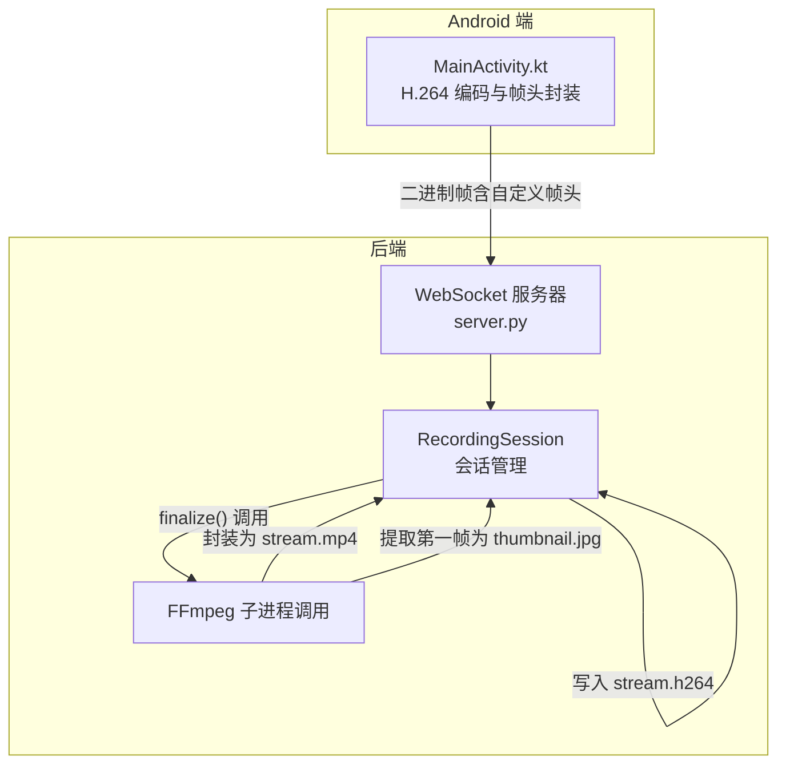
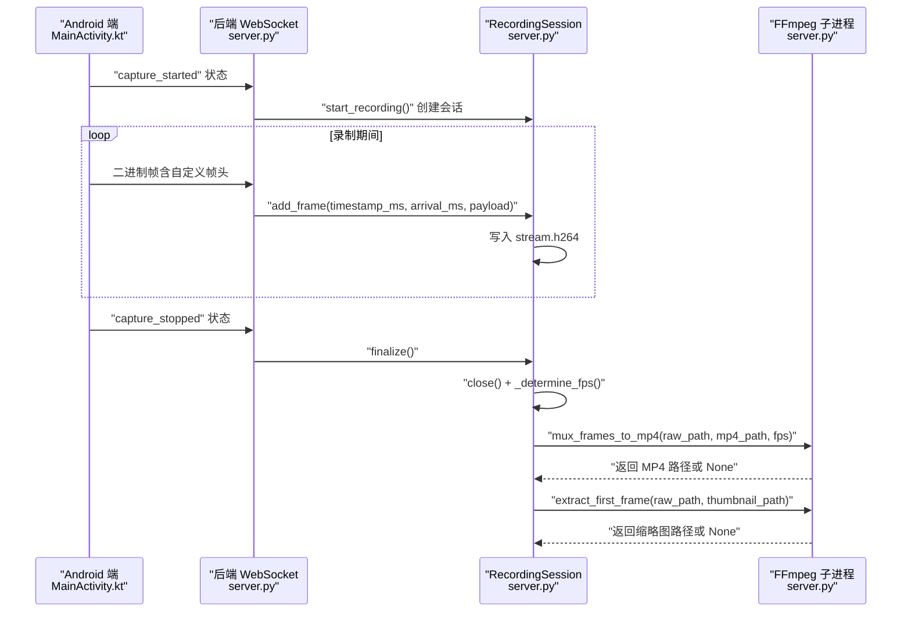
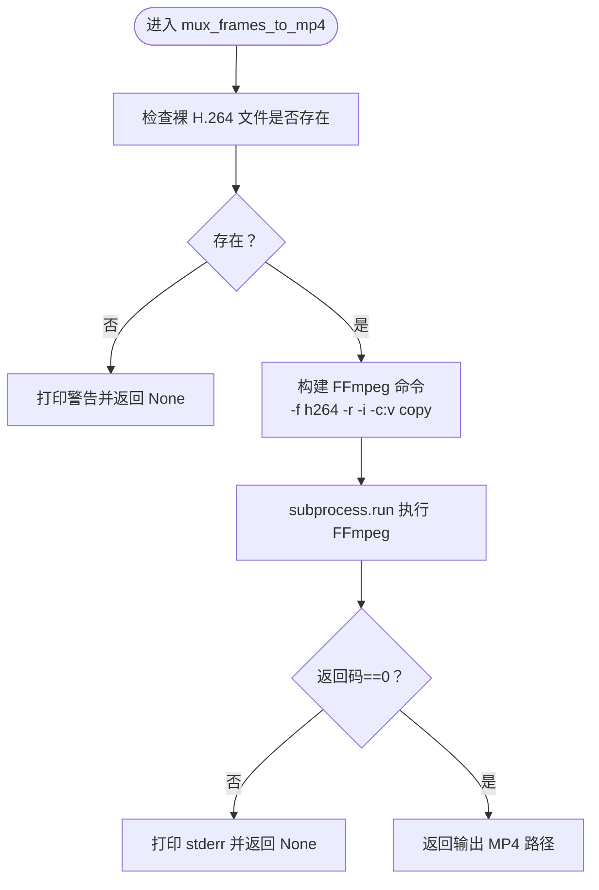
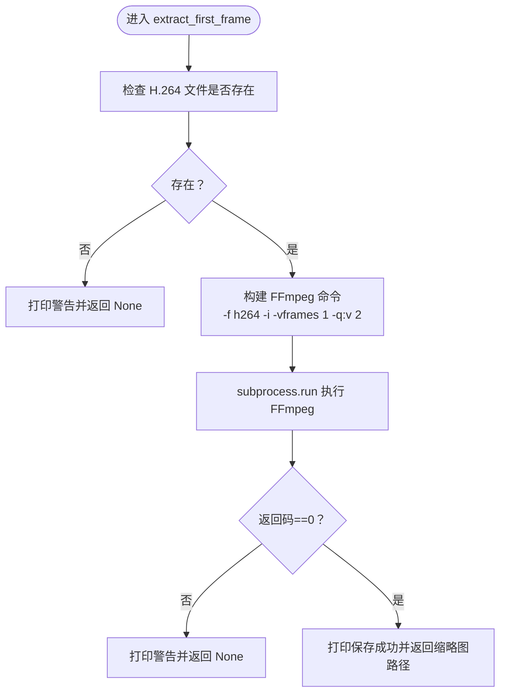
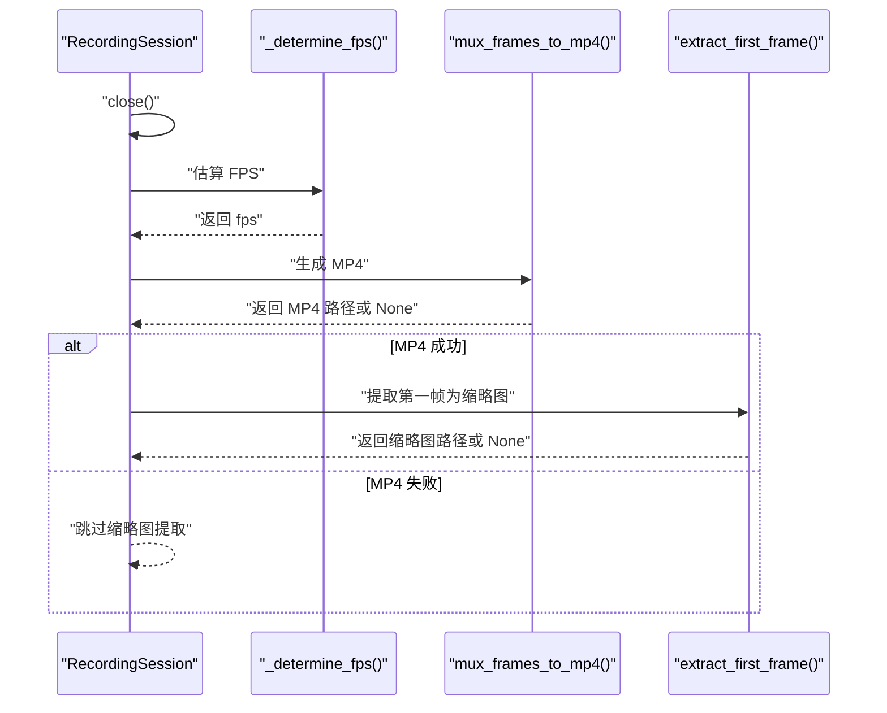
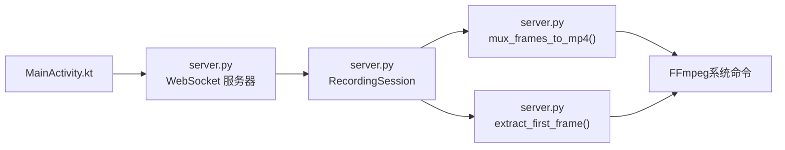

# MP4封装与缩略图提取

<cite>
**本文引用的文件**
- [server.py](file://backend/server.py)
- [README.md](file://backend/README.md)
- [MainActivity.kt](file://android-camera/app/src/main/java/com/example/lablogcamera/MainActivity.kt)
</cite>

## 目录
1. [简介](#简介)
2. [项目结构](#项目结构)
3. [核心组件](#核心组件)
4. [架构总览](#架构总览)
5. [详细组件分析](#详细组件分析)
6. [依赖关系分析](#依赖关系分析)
7. [性能考量](#性能考量)
8. [故障排查指南](#故障排查指南)
9. [结论](#结论)

## 简介
本文件聚焦于 lab-log 项目后端的两项关键能力：将原始 H.264 裸流封装为标准 MP4 容器，以及从 H.264 文件中提取第一帧生成高质量缩略图（thumbnail.jpg）。文档围绕后端 Python 服务中的 mux_frames_to_mp4 与 extract_first_frame 两个函数展开，详细说明其参数设计、错误处理策略、与 Android 端协作流程，以及在 finalize() 方法中的调用时机与对系统性能与存储的影响。

## 项目结构
- 后端核心：backend/server.py 提供 WebSocket 服务器、录制会话管理、H.264 裸流写入、MP4 封装与缩略图提取。
- Android 端：android-camera/app/src/main/java/com/example/lablogcamera/MainActivity.kt 负责 H.264 编码、帧头封装（含设备时间戳）、通过 WebSocket 发送到后端。
- 录制产物：recordings/<client>_<timestamp>/ 下生成 stream.h264、stream.mp4 与 thumbnail.jpg。

图表来源
- [server.py](file://backend/server.py#L26-L133)
- [MainActivity.kt](file://android-camera/app/src/main/java/com/example/lablogcamera/MainActivity.kt#L944-L1201)

章节来源
- [server.py](file://backend/server.py#L26-L133)
- [README.md](file://backend/README.md#L1-L33)

## 核心组件
- RecordingSession：负责单客户端录制会话的生命周期管理，包括裸 H.264 写入、时间戳记录、FPS 估算、最终封装与缩略图提取。
- mux_frames_to_mp4：调用 FFmpeg 将 H.264 裸流封装为 MP4，参数设计强调显式帧率与无损拷贝。
- extract_first_frame：从 H.264 文件提取第一帧并保存为高质量 JPEG 缩略图。
- finalize()：在会话结束时统一调用上述两个函数，确保产物生成。

章节来源
- [server.py](file://backend/server.py#L26-L133)
- [server.py](file://backend/server.py#L150-L207)

## 架构总览
后端通过 WebSocket 接收 Android 端发送的二进制帧（自定义帧头 + H.264 负载），在 RecordingSession 中写入 stream.h264。录制结束后，finalize() 估算 FPS 并调用 FFmpeg 完成 MP4 封装，随后提取第一帧生成缩略图。

图表来源
- [server.py](file://backend/server.py#L210-L231)
- [server.py](file://backend/server.py#L64-L78)
- [server.py](file://backend/server.py#L150-L207)
- [MainActivity.kt](file://android-camera/app/src/main/java/com/example/lablogcamera/MainActivity.kt#L944-L1201)

## 详细组件分析

### mux_frames_to_mp4：H.264 到 MP4 的高效封装
- 功能概述
  - 使用 FFmpeg 将 H.264 裸流封装为 MP4，避免播放器因帧率推断错误导致“1fps 视频”等问题。
  - 采用 -c:v copy 直接拷贝视频轨，实现无重编码、无损、快速封装。
- 关键参数设计
  - -f h264：明确输入为裸 H.264，避免 FFmpeg 误判。
  - -r <fps>：显式传入估算的帧率，确保时间轴与播放器一致。
  - -c:v copy：不重编码，直接复制视频轨，速度最快且无质量损失。
- 错误处理
  - 输入文件不存在时跳过封装并返回 None。
  - FFmpeg 返回码非 0 时打印 stderr 并返回 None。
- 调用时机
  - 在 RecordingSession.finalize() 中被调用，前提是会话已关闭并成功估算 FPS。

图表来源
- [server.py](file://backend/server.py#L150-L179)

章节来源
- [server.py](file://backend/server.py#L150-L179)
- [README.md](file://backend/README.md#L89-L114)

### extract_first_frame：高质量缩略图提取
- 功能概述
  - 从 H.264 文件中提取第一帧，保存为 thumbnail.jpg，用于预览与索引。
- 关键参数设计
  - -f h264：明确输入为裸 H.264。
  - -vframes 1：仅解码并输出第一帧。
  - -q:v 2：设置高质量 JPEG 编码质量（2-31，2 为最高质量）。
- 错误处理
  - 输入文件不存在时跳过提取并返回 None。
  - FFmpeg 返回码非 0 时打印 stderr 并返回 None。
- 调用时机
  - 在 RecordingSession.finalize() 成功生成 MP4 后调用，确保缩略图与视频内容一致。

图表来源
- [server.py](file://backend/server.py#L181-L207)

章节来源
- [server.py](file://backend/server.py#L181-L207)

### finalize()：会话结束时的统一收尾
- 流程要点
  - 关闭裸 H.264 文件。
  - 估算 FPS（优先服务器到达时间，其次设备时间戳，最后保底 10 FPS）。
  - 调用 mux_frames_to_mp4 生成 MP4。
  - 若 MP4 生成成功，调用 extract_first_frame 生成缩略图。
- 与 Android 端协作
  - Android 端在 start_streaming 中以固定旋转方向（已在 App 内完成）进行编码与发送，后端无需再次旋转。
  - 帧头包含设备时间戳，后端据此估算 FPS，提升封装后时间轴准确性。

图表来源
- [server.py](file://backend/server.py#L64-L78)
- [server.py](file://backend/server.py#L80-L133)

章节来源
- [server.py](file://backend/server.py#L64-L78)
- [server.py](file://backend/server.py#L80-L133)

## 依赖关系分析
- 外部工具
  - FFmpeg：作为系统级命令行工具，通过环境变量 FFMPEG_BIN 可定制路径。
- 内部模块
  - server.py：定义 RecordingSession、mux_frames_to_mp4、extract_first_frame、finalize_recording 等。
  - MainActivity.kt：负责 H.264 编码、帧头封装（含设备时间戳）、通过 WebSocket 发送帧。
- 关系图

图表来源
- [server.py](file://backend/server.py#L210-L231)
- [server.py](file://backend/server.py#L150-L207)
- [MainActivity.kt](file://android-camera/app/src/main/java/com/example/lablogcamera/MainActivity.kt#L944-L1201)

章节来源
- [server.py](file://backend/server.py#L150-L207)
- [server.py](file://backend/server.py#L210-L231)
- [MainActivity.kt](file://android-camera/app/src/main/java/com/example/lablogcamera/MainActivity.kt#L944-L1201)

## 性能考量
- 封装性能
  - 使用 -c:v copy 无重编码，封装速度极快，CPU 占用低，适合实时/准实时场景。
  - 显式帧率 -r <fps> 避免 FFmpeg 依赖不可靠的码流推断，减少时间轴误差。
- 存储影响
  - MP4 封装不改变视频内容，仅增加容器元数据，存储开销与原始 H.264 基本一致。
  - 缩略图采用 -q:v 2 的高质量 JPEG，体积相对较大，但仅一张，影响有限。
- FPS 估算
  - 优先使用服务器到达时间估算，更贴近实际接收节奏；若不可用则回退设备时间戳；均不可用时使用保底 10 FPS，确保封装稳定。

[本节为通用性能建议，不直接分析具体文件]

## 故障排查指南
- FFmpeg 未安装或不可执行
  - 现象：mux_frames_to_mp4 与 extract_first_frame 返回 None，并打印 stderr。
  - 处理：安装 FFmpeg 并确保可在命令行直接调用；或设置环境变量 FFMPEG_BIN 指向可执行文件路径。
- 输入文件缺失
  - 现象：若录制过程中未产生任何帧，或文件被意外删除，封装与缩略图提取会跳过并打印警告。
  - 处理：确认 Android 端已开始采集并发送帧；检查网络与 WebSocket 连接状态。
- 帧率估算异常
  - 现象：FPS 估算结果偏低或不可用，导致封装后播放速度异常。
  - 处理：检查 Android 端帧头时间戳是否正确；确认服务器到达时间记录有效；必要时降低目标帧率以减少丢帧。

章节来源
- [server.py](file://backend/server.py#L150-L179)
- [server.py](file://backend/server.py#L181-L207)
- [README.md](file://backend/README.md#L278-L291)

## 结论
- mux_frames_to_mp4 通过明确输入格式、显式帧率与无重编码拷贝，实现了对 H.264 裸流的高速、稳定封装，显著提升了 MP4 的播放体验与兼容性。
- extract_first_frame 以高质量参数提取首帧，生成直观的缩略图，便于内容索引与预览。
- finalize() 在会话结束时统一调度这两项操作，配合 Android 端的帧头时间戳与固定旋转策略，确保封装后视频的时间轴准确、播放流畅。
- 性能方面，无重编码封装与高质量缩略图的组合在保证质量的同时，尽量降低了 CPU 与存储压力；错误处理完善，便于运维与排障。