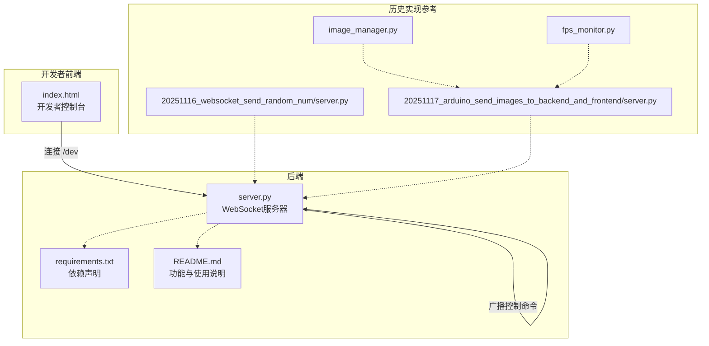
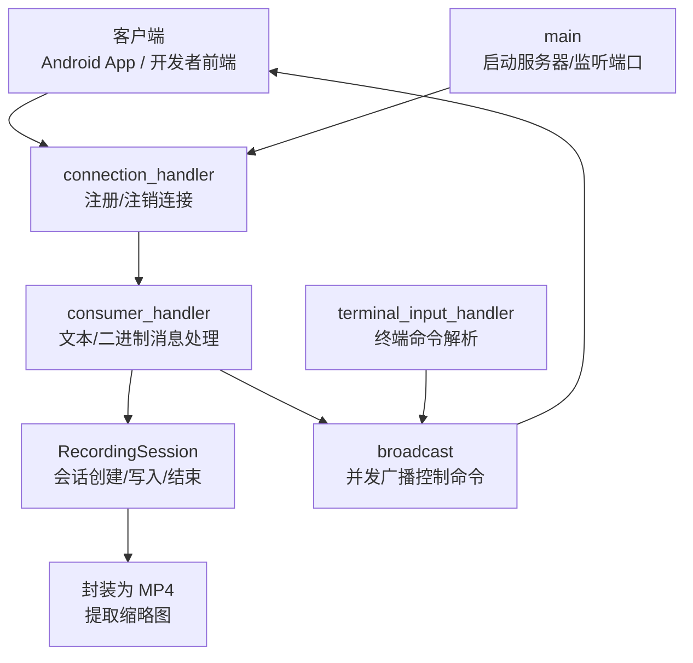
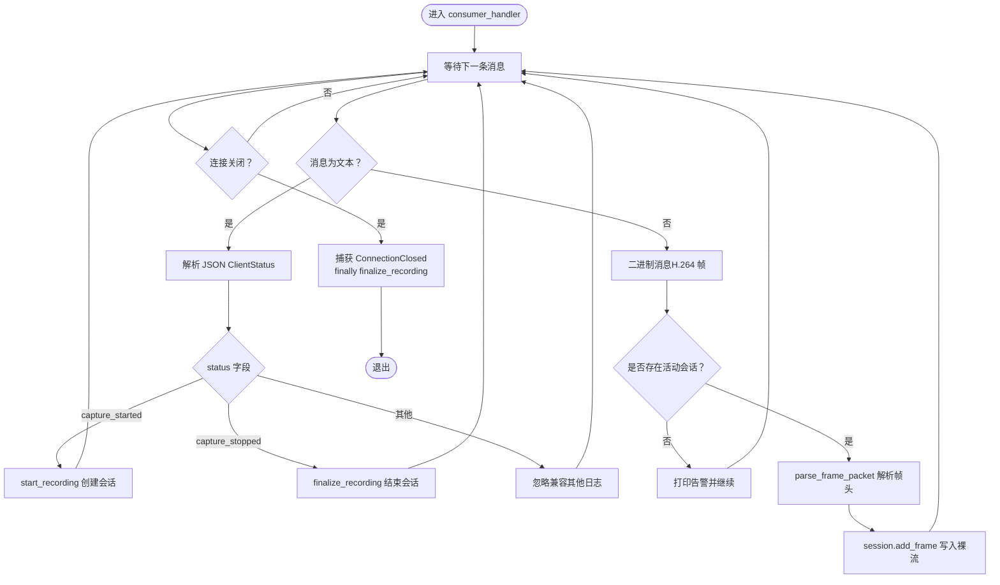
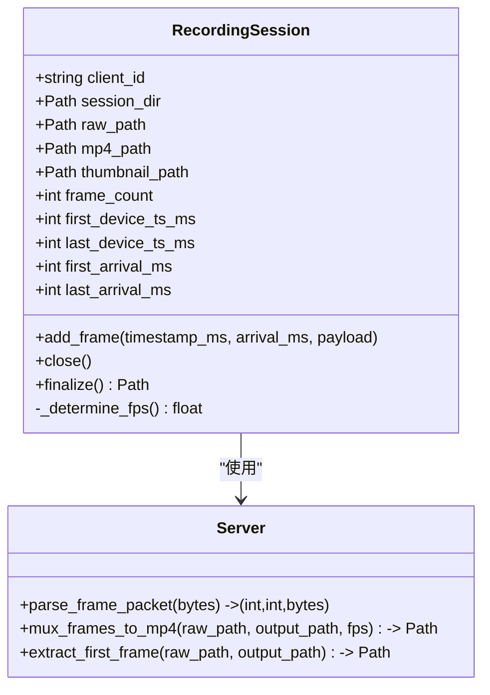
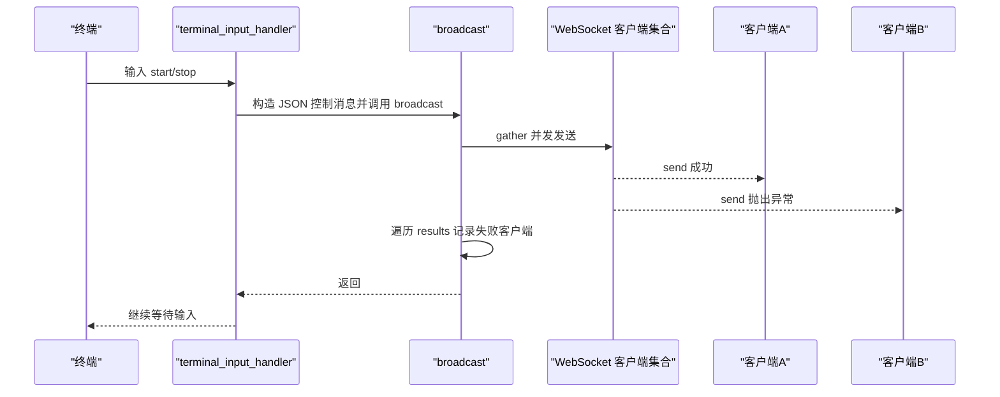
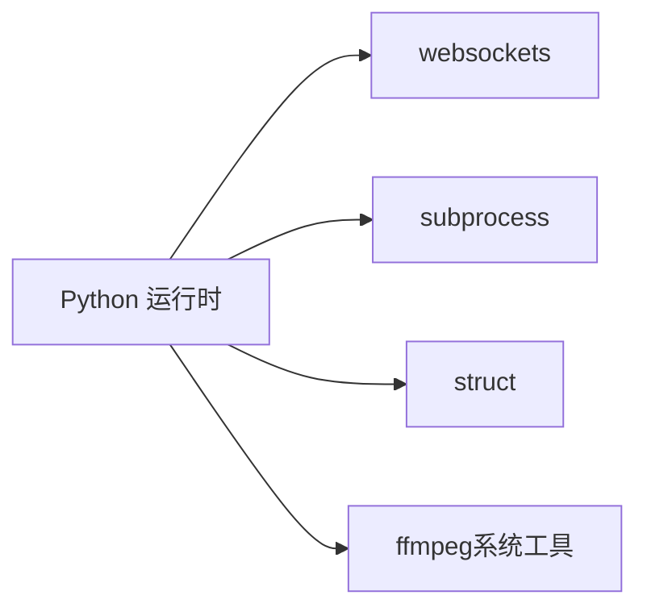

# WebSocket服务

<cite>
**本文引用的文件**
- [server.py](file://backend/server.py)
- [requirements.txt](file://backend/requirements.txt)
- [README.md](file://backend/README.md)
- [index.html](file://developer-frontend/index.html)
- [server.py（历史版本1）](file://archive/20251116_websocket_send_random_num/backend/server.py)
- [server.py（历史版本2）](file://archive/20251117_arduino_send_images_to_backend_and_frontend/backend/server.py)
- [image_manager.py](file://archive/20251117_arduino_send_images_to_backend_and_frontend/backend/image_manager.py)
- [fps_monitor.py](file://archive/20251117_arduino_send_images_to_backend_and_frontend/backend/fps_monitor.py)
</cite>

## 目录
1. [简介](#简介)
2. [项目结构](#项目结构)
3. [核心组件](#核心组件)
4. [架构总览](#架构总览)
5. [组件详解](#组件详解)
6. [依赖关系分析](#依赖关系分析)
7. [性能考量](#性能考量)
8. [故障排查指南](#故障排查指南)
9. [结论](#结论)
10. [附录](#附录)

## 简介
本文件面向 lab-log 项目的后端 WebSocket 服务，聚焦于基于 Python asyncio 与 websockets 库构建的异步服务器架构。文档围绕以下主题展开：
- connection_handler 作为新客户端连接的入口点，负责客户端注册与注销，并将连接委托给 consumer_handler 处理消息收发。
- consumer_handler 对文本消息（JSON 格式的 ClientStatus）与二进制消息（H.264 视频帧）进行区分处理，包含帧头解析、会话管理、异常处理与连接关闭逻辑。
- broadcast 机制如何实现从服务器终端向所有已连接 Android 客户端广播控制命令（如 start_capture/stop_capture），并使用 asyncio.gather 进行并发发送与错误隔离。
- 服务器启动流程（main 函数）、监听地址（ws://0.0.0.0:50001）与端口（50001）的具体信息，以及消息流转过程的可视化说明。

## 项目结构
后端 WebSocket 服务位于 backend/server.py，核心依赖为 websockets。README.md 提供了完整的功能说明、帧头约定、录制会话生命周期、终端控制命令与运行步骤等。

图表来源
- [server.py](file://backend/server.py#L425-L440)
- [requirements.txt](file://backend/requirements.txt#L1-L3)
- [README.md](file://backend/README.md#L1-L291)
- [index.html](file://developer-frontend/index.html#L297-L569)
- [server.py（历史版本1）](file://archive/20251116_websocket_send_random_num/backend/server.py#L1-L52)
- [server.py（历史版本2）](file://archive/20251117_arduino_send_images_to_backend_and_frontend/backend/server.py#L1-L290)
- [image_manager.py](file://archive/20251117_arduino_send_images_to_backend_and_frontend/backend/image_manager.py#L1-L90)
- [fps_monitor.py](file://archive/20251117_arduino_send_images_to_backend_and_frontend/backend/fps_monitor.py#L1-L67)

章节来源
- [server.py](file://backend/server.py#L1-L440)
- [requirements.txt](file://backend/requirements.txt#L1-L3)
- [README.md](file://backend/README.md#L1-L291)
- [index.html](file://developer-frontend/index.html#L297-L569)

## 核心组件
- 连接入口：connection_handler
  - 负责将新连接加入全局集合 CONNECTED_CLIENTS，记录客户端标识与请求路径，并委托 consumer_handler 处理消息。
- 消息处理器：consumer_handler
  - 区分文本消息（JSON ClientStatus）与二进制消息（H.264 帧），解析帧头并写入会话，处理连接关闭与异常。
- 录制会话：RecordingSession
  - 为每个客户端的每次录制创建独立目录，写入裸 H.264 流，结束时封装为 MP4 并提取缩略图。
- 广播器：broadcast
  - 使用 asyncio.gather 并开启 return_exceptions，向所有已连接客户端并发发送控制命令，同时记录失败客户端。
- 终端输入：terminal_input_handler
  - 从服务器命令行读取 start/stop 命令，构造 JSON 控制消息并通过 broadcast 下发。
- 服务器启动：main
  - 监听 ws://0.0.0.0:50001，启动终端输入任务，持续运行。

章节来源
- [server.py](file://backend/server.py#L210-L303)
- [server.py](file://backend/server.py#L233-L280)
- [server.py](file://backend/server.py#L26-L133)
- [server.py](file://backend/server.py#L305-L324)
- [server.py](file://backend/server.py#L326-L423)
- [server.py](file://backend/server.py#L425-L440)

## 架构总览
WebSocket 服务器采用“连接入口 + 消息处理器 + 会话管理 + 广播 + 终端控制”的分层设计。客户端通过不同路径接入（/android-cam 用于相机推流，/dev 用于开发者控制台），但统一由 connection_handler 注册与注销，consumer_handler 负责消息分发与录制会话生命周期管理。

图表来源
- [server.py](file://backend/server.py#L282-L303)
- [server.py](file://backend/server.py#L233-L280)
- [server.py](file://backend/server.py#L26-L133)
- [server.py](file://backend/server.py#L305-L324)
- [server.py](file://backend/server.py#L326-L423)
- [server.py](file://backend/server.py#L425-L440)

## 组件详解

### connection_handler：连接入口与注册/注销
- 功能要点
  - 将新连接加入全局集合 CONNECTED_CLIENTS，便于后续广播。
  - 记录客户端标识（IP:Port）与请求路径，用于日志追踪。
  - 调用 consumer_handler 处理消息；在 finally 中移除连接并打印日志。
- 关键行为
  - 注册：CONNECTED_CLIENTS.add(websocket)
  - 注销：finally 中 CONNECTED_CLIENTS.remove(websocket)
  - 委托：await consumer_handler(websocket)

章节来源
- [server.py](file://backend/server.py#L282-L303)

### consumer_handler：消息处理与会话管理
- 文本消息（JSON ClientStatus）
  - 识别 capture_started/capture_stopped，分别调用 start_recording 和 finalize_recording。
  - 解析失败时忽略，保证健壮性。
- 二进制消息（H.264 帧）
  - 依赖自定义帧头格式（设备时间戳、帧序号、负载长度），通过 parse_frame_packet 解析。
  - 写入当前 RecordingSession，记录服务器到达时间，用于后续 FPS 估算。
- 异常与关闭
  - 捕获 ConnectionClosed，打印断开原因。
  - finally 中调用 finalize_recording，确保会话结束并尝试生成 MP4。
- 会话生命周期
  - start_recording：创建 RecordingSession 并绑定到当前 websocket。
  - finalize_recording：关闭裸流文件、封装 MP4、提取缩略图、打印结果。

图表来源
- [server.py](file://backend/server.py#L233-L280)
- [server.py](file://backend/server.py#L135-L148)
- [server.py](file://backend/server.py#L210-L232)

章节来源
- [server.py](file://backend/server.py#L233-L280)
- [server.py](file://backend/server.py#L135-L148)
- [server.py](file://backend/server.py#L210-L232)

### 录制会话 RecordingSession：裸 H.264 写入与封装
- 目录与文件
  - 为每个会话创建独立目录，包含 stream.h264、stream.mp4、thumbnail.jpg。
- 写入策略
  - add_frame 追加写入裸 H.264，累计帧数与时间戳范围。
- 结束与封装
  - finalize 关闭文件，估算 FPS，调用 mux_frames_to_mp4 封装为 MP4，extract_first_frame 提取缩略图。
- FPS 估算规则
  - 优先使用服务器到达时间估算，若不可信则回退到设备时间戳；两者都不可用时使用保底 10 FPS。

图表来源
- [server.py](file://backend/server.py#L26-L133)
- [server.py](file://backend/server.py#L135-L208)

章节来源
- [server.py](file://backend/server.py#L26-L133)
- [server.py](file://backend/server.py#L135-L208)

### 广播 broadcast：并发发送与错误隔离
- 并发发送
  - 使用 asyncio.gather(*[client.send(msg) for client in CONNECTED_CLIENTS], return_exceptions=True)。
- 错误隔离
  - return_exceptions=True 使单个客户端发送失败不会影响其他客户端；遍历 results 记录异常。
- 使用场景
  - terminal_input_handler 解析 start/stop 命令后调用 broadcast，向所有已连接 Android App 下发控制指令。

图表来源
- [server.py](file://backend/server.py#L305-L324)
- [server.py](file://backend/server.py#L326-L423)

章节来源
- [server.py](file://backend/server.py#L305-L324)
- [server.py](file://backend/server.py#L326-L423)

### 服务器启动 main：监听地址与端口
- 监听地址与端口
  - 服务器在 0.0.0.0:50001 监听，使用 websockets.serve(connection_handler, "0.0.0.0", 50001)。
- 启动流程
  - 启动 websockets 服务，打印启动日志。
  - 创建并运行 terminal_input_handler 任务，与服务器一起持续运行。

章节来源
- [server.py](file://backend/server.py#L425-L440)
- [README.md](file://backend/README.md#L1-L291)

### 历史实现对比与演进
- 早期随机数示例（20251116）
  - 单连接处理 handle_client，文本消息解析为 JSON，异常捕获 ConnectionClosed。
- Arduino/MJPEG 历史版本（20251117）
  - 多路径路由（/esp 与 /dev），分别处理 Arduino 客户端与开发者前端。
  - 引入 ImageManager 与 FPSMonitor，展示二进制图片处理与 FPS 统计。
  - 与当前 H.264 录制方案相比，历史版本侧重 MJPEG 图片流与实时统计，而当前版本专注于 H.264 裸流录制与封装。

章节来源
- [server.py（历史版本1）](file://archive/20251116_websocket_send_random_num/backend/server.py#L1-L52)
- [server.py（历史版本2）](file://archive/20251117_arduino_send_images_to_backend_and_frontend/backend/server.py#L1-L290)
- [image_manager.py](file://archive/20251117_arduino_send_images_to_backend_and_frontend/backend/image_manager.py#L1-L90)
- [fps_monitor.py](file://archive/20251117_arduino_send_images_to_backend_and_frontend/backend/fps_monitor.py#L1-L67)

## 依赖关系分析
- 直接依赖
  - websockets：提供异步 WebSocket 服务器与客户端能力。
- 间接依赖
  - subprocess：调用 ffmpeg 封装 MP4 与提取缩略图。
  - struct：解析自定义帧头（设备时间戳、帧序号、负载长度）。
- 外部工具
  - ffmpeg：必须安装并可在命令行直接调用，可通过环境变量指定路径。

图表来源
- [server.py](file://backend/server.py#L1-L20)
- [server.py](file://backend/server.py#L150-L208)
- [requirements.txt](file://backend/requirements.txt#L1-L3)

章节来源
- [server.py](file://backend/server.py#L1-L20)
- [server.py](file://backend/server.py#L150-L208)
- [requirements.txt](file://backend/requirements.txt#L1-L3)

## 性能考量
- 并发广播
  - 使用 asyncio.gather 并 return_exceptions，避免单个客户端阻塞其他客户端的发送。
- 无重编码封装
  - 使用 -c:v copy 直接拷贝视频轨，减少 CPU 开销，提升吞吐。
- 时间戳估算
  - 优先使用服务器到达时间估算 FPS，提高准确性；若不可用回退到设备时间戳与保底值。
- I/O 优化
  - 二进制裸流顺序写入，避免频繁 seek；会话结束时一次性封装为 MP4，降低碎片化。

章节来源
- [server.py](file://backend/server.py#L305-L324)
- [server.py](file://backend/server.py#L150-L208)
- [server.py](file://backend/server.py#L80-L133)

## 故障排查指南
- 无法连接
  - 检查服务器是否在 0.0.0.0:50001 监听，确认防火墙与网络可达。
  - Android App 请求路径应为 ws://<host>:50001/android-cam。
- 控制命令无效
  - 确认终端输入 start/stop 命令格式正确，且有已连接客户端。
  - 查看 broadcast 输出，定位发送失败的客户端。
- 录制文件缺失或为空
  - 检查 ffmpeg 是否安装并可执行；必要时设置环境变量 FFMPEG_BIN。
  - 确认 consumer_handler 已解析帧头并写入裸流。
- 连接异常断开
  - 查看 ConnectionClosed 的 code 与 reason，结合日志定位问题。
  - 确保 Android App 在停止录制时上报 capture_stopped，触发 finalize_recording。

章节来源
- [README.md](file://backend/README.md#L1-L291)
- [server.py](file://backend/server.py#L305-L324)
- [server.py](file://backend/server.py#L233-L280)
- [server.py](file://backend/server.py#L150-L208)

## 结论
本 WebSocket 服务以 asyncio 与 websockets 为核心，实现了从连接注册、消息分发、录制会话管理到并发广播与封装输出的完整链路。通过严格的帧头解析、会话生命周期管理与错误隔离策略，系统在高并发与复杂网络环境下仍能稳定运行。终端控制命令与广播机制进一步提升了运维效率与自动化能力。

## 附录
- 自定义帧头格式
  - 大端字节序，包含设备时间戳（uint64）、帧序号（uint32）、负载长度（uint32），随后为 H.264 裸码流。
- 录制输出
  - recordings/<client>_<timestamp>/ 下生成 stream.h264、stream.mp4 与 thumbnail.jpg。
- 开发者前端
  - 提供 /dev 控制台，便于测试与演示，URL 默认指向 ws://pqzc1405495.bohrium.tech:50001/dev。

章节来源
- [README.md](file://backend/README.md#L1-L291)
- [index.html](file://developer-frontend/index.html#L297-L569)